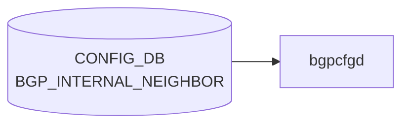

# BGP_INTERNAL_NEIGHBOR テーブル

## 概要

[multi-ASIC](../../reference/glossary.md#term-multi-asic) プラットフォームおよび chassis-packet スイッチにおける内部 [iBGP](../../reference/glossary.md#term-ibgp) 隣接を [CONFIG_DB](../../reference/glossary.md#term-config_db) で定義するテーブル。通常の `BGP_NEIGHBOR` と同じ `BGPPeerMgrBase` が処理するが、`peer_type="internal"` で初期化され `bgpd/templates/internal/` テンプレートを使用する[^1]。

**このテーブルが生成されるのは以下のプラットフォームに限定される**:

- **multi-ASIC 機器**: FrontEnd ASIC と BackEnd ASIC 間のスライス間 iBGP セッション（`enable_internal_bgp_session()` が `admin_status='up'` を強制設定）
- **chassis-packet** 型スイッチ: `<ChassisInternal>chassis-packet</ChassisInternal>` を持つ `BGPSession` エントリ（minigraph パーサが `bgp_internal_sessions` に分類）

`VOQ chassis` 向け iBGP は **別テーブル** `BGP_VOQ_CHASSIS_NEIGHBOR` を使用し、本テーブルには入らない。

<!-- cdb-mermaid -->
### データフロー (自動生成)



!!! note "凡例"
    CONFIG_DB から SAI までの典型経路を `docs/reference/config-db-orch-map.md` から機械生成したミニ図。詳細・例外は本ページ本文と対応表を参照。
<!-- /cdb-mermaid -->

## key 構造

```text
BGP_INTERNAL_NEIGHBOR|<neighbor>
```

`<neighbor>` は IP アドレス（IPv4 / IPv6）。[YANG](../../reference/glossary.md#term-yang) の `local_addr` は `mandatory true` で必須（`BGP_NEIGHBOR` と異なる制約）。`asn` は `DEVICE_METADATA.localhost.bgp_asn` と一致しなければならない（same-AS iBGP のみ）。

## 主要フィールド

`sonic-bgp-internal-neighbor.yang` は `sonic-bgp-common.yang` の `sonic-bgp-cmn-neigh` grouping を `uses` する。

| フィールド | 型 | 備考 |
|----------|----|------|
| `neighbor` (key) | ip-address | iBGP peer アドレス |
| `asn` | as-number | `DEVICE_METADATA.bgp_asn` と同値必須 |
| `local_addr` | ip-address | **mandatory**（BGP_NEIGHBOR は任意） |
| `name` | string | peer ホスト名 |
| `holdtime` | uint16 | デフォルト 180 |
| `keepalive` | uint16 | デフォルト 60 |
| `admin_status` | `up`/`down` | minigraph 生成時は常に `up` |

## 購読者

- `bgpcfgd` (`docker-fpm-frr` 内): `BGPPeerMgrBase(..., "internal", False)` として登録。`frrcfgd.py` はこのテーブルを購読しない
- `bgpd` ([FRR](../../reference/glossary.md#term-frr)): vtysh 経由で間接反映

## 関連 CONFIG_DB / YANG

- `BGP_NEIGHBOR`: 通常の外部・iBGP 隣接（multi-ASIC 以外の汎用テーブル）
- `BGP_VOQ_CHASSIS_NEIGHBOR`: VOQ chassis 専用iBGP（`voq_chassis` テンプレート使用）
- `DEVICE_METADATA.localhost.switch_type`: `chassis-packet` 判定に使用
- `DEVICE_METADATA.localhost.sub_role`: `BackEnd`/`FrontEnd` 判定に使用

<!-- derivation -->
## 派生・条件付き登録 (Phase 6/7)

### Phase 6: 値による他フィールド自動派生

| 条件 | 派生先 | evidence |
|---|---|---|
| `<BGPSession>` の `<ChassisInternal>` == `"chassis-packet"` または BgpGroup の Start/End が `CHASSIS_CARD_PACKET` | `BGP_INTERNAL_NEIGHBOR` テーブルに分類、`admin_status='up'` を強制 | `minigraph.py:1341-1350` |
| FrontEnd ASIC と BackEnd ASIC 間のセッション（multi-ASIC、`enable_internal_bgp_session()`） | `admin_status='up'` を上書き | `minigraph.py:1888-1901` |
| `<ChassisInternal>` == `"voq"` または BgpGroup が `CHASSIS_CARD_VOQ` | `BGP_VOQ_CHASSIS_NEIGHBOR` テーブルに分類（本テーブルには入らない） | `minigraph.py:1345-1347` |

### Phase 7: 条件付き module/manager 登録

| 条件 | 登録 module | evidence |
|---|---|---|
| 常時（条件なし） | `BGPPeerMgrBase(common_objs, "CONFIG_DB", CFG_BGP_INTERNAL_NEIGHBOR_TABLE_NAME, "internal", False)` | `bgpcfgd/main.py:88` |
| `peer_type == 'internal'` のとき | `Loopback4096` への依存関係を deps に追加（他 peer_type には追加されない） | `managers_bgp.py:145-146` |
| `check_neig_meta=False`（内部 peer は固定 False） | DEVICE_NEIGHBOR_METADATA 依存なし | `bgpcfgd/main.py:88`、`managers_bgp.py:128-133` |

### grep カバレッジ

- `minigraph.py` L1349: `bgp_internal_sessions` への代入（chassis-packet 分岐）
- `minigraph.py` L1352: `bgp_internal_sessions` への代入（multi-ASIC 分岐）
- `minigraph.py` L2276: `results['BGP_INTERNAL_NEIGHBOR'] = bgp_internal_sessions`
- `bgpcfgd/main.py` L88: 条件なし登録
<!-- /derivation -->

<!-- handler-branching -->
### Phase 8: Handler メソッド内分岐

| Manager / Handler | メソッド | 分岐条件 | 効果 | evidence |
|---|---|---|---|---|
| `BGPPeerMgrBase` | `set_handler()` | `peer_key NOT IN self.peers` | `add_peer()` 新規追加 | `managers_bgp.py:167` |
| `BGPPeerMgrBase` | `set_handler()` | `peer_key IN self.peers` | `update_peer()` 更新 | `managers_bgp.py:169` |
| `BGPPeerMgrBase` | `add_peer()` | `lo_ipv4 is None AND bgp_router_id not configured` | 早期 `return False`（`Loopback0` または router-id 要求） | `managers_bgp.py:186-189` |
| `BGPPeerMgrBase` | `add_peer()` | `"local_addr" not in data` | `log_warn` のみ（peer 追加は続行） | `managers_bgp.py:194-195` |
| `BGPPeerMgrBase` | `update_peer()` | `"admin_status" in data` | `change_admin_status()` 委譲 | `managers_bgp.py:314` |

> **スキャン証跡**: `BGPPeerMgrBase` `peer_type="internal"` の特有分岐は `__init__` の `Loopback4096` 依存追加のみ（L145-146）。`set_handler` / `add_peer` の処理は `general` peer_type と共通。

<!-- /handler-branching -->

<!-- platform -->
## プラットフォーム差異 (Phase H)

### 対象プラットフォーム

`BGP_INTERNAL_NEIGHBOR` テーブルは **multi-ASIC** プラットフォームおよび **chassis-packet** スイッチ専用である。シングル ASIC 非 chassis 機器では minigraph パーサがこのテーブルに一切エントリを生成しない。

### `bgpd/templates/internal/policies.conf.j2` の分岐

`policies.conf.j2` は `DEVICE_METADATA.localhost.sub_role` および `switch_type` に応じて 3 分岐する:

| 分岐条件 | 生成される FRR 設定 | evidence |
|---|---|---|
| `sub_role == 'BackEnd'` | `FROM_BGP_INTERNAL_PEER_V4/V6` に `set originator-id`（router-id または Loopback4096 IP） | `internal/policies.conf.j2:8-27` |
| `switch_type == 'chassis-packet'` | community-list 定義 + `FROM/TO_BGP_INTERNAL_PEER_V4/V6` に community tag・delete 操作。`DownstreamLC` サブタイプとその他で `TO_BGP_INTERNAL_PEER` の `set tag` 有無が異なる | `internal/policies.conf.j2:28-93` |
| それ以外（multi-ASIC FrontEnd など） | `FROM_BGP_INTERNAL_PEER_V6 permit 1` の `set ipv6 next-hop prefer-global` のみ（最小限の policy） | `internal/policies.conf.j2:94-97` |

#### chassis-packet における subtype 分岐

| subtype | `FROM_BGP_INTERNAL_PEER_V4 permit 3` の効果 |
|---|---|
| `DownstreamLC` | fallback community を delete のみ（`set tag` なし） |
| その他（`UpstreamLC` 等） | fallback community を delete + `set tag route_eligible_for_fallback_to_default_tag` |

### managers_bgp.py の内部 peer 固有分岐

| 条件 | 効果 | evidence |
|---|---|---|
| `peer_type == 'internal'`（BGP_INTERNAL_NEIGHBOR） | `Loopback4096` を deps に追加（他 peer_type にはない依存） | `managers_bgp.py:145-146` |
| `peer_type == 'internal'`（BGP_INTERNAL_NEIGHBOR） | `check_neig_meta=False` 固定（DEVICE_NEIGHBOR_METADATA に依存しない） | `bgpcfgd/main.py:88` |

### frrcfgd.py（frr-mgmt-framework パス）

`frrcfgd.py` は `BGP_INTERNAL_NEIGHBOR` を購読しない。このテーブルは `bgpcfgd` 専用パスのみで処理される。`DEVICE_METADATA.frr_mgmt_framework_config=true` の構成でも内部 iBGP は `bgpcfgd` が担当する。

**根拠**: `frrcfgd.py` 全体を `BGP_INTERNAL_NEIGHBOR` / `internal_neighbor` でスキャンしたが一致なし（`sonic-buildimage/src/sonic-frr-mgmt-framework/frrcfgd/frrcfgd.py`）。

### VOQ chassis との差異

| 属性 | BGP_INTERNAL_NEIGHBOR (chassis-packet / multi-ASIC) | BGP_VOQ_CHASSIS_NEIGHBOR (VOQ chassis) |
|---|---|---|
| テンプレートディレクトリ | `bgpd/templates/internal/` | `bgpd/templates/voq_chassis/` |
| route-map 名 | `FROM/TO_BGP_INTERNAL_PEER_V4/V6` | `FROM/TO_VOQ_CHASSIS_V4/V6_PEER` |
| subtype 分岐 | `DownstreamLC` vs その他 | `UpstreamLC` vs その他（deny vs permit で逆） |
| Loopback 依存 | `Loopback4096` | なし（`Loopback0` のみ） |

<!-- /platform -->

## 引用元

[^1]: YANG 定義: `sonic-bgp-internal-neighbor.yang` — "BGP Internal Neighbor for multi asic platforms". <https://github.com/sonic-net/sonic-buildimage/blob/9ea932ec2e18f35e58268ec2e4456b1d4afd65cd/src/sonic-yang-models/yang-models/sonic-bgp-internal-neighbor.yang>

## 関連ページ

- [CONFIG_DB: BGP_NEIGHBOR](./bgp-neighbor.md)
- [CONFIG_DB: BGP_GLOBALS](./bgp-globals.md)
- [YANG: sonic-bgp-internal-neighbor](../yang/sonic-bgp-neighbor.md)
