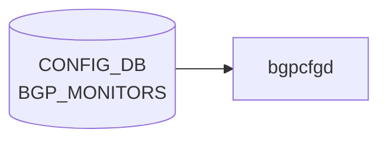

# BGP_MONITORS テーブル

## 概要

`BGP_MONITORS` テーブルは [BGP](../../reference/glossary.md#term-bgp) Monitoring Protocol (BMP) ではなく、[BGP](../../reference/glossary.md#term-bgp) モニター用の特殊隣接（route-monitor）を定義する。`bgpcfgd` がテンプレ展開して `bgpd` の `neighbor` 設定を生成する[^1]。各エントリは [BGP](../../reference/glossary.md#term-bgp) 隣接共通プロパティ (`sonic-bgp-cmn-neigh` grouping) を流用する。

<!-- cdb-mermaid -->
### データフロー (自動生成)



!!! note "凡例"
    CONFIG_DB から SAI までの典型経路を `docs/reference/config-db-orch-map.md` から機械生成したミニ図。詳細・例外は本ページ本文と対応表を参照。
<!-- /cdb-mermaid -->

## key 構造

```text
BGP_MONITORS|<addr>
```

| キー | 型 | 説明 |
|------|----|------|
| `addr` | inet:ip-address | モニター隣接の IP |

## フィールド

`sonic-bgp-common.yang` の `sonic-bgp-cmn-neigh` grouping を `uses` する。代表的 leaf:

| フィールド | 型 | 説明 |
|-----------|----|------|
| `name` | string | 隣接名。`must "current() = 'BGPMonitor'"` で `BGPMonitor` に固定 |
| `asn` | as-number | モニター AS |
| `local_addr` | ip-address | source address |
| `admin_status` | up/down | 管理状態 |
| 他 `sonic-bgp-cmn-neigh` 由来の leaf | — | keepalive/holdtime/peer_type/auth_password 等 |

## 制約

- `name` は `BGPMonitor` 固定（[YANG](../../reference/glossary.md#term-yang) `must` で強制）。複数モニターは `addr` で区別する

## 購読者

- `bgpcfgd` (`docker-fpm-frr`)
- 間接的に `bgpd` ([FRR](../../reference/glossary.md#term-frr))

## 関連 CONFIG_DB / YANG / CLI

- 関連 [CONFIG_DB](../../reference/glossary.md#term-config_db): `BGP_NEIGHBOR`、`BGP_GLOBALS`
- 関連 [YANG](../../reference/glossary.md#term-yang): `sonic-bgp-monitor`、`sonic-bgp-common`
- 関連 CLI: `config bgp`

<!-- ref-triangle:start -->

## 関連リファレンス

- [YANG](../../reference/glossary.md#term-yang): [`sonic-bgp-monitor`](../yang/sonic-bgp-monitor.md) / `sonic-bgp-common`
- CLI: [`config bgp`](../cli/config-bgp.md)

<!-- ref-triangle:end -->

## 引用元

[^1]: YANG 定義: `sonic-bgp-monitor.yang`. <https://github.com/sonic-net/sonic-buildimage/blob/9ea932ec2e18f35e58268ec2e4456b1d4afd65cd/src/sonic-yang-models/yang-models/sonic-bgp-monitor.yang>; 共通 leaf grouping は `sonic-bgp-common.yang` の `sonic-bgp-cmn-neigh`

## 関連ページ
- [CONFIG_DB: BGP_NEIGHBOR](bgp-neighbor.md)

<!-- ops-hint -->
## 運用ヒント

### 典型値

- key 形式: `BGP_MONITORS|<ip>`。
- `asn`: 監視先 AS。`admin_status`: `up`。`name`: 識別名。

### よくある誤設定

- BGP monitor を普通の neighbor と混同して route policy を当ててしまうと、本番経路に副作用が出る。

### 確認コマンド

```bash
sonic-db-cli CONFIG_DB keys 'BGP_MONITORS|*'
vtysh -c 'show bgp summary'
```
<!-- /ops-hint -->

<!-- value-behavior -->
## 値依存挙動マトリクス

### `admin_status` (sonic-bgp-cmn-neigh 由来)

| 値 | FRR コマンド | 備考 |
|----|-------------|------|
| `up` | `no neighbor <addr> shutdown` | `managers_bgp.py:334` |
| `down` | `neighbor <addr> shutdown` | `managers_bgp.py:336` |

### `name` (固定値制約)

| 値 | 動作 |
|----|------|
| `BGPMonitor` | YANG `must` 制約で強制。monitors テンプレ (`bgpd/templates/monitors/`) を使用 |
| それ以外 | YANG 検証段階で拒否 |

> **注意**: `admin_status` のみがライブ更新可能。他フィールドの変更は `bgpcfgd` に到達しても drop される (例外条件参照)。

<!-- /value-behavior -->

<!-- cdb-exceptions -->
## 例外条件・特殊挙動

| 条件 | 挙動 | ソース |
|------|------|--------|
| Loopback0 IPv4 未設定 かつ `bgp_router_id` 未設定 | `log_warn` して `return False` (再試行待ち) | `managers_bgp.py` `add_peer()` |
| `local_addr` フィールドが欠如 | `Missing attribute 'local_addr'` を warn ログ、処理は続行 (interface 紐付けなし) | `managers_bgp.py` |
| local address に対応する interface が未登録 | `wait for the corresponding interface to be set` → return False (再試行) | `managers_bgp.py` `get_local_interface()` |
| 既存ピアへの `admin_status` 以外のフィールド更新 | `Can't update the peer. Only 'admin_status' attribute is supported` を LOG_ERR → drop | `managers_bgp.py` `update_peer()` |
| `admin_status` が `'up'`/`'down'` 以外 | `wrong attribute value` を LOG_ERR → drop | `managers_bgp.py` `change_admin_status()` |
| Jinja2 テンプレートレンダリング失敗 | `log_err` して `return True` (再試行なし、drop) | `managers_bgp.py` `add_peer()` |
| `check_neig_meta=False` | BGP_MONITORS は DEVICE_NEIGHBOR_METADATA への依存なし (monitors peer_type で固定) | `managers_bgp.py` `main.py` L89 |
<!-- /cdb-exceptions -->

<!-- glossary-links-injected: a1dd9e34d62e -->
