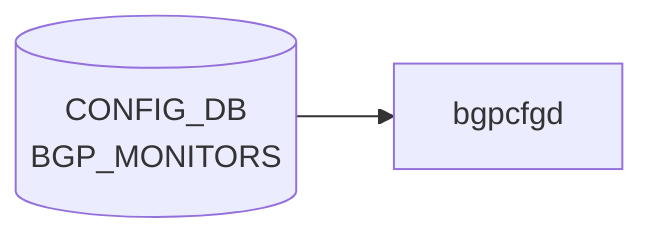

# BGP_MONITORS テーブル

## 概要

`BGP_MONITORS` テーブルは [BGP](../../reference/glossary.md#term-bgp) Monitoring Protocol (BMP) ではなく、[BGP](../../reference/glossary.md#term-bgp) モニター用の特殊隣接（route-monitor）を定義する。`bgpcfgd` がテンプレ展開して `bgpd` の `neighbor` 設定を生成する[^1]。各エントリは [BGP](../../reference/glossary.md#term-bgp) 隣接共通プロパティ (`sonic-bgp-cmn-neigh` grouping) を流用する。

<!-- cdb-mermaid -->
### データフロー (自動生成)



!!! note "凡例"
    CONFIG_DB から SAI までの典型経路を `docs/reference/config-db-orch-map.md` から機械生成したミニ図。詳細・例外は本ページ本文と対応表を参照。
<!-- /cdb-mermaid -->

## key 構造

```text
BGP_MONITORS|<addr>
```

| キー | 型 | 説明 |
|------|----|------|
| `addr` | inet:ip-address | モニター隣接の IP |

## フィールド

`sonic-bgp-common.yang` の `sonic-bgp-cmn-neigh` grouping を `uses` する。代表的 leaf:

| フィールド | 型 | 説明 |
|-----------|----|------|
| `name` | string | 隣接名。`must "current() = 'BGPMonitor'"` で `BGPMonitor` に固定 |
| `asn` | as-number | モニター AS |
| `local_addr` | ip-address | source address |
| `admin_status` | up/down | 管理状態 |
| 他 `sonic-bgp-cmn-neigh` 由来の leaf | — | keepalive/holdtime/peer_type/auth_password 等 |

## 制約

- `name` は `BGPMonitor` 固定（[YANG](../../reference/glossary.md#term-yang) `must` で強制）。複数モニターは `addr` で区別する

## 購読者

- `bgpcfgd` (`docker-fpm-frr`)
- 間接的に `bgpd` ([FRR](../../reference/glossary.md#term-frr))

## 関連 CONFIG_DB / YANG / CLI

- 関連 [CONFIG_DB](../../reference/glossary.md#term-config_db): `BGP_NEIGHBOR`、`BGP_GLOBALS`
- 関連 [YANG](../../reference/glossary.md#term-yang): `sonic-bgp-monitor`、`sonic-bgp-common`
- 関連 CLI: `config bgp`

<!-- ref-triangle:start -->

## 関連リファレンス

- [YANG](../../reference/glossary.md#term-yang): [`sonic-bgp-monitor`](../yang/sonic-bgp-monitor.md) / `sonic-bgp-common`
- CLI: [`config bgp`](../cli/config-bgp.md)
- CONFIG_DB: [BGP_NEIGHBOR](bgp-neighbor.md)

<!-- ref-triangle:end -->

## 引用元

[^1]: YANG 定義: `sonic-bgp-monitor.yang`. <https://github.com/sonic-net/sonic-buildimage/blob/9ea932ec2e18f35e58268ec2e4456b1d4afd65cd/src/sonic-yang-models/yang-models/sonic-bgp-monitor.yang>; 共通 leaf grouping は `sonic-bgp-common.yang` の `sonic-bgp-cmn-neigh`

<!-- ops-hint -->
## 運用ヒント

### 典型値

- key 形式: `BGP_MONITORS|<ip>`。
- `asn`: CONFIG_DB に書いても **bgpcfgd は参照しない**（dead field）。FRR の `remote-as` は常に `DEVICE_METADATA.bgp_asn` が使われる。`admin_status`: `up`。`name`: `BGPMonitor` 固定（YANG `must` で強制）。

### よくある誤設定

- BGP monitor を普通の neighbor と混同して route policy を当ててしまうと、本番経路に副作用が出る。

### 確認コマンド

```bash
sonic-db-cli CONFIG_DB keys 'BGP_MONITORS|*'
vtysh -c 'show bgp summary'
```
<!-- /ops-hint -->

<!-- value-behavior -->
## 値依存挙動マトリクス

### `admin_status` (sonic-bgp-cmn-neigh 由来)

| 値 | [FRR](../../reference/glossary.md#term-frr) コマンド | 備考 |
|----|-------------|------|
| `up` | `no neighbor <addr> shutdown` | `managers_bgp.py:334` |
| `down` | `neighbor <addr> shutdown` | `managers_bgp.py:336` |

### `name` (固定値制約)

| 値 | 動作 |
|----|------|
| `BGPMonitor` | YANG `must` 制約で強制。monitors テンプレ (`bgpd/templates/monitors/`) を使用 |
| それ以外 | YANG 検証段階で拒否 |

> **注意**: `admin_status` のみがライブ更新可能。他フィールドの変更は `bgpcfgd` に到達しても drop される (例外条件参照)。

<!-- /value-behavior -->

<!-- cdb-exceptions -->
## 例外条件・特殊挙動

| 条件 | 挙動 | ソース |
|------|------|--------|
| Loopback0 IPv4 未設定 かつ `bgp_router_id` 未設定 | `log_warn` して `return False` (再試行待ち) | `managers_bgp.py` `add_peer()` |
| `local_addr` フィールドが欠如 | `Missing attribute 'local_addr'` を warn ログ、処理は続行 (interface 紐付けなし) | `managers_bgp.py` |
| local address に対応する interface が未登録 | `wait for the corresponding interface to be set` → return False (再試行) | `managers_bgp.py` `get_local_interface()` |
| 既存ピアへの `admin_status` 以外のフィールド更新 | `Can't update the peer. Only 'admin_status' attribute is supported` を LOG_ERR → drop | `managers_bgp.py` `update_peer()` |
| `admin_status` が `'up'`/`'down'` 以外 | `wrong attribute value` を LOG_ERR → drop | `managers_bgp.py` `change_admin_status()` |
| Jinja2 テンプレートレンダリング失敗 | `log_err` して `return True` (再試行なし、drop) | `managers_bgp.py` `add_peer()` |
| `check_neig_meta=False` | BGP_MONITORS は DEVICE_NEIGHBOR_METADATA への依存なし (monitors peer_type で固定) | `managers_bgp.py` `main.py` L89 |
<!-- /cdb-exceptions -->


<!-- runtime-trace -->
## 実コンテナ動作トレース

### 段階 1 — Consumer 登録

`bgpcfgd` が [CONFIG_DB](../../reference/glossary.md#term-config_db) の `BGP_MONITORS` テーブルを購読する。

`BGP_MONITORS` は BMP (BGP Monitoring Protocol) target server ではなく、BGP モニター用の特殊隣接（route-monitor）を定義するテーブル。BMP target server とは無関係。

### 段階 2 — CFG→APPL 翻訳

なし ([FRR](../../reference/glossary.md#term-frr) [vtysh](../../reference/glossary.md#term-vtysh) 経由)

### 段階 3 — APPL→SAI

なし (FRR neighbor 設定のみ)

### 段階 4 — タイミングと副作用

**適用タイミング**: 変化検知後、`bgpcfgd` が monitors テンプレートを展開して FRR `bgpd` に route-monitor neighbor 設定を投入する。

**副作用**: route-monitor BGP セッションが開始/停止される。BMP（BGP Monitoring Protocol）とは無関係。
<!-- /runtime-trace -->

<!-- side-effects -->
## 副次 DB 書込

`BGPPeerMgrBase` は `BGP_MONITORS` の SET/DEL 処理後に FRR ([vtysh](../../reference/glossary.md#term-vtysh)) への適用が成功するたびに **[STATE_DB](../../reference/glossary.md#term-state_db) / `BGP_PEER_CONFIGURED_TABLE`** へ副次書き込みを行う。`update_state_db()` が各ハンドラから直接呼ばれる設計であり、[APPL_DB](../../reference/glossary.md#term-appl_db) / [COUNTERS_DB](../../reference/glossary.md#term-counters_db) / [FLEX_COUNTER_DB](../../reference/glossary.md#term-flex_counter_db) への書き込みは発生しない。

### STATE_DB / `BGP_PEER_CONFIGURED_TABLE`

key 形式: default [VRF](../../reference/glossary.md#term-vrf) の場合 `<nbr_ip>`, non-default [VRF](../../reference/glossary.md#term-vrf) の場合 `<vrf>|<nbr_ip>`。

| トリガ | 操作 | 格納内容 | evidence |
|--------|------|---------|----------|
| `add_peer()` が FRR 適用成功 (SET 新規) | `state_peer_table.set(key, data.items())` | [CONFIG_DB](../../reference/glossary.md#term-config_db) から受け取ったフィールド一式をソート済みリストで格納 | `managers_bgp.py:239` |
| `apply_admin_status()` が FRR 適用成功 (admin_status 更新) | `state_peer_table.set(key, data.items())` | 更新後の data を格納 | `managers_bgp.py:353` |
| `change_ip_range()` が FRR 適用成功 (ip_range 更新) | `state_peer_table.set(key, data.items())` | 更新後の data を格納 | `managers_bgp.py:443` |
| `del_handler()` が FRR 削除成功 (DEL) | `state_peer_table.delete(key)` | エントリ削除 | `managers_bgp.py:487` |

!!! note "FRR 適用失敗時は書き込まない"
    `update_state_db()` は各ハンドラが FRR (vtysh) への適用 (`apply_op()`) で成功を確認した後にのみ呼ばれる。`apply_op()` が False を返した場合、STATE_DB は更新されない (`managers_bgp.py:351-356`, `managers_bgp.py:484-489`)。

テーブル名定数: `STATE_BGP_PEER_CONFIGURED_TABLE_NAME = "BGP_PEER_CONFIGURED_TABLE"` (`sonic-swss-common/common/schema.h:511`)。

### 副次書込なし

- **[APPL_DB](../../reference/glossary.md#term-appl_db)**: `bgpcfgd` は CONFIG_DB → FRR ([vtysh](../../reference/glossary.md#term-vtysh)) の直接送信モデルを採用。[APPL_DB](../../reference/glossary.md#term-appl_db) 中間層は存在しない。
- **[COUNTERS_DB](../../reference/glossary.md#term-counters_db) / [FLEX_COUNTER_DB](../../reference/glossary.md#term-flex_counter_db)**: BGP peer カウンタは `bgpcfgd` ではなく FRR 統計として管理される。`managers_bgp.py` に [COUNTERS_DB](../../reference/glossary.md#term-counters_db) / [FLEX_COUNTER_DB](../../reference/glossary.md#term-flex_counter_db) への書き込みは存在しない。

<!-- /side-effects -->

<!-- entry-points -->
## 書き込み入り口

対象テーブル: `BGP_MONITORS`

### CLI
- `config bgp monitor add/del <address>`
  - ソース: `sonic-utilities/config/main.py (bgp グループ)`

### minigraph / sonic-cfggen
- なし

### REST / gNMI (sonic-mgmt-common)
- なし (対応 OpenConfig/[SONiC](../../reference/glossary.md#term-sonic) YANG transformer なし)

### db_migrator
- なし

### ビルド時デフォルト (init_cfg / j2 テンプレート)
- なし

### ハードコードデフォルト
- なし

### ランタイム注入 (デーモン自動書き込み)
- なし
<!-- /entry-points -->


<!-- derivation -->
## 派生・条件付き登録

### 値による他フィールド自動派生

| 条件 | 派生先 | evidence |
|---|---|---|
| minigraph XML に `<BGPPeer name="BGPMonitor">` エントリが存在する | `BGP_MONITORS` テーブルに peer エントリを生成 | `sonic-buildimage/src/sonic-config-engine/minigraph.py:1423,2274` |
| bgp_sessions の `name == 'BGPMonitor'` かつ `asn` が存在する | BGP_MONITORS へフィルタリング | `sonic-buildimage/src/sonic-config-engine/minigraph.py:1423` |

### 条件付き module/manager 登録

| 条件 | 登録 module | evidence |
|---|---|---|
| 常時（条件なし） | `BGPPeerMgrBase(peer_type="monitors")` が `BGP_MONITORS` を購読 | `sonic-buildimage/src/sonic-bgpcfgd/bgpcfgd/main.py:89` |

### grep カバレッジ

- minigraph.py L1423: BGP_MONITORS 生成（filter by name=='BGPMonitor'）
- [bgpcfgd](../../reference/glossary.md#term-bgpcfgd)/main.py L89: 条件なし登録
<!-- /derivation -->
<!-- handler-branching -->
### Handler メソッド内分岐

| Manager / Handler | メソッド | 分岐条件 | 効果 | evidence |
|---|---|---|---|---|
| `BGPPeerMgrBase` | `set_handler()` | `peer_key NOT IN self.peers` | `add_peer()` を呼び出し（新規追加） | `sonic-buildimage/src/sonic-bgpcfgd/bgpcfgd/managers_bgp.py:167` |
| `BGPPeerMgrBase` | `set_handler()` | `peer_key IN self.peers` | `update_peer()` を呼び出し（更新） | `sonic-buildimage/src/sonic-bgpcfgd/bgpcfgd/managers_bgp.py:169` |
| `BGPPeerMgrBase` | `add_peer()` | `lo_ipv4 is None AND bgp_router_id not in DEVICE_METADATA` | 早期 `return False`（loopback 未設定ガード） | `sonic-buildimage/src/sonic-bgpcfgd/bgpcfgd/managers_bgp.py:186-189` |
| `BGPPeerMgrBase` | `add_peer()` | `"local_addr" not in data` | `log_warn` のみ（スキップしない） | `sonic-buildimage/src/sonic-bgpcfgd/bgpcfgd/managers_bgp.py:194` |
| `BGPPeerMgrBase` | `add_peer()` | `interface = self.get_local_interface(data["local_addr"])` が None | 早期 `return False`（インターフェース未設定ガード） | `sonic-buildimage/src/sonic-bgpcfgd/bgpcfgd/managers_bgp.py:199-202` |
| `BGPPeerMgrBase` | `update_peer()` | `"admin_status" in data` | `change_admin_status()` へ委譲 | `sonic-buildimage/src/sonic-bgpcfgd/bgpcfgd/managers_bgp.py:314` |

> **裏取り**: `BGPPeerMgrBase` 597 行・public メソッド set_handler/add_peer/update_peer/change_admin_status 読了。monitors は peer_type="monitors"（内部 BGP セッション向け）、loopback 依存ガードが核心分岐。
<!-- /handler-branching -->
<!-- failure -->
## 失敗挙動マトリクス

ソース: `bgpcfgd/managers_bgp.py`, `frrcfgd/frrcfgd.py`, `bgpd/templates/monitors/policies.conf.j2`

### SET 処理（add_peer）における失敗経路

| 失敗条件 | 検出箇所 | 結果 | ログ出力 | evidence |
|---|---|---|---|---|
| `DEVICE_METADATA\|localhost.bgp_asn` 不在（deps 未解決） | manager deps ガード L119 | handler 呼び出し自体がスキップ → 自動再試行 | なし | `managers_bgp.py:119` |
| `Loopback0` IPv4 未設定 かつ `bgp_router_id` 不在 | `add_peer()` L184-189 | `log_warn` → `return False`（自動再試行） | LOG_WARN: `"Loopback0 ipv4 address is not presented yet and bgp_router_id not configured"` | `managers_bgp.py:185-189` |
| `local_addr` フィールド欠如 | `add_peer()` L194-195 | `log_warn` のみ・処理続行（`update-source` 未設定のまま FRR 注入） | LOG_WARN: `"Peer <addr>. Missing attribute 'local_addr'"` | `managers_bgp.py:194-195` |
| `local_addr` に対応する interface が未登録 | `get_local_interface()` → `add_peer()` L199-202 | `log_debug` → `return False`（InterfaceMgr 更新後に自動解決） | LOG_DEBUG: `"Peer '<addr>' with local address '<ip>' wait for the corresponding interface to be set"` | `managers_bgp.py:199-202` |
| Jinja2 テンプレート（`add.conf.j2`）レンダリング失敗 | `add_peer()` L229-234 | `log_err` → `return True`（再試行なし・drop） | LOG_ERR: `"Peer '(<vrf>\|<nbr>)'. Error in rendering the template for 'SET' command '<tpl>': <err>"` | `managers_bgp.py:231-234` |
| `vtysh -f <tmpfile>` 非ゼロ終了（FRR push 失敗） | `frr.py FRR.write()` L49-51 | `log_err` のみ・`apply_op()` は常に `True` を返す（失敗サイレント握り潰し） | LOG_ERR: `"ConfigMgr::commit(): can't push configuration from file='<f>', rc='<rc>', ...` | `frr.py:49-51` |

### SET 処理（update_peer）における失敗経路

| 失敗条件 | 検出箇所 | 結果 | ログ出力 | evidence |
|---|---|---|---|---|
| `admin_status` 以外フィールド更新（既存ピア） | `update_peer()` L319-320 | `log_err` → drop（FRR 命令なし） | LOG_ERR: `"Peer '(<vrf>\|<nbr>)': Can't update the peer. Only 'admin_status' attribute is supported"` | `managers_bgp.py:319-320` |
| `admin_status` が `'up'`/`'down'` 以外 | `change_admin_status()` L337-339 | `log_err` のみ・FRR 命令なし | LOG_ERR: `"Peer '<vrf>\|<nbr>': Can't update the peer. It has wrong attribute value attr['admin_status'] = '<val>'"` | `managers_bgp.py:337-339` |
| `apply_admin_status()` で FRR push が `False` | `apply_admin_status()` L352-356 | `log_err` のみ・[STATE_DB](../../reference/glossary.md#term-state_db) 更新なし | LOG_ERR: `"Can't set peer '<vrf>\|<nbr>' admin state to '<state>'."` | `managers_bgp.py:355-356` |

### 起動時（load_peers）における失敗経路

| 失敗条件 | 検出箇所 | 結果 | ログ出力 | evidence |
|---|---|---|---|---|
| 起動時 `vtysh -c "show bgp vrfs json"` 非ゼロ終了 | `load_peers()` L577-584 | `log_crit` → `Exception` raise → [bgpcfgd](../../reference/glossary.md#term-bgpcfgd) プロセス異常終了 | LOG_CRIT: `"Can't read bgp vrfs: <err>"` | `managers_bgp.py:583-584` |
| 起動時 `vtysh -c "show bgp vrf <vrf> neighbors json"` 非ゼロ終了 | `load_peers()` L587-595 | `log_crit` → `Exception` raise → [bgpcfgd](../../reference/glossary.md#term-bgpcfgd) プロセス異常終了 | LOG_CRIT: `"Can't read vrf '<vrf>' neighbors: <err>"` | `managers_bgp.py:594-595` |

### frrcfgd（bgpd_client ソケット）における失敗経路

| 失敗条件 | 検出箇所 | 結果 | ログ出力 | evidence |
|---|---|---|---|---|
| `/run/frr/bgpd.vty` ソケット接続 100 回リトライ失敗 | `BgpdClientMgr.__create_frr_client()` L191-198 | `RuntimeError('connect to FRR daemon failed')` raise → frrcfgd 異常終了 | LOG_ERR: `"re-tried too many times, give up"` | `frrcfgd.py:191-198,221-223` |
| socket タイムアウト（120 秒）での受信 | `__get_reply()` L157-161 | 接続失敗として `RuntimeError` へ波及 | LOG_ERR: `"socket reading timeout"` | `frrcfgd.py:160-161` |
| vtysh コマンド非ゼロ終了（`ignore_fail=False`） | `g_run_command()` L52-53 | LOG_ERR のみ（`bgpd_client` 経由） | LOG_ERR: `"command execution failure. Command: \"<cmd>\""` | `frrcfgd.py:52-53` |

### 補足

- **`return False` vs `return True` の非対称性**: loopback/interface 未解決は `return False`（自動再試行）、Jinja2 エラーは `return True`（再試行なし drop）。この戻り値差が再試行可否を制御する。
- **FRR push 失敗のサイレント握り潰し**: `apply_op()` は常に `True` を返す（`frr.py` の `write()` 失敗を上位に伝播しない）。FRR への設定反映失敗は `log_err` のみで検知できず、`vtysh show running-config` による手動確認が必要。
- **policies.conf.j2 レンダリング失敗**: `route-map FROM_BGPMON deny 10` / `TO_BGPMON permit 10` が FRR に未定義のまま peer 追加が成立すると全受信拒否が機能せず経路漏洩リスクがある。

<!-- /failure -->
<!-- platform -->
## プラットフォーム差異

### 概要

`BGP_MONITORS` テーブルの処理は全プラットフォームで `bgpcfgd` が担当する（`frrcfgd.py` は非対応）。プラットフォーム分岐は `peer-group.conf.j2` に集中しており、`update-source` に使うループバック インタフェースと IPv6 AF 有効化の有無が異なる。

### peer-group.conf.j2 の 3 分岐

| 分岐条件 | `update-source` | IPv6 AF (`address-family ipv6`) | evidence |
|---|---|---|---|
| `switch_type == 'voq'` かつ `chassisdb_conf_present` または `/usr/share/sonic/platform/chassisdb.conf` 存在 | `Loopback4096` | 有効化（activate + route-map + send-community + maximum-prefix 1） | `peer-group.conf.j2:4-7,9-10,23-31` |
| `switch_type == 'chassis-packet'` | `Loopback4096` | 有効化（同上） | `peer-group.conf.j2:9-10,23-31` |
| それ以外（通常スイッチ） | `Loopback0` IPv4（`loopback0_ipv4` が存在する場合のみ） | 無効（`address-family ipv6` ブロックなし） | `peer-group.conf.j2:11-13` |

#### VOQ chassis 判定ロジック

```jinja2



```

`switch_type == 'voq'` だけでは不十分で、`chassisdb.conf` の存在（ランタイムフラグまたはファイルシステム）も必要（`peer-group.conf.j2:4-6`）。

### policies.conf.j2 / instance.conf.j2 — 分岐なし

`monitors/policies.conf.j2` は `FROM_BGPMON deny 10` / `TO_BGPMON permit 10` のみ（条件分岐なし）。
`monitors/instance.conf.j2` は `remote-as`・`peer-group`・`description`・`activate` のみ（条件分岐なし）。

### managers_bgp.py — monitors と internal の差異

| 属性 | monitors (BGP_MONITORS) | internal (BGP_INTERNAL_NEIGHBOR) |
|---|---|---|
| `Loopback4096` 依存 | なし | あり（`peer_type == 'internal'` の deps に追加） |
| `check_neig_meta` | `False` 固定 | `False` 固定 |
| テンプレートディレクトリ | `bgpd/templates/monitors/` | `bgpd/templates/internal/` |

`managers_bgp.py:145-146` で `peer_type == 'internal'` のみ `Loopback4096` を deps に追加する。`monitors` peer_type はこの追加を行わず `Loopback0` のみに依存する。

### frrcfgd.py（frr-mgmt-framework パス）— 非対応

`frrcfgd.py` は `BGP_MONITORS` を購読しない。`bgpcfgd` 専用パスのみで処理される。`DEVICE_METADATA.frr_mgmt_framework_config=true` の構成でも BGPMON は `bgpcfgd` が担当する。

**根拠**: `frrcfgd.py` 全体を `BGP_MONITORS` / `BGPMON` / `monitor` キーワードでスキャンしたが一致なし。

<!-- /platform -->
<!-- cross-refs -->
## 暗黙テーブル参照

`BGP_MONITORS` は YANG leafref を持たないが、`bgpcfgd` / `frrcfgd` 実装レベルで以下のテーブルを暗黙参照する。

### 1. DEVICE_METADATA|localhost — bgp_asn / bgp_router_id（必須）

| 参照フィールド | 利用箇所 | 条件 | 証跡 |
|--------------|---------|------|------|
| `bgp_asn` | FRR `remote-as <asn>` および `router bgp <asn>` | 常時。未設定なら `add_peer()` が `KeyError` で失敗 | `managers_bgp.py:192` |
| `bgp_router_id` | Loopback0 IPv4 未設定時のフォールバックチェック | Loopback0 IPv4 が None の場合のみ | `managers_bgp.py:186-188` |

> **注意**: CONFIG_DB の `BGP_MONITORS|<addr>|asn` フィールドは `bgpcfgd` に**参照されない**。FRR の `remote-as` は常に `DEVICE_METADATA.bgp_asn` から取得する（dead field）。

### 2. BGP_GLOBALS — 間接依存（frrcfgd との整合性要件）

`bgpcfgd` は `BGP_GLOBALS` を直接購読しないが、同一 FRR デーモン上で `frrcfgd` が `BGP_GLOBALS` を管理する。`bgpcfgd` が `DEVICE_METADATA.bgp_asn` で入力する BGP コンテキストと `BGP_GLOBALS.local_asn` が一致している必要がある（不一致は設定破損につながる）。

- **参照元**: `frrcfgd.py:81` (`BGP_GLOBALS` → bgpd マッピング), `frrcfgd.py:2175` (`BGP_GLOBALS` テーブル読み取り)

### 3. ROUTE_MAP — FROM_BGPMON / TO_BGPMON（テンプレートハードコード）

`BGP_MONITORS` エントリ追加時、`bgpcfgd` は `policies.conf.j2` テンプレートを用いて以下の route-map を FRR に直接注入する。これらは CONFIG_DB の `ROUTE_MAP` テーブルを経由しない。

| route-map 名 | 方向 | 内容 | 証跡 |
|-------------|------|------|------|
| `FROM_BGPMON deny 10` | in (受信) | 全受信経路を拒否（モニターは経路を受け取らない設計） | `policies.conf.j2`, `result_all.conf:8` |
| `TO_BGPMON permit 10` | out (送信) | 全送信経路を許可（自RIBをモニターに公開） | `policies.conf.j2`, `result_all.conf:9` |

> **注意**: CONFIG_DB に `ROUTE_MAP|FROM_BGPMON` / `ROUTE_MAP|TO_BGPMON` を手動追加すると `bgpcfgd` 注入分と競合する恐れがある。

### 参照関係サマリ

```
BGP_MONITORS (bgpcfgd)
  ├─ [必須] DEVICE_METADATA|localhost.bgp_asn       → FRR remote-as / router bgp <asn>
  ├─ [条件付き] DEVICE_METADATA|localhost.bgp_router_id → Loopback0 未設定時フォールバック
  ├─ [間接] BGP_GLOBALS                              → frrcfgd との bgp_asn 整合性要件
  └─ [出力] ROUTE_MAP 名前空間                        → FROM_BGPMON / TO_BGPMON を FRR に直接注入
```

<!-- /cross-refs -->
<!-- defaults -->
## 暗黙デフォルト・コード由来の固定値

### フィールドごとの YANG default と実装 fallback

| フィールド | YANG default | 実装デフォルト / fallback | 証跡 |
|-----------|-------------|------------------------|------|
| `name` | なし | `BGPMonitor` 固定 (YANG `must` 制約) | `sonic-bgp-monitor.yang:41` |
| `asn` | なし | **使用されない** — FRR への `remote-as` は常に `DEVICE_METADATA/localhost/bgp_asn` を使用 | `instance.conf.j2:4` |
| `holdtime` | なし | FRR のグローバルデフォルト (`hold-time 180`) に依存 | `sonic-bgp-common.yang` |
| `keepalive` | なし | FRR のグローバルデフォルト (`keepalive 60`) に依存 | `sonic-bgp-common.yang` |
| `local_addr` | なし | 欠如時: `log_warn` のみ、処理続行。FRR の `update-source` 未設定になる | `managers_bgp.py:194-195` |
| `admin_status` | なし | 欠如しても peer 追加は続行。shutdown コマンドなし → `up` 相当 | `managers_bgp.py:set_handler` |
| `nhopself` | なし | テンプレートで未参照 (FRR デフォルト動作) | `instance.conf.j2` |
| `rrclient` | なし | テンプレートで未参照 (FRR デフォルト動作) | `instance.conf.j2` |

### テンプレートハードコード値（CONFIG_DB 非依存）

以下は CONFIG_DB のフィールドとは無関係に `bgpcfgd` が FRR に注入する固定値:

| FRR コマンド | 注入条件 | 証跡 |
|------------|---------|------|
| `neighbor <addr> remote-as <bgp_asn>` | 常時。`bgp_asn` は [DEVICE_METADATA](../../reference/glossary.md#term-device_metadata) 由来 | `instance.conf.j2:4` |
| `neighbor <addr> peer-group BGPMON` | 常時 | `instance.conf.j2:5` |
| `neighbor <addr> activate` (IPv4 + IPv6) | 常時 | `instance.conf.j2:7,9` |
| `neighbor BGPMON update-source Loopback4096` | `switch_type=voq` または chassisdb.conf 存在時 | `peer-group.conf.j2:10` |
| `neighbor BGPMON update-source <lo0_ipv4>` | Loopback0 IPv4 存在時（通常ケース） | `peer-group.conf.j2:12` |
| `neighbor BGPMON maximum-prefix 1` | IPv4 AF に無条件 | `peer-group.conf.j2:20` |
| `neighbor BGPMON send-community` | 無条件 | `peer-group.conf.j2:19` |
| `route-map FROM_BGPMON deny 10` | 常時（全受信拒否） | `policies.conf.j2:4` |
| `route-map TO_BGPMON permit 10` | 常時（全送信許可） | `policies.conf.j2:6` |
| `bgp suppress-fib-pending` | 全 BGP context に無条件注入 | `managers_bgp.py:apply_op()` |

### YANG vs 実装 discrepancy

| フィールド | YANG 定義 | 実装挙動 | 乖離種別 |
|-----------|---------|---------|---------|
| `asn` | uint32、Optional | FRR の `remote-as` は [DEVICE_METADATA](../../reference/glossary.md#term-device_metadata) の `bgp_asn` を使用。CONFIG_DB の `asn` は**参照されない** | **重大 discrepancy**: `asn` は dead field |
| `admin_status` | Optional | 欠如時でも peer 追加続行 (`up` 相当) | soft — YANG は明示を推奨しない |
| `local_addr` | Optional, inet:ip-address | 欠如時は warn のみ。`update-source` 未設定 | soft — YANG の optional と整合 |

> **注意**: `BGP_MONITORS|<addr>|asn` を CONFIG_DB に設定しても、bgpcfgd は FRR peer の `remote-as` をローカル ASN ([DEVICE_METADATA](../../reference/glossary.md#term-device_metadata)) から取得するため、そのフィールドは無視される。BGP_MONITORS の peer は常にローカル ASN に対してピアリングする設計（内部 route-monitor 用途）。

<!-- /defaults -->

<!-- ordering -->
## 書込み順依存

`BGP_MONITORS` エントリを CONFIG_DB に書き込む際は、以下の先行条件を満たすこと。`bgpcfgd` の `BGPPeerMgrBase` は依存未解決時に `return False` で再試行するが、一部の欠如は silent に副作用を生む。

### 必須先行テーブル

| 先行テーブル / フィールド | 依存理由 | 欠如時の挙動 | evidence |
|--------------------------|---------|------------|---------|
| `DEVICE_METADATA\|localhost.bgp_asn` | `add_peer()` が `bgp_asn` を直接参照。未設定は `KeyError` | `return False` → 再試行ループ | `managers_bgp.py:119,192` |
| `DEVICE_METADATA\|localhost.bgp_router_id` または `LOOPBACK_INTERFACE\|Loopback0\|<ip>` | loopback IPv4 ガード: 両方欠如で `return False` | `return False` → 再試行ループ | `managers_bgp.py:186-189` |

### 推奨先行テーブル

| 先行テーブル / フィールド | 依存理由 | 欠如時の挙動 | evidence |
|--------------------------|---------|------------|---------|
| `LOOPBACK_INTERFACE\|Loopback0\|<ip>` | `neighbor BGPMON update-source <lo0_ipv4>` に使用。欠如時 `update-source` が FRR に設定されない | peer 追加は続行するが `update-source` なし | `managers_bgp.py:216-218`, `peer-group.conf.j2:12` |
| `INTERFACE\|<intf>\|<local_addr>` | `local_addr` 指定時に `get_local_interface()` が参照。未設定は `return False` | `return False` → InterfaceMgr 更新後に自動解決 | `managers_bgp.py:198-202` |

### bgpcfgd ハンドラ内部の起動順

```
main.py の managers リスト（上から順）:
  1. BGPDataBaseMgr(DEVICE_METADATA)  ← bgp_asn を directory に格納
  2. InterfaceMgr(LOOPBACK_INTERFACE) ← Loopback0 IPv4 を directory に格納
  3. BGPPeerMgrBase("BGP_MONITORS")   ← L89: deps ガード解除後に add_peer()
```

- `BGPPeerGroupMgr.update()` は内部で `update_policy()` (route-map 定義) → `update_pg()` (peer-group + route-map 紐付け) の順序を保証する (`managers_bgp.py:36-38`)。外部から vtysh で直接 peer-group を先行設定した場合は route-map が未定義になるため非推奨。
- `BGP_MONITORS` の `asn` フィールドは bgpcfgd に**無視される**。FRR への `remote-as` は `DEVICE_METADATA.bgp_asn` から取得される（`instance.conf.j2:4`）。`BGP_GLOBALS` テーブルの直接依存はないが、DEVICE_METADATA 経由で ASN が決定される。

### 正しい書込み順の例

```
# 1. DEVICE_METADATA を先に確定
CONFIG_DB SET DEVICE_METADATA|localhost bgp_asn=65001 bgp_router_id=10.0.0.1

# 2. Loopback0 IPv4 を設定（update-source 用）
CONFIG_DB SET LOOPBACK_INTERFACE|Loopback0|10.0.0.1/32 {}

# 3. local_addr に使うインターフェースがあれば先に設定
CONFIG_DB SET INTERFACE|eth0|192.0.2.1/30 {}

# 4. BGP_MONITORS エントリを書く
CONFIG_DB SET BGP_MONITORS|192.0.2.2 name=BGPMonitor asn=65001 local_addr=192.0.2.1 admin_status=up
```
<!-- /ordering -->

<!-- constants -->
## ハードコード定数

以下の定数は CONFIG_DB フィールドから取得されず、bgpcfgd テンプレートまたは YANG 制約にハードコードされている。

### peer-group 名

| 定数 | 値 | ソース |
|------|----|--------|
| monitors peer-group 名 | `BGPMON` | `monitors/peer-group.conf.j2:8`, `monitors/instance.conf.j2:5` |

BGP_MONITORS エントリは常に `BGPMON` peer-group に所属する。CONFIG_DB に別の peer-group を指定するフィールドは存在しない。

### route-map 名

| 定数 | 値 | 効果 | ソース |
|------|----|------|--------|
| `FROM_BGPMON` | `route-map FROM_BGPMON deny 10` | 全受信経路を拒否（route-monitor は経路を受け取らない設計） | `monitors/policies.conf.j2:4` |
| `TO_BGPMON` | `route-map TO_BGPMON permit 10` | 全送信経路を許可 | `monitors/policies.conf.j2:6` |

これらの route-map 名は `monitors/peer-group.conf.j2` でも参照される（`neighbor BGPMON route-map FROM_BGPMON in` / `TO_BGPMON out`）。

### その他固定値

| 定数 | 値 | ソース |
|------|----|--------|
| maximum-prefix (IPv4/IPv6) | `1` | `monitors/peer-group.conf.j2:20,29` |
| send-community | 無条件有効 | `monitors/peer-group.conf.j2:19,28` |
| update-source (chassis/VoQ) | `Loopback4096` | `monitors/peer-group.conf.j2:10` |
| TCP ポート | `179` (BGP well-known) | FRR/OS レベル固定。CONFIG_DB フィールドなし |
| `name` フィールド制約 | `BGPMonitor` | YANG `must "current() = 'BGPMonitor'"` (`sonic-bgp-monitor.yang:41`) |

> **設計意図**: `FROM_BGPMON deny 10` により monitors peer は経路を受信しない。`maximum-prefix 1` はさらなる安全弁。monitors peer-group は route-monitor 用途（自装置の経路を外部から観測させる）に特化しており、通常の BGP 経路交換とは完全に分離されている。

<!-- /constants -->
<!-- pubsub -->
## 通信メカニズム

### 購読方式: `swsscommon.SubscriberStateTable` + `bgpcfgd Runner`

`BGP_MONITORS` は `bgpcfgd` の `Runner` クラスが `swsscommon.SubscriberStateTable` を直接生成して購読する。`ConfigDBConnector.subscribe()` ラッパは使用しない。

```python
# bgpcfgd/runner.py:49-52
subscriber = swsscommon.SubscriberStateTable(conn, "BGP_MONITORS")
self.selector.addSelectable(subscriber)
self.callbacks["CONFIG_DB"]["BGP_MONITORS"].append(manager.handler)
```

`Runner.run()` が `swsscommon.Select.select(timeout=1000ms)` でポーリングし、イベント到着時に `subscriber.pop()` で `(key, op, fvs)` を取り出してコールバックへ渡す。

### イベントディスパッチ

| CONFIG_DB 操作 | bgpcfgd 受信 | 処理メソッド |
|---------------|-------------|------------|
| `BGP_MONITORS\|<addr>` HSET | `handler("<addr>", "SET", {フィールド dict})` | `add_peer()` または `update_peer()` |
| `BGP_MONITORS\|<addr>` DEL  | `handler("<addr>", "DEL", {})` | `del_handler()` → `del_peer()` |

### 登録経路

`bgpcfgd/main.py:89` で `BGPPeerMgrBase(common_objs, "CONFIG_DB", "BGP_MONITORS", "monitors", False)` を生成。`runner.add_manager(mgr)` がデータベース名 `"CONFIG_DB"` とテーブル名 `"BGP_MONITORS"` を取得して `SubscriberStateTable` を作成する (`runner.py:38-52`)。

### frrcfgd との非重複

`frrcfgd`（`sonic-frr-mgmt-framework`）の購読テーブルリスト (`frrcfgd.py:2293-2338`) に `BGP_MONITORS` は含まれない。`frrcfgd` は BGP_NEIGHBOR / BGP_PEER_GROUP 等の [sonic-mgmt](../../reference/glossary.md#term-sonic-mgmt)-framework 経由テーブルを担当し、`BGP_MONITORS` は `bgpcfgd` 専用。二重購読は発生しない。

### 依存関係と再試行

`wait_for_all_deps=False` のため SET は即座に処理試行される。Loopback0 / bgp_router_id 依存が未解決なら `add_peer()` が `return False` し、`set_queue` に退避。依存が揃い次第 `on_deps_change()` が再処理する (`manager.py:55-63`)。

<!-- /pubsub -->

<!-- glossary-links-injected: 288b7830f4a0 -->
