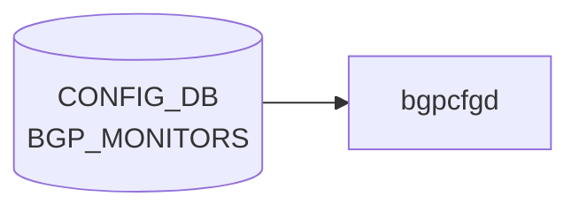

# BGP_MONITORS テーブル

## 概要

`BGP_MONITORS` テーブルは [BGP](../../reference/glossary.md#term-bgp) Monitoring Protocol (BMP) ではなく、[BGP](../../reference/glossary.md#term-bgp) モニター用の特殊隣接（route-monitor）を定義する。`bgpcfgd` がテンプレ展開して `bgpd` の `neighbor` 設定を生成する[^1]。各エントリは [BGP](../../reference/glossary.md#term-bgp) 隣接共通プロパティ (`sonic-bgp-cmn-neigh` grouping) を流用する。

<!-- cdb-mermaid -->
### データフロー (自動生成)



!!! note "凡例"
    CONFIG_DB から SAI までの典型経路を `docs/reference/config-db-orch-map.md` から機械生成したミニ図。詳細・例外は本ページ本文と対応表を参照。
<!-- /cdb-mermaid -->

## key 構造

```text
BGP_MONITORS|<addr>
```

| キー | 型 | 説明 |
|------|----|------|
| `addr` | inet:ip-address | モニター隣接の IP |

## フィールド

`sonic-bgp-common.yang` の `sonic-bgp-cmn-neigh` grouping を `uses` する。代表的 leaf:

| フィールド | 型 | 説明 |
|-----------|----|------|
| `name` | string | 隣接名。`must "current() = 'BGPMonitor'"` で `BGPMonitor` に固定 |
| `asn` | as-number | モニター AS |
| `local_addr` | ip-address | source address |
| `admin_status` | up/down | 管理状態 |
| 他 `sonic-bgp-cmn-neigh` 由来の leaf | — | keepalive/holdtime/peer_type/auth_password 等 |

## 制約

- `name` は `BGPMonitor` 固定（[YANG](../../reference/glossary.md#term-yang) `must` で強制）。複数モニターは `addr` で区別する

## 購読者

- `bgpcfgd` (`docker-fpm-frr`)
- 間接的に `bgpd` ([FRR](../../reference/glossary.md#term-frr))

## 関連 CONFIG_DB / YANG / CLI

- 関連 [CONFIG_DB](../../reference/glossary.md#term-config_db): `BGP_NEIGHBOR`、`BGP_GLOBALS`
- 関連 [YANG](../../reference/glossary.md#term-yang): `sonic-bgp-monitor`、`sonic-bgp-common`
- 関連 CLI: `config bgp`

<!-- ref-triangle:start -->

## 関連リファレンス

- [YANG](../../reference/glossary.md#term-yang): [`sonic-bgp-monitor`](../yang/sonic-bgp-monitor.md) / `sonic-bgp-common`
- CLI: [`config bgp`](../cli/config-bgp.md)

<!-- ref-triangle:end -->

## 引用元

[^1]: YANG 定義: `sonic-bgp-monitor.yang`. <https://github.com/sonic-net/sonic-buildimage/blob/9ea932ec2e18f35e58268ec2e4456b1d4afd65cd/src/sonic-yang-models/yang-models/sonic-bgp-monitor.yang>; 共通 leaf grouping は `sonic-bgp-common.yang` の `sonic-bgp-cmn-neigh`

## 関連ページ
- [CONFIG_DB: BGP_NEIGHBOR](bgp-neighbor.md)

<!-- ops-hint -->
## 運用ヒント

### 典型値

- key 形式: `BGP_MONITORS|<ip>`。
- `asn`: 監視先 AS。`admin_status`: `up`。`name`: 識別名。

### よくある誤設定

- BGP monitor を普通の neighbor と混同して route policy を当ててしまうと、本番経路に副作用が出る。

### 確認コマンド

```bash
sonic-db-cli CONFIG_DB keys 'BGP_MONITORS|*'
vtysh -c 'show bgp summary'
```
<!-- /ops-hint -->

<!-- value-behavior -->
## 値依存挙動マトリクス

### `admin_status` (sonic-bgp-cmn-neigh 由来)

| 値 | FRR コマンド | 備考 |
|----|-------------|------|
| `up` | `no neighbor <addr> shutdown` | `managers_bgp.py:334` |
| `down` | `neighbor <addr> shutdown` | `managers_bgp.py:336` |

### `name` (固定値制約)

| 値 | 動作 |
|----|------|
| `BGPMonitor` | YANG `must` 制約で強制。monitors テンプレ (`bgpd/templates/monitors/`) を使用 |
| それ以外 | YANG 検証段階で拒否 |

> **注意**: `admin_status` のみがライブ更新可能。他フィールドの変更は `bgpcfgd` に到達しても drop される (例外条件参照)。

<!-- /value-behavior -->

<!-- cdb-exceptions -->
## 例外条件・特殊挙動

| 条件 | 挙動 | ソース |
|------|------|--------|
| Loopback0 IPv4 未設定 かつ `bgp_router_id` 未設定 | `log_warn` して `return False` (再試行待ち) | `managers_bgp.py` `add_peer()` |
| `local_addr` フィールドが欠如 | `Missing attribute 'local_addr'` を warn ログ、処理は続行 (interface 紐付けなし) | `managers_bgp.py` |
| local address に対応する interface が未登録 | `wait for the corresponding interface to be set` → return False (再試行) | `managers_bgp.py` `get_local_interface()` |
| 既存ピアへの `admin_status` 以外のフィールド更新 | `Can't update the peer. Only 'admin_status' attribute is supported` を LOG_ERR → drop | `managers_bgp.py` `update_peer()` |
| `admin_status` が `'up'`/`'down'` 以外 | `wrong attribute value` を LOG_ERR → drop | `managers_bgp.py` `change_admin_status()` |
| Jinja2 テンプレートレンダリング失敗 | `log_err` して `return True` (再試行なし、drop) | `managers_bgp.py` `add_peer()` |
| `check_neig_meta=False` | BGP_MONITORS は DEVICE_NEIGHBOR_METADATA への依存なし (monitors peer_type で固定) | `managers_bgp.py` `main.py` L89 |
<!-- /cdb-exceptions -->


<!-- runtime-trace -->
## 実コンテナ動作トレース

### 段階 1 — Consumer 登録

`bgpcfgd` が CONFIG_DB の `BGP_MONITORS` テーブルを購読する。

`BGP_MONITORS` は BMP target server を定義。`bmpcfgd` との連携もある。

### 段階 2 — CFG→APPL 翻訳

なし (FRR vtysh 経由)

### 段階 3 — APPL→SAI

なし (BMP / FRR モニタリング設定)

### 段階 4 — タイミングと副作用

**適用タイミング**: 変化検知後 FRR に BGP モニタリング設定を注入。BMP セッションは設定適用後に確立を試みる。

**副作用**: BMP サーバへの接続が開始/停止される。既存 BGP セッションには影響なし。
<!-- /runtime-trace -->

<!-- entry-points -->
## 書き込み入り口 (Direction A)

対象テーブル: `BGP_MONITORS`

### CLI
- `config bgp monitor add/del <address>`
  - ソース: `sonic-utilities/config/main.py (bgp グループ)`

### minigraph / sonic-cfggen
- なし

### REST / gNMI (sonic-mgmt-common)
- なし (対応 OpenConfig/SONiC YANG transformer なし)

### db_migrator
- なし

### ビルド時デフォルト (init_cfg / j2 テンプレート)
- なし

### ハードコードデフォルト
- なし

### ランタイム注入 (デーモン自動書き込み)
- なし
<!-- /entry-points -->


<!-- derivation -->
## 派生・条件付き登録 (Phase 6/7)

### Phase 6: 値による他フィールド自動派生

| 条件 | 派生先 | evidence |
|---|---|---|
| minigraph XML に `<BGPPeer name="BGPMonitor">` エントリが存在する | `BGP_MONITORS` テーブルに peer エントリを生成 | `sonic-buildimage/src/sonic-config-engine/minigraph.py:1423,2274` |
| bgp_sessions の `name == 'BGPMonitor'` かつ `asn` が存在する | BGP_MONITORS へフィルタリング | `sonic-buildimage/src/sonic-config-engine/minigraph.py:1423` |

### Phase 7: 条件付き module/manager 登録

| 条件 | 登録 module | evidence |
|---|---|---|
| 常時（条件なし） | `BGPPeerMgrBase(peer_type="monitors")` が `BGP_MONITORS` を購読 | `sonic-buildimage/src/sonic-bgpcfgd/bgpcfgd/main.py:89` |

### grep カバレッジ

- minigraph.py L1423: BGP_MONITORS 生成（filter by name=='BGPMonitor'）
- bgpcfgd/main.py L89: 条件なし登録
<!-- /derivation -->
<!-- handler-branching -->
### Phase 8: Handler メソッド内分岐

| Manager / Handler | メソッド | 分岐条件 | 効果 | evidence |
|---|---|---|---|---|
| `BGPPeerMgrBase` | `set_handler()` | `peer_key NOT IN self.peers` | `add_peer()` を呼び出し（新規追加） | `sonic-buildimage/src/sonic-bgpcfgd/bgpcfgd/managers_bgp.py:167` |
| `BGPPeerMgrBase` | `set_handler()` | `peer_key IN self.peers` | `update_peer()` を呼び出し（更新） | `sonic-buildimage/src/sonic-bgpcfgd/bgpcfgd/managers_bgp.py:169` |
| `BGPPeerMgrBase` | `add_peer()` | `lo_ipv4 is None AND bgp_router_id not in DEVICE_METADATA` | 早期 `return False`（loopback 未設定ガード） | `sonic-buildimage/src/sonic-bgpcfgd/bgpcfgd/managers_bgp.py:186-189` |
| `BGPPeerMgrBase` | `add_peer()` | `"local_addr" not in data` | `log_warn` のみ（スキップしない） | `sonic-buildimage/src/sonic-bgpcfgd/bgpcfgd/managers_bgp.py:194` |
| `BGPPeerMgrBase` | `add_peer()` | `interface = self.get_local_interface(data["local_addr"])` が None | 早期 `return False`（インターフェース未設定ガード） | `sonic-buildimage/src/sonic-bgpcfgd/bgpcfgd/managers_bgp.py:199-202` |
| `BGPPeerMgrBase` | `update_peer()` | `"admin_status" in data` | `change_admin_status()` へ委譲 | `sonic-buildimage/src/sonic-bgpcfgd/bgpcfgd/managers_bgp.py:314` |

> **スキャン証跡**: `BGPPeerMgrBase` 597 行・public メソッド set_handler/add_peer/update_peer/change_admin_status 読了。monitors は peer_type="monitors"（内部 BGP セッション向け）、loopback 依存ガードが核心分岐。
<!-- /handler-branching -->
<!-- defaults -->
## 暗黙デフォルト・コード由来の固定値 (Phase A)

### フィールドごとの YANG default と実装 fallback

| フィールド | YANG default | 実装デフォルト / fallback | 証跡 |
|-----------|-------------|------------------------|------|
| `name` | なし | `BGPMonitor` 固定 (YANG `must` 制約) | `sonic-bgp-monitor.yang:41` |
| `asn` | なし | **使用されない** — FRR への `remote-as` は常に `DEVICE_METADATA/localhost/bgp_asn` を使用 | `instance.conf.j2:4` |
| `holdtime` | なし | FRR のグローバルデフォルト (`hold-time 180`) に依存 | `sonic-bgp-common.yang` |
| `keepalive` | なし | FRR のグローバルデフォルト (`keepalive 60`) に依存 | `sonic-bgp-common.yang` |
| `local_addr` | なし | 欠如時: `log_warn` のみ、処理続行。FRR の `update-source` 未設定になる | `managers_bgp.py:194-195` |
| `admin_status` | なし | 欠如しても peer 追加は続行。shutdown コマンドなし → `up` 相当 | `managers_bgp.py:set_handler` |
| `nhopself` | なし | テンプレートで未参照 (FRR デフォルト動作) | `instance.conf.j2` |
| `rrclient` | なし | テンプレートで未参照 (FRR デフォルト動作) | `instance.conf.j2` |

### テンプレートハードコード値（CONFIG_DB 非依存）

以下は CONFIG_DB のフィールドとは無関係に `bgpcfgd` が FRR に注入する固定値:

| FRR コマンド | 注入条件 | 証跡 |
|------------|---------|------|
| `neighbor <addr> remote-as <bgp_asn>` | 常時。`bgp_asn` は DEVICE_METADATA 由来 | `instance.conf.j2:4` |
| `neighbor <addr> peer-group BGPMON` | 常時 | `instance.conf.j2:5` |
| `neighbor <addr> activate` (IPv4 + IPv6) | 常時 | `instance.conf.j2:7,9` |
| `neighbor BGPMON update-source Loopback4096` | `switch_type=voq` または chassisdb.conf 存在時 | `peer-group.conf.j2:10` |
| `neighbor BGPMON update-source <lo0_ipv4>` | Loopback0 IPv4 存在時（通常ケース） | `peer-group.conf.j2:12` |
| `neighbor BGPMON maximum-prefix 1` | IPv4 AF に無条件 | `peer-group.conf.j2:20` |
| `neighbor BGPMON send-community` | 無条件 | `peer-group.conf.j2:19` |
| `route-map FROM_BGPMON deny 10` | 常時（全受信拒否） | `policies.conf.j2:4` |
| `route-map TO_BGPMON permit 10` | 常時（全送信許可） | `policies.conf.j2:6` |
| `bgp suppress-fib-pending` | 全 BGP context に無条件注入 | `managers_bgp.py:apply_op()` |

### YANG vs 実装 discrepancy

| フィールド | YANG 定義 | 実装挙動 | 乖離種別 |
|-----------|---------|---------|---------|
| `asn` | uint32、Optional | FRR の `remote-as` は DEVICE_METADATA の `bgp_asn` を使用。CONFIG_DB の `asn` は**参照されない** | **重大 discrepancy**: `asn` は dead field |
| `admin_status` | Optional | 欠如時でも peer 追加続行 (`up` 相当) | soft — YANG は明示を推奨しない |
| `local_addr` | Optional, inet:ip-address | 欠如時は warn のみ。`update-source` 未設定 | soft — YANG の optional と整合 |

> **注意**: `BGP_MONITORS|<addr>|asn` を CONFIG_DB に設定しても、bgpcfgd は FRR peer の `remote-as` をローカル ASN (DEVICE_METADATA) から取得するため、そのフィールドは無視される。BGP_MONITORS の peer は常にローカル ASN に対してピアリングする設計（内部 route-monitor 用途）。

<!-- /defaults -->

<!-- constants -->
## ハードコード定数 (Phase E)

以下の定数は CONFIG_DB フィールドから取得されず、bgpcfgd テンプレートまたは YANG 制約にハードコードされている。

### peer-group 名

| 定数 | 値 | ソース |
|------|----|--------|
| monitors peer-group 名 | `BGPMON` | `monitors/peer-group.conf.j2:8`, `monitors/instance.conf.j2:5` |

BGP_MONITORS エントリは常に `BGPMON` peer-group に所属する。CONFIG_DB に別の peer-group を指定するフィールドは存在しない。

### route-map 名

| 定数 | 値 | 効果 | ソース |
|------|----|------|--------|
| `FROM_BGPMON` | `route-map FROM_BGPMON deny 10` | 全受信経路を拒否（route-monitor は経路を受け取らない設計） | `monitors/policies.conf.j2:4` |
| `TO_BGPMON` | `route-map TO_BGPMON permit 10` | 全送信経路を許可 | `monitors/policies.conf.j2:6` |

これらの route-map 名は `monitors/peer-group.conf.j2` でも参照される（`neighbor BGPMON route-map FROM_BGPMON in` / `TO_BGPMON out`）。

### その他固定値

| 定数 | 値 | ソース |
|------|----|--------|
| maximum-prefix (IPv4/IPv6) | `1` | `monitors/peer-group.conf.j2:20,29` |
| send-community | 無条件有効 | `monitors/peer-group.conf.j2:19,28` |
| update-source (chassis/VoQ) | `Loopback4096` | `monitors/peer-group.conf.j2:10` |
| TCP ポート | `179` (BGP well-known) | FRR/OS レベル固定。CONFIG_DB フィールドなし |
| `name` フィールド制約 | `BGPMonitor` | YANG `must "current() = 'BGPMonitor'"` (`sonic-bgp-monitor.yang:41`) |

> **設計意図**: `FROM_BGPMON deny 10` により monitors peer は経路を受信しない。`maximum-prefix 1` はさらなる安全弁。monitors peer-group は route-monitor 用途（自装置の経路を外部から観測させる）に特化しており、通常の BGP 経路交換とは完全に分離されている。

<!-- /constants -->
<!-- glossary-links-injected: a1dd9e34d62e -->
