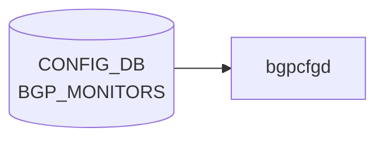

# BGP_MONITORS テーブル

## 概要

`BGP_MONITORS` テーブルは BGP Monitoring Protocol (BMP) ではなく、BGP モニター用の特殊隣接（route-monitor）を定義する。`bgpcfgd` がテンプレ展開して `bgpd` の `neighbor` 設定を生成する[^1]。各エントリは BGP 隣接共通プロパティ (`sonic-bgp-cmn-neigh` grouping) を流用する。

<!-- cdb-mermaid -->
### データフロー (自動生成)



!!! note "凡例"
    CONFIG_DB から SAI までの典型経路を `docs/reference/config-db-orch-map.md` から機械生成したミニ図。詳細・例外は本ページ本文と対応表を参照。
<!-- /cdb-mermaid -->

## key 構造

```
BGP_MONITORS|<addr>
```

| キー | 型 | 説明 |
|------|----|------|
| `addr` | inet:ip-address | モニター隣接の IP |

## フィールド

`sonic-bgp-common.yang` の `sonic-bgp-cmn-neigh` grouping を `uses` する。代表的 leaf:

| フィールド | 型 | 説明 |
|-----------|----|------|
| `name` | string | 隣接名。`must "current() = 'BGPMonitor'"` で `BGPMonitor` に固定 |
| `asn` | as-number | モニター AS |
| `local_addr` | ip-address | source address |
| `admin_status` | up/down | 管理状態 |
| 他 `sonic-bgp-cmn-neigh` 由来の leaf | — | keepalive/holdtime/peer_type/auth_password 等 |

## 制約

- `name` は `BGPMonitor` 固定（YANG `must` で強制）。複数モニターは `addr` で区別する

## 購読者

- `bgpcfgd` (`docker-fpm-frr`)
- 間接的に `bgpd` (FRR)

## 関連 CONFIG_DB / YANG / CLI

- 関連 CONFIG_DB: `BGP_NEIGHBOR`、`BGP_GLOBALS`
- 関連 YANG: `sonic-bgp-monitor`、`sonic-bgp-common`
- 関連 CLI: `config bgp`

<!-- ref-triangle:start -->

## 関連リファレンス

- YANG: [`sonic-bgp-monitor`](../yang/sonic-bgp-monitor.md) / `sonic-bgp-common`
- CLI: [`config bgp`](../cli/config-bgp.md)

<!-- ref-triangle:end -->

## 引用元

[^1]: YANG 定義: `sonic-bgp-monitor.yang`. <https://github.com/sonic-net/sonic-buildimage/blob/9ea932ec2e18f35e58268ec2e4456b1d4afd65cd/src/sonic-yang-models/yang-models/sonic-bgp-monitor.yang>; 共通 leaf grouping は `sonic-bgp-common.yang` の `sonic-bgp-cmn-neigh`

## 関連ページ
- [CONFIG_DB: BGP_NEIGHBOR](bgp-neighbor.md)

<!-- ops-hint -->
## 運用ヒント

### 典型値

- key 形式: `BGP_MONITORS|<ip>`。
- `asn`: 監視先 AS。`admin_status`: `up`。`name`: 識別名。

### よくある誤設定

- BGP monitor を普通の neighbor と混同して route policy を当ててしまうと、本番経路に副作用が出る。

### 確認コマンド

```bash
sonic-db-cli CONFIG_DB keys 'BGP_MONITORS|*'
vtysh -c 'show bgp summary'
```
<!-- /ops-hint -->
