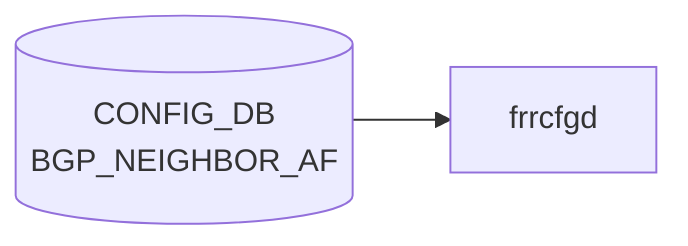

# BGP_NEIGHBOR_AF テーブル

## 概要

`BGP_NEIGHBOR` の **アドレスファミリ別** 設定を持つテーブル[^1]。`sonic-bgp-neighbor.yang` の `BGP_NEIGHBOR_AF` コンテナに定義され、`sonic-bgp-common.yang` の `grouping sonic-bgp-cmn-af` を `uses`。`frr-mgmt-framework` 経路で [FRR](../../reference/glossary.md#term-frr) (`bgpd`) の `address-family ... / neighbor <addr> ...` 配下コマンドに変換される。

<!-- cdb-mermaid -->
### データフロー (自動生成)



!!! note "凡例"
    CONFIG_DB から SAI までの典型経路を `docs/reference/config-db-orch-map.md` から機械生成したミニ図。詳細・例外は本ページ本文と対応表を参照。
<!-- /cdb-mermaid -->

## key 構造

```text
BGP_NEIGHBOR_AF|<vrf_name>|<neighbor>|<afi_safi>
```

- `<vrf_name>`: `BGP_GLOBALS_LIST.vrf_name` への leafref
- `<neighbor>`: 同一 vrf の `BGP_NEIGHBOR_LIST.neighbor` への leafref（IP アドレスまたはインタフェース名）
- `<afi_safi>`: `ipv4_unicast` / `ipv6_unicast` / `l2vpn_evpn` 等

## フィールド (`sonic-bgp-cmn-af` より継承)

[`BGP_PEER_GROUP_AF`](./bgp-peer-group-af.md) と同じ AF 共通 leaf 群を `uses` する:

- `admin_status` (activate)
- `send_default_route`、`default_rmap`
- `max_prefix_limit`、`max_prefix_warning_only`、`max_prefix_warning_threshold`、`max_prefix_restart_interval`
- `route_map_in` / `route_map_out` (leaf-list)
- `soft_reconfiguration_in`、`unsuppress_map_name`
- `rrclient`、`weight`、`as_override`、`send_community`、`tx_add_paths`
- `unchanged_as_path` / `unchanged_med` / `unchanged_nexthop`
- `filter_list_in` / `filter_list_out`
- `nhself`、`nexthop_self_force`
- `prefix_list_in` / `prefix_list_out`
- `remove_private_as_enabled` / `replace_private_as` / `remove_private_as_all`
- `allow_as_in` / `allow_as_count` / `allow_as_origin`
- `cap_orf`、`route_server_client`

完全な型・既定値は `sonic-bgp-common.yang` の `grouping sonic-bgp-cmn-af` を参照（`docs/reference/config-db/bgp-peer-group-af.md` のフィールド表が同一）。

## 制約

- `neighbor` の leafref は `[vrf_name=current()/../vrf_name]` で同一 [VRF](../../reference/glossary.md#term-vrf) の隣接に限定される
- `vrf_name` は `BGP_GLOBALS` に存在することが前提

## 購読者

- `frr-mgmt-framework`: AF 別設定を bgpd へ反映
- `bgpcfgd` (テンプレベース): `BGP_NEIGHBOR` 単位処理が中心で AF 別はテンプレで間接反映

## 関連 CONFIG_DB / YANG / CLI

- 関連 [CONFIG_DB](../../reference/glossary.md#term-config_db): [`BGP_NEIGHBOR`](./bgp-neighbor.md)、[`BGP_PEER_GROUP_AF`](./bgp-peer-group-af.md)、`PREFIX_LIST`、`ROUTE_MAP`
- 関連 [YANG](../../reference/glossary.md#term-yang): `sonic-bgp-neighbor`、`sonic-bgp-common`
- 関連 CLI: [`config bgp`](../cli/config-bgp.md)

<!-- ref-triangle:start -->

## 関連リファレンス

- [YANG](../../reference/glossary.md#term-yang): [`sonic-bgp-neighbor`](../yang/sonic-bgp-neighbor.md) / `sonic-bgp-common`
- CLI: [`config bgp`](../cli/config-bgp.md)

<!-- ref-triangle:end -->

## 引用元

[^1]: [YANG](../../reference/glossary.md#term-yang) 定義: `sonic-bgp-neighbor.yang` の `BGP_NEIGHBOR_AF` リスト. <https://github.com/sonic-net/sonic-buildimage/blob/9ea932ec2e18f35e58268ec2e4456b1d4afd65cd/src/sonic-yang-models/yang-models/sonic-bgp-neighbor.yang#L112-L131>; AF 共通 leaf 群は `sonic-bgp-common.yang` の `grouping sonic-bgp-cmn-af`

<!-- ops-hint -->
## 運用ヒント

### 典型値

- key 形式: `BGP_NEIGHBOR_AF|<vrf>|<peer>|<af>`。
- `admin_status`: `up`、`send_community`: `both`、`soft_reconfiguration_in`: `true`（debug 用途）。

### よくある誤設定

- `activate` を入れ忘れて該当 AF で経路交換が始まらない。

### 確認コマンド

```bash
sonic-db-cli CONFIG_DB keys 'BGP_NEIGHBOR_AF|*'
vtysh -c 'show bgp neighbor <ip>'
```
<!-- /ops-hint -->

<!-- value-behavior -->
## 値依存挙動マトリクス

### `send_community` (`bgp_community_type`)

| 値 | FRR コマンド | 備考 |
|----|-------------|------|
| `standard` | `neighbor <X> send-community standard` | `hdl_send_com`: まず all 削除、次に指定値を追加 |
| `extended` | `neighbor <X> send-community extended` | 同上 |
| `both` | `neighbor <X> send-community both` | 同上 |
| `large` | `neighbor <X> send-community large` | 同上 |
| `all` | `neighbor <X> send-community all` | 同上 |
| `none` | コマンド追加なし (send-community 無効) | `frrcfgd.py:955` — `none` 判定で追加をスキップ |

### `tx_add_paths` (`bgp_tx_add_paths_type`)

| 値 | FRR コマンド |
|----|-------------|
| `tx_all_paths` | `neighbor <X> addpath-tx-all-paths` |
| `tx_best_path_per_as` | `neighbor <X> addpath-tx-bestpath-per-AS` |

### `cap_orf` (`sonic_bgp_orf`)

| 値 | FRR コマンド | 備考 |
|----|-------------|------|
| `send` | `neighbor <X> capability orf prefix-list send` | 削除時は `both` を no で除去 |
| `receive` | `neighbor <X> capability orf prefix-list receive` | 同上 |
| `both` | `neighbor <X> capability orf prefix-list both` | 同上 |

### `afi_safi` (key、AF ブロック選択)

| 値 | FRR `address-family` |
|----|---------------------|
| `ipv4_unicast` | `address-family ipv4 unicast` |
| `ipv6_unicast` | `address-family ipv6 unicast` |
| `l2vpn_evpn` | `address-family l2vpn evpn` |

<!-- /value-behavior -->

<!-- cdb-exceptions -->
## 例外条件・特殊挙動

| 条件 | 挙動 | ソース |
|------|------|--------|
| key の `\|` パース失敗 (不正フォーマット) | `ValueError` を catch → continue (skip) | `frrcfgd.py` L2665, L2246 |
| `local_asn` が未設定の VRF | `ignore table {} update because local_asn for VRF {} was not configured` を LOG_DEBUG → skip | `frrcfgd.py` L2660 |
| `peer_group_name` が未存在の peer-group を参照 | `invalid peer-group %s was referenced` を LOG_ERR → continue | `frrcfgd.py` L2828 |
| `send_default_route=true` だが `default_rmap` が同時に未設定 | `default-originate` のみ発行、route-map は付与されない (key_map の複合条件) | `frrcfgd.py` `nbr_af_key_map` |
| `max_prefix_limit` 欠如で他の max_prefix フィールドのみ設定 | `++` / `+` プレフィックスルールにより `max_prefix_limit` 依存フィールドは無視 | `frrcfgd.py` `nbr_af_key_map` |
<!-- /cdb-exceptions -->


<!-- runtime-trace -->
## 実コンテナ動作トレース

### 段階 1 — Consumer 登録

`bgpcfgd` が CONFIG_DB の `BGP_NEIGHBOR_AF` テーブルを購読する。

`BGP_NEIGHBOR_AF` は `<vrf>|<neighbor>|<af>` の key 構造。

### 段階 2 — CFG→APPL 翻訳

なし (FRR vtysh 経由)

### 段階 3 — APPL→SAI

なし (FRR BGP ネイバー AF 設定)

### 段階 4 — タイミングと副作用

**適用タイミング**: 変化検知後 FRR にネイバー AF コマンドを発行。`activate`/`deactivate` は BGP session に影響する場合がある。

**副作用**: ネイバーの AF 有効/無効化は該当 AF の route 交換を即座に停止/開始。policy 変更は soft-clear 後に有効。
<!-- /runtime-trace -->

<!-- entry-points -->
## 書き込み入り口 (Direction A)

対象テーブル: `BGP_NEIGHBOR_AF`

### CLI
- `vtysh` 経由 neighbor address-family コマンド群 (bgpcfgd が CONFIG_DB へ書き戻し)
  - ソース: `sonic-frr bgpcfgd`

### minigraph / sonic-cfggen
- あり: `sonic-cfggen -m <minigraph.xml>` 実行時に本テーブルが生成・上書きされる

### REST / gNMI (sonic-mgmt-common)
- sonic-mgmt-common OpenConfig BGP neighbor 経由

### db_migrator
- なし

### ビルド時デフォルト (init_cfg / j2 テンプレート)
- なし

### ハードコードデフォルト
- なし

### ランタイム注入 (デーモン自動書き込み)
- `bgpcfgd` が FRR running-config を CONFIG_DB と同期
<!-- /entry-points -->


<!-- derivation -->
## 派生・条件付き登録 (Phase 6/7)

### Phase 6: 値による他フィールド自動派生

| 条件 | 派生先 | evidence |
|---|---|---|
| minigraph.py は BGP_NEIGHBOR_AF を直接生成しない | — | `sonic-buildimage/src/sonic-config-engine/minigraph.py` に代入なし |
| frrcfgd が FRR running-config から AF 設定を同期 | BGP_NEIGHBOR_AF の各フィールドを反映 | `sonic-buildimage/src/sonic-frr-mgmt-framework/frrcfgd/frrcfgd.py:2140` |

### Phase 7: 条件付き module/manager 登録

| 条件 | 登録 module | evidence |
|---|---|---|
| 常時（条件なし） | `frrcfgd.BGPConfigDaemon` が `BGP_NEIGHBOR_AF` を購読（`bgp_table_handler_common`） | `sonic-buildimage/src/sonic-frr-mgmt-framework/frrcfgd/frrcfgd.py:2304` |

### grep カバレッジ

- frrcfgd.py L2304: BGP_NEIGHBOR_AF 購読（条件なし）
<!-- /derivation -->
<!-- handler-branching -->
### Phase 8: Handler メソッド内分岐

| Manager / Handler | メソッド | 分岐条件 | 効果 | evidence |
|---|---|---|---|---|
| `BGPConfigDaemon` | `bgp_table_handler_common()` | `data is None`（DELETE） | `del_table=True` → AF を FRR から削除 | `sonic-buildimage/src/sonic-frr-mgmt-framework/frrcfgd/frrcfgd.py:3918` |
| `BGPConfigDaemon` | `bgp_table_handler_common()` | `data` あり（SET） | `bgp_message` キューに積み `__update_bgp()` で FRR 更新 | `sonic-buildimage/src/sonic-frr-mgmt-framework/frrcfgd/frrcfgd.py:3930` |

> **スキャン証跡**: BGP_NEIGHBOR_AF は `bgp_table_handler_common` に直接渡され、BGP_GLOBALS_AF 相当の comb_attr_list 制約はなし。2 件分岐抽出。
<!-- /handler-branching -->

<!-- cross-refs -->
## 暗黙参照マップ (Phase C)

> YANG leafref で強制される構造的参照に加え、`frrcfgd.py` の `nbr_af_key_map` を介して FRR 設定文に展開される際に間接参照されるテーブル / オブジェクトを網羅する。
> 詳細証跡: `meta/_intermediate/cdb-flow/bgp-neighbor-af-cross-refs.md`

### BGP_NEIGHBOR_AF が参照する下流テーブル / リソース

| 対象 | 参照機構 | 効果 |
|---|---|---|
| `BGP_NEIGHBOR` (`vrf_name`, `neighbor`) | YANG leafref (`sonic-bgp-neighbor.yang:124-126`) | 同一 VRF の `BGP_NEIGHBOR_LIST.neighbor` に存在しないキーは YANG バリデーションで reject |
| `BGP_GLOBALS` (`vrf_name`) | YANG leafref (`sonic-bgp-neighbor.yang:117-119`) | 存在しない VRF は reject。さらに `frrcfgd.py:2658-2663` で `local_asn` 未設定 VRF への更新は LOG_DEBUG で silent skip |
| `BGP_PEER_GROUP_AF` | 設定階層上の対 (`frrcfgd.py:2111-2112`) | 同一の `nbr_af_key_map` で処理される姉妹テーブル。peer-group 由来の AF 設定が neighbor AF の既定として継承される |
| `ROUTE_MAP` (FRR 名前空間) | `route_map_in` / `route_map_out` / `default_rmap` / `unsuppress_map_name` 文字列値 (`frrcfgd.py:1899-1906`) | FRR で未定義の route-map 名を指すと `bgpd` 側で参照解決失敗。CONFIG_DB `ROUTE_MAP` テーブル経由で定義する |
| `PREFIX_LIST` (FRR 名前空間) | `prefix_list_in` / `prefix_list_out` 文字列値 (`frrcfgd.py:1918-1919`) | FRR `ip prefix-list` 未定義名で参照解決失敗 |
| AS-path access-list (FRR) | `filter_list_in` / `filter_list_out` 文字列値 (`frrcfgd.py:1914-1915`) | `bgp as-path access-list` 未定義名で参照解決失敗 |
| `DEVICE_METADATA|localhost|bgp_asn` | bgpd テンプレ起動時条件 (`bgpd.main.conf.j2:94-95`) | `bgp_asn` 未設定または `none/null` の場合 `router bgp` ブロック自体が生成されず、BGP_NEIGHBOR_AF も無効化 |

### BGP_NEIGHBOR_AF を参照する上流コンポーネント

| 参照元 | 参照機構 | 効果 |
|---|---|---|
| `frrcfgd` (`BGPConfigDaemon`) | `bgp_table_handler_common` 購読 (`frrcfgd.py:91, 2306`) | CONFIG_DB の更新を FRR `address-family ... / neighbor <addr> ...` コマンド列へ変換 |
| `frr-mgmt-framework` | running-config → CONFIG_DB 双方向同期 (`frrcfgd.py:2137`) | vtysh で投入された AF 設定を CONFIG_DB に書き戻す |
| `sonic-mgmt-common` (gNMI/REST) | OpenConfig BGP neighbor afi-safis マッピング | northbound API 経由の neighbor AF 設定 |

### 暗黙参照の特徴

`BGP_NEIGHBOR_AF` は YANG leafref では `BGP_NEIGHBOR` と `BGP_GLOBALS` の 2 件しか宣言しないが、`frrcfgd.py:nbr_af_key_map` (L1895-1920) が値を FRR コマンドに展開する際、**route-map / prefix-list / filter-list / unsuppress-map の各オブジェクト名は FRR 側名前空間で解決される**ため、CONFIG_DB の `ROUTE_MAP` テーブルや FRR `vtysh` で先に定義しておく必要がある。これらは YANG では強制されない暗黙参照である。

また、`local_asn` 未設定 VRF への BGP_NEIGHBOR_AF 更新は `frrcfgd.py:2660` で `ignore table {} update because local_asn for VRF {} was not configured` の LOG_DEBUG を出して silent skip する点に注意。

<!-- /cross-refs -->
<!-- glossary-links-injected: b5626ca1f0f9 -->
