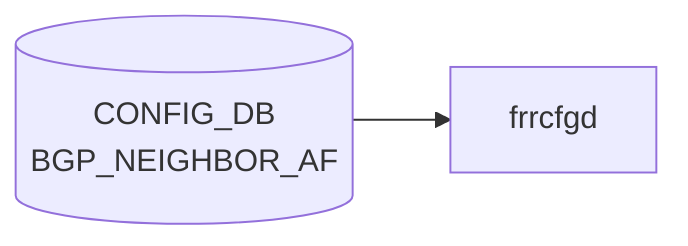

# BGP_NEIGHBOR_AF テーブル

## 概要

`BGP_NEIGHBOR` の **アドレスファミリ別** 設定を持つテーブル[^1]。`sonic-bgp-neighbor.yang` の `BGP_NEIGHBOR_AF` コンテナに定義され、`sonic-bgp-common.yang` の `grouping sonic-bgp-cmn-af` を `uses`。`frr-mgmt-framework` 経路で [FRR](../../reference/glossary.md#term-frr) (`bgpd`) の `address-family ... / neighbor <addr> ...` 配下コマンドに変換される。

<!-- cdb-mermaid -->
### データフロー (自動生成)



!!! note "凡例"
    CONFIG_DB から SAI までの典型経路を `docs/reference/config-db-orch-map.md` から機械生成したミニ図。詳細・例外は本ページ本文と対応表を参照。
<!-- /cdb-mermaid -->

## key 構造

```text
BGP_NEIGHBOR_AF|<vrf_name>|<neighbor>|<afi_safi>
```

- `<vrf_name>`: `BGP_GLOBALS_LIST.vrf_name` への leafref
- `<neighbor>`: 同一 vrf の `BGP_NEIGHBOR_LIST.neighbor` への leafref（IP アドレスまたはインタフェース名）
- `<afi_safi>`: `ipv4_unicast` / `ipv6_unicast` / `l2vpn_evpn` 等

## フィールド (`sonic-bgp-cmn-af` より継承)

[`BGP_PEER_GROUP_AF`](./bgp-peer-group-af.md) と同じ AF 共通 leaf 群を `uses` する:

- `admin_status` (activate)
- `send_default_route`、`default_rmap`
- `max_prefix_limit`、`max_prefix_warning_only`、`max_prefix_warning_threshold`、`max_prefix_restart_interval`
- `route_map_in` / `route_map_out` (leaf-list)
- `soft_reconfiguration_in`、`unsuppress_map_name`
- `rrclient`、`weight`、`as_override`、`send_community`、`tx_add_paths`
- `unchanged_as_path` / `unchanged_med` / `unchanged_nexthop`
- `filter_list_in` / `filter_list_out`
- `nhself`、`nexthop_self_force`
- `prefix_list_in` / `prefix_list_out`
- `remove_private_as_enabled` / `replace_private_as` / `remove_private_as_all`
- `allow_as_in` / `allow_as_count` / `allow_as_origin`
- `cap_orf`、`route_server_client`

完全な型・既定値は `sonic-bgp-common.yang` の `grouping sonic-bgp-cmn-af` を参照（`docs/reference/config-db/bgp-peer-group-af.md` のフィールド表が同一）。

## 制約

- `neighbor` の leafref は `[vrf_name=current()/../vrf_name]` で同一 [VRF](../../reference/glossary.md#term-vrf) の隣接に限定される
- `vrf_name` は `BGP_GLOBALS` に存在することが前提

## 購読者

- `frr-mgmt-framework`: AF 別設定を bgpd へ反映
- `bgpcfgd` (テンプレベース): `BGP_NEIGHBOR` 単位処理が中心で AF 別はテンプレで間接反映

## 関連 CONFIG_DB / YANG / CLI

- 関連 [CONFIG_DB](../../reference/glossary.md#term-config_db): [`BGP_NEIGHBOR`](./bgp-neighbor.md)、[`BGP_PEER_GROUP_AF`](./bgp-peer-group-af.md)、`PREFIX_LIST`、`ROUTE_MAP`
- 関連 [YANG](../../reference/glossary.md#term-yang): `sonic-bgp-neighbor`、`sonic-bgp-common`
- 関連 CLI: [`config bgp`](../cli/config-bgp.md)

<!-- ref-triangle:start -->

## 関連リファレンス

- [YANG](../../reference/glossary.md#term-yang): [`sonic-bgp-neighbor`](../yang/sonic-bgp-neighbor.md) / `sonic-bgp-common`
- CLI: [`config bgp`](../cli/config-bgp.md)

<!-- ref-triangle:end -->

## 引用元

[^1]: [YANG](../../reference/glossary.md#term-yang) 定義: `sonic-bgp-neighbor.yang` の `BGP_NEIGHBOR_AF` リスト. <https://github.com/sonic-net/sonic-buildimage/blob/9ea932ec2e18f35e58268ec2e4456b1d4afd65cd/src/sonic-yang-models/yang-models/sonic-bgp-neighbor.yang#L112-L131>; AF 共通 leaf 群は `sonic-bgp-common.yang` の `grouping sonic-bgp-cmn-af`

<!-- ops-hint -->
## 運用ヒント

### 典型値

- key 形式: `BGP_NEIGHBOR_AF|<vrf>|<peer>|<af>`。
- `admin_status`: `up`、`send_community`: `both`、`soft_reconfiguration_in`: `true`（debug 用途）。

### よくある誤設定

- `activate` を入れ忘れて該当 AF で経路交換が始まらない。

### 確認コマンド

```bash
sonic-db-cli CONFIG_DB keys 'BGP_NEIGHBOR_AF|*'
vtysh -c 'show bgp neighbor <ip>'
```
<!-- /ops-hint -->

<!-- cdb-exceptions -->
## 例外条件・特殊挙動

| 条件 | 挙動 | ソース |
|------|------|--------|
| key の `\|` パース失敗 (不正フォーマット) | `ValueError` を catch → continue (skip) | `frrcfgd.py` L2665, L2246 |
| `local_asn` が未設定の VRF | `ignore table {} update because local_asn for VRF {} was not configured` を LOG_DEBUG → skip | `frrcfgd.py` L2660 |
| `peer_group_name` が未存在の peer-group を参照 | `invalid peer-group %s was referenced` を LOG_ERR → continue | `frrcfgd.py` L2828 |
| `send_default_route=true` だが `default_rmap` が同時に未設定 | `default-originate` のみ発行、route-map は付与されない (key_map の複合条件) | `frrcfgd.py` `nbr_af_key_map` |
| `max_prefix_limit` 欠如で他の max_prefix フィールドのみ設定 | `++` / `+` プレフィックスルールにより `max_prefix_limit` 依存フィールドは無視 | `frrcfgd.py` `nbr_af_key_map` |
<!-- /cdb-exceptions -->

<!-- glossary-links-injected: b5626ca1f0f9 -->
