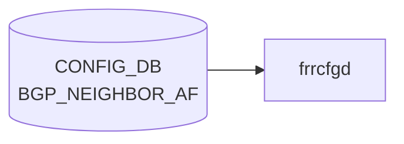

# BGP_NEIGHBOR_AF テーブル

## 概要

`BGP_NEIGHBOR` の **アドレスファミリ別** 設定を持つテーブル[^1]。`sonic-bgp-neighbor.yang` の `BGP_NEIGHBOR_AF` コンテナに定義され、`sonic-bgp-common.yang` の `grouping sonic-bgp-cmn-af` を `uses`。`frr-mgmt-framework` 経路で [FRR](../../reference/glossary.md#term-frr) (`bgpd`) の `address-family ... / neighbor <addr> ...` 配下コマンドに変換される。

<!-- cdb-mermaid -->
### データフロー (自動生成)



!!! note "凡例"
    CONFIG_DB から SAI までの典型経路を `docs/reference/config-db-orch-map.md` から機械生成したミニ図。詳細・例外は本ページ本文と対応表を参照。
<!-- /cdb-mermaid -->

## key 構造

```text
BGP_NEIGHBOR_AF|<vrf_name>|<neighbor>|<afi_safi>
```

- `<vrf_name>`: `BGP_GLOBALS_LIST.vrf_name` への leafref
- `<neighbor>`: 同一 vrf の `BGP_NEIGHBOR_LIST.neighbor` への leafref（IP アドレスまたはインタフェース名）
- `<afi_safi>`: `ipv4_unicast` / `ipv6_unicast` / `l2vpn_evpn` 等

## フィールド (`sonic-bgp-cmn-af` より継承)

[`BGP_PEER_GROUP_AF`](./bgp-peer-group-af.md) と同じ AF 共通 leaf 群を `uses` する:

- `admin_status` (activate)
- `send_default_route`、`default_rmap`
- `max_prefix_limit`、`max_prefix_warning_only`、`max_prefix_warning_threshold`、`max_prefix_restart_interval`
- `route_map_in` / `route_map_out` (leaf-list)
- `soft_reconfiguration_in`、`unsuppress_map_name`
- `rrclient`、`weight`、`as_override`、`send_community`、`tx_add_paths`
- `unchanged_as_path` / `unchanged_med` / `unchanged_nexthop`
- `filter_list_in` / `filter_list_out`
- `nhself`、`nexthop_self_force`
- `prefix_list_in` / `prefix_list_out`
- `remove_private_as_enabled` / `replace_private_as` / `remove_private_as_all`
- `allow_as_in` / `allow_as_count` / `allow_as_origin`
- `cap_orf`、`route_server_client`

完全な型・既定値は `sonic-bgp-common.yang` の `grouping sonic-bgp-cmn-af` を参照（`docs/reference/config-db/bgp-peer-group-af.md` のフィールド表が同一）。

## 制約

- `neighbor` の leafref は `[vrf_name=current()/../vrf_name]` で同一 [VRF](../../reference/glossary.md#term-vrf) の隣接に限定される
- `vrf_name` は `BGP_GLOBALS` に存在することが前提

## 購読者

- `frr-mgmt-framework`: AF 別設定を bgpd へ反映
- `bgpcfgd` (テンプレベース): `BGP_NEIGHBOR` 単位処理が中心で AF 別はテンプレで間接反映

## 関連 CONFIG_DB / YANG / CLI

- 関連 [CONFIG_DB](../../reference/glossary.md#term-config_db): [`BGP_NEIGHBOR`](./bgp-neighbor.md)、[`BGP_PEER_GROUP_AF`](./bgp-peer-group-af.md)、`PREFIX_LIST`、`ROUTE_MAP`
- 関連 [YANG](../../reference/glossary.md#term-yang): `sonic-bgp-neighbor`、`sonic-bgp-common`
- 関連 CLI: [`config bgp`](../cli/config-bgp.md)

<!-- ref-triangle:start -->

## 関連リファレンス

- [YANG](../../reference/glossary.md#term-yang): [`sonic-bgp-neighbor`](../yang/sonic-bgp-neighbor.md) / `sonic-bgp-common`
- CLI: [`config bgp`](../cli/config-bgp.md)

<!-- ref-triangle:end -->

## 引用元

[^1]: [YANG](../../reference/glossary.md#term-yang) 定義: `sonic-bgp-neighbor.yang` の `BGP_NEIGHBOR_AF` リスト. <https://github.com/sonic-net/sonic-buildimage/blob/9ea932ec2e18f35e58268ec2e4456b1d4afd65cd/src/sonic-yang-models/yang-models/sonic-bgp-neighbor.yang#L112-L131>; AF 共通 leaf 群は `sonic-bgp-common.yang` の `grouping sonic-bgp-cmn-af`

<!-- ops-hint -->
## 運用ヒント

### 典型値

- key 形式: `BGP_NEIGHBOR_AF|<vrf>|<peer>|<af>`。
- `admin_status`: `up`、`send_community`: `both`、`soft_reconfiguration_in`: `true`（debug 用途）。

### よくある誤設定

- `activate` を入れ忘れて該当 AF で経路交換が始まらない。

### 確認コマンド

```bash
sonic-db-cli CONFIG_DB keys 'BGP_NEIGHBOR_AF|*'
vtysh -c 'show bgp neighbor <ip>'
```
<!-- /ops-hint -->

<!-- value-behavior -->
## 値依存挙動マトリクス

### `send_community` (`bgp_community_type`)

| 値 | [FRR](../../reference/glossary.md#term-frr) コマンド | 備考 |
|----|-------------|------|
| `standard` | `neighbor <X> send-community standard` | `hdl_send_com`: まず all 削除、次に指定値を追加 |
| `extended` | `neighbor <X> send-community extended` | 同上 |
| `both` | `neighbor <X> send-community both` | 同上 |
| `large` | `neighbor <X> send-community large` | 同上 |
| `all` | `neighbor <X> send-community all` | 同上 |
| `none` | コマンド追加なし (send-community 無効) | `frrcfgd.py:955` — `none` 判定で追加をスキップ |

### `tx_add_paths` (`bgp_tx_add_paths_type`)

| 値 | [FRR](../../reference/glossary.md#term-frr) コマンド |
|----|-------------|
| `tx_all_paths` | `neighbor <X> addpath-tx-all-paths` |
| `tx_best_path_per_as` | `neighbor <X> addpath-tx-bestpath-per-AS` |

### `cap_orf` (`sonic_bgp_orf`)

| 値 | FRR コマンド | 備考 |
|----|-------------|------|
| `send` | `neighbor <X> capability orf prefix-list send` | 削除時は `both` を no で除去 |
| `receive` | `neighbor <X> capability orf prefix-list receive` | 同上 |
| `both` | `neighbor <X> capability orf prefix-list both` | 同上 |

### `afi_safi` (key、AF ブロック選択)

| 値 | FRR `address-family` |
|----|---------------------|
| `ipv4_unicast` | `address-family ipv4 unicast` |
| `ipv6_unicast` | `address-family ipv6 unicast` |
| `l2vpn_evpn` | `address-family l2vpn evpn` |

<!-- /value-behavior -->

<!-- cdb-exceptions -->
## 例外条件・特殊挙動

| 条件 | 挙動 | ソース |
|------|------|--------|
| key の `\|` パース失敗 (不正フォーマット) | `ValueError` を catch → continue (skip) | `frrcfgd.py` L2665, L2246 |
| `local_asn` が未設定の [VRF](../../reference/glossary.md#term-vrf) | `ignore table {} update because local_asn for VRF {} was not configured` を LOG_DEBUG → skip | `frrcfgd.py` L2660 |
| `peer_group_name` が未存在の peer-group を参照 | `invalid peer-group %s was referenced` を LOG_ERR → continue | `frrcfgd.py` L2828 |
| `send_default_route=true` だが `default_rmap` が同時に未設定 | `default-originate` のみ発行、route-map は付与されない (key_map の複合条件) | `frrcfgd.py` `nbr_af_key_map` |
| `max_prefix_limit` 欠如で他の max_prefix フィールドのみ設定 | `++` / `+` プレフィックスルールにより `max_prefix_limit` 依存フィールドは無視 | `frrcfgd.py` `nbr_af_key_map` |
<!-- /cdb-exceptions -->


<!-- runtime-trace -->
## 実コンテナ動作トレース

### 段階 1 — Consumer 登録

`bgpcfgd` が [CONFIG_DB](../../reference/glossary.md#term-config_db) の `BGP_NEIGHBOR_AF` テーブルを購読する。

`BGP_NEIGHBOR_AF` は `<vrf>|<neighbor>|<af>` の key 構造。

### 段階 2 — CFG→APPL 翻訳

なし (FRR vtysh 経由)

### 段階 3 — APPL→SAI

なし (FRR [BGP](../../reference/glossary.md#term-bgp) ネイバー AF 設定)

### 段階 4 — タイミングと副作用

**適用タイミング**: 変化検知後 FRR にネイバー AF コマンドを発行。`activate`/`deactivate` は [BGP](../../reference/glossary.md#term-bgp) session に影響する場合がある。

**副作用**: ネイバーの AF 有効/無効化は該当 AF の route 交換を即座に停止/開始。policy 変更は soft-clear 後に有効。
<!-- /runtime-trace -->

<!-- entry-points -->
## 書き込み入り口 (Direction A)

対象テーブル: `BGP_NEIGHBOR_AF`

### CLI
- `vtysh` 経由 neighbor address-family コマンド群 ([bgpcfgd](../../reference/glossary.md#term-bgpcfgd) が [CONFIG_DB](../../reference/glossary.md#term-config_db) へ書き戻し)
  - ソース: `sonic-frr bgpcfgd`

### minigraph / sonic-cfggen
- あり: `sonic-cfggen -m <minigraph.xml>` 実行時に本テーブルが生成・上書きされる

### REST / gNMI (sonic-mgmt-common)
- [sonic-mgmt](../../reference/glossary.md#term-sonic-mgmt)-common OpenConfig [BGP](../../reference/glossary.md#term-bgp) neighbor 経由

### db_migrator
- なし

### ビルド時デフォルト (init_cfg / j2 テンプレート)
- なし

### ハードコードデフォルト
- なし

### ランタイム注入 (デーモン自動書き込み)
- `bgpcfgd` が FRR running-config を CONFIG_DB と同期
<!-- /entry-points -->


<!-- derivation -->
## 派生・条件付き登録 (Phase 6/7)

### Phase 6: 値による他フィールド自動派生

| 条件 | 派生先 | evidence |
|---|---|---|
| minigraph.py は BGP_NEIGHBOR_AF を直接生成しない | — | `sonic-buildimage/src/sonic-config-engine/minigraph.py` に代入なし |
| frrcfgd が FRR running-config から AF 設定を同期 | BGP_NEIGHBOR_AF の各フィールドを反映 | `sonic-buildimage/src/sonic-frr-mgmt-framework/frrcfgd/frrcfgd.py:2140` |

### Phase 7: 条件付き module/manager 登録

| 条件 | 登録 module | evidence |
|---|---|---|
| 常時（条件なし） | `frrcfgd.BGPConfigDaemon` が `BGP_NEIGHBOR_AF` を購読（`bgp_table_handler_common`） | `sonic-buildimage/src/sonic-frr-mgmt-framework/frrcfgd/frrcfgd.py:2304` |

### grep カバレッジ

- frrcfgd.py L2304: BGP_NEIGHBOR_AF 購読（条件なし）
<!-- /derivation -->
<!-- handler-branching -->
### Phase 8: Handler メソッド内分岐

| Manager / Handler | メソッド | 分岐条件 | 効果 | evidence |
|---|---|---|---|---|
| `BGPConfigDaemon` | `bgp_table_handler_common()` | `data is None`（DELETE） | `del_table=True` → AF を FRR から削除 | `sonic-buildimage/src/sonic-frr-mgmt-framework/frrcfgd/frrcfgd.py:3918` |
| `BGPConfigDaemon` | `bgp_table_handler_common()` | `data` あり（SET） | `bgp_message` キューに積み `__update_bgp()` で FRR 更新 | `sonic-buildimage/src/sonic-frr-mgmt-framework/frrcfgd/frrcfgd.py:3930` |

> **スキャン証跡**: BGP_NEIGHBOR_AF は `bgp_table_handler_common` に直接渡され、BGP_GLOBALS_AF 相当の comb_attr_list 制約はなし。2 件分岐抽出。
<!-- /handler-branching -->

<!-- platform -->
## プラットフォーム差 (Phase H)

> 詳細証跡: `meta/_intermediate/cdb-flow/bgp-neighbor-af-platform.md`

**プラットフォーム差なし**。`BGP_NEIGHBOR_AF` の適用経路は `frrcfgd` → vtysh → FRR `bgpd`（ユーザ空間）で完結し、[SAI](../../reference/glossary.md#term-sai) / [ASIC SDK](../../reference/glossary.md#term-asic-sdk) を直接呼び出さない。

### 根拠

| 観点 | 調査結果 |
|------|----------|
| `frrcfgd.py` platform/asic キーワード grep | `platform` / `hwsku` / `asic_type` / `multi_npu` / `is_chassis` 等のキーワードが BGP_NEIGHBOR_AF 処理コードに **0 ヒット** |
| `BGP_NEIGHBOR_AF` 購読登録 | `bgp_table_handler_common` (L2306) への登録は `if` ガードなし—無条件 |
| `policies.conf.j2`（全バリアント） | `sentinels` / `monitors` / `dynamic` / `general` / `internal` / `voq_chassis` のいずれも `BGP_NEIGHBOR_AF` を参照せず。`internal` / `voq_chassis` の platform 分岐は route-map / community-list 生成に限定 |
| multi-asic / [VOQ](../../reference/glossary.md#term-voq) chassis | 各 namespace の `frrcfgd` インスタンスが同一コードで処理。chassis 専用の AF マネージャなし |
| ビルド時 platform オーバライド | `device/<vendor>/<platform>/` 配下に BGP_NEIGHBOR_AF を上書きするファイルなし |

FRR `address-family` ブロック内の AF コマンド群（`activate` / `route-map` / `maximum-prefix` 等）は FRR ユーザ空間で完結するため、ASIC ベンダー（Broadcom / Mellanox / Marvell / Innovium / Barefoot）・物理形態（T0 / T1 / T2 / [VOQ](../../reference/glossary.md#term-voq) chassis）・single / multi-asic 構成のいずれでも挙動は同一。

<!-- /platform -->

<!-- ordering -->
## 書込み順依存 (Phase B)

> 詳細証跡: `meta/_intermediate/cdb-flow/bgp-neighbor-af-ordering.md`

### 強制先行 (書かないと FRR に反映されない)

| 順序 | 先行テーブル / 設定 | 後続 | 依存根拠 |
|---|---|---|---|
| 1 | `BGP_GLOBALS.<vrf>.local_asn` | `BGP_NEIGHBOR_AF` | `frrcfgd.py:2658-2662` — `__get_vrf_asn()` が None を返すと `__update_bgp()` 内で LOG_DEBUG を出して silent skip。FRR 側も `router bgp <asn>` がなければ `address-family` ブロックに入れない |
| 2 | `BGP_NEIGHBOR.<vrf>\|<nbr>` (remote-as 定義) | `BGP_NEIGHBOR_AF` | FRR bgpd は `address-family` 内の `neighbor <addr> activate` 等を `neighbor <addr> remote-as` が未定義のまま受け付けない。`frrcfgd.py:2851-2853` — `BGP_NEIGHBOR` SET 完了後に `__apply_dep_vrf_table` で後追い再適用するため、逆順でも最終収束は可能 |

### 推奨先行 (逆順でも後追い再適用で収束するが初期状態が不完全になる)

| 順序 | 先行テーブル / 設定 | 後続 | 依存根拠 |
|---|---|---|---|
| 3 | `BGP_GLOBALS_AF.<vrf>\|<afi_safi>` | `BGP_NEIGHBOR_AF` | `frrcfgd.py:2297, 2847-2853` — `table_handler_list` 上 BGP_GLOBALS_AF (L2297) が BGP_NEIGHBOR_AF (L2306) より前。`bgp_af_handler` が BGP_GLOBALS_AF SET 完了後に `__apply_dep_vrf_table(vrf, 'BGP_NEIGHBOR_AF', key, af)` で後追い適用 |
| 4 | `ROUTE_MAP` / `PREFIX_LIST` | `BGP_NEIGHBOR_AF` | `frrcfgd.py:2302` — `table_handler_list` 上 ROUTE_MAP (L2302) が BGP_NEIGHBOR_AF より前。`route_map_in` / `route_map_out` / `default_rmap` / `unsuppress_map_name` / `prefix_list_in` / `prefix_list_out` は FRR 名前空間で文字列参照。未定義名でも vtysh は通るが期待動作にならない |

### FRR vtysh 投入順（frrcfgd が保証）

```
configure terminal
  router bgp <asn> [vrf <vrf>]     # BGP_GLOBALS.local_asn
    neighbor <addr> remote-as <asn> # BGP_NEIGHBOR
    address-family <af> <ip_type>   # BGP_GLOBALS_AF → BGP_NEIGHBOR_AF の CLI 親階層
      neighbor <addr> activate       # BGP_NEIGHBOR_AF.admin_status=up
      neighbor <addr> route-map <name> in/out  # BGP_NEIGHBOR_AF.route_map_in/out
      neighbor <addr> maximum-prefix <limit>   # BGP_NEIGHBOR_AF.max_prefix_limit
```

`frrcfgd.py:2869-2874` — `cmd_prefix` で `configure terminal` → `router bgp <asn> vrf <vrf>` → `address-family <af> <ip_type>` を構成してから `key_map.run_command()` に渡す。CLI 階層が保証されるのは frrcfgd 側であり、CONFIG_DB 書き込み順は緩和策で補完される。

### bgpcfgd パス固有の依存

| 依存 | 内容 | evidence |
|---|---|---|
| `BGP_NEIGHBOR` 先行必須 | `bgpcfgd/managers_bgp.py` は BGP_NEIGHBOR 単位で Jinja2 テンプレートを展開。AF 設定はテンプレート内に埋め込まれるため、`BGP_NEIGHBOR_AF` を単独で書いても [bgpcfgd](../../reference/glossary.md#term-bgpcfgd) パスでは無視される | `managers_bgp.py:181-183, 229-243` |

<!-- /ordering -->

<!-- cross-refs -->
## 暗黙参照マップ (Phase C)

> YANG leafref で強制される構造的参照に加え、`frrcfgd.py` の `nbr_af_key_map` を介して FRR 設定文に展開される際に間接参照されるテーブル / オブジェクトを網羅する。
> 詳細証跡: `meta/_intermediate/cdb-flow/bgp-neighbor-af-cross-refs.md`

### BGP_NEIGHBOR_AF が参照する下流テーブル / リソース

| 対象 | 参照機構 | 効果 |
|---|---|---|
| `BGP_NEIGHBOR` (`vrf_name`, `neighbor`) | YANG leafref (`sonic-bgp-neighbor.yang:124-126`) | 同一 [VRF](../../reference/glossary.md#term-vrf) の `BGP_NEIGHBOR_LIST.neighbor` に存在しないキーは YANG バリデーションで reject |
| `BGP_GLOBALS` (`vrf_name`) | YANG leafref (`sonic-bgp-neighbor.yang:117-119`) | 存在しない VRF は reject。さらに `frrcfgd.py:2658-2663` で `local_asn` 未設定 VRF への更新は LOG_DEBUG で silent skip |
| `BGP_PEER_GROUP_AF` | 設定階層上の対 (`frrcfgd.py:2111-2112`) | 同一の `nbr_af_key_map` で処理される姉妹テーブル。peer-group 由来の AF 設定が neighbor AF の既定として継承される |
| `ROUTE_MAP` (FRR 名前空間) | `route_map_in` / `route_map_out` / `default_rmap` / `unsuppress_map_name` 文字列値 (`frrcfgd.py:1899-1906`) | FRR で未定義の route-map 名を指すと `bgpd` 側で参照解決失敗。CONFIG_DB `ROUTE_MAP` テーブル経由で定義する |
| `PREFIX_LIST` (FRR 名前空間) | `prefix_list_in` / `prefix_list_out` 文字列値 (`frrcfgd.py:1918-1919`) | FRR `ip prefix-list` 未定義名で参照解決失敗 |
| AS-path access-list (FRR) | `filter_list_in` / `filter_list_out` 文字列値 (`frrcfgd.py:1914-1915`) | `bgp as-path access-list` 未定義名で参照解決失敗 |
| `DEVICE_METADATA|localhost|bgp_asn` | bgpd テンプレ起動時条件 (`bgpd.main.conf.j2:94-95`) | `bgp_asn` 未設定または `none/null` の場合 `router bgp` ブロック自体が生成されず、BGP_NEIGHBOR_AF も無効化 |

### BGP_NEIGHBOR_AF を参照する上流コンポーネント

| 参照元 | 参照機構 | 効果 |
|---|---|---|
| `frrcfgd` (`BGPConfigDaemon`) | `bgp_table_handler_common` 購読 (`frrcfgd.py:91, 2306`) | CONFIG_DB の更新を FRR `address-family ... / neighbor <addr> ...` コマンド列へ変換 |
| `frr-mgmt-framework` | running-config → CONFIG_DB 双方向同期 (`frrcfgd.py:2137`) | vtysh で投入された AF 設定を CONFIG_DB に書き戻す |
| `sonic-mgmt-common` ([gNMI](../../reference/glossary.md#term-gnmi)/REST) | OpenConfig BGP neighbor afi-safis マッピング | northbound API 経由の neighbor AF 設定 |

### 暗黙参照の特徴

`BGP_NEIGHBOR_AF` は YANG leafref では `BGP_NEIGHBOR` と `BGP_GLOBALS` の 2 件しか宣言しないが、`frrcfgd.py:nbr_af_key_map` (L1895-1920) が値を FRR コマンドに展開する際、**route-map / prefix-list / filter-list / unsuppress-map の各オブジェクト名は FRR 側名前空間で解決される**ため、CONFIG_DB の `ROUTE_MAP` テーブルや FRR `vtysh` で先に定義しておく必要がある。これらは YANG では強制されない暗黙参照である。

また、`local_asn` 未設定 VRF への BGP_NEIGHBOR_AF 更新は `frrcfgd.py:2660` で `ignore table {} update because local_asn for VRF {} was not configured` の LOG_DEBUG を出して silent skip する点に注意。

<!-- /cross-refs -->

<!-- defaults -->
## コード由来の暗黙デフォルト (Phase A)

> 調査対象: `frrcfgd.py` `nbr_af_key_map`、`hdl_*` ハンドラ、`bgpd.conf.db.nbr_af.j2`

### YANG default 節の状況

`grouping sonic-bgp-cmn-af` の全 leaf に **YANG `default` 節は一切なし**。全フィールドが任意 (optional) で、DB に存在しなければ FRR コマンドは発行されない。

### 暗黙 fallback 一覧

| フィールド | DB 未設定時の実行時挙動 | ソース証跡 |
|-----------|----------------------|-----------|
| `allow_as_count` | `allow_as_in=true` かつ未設定 → `neighbor X allowas-in`（カウント省略）。FRR デフォルト **3** が適用される | `frrcfgd.py:1895` `nbr_af_key_map` + `nbr_af.j2:85-93` |
| `admin_status` (ipv4_unicast) | `BGP_GLOBALS` に `local_asn` 書き込み時に `no bgp default ipv4-unicast` が発行される。`BGP_NEIGHBOR_AF` に `admin_status=up` を明示しないと ipv4-unicast が **非** activate のまま | `frrcfgd.py:2700` |
| `default_rmap` | `send_default_route=true` かつ未設定 → `neighbor X default-originate`（route-map なし） | `frrcfgd.py:1899` (+プレフィックス) + `nbr_af.j2:54-59` |
| `max_prefix_warning_threshold` | `max_prefix_limit` 設定済みかつ未設定 → `maximum-prefix <limit>`（閾値省略。FRR デフォルト 75%） | `frrcfgd.py:1901` (++プレフィックス) + `nbr_af.j2:68-78` |
| `max_prefix_restart_interval` / `max_prefix_warning_only` | いずれも未設定 → `maximum-prefix <limit>` のみ（shutdown モード）| `frrcfgd.py:1902` (+プレフィックス) |
| `send_community` | 未設定 → コマンド不発行。FRR デフォルト: 送信なし | `frrcfgd.py:1910` |
| `weight` | 未設定 → コマンド不発行。FRR デフォルト: 0（weight なし） | `frrcfgd.py:1908` |

### 複合必須制約 (comb_attr 相当)

`BGP_NEIGHBOR_AF` は `bgp_table_handler_common` に `comb_attr_list=[]` で渡される（`frrcfgd.py:2306`）。
ただし `nbr_af_key_map` 内の mandatory/optional 指定により以下の実質的な複合制約がある:

| 制約 | 内容 |
|------|------|
| `max_prefix_limit` 必須 | `max_prefix_warning_threshold` / `max_prefix_restart_interval` / `max_prefix_warning_only` は `max_prefix_limit` が DB に存在しなければ FRR に反映されない |
| `allow_as_in` 必須 | `allow_as_count` / `allow_as_origin` は `allow_as_in` がなければ意味をなさない |
| `send_default_route` 必須 | `default_rmap` は `send_default_route=true` なしでも独立エントリとして発行される（L1900 に別エントリあり）が、`send_default_route=false` の場合は L1899 の `default_rmap` 付きコマンドは不発行 |

### 書き込み経路依存の乖離

| 乖離 | frrcfgd (REST/[gNMI](../../reference/glossary.md#term-gnmi)/CLI) | [bgpcfgd](../../reference/glossary.md#term-bgpcfgd) Jinja2 テンプレートパス |
|------|------------------------|--------------------------------|
| `nexthop_self_force` の単独適用 | `nhself` なしで `next-hop-self force` コマンドが発行可能 | `nhself=true` が前提条件 (`nbr_af.j2:18-24`) |
| `send_default_route=false` | `no neighbor X default-originate` を明示発行 | ブロックスキップのみ（`no` コマンド不発行） |

### YANG vs 実装 discrepancy

| 項目 | 内容 |
|------|------|
| `add_path_tx_all` / `add_path_tx_bestpath` | YANG `grouping sonic-bgp-cmn-af` に定義なし。`nbr_af.j2:95-100` に処理が残存する旧来フィールド。frrcfgd パスでは無視される |
| `send_community='none'` vs 未設定 | DB 上の状態は異なるが FRR 上の効果は同一（送信なし）。`'none'` は `hdl_send_com` で `no send-community all` のみ発行、未設定はコマンド不発行 |

<!-- /defaults -->

<!-- side-effects -->
## 副次 DB 書込 (Phase F)

> 証跡: `meta/_intermediate/cdb-flow/bgp-neighbor-af-side.md`

### 調査結果: 副次書込なし

`frrcfgd.py` が import する DB ライブラリは `ConfigDBConnector`（CONFIG_DB 読み取り専用）のみ。`SonicV2Connector` / StateDB / CountersDB / AppDB の import は存在しない。

`bgp_table_handler_common` ハンドラは以下のフローのみ実行する:

```
CONFIG_DB 変化通知
  → bgp_message キューに積む (L3928)
  → __update_bgp() で vtysh コマンドを組み立て
  → ['vtysh', '-c', 'configure terminal', ...] をサブプロセス実行
```

### 副次 DB 書込テーブル

| DB | テーブル | 書込有無 | 根拠 |
|----|---------|---------|------|
| [STATE_DB](../../reference/glossary.md#term-state_db) | BGP_NEIGHBOR_TABLE 等 | **なし** | `frrcfgd.py` に [STATE_DB](../../reference/glossary.md#term-state_db) import / write なし |
| [COUNTERS_DB](../../reference/glossary.md#term-counters_db) | — | **なし** | 同上 |
| [APPL_DB](../../reference/glossary.md#term-appl_db) | — | **なし** | 同上 |
| FRR (vtysh) | bgpd 内部ステート | **あり** | `frrcfgd.py:47-52` — vtysh 経由で bgpd へ AF 設定を投入 |

BGP ネイバー AF の動的ステート（セッション状態・受信 prefix 数等）は FRR `bgpd` メモリ内にのみ保持される。`show bgp neighbor` / `show bgp summary` 等の vtysh コマンドで参照し、SONiC [Redis](../../reference/glossary.md#term-redis) DB への書き戻しは行われない。

<!-- /side-effects -->

<!-- constants -->
## ハードコード定数 (Phase E)

> 詳細証跡: `meta/_intermediate/cdb-flow/bgp-neighbor-af-constants.md`

`frrcfgd.py` の `nbr_af_key_map`（L1895-1925）および `BGP_NEIGHBOR_AF` ハンドラ（L2865-2871）に存在する、YANG / CONFIG_DB で管理されないハードコード定数・リテラル一覧。

### FRR コマンドキーワード（`nbr_af_key_map` 由来）

| FRR コマンド断片 | 対応 DB フィールド | ソース行 |
|---|---|---|
| `neighbor <X> route-map <name> in` | `route_map_in` | `frrcfgd.py:1903` |
| `neighbor <X> route-map <name> out` | `route_map_out` | `frrcfgd.py:1904` |
| `neighbor <X> prefix-list <name> in` | `prefix_list_in` | `frrcfgd.py:1918` |
| `neighbor <X> prefix-list <name> out` | `prefix_list_out` | `frrcfgd.py:1919` |
| `neighbor <X> maximum-prefix <limit> [<threshold>] [{:restart}]` | `max_prefix_limit` + 複合 | `frrcfgd.py:1901-1902` |
| `neighbor <X> weight <value>` | `weight` | `frrcfgd.py:1908` |
| `neighbor <X> soft-reconfiguration inbound` | `soft_reconfiguration_in` | `frrcfgd.py:1905` |
| `neighbor <X> unsuppress-map <name>` | `unsuppress_map_name` | `frrcfgd.py:1906` |
| `neighbor <X> default-originate route-map <name>` | `default_rmap` | `frrcfgd.py:1900` |
| `neighbor <X> capability orf prefix-list <send\|receive\|both>` | `cap_orf` | `frrcfgd.py:1923` |

### address-family 文字列（ハンドラ分岐由来）

`frrcfgd.py:2867-2871` — `af_type.lower().split('_')` で `(af, ip_type)` に変換し、`'address-family {} {}'.format(af, ip_type)` でリテラル合成して vtysh へ渡す。以下の変換はコードにハードコードされた規則であり、YANG 定義に依存しない。

| CONFIG_DB key 末尾 | FRR `address-family` 文字列 |
|---|---|
| `ipv4_unicast` | `address-family ipv4 unicast` |
| `ipv6_unicast` | `address-family ipv6 unicast` |
| `l2vpn_evpn` | `address-family l2vpn evpn` |

### 補足

- `inbound` キーワード（`soft-reconfiguration`）: `soft_reconfiguration_in=true` のとき `inbound` が固定付与される（DB 値ではなくコードが決定）。
- `in` / `out` 方向指定: `route-map` / `prefix-list` の方向は DB フィールド名から類推されるが、実際にはコマンドテンプレート文字列にリテラルとして埋め込まれる。
- `route-map` / `prefix-list` / `unsuppress-map` の名前は FRR 側名前空間で解決され、CONFIG_DB / YANG では参照先存在を強制しない（暗黙参照）。

<!-- /constants -->

<!-- failure -->
## 失敗挙動・リトライ分岐 (Phase D)

> 調査対象: `frrcfgd.py` `__update_bgp`、`bgp_table_handler_common`、`g_run_command`、`BgpdClientMgr.__create_frr_client`

### 失敗ケース一覧

| ケース | 検出箇所 (frrcfgd.py) | 挙動 | ログ |
|--------|----------------------|------|------|
| **VRF の `local_asn` 未設定** (`BGP_GLOBALS` が未書き込み) | `__update_bgp` L2658-2662 (`__get_vrf_asn()` → `None`) | `continue` で当該エントリをサイレントスキップ。メッセージキューから取り出し済みのため **再試行なし** | `LOG_DEBUG: 'ignore table BGP_NEIGHBOR_AF update because local_asn for VRF {} was not configured'` |
| **key フォーマット不正** (`<nbr>\|<af>` の `\|` が欠損) | `__update_bgp` L2866 (`key.split('\|')`) | `continue` でスキップ。設定値起因の恒久エラーのため再試行なし | ログ出力なし |
| **vtysh コマンド失敗** (`key_map.run_command()` が `False` を返す) | `__update_bgp` L2872-2874 | `LOG_ERR` を出力し `continue` でスキップ。**リトライなし**。次回 CONFIG_DB 更新イベントが来るまで FRR への反映は行われない | `LOG_ERR: 'failed running BGP neighbor AF config command'` |
| **vtysh/bgpd ソケット接続失敗** (FRR デーモン起動前) | `BgpdClientMgr.__create_frr_client` L186-200 | 2 秒インターバルで最大 100 回リトライ（合計最大 200 秒）。超過時は全ソケット close し `RuntimeError` → frrcfgd 起動失敗 | `LOG_ERR: 'failed to connect to frr daemon {}: {}'` / `'re-tried too many times, give up'` |
| **`g_run_command` での vtysh 非ゼロ終了** | `g_run_command` L59-62 | `False` を返す (`ignore_fail=False` 時のみ `LOG_ERR`) | `LOG_ERR: 'command execution failure. Command: "{}"'` |
| **ROUTE_MAP / PREFIX_LIST が FRR 未定義** | vtysh コマンド送信後、bgpd 内部解決 | frrcfgd レベルでは検出しない。vtysh 自体は成功扱いとなるが bgpd がポリシー適用時に参照解決失敗。**CONFIG_DB 側エラーは発生しない** | FRR `/var/log/frr/bgpd.log` 側にエラーが記録される可能性あり |

### BGP_NEIGHBOR 未準備時のサイレントスキップ詳細

`BGP_NEIGHBOR_AF` は `__vrf_based_table()` が `True` を返すテーブルであるため、`__update_bgp` 冒頭で **VRF の `local_asn`（= `BGP_GLOBALS.local_asn`）** の存在チェックが必ず実施される (`frrcfgd.py:2656-2662`)。

`BGP_NEIGHBOR` エントリが存在していても `BGP_GLOBALS` に `local_asn` が未書き込みの場合は同じ `continue` パスでスキップされる。メッセージキューから取り出し後の skip のため **更新は失われる**。`BGP_GLOBALS.local_asn` が後から書き込まれると `__apply_dep_vrf_table(vrf, 'BGP_NEIGHBOR')` → `__apply_dep_vrf_table(vrf, 'BGP_NEIGHBOR_AF', ...)` の再適用チェーン (`frrcfgd.py:2851-2853`) により CONFIG_DB キャッシュから再投入される。

### vtysh 失敗時のリトライなし設計

`BGP_NEIGHBOR_AF` ハンドラブロック (`frrcfgd.py:2865-2874`) では `key_map.run_command()` が `False` を返した場合にエラーをログ出力して `continue` するのみで **自動リトライは行わない**。次回 CONFIG_DB 変更イベントが届くまで FRR への反映は再試行されない。

### ROUTE_MAP 参照の失敗挙動

`route_map_in` / `route_map_out` / `default_rmap` / `unsuppress_map_name` に設定した route-map 名は `nbr_af_key_map` (`frrcfgd.py:1899-1906`) によって `neighbor <addr> route-map <name> in|out` 等の vtysh コマンドに変換される。frrcfgd はコマンド送信後の **bgpd 側の名前解決結果を確認しない**。

未定義の route-map 名を参照する場合、vtysh 自体は `0` を返すが bgpd がピアへポリシーを適用する際に参照解決が失敗する。frrcfgd 側には **エラーが伝播しない**（`STAT_SUCC` 扱い）。対処: 事前に `ROUTE_MAP` テーブルへ route-map を書き込み、frrcfgd の `ROUTE_MAP` ハンドラ経由で FRR に定義済みの状態にしてから `BGP_NEIGHBOR_AF` を書き込む。

<!-- /failure -->

<!-- pubsub -->
## 通信メカニズム (Phase G)

### Redis 購読方式

`BGP_NEIGHBOR_AF` テーブルの変更通知は **`ExtConfigDBConnector`** (frrcfgd 専用サブクラス) が [Redis](../../reference/glossary.md#term-redis) keyspace notification を **`PSUBSCRIBE`** することで実装される。`swss-common` の `SubscriberStateTable` は使わず、hiredis 直結の Python `redis` ライブラリを利用する点が `orchagent` 系との大きな違いである。

```python
# frrcfgd.py:1538-1539
sub_key_space = "__keyspace@{}__:*".format(self.get_dbid(self.db_name))
self.pubsub.psubscribe(sub_key_space)
```

CONFIG_DB 全キー (`__keyspace@4__:*`) を一括 PSUBSCRIBE するため、`BGP_NEIGHBOR_AF|<vrf>|<neighbor>|<afi_safi>` への `HSET` / `DEL` はいずれも同チャンネルで捕捉される。

### keyspace → ハンドラ呼び出しの流れ

```
config / sonic-cfggen / gNMI / REST
  ↓ Table::set("BGP_NEIGHBOR_AF|<vrf>|<neighbor>|<af>", fvs)
CONFIG_DB: HSET "BGP_NEIGHBOR_AF|<vrf>|<neighbor>|<af>" <fields>
  ↓ Redis keyspace event "__keyspace@4__:BGP_NEIGHBOR_AF|..." "hset"
ExtConfigDBConnector.listen_thread (別スレッド, get_message timeout=10s)
  ↓ sub_msg_handler(): チャンネル文字列からテーブル・行を分割
    → HGETALL で最新値を再取得 (frrcfgd.py:1527)
    → __fire("BGP_NEIGHBOR_AF", row, data)
bgp_table_handler_common(table, key, data)  (frrcfgd.py:3895)
  ↓ afi_safi キーから "ipv4"/"ipv6" を抽出 → admin_status マッピング (L2665-2668)
  ↓ bgp_message.put((key, del_table, table, data))  (L3928)
  ↓ __update_bgp() → nbr_af_key_map で vtysh コマンド生成
['vtysh', '-c', 'configure terminal', '-c', 'router bgp <asn> vrf <vrf>',
 '-c', 'address-family <afi> <safi>', '-c', 'neighbor <addr> activate', ...]
```

### 購読者サマリ

| 購読者 | 購読 API | 購読パターン | タイムアウト |
|--------|---------|--------------|-------------|
| `frrcfgd` (`BgpCfgd`) | `ExtConfigDBConnector` + `redis.pubsub().psubscribe()` | `__keyspace@4__:*` (CONFIG_DB 全キー) | `get_message(10s)` ポーリング |

書き込み側 (CLI / `sonic-cfggen` / [gNMI](../../reference/glossary.md#term-gnmi)) は `swss::Table::set()` 経由で `HSET` のみ行い、明示的な `PUBLISH` は発行しない。CONFIG_DB のため TTL は使用されない。起動時は `config_mode == "unified"` の場合に `get_table('BGP_NEIGHBOR_AF')` で既存エントリを全件再生する（再起動耐性）。
<!-- /pubsub -->

<!-- glossary-links-injected: 19926d0b9257 -->
