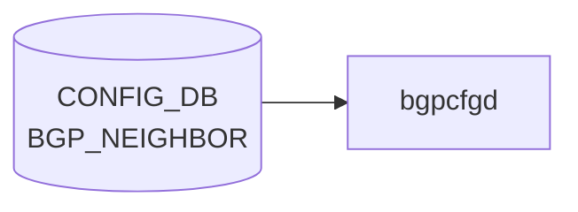

# BGP_NEIGHBOR テーブル

## 概要

BGP 隣接 (peer) を CONFIG_DB で定義するテーブル。`bgpcfgd` (テンプレ展開) または `frr-mgmt-framework` (DEVICE_METADATA の `frr_mgmt_framework_config = true` のとき) が読み出し、FRR (`bgpd`) に反映する[^1]。テーブル定義は 2 形態に分かれる:

- `BGP_NEIGHBOR_TEMPLATE_LIST` (key: `neighbor`): bgpcfgd テンプレ用の単純形式
- `BGP_NEIGHBOR_LIST` (key: `vrf_name`, `neighbor`): generic 形式。`frr_mgmt_framework_config = true` のときに使われる

<!-- cdb-mermaid -->
### データフロー (自動生成)



!!! note "凡例"
    CONFIG_DB から SAI までの典型経路を `docs/reference/config-db-orch-map.md` から機械生成したミニ図。詳細・例外は本ページ本文と対応表を参照。
<!-- /cdb-mermaid -->

## key 構造

```
BGP_NEIGHBOR|<neighbor>                  # template 形式
BGP_NEIGHBOR|<vrf_name>|<neighbor>       # generic 形式
```

`<neighbor>` は IP アドレス、`PORT.name`、`PORTCHANNEL.name`、または `Vlan<id>` 文字列の union。`<vrf_name>` は `BGP_GLOBALS.vrf_name` への leafref。

## 主要フィールド (sonic-bgp-cmn より継承)

`sonic-bgp-common.yang` の `sonic-bgp-cmn` grouping を `uses` する。代表的フィールド:

| フィールド | 型 | 説明 |
|-----------|----|------|
| `local_asn` | as-number | local-as override |
| `asn` | as-number | 隣接 AS 番号 |
| `peer_type` | enum `internal`/`external` | iBGP / eBGP |
| `ebgp_multihop` | boolean | EBGP multihop |
| `ebgp_multihop_ttl` | uint8 | multihop TTL |
| `auth_password` | string | MD5 認証パスワード |
| `keepalive` | uint16 | keepalive interval [sec] |
| `holdtime` | uint16 | hold time [sec] |
| `conn_retry` | uint16 | 再試行間隔 |
| `min_adv_interval` | uint16 | minimum advertisement interval |
| `local_addr` | ip-address | source address (update-source) |
| `passive_mode` | boolean | passive listener |
| `capability_ext_nexthop` | boolean | RFC5549 ext-nexthop |
| `enforce_first_as` | boolean | first-AS enforce |
| `solo_peer` | boolean | solo peer |
| `ttl_security_hops` | uint8 | GTSM hops |
| `bfd` | boolean | BFD multihop / BFD enable |
| `peer_port` | uint16 | TCP port |
| `admin_status` | string `up`/`down` | セッション管理状態 |
| `local_as_no_prepend` / `local_as_replace_as` | boolean | local-as 動作 |
| `peer_group_name` (generic のみ) | leafref `BGP_PEER_GROUP.peer_group_name` | peer-group 参照 |

## 派生テーブル

- `BGP_NEIGHBOR_AF` ... 隣接 × afi_safi のアドレスファミリ別設定（route-map、prefix-list、send-community、weight 等）。grouping `sonic-bgp-cmn-af` を `uses`

## 制約

- `BGP_NEIGHBOR_TEMPLATE_LIST` の `asn` は 1 以上（YANG `must` で refine）
- 一部 leaf に `must` 経由のクロス参照（`BGP_GLOBALS.vrf_name`、`BGP_PEER_GROUP`）がある

## 購読者

- `bgpcfgd` (`docker-fpm-frr` 内): CONFIG_DB → vtysh コマンド変換。テンプレベース
- `frr-mgmt-framework`: `DEVICE_METADATA.frr_mgmt_framework_config = true` のときに代替パスとして動作
- `bgpd` (FRR): vtysh / config 経由で間接反映

## 関連 CONFIG_DB / YANG / CLI

- 関連 CONFIG_DB: `BGP_GLOBALS`、`BGP_PEER_GROUP`、`BGP_NEIGHBOR_AF`、`BGP_DEVICE_GLOBAL`
- 関連 CLI: [`config bgp`](../cli/config-bgp.md) (shutdown / startup / remove neighbor)
- 関連 YANG: `sonic-bgp-neighbor`、`sonic-bgp-common`、`sonic-bgp-global`

<!-- ref-triangle:start -->

## 関連リファレンス

- YANG: [`sonic-bgp-neighbor`](../yang/sonic-bgp-neighbor.md) / `sonic-bgp-common`
- CLI: [`config bgp`](../cli/config-bgp.md)

<!-- ref-triangle:end -->

## 引用元

[^1]: YANG 定義: `sonic-bgp-neighbor.yang`. <https://github.com/sonic-net/sonic-buildimage/blob/9ea932ec2e18f35e58268ec2e4456b1d4afd65cd/src/sonic-yang-models/yang-models/sonic-bgp-neighbor.yang>; 共通 leaf 群は `sonic-bgp-common.yang` の `sonic-bgp-cmn` / `sonic-bgp-cmn-af` grouping

## 関連ページ
- [HLD: FRR-BGP Unified Mgmt Framework](../../routing/sonic-frr-bgp-extended-unified-configuration-management-framework.md)
- [CLI: config bgp](../cli/config-bgp.md)
- [CLI: show bgp](../cli/show-bgp.md)
- [YANG: sonic-bgp-neighbor](../yang/sonic-bgp-neighbor.md)
