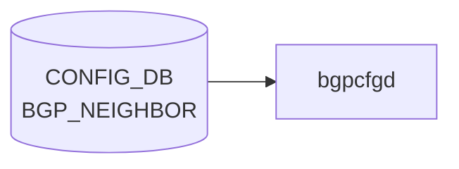

# BGP_NEIGHBOR テーブル

## 概要

[BGP](../../reference/glossary.md#term-bgp) 隣接 (peer) を [CONFIG_DB](../../reference/glossary.md#term-config_db) で定義するテーブル。`bgpcfgd` (テンプレ展開) または `frr-mgmt-framework` (DEVICE_METADATA の `frr_mgmt_framework_config = true` のとき) が読み出し、[FRR](../../reference/glossary.md#term-frr) (`bgpd`) に反映する[^1]。テーブル定義は 2 形態に分かれる:

- `BGP_NEIGHBOR_TEMPLATE_LIST` (key: `neighbor`): [bgpcfgd](../../reference/glossary.md#term-bgpcfgd) テンプレ用の単純形式
- `BGP_NEIGHBOR_LIST` (key: `vrf_name`, `neighbor`): generic 形式。`frr_mgmt_framework_config = true` のときに使われる

<!-- cdb-mermaid -->
### データフロー (自動生成)



!!! note "凡例"
    CONFIG_DB から SAI までの典型経路を `docs/reference/config-db-orch-map.md` から機械生成したミニ図。詳細・例外は本ページ本文と対応表を参照。
<!-- /cdb-mermaid -->

## key 構造

```text
BGP_NEIGHBOR|<neighbor>                  # template 形式
BGP_NEIGHBOR|<vrf_name>|<neighbor>       # generic 形式
```

`<neighbor>` は IP アドレス、`PORT.name`、`PORTCHANNEL.name`、または `Vlan<id>` 文字列の union。`<vrf_name>` は `BGP_GLOBALS.vrf_name` への leafref。

## 主要フィールド (sonic-bgp-cmn より継承)

`sonic-bgp-common.yang` の `sonic-bgp-cmn` grouping を `uses` する。代表的フィールド:

| フィールド | 型 | 説明 |
|-----------|----|------|
| `local_asn` | as-number | local-as override |
| `asn` | as-number | 隣接 AS 番号 |
| `peer_type` | enum `internal`/`external` | iBGP / eBGP |
| `ebgp_multihop` | boolean | EBGP multihop |
| `ebgp_multihop_ttl` | uint8 | multihop TTL |
| `auth_password` | string | MD5 認証パスワード |
| `keepalive` | uint16 | keepalive interval [sec] |
| `holdtime` | uint16 | hold time [sec] |
| `conn_retry` | uint16 | 再試行間隔 |
| `min_adv_interval` | uint16 | minimum advertisement interval |
| `local_addr` | ip-address | source address (update-source) |
| `passive_mode` | boolean | passive listener |
| `capability_ext_nexthop` | boolean | RFC5549 ext-nexthop |
| `enforce_first_as` | boolean | first-AS enforce |
| `solo_peer` | boolean | solo peer |
| `ttl_security_hops` | uint8 | GTSM hops |
| `bfd` | boolean | [BFD](../../reference/glossary.md#term-bfd) multihop / [BFD](../../reference/glossary.md#term-bfd) enable |
| `peer_port` | uint16 | TCP port |
| `admin_status` | string `up`/`down` | セッション管理状態 |
| `local_as_no_prepend` / `local_as_replace_as` | boolean | local-as 動作 |
| `peer_group_name` (generic のみ) | leafref `BGP_PEER_GROUP.peer_group_name` | peer-group 参照 |

## 派生テーブル

- `BGP_NEIGHBOR_AF` ... 隣接 × afi_safi のアドレスファミリ別設定（route-map、prefix-list、send-community、weight 等）。grouping `sonic-bgp-cmn-af` を `uses`

## 制約

- `BGP_NEIGHBOR_TEMPLATE_LIST` の `asn` は 1 以上（[YANG](../../reference/glossary.md#term-yang) `must` で refine）
- 一部 leaf に `must` 経由のクロス参照（`BGP_GLOBALS.vrf_name`、`BGP_PEER_GROUP`）がある

## 購読者

- `bgpcfgd` (`docker-fpm-frr` 内): [CONFIG_DB](../../reference/glossary.md#term-config_db) → vtysh コマンド変換。テンプレベース
- `frr-mgmt-framework`: `DEVICE_METADATA.frr_mgmt_framework_config = true` のときに代替パスとして動作
- `bgpd` ([FRR](../../reference/glossary.md#term-frr)): vtysh / config 経由で間接反映

## 関連 CONFIG_DB / YANG / CLI

- 関連 [CONFIG_DB](../../reference/glossary.md#term-config_db): `BGP_GLOBALS`、`BGP_PEER_GROUP`、`BGP_NEIGHBOR_AF`、`BGP_DEVICE_GLOBAL`
- 関連 CLI: [`config bgp`](../cli/config-bgp.md) (shutdown / startup / remove neighbor)
- 関連 [YANG](../../reference/glossary.md#term-yang): `sonic-bgp-neighbor`、`sonic-bgp-common`、`sonic-bgp-global`

<!-- ref-triangle:start -->

## 関連リファレンス

- [YANG](../../reference/glossary.md#term-yang): [`sonic-bgp-neighbor`](../yang/sonic-bgp-neighbor.md) / `sonic-bgp-common`
- CLI: [`config bgp`](../cli/config-bgp.md)

<!-- ref-triangle:end -->

## 引用元

[^1]: YANG 定義: `sonic-bgp-neighbor.yang`. <https://github.com/sonic-net/sonic-buildimage/blob/9ea932ec2e18f35e58268ec2e4456b1d4afd65cd/src/sonic-yang-models/yang-models/sonic-bgp-neighbor.yang>; 共通 leaf 群は `sonic-bgp-common.yang` の `sonic-bgp-cmn` / `sonic-bgp-cmn-af` grouping

## 関連ページ
- [HLD: FRR-BGP Unified Mgmt Framework](../../routing/sonic-frr-bgp-extended-unified-configuration-management-framework.md)
- [CLI: config bgp](../cli/config-bgp.md)
- [CLI: show bgp](../cli/show-bgp.md)
- [YANG: sonic-bgp-neighbor](../yang/sonic-bgp-neighbor.md)

<!-- ops-hint -->
## 運用ヒント

### 典型値

- key 形式: `BGP_NEIGHBOR|<neighbor-ip>` (frr 系) または `BGP_NEIGHBOR|<vrf>|<neighbor-ip>`。
- `asn`: 対向 AS 番号（4-byte ASN 可）。
- `local_addr`: 自身の IP。
- `admin_status`: `up`。
- `holdtime`: 180、`keepalive`: 60（標準）。
- `name`: 対向ホスト名（運用識別用）。

### よくある誤設定

- `local_addr` を未設定 or 誤ったインタフェース IP にすると update-source が解決できず neighbor 確立せず。
- `asn` を string で入れても通るが、4-byte ASN を `65000.1` 形式で書くと [bgpcfgd](../../reference/glossary.md#term-bgpcfgd) がパースに失敗する版がある。10 進で書く。
- iBGP で `local_addr` を物理 IF ではなく Loopback0 にしないと片側 down で [BGP](../../reference/glossary.md#term-bgp) が落ちる。

### 確認コマンド

```bash
sonic-db-cli CONFIG_DB hgetall 'BGP_NEIGHBOR|10.0.0.1'
show ip bgp summary
vtysh -c 'show bgp neighbor 10.0.0.1'
```
<!-- /ops-hint -->

<!-- value-behavior -->
## 値依存挙動マトリクス

### `peer_type` (`bgp_peer_type`、最重要 enum)

| 値 | bgpcfgd テンプレディレクトリ | 主な差異 |
|----|----------------------------|---------|
| `internal` | `bgpd/templates/internal/` | timers 3/10、`send-community` 自動付与、BackEnd/chassis-packet で `next-hop-self force` |
| `external` / 未指定 (`general`) | `bgpd/templates/general/` | timers 60/180、ToRRouter で `allowas-in 1`、SpineRouter UpstreamLC で `table-map` |
| `dynamic` | `bgpd/templates/dynamic/` | `bgp listen range` 生成、`ip_range` フィールドを展開 |
| `monitors` | `bgpd/templates/monitors/` | BGP_MONITORS テーブル専用 |
| `voq_chassis` | `bgpd/templates/voq_chassis/` | VoQ chassis 間 iBGP |
| `sentinels` | `bgpd/templates/sentinels/` | sentinel ピア |

### `admin_status`

| 値 | bgpcfgd 動作 | FRR コマンド |
|----|-------------|-------------|
| `up` | `apply_admin_status("no shutdown")` | `no neighbor <addr> shutdown` |
| `down` | `apply_admin_status("shutdown")` | `neighbor <addr> shutdown` |

> **注意**: ライブ更新可能なのは `admin_status` のみ。他フィールドの変更は `managers_bgp.py:309` の制約でエラーログを出して drop。

<!-- /value-behavior -->

<!-- cdb-exceptions -->
## 例外条件・特殊挙動

| 条件 | 挙動 | ソース |
|------|------|--------|
| Loopback0 IPv4 未設定 かつ `bgp_router_id` 未設定 | `log_warn` して `return False` (再試行待ち) | `managers_bgp.py` `add_peer()` |
| `local_addr` フィールドが欠如 | `Missing attribute 'local_addr'` を warn ログ、peer 追加は続行 | `managers_bgp.py` |
| `check_neig_meta=true` かつ `name` が DEVICE_NEIGHBOR_METADATA に未登録 | `DEVICE_NEIGHBOR_METADATA is not ready for neighbor` を log_info → return False (再試行) | `managers_bgp.py` `add_peer()` |
| `peer_group_name` に未存在 peer-group を参照 (frrcfgd) | `invalid peer-group %s was referenced` を LOG_ERR → continue | `frrcfgd.py` L2828 |
| interface 型 neighbor の作成失敗 | `failed to create neighbor of interface %s for VRF %s` を LOG_ERR → continue | `frrcfgd.py` L2810 |
| `admin_status` が `'up'`/`'down'` 以外 | `wrong attribute value` を LOG_ERR → drop | `managers_bgp.py` `change_admin_status()` |
| `local_asn` が未設定の VRF | frrcfgd が LOG_DEBUG して skip | `frrcfgd.py` L2660 |
| Jinja2 テンプレートレンダリング失敗 | `log_err` して `return True` (再試行なし) | `managers_bgp.py` `add_peer()` |
<!-- /cdb-exceptions -->


<!-- runtime-trace -->
## 実コンテナ動作トレース

### 段階 1 — Consumer 登録

`bgpcfgd` が CONFIG_DB の `BGP_NEIGHBOR` テーブルを購読する。

`BGP_NEIGHBOR` は `<vrf>|<neighbor>` の key 構造。peer-group を参照する場合がある。

### 段階 2 — CFG→APPL 翻訳

なし (FRR vtysh 経由)

### 段階 3 — APPL→SAI

なし (FRR BGP ネイバー管理)

### 段階 4 — タイミングと副作用

**適用タイミング**: 変化検知後 FRR にネイバー定義コマンドを発行。新規ネイバーは即座に接続試行を開始。削除は BGP session を即座に切断。

**副作用**: ネイバー削除は該当 BGP session の NOTIFICATION 送信と経路削除を引き起こす。パスワード変更は session リセットを引き起こす。
<!-- /runtime-trace -->

<!-- entry-points -->
## 書き込み入り口 (Direction A)

対象テーブル: `BGP_NEIGHBOR`

### CLI
- `config bgp startup/shutdown all`
- `vtysh` 経由 neighbor コマンド群 (bgpcfgd が CONFIG_DB へ書き戻し)
  - ソース: `sonic-utilities/config/main.py, sonic-frr bgpcfgd`

### minigraph / sonic-cfggen
- あり: `sonic-cfggen -m <minigraph.xml>` 実行時に本テーブルが生成・上書きされる

### REST / gNMI (sonic-mgmt-common)
- sonic-mgmt-common OpenConfig BGP neighbor 経由

### db_migrator
- なし

### ビルド時デフォルト (init_cfg / j2 テンプレート)
- なし

### ハードコードデフォルト
- なし

### ランタイム注入 (デーモン自動書き込み)
- `bgpcfgd` が FRR running-config を CONFIG_DB と同期
<!-- /entry-points -->

<!-- glossary-links-injected: 9133f44230c2 -->
