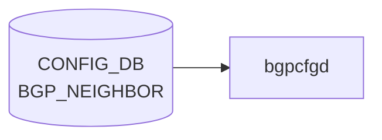

# BGP_NEIGHBOR テーブル

## 概要

[BGP](../../reference/glossary.md#term-bgp) 隣接 (peer) を [CONFIG_DB](../../reference/glossary.md#term-config_db) で定義するテーブル。`bgpcfgd` (テンプレ展開) または `frr-mgmt-framework` (DEVICE_METADATA の `frr_mgmt_framework_config = true` のとき) が読み出し、[FRR](../../reference/glossary.md#term-frr) (`bgpd`) に反映する[^1]。テーブル定義は 2 形態に分かれる:

- `BGP_NEIGHBOR_TEMPLATE_LIST` (key: `neighbor`): [bgpcfgd](../../reference/glossary.md#term-bgpcfgd) テンプレ用の単純形式
- `BGP_NEIGHBOR_LIST` (key: `vrf_name`, `neighbor`): generic 形式。`frr_mgmt_framework_config = true` のときに使われる

<!-- cdb-mermaid -->
### データフロー (自動生成)



!!! note "凡例"
    CONFIG_DB から SAI までの典型経路を `docs/reference/config-db-orch-map.md` から機械生成したミニ図。詳細・例外は本ページ本文と対応表を参照。
<!-- /cdb-mermaid -->

## key 構造

```text
BGP_NEIGHBOR|<neighbor>                  # template 形式
BGP_NEIGHBOR|<vrf_name>|<neighbor>       # generic 形式
```

`<neighbor>` は IP アドレス、`PORT.name`、`PORTCHANNEL.name`、または `Vlan<id>` 文字列の union。`<vrf_name>` は `BGP_GLOBALS.vrf_name` への leafref。

## 主要フィールド (sonic-bgp-cmn より継承)

`sonic-bgp-common.yang` の `sonic-bgp-cmn` grouping を `uses` する。代表的フィールド:

| フィールド | 型 | 説明 |
|-----------|----|------|
| `local_asn` | as-number | local-as override |
| `asn` | as-number | 隣接 AS 番号 |
| `peer_type` | enum `internal`/`external` | iBGP / eBGP |
| `ebgp_multihop` | boolean | EBGP multihop |
| `ebgp_multihop_ttl` | uint8 | multihop TTL |
| `auth_password` | string | MD5 認証パスワード |
| `keepalive` | uint16 | keepalive interval [sec] |
| `holdtime` | uint16 | hold time [sec] |
| `conn_retry` | uint16 | 再試行間隔 |
| `min_adv_interval` | uint16 | minimum advertisement interval |
| `local_addr` | ip-address | source address (update-source) |
| `passive_mode` | boolean | passive listener |
| `capability_ext_nexthop` | boolean | RFC5549 ext-nexthop |
| `enforce_first_as` | boolean | first-AS enforce |
| `solo_peer` | boolean | solo peer |
| `ttl_security_hops` | uint8 | GTSM hops |
| `bfd` | boolean | [BFD](../../reference/glossary.md#term-bfd) multihop / [BFD](../../reference/glossary.md#term-bfd) enable |
| `peer_port` | uint16 | TCP port |
| `admin_status` | string `up`/`down` | セッション管理状態 |
| `local_as_no_prepend` / `local_as_replace_as` | boolean | local-as 動作 |
| `peer_group_name` (generic のみ) | leafref `BGP_PEER_GROUP.peer_group_name` | peer-group 参照 |

## 派生テーブル

- `BGP_NEIGHBOR_AF` ... 隣接 × afi_safi のアドレスファミリ別設定（route-map、prefix-list、send-community、weight 等）。grouping `sonic-bgp-cmn-af` を `uses`

## 制約

- `BGP_NEIGHBOR_TEMPLATE_LIST` の `asn` は 1 以上（[YANG](../../reference/glossary.md#term-yang) `must` で refine）
- 一部 leaf に `must` 経由のクロス参照（`BGP_GLOBALS.vrf_name`、`BGP_PEER_GROUP`）がある

## 購読者

- `bgpcfgd` (`docker-fpm-frr` 内): [CONFIG_DB](../../reference/glossary.md#term-config_db) → vtysh コマンド変換。テンプレベース
- `frr-mgmt-framework`: `DEVICE_METADATA.frr_mgmt_framework_config = true` のときに代替パスとして動作
- `bgpd` ([FRR](../../reference/glossary.md#term-frr)): vtysh / config 経由で間接反映

## 関連 CONFIG_DB / YANG / CLI

- 関連 [CONFIG_DB](../../reference/glossary.md#term-config_db): `BGP_GLOBALS`、`BGP_PEER_GROUP`、`BGP_NEIGHBOR_AF`、`BGP_DEVICE_GLOBAL`
- 関連 CLI: [`config bgp`](../cli/config-bgp.md) (shutdown / startup / remove neighbor)
- 関連 [YANG](../../reference/glossary.md#term-yang): `sonic-bgp-neighbor`、`sonic-bgp-common`、`sonic-bgp-global`

<!-- ref-triangle:start -->

## 関連リファレンス

- [YANG](../../reference/glossary.md#term-yang): [`sonic-bgp-neighbor`](../yang/sonic-bgp-neighbor.md) / `sonic-bgp-common`
- CLI: [`config bgp`](../cli/config-bgp.md)

<!-- ref-triangle:end -->

## 引用元

[^1]: YANG 定義: `sonic-bgp-neighbor.yang`. <https://github.com/sonic-net/sonic-buildimage/blob/9ea932ec2e18f35e58268ec2e4456b1d4afd65cd/src/sonic-yang-models/yang-models/sonic-bgp-neighbor.yang>; 共通 leaf 群は `sonic-bgp-common.yang` の `sonic-bgp-cmn` / `sonic-bgp-cmn-af` grouping

## 関連ページ
- [HLD: FRR-BGP Unified Mgmt Framework](../../routing/sonic-frr-bgp-extended-unified-configuration-management-framework.md)
- [CLI: config bgp](../cli/config-bgp.md)
- [CLI: show bgp](../cli/show-bgp.md)
- [YANG: sonic-bgp-neighbor](../yang/sonic-bgp-neighbor.md)

<!-- ops-hint -->
## 運用ヒント

### 典型値

- key 形式: `BGP_NEIGHBOR|<neighbor-ip>` (frr 系) または `BGP_NEIGHBOR|<vrf>|<neighbor-ip>`。
- `asn`: 対向 AS 番号（4-byte ASN 可）。
- `local_addr`: 自身の IP。
- `admin_status`: `up`。
- `holdtime`: 180、`keepalive`: 60（標準）。
- `name`: 対向ホスト名（運用識別用）。

### よくある誤設定

- `local_addr` を未設定 or 誤ったインタフェース IP にすると update-source が解決できず neighbor 確立せず。
- `asn` を string で入れても通るが、4-byte ASN を `65000.1` 形式で書くと [bgpcfgd](../../reference/glossary.md#term-bgpcfgd) がパースに失敗する版がある。10 進で書く。
- iBGP で `local_addr` を物理 IF ではなく Loopback0 にしないと片側 down で [BGP](../../reference/glossary.md#term-bgp) が落ちる。

### 確認コマンド

```bash
sonic-db-cli CONFIG_DB hgetall 'BGP_NEIGHBOR|10.0.0.1'
show ip bgp summary
vtysh -c 'show bgp neighbor 10.0.0.1'
```
<!-- /ops-hint -->

<!-- value-behavior -->
## 値依存挙動マトリクス

### `peer_type` (`bgp_peer_type`、最重要 enum)

| 値 | [bgpcfgd](../../reference/glossary.md#term-bgpcfgd) テンプレディレクトリ | 主な差異 |
|----|----------------------------|---------|
| `internal` | `bgpd/templates/internal/` | timers 3/10、`send-community` 自動付与、BackEnd/chassis-packet で `next-hop-self force` |
| `external` / 未指定 (`general`) | `bgpd/templates/general/` | timers 60/180、ToRRouter で `allowas-in 1`、SpineRouter UpstreamLC で `table-map` |
| `dynamic` | `bgpd/templates/dynamic/` | `bgp listen range` 生成、`ip_range` フィールドを展開 |
| `monitors` | `bgpd/templates/monitors/` | BGP_MONITORS テーブル専用 |
| `voq_chassis` | `bgpd/templates/voq_chassis/` | VoQ chassis 間 iBGP |
| `sentinels` | `bgpd/templates/sentinels/` | sentinel ピア |

### `admin_status`

| 値 | bgpcfgd 動作 | [FRR](../../reference/glossary.md#term-frr) コマンド |
|----|-------------|-------------|
| `up` | `apply_admin_status("no shutdown")` | `no neighbor <addr> shutdown` |
| `down` | `apply_admin_status("shutdown")` | `neighbor <addr> shutdown` |

> **注意**: ライブ更新可能なのは `admin_status` のみ。他フィールドの変更は `managers_bgp.py:309` の制約でエラーログを出して drop。

<!-- /value-behavior -->

<!-- cdb-exceptions -->
## 例外条件・特殊挙動

| 条件 | 挙動 | ソース |
|------|------|--------|
| Loopback0 IPv4 未設定 かつ `bgp_router_id` 未設定 | `log_warn` して `return False` (再試行待ち) | `managers_bgp.py` `add_peer()` |
| `local_addr` フィールドが欠如 | `Missing attribute 'local_addr'` を warn ログ、peer 追加は続行 | `managers_bgp.py` |
| `check_neig_meta=true` かつ `name` が DEVICE_NEIGHBOR_METADATA に未登録 | `DEVICE_NEIGHBOR_METADATA is not ready for neighbor` を log_info → return False (再試行) | `managers_bgp.py` `add_peer()` |
| `peer_group_name` に未存在 peer-group を参照 (frrcfgd) | `invalid peer-group %s was referenced` を LOG_ERR → continue | `frrcfgd.py` L2828 |
| interface 型 neighbor の作成失敗 | `failed to create neighbor of interface %s for VRF %s` を LOG_ERR → continue | `frrcfgd.py` L2810 |
| `admin_status` が `'up'`/`'down'` 以外 | `wrong attribute value` を LOG_ERR → drop | `managers_bgp.py` `change_admin_status()` |
| `local_asn` が未設定の [VRF](../../reference/glossary.md#term-vrf) | frrcfgd が LOG_DEBUG して skip | `frrcfgd.py` L2660 |
| Jinja2 テンプレートレンダリング失敗 | `log_err` して `return True` (再試行なし) | `managers_bgp.py` `add_peer()` |
<!-- /cdb-exceptions -->

<!-- runtime-trace -->
## 実コンテナ動作トレース

### 段階 1 — Consumer 登録

`bgpcfgd` が CONFIG_DB の `BGP_NEIGHBOR` テーブルを購読する。

`BGP_NEIGHBOR` は `<vrf>|<neighbor>` の key 構造。peer-group を参照する場合がある。

### 段階 2 — CFG→APPL 翻訳

なし (FRR vtysh 経由)

### 段階 3 — APPL→SAI

なし (FRR [BGP](../../reference/glossary.md#term-bgp) ネイバー管理)

### 段階 4 — タイミングと副作用

**適用タイミング**: 変化検知後 FRR にネイバー定義コマンドを発行。新規ネイバーは即座に接続試行を開始。削除は BGP session を即座に切断。

**副作用**: ネイバー削除は該当 BGP session の NOTIFICATION 送信と経路削除を引き起こす。パスワード変更は session リセットを引き起こす。
<!-- /runtime-trace -->

<!-- entry-points -->
## 書き込み入り口 (Direction A)

対象テーブル: `BGP_NEIGHBOR`

### CLI
- `config bgp startup/shutdown all`
- `vtysh` 経由 neighbor コマンド群 (bgpcfgd が CONFIG_DB へ書き戻し)
  - ソース: `sonic-utilities/config/main.py, sonic-frr bgpcfgd`

### minigraph / sonic-cfggen
- あり: `sonic-cfggen -m <minigraph.xml>` 実行時に本テーブルが生成・上書きされる

### REST / gNMI (sonic-mgmt-common)
- [sonic-mgmt](../../reference/glossary.md#term-sonic-mgmt)-common OpenConfig BGP neighbor 経由

### db_migrator
- なし

### ビルド時デフォルト (init_cfg / j2 テンプレート)
- なし

### ハードコードデフォルト
- なし

### ランタイム注入 (デーモン自動書き込み)
- `bgpcfgd` が FRR running-config を CONFIG_DB と同期
<!-- /entry-points -->

<!-- derivation -->
## 派生・条件付き登録 (Phase 6/7)

### Phase 6: 値による他フィールド自動派生

| 条件 | 派生先 | evidence |
|---|---|---|
| minigraph XML の `<BGPSession>` エントリ（name != 'BGPMonitor'） | `BGP_NEIGHBOR` テーブルにエントリを生成 | `sonic-buildimage/src/sonic-config-engine/minigraph.py:1355,2273` |
| `type IN [MultiAsicInternalPeer]` | `internal_peers` に分類（loopback 参照） | `sonic-buildimage/src/sonic-config-engine/minigraph.py:1355-1360` |
| `admin_status` が VoQ chassis 構成時 | `enable_internal_bgp_session()` により `admin_status='up'` に強制設定 | `sonic-buildimage/src/sonic-config-engine/minigraph.py:1888-1901` |

### Phase 7: 条件付き module/manager 登録

| 条件 | 登録 module | evidence |
|---|---|---|
| 常時（条件なし） | `BGPPeerMgrBase(peer_type="general")` が `BGP_NEIGHBOR` を購読 | `sonic-buildimage/src/sonic-bgpcfgd/bgpcfgd/main.py:87` |
| `check_neig_meta=True` のとき | `DEVICE_NEIGHBOR_METADATA` 依存関係を追加 | `sonic-buildimage/src/sonic-bgpcfgd/bgpcfgd/managers_bgp.py:137` |

### grep カバレッジ

- minigraph.py L2273: BGP_NEIGHBOR 代入
- bgpcfgd/main.py L87: 条件なし登録（check_neig_meta=True）
<!-- /derivation -->
<!-- handler-branching -->
### Phase 8: Handler メソッド内分岐

| Manager / Handler | メソッド | 分岐条件 | 効果 | evidence |
|---|---|---|---|---|
| `BGPPeerMgrBase` | `set_handler()` | `peer_key NOT IN self.peers` | `add_peer()` 新規追加 | `sonic-buildimage/src/sonic-bgpcfgd/bgpcfgd/managers_bgp.py:167` |
| `BGPPeerMgrBase` | `set_handler()` | `peer_key IN self.peers` | `update_peer()` 更新 | `sonic-buildimage/src/sonic-bgpcfgd/bgpcfgd/managers_bgp.py:169` |
| `BGPPeerMgrBase` | `add_peer()` | `lo_ipv4 is None AND bgp_router_id not configured` | 早期 `return False` | `sonic-buildimage/src/sonic-bgpcfgd/bgpcfgd/managers_bgp.py:186-189` |
| `BGPPeerMgrBase` | `add_peer()` | `check_neig_meta AND data["name"] NOT IN neigmeta` | 早期 `return False`（DEVICE_NEIGHBOR_METADATA 未準備ガード） | `sonic-buildimage/src/sonic-bgpcfgd/bgpcfgd/managers_bgp.py:221-223` |
| `BGPPeerMgrBase` | `update_peer()` | `"admin_status" in data` | `change_admin_status()` 委譲 | `sonic-buildimage/src/sonic-bgpcfgd/bgpcfgd/managers_bgp.py:314` |
| `BGPPeerMgrBase` | `change_admin_status()` | `admin_status == 'up'` | FRR に `no neighbor X shutdown` | `sonic-buildimage/src/sonic-bgpcfgd/bgpcfgd/managers_bgp.py:333` |
| `BGPPeerMgrBase` | `change_admin_status()` | `admin_status == 'down'` | FRR に `neighbor X shutdown` | `sonic-buildimage/src/sonic-bgpcfgd/bgpcfgd/managers_bgp.py:335` |
| `BGPPeerMgrBase` | `change_admin_status()` | `admin_status` が up/down 以外 | `log_err` のみ（処理継続） | `sonic-buildimage/src/sonic-bgpcfgd/bgpcfgd/managers_bgp.py:337-339` |

> **スキャン証跡**: `BGPPeerMgrBase` 597 行全行読了。7 件分岐抽出。
<!-- /handler-branching -->
<!-- cross-refs -->
## 暗黙参照テーブル (Phase C)

BGP_NEIGHBOR の処理において YANG の leafref 定義を超えて実装上で参照される他テーブルを示す。

| 参照先テーブル / フィールド | 参照方向 | 条件 | 参照元 evidence |
|----------------------------|---------|------|----------------|
| `DEVICE_METADATA\|localhost\|bgp_asn` | 読み取り（必須依存） | 常時。bgp_asn 未設定なら neighbor 追加を待機 | `managers_bgp.py` L119, L192; `frrcfgd.py` L2163 |
| `DEVICE_METADATA\|localhost\|type` / `subtype` | 読み取り（条件分岐） | 常時。デバイスロール (ToRRouter / SpineRouter 等) でテンプレート分岐 | `managers_bgp.py` L120; Jinja2 templates |
| `DEVICE_METADATA\|localhost\|deployment_id` | 読み取り（条件付き） | `bgp.use_deployment_id=true` のとき。community / routemap に埋め込み | `managers_bgp.py` L143 |
| `LOOPBACK_INTERFACE\|Loopback0\|<prefix>` | 読み取り（ガード） | 常時。IPv4 未設定 かつ bgp_router_id 未設定 → `return False` | `managers_bgp.py` L121, L184–189, L216–218 |
| `LOOPBACK_INTERFACE\|Loopback4096\|<prefix>` | 読み取り（条件付き） | `peer_type="internal"` のとき依存に追加 | `managers_bgp.py` L146 |
| `DEVICE_NEIGHBOR_METADATA` | 読み取り（条件付き） | `bgp.use_neighbors_meta=true` のとき。`name` フィールドが未登録 → 待機 | `managers_bgp.py` L140, L220–224 |
| `BGP_DEVICE_GLOBAL\|STATE\|tsa_enabled` | 読み取り（常時） | peer-group テンプレート生成時に TSA routemap を動的付与 | `managers_bgp.py` L122; `BGPPeerGroupMgr.update_pg()` |
| `BGP_DEVICE_GLOBAL\|STATE\|idf_isolation_state` | 読み取り（常時） | peer-group テンプレート生成時に IDF isolation routemap を付与 | `managers_bgp.py` L123; `BGPPeerGroupMgr.update_pg()` |
| `BGP_BBR\|all\|status` | 読み取り（常時） | Jinja2 テンプレートへ `CONFIG_DB__BGP_BBR` として渡し、BBR 設定を制御 | `managers_bgp.py` L206 |
| `BGP_GLOBALS\|<vrf>\|local_asn` | 読み取り（frrcfgd パス） | `frr_mgmt_framework_config=true` のとき。[VRF](../../reference/glossary.md#term-vrf) の ASN 解決に必須 | `frrcfgd.py` L2175–2178, L2450–2453 |
| `BGP_PEER_GROUP\|<vrf>\|<pg_name>` | 存在確認（frrcfgd パス） | `peer_group_name` 指定時。存在しなければ `LOG_ERR` + drop | `frrcfgd.py` L2826–2830 |
| `PORT\|<name>` / `PORTCHANNEL\|<name>` | 存在確認（interface 型 neighbor） | `neighbor` フィールドが IP でなくインタフェース名の場合 | YANG leafref; `frrcfgd.py` L2807 |
| `INTERFACE`（ローカルアドレス一覧） | 読み取り（ガード） | `local_addr` 設定時。該当 IP が現存インタフェースになければ待機 | `managers_bgp.py` L124–125, `get_local_interface()` |

> **注意**: `DEVICE_METADATA.frr_mgmt_framework_config` の値が `true` でない場合、BGP_GLOBALS / BGP_PEER_GROUP（frrcfgd パス）への参照は発生せず、代わりに bgpcfgd (テンプレートベース) が動作する。

<!-- /cross-refs -->
<!-- constants -->
## ハードコード定数 (Phase E)

### BGP タイマー固定値（Jinja2 テンプレート）

| 定数 | 値 | 対象 peer_type | ソース |
|------|----|----------------|--------|
| `timers connect` | **10** 秒 | 全 peer_type 共通 | `general/instance.conf.j2:11`、`internal/instance.conf.j2:7`、`voq_chassis/instance.conf.j2:14` |
| keepalive スキップ閾値 | **60** 秒 | general (一致時はコマンド省略) | `general/instance.conf.j2:7` |
| holdtime スキップ閾値 | **180** 秒 | general (一致時はコマンド省略) | `general/instance.conf.j2:8` |
| keepalive 強制値 | **3** 秒 | internal | `internal/instance.conf.j2:6` |
| holdtime 強制値 | **10** 秒 | internal | `internal/instance.conf.j2:6` |
| keepalive 強制値 | **2** 秒 | voq_chassis | `voq_chassis/instance.conf.j2:13` |
| holdtime 強制値 | **7** 秒 | voq_chassis | `voq_chassis/instance.conf.j2:13` |

### BGP 上限値

| 定数 | 値 | ソース |
|------|----|--------|
| `maximum-paths ibgp` IPv4 (constants.yml 実値) | **514** | `files/image_config/constants/constants.yml:29` |
| `maximum-paths ibgp` IPv6 (constants.yml 実値) | **514** | `files/image_config/constants/constants.yml:30` |
| `maximum-paths ibgp` Jinja2 fallback | **64** | `voq_chassis/instance.conf.j2:22,29` |
| `allowas-in` | **1** | `general/peer-group.conf.j2`、`internal/peer-group.conf.j2`、`voq_chassis/peer-group.conf.j2` |
| `ttl-security hops` (chassis-packet internal) | **1** | `internal/peer-group.conf.j2:8,22` |

### Graceful Restart タイマー (ToRRouter 限定)

| 定数 | 値 | ソース |
|------|----|--------|
| `bgp graceful-restart restart-time` | **240** 秒 (constants.yml: `restart_time: 240`) | `bgpd.main.conf.j2:119`、`constants.yml:24` |
| `bgp graceful-restart select-defer-time` | **45** 秒 (Jinja2 `\| default(45)`) | `bgpd.main.conf.j2:122` |

### 起動時待機・ポーリング定数 (Python)

| 定数 | 値 | ソース |
|------|----|--------|
| FRR daemon 起動待ちタイムアウト | **20** 秒 | `main.py:47` (`wait_for_daemons(seconds=20)`) |
| FRR daemon ポーリング sleep | **100** ms | `frr.py:30` (`time.sleep(0.1)`) |
| mgmtd datastore 最大試行回数 | **10** 回 (≈5 秒) | `main.py:51` |
| mgmtd vtysh timeout | **2** 秒 | `main.py:54` |
| mgmtd ポーリング sleep | **500** ms | `main.py:64` (`time.sleep(0.5)`) |
| `Runner.SELECT_TIMEOUT` (メインループ) | **1000** ms | `runner.py:21` |

### BMP 接続定数 (frr_bmp/bmp 機能有効時)

| 定数 | 値 | ソース |
|------|----|--------|
| BMP listen port | **5000** | `bgpd.main.conf.j2:136` |
| `bmp connect` min-retry | **10000** ms | `bgpd.main.conf.j2:136` |
| `bmp connect` max-retry | **15000** ms | `bgpd.main.conf.j2:136` |
| `bmp stats interval` | **1000** ms | `bgpd.main.conf.j2:133` |
| `bmp mirror buffer-limit` | **4294967214** bytes | `bgpd.main.conf.j2:130` |

> **discrepancy**: `timers connect 10` は YANG `conn_retry` フィールドと独立してハードコード発行される。bgpcfgd 経路では `conn_retry` の値は FRR に渡らない（frrcfgd 経路のみ有効）。  
> **discrepancy**: `internal` / `voq_chassis` peer_type では CONFIG_DB の `keepalive`/`holdtime` 値は完全に無視され、テンプレートの固定値 (3/10、2/7) が強制適用される。  
> 中間調査詳細: `meta/_intermediate/cdb-flow/bgp-neighbor-constants.md`

<!-- /constants -->
<!-- defaults -->
## コード由来の暗黙デフォルト (Phase A)

YANG には `default` 文が一切ない。フィールドごとのランタイム実効値はテンプレートやコードで決まる。

### keepalive / holdtime

| 書き込み経路 | keepalive | holdtime | 根拠 |
|------------|-----------|----------|------|
| minigraph (XML `<HoldTime>` / `<KeepAliveTime>` 欠落時) | **60** | **180** | `minigraph.py:1316,1320` |
| bgpcfgd `general` テンプレート (CONFIG_DB 値が 60/180 のとき) | FRR デフォルトに委任 | FRR デフォルトに委任 | `general/instance.conf.j2:7-10` |
| bgpcfgd `internal` テンプレート | **3** (強制) | **10** (強制) | `internal/instance.conf.j2:6` |
| bgpcfgd `voq_chassis` テンプレート | **2** (強制) | **7** (強制) | `voq_chassis/instance.conf.j2:13` |
| frrcfgd 経路 (REST/[gNMI](../../reference/glossary.md#term-gnmi)) | CONFIG_DB 値をそのまま送出 | 同左 | `frrcfgd.py:1874` |

> **discrepancy**: `peer_type=internal` では CONFIG_DB の `keepalive`/`holdtime` 値は無視される。

### admin_status (フィールド未設定時)

bgpcfgd `general` テンプレート (`general/instance.conf.j2:13`):
- `admin_status` フィールドなし + `DEVICE_METADATA.localhost.default_bgp_status` が `'down'` → `neighbor X shutdown` を発行
- `admin_status` フィールドなし + `default_bgp_status` も未設定 → shutdown なし = **ピアは up**

minigraph 経路:
- external (general) ピア: `admin_status` フィールドを **書き込まない** (→ 上記フォールバックに委ねる)
- internal / VoQ chassis ピア: `admin_status = 'up'` を強制書き込み (`minigraph.py:1347-1353`)

### conn_retry (bgpcfgd 経路では無効)

bgpcfgd 全テンプレートで `neighbor X timers connect 10` をハードコード発行。CONFIG_DB の `conn_retry` 値は **bgpcfgd 経路では完全に無視される**。frrcfgd 経路では `frrcfgd.py:1875` で有効。

> **discrepancy**: YANG で `range "1..65535"` として定義されるが bgpcfgd パスでは機能しない。

### local_addr (未設定時)

`managers_bgp.py:194-202`: `local_addr` フィールドなし → `log_warn` のみ、peer 追加は続行 (FRR が送信元アドレスを自動選択)。`local_addr` ありでインタフェース未登録 → `return False` でリトライ待ち。

### name (実質必須)

YANG では optional leaf だが bgpcfgd `general`/`internal`/`voq_chassis` テンプレートが `bgp_session['name']` を直接参照する。未設定時は Jinja2 `UndefinedError` → テンプレートレンダリング失敗 → peer 追加不可。

### peer-group 自動付与 (bgpcfgd パスのみ)

| 設定 | general | internal |
|------|---------|---------|
| `soft-reconfiguration inbound` | 全 peer (常時) | 全 peer (常時) |
| `send-community` | なし | 全 peer (常時) |
| `allowas-in 1` | ToRRouter / LeafRouter+BBR enabled のみ | 全 peer (常時) |
| `next-hop-self force` | なし | `sub_role=BackEnd` または `switch_type=chassis-packet` |
| `update-source Loopback4096` | なし | `switch_type=chassis-packet` のみ |
| `ttl-security hops 1` | なし | `switch_type=chassis-packet` のみ |

### bgp suppress-fib-pending (暗黙副作用)

`managers_bgp.py:502-506`: neighbor の追加・変更のたびに `bgp suppress-fib-pending` を BGP インスタンス設定として注入。BGP_NEIGHBOR フィールドには現れない。

### peer_type と実テーブルのマッピング乖離

bgpcfgd は `constants.yml` の `peers.<type>.db_table` でテーブルを区別:
- `BGP_NEIGHBOR` → `general` (external) 専用
- `BGP_INTERNAL_NEIGHBOR` → `internal` 専用
- `BGP_VOQ_CHASSIS_NEIGHBOR` → `voq_chassis` 専用

YANG の `peer_type` フィールドは bgpcfgd 経路では **参照されない**。frrcfgd 経路でのみ有効。

> 中間調査詳細: `meta/_intermediate/cdb-flow/bgp-neighbor-defaults.md`
<!-- /defaults -->
<!-- ordering -->
## 書込み順依存 (Phase B)

### DEVICE_METADATA.bgp_asn 先行必須（最上位依存）

`BGPPeerMgrBase` は `DEVICE_METADATA|localhost|bgp_asn` を依存 (`deps`) として登録する。この値が未設定のうちは `set_handler` が一切呼ばれない（Manager 基底クラスが deps 解決を待機）。bgp_asn を CONFIG_DB に書き込む前に BGP_NEIGHBOR を SET しても処理されない。<!-- evidence: managers_bgp.py:118-126 -->

### LOOPBACK_INTERFACE|Loopback0 先行必須

`add_peer()` は Loopback0 の IPv4 アドレスが `LOOPBACK_INTERFACE` ディレクトリに存在しない、かつ `DEVICE_METADATA.localhost.bgp_router_id` も未設定の場合 `return False`（再試行待ち）する。`LOOPBACK_INTERFACE|Loopback0|<ipv4_prefix>` を先に書き込むか、`bgp_router_id` を設定することが必要。<!-- evidence: managers_bgp.py:184-189 -->

### local_addr が参照するインタフェース先行必須

`local_addr` フィールドがある場合、対応する IP アドレスを持つインタフェースが `LOCAL|local_addresses` ディレクトリに未登録だと `add_peer` が `return False`。`local_addr` が未設定の場合は `log_warn` のみで追加を続行する（FRR が送信元を自動選択）。<!-- evidence: managers_bgp.py:194-202 -->

### DEVICE_NEIGHBOR_METADATA 先行必須（use_neighbors_meta=true 環境）

`general` タイプ（BGP_NEIGHBOR テーブル、`check_neig_meta=True`）かつ `constants.yml` の `bgp.use_neighbors_meta=true` が設定された環境では、`BGP_NEIGHBOR` の `name` フィールドが `DEVICE_NEIGHBOR_METADATA` に未登録だと `return False`。<!-- evidence: managers_bgp.py:128-143, 219-223 -->

### BGP_GLOBALS 先行必須（frrcfgd 経路のみ）

`frr_mgmt_framework_config = true` の環境（frrcfgd 経路）では、`BGP_GLOBALS|<vrf>` に `local_asn` が設定されていない状態で `BGP_NEIGHBOR|<vrf>|<neighbor>` を書き込むと frrcfgd はエントリを **サイレント無視**（LOG_DEBUG のみ）する。順序: `BGP_GLOBALS|<vrf>` (local_asn) → `BGP_NEIGHBOR|<vrf>|<neighbor>`。<!-- evidence: frrcfgd.py:2660-2666 -->

### BGP_PEER_GROUP 先行必須（frrcfgd 経路 / peer_group_name 使用時）

frrcfgd 経路で `peer_group_name` フィールドを持つ `BGP_NEIGHBOR` を SET する場合、対応する `BGP_PEER_GROUP|<vrf>|<pg_name>` が先に存在しなければならない。未存在の場合 `LOG_ERR: "invalid peer-group %s was referenced"` を出してスキップ（neighbor は未作成）。<!-- evidence: frrcfgd.py:2828-2832 -->

### DEL → SET の短時間繰り返しによる session 一時断

`del_handler` は `no neighbor <addr>` を FRR に即送し BGP NOTIFICATION を送信して session を即断する。DEL 直後に同一 neighbor を SET する場合、FRR は connect retry を開始する（bgpcfgd 経路では `timers connect 10` をハードコード発行）。BGP_GLOBALS レベルで `bgp graceful-restart` が設定されていても del_handler のフローは変わらない。<!-- evidence: managers_bgp.py:446-492, bgpd/templates/general/instance.conf.j2 -->

### supervisord 起動順: bgpcfgd は bgpd 起動後に開始

docker-fpm-frr 内の起動順: `rsyslogd` (p=1) → `zebra`/`mgmtd` (p=4) → `bgpd` (p=5) → `bgpcfgd` / `fpmsyncd` (p=6, `dependent_startup_wait_for=bgpd:running`)。bgpd が running になるまで bgpcfgd は起動せず FRR への BGP_NEIGHBOR 反映も始まらない。boot 時の BGP_NEIGHBOR 書込みは bgpcfgd 起動後まで遅延する。<!-- evidence: docker-fpm-frr/frr/supervisord/supervisord.conf.j2:167-179 -->

### warm-restart: EOR 待機と自動 replay

warm-reboot 時、`WARM_RESTART.bgp.bgp_eoiu = "true"` が設定されていると `bgp_eoiu_marker` が BGP EOR (End-of-RIB) 状態を監視し、STATE_DB の `BGP_STATE_TABLE|IPv4(IPv6)|eoiu|state=reached` を書き込むまで fpmsyncd が経路 reconcile を保留する（最大 120 秒タイムアウト）。bgpcfgd 自体はインメモリの `self.peers` を FRR running-config (`show bgp vrfs json`) から再読み込みして起動し、CONFIG_DB の全 BGP_NEIGHBOR エントリを replay して自動復元する。<!-- evidence: bgp_eoiu_marker.py:1-206, managers_bgp.py:571-597, supervisord.conf.j2:239-253 -->

### 順序依存サマリ

| # | 依存関係 | 対象パス | 違反時の挙動 |
|---|----------|---------|------------|
| 1 | `DEVICE_METADATA.localhost.bgp_asn` 先行 | bgpcfgd 全経路 | deps 未解決 → set_handler 呼ばれず（無限待機） |
| 2 | `LOOPBACK_INTERFACE\|Loopback0\|<ipv4>` または `bgp_router_id` 先行 | bgpcfgd 経路 | `add_peer` return False（再試行待ち） |
| 3 | `local_addr` 対応インタフェース先行 | bgpcfgd 経路 | `add_peer` return False（再試行待ち） |
| 4 | `DEVICE_NEIGHBOR_METADATA\|<name>` 先行 | bgpcfgd / use_neighbors_meta=true 時 | return False（再試行待ち） |
| 5 | `BGP_GLOBALS\|<vrf>` (local_asn) 先行 | frrcfgd 経路のみ | LOG_DEBUG / サイレント無視 |
| 6 | `BGP_PEER_GROUP\|<vrf>\|<pg>` 先行 | frrcfgd 経路 / peer_group_name 使用時 | LOG_ERR / neighbor 未作成 |
| 7 | DEL → SET 短時間繰り返し | 全経路 | BGP session 一時断（connect retry 10 秒） |
| 8 | bgpd running → bgpcfgd 起動 | 起動時（supervisord） | bgpcfgd は bgpd 起動前に FRR 操作不可 |
| 9 | warm-restart EOR 待機 | warm-reboot 時 | [fpmsyncd](../../reference/glossary.md#term-fpmsyncd) が経路 reconcile を最大 120 秒保留 |

> 中間調査詳細: `meta/_intermediate/cdb-flow/bgp-neighbor-ordering.md`
<!-- /ordering -->
<!-- failure -->
## 失敗挙動・retry / recovery (Phase D)

### retry キュー (`set_queue`) の仕組み

`bgpcfgd` の全 Manager は `manager.py` 共通基底クラスが提供する **`set_queue`** ベースの retry 機構を持つ。

`set_handler()` が `False` を返すと "NOT_READY" とみなし、イベント `(key, data)` を `set_queue` に追記して処理を後回しにする。依存関係 (Loopback0 IP / DEVICE_NEIGHBOR_METADATA など) が変化するたびに `on_deps_change()` が呼ばれ、キュー内の全イベントを再実行 (replay) する。成功すればキューから削除し、失敗なら次の deps 変化を待つ。retry 間隔・上限はなく、**依存関係変化ドリブン**で無期限 retry する。

```
CONFIG_DB SET → set_handler() → False → set_queue[]
                                            ↑
deps 変化 (Loopback0 / neigmeta / bgp_asn) → on_deps_change() → replay → success / re-queue
```

### 主要な `return False` (retry) ケース

| 条件 | ログ | retry トリガー |
|------|------|---------------|
| Loopback0 IPv4 未設定 かつ `bgp_router_id` 未設定 | `LOG_WARN "Loopback0 ipv4 address is not presented yet..."` | Loopback0 IP 付与 |
| `local_addr` に対応するインタフェース未登録 | `LOG_DEBUG "Peer X wait for the corresponding interface to be set"` | インタフェース登録 |
| `check_neig_meta=True` かつ `name` が DEVICE_NEIGHBOR_METADATA に未登録 | `LOG_INFO "DEVICE_NEIGHBOR_METADATA is not ready for neighbor X"` | DEVICE_NEIGHBOR_METADATA 到着 |

### `return True` (retry なし・サイレント drop) ケース

| 条件 | 効果 |
|------|------|
| Jinja2 テンプレートレンダリング失敗 | `LOG_ERR` を出して `return True`。FRR 操作なし、`self.peers` 未追加。**再試行なし** (`managers_bgp.py:246` のコメント参照) |
| `update_peer()` で `admin_status` 以外のフィールド変更 | `LOG_ERR "Only 'admin_status' attribute is supported"` → `return True`。変更は適用されない |
| frrcfgd: 参照先 peer-group 未存在 | `LOG_ERR "invalid peer-group %s was referenced"` → continue（skip） |
| frrcfgd: interface 型 neighbor 生成失敗 | `LOG_ERR "failed to create neighbor of interface %s"` → continue（skip） |

### DEL 失敗

- 対象 peer が `self.peers` に未登録: `LOG_WARN + return`（no-op）
- FRR への削除コマンド失敗: `LOG_ERR "Peer hasn't been removed"`、`self.peers` から除去されない → 次 SET で `update_peer()` 経路に入る（現行実装では `apply_op()` が常に `True` のため実際には未到達）

### STATE_DB と FRR の一貫性

`update_state_db()` ([STATE_DB](../../reference/glossary.md#term-state_db): `BGP_PEER_CONFIGURED_TABLE`) はコマンド発行 **成功後のみ** 呼ばれる。[STATE_DB](../../reference/glossary.md#term-state_db) 更新自体が失敗した場合は `LOG_ERR` を出すが FRR 操作は既に `cfg_mgr.push()` 済みのため **FRR と [STATE_DB](../../reference/glossary.md#term-state_db) の乖離が生じうる**。`ERROR_TABLE` への記録はなし。

> 中間調査詳細: `meta/_intermediate/cdb-flow/bgp-neighbor-failure.md`
<!-- /failure -->
<!-- pubsub -->
## Redis 通知メカニズム (Phase G)

### 購読方式: SubscriberStateTable + keyspace PSUBSCRIBE

`bgpcfgd` は `swsscommon.SubscriberStateTable` を用いて `BGP_NEIGHBOR` テーブルを購読する。`ConfigDBConnector.subscribe()` ではなく、**[Redis](../../reference/glossary.md#term-redis) keyspace notification の PSUBSCRIBE** で実装されている。

購読チャンネルパターン (`subscriberstatetable.cpp:20-24`):

```
PSUBSCRIBE __keyspace@4__:BGP_NEIGHBOR|*
```

- DB 番号 4 は CONFIG_DB のデフォルト
- glob パターンにより `BGP_NEIGHBOR|<neighbor>` (template 形式) と `BGP_NEIGHBOR|<vrf>|<neighbor>` (generic 形式) の両方を捕捉

### イベント発火から FRR 適用までの流れ

```
CONFIG_DB への HSET / HDEL / DEL
  → Redis: __keyspace@4__:BGP_NEIGHBOR|* に pmessage 発火
  → SubscriberStateTable::readData() が hiredis 経由で受信
  → SubscriberStateTable::pop()  ← HGETALL でフィールド値を取得し
                                    KeyOpFieldsValuesTuple (key, op, fvs) を返却
  → Runner.run() select ループ (タイムアウト 1000 ms)
  → Manager.handler(key, op, data)
      op == SET → BGPPeerMgrBase.set_handler()
      op == DEL → BGPPeerMgrBase.del_handler()
  → ConfigMgr.commit() → vtysh コマンド群をバッチ発行
```

### 依存関係ガードと set_queue リトライ

`manager.py:34-53` の `handler()` は、`wait_for_all_deps=True` のとき全依存関係が揃うまで SET イベントを `set_queue` に退避する。依存関係は `BGPPeerMgrBase` のコンストラクタで登録される:

| 依存キー | 意味 |
|---------|------|
| `DEVICE_METADATA.localhost/bgp_asn` | ローカル AS 番号 |
| `DEVICE_METADATA.localhost/type` | デバイスロール |
| `LOOPBACK_INTERFACE.Loopback0` | router-id 解決用 |
| `BGP_DEVICE_GLOBAL.tsa_enabled` / `idf_isolation_state` | TSA / IDF 制御 |
| `DEVICE_NEIGHBOR_METADATA` (check_neig_meta=True 時のみ) | 隣接メタデータ |

### 初期スナップショット再生 (起動時)

`SubscriberStateTable` コンストラクタは PSUBSCRIBE 後に `KEYS BGP_NEIGHBOR|*` で既存エントリを全件取得し、SET イベントとして内部バッファに積む。bgpcfgd 再起動後もすべての既存ピアが自動的に FRR に再投入される。

### ProducerStateTable との関係

CONFIG_DB への書き込みが [ProducerStateTable](../../reference/glossary.md#term-producerstatetable) 経由の場合、書き込み側は `BGP_NEIGHBOR_CHANNEL@<db_id>` を PUBLISH する (table.h `getChannelName()`)。[ConsumerStateTable](../../reference/glossary.md#term-consumerstatetable) はそのチャンネルを SUBSCRIBE するが、bgpcfgd の SubscriberStateTable は **keyspace notification** を使うため、書き込み元が [ProducerStateTable](../../reference/glossary.md#term-producerstatetable) か直接 HSET かを問わずイベントを受信できる。[APPL_DB](../../reference/glossary.md#term-appl_db)・STATE_DB は BGP_NEIGHBOR のパスには介在しない。

> 中間調査詳細: `meta/_intermediate/cdb-flow/bgp-neighbor-pubsub.md`
<!-- /pubsub -->

<!-- side-effects -->
## 副次 DB 書込 (Phase F)

`BGPPeerMgrBase` は CONFIG_DB `BGP_NEIGHBOR` の変化を FRR に反映した後、STATE_DB の `BGP_PEER_CONFIGURED_TABLE` にも書き込む。[APPL_DB](../../reference/glossary.md#term-appl_db) / [ASIC_DB](../../reference/glossary.md#term-asic_db) への書込はない。

### 書込先テーブル

| 副次書込先 DB | テーブル名 | key 形式 |
|------------|----------|---------|
| STATE_DB | `BGP_PEER_CONFIGURED_TABLE` | `<neighbor>` (default [VRF](../../reference/glossary.md#term-vrf)) / `<vrf>\|<neighbor>` (named VRF) |

### 呼び出し経路

| 呼び出し元 | 条件 | STATE_DB 操作 | evidence |
|----------|------|--------------|----------|
| `add_peer()` | テンプレートレンダリング成功後 | `SET key data`（全フィールド sorted fvs） | `managers_bgp.py:239` |
| `apply_admin_status()` | `apply_op()` が `True` の場合のみ | `SET key data` | `managers_bgp.py:353` |
| `apply_range_changes()` | ip_range 更新成功後 | `SET key data` | `managers_bgp.py:443` |
| `del_handler()` | `apply_op()` が `True` の場合のみ | `DEL key` | `managers_bgp.py:487` |

### 注意点

- `apply_admin_status()` は FRR への `apply_op()` が `True` を返した場合のみ `update_state_db()` を呼ぶ。FRR 操作失敗時は STATE_DB 書込が発生しない。
- `admin_status` が `up`/`down` 以外の場合は `change_admin_status()` で早期エラーログ → `apply_admin_status()` 呼び出しなし → STATE_DB 書込なし。
- `update_state_db()` 内で Exception が発生すると `LOG_ERR` を出すが FRR 操作は既に完了しているため **FRR と STATE_DB が乖離しうる**。`ERROR_TABLE` への記録はなし。
- DEL 時に key が STATE_DB に存在しない場合は `LOG_WARN` のみで処理続行（no-op）。

> 中間調査詳細: `meta/_intermediate/cdb-flow/bgp-neighbor-side.md`
<!-- /side-effects -->

<!-- platform -->
## プラットフォーム / SAI 差分

BGP_NEIGHBOR は FRR (`bgpd`) 止まりで [SAI](../../reference/glossary.md#term-sai) に直接は到達しないが、`DEVICE_METADATA` の `switch_type`・`sub_role`・`type` によって Jinja2 テンプレートが切り替わり、FRR に発行されるコマンドが大きく異なる。

### テーブル振り分け (switch_type による)

`minigraph.py` が BGP セッションを以下に振り分ける:

| 条件 | テーブル | admin_status |
|------|---------|-------------|
| `switch_type=voq` のシャーシ内部 iBGP | `BGP_VOQ_CHASSIS_NEIGHBOR` | 強制 `up` |
| `switch_type=chassis-packet` のシャーシ内部 iBGP | `BGP_INTERNAL_NEIGHBOR` | 強制 `up` |
| Multi-ASIC FrontEnd ↔ BackEnd 間 | `BGP_INTERNAL_NEIGHBOR` | 強制 `up` |
| その他 | `BGP_NEIGHBOR` | 未設定 |

ソース: `minigraph.py` L1324–1356

### sub_role / switch_type による FRR テンプレート分岐 (internal peer_type)

| 条件 | FRR 差異 |
|------|---------|
| `sub_role=BackEnd` または `switch_type=chassis-packet` | `neighbor X next-hop-self force` (IPv4/IPv6 AF) |
| `switch_type=chassis-packet` | peer-group に `update-source Loopback4096` + `ttl-security hops 1` |
| `sub_role=BackEnd` | peer-group AF で `route-reflector-client` |
| `sub_role=BackEnd` | route-map に `set originator-id <Loopback4096 IP>` |
| `switch_type=chassis-packet` (FrontEnd/UpstreamLC) | DEVICE_INTERNAL_FALLBACK_COMMUNITY ポリシー生成; `subtype=DownstreamLC` はタグなし |

ソース: `bgpd/templates/internal/instance.conf.j2` L13–23; `peer-group.conf.j2` L6–25; `policies.conf.j2` L8–96

### type / subtype による FRR テンプレート分岐 (general peer_type)

| DEVICE_METADATA.type | FRR 差異 |
|---------------------|---------|
| `ToRRouter` | `allowas-in 1` (IPv4/IPv6) |
| `LeafRouter` かつ BBR enabled | `allowas-in 1` |
| `SpineRouter && subtype=UpstreamLC` または `UpperSpineRouter` | `table-map SELECTIVE_ROUTE_DOWNLOAD_V4/V6`; TO_BGP_PEER に anchor-route community 付与; `AsPathMgr` 有効化 |
| `SpineChassisFrontendRouter` (iBGP) | `address-family l2vpn evpn` + `advertise-all-vni` |

ソース: `bgpd/templates/general/peer-group.conf.j2` L7–33; `instance.conf.j2` L38–43; `policies.conf.j2` L40–55

### VoQ chassis 専用 (voq_chassis peer_type)

| 項目 | 値 / 動作 |
|------|---------|
| タイマー | timers 2/7 (general の 60/180 より短い) |
| BGP ベストパス | `as-path multipath-relax` + `peer-type multipath-relax` |
| マルチパス | `maximum-paths ibgp <N>` (constants から) |
| アドパス | `addpath-tx-all-paths` |
| `subtype=UpstreamLC` | `FROM_VOQ_CHASSIS_PEER` で DEVICE_INTERNAL_FALLBACK_COMMUNITY を deny |

ソース: `bgpd/templates/voq_chassis/instance.conf.j2`; `peer-group.conf.j2`; `policies.conf.j2`

### SAI への間接影響

- **next-hop-self force** (BackEnd / chassis-packet): BGP 経路の nexthop が書き換えられ、[orchagent](../../reference/glossary.md#term-orchagent) の nexthop resolution が変わる
- **addpath-tx-all-paths** (VoQ): 複数経路が [APPL_DB](../../reference/glossary.md#term-appl_db) に書き込まれ、[SAI](../../reference/glossary.md#term-sai) の [ECMP](../../reference/glossary.md#term-ecmp) グループ構成が異なる
- **table-map SELECTIVE_ROUTE_DOWNLOAD** (UpstreamLC): FIB への再配布経路が選別される

### ChassisAppDbMgr (is_chassis 限定)

`device_info.is_chassis()` が True のときのみ `CHASSIS_APP_DB.BGP_DEVICE_GLOBAL` を購読し、スーパーバイザーの TSA (Traffic Shift Away) 状態を LineCard の `bgpcfgd` に伝播する。

ソース: `bgpcfgd/main.py` L112–113; `managers_chassis_app_db.py`

> 中間調査詳細: `meta/_intermediate/cdb-flow/bgp-neighbor-platform.md`
<!-- /platform -->

<!-- glossary-links-injected: 5d3183af9ba3 -->
