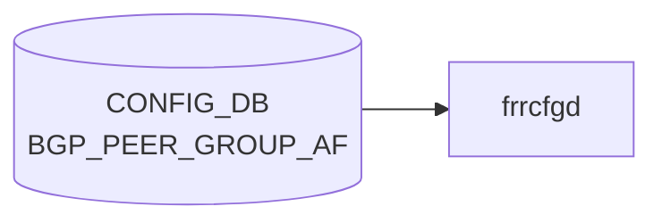

# BGP_PEER_GROUP_AF テーブル

## 概要

`BGP_PEER_GROUP` の **アドレスファミリ別** 設定を保持するテーブル[^1]。`frr-mgmt-framework` が `DEVICE_METADATA.frr_mgmt_framework_config = true` のときに使用する generic 形式。`sonic-bgp-common.yang` の `sonic-bgp-cmn-af` grouping を `uses` し、route-map / prefix-list / community / max-prefix 等の AF スコープ設定を表現する。

<!-- cdb-mermaid -->
### データフロー (自動生成)



!!! note "凡例"
    CONFIG_DB から SAI までの典型経路を `docs/reference/config-db-orch-map.md` から機械生成したミニ図。詳細・例外は本ページ本文と対応表を参照。
<!-- /cdb-mermaid -->

## key 構造

```text
BGP_PEER_GROUP_AF|<vrf_name>|<peer_group_name>|<afi_safi>
```

- `<vrf_name>`: `BGP_GLOBALS_LIST.vrf_name` への leafref
- `<peer_group_name>`: `BGP_PEER_GROUP_LIST.peer_group_name` への leafref（同一 vrf 限定）
- `<afi_safi>`: `ipv4_unicast` / `ipv6_unicast` / `l2vpn_evpn` 等

## フィールド (`sonic-bgp-cmn-af` より継承)

| フィールド | 型 | 説明 |
|-----------|----|------|
| `afi_safi` | enum | address-family 識別子（key 部） |
| `admin_status` | boolean / string | activate / no-activate |
| `send_default_route` | boolean | default-originate |
| `default_rmap` | string | default-originate route-map |
| `max_prefix_limit` | uint32 | maximum-prefix |
| `max_prefix_warning_only` | boolean | warning-only |
| `max_prefix_warning_threshold` | uint8 | warning threshold (%) |
| `max_prefix_restart_interval` | uint16 | restart 間隔 |
| `route_map_in` / `route_map_out` | leaf-list string | inbound / outbound route-map |
| `soft_reconfiguration_in` | boolean | soft-reconfiguration inbound |
| `unsuppress_map_name` | string | unsuppress-map |
| `rrclient` | boolean | route-reflector-client |
| `weight` | uint16 | weight |
| `as_override` | boolean | as-override |
| `send_community` | enum | send-community 種別 |
| `tx_add_paths` | enum | addpath 送出 |
| `unchanged_as_path` / `unchanged_med` / `unchanged_nexthop` | boolean | attribute-unchanged |
| `filter_list_in` / `filter_list_out` | string | as-path filter-list |
| `nhself` / `nexthop_self_force` | boolean | next-hop-self / force |
| `prefix_list_in` / `prefix_list_out` | string | prefix-list 参照 |
| `remove_private_as_enabled` / `replace_private_as` / `remove_private_as_all` | boolean | remove-private-AS の各オプション |
| `allow_as_in` / `allow_as_count` / `allow_as_origin` | boolean / uint8 | allowas-in |
| `cap_orf` | enum | capability orf |
| `route_server_client` | boolean | route-server-client |

合計 30 以上の AF レベル leaf を持つ。完全な一覧は `sonic-bgp-common.yang` の `grouping sonic-bgp-cmn-af` を参照。

## 制約

- `vrf_name` / `peer_group_name` はそれぞれ leafref。存在しない peer-group 名はバリデーション失敗
- key の `peer_group_name` leafref は `[vrf_name=current()/../vrf_name]` のスコープ式で同一 [VRF](../../reference/glossary.md#term-vrf) に縛られる

## 購読者

- `frr-mgmt-framework`: [FRR](../../reference/glossary.md#term-frr) (bgpd) の `address-family ... / neighbor PG ...` 配下コマンドへ変換
- `bgpcfgd` テンプレ系: 主に neighbor 単位処理が中心で、AF 別設定はテンプレ展開で間接反映

## 関連 CONFIG_DB / YANG / CLI

- 関連 [CONFIG_DB](../../reference/glossary.md#term-config_db): [`BGP_PEER_GROUP`](./bgp-peer-group.md)、[`BGP_NEIGHBOR_AF`](./bgp-neighbor-af.md)、`PREFIX_LIST`、`ROUTE_MAP`
- 関連 [YANG](../../reference/glossary.md#term-yang): `sonic-bgp-peergroup`、`sonic-bgp-common`
- 関連 CLI: [`config bgp`](../cli/config-bgp.md)

<!-- ref-triangle:start -->

## 関連リファレンス

- [YANG](../../reference/glossary.md#term-yang): [`sonic-bgp-peergroup`](../yang/sonic-bgp-peergroup.md) / `sonic-bgp-common`
- CLI: [`config bgp`](../cli/config-bgp.md)

<!-- ref-triangle:end -->

## 引用元

[^1]: [YANG](../../reference/glossary.md#term-yang) 定義: `sonic-bgp-peergroup.yang`. <https://github.com/sonic-net/sonic-buildimage/blob/9ea932ec2e18f35e58268ec2e4456b1d4afd65cd/src/sonic-yang-models/yang-models/sonic-bgp-peergroup.yang>; AF 共通 leaf は `sonic-bgp-common.yang` の `grouping sonic-bgp-cmn-af`. <https://github.com/sonic-net/sonic-buildimage/blob/9ea932ec2e18f35e58268ec2e4456b1d4afd65cd/src/sonic-yang-models/yang-models/sonic-bgp-common.yang>

<!-- ops-hint -->
## 運用ヒント

### 典型値

- key 形式: `BGP_PEER_GROUP_AF|<vrf>|<peer_group>|<afi_safi>` (例 `BGP_PEER_GROUP_AF|default|UPSTREAM|ipv4_unicast`)。
- `admin_status=true` で activate、`route_map_in`/`route_map_out` でフィルタ。

### よくある誤設定

- peer-group を作成した直後に AF 設定を行わず、neighbor が activate されない (アドレスファミリ未投入)。
- `max_prefix_limit` を運用ピーク以下に設定して [BGP](../../reference/glossary.md#term-bgp) セッションが reset する。

### 確認コマンド

```bash
sonic-db-cli CONFIG_DB keys 'BGP_PEER_GROUP_AF|*'
vtysh -c "show ip bgp summary"
vtysh -c "show running-config bgpd"
```
<!-- /ops-hint -->

<!-- value-behavior -->
## 値依存挙動マトリクス

BGP_NEIGHBOR_AF と同一の `sonic-bgp-cmn-af` grouping を uses するため、enum 挙動は同一。

### `send_community` (`bgp_community_type`)

| 値 | [FRR](../../reference/glossary.md#term-frr) コマンド |
|----|-------------|
| `standard` | `neighbor <pg> send-community standard` |
| `extended` | `neighbor <pg> send-community extended` |
| `both` | `neighbor <pg> send-community both` |
| `large` | `neighbor <pg> send-community large` |
| `all` | `neighbor <pg> send-community all` |
| `none` | send-community 無効 (コマンド追加なし) |

### `tx_add_paths`

| 値 | [FRR](../../reference/glossary.md#term-frr) コマンド |
|----|-------------|
| `tx_all_paths` | `neighbor <pg> addpath-tx-all-paths` |
| `tx_best_path_per_as` | `neighbor <pg> addpath-tx-bestpath-per-AS` |

### `cap_orf`

| 値 | FRR コマンド |
|----|-------------|
| `send` | `neighbor <pg> capability orf prefix-list send` |
| `receive` | `neighbor <pg> capability orf prefix-list receive` |
| `both` | `neighbor <pg> capability orf prefix-list both` |

> peer-group に設定した値は、その peer-group に属する全 neighbor に FRR が自動継承する。

<!-- /value-behavior -->

<!-- cdb-exceptions -->
## 例外条件・特殊挙動

| 条件 | 挙動 | ソース |
|------|------|--------|
| key パース時 `\|` が不正 (ValueError) | catch → continue (skip) | `frrcfgd.py` L2665 |
| `local_asn` が未設定の [VRF](../../reference/glossary.md#term-vrf) | LOG_DEBUG して skip | `frrcfgd.py` L2660 |
| 対象 peer-group が FRR に未存在のまま AF 設定 | vtysh コマンド失敗 → `failed running BGP neighbor config command` を LOG_ERR → continue | `frrcfgd.py` L2791 |
| `BGP_PEER_GROUP_AF` と `BGP_NEIGHBOR_AF` の key_map 共用 | 両テーブルは同一 `nbr_af_key_map` を使用。max_prefix / send_default_route の複合条件は BGP_NEIGHBOR_AF と同様 | `frrcfgd.py` L2112 |
<!-- /cdb-exceptions -->


<!-- runtime-trace -->
## 実コンテナ動作トレース

### 段階 1 — Consumer 登録

`bgpcfgd` が [CONFIG_DB](../../reference/glossary.md#term-config_db) の `BGP_PEER_GROUP_AF` テーブルを購読する。

`BGP_PEER_GROUP_AF` は `<vrf>|<pg_name>|<af>` の key 構造。

### 段階 2 — CFG→APPL 翻訳

なし (FRR vtysh 経由)

### 段階 3 — APPL→SAI

なし (FRR [BGP](../../reference/glossary.md#term-bgp) peer-group AF 設定)

### 段階 4 — タイミングと副作用

**適用タイミング**: 変化検知後 FRR に peer-group の AF コマンドを発行。peer-group メンバー全員に影響。

**副作用**: peer-group の AF policy 変更はメンバー全 [BGP](../../reference/glossary.md#term-bgp) session に波及。soft-clear が必要な場合がある。
<!-- /runtime-trace -->

<!-- entry-points -->
## 書き込み入り口 (Direction A)

対象テーブル: `BGP_PEER_GROUP_AF`

### CLI
- `vtysh` 経由 peer-group address-family コマンド群 ([bgpcfgd](../../reference/glossary.md#term-bgpcfgd) が [CONFIG_DB](../../reference/glossary.md#term-config_db) へ書き戻し)
  - ソース: `sonic-frr bgpcfgd`

### minigraph / sonic-cfggen
- なし

### REST / gNMI (sonic-mgmt-common)
- [sonic-mgmt](../../reference/glossary.md#term-sonic-mgmt)-common OpenConfig BGP peer-group 経由

### db_migrator
- なし

### ビルド時デフォルト (init_cfg / j2 テンプレート)
- なし

### ハードコードデフォルト
- なし

### ランタイム注入 (デーモン自動書き込み)
- `bgpcfgd` が FRR running-config を CONFIG_DB と同期
<!-- /entry-points -->


<!-- derivation -->
## 派生・条件付き登録 (Phase 6/7)

### Phase 6: 値による他フィールド自動派生

| 条件 | 派生先 | evidence |
|---|---|---|
| minigraph.py は BGP_PEER_GROUP_AF を生成しない | — | minigraph.py に代入なし |
| 派生なし | — | — |

### Phase 7: 条件付き module/manager 登録

| 条件 | 登録 module | evidence |
|---|---|---|
| 常時（条件なし） | `frrcfgd.BGPConfigDaemon` が `BGP_PEER_GROUP_AF` を購読（`bgp_table_handler_common`） | `sonic-buildimage/src/sonic-frr-mgmt-framework/frrcfgd/frrcfgd.py:2305` |

### grep カバレッジ

- frrcfgd.py L2305: BGP_PEER_GROUP_AF 購読（条件なし）
<!-- /derivation -->
<!-- handler-branching -->
### Phase 8: Handler メソッド内分岐

| Manager / Handler | メソッド | 分岐条件 | 効果 | evidence |
|---|---|---|---|---|
| `BGPConfigDaemon` | `bgp_table_handler_common()` | `data is None`（DELETE） | `del_table=True` → AF を FRR から削除 | `sonic-buildimage/src/sonic-frr-mgmt-framework/frrcfgd/frrcfgd.py:3918` |
| `BGPConfigDaemon` | `bgp_table_handler_common()` | `data` あり（SET） | FRR peer-group AF 設定コマンドを生成・送出 | `sonic-buildimage/src/sonic-frr-mgmt-framework/frrcfgd/frrcfgd.py:3930` |

> **スキャン証跡**: BGP_PEER_GROUP_AF は comb_attr_list なしの `bgp_table_handler_common` に直接渡される。BGP_NEIGHBOR_AF と同一パスを共有。
<!-- /handler-branching -->
<!-- platform -->
## プラットフォーム差分 (Phase H)

`BGP_PEER_GROUP_AF` の処理に **プラットフォーム固有分岐は存在しない**。

### 根拠

| 確認対象 | 結果 | evidence |
|---|---|---|
| `frrcfgd.py` 全体の `platform` / `hwsku` / `asic_type` / `sonic_platform` grep | **0 件** | `frrcfgd.py` 全文スキャン |
| `DEVICE_METADATA` 読み出し内容 | `bgp_asn` と `docker_routing_config_mode` のみ。`platform` / `hwsku` は不参照 | `frrcfgd.py:2162–2170` |
| `bgp_table_handler_common()` の分岐条件 | `data is None`（DELETE）/ `data あり`（SET）のみ | `frrcfgd.py:3918,3930` |
| `policies.conf.j2` 全バリアント（sentinels / dynamic / monitors / internal / voq_chassis）の `peer_group` grep | **0 件** — peer-group AF の差分テンプレートなし | 全 5 ファイルスキャン |

### 設計上の理由

`frrcfgd` は FRR (bgpd) と vtysh 経由で通信するコントロールプレーンデーモンであり、ASIC / ハードウェアアクセラレーションと無関係。BGP peer-group の AF 設定は FRR 内部で処理されるため、プラットフォーム種別によるコードパスの差異は生じない。

詳細スキャン手順・grep 証跡は `meta/_intermediate/cdb-flow/bgp-peer-group-af-platform.md` を参照。
<!-- /platform -->
<!-- failure -->
## 失敗挙動・retry 分岐 (Phase D)

`frrcfgd.py` の `BGPConfigDaemon` が `BGP_PEER_GROUP_AF` を処理する際に到達しうる失敗パスを示す。

| # | 失敗トリガー | 検出箇所 | 結果 | retry | ソース |
|---|------------|---------|------|------|--------|
| 1 | `BGP_GLOBALS.local_asn` が対象 [VRF](../../reference/glossary.md#term-vrf) に未設定（VRF guard） | `__update_bgp` L2656–2662 | LOG_DEBUG `ignore table ... local_asn not configured` → `continue`、FRR 未投入、CONFIG_DB エントリ残存 | なし | `frrcfgd.py:2659–2662` |
| 2 | 対応 `BGP_PEER_GROUP` が bgpd に未登録のまま AF 設定 | `__update_bgp` L2872 | `key_map.run_command` 失敗 → LOG_ERR `failed running BGP neighbor AF config command` → `continue` | なし | `frrcfgd.py:2872–2874` |
| 3 | vtysh / bgpd コマンドエラー（構文エラー・接続断等） | `g_run_command` L47–63 | LOG_ERR `command execution failure` → `False` 返却 → 上位で `continue` | なし | `frrcfgd.py:52–54` |
| 4 | `route_map_in` / `route_map_out` 等に指定した ROUTE_MAP が bgpd に未定義 | bgpd 投入時に検出 | bgpd が `rc != 0` → LOG_ERR、`BGP_PEER_GROUP_AF` 再投入なし | なし | `frrcfgd.py:47–63`、`nbr_af_key_map` L1903–1906 |
| 5 | key フォーマット不正（`\|` 不足など）による `ValueError` | `__update_bgp` L2865–2867 | 例外伝播、subscriber loop へ到達の可能性 | なし | `frrcfgd.py:2866–2867` |
| 6 | bgpd UNIX socket 接続失敗（起動時） | `BgpdClientMgr.__create_frr_client` L181–200 | 最大 100 回 / 2秒間隔 retry。超過で `RuntimeError` → frrcfgd 起動失敗、全 BGP テーブル未処理 | 100 回（起動時のみ） | `frrcfgd.py:187–200` |

### 設計上の注意点

- **`BGP_PEER_GROUP` の事前確認なし**: `BGP_PEER_GROUP_AF` 処理は peer-group の自動作成を行わない。`BGP_PEER_GROUP` が bgpd に先行登録されていない場合、AF コマンドは bgpd に拒否される（ #2 ）。
- **ROUTE_MAP の依存関係チェックなし**: frrcfgd は `route_map_in` / `route_map_out` 等の参照先 ROUTE_MAP を事前検証しない。bgpd 投入後に初めてエラーが判明し、ROUTE_MAP が後から定義されても再投入されない（ #4 ）。
- **運用中 retry ゼロ**: 全失敗パスで `continue` のみ。CONFIG_DB エントリを残したまま次イベントへ進む。整合性回復はユーザーによる再 SET が必要。
- **推奨書き込み順**: `BGP_GLOBALS` → `BGP_GLOBALS_AF` → `ROUTE_MAP` → `BGP_PEER_GROUP` → `BGP_PEER_GROUP_AF`
<!-- /failure -->
<!-- defaults -->
## 暗黙デフォルトとコード由来の挙動 (Phase A)

### 全フィールド共通: YANG default なし

`sonic-bgp-cmn-af` grouping の全 leaf は YANG `default` 文を持たない。フィールドが CONFIG_DB に存在しない場合、frrcfgd は対応する FRR コマンドを一切発行しない。実行時の動作は FRR 内部デフォルトに依存する。

### `admin_status` — activate の明示が必須

| 状況 | frrcfgd の挙動 | FRR 側の結果 |
|------|---------------|-------------|
| フィールド不在 | コマンド発行なし | BGP_GLOBALS 初期化時の `no bgp default ipv4-unicast` により ipv4_unicast も inactive |
| `true` / `up` | `neighbor PG activate` | AF 有効 |
| `false` / `down` | `no neighbor PG activate` | AF 無効 |
| DELETE | `no neighbor PG activate`（`false` として処理） | AF 無効 |

**要点**: `admin_status` を省略すると ipv4 AF も activate されない。frrcfgd 購読テーブルの ipv4/ipv6/l2vpn は AF プレフィックスで振り分けられる（`frrcfgd.py:2665`）。

### `send_community` — 書き込み時の implicit reset

`hdl_send_com` は SET 時にまず `no neighbor PG send-community all` を発行してから指定値を適用する。`send_community=none` を書いた場合、追加コマンドは発行されない（`no send-community all` のみ）。

### `remove_private_as_*` — 複合フィールドの reset シーケンス

`hdl_rm_priv_as` は SET/DELETE にかかわらず 4 パターン全 `no` を先発行する:

```
no neighbor PG remove-private-AS
no neighbor PG remove-private-AS all
no neighbor PG remove-private-AS replace-AS
no neighbor PG remove-private-AS all replace-AS
```

### `nexthop_self_force` — 書き込み経路依存の乖離

| 書き込み経路 | `nexthop_self_force=true` 単独時の FRR 出力 |
|------------|------------------------------------------|
| frrcfgd（運用時 SET） | `neighbor PG next-hop-self force` を発行 |
| J2 テンプレート（minigraph/init_cfg） | `nhself=true` が前提条件 — `nhself` 不在時は無視 |

### `allow_as_in` 複合条件

`allow_as_count` と `allow_as_origin` は `allow_as_in=true` がある場合のみ意味を持つ:

| 設定 | FRR コマンド |
|------|------------|
| `allow_as_in=true` のみ | `neighbor PG allowas-in`（FRR デフォルト 3 回） |
| `allow_as_in=true` + `allow_as_count=N` | `neighbor PG allowas-in N` |
| `allow_as_in=true` + `allow_as_origin=true` | `neighbor PG allowas-in origin` |

### `cap_orf` — 削除時の reset

DELETE または SET 開始時に `no neighbor PG capability orf prefix-list both` を先発行し、SET 時のみ指定値を追加適用する。

### VRF guard — BGP_GLOBALS 未設定時の silent skip

`BGP_GLOBALS` の `local_asn` が設定されていない VRF に対する SET は `frrcfgd.py:2659` で LOG_DEBUG して skip される。FRR コマンドは発行されない。BGP_PEER_GROUP_AF は BGP_GLOBALS より後に書く必要がある。

### `afi_safi` leaf — dead field

YANG では `afi_safi` が独立した leaf として定義されているが、frrcfgd はこのフィールドを key parse（`key.split('|')`）から取得する。DB 値としての `afi_safi` は参照されない。

### `max_prefix_*` — 複合コマンド生成規則

`max_prefix_limit` が必須のアンカー。`max_prefix_warning_threshold` が不在の場合は `max_prefix_restart_interval` と `max_prefix_warning_only` も生成されない（`++` オプション連鎖）。
<!-- /defaults -->
<!-- ordering -->
## 書込み順依存 (Phase B)

`frrcfgd` の `bgp_table_handler_common()` が BGP_PEER_GROUP_AF を処理する際に検出された順序依存を示す。

| # | 先行テーブル / 設定 | 依存元フィールド | 方向 | 緩和策 | evidence |
|---|---|---|---|---|---|
| 1 | `BGP_GLOBALS\|<vrf>.local_asn` | 全フィールド（VRF guard） | **先行必須**（hard block） | なし — LOG_DEBUG + skip | `frrcfgd.py:2656–2662` |
| 2 | `BGP_PEER_GROUP\|<vrf>\|<pg_name>` | 全フィールド（FRR peer-group 未登録） | **先行必須**（FRR コマンド失敗） | なし — LOG_ERR + continue | `frrcfgd.py:2790–2801, 2873` |
| 3 | `BGP_GLOBALS_AF\|<vrf>\|<af_safi>` | 全フィールド（AF コンテキスト） | **先行必須**（FRR コンテキスト未存在） | 起動時は `table_handler_list` 順（#4 < #12）で自動保証 | `frrcfgd.py:2297, 2771–2781` |
| 4 | `ROUTE_MAP\|<name>\|<seq>` | `route_map_in`, `route_map_out`, `default_rmap`, `unsuppress_map_name` | **先行推奨**（中間状態のみ） | FRR は名前を受付、route-map 定義後に有効化 | `frrcfgd.py:3109–3133` |
| 5 | bgpd CLI 内 `max_prefix_limit` | `max_prefix_warning_threshold`, `max_prefix_restart_interval`, `max_prefix_warning_only` | **同時書き込み推奨** | limit 不在時 FRR が後続オプションを無視 | `frrcfgd.py:2865–2872` |

> **推奨書き込み順**: `BGP_GLOBALS` → `BGP_GLOBALS_AF` → `ROUTE_MAP` → `BGP_PEER_GROUP` → `BGP_PEER_GROUP_AF`
<!-- /ordering -->
<!-- constants -->
## ハードコード定数 (Phase E)

`frrcfgd.py` の `nbr_af_key_map` と `bgp_table_handler_common()` の `BGP_PEER_GROUP_AF` 分岐に埋め込まれた定数。`BGP_PEER_GROUP_AF` は `BGP_NEIGHBOR_AF` と同一の `nbr_af_key_map` を共用する。

### FRR コマンド literal (`nbr_af_key_map`)

| フィールド | FRR コマンド literal | evidence |
|-----------|---------------------|---------|
| `allow_as_in` (+`allow_as_count`/`allow_as_origin`) | `neighbor <pg> allowas-in <N\|origin>` | `frrcfgd.py:1895` |
| `admin_status\|ipv4` / `\|ipv6` / `\|l2vpn` | `neighbor <pg> activate` | `frrcfgd.py:1896-1898` |
| `send_default_route` (+`default_rmap`) | `neighbor <pg> default-originate [route-map <name>]` | `frrcfgd.py:1899` |
| `default_rmap` | `neighbor <pg> default-originate route-map <name>` | `frrcfgd.py:1900` |
| `max_prefix_limit` (++`max_prefix_warning_threshold`, +`max_prefix_restart_interval`&`max_prefix_warning_only`) | `neighbor <pg> maximum-prefix <limit> [<threshold>] [restart <interval>\|warning-only]` | `frrcfgd.py:1901-1902` |
| `route_map_in` | `neighbor <pg> route-map <name> in` | `frrcfgd.py:1903` |
| `route_map_out` | `neighbor <pg> route-map <name> out` | `frrcfgd.py:1904` |
| `soft_reconfiguration_in` | `neighbor <pg> soft-reconfiguration inbound` | `frrcfgd.py:1905` |
| `unsuppress_map_name` | `neighbor <pg> unsuppress-map <name>` | `frrcfgd.py:1906` |
| `rrclient` | `neighbor <pg> route-reflector-client` | `frrcfgd.py:1907` |
| `weight` | `neighbor <pg> weight <value>` | `frrcfgd.py:1908` |
| `as_override` | `neighbor <pg> as-override` | `frrcfgd.py:1909` |
| `send_community` | `neighbor <pg> send-community <type>` | `frrcfgd.py:1910` |
| `tx_add_paths` | `neighbor <pg> addpath-tx-all-paths` / `addpath-tx-bestpath-per-AS` | `frrcfgd.py:1911` |
| `unchanged_as_path` / `unchanged_med` / `unchanged_nexthop` | `neighbor <pg> attribute-unchanged [as-path] [med] [next-hop]` | `frrcfgd.py:1912-1913` |
| `filter_list_in` | `neighbor <pg> filter-list <name> in` | `frrcfgd.py:1914` |
| `filter_list_out` | `neighbor <pg> filter-list <name> out` | `frrcfgd.py:1915` |
| `nhself` | `neighbor <pg> next-hop-self` | `frrcfgd.py:1916` |
| `nexthop_self_force` | `neighbor <pg> next-hop-self force` | `frrcfgd.py:1917` |
| `prefix_list_in` | `neighbor <pg> prefix-list <name> in` | `frrcfgd.py:1918` |
| `prefix_list_out` | `neighbor <pg> prefix-list <name> out` | `frrcfgd.py:1919` |
| `remove_private_as_enabled` (+`remove_private_as_all`, +`replace_private_as`) | `neighbor <pg> remove-private-AS [all] [replace-AS]` | `frrcfgd.py:1920-1922` |
| `cap_orf` | `neighbor <pg> capability orf prefix-list <send\|receive\|both>` | `frrcfgd.py:1923` |
| `route_server_client` | `neighbor <pg> route-server-client` | `frrcfgd.py:1924` |

### vtysh コマンドプレフィクス定数 (`BGP_PEER_GROUP_AF` 分岐)

| 階層 | literal | evidence |
|------|---------|---------|
| L1 | `configure terminal` | `frrcfgd.py:2869` |
| L2 | `router bgp <local_asn> vrf <vrf>` | `frrcfgd.py:2870` |
| L3 | `address-family <af> <ip_type>` | `frrcfgd.py:2871` |

### address-family 文字列定数 (key parse)

| 処理 | 定数 | evidence |
|------|------|---------|
| key 分割 | `\|` (`key.split('\|')` で peer_group_name と afi_safi を分離) | `frrcfgd.py:2866` |
| af/ip_type 分割 | `_` (`af_type.lower().split('_')` で `ipv4_unicast` → `ipv4`, `unicast`) | `frrcfgd.py:2867` |
| 小文字正規化 | `.lower()` (大文字混在を吸収) | `frrcfgd.py:2867` |
| tbl_key ディスパッチキー | `admin_status` (`admin_status\|<af>` の照合に使用) | `frrcfgd.py:2665-2668` |

詳細スキャン結果は `meta/_intermediate/cdb-flow/bgp-peer-group-af-constants.md` を参照。
<!-- /constants -->

<!-- cross-refs -->
## 暗黙参照 — `BGPConfigDaemon` が読み出す関連 CONFIG_DB テーブル (Phase C)

`frrcfgd` の `BGPConfigDaemon` は `BGP_PEER_GROUP_AF` テーブル単体ではなく、起動時に関連テーブルを一括ロードし、ランタイム処理の前提として参照する。以下は `frrcfgd.py` のスキャンで検出した暗黙参照テーブル。

### 必須前提テーブル

| テーブル | 参照種別 | 用途 | evidence |
|---|---|---|---|
| [`BGP_PEER_GROUP`](./bgp-peer-group.md) | 起動時 `get_table()` + ランタイム前提 | 起動時に `self.bgp_peer_group[vrf][pg_name]` キャッシュを構築。peer-group が FRR に存在しない状態で AF 設定を発行すると vtysh コマンドが失敗し `LOG_ERR` を出力する。`BGP_PEER_GROUP_AF` より先に設定する必要がある | frrcfgd.py:2187-2191, 2865, 2873 |
| `BGP_GLOBALS` | ランタイム guard | `__get_vrf_asn(vrf)` が None (= `local_asn` 未設定) の VRF に対する更新を `LOG_DEBUG` して silent skip する。VRF の `BGP_GLOBALS.local_asn` が設定されるまで `BGP_PEER_GROUP_AF` の変更は無効 | frrcfgd.py:2658-2662 |

### 処理順序依存テーブル

| テーブル | 参照種別 | 用途 | evidence |
|---|---|---|---|
| [`BGP_GLOBALS_AF`](./bgp-globals-af.md) | 処理順序依存 | `address-family <af> <type>` コンテキストを事前に FRR へ確立するテーブル。`BGP_PEER_GROUP_AF` のコマンドは同コンテキスト内で発行されるため、`BGP_GLOBALS_AF` の設定が先行している必要がある | frrcfgd.py:2297, 2771-2781, 2869-2871 |

### 文字列名参照テーブル (フィールド値として名前参照)

| テーブル | 参照フィールド | FRR コマンド | evidence |
|---|---|---|---|
| `ROUTE_MAP` | `route_map_in` | `neighbor <pg> route-map <name> in` | frrcfgd.py:1903, 2206 |
| `ROUTE_MAP` | `route_map_out` | `neighbor <pg> route-map <name> out` | frrcfgd.py:1904, 2206 |
| `ROUTE_MAP` | `default_rmap` | `neighbor <pg> default-originate route-map <name>` | frrcfgd.py:1900, 2206 |
| `PREFIX` / `PREFIX_SET` | `prefix_list_in` | `neighbor <pg> prefix-list <name> in` | frrcfgd.py:1918, 2227-2247 |
| `PREFIX` / `PREFIX_SET` | `prefix_list_out` | `neighbor <pg> prefix-list <name> out` | frrcfgd.py:1919, 2227-2247 |

> `ROUTE_MAP` と `PREFIX` / `PREFIX_SET` は `frrcfgd` が起動時に一括ロードしてキャッシュする (L2206, L2227-2247)。フィールド値は FRR に文字列として渡されるだけで DB ルックアップは行われないが、FRR 側で未定義名を参照すると policy が機能しない。

詳細スキャン手順と grep 結果は `meta/_intermediate/cdb-flow/bgp-peer-group-af-cross-refs.md` を参照。
<!-- /cross-refs -->
<!-- side-effects -->
## 副次 DB 書込 (Phase F)

### 検出結果: 副次 DB 書込なし

`frrcfgd.py` の `BGP_PEER_GROUP_AF` ハンドラ (`bgp_table_handler_common`) は **[STATE_DB](../../reference/glossary.md#term-state_db)・[COUNTERS_DB](../../reference/glossary.md#term-counters_db)・[APPL_DB](../../reference/glossary.md#term-appl_db) への書込を一切行わない**。

#### 根拠

| 調査対象 | 結果 | evidence |
|---|---|---|
| `import` 文 | `swsscommon.swsscommon.ConfigDBConnector` のみ。`SonicV2Connector` / `DBConnector` / `ProducerStateTable` 等のインポートなし | `frrcfgd.py:8` |
| `STATE_DB` 参照 | 0 件 | `grep -n STATE_DB frrcfgd.py` → no match |
| `COUNTERS_DB` 参照 | 0 件 | `grep -n COUNTERS_DB frrcfgd.py` → no match |
| `APPL_DB` 参照 | 0 件 | `grep -n APPL_DB frrcfgd.py` → no match |
| `set_entry` / `hset` / `publish` 呼び出し | CONFIG_DB 読み取り専用の `ExtConfigDBConnector` を使用。書込 API 呼び出しなし | `frrcfgd.py:1506–1529` |

#### 動作の性質

`BGP_PEER_GROUP_AF` ハンドラは **CONFIG_DB → FRR (vtysh) の片方向パイプ**として設計されている。処理フローは以下の通り:

```
CONFIG_DB BGP_PEER_GROUP_AF (SET/DEL)
  └─→ frrcfgd bgp_table_handler_common()
        └─→ FRR vtysh コマンド発行（address-family / neighbor <pg> 配下）
              └─→ bgpd が内部状態を更新（メモリ内のみ）
```

BGP セッション状態（Established / Idle 等）や prefix カウンタは bgpd が自律的に [STATE_DB](../../reference/glossary.md#term-state_db) へ書き込むが、それは **bgpd → sonic-[bgpcfgd](../../reference/glossary.md#term-bgpcfgd) の独立した経路**であり `frrcfgd` の BGP_PEER_GROUP_AF ハンドラには含まれない。

> **結論**: Phase F 対象の副次書込は存在しない。FRR vtysh 経由でのみ影響が波及する。
<!-- /side-effects -->

<!-- pubsub -->
## 購読メカニズム — ExtConfigDBConnector / Redis keyspace (Phase G)

`BGP_PEER_GROUP_AF` の変更通知は **`ExtConfigDBConnector` + [Redis](../../reference/glossary.md#term-redis) keyspace PSUBSCRIBE** で実装される。`bgpcfgd` 系の `SubscriberStateTable` とは異なる frrcfgd 独自方式。

### 購読チャンネルパターン

```
__keyspace@4__:*
```

`ExtConfigDBConnector.listen_thread()` が CONFIG_DB 全体を glob でカバーする。`BGP_PEER_GROUP_AF|<vrf>|<pg>|<af>` への `HSET`/`DEL` が keyspace notification を発火させ、`sub_msg_handler()` がテーブル名で振り分ける。

ソース: `frrcfgd.py:1538-1539`

### イベント → ハンドラ呼び出しフロー

```
Redis keyspace pmessage ("__keyspace@4__:BGP_PEER_GROUP_AF|<vrf>|<pg>|<af>")
  → ExtConfigDBConnector.sub_msg_handler()       (frrcfgd.py:1521-1532)
    → channel から table / row を分離
    → client.hgetall(key) でフィールド取得
    → data=None (空) → DELETE シグナル
    → __fire(table, row, data)
      → bgp_table_handler_common(table, key, data)   (frrcfgd.py:2305)
        → data is None → del_table=True → FRR AF 削除  (frrcfgd.py:3918)
        → data あり   → del_table=False → FRR AF 設定  (frrcfgd.py:3930)
```

### listen スレッドと polling 間隔

| 項目 | 値 | ソース |
|------|---|--------|
| スレッド | `threading.Thread(target=listen_thread, args=(10,))` | frrcfgd.py:1551 |
| polling タイムアウト | 10 秒 (`get_message(timeout=10, ignore_subscribe_messages=True)`) | frrcfgd.py:1541 |
| 起動契機 | `BGPConfigDaemon.start()` → `config_db.listen()` | frrcfgd.py:3956 |

### 初期スナップショット

`start()` 前に `get_table_data(table_list)` で既存エントリを全件ロードし、`__fire()` で再生する。再起動後も CONFIG_DB に残存するエントリは自動的に FRR へ再投入される（frrcfgd.py:2327-2350）。

詳細は `meta/_intermediate/cdb-flow/bgp-peer-group-af-pubsub.md` を参照。
<!-- /pubsub -->

<!-- glossary-links-injected: dc502b10f44e -->
