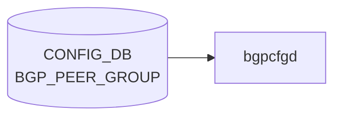

# BGP_PEER_GROUP テーブル

## 概要

[BGP](../../reference/glossary.md#term-bgp) peer-group の [VRF](../../reference/glossary.md#term-vrf) スコープでの定義テーブル。`BGP_NEIGHBOR_LIST.peer_group_name` から参照される。`sonic-bgp-cmn` grouping を `uses` し、`BGP_NEIGHBOR` と同じ共通フィールドを持つ。`frr-mgmt-framework` (`DEVICE_METADATA.frr_mgmt_framework_config = true`) が [CONFIG_DB](../../reference/glossary.md#term-config_db) を購読する[^1]。

<!-- cdb-mermaid -->
### データフロー (自動生成)



!!! note "凡例"
    CONFIG_DB から SAI までの典型経路を `docs/reference/config-db-orch-map.md` から機械生成したミニ図。詳細・例外は本ページ本文と対応表を参照。
<!-- /cdb-mermaid -->

## key 構造

```text
BGP_PEER_GROUP|<vrf_name>|<peer_group_name>
```

`<vrf_name>` は `BGP_GLOBALS.vrf_name` への leafref。

## 主要フィールド

`sonic-bgp-cmn` grouping を `uses` するため、`BGP_NEIGHBOR` と同じ leaf 群を持つ (代表): `local_asn`, `asn`, `peer_type`, `ebgp_multihop`, `ebgp_multihop_ttl`, `auth_password`, `keepalive`, `holdtime`, `conn_retry`, `min_adv_interval`, `local_addr`, `passive_mode`, `capability_ext_nexthop`, `enforce_first_as`, `solo_peer`, `ttl_security_hops`, `bfd`, `peer_port`, `admin_status`, `local_as_no_prepend`, `local_as_replace_as` 等。詳細は `BGP_NEIGHBOR` ページを参照 (`docs/reference/config-db/bgp-neighbor.md`)。

## 派生テーブル

- `BGP_PEER_GROUP_AF` ... peer-group × afi_safi のアドレスファミリ別設定。`sonic-bgp-cmn-af` grouping を `uses`
- `BGP_GLOBALS_LISTEN_PREFIX` ... dynamic neighbor (listen range) の peer-group 紐付け。key: `<vrf_name>|<ip_prefix>`、leaf `peer_group` で `BGP_PEER_GROUP_LIST.peer_group_name` を参照

## 購読者

- `frr-mgmt-framework`: [CONFIG_DB](../../reference/glossary.md#term-config_db) → [FRR](../../reference/glossary.md#term-frr) `peer-group` コマンド
- `bgpcfgd`: テンプレ経路で peer-group を展開

## 関連 CONFIG_DB / YANG / CLI

- 関連 [CONFIG_DB](../../reference/glossary.md#term-config_db): `BGP_NEIGHBOR`、`BGP_GLOBALS`、`BGP_PEER_GROUP_AF`、`BGP_GLOBALS_LISTEN_PREFIX`
- 関連 CLI: `config bgp` (peer-group 関連サブコマンド)
- 関連 [YANG](../../reference/glossary.md#term-yang): `sonic-bgp-peergroup`、`sonic-bgp-common`

<!-- ref-triangle:start -->

## 関連リファレンス

- [YANG](../../reference/glossary.md#term-yang): [`sonic-bgp-peergroup`](../yang/sonic-bgp-peergroup.md) / `sonic-bgp-common`
- CLI: [`config bgp`](../cli/config-bgp.md)

<!-- ref-triangle:end -->

## 引用元

[^1]: [YANG](../../reference/glossary.md#term-yang) 定義: `sonic-bgp-peergroup.yang`. <https://github.com/sonic-net/sonic-buildimage/blob/9ea932ec2e18f35e58268ec2e4456b1d4afd65cd/src/sonic-yang-models/yang-models/sonic-bgp-peergroup.yang>

<!-- ops-hint -->
## 運用ヒント

### 典型値

- key 形式: `BGP_PEER_GROUP|<vrf>|<peer-group-name>`。
- `asn`: 対向 AS（同 peer-group 内で統一）。
- `admin_status`: `up`。

### よくある誤設定

- peer-group の `asn` と個別 neighbor の `asn` がズレると [FRR](../../reference/glossary.md#term-frr) が neighbor を peer-group に紐付けない。

### 確認コマンド

```bash
sonic-db-cli CONFIG_DB keys 'BGP_PEER_GROUP|*'
vtysh -c 'show bgp peer-group'
```
<!-- /ops-hint -->

<!-- cdb-exceptions -->
## 例外条件・特殊挙動

| 条件 | 挙動 | ソース |
|------|------|--------|
| peer-group が FRR に未存在のまま SET が到達 | frrcfgd が `neighbor {} peer-group` を vtysh 実行。失敗時 `failed to create peer-group %s for VRF %s` を LOG_ERR → continue | `frrcfgd.py` L2799 |
| `local_asn` 未設定 VRF | LOG_DEBUG して skip | `frrcfgd.py` L2660 |
| `BGPPeerGroupMgr.update_policy()` の Jinja2 エラー | `log_err` して `return False` | `managers_bgp.py` `update_policy()` |
| `BGPPeerGroupMgr.update_pg()` の Jinja2 エラー | `log_err` して `return False` | `managers_bgp.py` `update_pg()` |
| TSA 有効時の peer-group 設定 | `check_state_and_get_tsa_routemaps()` が TSA route-map を自動付与。エラー時は peer-group 全体が skip | `managers_device_global.py` |
| FRR 10.1 以降: listen range がある peer-group の削除 | 先に `no bgp listen range` を実行してから peer-group 削除。range 削除失敗でも peer-group 削除を試みる | `managers_bgp.py` `del_handler()` |
<!-- /cdb-exceptions -->

<!-- glossary-links-injected: d4d0b1f9b453 -->
