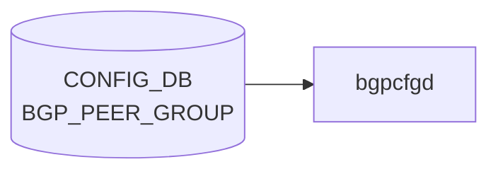

# BGP_PEER_GROUP テーブル

## 概要

[BGP](../../reference/glossary.md#term-bgp) peer-group の [VRF](../../reference/glossary.md#term-vrf) スコープでの定義テーブル。`BGP_NEIGHBOR_LIST.peer_group_name` から参照される。`sonic-bgp-cmn` grouping を `uses` し、`BGP_NEIGHBOR` と同じ共通フィールドを持つ。`frr-mgmt-framework` (`DEVICE_METADATA.frr_mgmt_framework_config = true`) が [CONFIG_DB](../../reference/glossary.md#term-config_db) を購読する[^1]。

<!-- cdb-mermaid -->
### データフロー (自動生成)



!!! note "凡例"
    CONFIG_DB から SAI までの典型経路を `docs/reference/config-db-orch-map.md` から機械生成したミニ図。詳細・例外は本ページ本文と対応表を参照。
<!-- /cdb-mermaid -->

## key 構造

```text
BGP_PEER_GROUP|<vrf_name>|<peer_group_name>
```

`<vrf_name>` は `BGP_GLOBALS.vrf_name` への leafref。

## 主要フィールド

`sonic-bgp-cmn` grouping を `uses` するため、`BGP_NEIGHBOR` と同じ leaf 群を持つ (代表): `local_asn`, `asn`, `peer_type`, `ebgp_multihop`, `ebgp_multihop_ttl`, `auth_password`, `keepalive`, `holdtime`, `conn_retry`, `min_adv_interval`, `local_addr`, `passive_mode`, `capability_ext_nexthop`, `enforce_first_as`, `solo_peer`, `ttl_security_hops`, `bfd`, `peer_port`, `admin_status`, `local_as_no_prepend`, `local_as_replace_as` 等。詳細は `BGP_NEIGHBOR` ページを参照 (`docs/reference/config-db/bgp-neighbor.md`)。

## 派生テーブル

- `BGP_PEER_GROUP_AF` ... peer-group × afi_safi のアドレスファミリ別設定。`sonic-bgp-cmn-af` grouping を `uses`
- `BGP_GLOBALS_LISTEN_PREFIX` ... dynamic neighbor (listen range) の peer-group 紐付け。key: `<vrf_name>|<ip_prefix>`、leaf `peer_group` で `BGP_PEER_GROUP_LIST.peer_group_name` を参照

## 購読者

- `frr-mgmt-framework`: [CONFIG_DB](../../reference/glossary.md#term-config_db) → [FRR](../../reference/glossary.md#term-frr) `peer-group` コマンド
- `bgpcfgd`: テンプレ経路で peer-group を展開

## 関連 CONFIG_DB / YANG / CLI

- 関連 [CONFIG_DB](../../reference/glossary.md#term-config_db): `BGP_NEIGHBOR`、`BGP_GLOBALS`、`BGP_PEER_GROUP_AF`、`BGP_GLOBALS_LISTEN_PREFIX`
- 関連 CLI: `config bgp` (peer-group 関連サブコマンド)
- 関連 [YANG](../../reference/glossary.md#term-yang): `sonic-bgp-peergroup`、`sonic-bgp-common`

<!-- ref-triangle:start -->

## 関連リファレンス

- [YANG](../../reference/glossary.md#term-yang): [`sonic-bgp-peergroup`](../yang/sonic-bgp-peergroup.md) / `sonic-bgp-common`
- CLI: [`config bgp`](../cli/config-bgp.md)

<!-- ref-triangle:end -->

## 引用元

[^1]: [YANG](../../reference/glossary.md#term-yang) 定義: `sonic-bgp-peergroup.yang`. <https://github.com/sonic-net/sonic-buildimage/blob/9ea932ec2e18f35e58268ec2e4456b1d4afd65cd/src/sonic-yang-models/yang-models/sonic-bgp-peergroup.yang>

<!-- ops-hint -->
## 運用ヒント

### 典型値

- key 形式: `BGP_PEER_GROUP|<vrf>|<peer-group-name>`。
- `asn`: 対向 AS（同 peer-group 内で統一）。
- `admin_status`: `up`。

### よくある誤設定

- peer-group の `asn` と個別 neighbor の `asn` がズレると [FRR](../../reference/glossary.md#term-frr) が neighbor を peer-group に紐付けない。

### 確認コマンド

```bash
sonic-db-cli CONFIG_DB keys 'BGP_PEER_GROUP|*'
vtysh -c 'show bgp peer-group'
```
<!-- /ops-hint -->

<!-- value-behavior -->
## 値依存挙動マトリクス

BGP_NEIGHBOR と同一の `sonic-bgp-cmn` grouping を uses する。

### `peer_type` (`bgp_peer_type`)

| 値 | テンプレディレクトリ | 主な差異 |
|----|-------------------|---------|
| `internal` | `bgpd/templates/internal/` | `send-community` 自動、timers 3/10、BackEnd で `next-hop-self force` |
| `external` / `general` | `bgpd/templates/general/` | timers 60/180、ToRRouter で `allowas-in 1` |

peer-group に設定した `peer_type` は、その peer-group に属する全 neighbor のテンプレ種別を決定する。

### `admin_status`

| 値 | FRR コマンド |
|----|-------------|
| `up` | `no neighbor <pg> shutdown` |
| `down` | `neighbor <pg> shutdown` |

<!-- /value-behavior -->

<!-- cdb-exceptions -->
## 例外条件・特殊挙動

| 条件 | 挙動 | ソース |
|------|------|--------|
| peer-group が FRR に未存在のまま SET が到達 | frrcfgd が `neighbor {} peer-group` を vtysh 実行。失敗時 `failed to create peer-group %s for VRF %s` を LOG_ERR → continue | `frrcfgd.py` L2799 |
| `local_asn` 未設定 VRF | LOG_DEBUG して skip | `frrcfgd.py` L2660 |
| `BGPPeerGroupMgr.update_policy()` の Jinja2 エラー | `log_err` して `return False` | `managers_bgp.py` `update_policy()` |
| `BGPPeerGroupMgr.update_pg()` の Jinja2 エラー | `log_err` して `return False` | `managers_bgp.py` `update_pg()` |
| TSA 有効時の peer-group 設定 | `check_state_and_get_tsa_routemaps()` が TSA route-map を自動付与。エラー時は peer-group 全体が skip | `managers_device_global.py` |
| FRR 10.1 以降: listen range がある peer-group の削除 | 先に `no bgp listen range` を実行してから peer-group 削除。range 削除失敗でも peer-group 削除を試みる | `managers_bgp.py` `del_handler()` |
<!-- /cdb-exceptions -->


<!-- runtime-trace -->
## 実コンテナ動作トレース

### 段階 1 — Consumer 登録

`bgpcfgd` が CONFIG_DB の `BGP_PEER_GROUP` テーブルを購読する。

`BGP_PEER_GROUP` は `<vrf>|<pg_name>` の key 構造。

### 段階 2 — CFG→APPL 翻訳

なし (FRR vtysh 経由)

### 段階 3 — APPL→SAI

なし (FRR BGP peer-group 設定)

### 段階 4 — タイミングと副作用

**適用タイミング**: 変化検知後 FRR に `neighbor <pg_name> peer-group` 等のコマンドを発行。peer-group 削除はメンバーネイバー全体への影響あり。

**副作用**: peer-group 削除はメンバーの BGP session を切断。AS/password 変更はメンバー全 session リセット。
<!-- /runtime-trace -->

<!-- entry-points -->
## 書き込み入り口 (Direction A)

対象テーブル: `BGP_PEER_GROUP`

### CLI
- `vtysh` 経由 peer-group コマンド群 (bgpcfgd が CONFIG_DB へ書き戻し)
  - ソース: `sonic-frr bgpcfgd`

### minigraph / sonic-cfggen
- なし

### REST / gNMI (sonic-mgmt-common)
- sonic-mgmt-common OpenConfig BGP peer-group 経由

### db_migrator
- なし

### ビルド時デフォルト (init_cfg / j2 テンプレート)
- なし

### ハードコードデフォルト
- なし

### ランタイム注入 (デーモン自動書き込み)
- `bgpcfgd` が FRR running-config を CONFIG_DB と同期
<!-- /entry-points -->


<!-- derivation -->
## 派生・条件付き登録 (Phase 6/7)

### Phase 6: 値による他フィールド自動派生

| 条件 | 派生先 | evidence |
|---|---|---|
| minigraph.py は BGP_PEER_GROUP を直接生成しない | — | minigraph.py に代入なし |
| frrcfgd が FRR running-config の peer-group 設定を読み CONFIG_DB と同期 | BGP_PEER_GROUP フィールドを反映 | `sonic-buildimage/src/sonic-frr-mgmt-framework/frrcfgd/frrcfgd.py:2187,2303` |

### Phase 7: 条件付き module/manager 登録

| 条件 | 登録 module | evidence |
|---|---|---|
| 常時（条件なし） | `frrcfgd.BGPConfigDaemon` が `BGP_PEER_GROUP` を購読（`bgp_neighbor_handler`） | `sonic-buildimage/src/sonic-frr-mgmt-framework/frrcfgd/frrcfgd.py:2303` |

### grep カバレッジ

- frrcfgd.py L2303: BGP_PEER_GROUP 購読（条件なし）
<!-- /derivation -->
<!-- handler-branching -->
### Phase 8: Handler メソッド内分岐

| Manager / Handler | メソッド | 分岐条件 | 効果 | evidence |
|---|---|---|---|---|
| `BGPConfigDaemon` | `bgp_neighbor_handler()` | `data is None`（DELETE） | `del_table=True` → peer-group を FRR から削除 | `sonic-buildimage/src/sonic-frr-mgmt-framework/frrcfgd/frrcfgd.py:3918` |
| `BGPConfigDaemon` | `bgp_neighbor_handler()` | `keepalive` と `holdtime` が共に存在 | `comb_attr_list` 制約: 2 フィールド揃いで FRR タイマーコマンドを生成 | `sonic-buildimage/src/sonic-frr-mgmt-framework/frrcfgd/frrcfgd.py:3942` |

> **スキャン証跡**: `bgp_neighbor_handler` L3942 読了。keepalive/holdtime 組み合わせ制約のみ。
<!-- /handler-branching -->
<!-- cross-refs -->
## 暗黙参照テーブル (Phase C)

`BGP_PEER_GROUP` ハンドラが実装レベルで依存する外部テーブルを示す。YANG leafref 宣言のない暗黙依存を含む。

| 参照先テーブル | 参照フィールド | 方向 | 条件 | 依存強度 | ソース |
|--------------|--------------|------|------|---------|--------|
| `BGP_GLOBALS` | `local_asn` | 読み取り | 常時（SET/DEL 両方） | **必須・ブロッキング** — 未設定 VRF は silently drop | `frrcfgd.py` L2175, L2659 |
| `BGP_PEER_GROUP_AF` | `route_map_in` / `route_map_out` / afi_safi 設定 | 逆参照（cascade 再適用） | peer-group の `asn` OP_ADD または OP_DELETE 時 | 条件付き — `asn` 変更で AF 設定を再投入 | `frrcfgd.py` L2551–2563, L2865 |
| `ROUTE_MAP` | `route_operation` | 内部キャッシュ参照 | `BGP_PEER_GROUP_AF` に `route_map_in`/`out` が設定されたとき | 条件付き — 未投入でも frrcfgd エラーなし（FRR 側 no-op） | `frrcfgd.py` L86, L2206, L2669 |

### BGP_GLOBALS — ブロッキング依存の詳細

frrcfgd は `BGP_PEER_GROUP` の処理ループ先頭で `__get_vrf_asn(vrf)` を呼び出し、
当該 VRF の `BGP_GLOBALS.local_asn` を取得する。`None` の場合は LOG_DEBUG を出力して
当該エントリの処理を **スキップ**（エラーなし）。FRR vtysh コマンド
`router bgp <local_asn> vrf <vrf>` の生成に必須のため、`BGP_GLOBALS` 投入前に
`BGP_PEER_GROUP` が到達してもすべて破棄される（`frrcfgd.py` L2658–2662）。

### BGP_PEER_GROUP_AF — cascade 再適用の詳細

peer-group の `asn` が OP_ADD/DELETE されると `__nbr_impl_action` が `'apply'`/`'delete'`
を返し、`__apply_dep_vrf_table` が `BGP_GLOBALS_LISTEN_PREFIX`（listen range）と
`BGP_NEIGHBOR`（メンバー neighbor）を内部キャッシュから再投入する。
`BGP_PEER_GROUP_AF` 自体は `bgp_table_handler_common` で独立購読されており、
peer-group 作成後に AF 設定が到達した場合は順次 FRR に投入される（`frrcfgd.py` L2305, L2865）。

### ROUTE_MAP — 間接参照の詳細

`ROUTE_MAP` は frrcfgd が直接購読するテーブル（`frrcfgd.py` L86: `'ROUTE_MAP': ['zebra', 'bgpd', 'ospfd']`）。
`BGP_PEER_GROUP_AF` の `route_map_in`/`route_map_out` フィールド値がそのまま
FRR `neighbor <pg> route-map <name> in/out` コマンドの `<name>` として使用される。
指定した route-map が FRR に未定義でも frrcfgd はエラーを返さない（FRR 側 no-op）。
<!-- /cross-refs -->

<!-- defaults -->
## 暗黙デフォルトとコード由来 fallback (Phase A)

### YANG レベル

`sonic-bgp-cmn` grouping の全 leaf に **YANG `default` 文は存在しない**。すべてオプション扱いで、値省略時の動作は FRR / frrcfgd が決定する。

### フィールド別暗黙挙動

| フィールド | 省略/条件 | 実際の動作 | ソース |
|-----------|----------|-----------|--------|
| `keepalive` / `holdtime` | **いずれか一方のみ** | FRR タイマーコマンド生成されない。FRR デフォルト keepalive=60s / holdtime=180s が使われる | `frrcfgd.py` `bgp_neighbor_handler` — `comb_attr_list=[{'keepalive','holdtime'}]` |
| `keepalive` / `holdtime` | **両方設定** | `neighbor <pg> timers <ka> <ht>` を生成 | `frrcfgd.py` L1874, `bgpd.conf.db.nbr_or_peer.j2` L83-84 |
| `ebgp_multihop` = `'true'` かつ `ebgp_multihop_ttl` 省略 | — | TTL **255** (最大ホップ) が暗黙使用される | `bgpd.conf.db.nbr_or_peer.j2` L58-66 |
| `ebgp_multihop_ttl` のみ設定 (`ebgp_multihop` 省略) | — | j2 テンプレートでは TTL 値で `ebgp-multihop` を生成。frrcfgd は `+ebgp_multihop_ttl` でオプション扱い | `bgpd.conf.db.nbr_or_peer.j2` L62-66 |
| `admin_status` 省略 | — | `shutdown` コマンドなし → FRR デフォルト **no shutdown (up)** | `bgpd.conf.db.nbr_or_peer.j2` L33-38 |
| `admin_status` = `'up'` | — | `shutdown` コマンドなし (`'down'` / `'false'` 時のみ生成) | `frrcfgd.py` `hdl_admin_status_shutdown_msg` |
| `bfd_check_ctrl_plane_failure` | `bfd` が `'true'` に変更 + キャッシュに `'true'` が残存 | CONFIG_DB 未更新のまま frrcfgd が OP_ADD に昇格して FRR に再送 | `frrcfgd.py` L2812-2817 |
| `asn` (peer-group 側) | OP_ADD | peer-group に紐づくネイバー全体 + `BGP_GLOBALS_LISTEN_PREFIX` を再適用 | `frrcfgd.py` `__nbr_impl_action` L2550-2562 |
| `asn` (peer-group 側) | OP_DELETE | peer-group メンバーネイバーを全削除シーケンス | 同上 |
| `local_asn` (VRF 側) 未設定 | — | `BGP_PEER_GROUP` 更新を **silently drop** (LOG_DEBUG のみ) | `frrcfgd.py` L2658-2662 |

### YANG vs 実装の discrepancy

| フィールド | YANG | 実装 | 差異種別 |
|-----------|------|------|---------|
| `ebgp_multihop_ttl` | optional, range 1..255, default 文なし | `ebgp_multihop=true` 時に未設定で TTL=255 を補完 | YANG default 外 fallback |
| `keepalive` / `holdtime` | 独立 leaf、互いに optional | 実装は両方揃わないと FRR コマンド未生成 | 複合必須制約 (comb_attr_list) |
| `local_asn` + `local_as_no_prepend` / `local_as_replace_as` | 各々独立 optional | Jinja2 テンプレート (起動時) はフラグを無視。frrcfgd (動的変更) は付与。書き込み経路で差異 | 書き込み経路依存の乖離 |
| `admin_status` | optional, enum up/down | 省略時は FRR デフォルト (up) 依存。YANG に default 文なし | 実行時 fallback |

### peer-group 自動作成

SET 受信時、FRR に peer-group が存在しなければ `neighbor <pg_name> peer-group` を **属性設定より先に自動発行**する。失敗した場合は LOG_ERR を出力して属性設定全体を skip (`frrcfgd.py` L2793-2801)。
<!-- /defaults -->

<!-- glossary-links-injected: d4d0b1f9b453 -->
