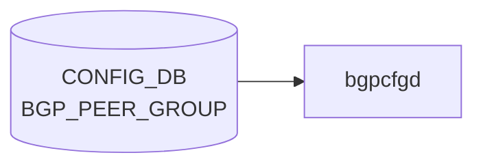

# BGP_PEER_GROUP テーブル

## 概要

[BGP](../../reference/glossary.md#term-bgp) peer-group の [VRF](../../reference/glossary.md#term-vrf) スコープでの定義テーブル。`BGP_NEIGHBOR_LIST.peer_group_name` から参照される。`sonic-bgp-cmn` grouping を `uses` し、`BGP_NEIGHBOR` と同じ共通フィールドを持つ。`frr-mgmt-framework` (`DEVICE_METADATA.frr_mgmt_framework_config = true`) が [CONFIG_DB](../../reference/glossary.md#term-config_db) を購読する[^1]。

<!-- cdb-mermaid -->
### データフロー (自動生成)



!!! note "凡例"
    CONFIG_DB から SAI までの典型経路を `docs/reference/config-db-orch-map.md` から機械生成したミニ図。詳細・例外は本ページ本文と対応表を参照。
<!-- /cdb-mermaid -->

## key 構造

```text
BGP_PEER_GROUP|<vrf_name>|<peer_group_name>
```

`<vrf_name>` は `BGP_GLOBALS.vrf_name` への leafref。

## 主要フィールド

`sonic-bgp-cmn` grouping を `uses` するため、`BGP_NEIGHBOR` と同じ leaf 群を持つ (代表): `local_asn`, `asn`, `peer_type`, `ebgp_multihop`, `ebgp_multihop_ttl`, `auth_password`, `keepalive`, `holdtime`, `conn_retry`, `min_adv_interval`, `local_addr`, `passive_mode`, `capability_ext_nexthop`, `enforce_first_as`, `solo_peer`, `ttl_security_hops`, `bfd`, `peer_port`, `admin_status`, `local_as_no_prepend`, `local_as_replace_as` 等。詳細は `BGP_NEIGHBOR` ページを参照 (`docs/reference/config-db/bgp-neighbor.md`)。

## 派生テーブル

- `BGP_PEER_GROUP_AF` ... peer-group × afi_safi のアドレスファミリ別設定。`sonic-bgp-cmn-af` grouping を `uses`
- `BGP_GLOBALS_LISTEN_PREFIX` ... dynamic neighbor (listen range) の peer-group 紐付け。key: `<vrf_name>|<ip_prefix>`、leaf `peer_group` で `BGP_PEER_GROUP_LIST.peer_group_name` を参照

## 購読者

- `frr-mgmt-framework`: [CONFIG_DB](../../reference/glossary.md#term-config_db) → [FRR](../../reference/glossary.md#term-frr) `peer-group` コマンド
- `bgpcfgd`: テンプレ経路で peer-group を展開

## 関連 CONFIG_DB / YANG / CLI

- 関連 [CONFIG_DB](../../reference/glossary.md#term-config_db): `BGP_NEIGHBOR`、`BGP_GLOBALS`、`BGP_PEER_GROUP_AF`、`BGP_GLOBALS_LISTEN_PREFIX`
- 関連 CLI: `config bgp` (peer-group 関連サブコマンド)
- 関連 [YANG](../../reference/glossary.md#term-yang): `sonic-bgp-peergroup`、`sonic-bgp-common`

<!-- ref-triangle:start -->

## 関連リファレンス

- [YANG](../../reference/glossary.md#term-yang): [`sonic-bgp-peergroup`](../yang/sonic-bgp-peergroup.md) / `sonic-bgp-common`
- CLI: [`config bgp`](../cli/config-bgp.md)

<!-- ref-triangle:end -->

## 引用元

[^1]: [YANG](../../reference/glossary.md#term-yang) 定義: `sonic-bgp-peergroup.yang`. <https://github.com/sonic-net/sonic-buildimage/blob/9ea932ec2e18f35e58268ec2e4456b1d4afd65cd/src/sonic-yang-models/yang-models/sonic-bgp-peergroup.yang>

<!-- ops-hint -->
## 運用ヒント

### 典型値

- key 形式: `BGP_PEER_GROUP|<vrf>|<peer-group-name>`。
- `asn`: 対向 AS（同 peer-group 内で統一）。
- `admin_status`: `up`。

### よくある誤設定

- peer-group の `asn` と個別 neighbor の `asn` がズレると [FRR](../../reference/glossary.md#term-frr) が neighbor を peer-group に紐付けない。

### 確認コマンド

```bash
sonic-db-cli CONFIG_DB keys 'BGP_PEER_GROUP|*'
vtysh -c 'show bgp peer-group'
```
<!-- /ops-hint -->

<!-- value-behavior -->
## 値依存挙動マトリクス

BGP_NEIGHBOR と同一の `sonic-bgp-cmn` grouping を uses する。

### `peer_type` (`bgp_peer_type`)

| 値 | テンプレディレクトリ | 主な差異 |
|----|-------------------|---------|
| `internal` | `bgpd/templates/internal/` | `send-community` 自動、timers 3/10、BackEnd で `next-hop-self force` |
| `external` / `general` | `bgpd/templates/general/` | timers 60/180、ToRRouter で `allowas-in 1` |

peer-group に設定した `peer_type` は、その peer-group に属する全 neighbor のテンプレ種別を決定する。

### `admin_status`

| 値 | [FRR](../../reference/glossary.md#term-frr) コマンド |
|----|-------------|
| `up` | `no neighbor <pg> shutdown` |
| `down` | `neighbor <pg> shutdown` |

<!-- /value-behavior -->

<!-- cdb-exceptions -->
## 例外条件・特殊挙動

| 条件 | 挙動 | ソース |
|------|------|--------|
| peer-group が FRR に未存在のまま SET が到達 | frrcfgd が `neighbor {} peer-group` を [vtysh](../../reference/glossary.md#term-vtysh) 実行。失敗時 `failed to create peer-group %s for VRF %s` を LOG_ERR → continue | `frrcfgd.py` L2799 |
| `local_asn` 未設定 [VRF](../../reference/glossary.md#term-vrf) | LOG_DEBUG して skip | `frrcfgd.py` L2660 |
| `BGPPeerGroupMgr.update_policy()` の Jinja2 エラー | `log_err` して `return False` | `managers_bgp.py` `update_policy()` |
| `BGPPeerGroupMgr.update_pg()` の Jinja2 エラー | `log_err` して `return False` | `managers_bgp.py` `update_pg()` |
| TSA 有効時の peer-group 設定 | `check_state_and_get_tsa_routemaps()` が TSA route-map を自動付与。エラー時は peer-group 全体が skip | `managers_device_global.py` |
| FRR 10.1 以降: listen range がある peer-group の削除 | 先に `no bgp listen range` を実行してから peer-group 削除。range 削除失敗でも peer-group 削除を試みる | `managers_bgp.py` `del_handler()` |
<!-- /cdb-exceptions -->


<!-- runtime-trace -->
## 実コンテナ動作トレース

### 段階 1 — Consumer 登録

`bgpcfgd` が CONFIG_DB の `BGP_PEER_GROUP` テーブルを購読する。

`BGP_PEER_GROUP` は `<vrf>|<pg_name>` の key 構造。

### 段階 2 — CFG→APPL 翻訳

なし (FRR [vtysh](../../reference/glossary.md#term-vtysh) 経由)

### 段階 3 — APPL→SAI

なし (FRR [BGP](../../reference/glossary.md#term-bgp) peer-group 設定)

### 段階 4 — タイミングと副作用

**適用タイミング**: 変化検知後 FRR に `neighbor <pg_name> peer-group` 等のコマンドを発行。peer-group 削除はメンバーネイバー全体への影響あり。

**副作用**: peer-group 削除はメンバーの [BGP](../../reference/glossary.md#term-bgp) session を切断。AS/password 変更はメンバー全 session リセット。
<!-- /runtime-trace -->

<!-- entry-points -->
## 書き込み入り口

対象テーブル: `BGP_PEER_GROUP`

### CLI
- `vtysh` 経由 peer-group コマンド群 ([bgpcfgd](../../reference/glossary.md#term-bgpcfgd) が CONFIG_DB へ書き戻し)
  - ソース: `sonic-frr bgpcfgd`

### minigraph / sonic-cfggen
- なし

### REST / gNMI (sonic-mgmt-common)
- [sonic-mgmt](../../reference/glossary.md#term-sonic-mgmt)-common OpenConfig BGP peer-group 経由

### db_migrator
- なし

### ビルド時デフォルト (init_cfg / j2 テンプレート)
- なし

### ハードコードデフォルト
- なし

### ランタイム注入 (デーモン自動書き込み)
- `bgpcfgd` が FRR running-config を CONFIG_DB と同期
<!-- /entry-points -->


<!-- derivation -->
## 派生・条件付き登録

### 値による他フィールド自動派生

| 条件 | 派生先 | evidence |
|---|---|---|
| minigraph.py は BGP_PEER_GROUP を直接生成しない | — | minigraph.py に代入なし |
| frrcfgd が FRR running-config の peer-group 設定を読み CONFIG_DB と同期 | BGP_PEER_GROUP フィールドを反映 | `sonic-buildimage/src/sonic-frr-mgmt-framework/frrcfgd/frrcfgd.py:2187,2303` |

### 条件付き module/manager 登録

| 条件 | 登録 module | evidence |
|---|---|---|
| 常時（条件なし） | `frrcfgd.BGPConfigDaemon` が `BGP_PEER_GROUP` を購読（`bgp_neighbor_handler`） | `sonic-buildimage/src/sonic-frr-mgmt-framework/frrcfgd/frrcfgd.py:2303` |

### grep カバレッジ

- frrcfgd.py L2303: BGP_PEER_GROUP 購読（条件なし）
<!-- /derivation -->
<!-- handler-branching -->
### Handler メソッド内分岐

| Manager / Handler | メソッド | 分岐条件 | 効果 | evidence |
|---|---|---|---|---|
| `BGPConfigDaemon` | `bgp_neighbor_handler()` | `data is None`（DELETE） | `del_table=True` → peer-group を FRR から削除 | `sonic-buildimage/src/sonic-frr-mgmt-framework/frrcfgd/frrcfgd.py:3918` |
| `BGPConfigDaemon` | `bgp_neighbor_handler()` | `keepalive` と `holdtime` が共に存在 | `comb_attr_list` 制約: 2 フィールド揃いで FRR タイマーコマンドを生成 | `sonic-buildimage/src/sonic-frr-mgmt-framework/frrcfgd/frrcfgd.py:3942` |

> **裏取り**: `bgp_neighbor_handler` L3942 読了。keepalive/holdtime 組み合わせ制約のみ。
<!-- /handler-branching -->
<!-- cross-refs -->
## 暗黙参照テーブル

`BGP_PEER_GROUP` ハンドラが実装レベルで依存する外部テーブルを示す。YANG leafref 宣言のない暗黙依存を含む。

| 参照先テーブル | 参照フィールド | 方向 | 条件 | 依存強度 | ソース |
|--------------|--------------|------|------|---------|--------|
| `BGP_GLOBALS` | `local_asn` | 読み取り | 常時（SET/DEL 両方） | **必須・ブロッキング** — 未設定 [VRF](../../reference/glossary.md#term-vrf) は silently drop | `frrcfgd.py` L2175, L2659 |
| `BGP_PEER_GROUP_AF` | `route_map_in` / `route_map_out` / afi_safi 設定 | 逆参照（cascade 再適用） | peer-group の `asn` OP_ADD または OP_DELETE 時 | 条件付き — `asn` 変更で AF 設定を再投入 | `frrcfgd.py` L2551–2563, L2865 |
| `ROUTE_MAP` | `route_operation` | 内部キャッシュ参照 | `BGP_PEER_GROUP_AF` に `route_map_in`/`out` が設定されたとき | 条件付き — 未投入でも frrcfgd エラーなし（FRR 側 no-op） | `frrcfgd.py` L86, L2206, L2669 |

### BGP_GLOBALS — ブロッキング依存の詳細

frrcfgd は `BGP_PEER_GROUP` の処理ループ先頭で `__get_vrf_asn(vrf)` を呼び出し、
当該 VRF の `BGP_GLOBALS.local_asn` を取得する。`None` の場合は LOG_DEBUG を出力して
当該エントリの処理を **スキップ**（エラーなし）。FRR [vtysh](../../reference/glossary.md#term-vtysh) コマンド
`router bgp <local_asn> vrf <vrf>` の生成に必須のため、`BGP_GLOBALS` 投入前に
`BGP_PEER_GROUP` が到達してもすべて破棄される（`frrcfgd.py` L2658–2662）。

### BGP_PEER_GROUP_AF — cascade 再適用の詳細

peer-group の `asn` が OP_ADD/DELETE されると `__nbr_impl_action` が `'apply'`/`'delete'`
を返し、`__apply_dep_vrf_table` が `BGP_GLOBALS_LISTEN_PREFIX`（listen range）と
`BGP_NEIGHBOR`（メンバー neighbor）を内部キャッシュから再投入する。
`BGP_PEER_GROUP_AF` 自体は `bgp_table_handler_common` で独立購読されており、
peer-group 作成後に AF 設定が到達した場合は順次 FRR に投入される（`frrcfgd.py` L2305, L2865）。

### ROUTE_MAP — 間接参照の詳細

`ROUTE_MAP` は frrcfgd が直接購読するテーブル（`frrcfgd.py` L86: `'ROUTE_MAP': ['zebra', 'bgpd', 'ospfd']`）。
`BGP_PEER_GROUP_AF` の `route_map_in`/`route_map_out` フィールド値がそのまま
FRR `neighbor <pg> route-map <name> in/out` コマンドの `<name>` として使用される。
指定した route-map が FRR に未定義でも frrcfgd はエラーを返さない（FRR 側 no-op）。
<!-- /cross-refs -->

<!-- platform -->
## プラットフォーム / SAI 差分

`BGP_PEER_GROUP` は FRR (`bgpd`) 止まりで [SAI](../../reference/glossary.md#term-sai) に直接到達しないが、`DEVICE_METADATA` の `type`・`sub_role`・`switch_type`・`subtype` に基づいて Jinja2 テンプレートが切り替わり、FRR へ発行されるコマンドが大きく異なる。frrcfgd 動的更新経路 (`frr_mgmt_framework_config=true`) は Jinja2 を経由しないため platform 差なし。


### general peer-group (`peer_type=external` / ToR・Spine など)

ソース: `bgpd/templates/general/peer-group.conf.j2`

| `DEVICE_METADATA.type` | FRR コマンド差 |
|------------------------|---------------|
| `ToRRouter` | `neighbor PEER_V4/V6 allowas-in 1` (IPv4 + IPv6 AF) |
| `LeafRouter` かつ `BGP_BBR.status=enabled` | `neighbor PEER_V4/V6 allowas-in 1` |
| `SpineRouter && subtype=UpstreamLC` または `UpperSpineRouter` | `table-map SELECTIVE_ROUTE_DOWNLOAD_V4/V6`；anchor-route community-list + `TO_BGP_PEER permit 50/60` |
| その他 | `allowas-in` なし、`table-map` なし |

### internal peer-group (`peer_type=internal` / iBGP・multi-ASIC)

ソース: `bgpd/templates/internal/peer-group.conf.j2`

| `DEVICE_METADATA` 条件 | FRR コマンド差 |
|------------------------|---------------|
| `switch_type=chassis-packet` | `neighbor INTERNAL_PEER_V4/V6 update-source Loopback4096` + `ttl-security hops 1` |
| `sub_role=BackEnd` | AF 内に `neighbor INTERNAL_PEER_V4/V6 route-reflector-client`；route-map に `set originator-id <Loopback4096>` |
| `switch_type=chassis-packet && subtype != DownstreamLC` | FALLBACK_COMMUNITY を `set tag route_eligible_for_fallback_to_default_tag` |
| その他 (single-[ASIC](../../reference/glossary.md#term-asic)) | `route-reflector-client` なし、`update-source` なし |

### VoQ シャーシ peer-group (`peer_type=voq_chassis`)

ソース: `bgpd/templates/voq_chassis/peer-group.conf.j2`

| `DEVICE_METADATA` 条件 | FRR コマンド差 |
|------------------------|---------------|
| `bgp_asn` フィールドあり | `neighbor VOQ_CHASSIS_V4/V6_PEER remote-as <bgp_asn>` |
| `type=ToRRouter` | `neighbor VOQ_CHASSIS_V4/V6_PEER allowas-in 1` |
| 全ケース共通 | `addpath-tx-all-paths`、`send-community` が常に付与 |

### BGP モニタ peer-group (`peer_type=monitors`)

ソース: `bgpd/templates/monitors/peer-group.conf.j2`

| `DEVICE_METADATA` 条件 | FRR コマンド差 |
|------------------------|---------------|
| `switch_type=voq` (chassisdb.conf 存在) または `switch_type=chassis-packet` | `neighbor BGPMON update-source Loopback4096`；IPv6 AF ブロック有効化 |
| 非 VoQ・非 chassis-packet | `neighbor BGPMON update-source <Loopback0 IPv4>` |
| その他 | `update-source` なし、IPv6 AF なし |

> **根拠**: `bgpd/templates/general/peer-group.conf.j2`、`internal/peer-group.conf.j2`、`voq_chassis/peer-group.conf.j2`、`monitors/peer-group.conf.j2`、`general/policies.conf.j2`、`internal/policies.conf.j2` を精読。frrcfgd.py は `BGP_PEER_GROUP` ハンドラ内に `switch_type` / `sub_role` 参照なし（動的更新経路は platform 非依存）。
<!-- /platform -->

<!-- defaults -->
## 暗黙デフォルトとコード由来 fallback

### YANG レベル

`sonic-bgp-cmn` grouping の全 leaf に **YANG `default` 文は存在しない**。すべてオプション扱いで、値省略時の動作は FRR / frrcfgd が決定する。

### フィールド別暗黙挙動

| フィールド | 省略/条件 | 実際の動作 | ソース |
|-----------|----------|-----------|--------|
| `keepalive` / `holdtime` | **いずれか一方のみ** | FRR タイマーコマンド生成されない。FRR デフォルト keepalive=60s / holdtime=180s が使われる | `frrcfgd.py` `bgp_neighbor_handler` — `comb_attr_list=[{'keepalive','holdtime'}]` |
| `keepalive` / `holdtime` | **両方設定** | `neighbor <pg> timers <ka> <ht>` を生成 | `frrcfgd.py` L1874, `bgpd.conf.db.nbr_or_peer.j2` L83-84 |
| `ebgp_multihop` = `'true'` かつ `ebgp_multihop_ttl` 省略 | — | TTL **255** (最大ホップ) が暗黙使用される | `bgpd.conf.db.nbr_or_peer.j2` L58-66 |
| `ebgp_multihop_ttl` のみ設定 (`ebgp_multihop` 省略) | — | j2 テンプレートでは TTL 値で `ebgp-multihop` を生成。frrcfgd は `+ebgp_multihop_ttl` でオプション扱い | `bgpd.conf.db.nbr_or_peer.j2` L62-66 |
| `admin_status` 省略 | — | `shutdown` コマンドなし → FRR デフォルト **no shutdown (up)** | `bgpd.conf.db.nbr_or_peer.j2` L33-38 |
| `admin_status` = `'up'` | — | `shutdown` コマンドなし (`'down'` / `'false'` 時のみ生成) | `frrcfgd.py` `hdl_admin_status_shutdown_msg` |
| `bfd_check_ctrl_plane_failure` | `bfd` が `'true'` に変更 + キャッシュに `'true'` が残存 | CONFIG_DB 未更新のまま frrcfgd が OP_ADD に昇格して FRR に再送 | `frrcfgd.py` L2812-2817 |
| `asn` (peer-group 側) | OP_ADD | peer-group に紐づくネイバー全体 + `BGP_GLOBALS_LISTEN_PREFIX` を再適用 | `frrcfgd.py` `__nbr_impl_action` L2550-2562 |
| `asn` (peer-group 側) | OP_DELETE | peer-group メンバーネイバーを全削除シーケンス | 同上 |
| `local_asn` (VRF 側) 未設定 | — | `BGP_PEER_GROUP` 更新を **silently drop** (LOG_DEBUG のみ) | `frrcfgd.py` L2658-2662 |

### YANG vs 実装の discrepancy

| フィールド | YANG | 実装 | 差異種別 |
|-----------|------|------|---------|
| `ebgp_multihop_ttl` | optional, range 1..255, default 文なし | `ebgp_multihop=true` 時に未設定で TTL=255 を補完 | YANG default 外 fallback |
| `keepalive` / `holdtime` | 独立 leaf、互いに optional | 実装は両方揃わないと FRR コマンド未生成 | 複合必須制約 (comb_attr_list) |
| `local_asn` + `local_as_no_prepend` / `local_as_replace_as` | 各々独立 optional | Jinja2 テンプレート (起動時) はフラグを無視。frrcfgd (動的変更) は付与。書き込み経路で差異 | 書き込み経路依存の乖離 |
| `admin_status` | optional, enum up/down | 省略時は FRR デフォルト (up) 依存。YANG に default 文なし | 実行時 fallback |

### peer-group 自動作成

SET 受信時、FRR に peer-group が存在しなければ `neighbor <pg_name> peer-group` を **属性設定より先に自動発行**する。失敗した場合は LOG_ERR を出力して属性設定全体を skip (`frrcfgd.py` L2793-2801)。
<!-- /defaults -->

<!-- ordering -->
## 書込順依存

### 必須順序: BGP_GLOBALS → BGP_PEER_GROUP → BGP_NEIGHBOR

`frrcfgd.__update_bgp()` は `BGP_PEER_GROUP` イベント処理時に対象 VRF の `local_asn` を取得し、未設定（`None`）の場合はイベントを **silently drop**（`LOG_DEBUG` のみ）する。`BGP_GLOBALS|<vrf>` に `local_asn` が書き込まれてから `BGP_PEER_GROUP|<vrf>|<pg_name>` を書き込まなければ peer-group 設定が無音で失われる。

```text
CONFIG_DB 書込順（必須）

1. BGP_GLOBALS|<vrf>        (local_asn を含む)
2. BGP_PEER_GROUP|<vrf>|<pg_name>
3. BGP_NEIGHBOR|<vrf>|<ip>  (peer_group_name で peer-group を参照する場合)
```

### frrcfgd ハンドラ起動順

`table_handler_list`（`frrcfgd.py` L2293-2338）は `BGP_GLOBALS`（位置 3）を `BGP_PEER_GROUP`（位置 11）より前に登録する。`config_mode == "unified"` の起動時リプレイはこの順番で CONFIG_DB を再適用するため、起動時も上記の順序が保証される。

### peer-group 自動作成の内部順序

SET 受信時、frrcfgd は FRR に peer-group が存在しなければ属性コマンドより先に `neighbor <pg_name> peer-group` を自動発行する（`frrcfgd.py` L2793-2802）。自動作成失敗時は `LOG_ERR` を出力して属性設定全体を skip する。FRR への発行順: ① peer-group 宣言 → ② 属性コマンド群。この内部順序は frrcfgd が自動保証する。

### bgpcfgd 経路の依存宣言

`BGPPeerMgrBase.__init__()` は `deps` に `DEVICE_METADATA.bgp_asn` を宣言し（`managers_bgp.py` L118-126）、Manager 基底クラスが deps 充足まで `set_handler()` を保留する。初回ピア追加時は `post_dependencies_init_complete` フラグにより追加 loopback テンプレートを解決してから peer-group テンプレートを確定する（`managers_bgp.py` L181-182）。

### 順序違反時の挙動

| 違反パターン | 挙動 | ソース |
|------------|------|--------|
| BGP_GLOBALS 未設定で BGP_PEER_GROUP を書く | frrcfgd が silently drop（LOG_DEBUG のみ） | `frrcfgd.py` L2658-2662 |
| BGP_PEER_GROUP 未作成で BGP_NEIGHBOR の `peer_group_name` を参照 | vtysh エラー（peer-group 未存在）。frrcfgd は LOG_ERR → skip | `frrcfgd.py` L2826-2827 |
| `neighbor <pg> peer-group` の自動発行失敗 | LOG_ERR 出力 + 属性設定全体を skip（`continue`） | `frrcfgd.py` L2800-2801 |

<!-- /ordering -->

<!-- failure -->
## 失敗挙動・retry 分岐

### frrcfgd 経路

| # | 失敗トリガー | 結果 | retry | ログ |
|---|------------|------|-------|------|
| 1 | 対象 VRF の `BGP_GLOBALS.local_asn` 未設定 | FRR 未投入、CONFIG_DB エントリ残存 | なし (silent skip) | `LOG_DEBUG: ignore table BGP_PEER_GROUP update because local_asn for VRF {} was not configured` |
| 2 | peer-group 自動作成 (`neighbor <pg> peer-group`) vtysh 失敗 | 属性設定全体を skip (`continue`)、`self.bgp_peer_group` にエントリ未登録 | なし (外部 re-SET で再試行可) | `LOG_ERR: failed to create peer-group %s for VRF %s` |
| 3 | 属性コマンド群 (`key_map.run_command`) vtysh 失敗 | 部分適用の可能性あり、`continue` | なし | `LOG_ERR: failed running BGP neighbor config command` |
| 4 | peer-group DELETE vtysh 失敗 | `__delete_vrf_neighbor` は呼ばれる (キャッシュは更新) | なし | `LOG_ERR: failed to delete VRF %s bgp neigbor %s` |
| 5 | bgpd ソケット接続失敗 (起動時) | frrcfgd 起動失敗、全 BGP テーブル未処理 | 最大 100 回 / 2秒間隔 | `LOG_ERR: failed to connect to frr daemon` |

### bgpcfgd 経路 (BGPPeerMgrBase / BGPPeerGroupMgr)

| # | 失敗トリガー | 結果 | retry | ログ |
|---|------------|------|-------|------|
| 6 | Loopback0 IPv4 未設定 かつ `bgp_router_id` 未設定 | `add_peer()` が `False` を返す、Manager 基底クラスが deps 充足まで保留 | deps 充足まで自動保留 | `log_warn: Loopback0 ipv4 address is not presented yet` |
| 7 | `BGPPeerGroupMgr.update_pg()` Jinja2 テンプレートエラー | `False` 返却、peer-group FRR 未投入 (peer 追加処理は継続) | なし | `log_err: Can't render peer-group template: '%s'` |
| 8 | `BGPPeerGroupMgr.update_policy()` Jinja2 テンプレートエラー | `False` 返却、routing policy FRR 未投入 | なし | `log_err: Can't render policy template name: '%s'` |
| 9 | `DEVICE_NEIGHBOR_METADATA` 未準備 (`check_neig_meta=True` 時) | `add_peer()` が `False`、Manager 基底クラスが保留 | deps 充足まで自動保留 | `log_info: DEVICE_NEIGHBOR_METADATA is not ready for neighbor` |

### 設計上の注意点

- **frrcfgd は運用中 retry を持たない**: 失敗時は CONFIG_DB エントリを残したまま次イベントへ進む。FRR との整合性回復にはオペレータが再度 SET する必要がある
- **BGP_GLOBALS 不在 → silent skip**: LOG_ERR ではなく LOG_DEBUG のみのため、障害検知にはログレベルの引き上げが必要
- **peer-group 自動作成失敗 → 属性全体 skip**: `neighbor <pg> peer-group` の vtysh 失敗は属性コマンド群の発行を全てブロックする
- **rollback 未実装**: 部分失敗時 CONFIG_DB エントリは残存し、FRR 側との整合性は保証されない

<!-- /failure -->

<!-- side-effects -->
## 副次 DB 書込

### frrcfgd.py BGP_PEER_GROUP ハンドラ直接書込

`frrcfgd.py` は [STATE_DB](../../reference/glossary.md#term-state_db) / [APPL_DB](../../reference/glossary.md#term-appl_db) / [COUNTERS_DB](../../reference/glossary.md#term-counters_db) への書込クラスをインポートしておらず、
BGP_PEER_GROUP ハンドラの唯一の外部副作用は **FRR vtysh への設定投入** のみ。

| DB | 書込 |
|---|---|
| [STATE_DB](../../reference/glossary.md#term-state_db) | なし |
| [APPL_DB](../../reference/glossary.md#term-appl_db) | なし |
| [COUNTERS_DB](../../reference/glossary.md#term-counters_db) | なし |

### bgpcfgd BGPPeerMgrBase 経由 — 間接書込

BGP_PEER_GROUP の `asn` フィールド変更時、`frrcfgd.py` の
`__apply_dep_vrf_table('BGP_NEIGHBOR')` (L2848) がメンバーネイバーを再適用し、
`bgpcfgd` の `BGPPeerMgrBase.update_state_db()` が発火する。

| DB | テーブル | 操作 | キー形式 | 条件 |
|---|---|---|---|---|
| [STATE_DB](../../reference/glossary.md#term-state_db) | `BGP_PEER_CONFIGURED_TABLE` | SET | `<nbr_ip>` (default VRF) または `<vrf>\|<nbr_ip>` | peer-group `asn` 変更で BGP_NEIGHBOR re-apply が発火した場合 |
| STATE_DB | `BGP_PEER_CONFIGURED_TABLE` | DEL | 同上 | peer-group 削除でメンバー neighbor が削除された場合 |

書込経路:

```
BGP_PEER_GROUP (asn 変更)
  └─→ frrcfgd __apply_dep_vrf_table('BGP_NEIGHBOR') [frrcfgd.py L2848]
        └─→ bgpcfgd BGPPeerMgrBase.add_peer() / del_handler()
              └─→ update_state_db() [managers_bgp.py L239/L487]
                    └─→ STATE_DB:BGP_PEER_CONFIGURED_TABLE SET/DEL
```

<!-- /side-effects -->


<!-- pubsub -->
## 通信メカニズム

### Redis 購読方式

`BGP_PEER_GROUP` テーブルへの変更通知は **2 つの独立したデーモン** が受信する。方式は下表の通り異なる。

| 購読者 | 購読 API | 通信方式 | ハンドラ |
|--------|---------|---------|---------|
| `frrcfgd` (sonic-frr-mgmt-framework) | `ExtConfigDBConnector.subscribe()` + `listen()` | [Redis](../../reference/glossary.md#term-redis) keyspace `PSUBSCRIBE __keyspace@<dbId>__:*` | `bgp_neighbor_handler` → `bgp_table_handler_common` → `__update_bgp` |
| `bgpcfgd` (sonic-[bgpcfgd](../../reference/glossary.md#term-bgpcfgd)) の `BGPPeerMgrBase` | `swsscommon.SubscriberStateTable` + `swsscommon.Select` | [Redis](../../reference/glossary.md#term-redis) PUBLISH/SUBSCRIBE チャネルベース | `Runner.run()` → `BGPPeerMgrBase.handler()` → `set_handler()` / `del_handler()` |

`orchagent` / `syncd` 等の [APPL_DB](../../reference/glossary.md#term-appl_db) / [ASIC_DB](../../reference/glossary.md#term-asic_db) レイヤは本テーブルを購読しない（FRR `bgpd` のソフトウェア処理で完結、[SAI](../../reference/glossary.md#term-sai) 非経由）。

### frrcfgd 経路: keyspace 通知 → ハンドラ呼び出し

`frrcfgd` は `ConfigDBConnector` を継承した `ExtConfigDBConnector` を使用する。`subscribe_all()` で `BGP_PEER_GROUP` に `bgp_neighbor_handler` を登録し (`frrcfgd.py` L2303, L2359-2361)、`listen()` でバックグラウンドスレッドを起動して [Redis](../../reference/glossary.md#term-redis) keyspace を監視する (`frrcfgd.py` L1547-1552)。

```
sonic-db-cli CONFIG_DB hset 'BGP_PEER_GROUP|default|PEER_GROUP_1' local_asn 65001
  ↓ HSET 後に Redis 側で keyspace 通知発火
Redis keyspace PUBLISH "__keyspace@4__:BGP_PEER_GROUP|default|PEER_GROUP_1" "hset"
  ↓ ExtConfigDBConnector.listen_thread() がパターンマッチ (frrcfgd.py:1536-1543)
sub_msg_handler() → client.hgetall(key)  ← 通知後に値を再取得 (frrcfgd.py:1527-1528)
raw_to_typed() で型変換・list ソート
  ↓ _ConfigDBConnector__fire("BGP_PEER_GROUP", "default|PEER_GROUP_1", data)
bgp_neighbor_handler(table, key, data)
  → bgp_table_handler_common(table, key, data, [{'keepalive', 'holdtime'}]) (frrcfgd.py:3942-3943)
  → bgp_message キューへ enqueue → __update_bgp() で処理 (frrcfgd.py:2790-2863)
  → peer-group 未存在なら vtysh "neighbor PEER_GROUP_1 peer-group" を先行実行 (frrcfgd.py:2793-2802)
  → 属性コマンド群 key_map.run_command() → vtysh 送出
```

- keyspace 通知のペイロードは操作名 (`hset` / `del`) のみ。フィールド値は `client.hgetall(key)` で再取得する (`frrcfgd.py` L1527-1528)。
- `data is None → DEL、それ以外 → SET` の 2 値判定 (`ConfigDBConnector` 標準動作)。
- `bgp_neighbor_handler` は `comb_attr_list=[{'keepalive', 'holdtime'}]` を渡す。keepalive / holdtime は両方揃わないと FRR タイマーコマンドが生成されない (`frrcfgd.py` L3942-3943)。
- `listen_thread` は専用スレッドで動作し、`bgp_message` キュー経由で `__update_bgp` に直列化される (`frrcfgd.py` L1551, L3928-3930)。
- 起動時は `subscribe_all()` 前に `config_db.get_table_data([...])` で全テーブルの一括スナップショットを取得し (`frrcfgd.py` L2340)、`config_mode == "unified"` 時は config replay を実行する (`frrcfgd.py` L2344-2357)。また、起動時に `pg_table = self.config_db.get_table('BGP_PEER_GROUP')` で既存 peer-group を `self.bgp_peer_group` キャッシュに読み込む (`frrcfgd.py` L2187-2191)。

### bgpcfgd 経路: SubscriberStateTable + Runner

`bgpcfgd` は `swsscommon.SubscriberStateTable` を使ったチャネルベース購読を採用する。`Runner.add_manager()` が `BGPPeerMgrBase` を登録すると、対応する CONFIG_DB テーブル (`CFG_BGP_NEIGHBOR_TABLE_NAME` 等) の `SubscriberStateTable` を生成して `swsscommon.Select` に追加する (`runner.py` L49-51)。**[bgpcfgd](../../reference/glossary.md#term-bgpcfgd) は `BGP_PEER_GROUP` テーブルを直接購読しない**。`BGPPeerGroupMgr` (`managers_bgp.py` L15-84) は `BGPPeerMgrBase.add_peer()` から呼ばれる内部ヘルパーであり、peer-group の Jinja2 テンプレートをレンダリングして `cfg_mgr.push()` 経由で FRR に送出する。

```
CONFIG_DB BGP_NEIGHBOR / BGP_PEER_RANGE などの変更
  ↓ SubscriberStateTable が PUBLISH 通知を受信
Runner.run() → selector.select() → subscriber.pop() → key, op, fvs
  ↓ callback = BGPPeerMgrBase.handler()
set_handler() / del_handler()
  → add_peer() 内で BGPPeerGroupMgr.update() を呼出 (managers_bgp.py:227)
    → update_policy() / update_pg() → cfg_mgr.push(cmd) → FRR へ vtysh コマンド発行
```

CONFIG_DB は永続前提のため TTL は設定されない。

### サービス再起動トリガー

| 契機 | 操作 | コード |
|------|------|--------|
| `BGP_PEER_GROUP` 変更 (frrcfgd 経路) | FRR `bgpd` への vtysh コマンド送出のみ。`bgpd` プロセス restart なし | `frrcfgd.py` L2790-2863, L3942 |
| `BGP_PEER_GROUP` 変更 (bgpcfgd 経路) | bgpcfgd は BGP_PEER_GROUP を直接購読せず。BGP_NEIGHBOR 変更時に `BGPPeerGroupMgr.update()` 経由で peer-group テンプレが更新される | `managers_bgp.py` L156, L227 |
| `local_asn` 未設定 VRF | frrcfgd が silent drop (LOG_DEBUG のみ)。bgpcfgd は `DEVICE_METADATA.bgp_asn` deps 充足まで保留 | `frrcfgd.py` L2658-2662, `managers_bgp.py` L119 |

> **Evidence**: `sonic-buildimage/src/sonic-frr-mgmt-framework/frrcfgd/frrcfgd.py:1506-1555, 1536-1543, 2187-2191, 2303, 2340, 2344-2357, 2359-2361, 2790-2863, 3942-3943` (keyspace listen / subscribe / peer-group ハンドラ / 起動スナップショット); `sonic-buildimage/src/sonic-bgpcfgd/bgpcfgd/runner.py:31-73` (SubscriberStateTable + Select ループ); `sonic-buildimage/src/sonic-bgpcfgd/bgpcfgd/managers_bgp.py:15-84, 156-157, 227` (BGPPeerGroupMgr / add_peer)
<!-- /pubsub -->

<!-- constants -->
## ハードコード定数

BGP_PEER_GROUP の設定は frrcfgd の `cmn_key_map` (フィールド→FRR コマンドマッピング) 経由で FRR に投入されるが、bgpcfgd が使う Jinja2 テンプレート群（`peer-group.conf.j2` / `policies.conf.j2`）にはいくつかのハードコード定数が存在する。

### peer-group 名定数

各テンプレートディレクトリがハードコードする peer-group 名。CONFIG_DB のキーとして使われる `<peer_group_name>` がこの値に固定される。

| テンプレートパス | peer-group 名 | evidence |
|--------------|-------------|---------|
| `bgpd/templates/general/peer-group.conf.j2` | `PEER_V4`（IPv4）、`PEER_V6`（IPv6） | `general/peer-group.conf.j2:4,5` |
| `bgpd/templates/internal/peer-group.conf.j2` | `INTERNAL_PEER_V4`（IPv4）、`INTERNAL_PEER_V6`（IPv6） | `internal/peer-group.conf.j2:4,5` |
| `bgpd/templates/BGPMON/peer-group.conf.j2` | `BGPMON` | `monitors/peer-group.conf.j2:8` |
| `bgpd/templates/voq_chassis/peer-group.conf.j2` | `VOQ_CHASSIS_V4_PEER`（IPv4）、`VOQ_CHASSIS_V6_PEER`（IPv6） | `voq_chassis/peer-group.conf.j2:4,8` |

### peer-group 固定設定（CONFIG_DB 値非依存）

bgpcfgd テンプレート経路でのみ適用される固定設定。frrcfgd 経路（frr_mgmt_framework_config=true 時）は CONFIG_DB フィールド値をそのまま使うため、下記はハードコードされない。

#### general テンプレート（`PEER_V4` / `PEER_V6`）

| 設定 | ハードコード値 | 適用条件 | evidence |
|-----|-------------|---------|---------|
| `allowas-in` | `1` | `type == 'ToRRouter'`、または `type == 'LeafRouter'` かつ `BGP_BBR.status == 'enabled'` | `general/peer-group.conf.j2:8,11,23,26` |
| `soft-reconfiguration inbound` | — | 常時 | `general/peer-group.conf.j2:14,29` |
| route-map 名（IPv4 inbound） | `FROM_BGP_PEER_V4` | 常時 | `general/peer-group.conf.j2:15` |
| route-map 名（IPv4 outbound） | `TO_BGP_PEER_V4` | 常時 | `general/peer-group.conf.j2:16` |
| route-map 名（IPv6 inbound） | `FROM_BGP_PEER_V6` | 常時 | `general/peer-group.conf.j2:30` |
| route-map 名（IPv6 outbound） | `TO_BGP_PEER_V6` | 常時 | `general/peer-group.conf.j2:31` |
| `table-map` 名（IPv4） | `SELECTIVE_ROUTE_DOWNLOAD_V4` | `type == 'SpineRouter' && subtype == 'UpstreamLC'`、または `type == 'UpperSpineRouter'` | `general/peer-group.conf.j2:18` |
| `table-map` 名（IPv6） | `SELECTIVE_ROUTE_DOWNLOAD_V6` | 同上 | `general/peer-group.conf.j2:33` |

#### internal テンプレート（`INTERNAL_PEER_V4` / `INTERNAL_PEER_V6`）

| 設定 | ハードコード値 | 適用条件 | evidence |
|-----|-------------|---------|---------|
| `allowas-in` | `1` | 常時（IPv4/IPv6 両 AF） | `internal/peer-group.conf.j2:15,29` |
| `soft-reconfiguration inbound` | — | 常時 | `internal/peer-group.conf.j2:14,28` |
| `send-community` | — | 常時 | `internal/peer-group.conf.j2:18,32` |
| `route-reflector-client` | — | `sub_role == 'BackEnd'` | `internal/peer-group.conf.j2:12,26` |
| `update-source` | `Loopback4096` | `switch_type == 'chassis-packet'` | `internal/peer-group.conf.j2:7,21` |
| `ttl-security hops` | `1` | `switch_type == 'chassis-packet'` | `internal/peer-group.conf.j2:8,22` |
| route-map 名（IPv4 inbound） | `FROM_BGP_INTERNAL_PEER_V4` | 常時 | `internal/peer-group.conf.j2:16` |
| route-map 名（IPv4 outbound） | `TO_BGP_INTERNAL_PEER_V4` | 常時 | `internal/peer-group.conf.j2:17` |
| route-map 名（IPv6 inbound） | `FROM_BGP_INTERNAL_PEER_V6` | 常時 | `internal/peer-group.conf.j2:30` |
| route-map 名（IPv6 outbound） | `TO_BGP_INTERNAL_PEER_V6` | 常時 | `internal/peer-group.conf.j2:31` |

#### BGPMON テンプレート（`BGPMON`）

| 設定 | ハードコード値 | 適用条件 | evidence |
|-----|-------------|---------|---------|
| `maximum-prefix` | `1` | 常時（IPv4/IPv6 両 AF） | `monitors/peer-group.conf.j2:20,29` |
| `send-community` | — | 常時 | `monitors/peer-group.conf.j2:19,28` |
| `update-source` | `Loopback4096` | `switch_type == 'voq'` または `chassis-packet` | `monitors/peer-group.conf.j2:10` |
| route-map 名（inbound） | `FROM_BGPMON` | 常時 | `monitors/peer-group.conf.j2:17,26` |
| route-map 名（outbound） | `TO_BGPMON` | 常時 | `monitors/peer-group.conf.j2:18,27` |

#### voq_chassis テンプレート（`VOQ_CHASSIS_V4_PEER` / `VOQ_CHASSIS_V6_PEER`）

| 設定 | ハードコード値 | 適用条件 | evidence |
|-----|-------------|---------|---------|
| `allowas-in` | `1` | `type == 'ToRRouter'` | `voq_chassis/peer-group.conf.j2:15,26` |
| `addpath-tx-all-paths` | — | 常時 | `voq_chassis/peer-group.conf.j2:18,29` |
| `soft-reconfiguration inbound` | — | 常時 | `voq_chassis/peer-group.conf.j2:19,30` |
| `send-community` | — | 常時 | `voq_chassis/peer-group.conf.j2:22,33` |
| route-map 名（IPv4 inbound） | `FROM_VOQ_CHASSIS_V4_PEER` | 常時 | `voq_chassis/peer-group.conf.j2:20` |
| route-map 名（IPv4 outbound） | `TO_VOQ_CHASSIS_V4_PEER` | 常時 | `voq_chassis/peer-group.conf.j2:21` |
| route-map 名（IPv6 inbound） | `FROM_VOQ_CHASSIS_V6_PEER` | 常時 | `voq_chassis/peer-group.conf.j2:31` |
| route-map 名（IPv6 outbound） | `TO_VOQ_CHASSIS_V6_PEER` | 常時 | `voq_chassis/peer-group.conf.j2:32` |

### タイマーデフォルト（frrcfgd 経路）

frrcfgd は `keepalive` と `holdtime` の **両方** が CONFIG_DB に存在する場合のみ `neighbor <pg> timers <ka> <ht>` を生成する（`comb_attr_list` 制約）。いずれか一方が欠けると FRR デフォルト値が使われる。

| 値 | FRR デフォルト | ソース |
|----|--------------|--------|
| keepalive | `60` 秒 | FRR BGP デフォルト（CONFIG_DB 省略時） |
| holdtime | `180` 秒 | FRR BGP デフォルト（CONFIG_DB 省略時） |

`frrcfgd.py` L1874: `(['keepalive', 'holdtime'], '{no:no-prefix}neighbor {} timers {} {}')` — 両フィールド揃い時のみコマンド生成。

### policies.conf.j2 の定数注入（`constants.bgp.*`）

bgpcfgd テンプレートが参照する runtime 定数。値はデプロイ時の `constants.json` で注入される。テスト参照値を示す。

#### general テンプレート（allow_list 有効時）

| 定数キー | テスト参照値 | 用途 | evidence |
|---------|------------|------|---------|
| `constants.bgp.allow_list.drop_community` | `12345:12345` | `ALLOW_LIST_DEPLOYMENT_ID_0_V4/V6 permit 65535` での `set community` | `general/policies.conf.j2:25,28,32` |
| `constants.bgp.route_eligible_for_fallback_to_default_tag` | `203` | SpineRouter UpstreamLC で `FROM_BGP_PEER_V4/V6 permit 13` の `set tag` | `general/policies.conf.j2:50,75` |
| `constants.bgp.route_do_not_send_appdb_tag` | `202` | 非 chassis-packet の UpstreamLC SpineRouter の `set tag` | `general/policies.conf.j2:49,72` |
| `constants.bgp.internal_fallback_community` | `1111:2222` | UpstreamLC SpineRouter の `set community ... additive` | `general/policies.conf.j2:53,76` |
| `constants.bgp.local_anchor_route_community` | `12345:555` | UpperSpineRouter/UpstreamLC の `LOCAL_ANCHOR_ROUTE_COMMUNITY` | `general/policies.conf.j2:107,121,138` |
| `constants.bgp.anchor_route_community` | `12345:666` | UpperSpineRouter の `ANCHOR_ROUTE_COMMUNITY` | `general/policies.conf.j2:106,121` |
| `constants.bgp.anchor_contributing_route_community` | `12345:777` | UpperSpineRouter の `TO_BGP_PEER` で `set community ... additive` | `general/policies.conf.j2:108,125,134` |

#### voq_chassis テンプレート

| 定数キー | テスト参照値 | 用途 | evidence |
|---------|------------|------|---------|
| `constants.bgp.internal_community` | `12345:556` | `DEVICE_INTERNAL_COMMUNITY` community-list、`TO_VOQ_CHASSIS` で `set community` | `voq_chassis/policies.conf.j2:5,33,68` |
| `constants.bgp.internal_fallback_community` | `1111:2222` | `DEVICE_INTERNAL_FALLBACK_COMMUNITY` community-list | `voq_chassis/policies.conf.j2:6` |
| `constants.bgp.local_anchor_route_community` | `12345:555` | `LOCAL_ANCHOR_ROUTE_COMMUNITY`、`TO_VOQ_CHASSIS deny 15` | `voq_chassis/policies.conf.j2:4,36,71` |
| `constants.bgp.internal_community_match_tag` | `101` | `FROM_VOQ_CHASSIS permit 1/2` の `set tag` | `voq_chassis/policies.conf.j2:12,47` |
| `constants.bgp.route_eligible_for_fallback_to_default_tag` | `203` | 非 UpstreamLC で `FROM_VOQ_CHASSIS permit 3/4` の `set tag` | `voq_chassis/policies.conf.j2:26,61` |
| local-preference (NO_EXPORT 一致時) | `80` | `FROM_VOQ_CHASSIS V4 permit 2` / `V6 permit 3` の `set local-preference` | `voq_chassis/policies.conf.j2:16,50` |
<!-- /constants -->

<!-- glossary-links-injected: 4a352249be82 -->
