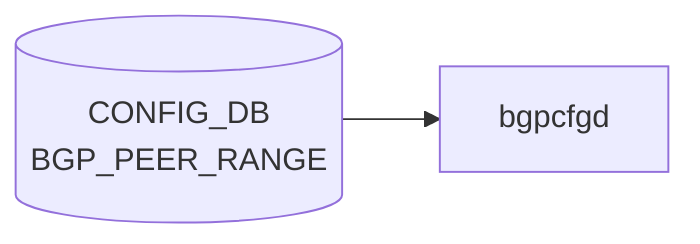

# BGP_PEER_RANGE テーブル

## 概要

`BGP_PEER_RANGE` テーブルは [BGP](../../reference/glossary.md#term-bgp) の dynamic neighbor 用 listen-range / peer-range を [CONFIG_DB](../../reference/glossary.md#term-config_db) に定義する[^1]。`bgpcfgd` テンプレが `bgpd` の `bgp listen range <prefix> peer-group <name>` 相当を生成するための入力。

定義は 2 list:

- `BGP_PEER_RANGE_LIST` (vrf_name, peer_range_name): [VRF](../../reference/glossary.md#term-vrf) または [VNET](../../reference/glossary.md#term-vnet) 別の peer range
- `BGP_PEER_RANGE_TEMPLATE_LIST` (peer_range_name): テンプレベース

<!-- cdb-mermaid -->
### データフロー (自動生成)



!!! note "凡例"
    CONFIG_DB から SAI までの典型経路を `docs/reference/config-db-orch-map.md` から機械生成したミニ図。詳細・例外は本ページ本文と対応表を参照。
<!-- /cdb-mermaid -->

## key 構造

```text
BGP_PEER_RANGE|<vrf_name>|<peer_range_name>      # generic
BGP_PEER_RANGE_TEMPLATE|<peer_range_name>        # template
```

| キー | 型 | 説明 |
|------|----|------|
| `vrf_name` | union (leafref to `VRF.name` または `VNET.name`) | 所属 [VRF](../../reference/glossary.md#term-vrf) または [VNET](../../reference/glossary.md#term-vnet) |
| `peer_range_name` | string | peer range の一意名 |

## フィールド

| フィールド | 型 | 説明 |
|-----------|----|------|
| `name` | string | 表示名。`must` で `peer_range_name` と一致を強制 |
| `src_address` | inet:ip-address | コネクションのソース IP |
| `peer_asn` | uint32 (1..4294967295) | 隣接 AS 番号 |
| `ip_range` | leaf-list `sonic-ip-prefix` (`ordered-by user`) | listen-range のプレフィックス集合 |

## 制約

- `vrf_name` は `VRF` か `VNET` のいずれかへの leafref（union）
- `name` は `peer_range_name` と完全一致必須
- `peer_asn` は AS4 範囲

## 購読者

- `bgpcfgd` (`docker-fpm-frr`)

## 関連 CONFIG_DB / YANG / CLI

- 関連 [CONFIG_DB](../../reference/glossary.md#term-config_db): `BGP_GLOBALS`、`VRF`、`VNET`、`BGP_PEER_GROUP`
- 関連 [YANG](../../reference/glossary.md#term-yang): `sonic-bgp-peerrange`、`sonic-vrf`、`sonic-vnet`
- 関連 CLI: `config bgp`

<!-- ref-triangle:start -->

## 関連リファレンス

- [YANG](../../reference/glossary.md#term-yang): [`sonic-bgp-peerrange`](../yang/sonic-bgp-peerrange.md)
- CLI: [`config bgp`](../cli/config-bgp.md)

<!-- ref-triangle:end -->

## 引用元

[^1]: [YANG](../../reference/glossary.md#term-yang) 定義: `sonic-bgp-peerrange.yang`. <https://github.com/sonic-net/sonic-buildimage/blob/9ea932ec2e18f35e58268ec2e4456b1d4afd65cd/src/sonic-yang-models/yang-models/sonic-bgp-peerrange.yang>

## 関連ページ
- [CONFIG_DB: BGP_NEIGHBOR](bgp-neighbor.md)
- [CONFIG_DB: BGP_PEER_GROUP](bgp-peer-group.md)

<!-- ops-hint -->
## 運用ヒント

### 典型値

- key 形式: `BGP_PEER_RANGE|<vrf>|<range-name>`。
- `ip_range`: CIDR、`peer_asn`: 対向 AS、`name`: 識別子。dynamic neighbor 用途。

### よくある誤設定

- `listen limit` を超えると新規 dynamic neighbor が拒否される。

### 確認コマンド

```bash
sonic-db-cli CONFIG_DB keys 'BGP_PEER_RANGE|*'
vtysh -c 'show bgp listen range'
```
<!-- /ops-hint -->

<!-- value-behavior -->
## 値依存挙動マトリクス

このテーブルには enum フィールドはない。

### `vrf_name` (key、VRF/VNET 分岐)

| 型 | 動作 |
|----|------|
| `VRF.name` への leafref | VRF コンテキストで `bgp listen range <prefix> peer-group <name>` を生成 |
| `VNET.name` への leafref | VNET 対応 VRF で同様のコマンドを生成 |

### `ip_range` (leaf-list)

- 複数プレフィックスを user-ordered で指定可能
- `dynamic/update.conf.j2` が各プレフィックスに対して `bgp listen range <prefix> peer-group <name>` を展開
- 削除時は既存 range との差分を計算して `no bgp listen range` を発行

<!-- /value-behavior -->

<!-- cdb-exceptions -->
## 例外条件・特殊挙動

| 条件 | 挙動 | ソース |
|------|------|--------|
| `deployment_id` が DEVICE_METADATA に未設定で `peer_asn` も未設定 | Jinja2 で `UndefinedError` / `KeyError` → `log_err` + `return True` (drop) | `dynamic/instance.conf.j2`, `managers_bgp.py` |
| `ip_range` が空または未設定 | `bgp listen range <empty>` が vtysh に送られ FRR エラー | `dynamic/instance.conf.j2` |
| `ip_range` 更新時の既存 range 取得失敗 | `LOG_ERR` して空リスト返却 → 全 range を新規追加として処理 | `managers_bgp.py` `get_existing_ip_ranges()` |
| `src_address` 未設定 | Loopback1 の IPv4 アドレスで補完。Loopback1 が未設定の場合 Jinja2 エラー → drop | `dynamic/instance.conf.j2` |
| FRR 10.1 以降: listen range 削除失敗後も peer-group 削除を続行 | range 削除の `log_err` 後、peer-group 削除を試みる → FRR 側エラーの可能性 | `managers_bgp.py` `del_handler()` |
<!-- /cdb-exceptions -->


<!-- runtime-trace -->
## 実コンテナ動作トレース

### 段階 1 — Consumer 登録

`bgpcfgd` が CONFIG_DB の `BGP_PEER_RANGE` テーブルを購読する。

`BGP_PEER_RANGE` は `<vrf>|<prefix>` の key 構造。dynamic neighbor 機能。

### 段階 2 — CFG→APPL 翻訳

なし (FRR vtysh 経由)

### 段階 3 — APPL→SAI

なし (FRR BGP dynamic peer 設定)

### 段階 4 — タイミングと副作用

**適用タイミング**: 変化検知後 FRR に `bgp listen range <prefix> peer-group <pg>` を発行。指定プレフィクスからの接続を dynamic に受け入れ開始。

**副作用**: 指定プレフィクス内からの BGP 接続が自動的に対象 peer-group として処理される。既存の static ネイバーとは独立。
<!-- /runtime-trace -->

<!-- entry-points -->
## 書き込み入り口 (Direction A)

対象テーブル: `BGP_PEER_RANGE`

### CLI
- `config bgp peer-range add/del <prefix>`
  - ソース: `sonic-utilities/config/main.py (bgp グループ)`

### minigraph / sonic-cfggen
- あり: `sonic-cfggen -m <minigraph.xml>` 実行時に本テーブルが生成・上書きされる

### REST / gNMI (sonic-mgmt-common)
- なし (対応 OpenConfig/SONiC YANG transformer なし)

### db_migrator
- なし

### ビルド時デフォルト (init_cfg / j2 テンプレート)
- なし

### ハードコードデフォルト
- なし

### ランタイム注入 (デーモン自動書き込み)
- なし
<!-- /entry-points -->


<!-- derivation -->
## 派生・条件付き登録 (Phase 6/7)

### Phase 6: 値による他フィールド自動派生

| 条件 | 派生先 | evidence |
|---|---|---|
| minigraph XML に `<BGPPeerRange>` エントリが存在する | `BGP_PEER_RANGE` テーブルに `ip_range` エントリを生成 | `sonic-buildimage/src/sonic-config-engine/minigraph.py:1401-1408,2275` |
| `PeerRange.Address` が IPv4/IPv6 のどちらか | `ip_range` の CIDR 文字列として格納 | `sonic-buildimage/src/sonic-config-engine/minigraph.py:1401` |

### Phase 7: 条件付き module/manager 登録

| 条件 | 登録 module | evidence |
|---|---|---|
| 常時（条件なし） | `BGPPeerMgrBase(peer_type="dynamic")` が `BGP_PEER_RANGE` を購読 | `sonic-buildimage/src/sonic-bgpcfgd/bgpcfgd/main.py:90` |

### grep カバレッジ

- minigraph.py L2275: BGP_PEER_RANGE 代入
- bgpcfgd/main.py L90: 条件なし登録
<!-- /derivation -->
<!-- handler-branching -->
### Phase 8: Handler メソッド内分岐

| Manager / Handler | メソッド | 分岐条件 | 効果 | evidence |
|---|---|---|---|---|
| `BGPPeerMgrBase` | `set_handler()` | `peer_key NOT IN self.peers` | `add_peer()` 新規追加 | `sonic-buildimage/src/sonic-bgpcfgd/bgpcfgd/managers_bgp.py:167` |
| `BGPPeerMgrBase` | `update_peer()` | `"ip_range" in data AND peer_type == "dynamic"` | `change_ip_range()` を呼び出し（動的 BGP range 更新） | `sonic-buildimage/src/sonic-bgpcfgd/bgpcfgd/managers_bgp.py:317` |
| `BGPPeerMgrBase` | `del_handler()` | `peer_type == "dynamic" OR peer_type == "sentinels"` | `no bgp listen range` コマンドを送出 | `sonic-buildimage/src/sonic-bgpcfgd/bgpcfgd/managers_bgp.py:461` |

> **スキャン証跡**: peer_type="dynamic" 固有の ip_range 更新分岐と del_handler の `no listen range` テンプレート使用を確認。3 件分岐抽出。
<!-- /handler-branching -->
<!-- defaults -->
## フィールド暗黙デフォルトと fallback

### `peer_asn` — `deployment_id_asn_map` fallback

`peer_asn` を省略すると `instance.conf.j2` が `constants.deployment_id_asn_map` を参照して自動的に AS 番号を決定する。

```
peer_asn 未設定
  → constants.yml deployment_id_asn_map[DEVICE_METADATA.localhost.deployment_id]
    "1" → 65432
    "2" → 65433
  → DEVICE_METADATA に deployment_id が未設定 → Jinja2 KeyError → log_err + drop
```

YANG は `peer_asn` を optional としているが、この fallback の存在は YANG に記載がない。

### `src_address` — Loopback1 ハードコード fallback

`src_address` を省略すると `instance.conf.j2` は `Loopback1` の IPv4 アドレスをハードコード参照する。`"Loopback1"` という名前は CONFIG_DB 経由で変更できない。Loopback1 が未設定の場合は Jinja2 エラーで drop される。

### ハードコード固定値（CONFIG_DB 非依存）

以下は全 `BGP_PEER_RANGE` エントリに無条件で適用されるハードコード設定。フィールドで制御する手段はない。

| FRR コマンド | 固定値 |
|------------|--------|
| `neighbor <name> passive` | 常時 passive |
| `neighbor <name> ebgp-multihop` | 255 固定 |
| `neighbor <name> soft-reconfiguration inbound` | 常時有効 |
| `neighbor <name> route-map FROM_BGP_SPEAKER in` | route-map 名固定 |
| `neighbor <name> route-map TO_BGP_SPEAKER out` | route-map 名固定 |
| `address-family ipv4/ipv6 activate` | 両 AF 常時有効 |

### `ip_range` — 空値の silent no-op

`ip_range` が空文字の場合 `change_ip_range()` の `if data['ip_range']:` ガードでスキップされ、FRR に `bgp listen range` コマンドが発行されない（エラーなし・silent）。YANG の leaf-list はゼロ要素を許容するが実質的に意味をなさない。

### 書き込み経路依存乖離（gNMI bypass）

`sonic-gnmi` の `bypass.go` で `BGP_PEER_RANGE` は `AllowedTables` に登録されており、gNMI Set 時に DBUS/GCU 検証をバイパスして CONFIG_DB 直接書き込みが可能。ただし Cisco-8102/8101/8223 HwSku のみに制限される。

> **ソース**: `dockers/docker-fpm-frr/frr/bgpd/templates/dynamic/instance.conf.j2`, `bgpcfgd/managers_bgp.py` L358-386, `files/image_config/constants/constants.yml`, `sonic-gnmi/pkg/bypass/bypass.go` L29

<!-- /defaults -->

<!-- failure -->
## 失敗挙動マトリクス (Phase D)

ソース: `sonic-net/sonic-buildimage/src/sonic-bgpcfgd/bgpcfgd/managers_bgp.py`

### SET 処理における失敗経路

| 失敗条件 | 検出箇所 | 結果 | ログ出力 | evidence |
|---|---|---|---|---|
| `DEVICE_METADATA.localhost.bgp_asn` が未設定（起動時依存未充足） | `set_handler()` deps チェック | `return False`（swsscommon リトライ待ち） | なし | `managers_bgp.py:118-120` |
| `DEVICE_METADATA.localhost.deployment_id` 未設定かつ `peer_asn` も未設定 | `instance.conf.j2` Jinja2 レンダリング | `jinja2.TemplateError` → `log_err` + `return True`（drop・リトライなし） | LOG_ERR ("Peer (vrf\|nbr). Error in rendering the template for 'SET' command ...") | `managers_bgp.py:231-234` |
| Loopback0 IPv4 未設定かつ `bgp_router_id` も未設定 | `set_handler()` L184-189 | `log_warn` + `return False`（リトライ待ち） | LOG_WARN ("LoopbackX ipv4 address is not presented yet...") | `managers_bgp.py:188-189` |
| `local_addr` 設定済みだがインタフェース情報未登録 | `get_local_interface()` L199-202 | `return False`（リトライ待ち） | LOG_DEBUG ("Peer '...' wait for the corresponding interface to be set") | `managers_bgp.py:200-202` |
| `DEVICE_NEIGHBOR_METADATA` に peer の `name` が未登録 | `set_handler()` L219-223 | `return False`（リトライ待ち） | LOG_INFO ("DEVICE_NEIGHBOR_METADATA is not ready for neighbor ...") | `managers_bgp.py:222-223` |
| peer-group テンプレートレンダリング失敗 | `BGPPeerGroupMgr.update_pg()` L60-66 | `log_err` + `return False`。peer-group 未適用のまま peer 追加 | LOG_ERR ("Can't render peer-group template: '...'") | `managers_bgp.py:64-66` |
| vtysh への `apply_op` が内部キュー投入後に失敗 | `apply_op()` → `cfg_mgr.push()`（非同期・戻り値チェックなし） | FRR 側エラーログのみ。`set_handler` は `True` 返却（成功扱い）。BGP listen range が未設定のまま | FRR vtysh エラーログ | `managers_bgp.py:507-508` |

### ip_range 更新における失敗経路

| 失敗条件 | 検出箇所 | 結果 | ログ出力 | evidence |
|---|---|---|---|---|
| `vtysh -c "show bgp peer-group <name> json"` が非 0 終了 | `get_existing_ip_ranges()` L412-414 | `log_err` + 空リスト返却 → 既存 range を 0 件扱いで全 range を新規追加として処理 | LOG_ERR ("Can't read ip range of peer 'vrf\|nbr': ...") | `managers_bgp.py:412-414` |
| `vtysh` 出力の JSON パース失敗 | `get_existing_ip_ranges()` L415-417 | `log_err` + 空リスト返却（上記と同様） | LOG_ERR ("Error in parsing ip range: ...") | `managers_bgp.py:415-417` |
| `update.conf.j2` レンダリング失敗 | `apply_range_changes()` L436-440 | `log_err` + `return True`（drop）。ip_range 更新未適用 | LOG_ERR ("Peer (vrf\|nbr). Error in rendering the template for 'SET' command ...") | `managers_bgp.py:437-440` |
| `ip_range` が空文字列 / 空リスト | `change_ip_range()` の `if data['ip_range']:` ガード | silent skip。`bgp listen range` コマンド未発行 | なし | `managers_bgp.py:358` |

### DEL 処理における失敗経路

| 失敗条件 | 検出箇所 | 結果 | ログ出力 | evidence |
|---|---|---|---|---|
| `del_handler` 時に peer が `self.peers` 未登録 | `del_handler()` L453-455 | `log_warn` + 即 `return`。DEL 処理全体スキップ | LOG_WARN ("Peer '(vrf\|nbr)' has not been found") | `managers_bgp.py:454-455` |
| `no bgp listen range` 送出後 vtysh 失敗（FRR 10.1+） | `del_handler()` L468-472 | `log_err` のみ。peer-group 削除処理は継続（FRR 側でも削除失敗の可能性） | LOG_ERR ("Listen range '...' for peer '(vrf\|nbr)' hasn't been disabled") | `managers_bgp.py:472` |
| `delete.conf.j2` レンダリング失敗 | `del_handler()` L482-483 | `log_err` のみ。不正 cmd で `apply_op` が実行される | LOG_ERR ("Peer (vrf\|nbr). Error in rendering the template for 'DEL' command ...") | `managers_bgp.py:483` |
| peer-group 削除の `apply_op` 失敗 | `del_handler()` L490-491 | `log_err` のみ。`self.peers` と `self.directory` は削除済み → FRR 内部状態と乖離 | LOG_ERR ("Peer '(vrf\|nbr)' hasn't been removed") | `managers_bgp.py:490-492` |

<!-- /failure -->
<!-- glossary-links-injected: 9543a3643673 -->
