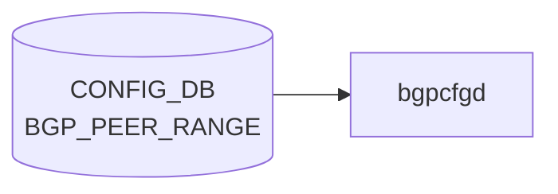

# BGP_PEER_RANGE テーブル

## 概要

`BGP_PEER_RANGE` テーブルは [BGP](../../reference/glossary.md#term-bgp) の dynamic neighbor 用 listen-range / peer-range を [CONFIG_DB](../../reference/glossary.md#term-config_db) に定義する[^1]。`bgpcfgd` テンプレが `bgpd` の `bgp listen range <prefix> peer-group <name>` 相当を生成するための入力。

定義は 2 list:

- `BGP_PEER_RANGE_LIST` (vrf_name, peer_range_name): [VRF](../../reference/glossary.md#term-vrf) または [VNET](../../reference/glossary.md#term-vnet) 別の peer range
- `BGP_PEER_RANGE_TEMPLATE_LIST` (peer_range_name): テンプレベース

<!-- cdb-mermaid -->
### データフロー (自動生成)



!!! note "凡例"
    CONFIG_DB から SAI までの典型経路を `docs/reference/config-db-orch-map.md` から機械生成したミニ図。詳細・例外は本ページ本文と対応表を参照。
<!-- /cdb-mermaid -->

## key 構造

```text
BGP_PEER_RANGE|<vrf_name>|<peer_range_name>      # generic
BGP_PEER_RANGE_TEMPLATE|<peer_range_name>        # template
```

| キー | 型 | 説明 |
|------|----|------|
| `vrf_name` | union (leafref to `VRF.name` または `VNET.name`) | 所属 [VRF](../../reference/glossary.md#term-vrf) または [VNET](../../reference/glossary.md#term-vnet) |
| `peer_range_name` | string | peer range の一意名 |

## フィールド

| フィールド | 型 | 説明 |
|-----------|----|------|
| `name` | string | 表示名。`must` で `peer_range_name` と一致を強制 |
| `src_address` | inet:ip-address | コネクションのソース IP |
| `peer_asn` | uint32 (1..4294967295) | 隣接 AS 番号 |
| `ip_range` | leaf-list `sonic-ip-prefix` (`ordered-by user`) | listen-range のプレフィックス集合 |

## 制約

- `vrf_name` は `VRF` か `VNET` のいずれかへの leafref（union）
- `name` は `peer_range_name` と完全一致必須
- `peer_asn` は AS4 範囲

## 購読者

- `bgpcfgd` (`docker-fpm-frr`)

## 関連 CONFIG_DB / YANG / CLI

- 関連 [CONFIG_DB](../../reference/glossary.md#term-config_db): `BGP_GLOBALS`、`VRF`、`VNET`、`BGP_PEER_GROUP`
- 関連 [YANG](../../reference/glossary.md#term-yang): `sonic-bgp-peerrange`、`sonic-vrf`、`sonic-vnet`
- 関連 CLI: `config bgp`

<!-- ref-triangle:start -->

## 関連リファレンス

- [YANG](../../reference/glossary.md#term-yang): [`sonic-bgp-peerrange`](../yang/sonic-bgp-peerrange.md)
- CLI: [`config bgp`](../cli/config-bgp.md)

<!-- ref-triangle:end -->

## 引用元

[^1]: [YANG](../../reference/glossary.md#term-yang) 定義: `sonic-bgp-peerrange.yang`. <https://github.com/sonic-net/sonic-buildimage/blob/9ea932ec2e18f35e58268ec2e4456b1d4afd65cd/src/sonic-yang-models/yang-models/sonic-bgp-peerrange.yang>

## 関連ページ
- [CONFIG_DB: BGP_NEIGHBOR](bgp-neighbor.md)
- [CONFIG_DB: BGP_PEER_GROUP](bgp-peer-group.md)

<!-- ops-hint -->
## 運用ヒント

### 典型値

- key 形式: `BGP_PEER_RANGE|<vrf>|<range-name>`。
- `ip_range`: CIDR、`peer_asn`: 対向 AS、`name`: 識別子。dynamic neighbor 用途。

### よくある誤設定

- `listen limit` を超えると新規 dynamic neighbor が拒否される。

### 確認コマンド

```bash
sonic-db-cli CONFIG_DB keys 'BGP_PEER_RANGE|*'
vtysh -c 'show bgp listen range'
```
<!-- /ops-hint -->

<!-- value-behavior -->
## 値依存挙動マトリクス

このテーブルには enum フィールドはない。

### `vrf_name` (key、VRF/VNET 分岐)

| 型 | 動作 |
|----|------|
| `VRF.name` への leafref | VRF コンテキストで `bgp listen range <prefix> peer-group <name>` を生成 |
| `VNET.name` への leafref | VNET 対応 VRF で同様のコマンドを生成 |

### `ip_range` (leaf-list)

- 複数プレフィックスを user-ordered で指定可能
- `dynamic/update.conf.j2` が各プレフィックスに対して `bgp listen range <prefix> peer-group <name>` を展開
- 削除時は既存 range との差分を計算して `no bgp listen range` を発行

<!-- /value-behavior -->

<!-- cdb-exceptions -->
## 例外条件・特殊挙動

| 条件 | 挙動 | ソース |
|------|------|--------|
| `deployment_id` が DEVICE_METADATA に未設定で `peer_asn` も未設定 | Jinja2 で `UndefinedError` / `KeyError` → `log_err` + `return True` (drop) | `dynamic/instance.conf.j2`, `managers_bgp.py` |
| `ip_range` が空または未設定 | `bgp listen range <empty>` が vtysh に送られ FRR エラー | `dynamic/instance.conf.j2` |
| `ip_range` 更新時の既存 range 取得失敗 | `LOG_ERR` して空リスト返却 → 全 range を新規追加として処理 | `managers_bgp.py` `get_existing_ip_ranges()` |
| `src_address` 未設定 | Loopback1 の IPv4 アドレスで補完。Loopback1 が未設定の場合 Jinja2 エラー → drop | `dynamic/instance.conf.j2` |
| FRR 10.1 以降: listen range 削除失敗後も peer-group 削除を続行 | range 削除の `log_err` 後、peer-group 削除を試みる → FRR 側エラーの可能性 | `managers_bgp.py` `del_handler()` |
<!-- /cdb-exceptions -->


<!-- runtime-trace -->
## 実コンテナ動作トレース

### 段階 1 — Consumer 登録

`bgpcfgd` が CONFIG_DB の `BGP_PEER_RANGE` テーブルを購読する。

`BGP_PEER_RANGE` は `<vrf>|<prefix>` の key 構造。dynamic neighbor 機能。

### 段階 2 — CFG→APPL 翻訳

なし (FRR vtysh 経由)

### 段階 3 — APPL→SAI

なし (FRR BGP dynamic peer 設定)

### 段階 4 — タイミングと副作用

**適用タイミング**: 変化検知後 FRR に `bgp listen range <prefix> peer-group <pg>` を発行。指定プレフィクスからの接続を dynamic に受け入れ開始。

**副作用**: 指定プレフィクス内からの BGP 接続が自動的に対象 peer-group として処理される。既存の static ネイバーとは独立。
<!-- /runtime-trace -->

<!-- entry-points -->
## 書き込み入り口 (Direction A)

対象テーブル: `BGP_PEER_RANGE`

### CLI
- `config bgp peer-range add/del <prefix>`
  - ソース: `sonic-utilities/config/main.py (bgp グループ)`

### minigraph / sonic-cfggen
- あり: `sonic-cfggen -m <minigraph.xml>` 実行時に本テーブルが生成・上書きされる

### REST / gNMI (sonic-mgmt-common)
- なし (対応 OpenConfig/SONiC YANG transformer なし)

### db_migrator
- なし

### ビルド時デフォルト (init_cfg / j2 テンプレート)
- なし

### ハードコードデフォルト
- なし

### ランタイム注入 (デーモン自動書き込み)
- なし
<!-- /entry-points -->

<!-- glossary-links-injected: 9543a3643673 -->
