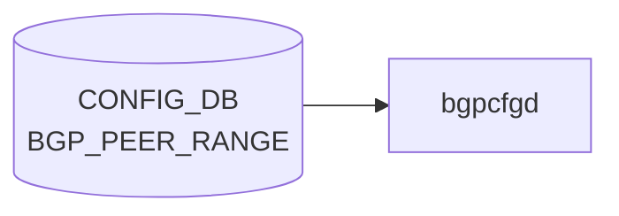

# BGP_PEER_RANGE テーブル

## 概要

`BGP_PEER_RANGE` テーブルは [BGP](../../reference/glossary.md#term-bgp) の dynamic neighbor 用 listen-range / peer-range を [CONFIG_DB](../../reference/glossary.md#term-config_db) に定義する[^1]。`bgpcfgd` テンプレが `bgpd` の `bgp listen range <prefix> peer-group <name>` 相当を生成するための入力。

定義は 2 list:

- `BGP_PEER_RANGE_LIST` (vrf_name, peer_range_name): [VRF](../../reference/glossary.md#term-vrf) または [VNET](../../reference/glossary.md#term-vnet) 別の peer range
- `BGP_PEER_RANGE_TEMPLATE_LIST` (peer_range_name): テンプレベース

<!-- cdb-mermaid -->
### データフロー (自動生成)



!!! note "凡例"
    CONFIG_DB から SAI までの典型経路を `docs/reference/config-db-orch-map.md` から機械生成したミニ図。詳細・例外は本ページ本文と対応表を参照。
<!-- /cdb-mermaid -->

## key 構造

```
BGP_PEER_RANGE|<vrf_name>|<peer_range_name>      # generic
BGP_PEER_RANGE_TEMPLATE|<peer_range_name>        # template
```

| キー | 型 | 説明 |
|------|----|------|
| `vrf_name` | union (leafref to `VRF.name` または `VNET.name`) | 所属 VRF または VNET |
| `peer_range_name` | string | peer range の一意名 |

## フィールド

| フィールド | 型 | 説明 |
|-----------|----|------|
| `name` | string | 表示名。`must` で `peer_range_name` と一致を強制 |
| `src_address` | inet:ip-address | コネクションのソース IP |
| `peer_asn` | uint32 (1..4294967295) | 隣接 AS 番号 |
| `ip_range` | leaf-list `sonic-ip-prefix` (`ordered-by user`) | listen-range のプレフィックス集合 |

## 制約

- `vrf_name` は `VRF` か `VNET` のいずれかへの leafref（union）
- `name` は `peer_range_name` と完全一致必須
- `peer_asn` は AS4 範囲

## 購読者

- `bgpcfgd` (`docker-fpm-frr`)

## 関連 CONFIG_DB / YANG / CLI

- 関連 CONFIG_DB: `BGP_GLOBALS`、`VRF`、`VNET`、`BGP_PEER_GROUP`
- 関連 [YANG](../../reference/glossary.md#term-yang): `sonic-bgp-peerrange`、`sonic-vrf`、`sonic-vnet`
- 関連 CLI: `config bgp`

<!-- ref-triangle:start -->

## 関連リファレンス

- YANG: [`sonic-bgp-peerrange`](../yang/sonic-bgp-peerrange.md)
- CLI: [`config bgp`](../cli/config-bgp.md)

<!-- ref-triangle:end -->

## 引用元

[^1]: YANG 定義: `sonic-bgp-peerrange.yang`. <https://github.com/sonic-net/sonic-buildimage/blob/9ea932ec2e18f35e58268ec2e4456b1d4afd65cd/src/sonic-yang-models/yang-models/sonic-bgp-peerrange.yang>

## 関連ページ
- [CONFIG_DB: BGP_NEIGHBOR](bgp-neighbor.md)
- [CONFIG_DB: BGP_PEER_GROUP](bgp-peer-group.md)

<!-- ops-hint -->
## 運用ヒント

### 典型値

- key 形式: `BGP_PEER_RANGE|<vrf>|<range-name>`。
- `ip_range`: CIDR、`peer_asn`: 対向 AS、`name`: 識別子。dynamic neighbor 用途。

### よくある誤設定

- `listen limit` を超えると新規 dynamic neighbor が拒否される。

### 確認コマンド

```bash
sonic-db-cli CONFIG_DB keys 'BGP_PEER_RANGE|*'
vtysh -c 'show bgp listen range'
```
<!-- /ops-hint -->

<!-- glossary-links-injected: 0b428f8adcd6 -->
