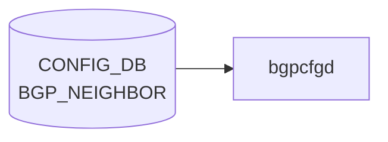

# STATE_DB BGP 状態テーブル

## 概要

[STATE_DB](../../reference/glossary.md#term-state_db) には [BGP](../../reference/glossary.md#term-bgp) 隣接状態を保持する 2 つのテーブルが存在する。

| テーブル名 | 書き込みデーモン | 主な利用者 |
|-----------|----------------|-----------|
| `NEIGH_STATE_TABLE` | `bgpmon` (bgp コンテナ内) | [SNMP](../../reference/glossary.md#term-snmp) (CiscoBgp4MIB), テレメトリ |
| `BGP_PEER_CONFIGURED_TABLE` | `bgpcfgd` の `BGPPeerMgrBase` | SDN コントローラ |

`NEIGH_STATE_TABLE` は [BGP](../../reference/glossary.md#term-bgp) セッションのライブ状態 ([FRR](../../reference/glossary.md#term-frr) `show bgp summary json` の出力) を表し、`BGP_PEER_CONFIGURED_TABLE` は [bgpcfgd](../../reference/glossary.md#term-bgpcfgd) が [CONFIG_DB](../../reference/glossary.md#term-config_db) のネイバー設定を [FRR](../../reference/glossary.md#term-frr) に投入済みであることを示す確認テーブルである。

<!-- cdb-mermaid -->
### データフロー (自動生成)



!!! note "凡例"
    CONFIG_DB から SAI までの典型経路を `docs/reference/config-db-orch-map.md` から機械生成したミニ図。詳細・例外は本ページ本文と対応表を参照。
<!-- /cdb-mermaid -->

## テーブル 1: NEIGH_STATE_TABLE

### key 構造

```text
NEIGH_STATE_TABLE|<neighbor_ip>
```

- `<neighbor_ip>`: [BGP](../../reference/glossary.md#term-bgp) ネイバーの IP アドレス (IPv4 / IPv6)

bgpmon 起動時に `NEIGH_STATE_TABLE|*` のエントリがすべて削除され (bgpmon.py L51)、その後スキャン結果で再構築される。

### フィールド

| フィールド | 型 | 値域 / 説明 |
|-----------|----|------------|
| `state` | enum string | [FRR](../../reference/glossary.md#term-frr) のセッション状態文字列 |
| `peerType` | enum string | `"i-BGP"` または `"e-BGP"` |

`state` の値域 (snmp_ciscobgp4mib.md / bgp4.py の STATE_CODE 定義より):

| `state` 値 | [SNMP](../../reference/glossary.md#term-snmp) 整数値 | 意味 |
|-----------|-----------|------|
| `"Idle"` または `"Idle (Admin)"` | 1 | セッション停止中 |
| `"Connect"` | 2 | TCP 接続試行中 |
| `"Active"` | 3 | TCP 接続待機中 |
| `"OpenSent"` | 4 | OPEN メッセージ送信済み |
| `"OpenConfirm"` | 5 | OPEN 確認待ち |
| `"Established"` | 6 | セッション確立済み |
| `"Clearing"` | — | セッション解除中 (FRR 独自状態) |

`peerType` は `remoteAs == localAs` のとき `"i-BGP"`、それ以外のとき `"e-BGP"` と判定される (bgpmon.py L163, L171)。

### 書き込みタイミング

`bgpmon` は 15 秒ごとに `/var/log/frr/frr.log` のタイムスタンプを確認し、変化があった場合のみ `vtysh -c 'show bgp summary json'` を実行する (bgpmon.py L59-68, L203-206)。

1. **新ネイバー検出時**: `state` + `peerType` を HSET
2. **状態変化時**: `state` + `peerType` を HSET (変化がない場合はスキップ)
3. **ネイバー消失時**: エントリを DEL
4. **bgpmon 起動時**: 全エントリを一括削除して再スキャン

[Redis](../../reference/glossary.md#term-redis) Pipeline (`PIPE_BATCH_MAX_COUNT = 50`) でバッチ更新される (bgpmon.py L35)。

### 購読者

- **[SNMP](../../reference/glossary.md#term-snmp) サブエージェント** (`sonic-snmpagent/src/sonic_ax_impl/mibs/vendor/cisco/bgp4.py`): `NEIGH_STATE_TABLE|*` を読み取り CiscoBgp4MIB (cbgpPeer2State, OID `.1.3.6.1.4.1.9.9.187.1.2.5.1.3`) に変換。マルチ [ASIC](../../reference/glossary.md#term-asic) 構成では各 namespace の [STATE_DB](../../reference/glossary.md#term-state_db) から収集。
- テレメトリ / 将来拡張 (snmp_ciscobgp4mib.md L33)

---

## テーブル 2: BGP_PEER_CONFIGURED_TABLE

### key 構造

```text
BGP_PEER_CONFIGURED_TABLE|<key>
```

- 静的ピア: `<key>` = [VRF](../../reference/glossary.md#term-vrf) が `"default"` の場合はネイバー IP、それ以外は `<vrf>|<neighbor_ip>`
- 動的ピア (BGP listen range): `<key>` = `<vrf/vnet-name>|<peer-name>`

### フィールド

フィールドは [CONFIG_DB](../../reference/glossary.md#term-config_db) のネイバー設定 (`BGP_NEIGHBOR` または `BGP_PEER_RANGE`) のキー・バリューペアをそのまま転写する。固定フィールド定義はなく、[CONFIG_DB](../../reference/glossary.md#term-config_db) の内容に依存する。

動的ピアの代表的フィールド (Bgpcfgd-dyn-peer-modification-support.md §2.2):

| フィールド | 型 | 説明 |
|-----------|----|------|
| `ip_range` | list | listen range (IP プレフィックスのカンマ区切り) |
| `name` | string | ピア名 |
| `peer_asn` | uint string | ピアの ASN (オプション) |
| `src_address` | IP string | セッション発端 IP (オプション) |

### 書き込みタイミング

`bgpcfgd` (`BGPPeerMgrBase.update_state_db`) が FRR に設定を投入した後に書き込む (managers_bgp.py L284-303):

1. **SET (ネイバー追加/管理状態変更)**: `state_peer_table.set(key, list(sorted(data.items())))`
2. **DEL (ネイバー削除)**: `state_peer_table.delete(key)`
3. **`config reload` 時**: `sonic-utilities/config/main.py` が `BGP_PEER_CONFIGURED_TABLE|*` を全削除 (config/main.py L1613)

### 利用者

SDN コントローラが CONFIG_DB への設定投入後、このテーブルのエントリ存在を確認することで [bgpcfgd](../../reference/glossary.md#term-bgpcfgd) による FRR 設定完了を検知する (Bgpcfgd-dyn-peer-modification-support.md §1.1)。

---

## `show bgp` コマンドとの対応

`NEIGH_STATE_TABLE` の `state` は `show bgp summary` が表示する `State/PfxRcd` 列の状態と対応する。ただし bgpmon のポーリング間隔は 15 秒であるため、リアルタイムの FRR 状態とは最大 15 秒の遅延が生じる。

<!-- cross-refs -->
## 暗黙参照 — `BGPPeerMgrBase` が読み出す関連テーブルと FRR 状態 (Phase C)

`bgpcfgd` の `BGPPeerMgrBase` は CONFIG_DB 上の複数 BGP テーブルを購読し、FRR bgpd へ設定を投入した後に `BGP_PEER_CONFIGURED_TABLE` を更新する。テーブルへの書き込みはこれら暗黙参照が揃って初めて成立する。

### CONFIG_DB 購読テーブル (転写元)

`main.py` L87-91 で `BGPPeerMgrBase` は以下のテーブルを購読し、SET / DEL イベントを `BGP_PEER_CONFIGURED_TABLE` へ転写する。

| CONFIG_DB テーブル | peer_type | `BGP_PEER_CONFIGURED_TABLE` への影響 | evidence |
|---|---|---|---|
| `BGP_NEIGHBOR` | `"general"` (外部 eBGP) | SET → エントリ追加、DEL → エントリ削除 | main.py:87, managers_bgp.py:239 |
| `BGP_INTERNAL_NEIGHBOR` | `"internal"` (iBGP) | SET → エントリ追加、DEL → エントリ削除 | main.py:88 |
| `BGP_MONITORS` | `"monitors"` | SET → エントリ追加、DEL → エントリ削除 | main.py:89 |
| `BGP_PEER_RANGE` | `"dynamic"` (listen range) | SET → エントリ追加 (`ip_range` フィールド含む) | main.py:90 |
| `BGP_VOQ_CHASSIS_NEIGHBOR` | `"voq_chassis"` | SET → エントリ追加 ([VOQ](../../reference/glossary.md#term-voq) シャーシ間 iBGP) | main.py:91 |
| `BGP_SENTINELS` | `"sentinels"` | SET → エントリ追加 | main.py:91 |

> テーブルごとに独立した `BGPPeerMgrBase` インスタンスが動作するため、`BGP_PEER_CONFIGURED_TABLE` には複数テーブル由来のエントリが混在する。フィールドセットはソーステーブルの内容そのままで固定スキーマはない (managers_bgp.py:289)。

### CONFIG_DB 前提依存テーブル (ピア追加のブロッカー)

`BGPPeerMgrBase.__init__` の `deps` リスト (managers_bgp.py:118-127) により、以下のテーブルが揃うまでピア追加・`update_state_db()` 呼び出しがブロックされる。

| テーブル | キー / フィールド | 用途 | evidence |
|---|---|---|---|
| [`DEVICE_METADATA`](device-metadata.md) | `localhost/bgp_asn` | `router bgp <ASN>` コマンド生成 | managers_bgp.py:119,192 |
| [`DEVICE_METADATA`](device-metadata.md) | `localhost/type` | デバイスロール判定 (spine / leaf 等) | managers_bgp.py:120 |
| `LOOPBACK_INTERFACE` | `Loopback0` | ルータ ID の IPv4 アドレスを取得 | managers_bgp.py:121,186 |
| `BGP_DEVICE_GLOBAL` | `tsa_enabled` / `idf_isolation_state` | TSA / IDF isolation ルートマップ適用判定 | managers_bgp.py:122-123 |
| `DEVICE_NEIGHBOR_METADATA` | — | `use_neighbors_meta = true` のとき、ネイバーのメタ情報検証 | managers_bgp.py:140,220 |

### FRR bgpd 状態の暗黙読み出し

`BGP_PEER_CONFIGURED_TABLE` への書き込みは FRR への設定投入が成功した **後** に行われる (managers_bgp.py:239,353,444)。

| 参照先 | 呼び出し箇所 | 用途 |
|---|---|---|
| `vtysh -c 'show bgp vrfs json'` | `load_peers()` — managers_bgp.py:577 | 起動時に FRR 登録済みピアセットを取得し `self.peers` を初期化 |
| `vtysh -c 'show bgp vrf <vrf> neighbors json'` | `load_peers()` — managers_bgp.py:587 | [VRF](../../reference/glossary.md#term-vrf) ごとのネイバー一覧を初期ロード |
| `vtysh -c 'show bgp peer-group <name> json'` | `get_existing_ip_ranges()` — managers_bgp.py:398 | 動的ピアの ip_range 更新時に既存 range を取得 |
| `cfg_mgr.push(cmd)` (FRR 設定書き込み) | `apply_op()` — managers_bgp.py:507 | FRR に `neighbor` コマンド投入。**投入後** に `update_state_db()` を呼び出す |

> FRR bgpd が応答不能の場合、`cfg_mgr.push()` は内部キューに留まり、`update_state_db()` も呼ばれない。結果として `BGP_PEER_CONFIGURED_TABLE` への反映が遅延・欠落する可能性がある。

### NEIGH_STATE_TABLE との非同期関係

`BGP_PEER_CONFIGURED_TABLE` が設定完了を示した後、実際の BGP セッション確立状態は `bgpmon` の次回ポーリング (最大 15 秒後) まで `NEIGH_STATE_TABLE` に反映されない。2 テーブル間に常時非同期ウィンドウが存在する。

### 範囲外

- **[ASIC_DB](../../reference/glossary.md#term-asic_db) BGP セッション state**: [bgpcfgd](../../reference/glossary.md#term-bgpcfgd) / bgpmon は [ASIC_DB](../../reference/glossary.md#term-asic_db) を参照しない。[ASIC_DB](../../reference/glossary.md#term-asic_db) への BGP 関連書き込みは `routeorch` (SWSS) が担当し、本テーブル群とは独立した経路。
- **`BGP_PEER_GROUP`** (CONFIG_DB): 独立テーブルとして存在しない。peer-group 設定は `BGP_NEIGHBOR` 等の内容から Jinja2 テンプレートで生成され、FRR に直接投入される。

詳細スキャン手順と grep 結果は `meta/_intermediate/cdb-flow/bgp-state-cross-refs.md` を参照。
<!-- /cross-refs -->

<!-- side-effects -->
## 副次 DB 書込 (Phase F)

`bgpmon` および `bgpcfgd BGPPeerMgrBase` が `NEIGH_STATE_TABLE` / `BGP_PEER_CONFIGURED_TABLE` へ書き込む際、[STATE_DB](../../reference/glossary.md#term-state_db) 以外の副次 DB への波及は**存在しない**。

| 副次 DB | 書込有無 | 根拠 |
|---|---|---|
| [APPL_DB](../../reference/glossary.md#term-appl_db) | なし | `bgpmon.py` / `managers_bgp.py` に `APPL_DB` への接続・書込呼出が 0 件 |
| [COUNTERS_DB](../../reference/glossary.md#term-counters_db) | なし | 両ファイルに `COUNTERS_DB` 参照が 0 件。BGP セッション統計は FRR / `show bgp summary` で直接取得するため STATE_DB 内に統計テーブルは存在しない |
| ASIC_DB / [FLEX_COUNTER_DB](../../reference/glossary.md#term-flex_counter_db) | なし | BGP 経路情報の [SAI](../../reference/glossary.md#term-sai) 投入は `fpmsyncd` → `routeorch` の別経路であり `bgpmon` / `bgpcfgd` は [SAI](../../reference/glossary.md#term-sai) に直接アクセスしない |
| EVENTS_DB | なし | 両ファイルに `EVENTS_DB` / `publish` / `notify` 参照が 0 件 |
| CHASSIS_APP_DB | なし | マルチシャーシ向け参照なし |

`NEIGH_STATE_TABLE` の下流購読者は SNMP サブエージェント (`sonic-snmpagent/src/sonic_ax_impl/mibs/vendor/cisco/bgp4.py`) のみであり、同エージェントはテーブルを **読み取るだけ** で他 DB への書き込みは行わない。`BGP_PEER_CONFIGURED_TABLE` の下流は SDN コントローラ（外部プロセス）であり STATE_DB 側から能動的に他 DB へ書き込む経路は存在しない。

詳細スキャン手順と grep 結果は `meta/_intermediate/cdb-flow/bgp-state-side.md` を参照。
<!-- /side-effects -->

<!-- constants -->
## ハードコード定数 (Phase E)

### テーブル名定数 (schema.h)

| C マクロ名 | 文字列値 | ソース |
|-----------|---------|--------|
| `STATE_BGP_PEER_CONFIGURED_TABLE_NAME` | `"BGP_PEER_CONFIGURED_TABLE"` | `sonic-swss-common/common/schema.h:511` |
| `STATE_BGP_TABLE_NAME` | `"BGP_STATE_TABLE"` | `sonic-swss-common/common/schema.h:437` |

`BGP_PEER_CONFIGURED_TABLE_NAME` は `managers_bgp.py:287` で `swsscommon.STATE_BGP_PEER_CONFIGURED_TABLE_NAME` として参照される。`NEIGH_STATE_TABLE` はソースコード中に文字列リテラルとしてハードコードされており、対応する schema.h マクロは存在しない（`bgpmon.py:51,157,179` の文字列リテラル `"NEIGH_STATE_TABLE|*"` が実体）。

### state フィールド文字列定数 (bgpmon.py)

`NEIGH_STATE_TABLE` の `state` フィールド値は FRR `show bgp summary json` の `state` キーをそのまま転写する。bgpmon.py に直接定義はなく、FRR が出力する文字列に依存する。SNMP サブエージェント (`bgp4.py`) は以下の文字列を定数的に扱う:

| `state` 文字列値 | 意味 | 備考 |
|----------------|------|------|
| `"Idle"` または `"Idle (Admin)"` | セッション停止中 | SNMP 整数値 1 |
| `"Connect"` | TCP 接続試行中 | SNMP 整数値 2 |
| `"Active"` | TCP 接続待機中 | SNMP 整数値 3 |
| `"OpenSent"` | OPEN メッセージ送信済み | SNMP 整数値 4 |
| `"OpenConfirm"` | OPEN 確認待ち | SNMP 整数値 5 |
| `"Established"` | セッション確立済み | SNMP 整数値 6 |
| `"Clearing"` | セッション解除中 (FRR 独自) | SNMP 対応なし |

### peerType フィールド文字列定数 (bgpmon.py)

| フィールド値 | 判定条件 | ソース |
|------------|---------|--------|
| `"i-BGP"` | `remoteAs == localAs` | `bgpmon.py:163,171` |
| `"e-BGP"` | `remoteAs != localAs` | `bgpmon.py:163,171` |

### 操作種別文字列定数 (managers_bgp.py)

`BGPPeerMgrBase.update_state_db` の `op` 引数として使用されるリテラル:

| 文字列値 | 用途 | ソース |
|---------|------|--------|
| `"SET"` | ネイバー追加 / 管理状態変更時に STATE_DB へ書き込む | `managers_bgp.py:239,288,353,443` |
| `"DEL"` | ネイバー削除時に STATE_DB からエントリを消す | `managers_bgp.py:487,291` |

[VRF](../../reference/glossary.md#term-vrf) が `"default"` の場合は key = `nbr`、それ以外は `vrf + "|" + nbr` とするロジックも文字列リテラル `"default"` としてハードコードされている (`managers_bgp.py:280`)。

### ポーリング・バッチ定数 (bgpmon.py)

| 定数名 / 用途 | 値 | ソース |
|-------------|----|----|
| `PIPE_BATCH_MAX_COUNT` — [Redis](../../reference/glossary.md#term-redis) パイプラインのバッチ上限 | **50** | `bgpmon.py:35` |
| ポーリング sleep — bgpmon メインループの待機間隔 | **15** 秒 (`time.sleep(15)`) | `bgpmon.py:203` |
| FRR ログ確認待機 — FRR 変化なし時の sleep | **1** 秒 (`time.sleep(1)`) | `bgpmon.py:109,115` |

### ハードコードされたパス・コマンド文字列 (bgpmon.py)

| 文字列値 | 用途 | ソース |
|---------|------|--------|
| `"/var/log/frr/frr.log"` | FRR ログファイルのタイムスタンプ監視 | `bgpmon.py:61` |
| `"show bgp summary json"` | [vtysh](../../reference/glossary.md#term-vtysh) 経由で BGP ネイバー状態を取得するコマンド | `bgpmon.py:80` |
<!-- /constants -->

<!-- failure -->
## 失敗挙動 (Phase D — BGPPeerMgrBase)

`bgpcfgd` の `BGPPeerMgrBase` が `BGP_PEER_CONFIGURED_TABLE` を書き込む際の失敗・retry 分岐を示す[^6]。

### FRR push 結果は非同期 — `apply_op` は常に `True` を返す

`BGPPeerMgrBase.apply_op()` (L494–508) は `cfg_mgr.push(cmd)` でコマンドをキューに入れるだけで、FRR 側の実行結果を確認しない。返値は**常に `True`**。FRR がコマンドを拒否してもハンドラは成功扱いとなり、`BGP_PEER_CONFIGURED_TABLE` への書き込みが行われる。エラーは FRR ログにのみ現れ、**retry なし**。

### `add_peer` — テンプレートレンダリング失敗 → STATE_DB 未書き込み

`add_peer()` でのレンダリング例外 (L229–234) は早期 `return True` を起こし、`apply_op`・`self.peers.add(key)`・`update_state_db` のすべてがスキップされる。**`BGP_PEER_CONFIGURED_TABLE` への書き込みなし**。subscriber が entry を erase するため **retry なし**。テンプレートが `None` を返す場合も同様のスキップが発生する (L235)。

### `add_peer` — `update_state_db` 例外 → FRR 投入済みだが STATE_DB 未書き込み

`add_peer()` は `self.peers.add(key)` の後に `update_state_db()` を呼ぶが、その戻り値を確認しない。STATE_DB への接続・書き込みが例外を投げた場合 (L302–304)、FRR には設定が投入済みで `self.peers` にも登録済みなのに **`BGP_PEER_CONFIGURED_TABLE` への書き込みなし**。コントローラは設定完了を検知できない。**retry なし**（次回 SET は `update_peer` ルートに入る）。

### `del_handler` — peer 未登録時は STATE_DB エントリを削除しない

`del_handler()` は `self.peers` に key が存在しない場合に早期 return する (L453–455)。過去に `update_state_db("SET")` が成功していた場合でも **`BGP_PEER_CONFIGURED_TABLE` のエントリが残存**し、CONFIG_DB から DELETE 済みなのにコントローラが「設定済み」と誤認し続けるリスクがある。**retry なし**。

### DEL 処理の順序乖離 — `update_state_db` 例外時に peers 残存

`del_handler()` の成功パスでは `apply_op` → `update_state_db("DEL")` → `peers.remove()` の順で処理される。`update_state_db` が例外を投げた場合 `peers.remove()` に到達せず peer が `self.peers` に残存し、次の DEL イベントで同じ `no neighbor` コマンドが再び FRR に送られる（二重削除コマンドリスク）。STATE_DB 側には DEL 時に存在チェックがあり (L292–297)、エントリ不在の場合は警告ログのみでスキップする。

### 失敗パスまとめ

| トリガー | FRR 投入 | `BGP_PEER_CONFIGURED_TABLE` | retry |
|---------|---------|----------------------------|-------|
| FRR push 非同期失敗 | 不明（非同期） | 書き込みあり（乖離） | なし |
| テンプレートレンダリング例外 (add) | なし | 書き込みなし | なし |
| テンプレート戻り値 None (add) | なし | 書き込みなし | なし |
| STATE_DB 書き込み例外 (add) | あり | 書き込みなし | なし |
| del 時 peers 未登録 | なし | 削除されず残存 | なし |
| del 時 `update_state_db` 例外 | 投入済み | 削除されず（二重削除リスク） | なし |

デーモン再起動時に `load_peers()` が FRR 現状を読み直すことが唯一の reconciliation 手段。
<!-- /failure -->

<!-- defaults -->
## フィールド暗黙デフォルト (Phase A — コード由来)

STATE_DB `NEIGH_STATE_TABLE` および `BGP_PEER_CONFIGURED_TABLE` には対応する [YANG](../../reference/glossary.md#term-yang) schema が存在しない。値はすべてコードレベルで決定される。

### NEIGH_STATE_TABLE

| フィールド | STATE_DB 初期値 | コード由来 | 備考 |
|-----------|---------------|----------|------|
| `state` | FRR 由来の文字列 (初期書き込み時点の FRR 状態) | `peer_dict["peers"][peer]["state"]` — bgpmon.py L74 | 固定デフォルトなし。FRR `show bgp summary json` の `state` フィールドをそのまま転写 |
| `peerType` | `"i-BGP"` または `"e-BGP"` | `"i-BGP" if remoteAs == localAs else "e-BGP"` — bgpmon.py L163, L171 | エントリ作成時に決定。bgpmon 15 秒ポーリングで再評価 |

### BGP_PEER_CONFIGURED_TABLE

| フィールド | STATE_DB 初期値 | コード由来 | 備考 |
|-----------|---------------|----------|------|
| (全フィールド) | CONFIG_DB から転写 | `data.items()` — managers_bgp.py L289 | `sorted()` でソート済みのキー・バリューペアをそのまま set |

### 補足

- `NEIGH_STATE_TABLE` はエントリ作成後も `state` / `peerType` 両フィールドが更新される (bgpmon.py L164)。状態が変化しない場合は STATE_DB への書き込みをスキップする (bgpmon.py L159-160)。
- `NEIGH_STATE_TABLE` にエントリが存在しない間 (bgpmon 起動直後、または全ネイバー消失時)、SNMP は該当 MIB オブジェクトを返さない。
- `BGP_PEER_CONFIGURED_TABLE` のフィールドセットは CONFIG_DB `BGP_NEIGHBOR` と `BGP_PEER_RANGE` で異なる。静的ピアには `ip_range` は存在しない。
- bgpmon 起動時 (`__init__`) に `NEIGH_STATE_TABLE|*` を全削除してから再スキャンするため、コンテナ再起動直後は最大 15 秒間エントリが存在しない場合がある。
<!-- /defaults -->

<!-- ordering -->
## 書込み順依存 (Phase B — BGP_PEER_CONFIGURED_TABLE)

STATE_DB `BGP_PEER_CONFIGURED_TABLE` への書き込みは `BGPPeerMgrBase.update_state_db()` が担い、**FRR への設定 push が完了した直後にのみ**実行される。これはテーブルを「FRR 設定投入完了」の確認フラグとして利用する SDN コントローラ向けの設計上の制約である。

### SET: FRR push 成功後にのみ STATE_DB へ書き込む

`add_peer()` では FRR コマンドを `apply_op`（= `cfg_mgr.push`）で送信した直後に `update_state_db(..., "SET")` を呼ぶ。テンプレートのレンダリングエラー (`jinja2.TemplateError`) が発生した場合は `return True` するが `update_state_db` は呼ばれず、STATE_DB には書き込まれない（FRR も未設定のまま）。<!-- evidence: managers_bgp.py:229-239 -->

### admin_status 変更: FRR push 成功確認後に SET

`apply_admin_status()` は `apply_op` の戻り値 (`ret_code`) が `True` のときのみ `update_state_db(..., "SET")` を実行する。`apply_op` は内部で `cfg_mgr.push` を呼び常に `True` を返すため、push が例外なく完了した場合に STATE_DB が更新される。<!-- evidence: managers_bgp.py:341-356 -->

### DEL: FRR push 成功後に STATE_DB からエントリを削除

`del_handler()` は `no neighbor <addr>` を FRR に push し（`apply_op`）、`ret_code=True` を確認してから `update_state_db(..., "DEL")` を呼ぶ。DEL 側の `update_state_db` は `state_peer_table.get(key)` で存在確認してから `delete(key)` を呼ぶため、既に不在の場合は `log_warn` のみで実際には何もしない。<!-- evidence: managers_bgp.py:485-488, 292-295 -->

### DEL 前の listen range 除去（dynamic ピアのみ）

`peer_type` が `dynamic` または `sentinels` の場合、`del_handler` は FRR 10.1 以降の要件として `no bgp listen range ...` を先に発行し、その後で `no neighbor`（ピアグループ削除）を発行する。STATE_DB への DEL はピアグループ削除の後になる。<!-- evidence: managers_bgp.py:461-472 -->

### config reload 時の一時的全削除

`config reload` 処理（`sonic-utilities/config/main.py:1613`）は `BGP_PEER_CONFIGURED_TABLE|*` を全削除する。bgpcfgd 再起動後に CONFIG_DB を replay して各ネイバーを FRR に再投入し、成功後に各エントリを SET する。reload 中（数秒〜数十秒）はエントリが存在しない状態になる。<!-- evidence: config/main.py:1613 -->

### NEIGH_STATE_TABLE との関係

`NEIGH_STATE_TABLE`（書き込み元: bgpmon）と `BGP_PEER_CONFIGURED_TABLE`（書き込み元: bgpcfgd）は独立したデーモンが管理するため、両テーブル間の書込み順序依存はない。bgpmon は起動時に `NEIGH_STATE_TABLE|*` を全削除してから再スキャンするが、これは `BGP_PEER_CONFIGURED_TABLE` に影響しない。<!-- evidence: bgpmon.py:51 -->

### 書込み順依存サマリ

| # | 依存関係 | 対象操作 | 違反時の挙動 |
|---|----------|---------|------------|
| 1 | FRR push（ネイバー追加） → STATE_DB SET | add_peer / SET handler | テンプレートエラー時は STATE_DB 未書込（FRR も未設定） |
| 2 | FRR push（admin_status 変更） → STATE_DB SET | change_admin_status | apply_op 例外時は STATE_DB 未更新 |
| 3 | FRR `no neighbor` → STATE_DB DEL | del_handler / DEL handler | FRR 除去前に SDN 参照するとエントリがまだ存在 |
| 4 | FRR `no listen range` → FRR `no neighbor` → STATE_DB DEL | del_handler (dynamic のみ) | listen range 除去なしに削除すると FRR 10.1 以降はエラー |
| 5 | config reload → 全削除 → bgpcfgd 再投入 | config reload | reload 中は SDN 向けにエントリが存在しない |

> 中間調査詳細: `meta/_intermediate/cdb-flow/bgp-state-ordering.md`
<!-- /ordering -->

<!-- platform -->
## プラットフォーム差分 (Phase H — コード由来)

`BGP_PEER_CONFIGURED_TABLE` を書き込む `BGPPeerMgrBase.update_state_db()`（managers_bgp.py L271–304）
および `NEIGH_STATE_TABLE` を書き込む `bgpmon.py` には、`switch_type`・`sub_role`・
`DEVICE_METADATA.localhost.type` による分岐が**一切存在しない**。

両テーブルのスキーマ・フィールドはすべてのプラットフォームで同一である。

### 根拠

| 検索対象 | 結果 |
|---------|------|
| `switch_type` in managers_bgp.py | 0 件（分岐なし） |
| `sub_role` in managers_bgp.py | 0 件（分岐なし） |
| `is_chassis()` in managers_bgp.py | 0 件（分岐なし） |
| `localhost/type` | deps 依存ガード登録のみ、値参照なし（L120） |
| bgpmon.py の platform 分岐 | 0 件（分岐なし） |

`localhost/type` は `BGPPeerMgrBase.__init__` の deps リスト（L120）に登録されているが、
これは swsscommon の依存性ガード（キーが CONFIG_DB に存在するまで handler 呼び出しをブロック）
として利用されているだけであり、値による動作の切り替えには使われていない。

### マルチ ASIC 構成での動作（テーブル内容に変化なし）

マルチ [ASIC](../../reference/glossary.md#term-asic) 構成では、bgpmon および bgpcfgd は各 [ASIC](../../reference/glossary.md#term-asic) コンテナ内で独立して動作し、
それぞれの namespace 内 STATE_DB に書き込む。テーブルのスキーマ・フィールドに変化はない。

**SNMP 読み取り側**（`sonic-snmpagent/src/sonic_ax_impl/mibs/vendor/cisco/bgp4.py` L22, L29–30）
のみマルチ ASIC 対応が存在する。`Namespace.init_namespace_dbs()` で全 namespace（asic0, asic1, …）
の STATE_DB 接続リストを生成し、`dbs_keys_namespace()` で全 namespace の
`NEIGH_STATE_TABLE|*` を横断収集して CiscoBgp4MIB を組み立てる。
これは読み取り側の集約動作であり、テーブル自体のスキーマには影響しない。

### 備考: BGP_VOQ_CHASSIS_NEIGHBOR / BGP_INTERNAL_NEIGHBOR との関係

プラットフォーム固有の BGP セッションは `BGP_NEIGHBOR` ではなく
`BGP_VOQ_CHASSIS_NEIGHBOR`（VoQ シャーシ）または `BGP_INTERNAL_NEIGHBOR`（マルチ ASIC / chassis-packet）
テーブルに書き込まれる（minigraph.py によるテーブル振り分け）。
これらのセッションが bgpcfgd で処理される際も、`BGP_PEER_CONFIGURED_TABLE` への
書き込みロジック（`update_state_db`）は同一コードが使用される。
<!-- /platform -->

<!-- pubsub -->
## 通信メカニズム (Phase G)

### BGP_PEER_CONFIGURED_TABLE — 書き込みのみ / 購読者なし

`bgpcfgd` の `BGPPeerMgrBase.update_state_db()` (managers_bgp.py L271-303) が `swsscommon.Table` 経由で直接 STATE_DB へ HSET / DEL を発行する。`swsscommon.Table` は **[ProducerStateTable](../../reference/glossary.md#term-producerstatetable) ではない** ため、専用通知チャンネルへの PUBLISH は行わない。

```
bgpcfgd (BGPPeerMgrBase.update_state_db)
  → swsscommon.Table.set() / delete()
    → Redis HSET / DEL (STATE_DB DB=6)
      → BGP_PEER_CONFIGURED_TABLE|<key>
```

keyspace notification (`__keyspace@6__:BGP_PEER_CONFIGURED_TABLE|*`) は STATE_DB では通常無効であり、アクティブに購読するデーモンは **存在しない**。

#### 根拠

- `managers_bgp.py` 内に `subscribe`・`psubscribe`・`keyspace`・`notify` を含む記述はゼロ件
- [HLD](../../reference/glossary.md#term-hld) (`Bgpcfgd-dyn-peer-modification-support.md §1.1`) が「SDN コントローラはポーリングで確認する」設計を明示

#### 消費パターン (ポーリング)

| 利用者 | アクセス方法 |
|--------|------------|
| SDN コントローラ | `EXISTS` / `HGETALL BGP_PEER_CONFIGURED_TABLE|<key>` のポーリング — bgpcfgd による FRR 設定投入完了を検知するため |
| `show` コマンド系 | `sonic-db-cli STATE_DB keys 'BGP_PEER_CONFIGURED_TABLE|*'` などによる手動確認 |

### NEIGH_STATE_TABLE — bgpmon ポーリング書き込み / SNMP 読み取り

`bgpmon` が 15 秒周期で FRR から取得した状態を `NEIGH_STATE_TABLE` へ書き込む。SNMP サブエージェントは `NEIGH_STATE_TABLE|*` を **ポーリング読み取り** して CiscoBgp4MIB に変換する。[Redis](../../reference/glossary.md#term-redis) Pub-Sub / keyspace notification は使用しない。

詳細は `meta/_intermediate/cdb-flow/bgp-state-pubsub.md` を参照。
<!-- /pubsub -->

## 引用元

[^6]: `sonic-buildimage/src/sonic-bgpcfgd/bgpcfgd/managers_bgp.py` (L229–243 add_peer テンプレート失敗分岐, L271–304 update_state_db 例外処理, L446–492 del_handler 失敗・順序乖離, L494–508 apply_op 常時 True). <https://github.com/sonic-net/sonic-buildimage/blob/master/src/sonic-bgpcfgd/bgpcfgd/managers_bgp.py>

## 確認コマンド

```bash
# NEIGH_STATE_TABLE の全エントリ確認
sonic-db-cli STATE_DB keys 'NEIGH_STATE_TABLE|*'
sonic-db-cli STATE_DB hgetall 'NEIGH_STATE_TABLE|10.0.0.1'

# BGP_PEER_CONFIGURED_TABLE の全エントリ確認
sonic-db-cli STATE_DB keys 'BGP_PEER_CONFIGURED_TABLE|*'
sonic-db-cli STATE_DB hgetall 'BGP_PEER_CONFIGURED_TABLE|10.0.0.1'

# FRR から直接 BGP ネイバー状態を取得 (bgpmon の参照元と同じコマンド)
vtysh -c 'show bgp summary json'
```

<!-- glossary-links-injected: 0a08a7be444a -->
