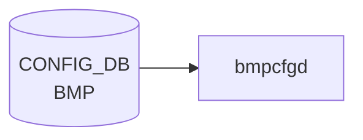

# BMP テーブル

## 概要

[BGP](../../reference/glossary.md#term-bgp) Monitoring Protocol (BMP, RFC 7854) の **テーブルダンプ機能のオンオフ**を設定するテーブル[^1]。
BMP collector への接続自体は `BGP_MONITORS` で定義し、`BMP` テーブルは「どのテーブルダンプ ([BGP](../../reference/glossary.md#term-bgp) neighbor / Adj-RIB-In / Adj-RIB-Out) を送るか」のフラグだけを持つ。

`openbmpd`（BMP collector 側）ではなく、[SONiC](../../reference/glossary.md#term-sonic) スイッチ側の BMP exporter を制御する想定。

<!-- cdb-mermaid -->
### データフロー (自動生成)



!!! note "凡例"
    CONFIG_DB から SAI までの典型経路を `docs/reference/config-db-orch-map.md` から機械生成したミニ図。詳細・例外は本ページ本文と対応表を参照。
<!-- /cdb-mermaid -->

## key 構造

```text
BMP|table
```

`table` シングルトン。

## フィールド

| フィールド | 型 | 既定 | 説明 |
|-----------|----|------|------|
| `bgp_neighbor_table` | boolean | `true`  | [BGP](../../reference/glossary.md#term-bgp) neighbor テーブルダンプを送る |
| `bgp_rib_in_table`   | boolean | `false` | Adj-RIB-In テーブルダンプを送る |
| `bgp_rib_out_table`  | boolean | `false` | Adj-RIB-Out テーブルダンプを送る |

## 購読者

- BMP exporter（`bmpcfgd` 系。BGP container 内のサイドカー）が [CONFIG_DB](../../reference/glossary.md#term-config_db) を購読し、[FRR](../../reference/glossary.md#term-frr) の BMP プラグインに反映

## 関連 CONFIG_DB / YANG / CLI

- 関連 [CONFIG_DB](../../reference/glossary.md#term-config_db): `BGP_MONITORS`（BMP collector 接続定義）
- 関連 [YANG](../../reference/glossary.md#term-yang): `sonic-bmp`

<!-- ref-triangle:start -->

## 関連リファレンス

- [YANG](../../reference/glossary.md#term-yang): [`sonic-bmp`](../yang/sonic-bmp.md)

<!-- ref-triangle:end -->

## 引用元

[^1]: [YANG](../../reference/glossary.md#term-yang) 定義: `sonic-bmp.yang`. <https://github.com/sonic-net/sonic-buildimage/blob/9ea932ec2e18f35e58268ec2e4456b1d4afd65cd/src/sonic-yang-models/yang-models/sonic-bmp.yang>

## 関連ページ
- [CONFIG_DB: BGP_MONITORS](bgp-monitors.md)

<!-- ops-hint -->
## 運用ヒント

### 典型値

- key 形式: `BMP|table`。
- `bgp_neighbor_table`: `true`、`bgp_rib_in_table`: `true`、`bgp_rib_out_table`: `false`（負荷軽減）。

### よくある誤設定

- rib_out まで `true` にすると BMP collector への帯域が想定以上に膨らむ。

### 確認コマンド

```bash
sonic-db-cli CONFIG_DB hgetall 'BMP|table'
show bmp
```
<!-- /ops-hint -->

<!-- value-behavior -->
## 値依存挙動マトリクス

このテーブルには enum フィールドはない。全フィールドは boolean。

### boolean フィールドの共通挙動 (`bmpcfgd.py`)

| フィールド | `true` | `false` |
|------------|--------|---------|
| `bgp_neighbor_table` | openbmpd が BGP_NEIGHBOR テーブルダンプを BMP_STATE_DB に書く | ダンプを送らない |
| `bgp_rib_in_table` | Adj-RIB-In テーブルダンプを送る | ダンプを送らない |
| `bgp_rib_out_table` | Adj-RIB-Out テーブルダンプを送る | ダンプを送らない |

> **副作用**: 任意のフィールドを変更すると `bmpcfgd` は常に `openbmpd` を stop → `BMP_STATE_DB` をクリア → start する。部分的な変更でも全テーブルが再構築される。

<!-- /value-behavior -->

<!-- cdb-exceptions -->
## 例外条件・特殊挙動

| 条件 | 挙動 | ソース |
|------|------|--------|
| 不明なフィールドが設定される | `common_config.get('bgp_neighbor_table', 'false')` 等のデフォルト補完で `false` 扱い。スキーマ外フィールドは silently ignored | `bmpcfgd.py` L41-43 |
| `"True"` / `"TRUE"` / `"1"` 等の値 | `is_true()` は `str(val).lower() == 'true'` のみ受理。`"true"` 小文字のみ有効 | `bmpcfgd.py` L28 |
| 設定変更ごとに openbmpd を再起動 | stop → BMP_STATE_DB クリア → start の順序。`supervisorctl` 失敗時は例外 catch なし → bmpcfgd クラッシュの可能性 | `bmpcfgd.py` L46-49 |
| [CONFIG_DB](../../reference/glossary.md#term-config_db) 接続不可 | `retry_on=True` で無限リトライ (CONFIG_DB 起動まで待機) | `bmpcfgd.py` L78 |
<!-- /cdb-exceptions -->


<!-- runtime-trace -->
## 実コンテナ動作トレース

### 段階 1 — Consumer 登録

`bmpcfgd` (`sonic-bgpcfgd` パッケージ内) が CONFIG_DB の `BMP` テーブルを購読する。

`BMP` テーブルは BMP target server を定義。`bgpcfgd` と協調して動作。

### 段階 2 — CFG→APPL 翻訳

なし ([FRR](../../reference/glossary.md#term-frr) [vtysh](../../reference/glossary.md#term-vtysh) 経由で BMP 設定)

### 段階 3 — APPL→SAI

なし (BMP は [FRR](../../reference/glossary.md#term-frr) の BGP モニタリングプロトコル、[SAI](../../reference/glossary.md#term-sai) 非経由)

### 段階 4 — タイミングと副作用

**適用タイミング**: CONFIG_DB の `BMP` エントリ変化を検知後、FRR に BMP target station 設定を注入。BMP セッション確立は非同期。

**副作用**: BMP サーバへの監視データ送信が開始/停止。FRR BGP 動作への影響なし。
<!-- /runtime-trace -->

<!-- entry-points -->
## 書き込み入り口 (Direction A)

対象テーブル: `BMP`

### CLI
- `config bmp enable/disable`
- `config bmp table enable/disable <table>`
  - ソース: `sonic-utilities/config/main.py (bmp グループ)`

### minigraph / sonic-cfggen
- なし

### REST / gNMI (sonic-mgmt-common)
- なし (対応 OpenConfig/[SONiC](../../reference/glossary.md#term-sonic) YANG transformer なし)

### db_migrator
- なし

### ビルド時デフォルト (init_cfg / j2 テンプレート)
- なし

### ハードコードデフォルト
- なし

### ランタイム注入 (デーモン自動書き込み)
- なし
<!-- /entry-points -->


<!-- derivation -->
## 派生・条件付き登録 (Phase 6/7)

### Phase 6: 値による他フィールド自動派生

| 条件 | 派生先 | evidence |
|---|---|---|
| 派生なし（BMP テーブルは CLI / config load のみで書き込む） | — | `sonic-buildimage/src/sonic-bmpcfgd/bmpcfgd/bmpcfgd.py` は読み取り専用 |

### Phase 7: 条件付き module/manager 登録

| 条件 | 登録 module | evidence |
|---|---|---|
| 常時（条件なし） | `bmpcfgd.BMPCfgDaemon` が `BMP` テーブルを購読 | `sonic-buildimage/src/sonic-bmpcfgd/bmpcfgd/bmpcfgd.py:82-86` |

### grep カバレッジ

- bmpcfgd.py 100 行全行読了、BMP テーブル購読: 1 件（条件なし）
<!-- /derivation -->
<!-- handler-branching -->
### Phase 8: Handler メソッド内分岐

| Manager / Handler | メソッド | 分岐条件 | 効果 | evidence |
|---|---|---|---|---|
| `BMPCfg` | `load()` | `bgp_neighbor_table == 'true'` | `self.bgp_neighbor_table = True`（openbmpd が BGP_NEIGHBOR State を BMP_STATE_DB に書き込む） | `sonic-buildimage/src/sonic-bmpcfgd/bmpcfgd/bmpcfgd.py:38` |
| `BMPCfg` | `load()` | `bgp_rib_in_table == 'true'` | `self.bgp_rib_in_table = True`（openbmpd が RIB_IN を BMP_STATE_DB に書き込む） | `sonic-buildimage/src/sonic-bmpcfgd/bmpcfgd/bmpcfgd.py:39` |
| `BMPCfg` | `load()` | `bgp_rib_out_table == 'true'` | `self.bgp_rib_out_table = True`（openbmpd が RIB_OUT を BMP_STATE_DB に書き込む） | `sonic-buildimage/src/sonic-bmpcfgd/bmpcfgd/bmpcfgd.py:40` |
| `BMPCfg` | `load()` | 設定変更時（常に） | `stop_bmp()` → `reset_bmp_table()` → `start_bmp()` の順で openbmpd を再起動し BMP_STATE_DB をクリア | `sonic-buildimage/src/sonic-bmpcfgd/bmpcfgd/bmpcfgd.py:44-46` |

> **スキャン証跡**: `BMPCfg.load()` L34-46 全行読了。値による分岐は is_true() による bool 変換のみ。3 フィールドすべて独立して分岐（相互排他ではない）。
<!-- /handler-branching -->

<!-- failure -->
## 失敗挙動 (Phase D)

ソース: `sonic-net/sonic-buildimage/src/sonic-bmpcfgd/bmpcfgd/bmpcfgd.py`

### SET 処理における失敗経路

| 失敗条件 | 検出箇所 | 結果 | ログ出力 | evidence |
|---|---|---|---|---|
| `supervisorctl stop openbmpd` が非ゼロ終了 / openbmpd が存在しない | `stop_bmp()` | `subprocess.call()` は returncode を無視。openbmpd が停止しないまま後続の `reset_bmp_table()` が実行され、動作中プロセスと BMP_STATE_DB 削除が競合する | syslog LOG_NOTICE のみ | `bmpcfgd.py:56-58` |
| `BMP_STATE_DB` 接続失敗（[Redis](../../reference/glossary.md#term-redis) 未起動 / ポート閉塞） | `BMPCfgDaemon.__init__()` | `SonicV2Connector.connect()` が例外 raise → デーモン起動失敗・supervisord が再起動を試みる | スタックトレースが syslog へ（未捕捉） | `bmpcfgd.py:75-76` |
| `reset_bmp_table()` の `delete_all_by_pattern()` 失敗（[Redis](../../reference/glossary.md#term-redis) 接続断） | `reset_bmp_table()` | 例外が `load()` まで伝播（catch なし）→ bmpcfgd クラッシュ。BMP_STATE_DB の一部パターンのみ削除された中途状態が残る | スタックトレースが syslog へ（未捕捉） | `bmpcfgd.py:61-65` |
| `supervisorctl start openbmpd` が非ゼロ終了（バイナリ欠如 / supervisord 未起動） | `start_bmp()` | `subprocess.call()` は returncode を無視。openbmpd が起動しないまま処理続行。BMP データが collector に届かない | syslog LOG_NOTICE のみ | `bmpcfgd.py:68-70` |
| `CONFIG_DB` 接続失敗（起動直後 [Redis](../../reference/glossary.md#term-redis) 未準備） | `BMPCfgDaemon.__init__()` | `retry_on=True` により無限リトライ。Redis が起動するまでブロック。デーモン起動は完了しない（停止はしない） | swsscommon 内部ログ（接続試行ごと） | `bmpcfgd.py:77-78` |
| `"True"` / `"TRUE"` / `"1"` などの非小文字 `true` 値が CONFIG_DB に書き込まれた場合 | `is_true()` | `str(val).lower() == 'true'` は小文字 `"true"` のみ受理。`"True"` 等はすべて `False` 扱い → フィールドが無効化されたように見える（silent） | なし | `bmpcfgd.py:27-28, 41-43` |
| `BMP\|table` エントリが CONFIG_DB に存在しない状態で `load()` が呼ばれる | `load()` L39-43 | 全フィールドが `'false'` fallback → openbmpd を stop → reset → start（全テーブルダンプ無効で再起動）。YANG default の `bgp_neighbor_table=true` は反映されない | syslog LOG_NOTICE（設定値 `False, False, False`） | `bmpcfgd.py:39-44` |

### DEL 処理における失敗経路

| 失敗条件 | 検出箇所 | 結果 | ログ出力 | evidence |
|---|---|---|---|---|
| `BMP` テーブルの DEL イベント（`bmp_handler` が空データで呼ばれる） | `bmp_handler()` | `config_db.get_table(BMP_TABLE)` を再取得するため空 dict → `load({})` → 全フィールド `False` で openbmpd 再起動（テーブルダンプ全停止）・BMP_STATE_DB クリア | syslog LOG_NOTICE | `bmpcfgd.py:81-83, 39-49` |

### retry / 復旧挙動補足

- **`CONFIG_DB` 無限リトライ**: `retry_on=True` により Redis 応答まで無限ブロック。デーモン停止のトリガーにはならない。
- **`BMP_STATE_DB` 接続は 1 回のみ**: `SonicV2Connector.connect()` は `__init__` で 1 度のみ呼ばれる。接続断後の自動復旧機構はない。
- **`supervisorctl` 呼び出しの failure-silencing**: `stop_bmp()` / `start_bmp()` は returncode を確認しない。openbmpd 起動失敗が bmpcfgd に伝わらず、BMP 機能が静かに停止したままになるリスクがある。
- **[vtysh](../../reference/glossary.md#term-vtysh) 非使用**: `bmpcfgd.py` は [vtysh](../../reference/glossary.md#term-vtysh) / FRR CLI を直接呼び出さない。frrcfgd.py の vtysh 失敗経路は BMP テーブル処理に関与しない。

<!-- /failure -->
<!-- side-effects -->
## 副次 DB 書込 (Phase F)

### STATE_DB / COUNTERS_DB への書込

**なし。** `bmpcfgd.py` は [STATE_DB](../../reference/glossary.md#term-state_db)・[COUNTERS_DB](../../reference/glossary.md#term-counters_db) へ接続・書込を行わない。
`frrcfgd.py` 内に "bmp" / "BMP" の参照はゼロ（確認: `frrcfgd.py` 全行 grep）。
`bgpcfgd/managers_*.py` にも BMP 関連コードは存在しない。

### BMP_STATE_DB への削除操作（唯一の副次書込）

| 操作 | DB | パターン | タイミング | ソース |
|------|----|---------|----------|--------|
| `delete_all_by_pattern` | `BMP_STATE_DB` | `BGP_NEIGHBOR*` | CONFIG_DB `BMP` テーブル変更時（常に） | `bmpcfgd.py` L63 |
| `delete_all_by_pattern` | `BMP_STATE_DB` | `BGP_RIB_IN_TABLE*` | 同上 | `bmpcfgd.py` L64 |
| `delete_all_by_pattern` | `BMP_STATE_DB` | `BGP_RIB_OUT_TABLE*` | 同上 | `bmpcfgd.py` L65 |

`bmpcfgd` 自身は BMP_STATE_DB に値を **書き込まない**。`reset_bmp_table()` による削除ののち `openbmpd` を再起動し、openbmpd が非同期に BMP_STATE_DB を再構築する。

### FRR vtysh への反映

`bmpcfgd` は FRR vtysh に直接コマンドを発行しない。BMP 設定は FRR テンプレート `bgpd.main.conf.j2` によりコンテナ起動時に静的に注入される。openbmpd 再起動のみで BMP セッションが再確立する設計。

### 根拠（ソース確認）

- `bmpcfgd.py` 全 98 行: `APPL_DB`・`STATE_DB`・`COUNTERS_DB` への接続ゼロ。`BMP_STATE_DB` のみ接続（L76）、かつ操作は delete のみ（L63-65）。
- `frrcfgd.py`: "bmp" / "BMP" 文字列ゼロヒット。
- `bgpcfgd/` 全モジュール: BMP 関連コードなし。
<!-- /side-effects -->

<!-- pubsub -->
## 通信メカニズム (Phase G)

### 購読 API

`bmpcfgd` は `swsscommon` Python ラッパの `ConfigDBConnector.subscribe()` で `BMP` テーブルにハンドラを登録し、`listen(init_data_handler=...)` で keyspace 通知ループを開始する。

```python
# bmpcfgd.py:85-89
def register_callbacks(self):
    self.config_db.subscribe(BMP_TABLE,          # "BMP"
                             lambda table, key, data:
                                 self.bmp_handler(key, data))
    self.config_db.listen(init_data_handler=self.bmpcfg.load)
```

- `ConfigDBConnector.listen()` が内部で Redis の **keyspace 通知** (`__keyspace@4__:BMP|*` の PSUBSCRIBE) を購読する。channel ベースの `ConsumerStateTable` 形式は使用しない。
- CONFIG_DB への書き込み側（`config bmp` CLI / [sonic-cfggen](../../reference/glossary.md#term-sonic-cfggen)）は `HSET` のみを実行し、明示的な `PUBLISH` は行わない。Redis keyspace notification 機能が変更を通知する。

### 起動時スナップショット

`listen(init_data_handler=self.bmpcfg.load)` を渡すことで、Subscribe ループ開始前に CONFIG_DB の現在値を一括取得して `BMPCfg.load()` に渡す。bmpcfgd 再起動時にも既存設定が openbmpd へ即座に反映される。

### `reset_bmp_table` の起動経路

| 起動経路 | トリガー | コード |
|---------|---------|--------|
| 起動時スナップショット | bmpcfgd 起動 → `listen(init_data_handler=self.bmpcfg.load)` | `bmpcfgd.py:89` |
| 差分通知 | `BMP|table` の `HSET`/`DEL` → `bmp_handler` → `cfg_handler` → `load` | `bmpcfgd.py:81-83` |

いずれの経路でも `stop_bmp()` → `reset_bmp_table()` → `start_bmp()` の順序は変わらない。keyspace 通知本体には値が含まれないため、`bmp_handler` は受信後に `get_table("BMP")` で再 HGETALL する。

### keyspace 通知パターン

| Redis 通知 | bmpcfgd 受信 |
|-----------|-------------|
| `__keyspace@4__:BMP\|table` `hset` | `bmp_handler("table", …)` → `load()` → openbmpd 再起動 |
| `__keyspace@4__:BMP\|table` `del`  | `bmp_handler("table", {})` → `load({})` → 全フィールド `false` で再起動 |

### ConsumerStateTable 非使用

`BMP` テーブルは `ConsumerStateTable`（channel ベース）および `NotificationProducer` を使用しない。CONFIG_DB → bmpcfgd（keyspace 通知）→ supervisorctl / BMP_STATE_DB の一方向で完結する。
<!-- /pubsub -->

<!-- ordering -->
## 書込み順依存 (Phase B)

### 依存 1: `DEVICE_METADATA.bgp_asn` 先行必須（FRR テンプレート経路）

`bgpd.main.conf.j2` L94-139 では `bmp targets sonic-bmp` / `bmp connect` ブロックが  
**`router bgp <asn>` コンテキストの内側**に配置される。

- `DEVICE_METADATA|localhost.bgp_asn` が未設定・`"none"` の場合、テンプレート条件分岐により `router bgp` ブロック全体が生成されず、`bmp targets` も FRR に投入されない。
- evidence: `dockers/docker-fpm-frr/frr/bgpd/bgpd.main.conf.j2:94-139`

### 依存 2: bgpd 起動後に bgpcfgd が動作する

`supervisord.conf.j2` の依存チェーン（priority順）:

```
rsyslogd (priority=1)
  └─ zebra (priority=4)
       └─ bgpd (priority=5, wait_for=zsocket:exited)
            └─ bgpcfgd / frrcfgd (priority=6, wait_for=bgpd:running)
```

- `bgpcfgd` は `dependent_startup_wait_for=bgpd:running` により bgpd 起動完了後に初期化を開始する。
- `bgpcfgd/main.py` L47 でも `frr.wait_for_daemons(seconds=20)` で能動的に bgpd 応答を確認する。
- evidence: `dockers/docker-fpm-frr/frr/supervisord/supervisord.conf.j2:100-179`、`bgpcfgd/main.py:47`

### 依存 3: `router bmp` CLI の内部順序

FRR vtysh での BMP 設定は以下の固定順で注入される（`bgpd.main.conf.j2` L130-136）:

```
bmp mirror buffer-limit 4294967214
bmp targets sonic-bmp
bmp stats interval 1000
bmp monitor ipv4 unicast pre-policy
bmp monitor ipv6 unicast pre-policy
bmp connect 127.0.0.1 port 5000 min-retry 10000 max-retry 15000
```

- `bmp targets sonic-bmp` の宣言 → `bmp connect` の順が FRR vtysh CLI 階層に準拠する（逆順は無効）。
- この設定はコンテナ起動時に静的注入される。`bmpcfgd` は実行中に vtysh コマンドを発行しない。
- evidence: `bgpd.main.conf.j2:130-136`

### 依存 4: openbmpd の stop → BMP_STATE_DB クリア → start 順序

`bmpcfgd.py` L47-49 は `BMP` テーブル変更のたびに必ず以下の順序を実行する:

```python
self.stop_bmp()         # supervisorctl stop openbmpd
self.reset_bmp_table()  # BMP_STATE_DB: BGP_NEIGHBOR* / BGP_RIB_* を削除
self.start_bmp()        # supervisorctl start openbmpd
```

- stop → reset → start の順が**競合防止の必要条件**。reset を stop より前に実行すると、動作中の openbmpd と BMP_STATE_DB の削除が競合する。
- `supervisorctl stop` の失敗は catch されないため、openbmpd が予期せず停止済みの場合は `bmpcfgd` 自身がクラッシュする可能性がある。
- evidence: `bmpcfgd.py:47-49, 56-70`

### 依存 5: `FEATURE|bmp.state=enabled` とコンテナ起動順

`supervisord.conf.j2` L101-107 により bgpd の起動コマンドが分岐する:

- `FEATURE|bmp.state=enabled` または `FEATURE|frr_bmp.state=enabled` → bgpd が `-M bmp` 付きで起動
- それ以外 → bgpd は `-M bmp` なしで起動（BMP プラグイン無効）

`FEATURE` フラグはコンテナ起動前に確定している必要がある。`BMP|table` の変更だけでは bgpd の `-M bmp` フラグは変わらない。機能有効化の完全な手順:

1. `FEATURE|bmp.state=enabled` を設定
2. docker-fpm-frr コンテナを再起動（bgpd が `-M bmp` 付きで再起動、`bmp targets` が静的注入される）
3. `BMP|table` フィールドを設定（bmpcfgd が openbmpd を制御）

- evidence: `supervisord.conf.j2:101-107`、`bgpd.main.conf.j2:126-139`

### 推奨書込み順まとめ

| 順序 | 操作 | 理由 |
|------|------|------|
| 1 | `FEATURE\|bmp.state=enabled` | bgpd に `-M bmp` を付与するため（コンテナ起動前） |
| 2 | `DEVICE_METADATA\|localhost.bgp_asn` | FRR テンプレートの `router bgp` ブロック生成のため |
| 3 | コンテナ再起動（docker-fpm-frr） | bgpd + bmp targets の静的注入 |
| 4 | `BMP\|table` フィールド設定 | bmpcfgd が検知し openbmpd を stop→reset→start で制御 |

<!-- /ordering -->
<!-- defaults -->
## コード由来の暗黙デフォルト (Phase A)

### YANG デフォルト vs 実行時 fallback

| フィールド | YANG default | `bmpcfgd` 実行時 fallback | 乖離 |
|---|---|---|---|
| `bgp_neighbor_table` | `"true"` | `'false'` (`bmpcfgd.py` L41) | **あり — discrepancy** |
| `bgp_rib_in_table` | `"false"` | `'false'` (`bmpcfgd.py` L42) | なし |
| `bgp_rib_out_table` | `"false"` | `'false'` (`bmpcfgd.py` L43) | なし |

### `bgp_neighbor_table` の YANG vs 実装 discrepancy

`sonic-bmp.yang` は `bgp_neighbor_table` の `default "true"` を宣言しているが、
`bmpcfgd.py` L41 は `common_config.get('bgp_neighbor_table', 'false')` という Python fallback を持つ。

CONFIG_DB に `BMP|table` エントリが存在しない状態（初期起動 / エントリ削除後）では、
YANG スキーマ上は `bgp_neighbor_table=true` であるべきだが、`bmpcfgd` は `false` として openbmpd を起動する。
その結果、BGP neighbor テーブルダンプが送信されない。

> **運用上の注意**: `sonic-db-cli CONFIG_DB exists 'BMP|table'` が 0 を返す状態では
> YANG default に反して neighbor dump は **無効**。`config bmp enable bgp-neighbor-table` で明示的に有効化が必要。

### `is_true()` の大文字非許容

```python
def is_true(val):
    return str(val).lower() == 'true'
```

`"true"`（小文字）のみ `True` と判定。`"True"`, `"TRUE"`, `"1"`, `"yes"` はすべて `False` 扱い。
YANG `stypes:boolean_type` は `"true"` / `"false"` の小文字 enum のみを許容するため、
YANG バリデーションを通った値は常に正しく処理される。ただし YANG バリデーションをバイパスして
直接 `CONFIG_DB` に書き込む場合（スクリプト等）は注意が必要。

### CLI 部分書き込み時の挙動

`config bmp enable bgp-neighbor-table` を `BMP|table` エントリが存在しない状態で実行すると、
`bgp_rib_in_table` / `bgp_rib_out_table` は DB に書き込まれず未定義のまま残る。
`bmpcfgd` はそれらを `'false'` として処理する（YANG default の `false` と一致するため実害なし）。
<!-- /defaults -->

<!-- constants -->
## ハードコード定数 (Phase E)

FRR テンプレートおよびデーモンコードに埋め込まれた定数。CONFIG_DB には現れないが、BMP 動作に直接影響する。

### FRR BMP 設定定数

ソース: `sonic-buildimage/dockers/docker-fpm-frr/frr/bgpd/bgpd.main.conf.j2` L130-136

| 定数 | 値 | 説明 |
|------|----|------|
| BMP target 名 | `sonic-bmp` | `bmp targets sonic-bmp`。FRR vtysh でハードコードされた target station 名。変更不可 |
| mirror buffer-limit | `4294967214` | `bmp mirror buffer-limit 4294967214`（バイト）。`2^32 - 82` 相当の最大値近似 |
| stats interval | `1000` ms | `bmp stats interval 1000`。BMP 統計メッセージ送信間隔（1 秒） |
| connect host | `127.0.0.1` | openbmpd 接続先 IP。ローカルホスト固定（外部 collector への直接送信は非サポート） |
| connect port | `5000` | `bmp connect 127.0.0.1 port 5000`。openbmpd 待ち受け TCP ポート |
| min-retry | `10000` ms | BMP セッション再接続最小待機時間（10 秒） |
| max-retry | `15000` ms | BMP セッション再接続最大待機時間（15 秒） |

### BMP Watchdog 定数

ソース: `sonic-buildimage/dockers/docker-bmp-watchdog/watchdog/src/main.rs` L41, L49-50

| 定数 | 値 | 説明 |
|------|----|------|
| BMP 生死確認ポート | `5000` | watchdog が `127.0.0.1:5000` への TCP 接続で openbmpd の死活確認。FRR 側ポートと一致 |
| watchdog HTTP ポート | `50060` | watchdog 自身の Health Check HTTP サーバ（コンテナ内部のみ） |

### bmpcfgd 内部定数

ソース: `sonic-buildimage/src/sonic-bmpcfgd/bmpcfgd/bmpcfgd.py` L20-24

| 定数 | 値 | 説明 |
|------|----|------|
| `BMP_STATE_DB` | `"BMP_STATE_DB"` | BMP 状態テーブル書き込み先 DB 名 |
| `REDIS_HOSTIP` | `"127.0.0.1"` | Redis 接続先 IP（固定） |
| `BMP_TABLE` | `"BMP"` | 購読する CONFIG_DB テーブル名 |

> **設計上の注意**: `bmp connect port 5000` は FRR テンプレート、bmpcfgd、watchdog の 3 箇所に独立してハードコードされており、変更する場合はすべてを同期する必要がある。
<!-- /constants -->

<!-- platform -->
## プラットフォーム差

**プラットフォーム差なし。** BMP は全プラットフォームで同一動作する。

### 根拠

| 確認観点 | 結果 | ソース |
|---------|------|--------|
| ビルドフラグ `INCLUDE_SYSTEM_BMP` | `rules/config` でデフォルト `y`。プラットフォーム別 `.mk` による上書きなし | `sonic-buildimage/rules/config:163`、`platform/*/` 全 `.mk` 0 ヒット |
| `bmpcfgd.py` の [ASIC](../../reference/glossary.md#term-asic) / namespace 分岐 | `device_info` / `is_multi_npu()` / `asic_id` / `namespace` への参照が全 98 行で 0 ヒット | `sonic-bmpcfgd/bmpcfgd/bmpcfgd.py` 全行 |
| `frrcfgd.py` との関係 | `frrcfgd.py` 内に "bmp" / "BMP" 文字列が 0 ヒット。BMP は `frrcfgd` 経由なし | `sonic-frr-mgmt-framework/frrcfgd/frrcfgd.py` |
| `docker-sonic-bmp` コンテナ | ベースは `docker-config-engine-bookworm` のみ。[SAI](../../reference/glossary.md#term-sai) / [ASIC SDK](../../reference/glossary.md#term-asic-sdk) 依存なし | `dockers/docker-sonic-bmp/Dockerfile.j2` |
| [SAI](../../reference/glossary.md#term-sai) 経由の有無 | BMP は TCP レベルのアプリケーション層プロトコル。SAI / [ASIC](../../reference/glossary.md#term-asic) 非依存 | アーキテクチャ上自明 |

multi-asic 構成でも `bmpcfgd` は host CONFIG_DB の `BMP` テーブルのみを購読し、`asicN` namespace への接続は実装されていない。
<!-- /platform -->

<!-- cross-refs -->
## 暗黙テーブル参照 (Phase C)

`BMP` テーブルは `bmpcfgd` が直接参照するテーブル以外にも、openbmpd・FRR テンプレートを通じて以下のテーブルを暗黙的に参照する。

### BMP_STATE_DB への間接書込（openbmpd 経由）

| 参照先 DB.テーブル | 条件 | 操作 | ソース |
|------------------|------|------|--------|
| `BMP_STATE_DB.BGP_NEIGHBOR*` | `bgp_neighbor_table=true` 時に openbmpd が populate、変更時に `bmpcfgd` が削除 | delete（`delete_all_by_pattern`） | `bmpcfgd.py` L63 |
| `BMP_STATE_DB.BGP_RIB_IN_TABLE*` | `bgp_rib_in_table=true` 時に openbmpd が populate、変更時に削除 | delete | `bmpcfgd.py` L64 |
| `BMP_STATE_DB.BGP_RIB_OUT_TABLE*` | `bgp_rib_out_table=true` 時に openbmpd が populate、変更時に削除 | delete | `bmpcfgd.py` L65 |

`bmpcfgd` 自身は BMP_STATE_DB に値を書き込まない。`reset_bmp_table()` で既存エントリを削除後、openbmpd を再起動し openbmpd が非同期に再 populate する設計。

### CONFIG_DB.BGP_NEIGHBOR（間接参照）

`bmpcfgd.py` は `BGP_NEIGHBOR` テーブルを直接購読しないが、`bgp_neighbor_table=true` の場合 openbmpd が `BGP_NEIGHBOR` の peer リストを BMP ダンプ対象として利用する。peer の追加・削除は `BGP_NEIGHBOR` テーブルの変更によって FRR bgpd → openbmpd に反映される。

- ソース: `sonic-bgpcfgd/main.py` L87（`CFG_BGP_NEIGHBOR_TABLE_NAME` を [bgpcfgd](../../reference/glossary.md#term-bgpcfgd) が処理）

### CONFIG_DB.DEVICE_METADATA.bgp_asn（FRR テンプレート経由）

`bgpd.main.conf.j2` L94 の条件式により、`DEVICE_METADATA['localhost']['bgp_asn']` が未設定・`"none"` または `"null"` の場合、`router bgp` ブロックが生成されず `bmp targets sonic-bmp` も FRR に注入されない。`BMP|table` をどのように設定しても BMP セッションが成立しない。

- evidence: `dockers/docker-fpm-frr/frr/bgpd/bgpd.main.conf.j2:94-136`

### CONFIG_DB.FEATURE（間接参照）

`bgpd.main.conf.j2` L127-128 により、`FEATURE['frr_bmp']['state']` または `FEATURE['bmp']['state']` が `"enabled"` でない場合、FRR に `bmp targets` ブロックが注入されない。`BMP|table` の設定は `FEATURE` が有効化されていることを前提とする。

- evidence: `dockers/docker-fpm-frr/frr/bgpd/bgpd.main.conf.j2:125-128`

### 暗黙参照マトリクス（サマリ）

| 参照先 | 種別 | 方向 | 直接/間接 | ソース |
|--------|------|------|-----------|--------|
| `BMP_STATE_DB.BGP_NEIGHBOR*` | State テーブル | BMP → BMP_STATE_DB | 間接（openbmpd） | `bmpcfgd.py` L63 |
| `BMP_STATE_DB.BGP_RIB_IN_TABLE*` | State テーブル | BMP → BMP_STATE_DB | 間接（openbmpd） | `bmpcfgd.py` L64 |
| `BMP_STATE_DB.BGP_RIB_OUT_TABLE*` | State テーブル | BMP → BMP_STATE_DB | 間接（openbmpd） | `bmpcfgd.py` L65 |
| `CONFIG_DB.BGP_NEIGHBOR` | CONFIG テーブル | BGP_NEIGHBOR → BMP dump 対象 | 間接（openbmpd peer リスト） | `bgpcfgd/main.py` L87 |
| `CONFIG_DB.DEVICE_METADATA.bgp_asn` | CONFIG テーブル | [DEVICE_METADATA](../../reference/glossary.md#term-device_metadata) → FRR `bmp targets` 注入の前提 | 間接（FRR j2 テンプレート） | `bgpd.main.conf.j2:94-136` |
| `CONFIG_DB.FEATURE[bmp\|frr_bmp].state` | CONFIG テーブル | FEATURE → FRR `bmp targets` 有効化の前提 | 間接（FRR j2 テンプレート） | `bgpd.main.conf.j2:125-128` |

<!-- /cross-refs -->

<!-- glossary-links-injected: fd8503028770 -->
