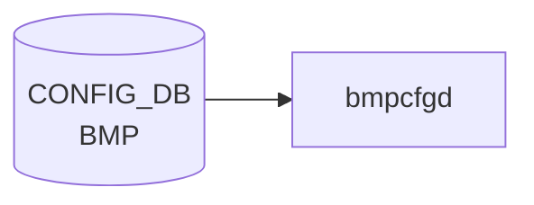

# BMP テーブル

## 概要

[BGP](../../reference/glossary.md#term-bgp) Monitoring Protocol (BMP, RFC 7854) の **テーブルダンプ機能のオンオフ**を設定するテーブル[^1]。
BMP collector への接続自体は `BGP_MONITORS` で定義し、`BMP` テーブルは「どのテーブルダンプ ([BGP](../../reference/glossary.md#term-bgp) neighbor / Adj-RIB-In / Adj-RIB-Out) を送るか」のフラグだけを持つ。

`openbmpd`（BMP collector 側）ではなく、SONiC スイッチ側の BMP exporter を制御する想定。

<!-- cdb-mermaid -->
### データフロー (自動生成)



!!! note "凡例"
    CONFIG_DB から SAI までの典型経路を `docs/reference/config-db-orch-map.md` から機械生成したミニ図。詳細・例外は本ページ本文と対応表を参照。
<!-- /cdb-mermaid -->

## key 構造

```text
BMP|table
```

`table` シングルトン。

## フィールド

| フィールド | 型 | 既定 | 説明 |
|-----------|----|------|------|
| `bgp_neighbor_table` | boolean | `true`  | [BGP](../../reference/glossary.md#term-bgp) neighbor テーブルダンプを送る |
| `bgp_rib_in_table`   | boolean | `false` | Adj-RIB-In テーブルダンプを送る |
| `bgp_rib_out_table`  | boolean | `false` | Adj-RIB-Out テーブルダンプを送る |

## 購読者

- BMP exporter（`bmpcfgd` 系。BGP container 内のサイドカー）が [CONFIG_DB](../../reference/glossary.md#term-config_db) を購読し、[FRR](../../reference/glossary.md#term-frr) の BMP プラグインに反映

## 関連 CONFIG_DB / YANG / CLI

- 関連 [CONFIG_DB](../../reference/glossary.md#term-config_db): `BGP_MONITORS`（BMP collector 接続定義）
- 関連 [YANG](../../reference/glossary.md#term-yang): `sonic-bmp`

<!-- ref-triangle:start -->

## 関連リファレンス

- [YANG](../../reference/glossary.md#term-yang): [`sonic-bmp`](../yang/sonic-bmp.md)

<!-- ref-triangle:end -->

## 引用元

[^1]: [YANG](../../reference/glossary.md#term-yang) 定義: `sonic-bmp.yang`. <https://github.com/sonic-net/sonic-buildimage/blob/9ea932ec2e18f35e58268ec2e4456b1d4afd65cd/src/sonic-yang-models/yang-models/sonic-bmp.yang>

## 関連ページ
- [CONFIG_DB: BGP_MONITORS](bgp-monitors.md)

<!-- ops-hint -->
## 運用ヒント

### 典型値

- key 形式: `BMP|table`。
- `bgp_neighbor_table`: `true`、`bgp_rib_in_table`: `true`、`bgp_rib_out_table`: `false`（負荷軽減）。

### よくある誤設定

- rib_out まで `true` にすると BMP collector への帯域が想定以上に膨らむ。

### 確認コマンド

```bash
sonic-db-cli CONFIG_DB hgetall 'BMP|table'
show bmp
```
<!-- /ops-hint -->

<!-- value-behavior -->
## 値依存挙動マトリクス

このテーブルには enum フィールドはない。全フィールドは boolean。

### boolean フィールドの共通挙動 (`bmpcfgd.py`)

| フィールド | `true` | `false` |
|------------|--------|---------|
| `bgp_neighbor_table` | openbmpd が BGP_NEIGHBOR テーブルダンプを BMP_STATE_DB に書く | ダンプを送らない |
| `bgp_rib_in_table` | Adj-RIB-In テーブルダンプを送る | ダンプを送らない |
| `bgp_rib_out_table` | Adj-RIB-Out テーブルダンプを送る | ダンプを送らない |

> **副作用**: 任意のフィールドを変更すると `bmpcfgd` は常に `openbmpd` を stop → `BMP_STATE_DB` をクリア → start する。部分的な変更でも全テーブルが再構築される。

<!-- /value-behavior -->

<!-- cdb-exceptions -->
## 例外条件・特殊挙動

| 条件 | 挙動 | ソース |
|------|------|--------|
| 不明なフィールドが設定される | `common_config.get('bgp_neighbor_table', 'false')` 等のデフォルト補完で `false` 扱い。スキーマ外フィールドは silently ignored | `bmpcfgd.py` L41-43 |
| `"True"` / `"TRUE"` / `"1"` 等の値 | `is_true()` は `str(val).lower() == 'true'` のみ受理。`"true"` 小文字のみ有効 | `bmpcfgd.py` L28 |
| 設定変更ごとに openbmpd を再起動 | stop → BMP_STATE_DB クリア → start の順序。`supervisorctl` 失敗時は例外 catch なし → bmpcfgd クラッシュの可能性 | `bmpcfgd.py` L46-49 |
| CONFIG_DB 接続不可 | `retry_on=True` で無限リトライ (CONFIG_DB 起動まで待機) | `bmpcfgd.py` L78 |
<!-- /cdb-exceptions -->


<!-- runtime-trace -->
## 実コンテナ動作トレース

### 段階 1 — Consumer 登録

`bmpcfgd` (`sonic-bgpcfgd` パッケージ内) が CONFIG_DB の `BMP` テーブルを購読する。

`BMP` テーブルは BMP target server を定義。`bgpcfgd` と協調して動作。

### 段階 2 — CFG→APPL 翻訳

なし (FRR vtysh 経由で BMP 設定)

### 段階 3 — APPL→SAI

なし (BMP は FRR の BGP モニタリングプロトコル、SAI 非経由)

### 段階 4 — タイミングと副作用

**適用タイミング**: CONFIG_DB の `BMP` エントリ変化を検知後、FRR に BMP target station 設定を注入。BMP セッション確立は非同期。

**副作用**: BMP サーバへの監視データ送信が開始/停止。FRR BGP 動作への影響なし。
<!-- /runtime-trace -->

<!-- entry-points -->
## 書き込み入り口 (Direction A)

対象テーブル: `BMP`

### CLI
- `config bmp enable/disable`
- `config bmp table enable/disable <table>`
  - ソース: `sonic-utilities/config/main.py (bmp グループ)`

### minigraph / sonic-cfggen
- なし

### REST / gNMI (sonic-mgmt-common)
- なし (対応 OpenConfig/SONiC YANG transformer なし)

### db_migrator
- なし

### ビルド時デフォルト (init_cfg / j2 テンプレート)
- なし

### ハードコードデフォルト
- なし

### ランタイム注入 (デーモン自動書き込み)
- なし
<!-- /entry-points -->


<!-- derivation -->
## 派生・条件付き登録 (Phase 6/7)

### Phase 6: 値による他フィールド自動派生

| 条件 | 派生先 | evidence |
|---|---|---|
| 派生なし（BMP テーブルは CLI / config load のみで書き込む） | — | `sonic-buildimage/src/sonic-bmpcfgd/bmpcfgd/bmpcfgd.py` は読み取り専用 |

### Phase 7: 条件付き module/manager 登録

| 条件 | 登録 module | evidence |
|---|---|---|
| 常時（条件なし） | `bmpcfgd.BMPCfgDaemon` が `BMP` テーブルを購読 | `sonic-buildimage/src/sonic-bmpcfgd/bmpcfgd/bmpcfgd.py:82-86` |

### grep カバレッジ

- bmpcfgd.py 100 行全行読了、BMP テーブル購読: 1 件（条件なし）
<!-- /derivation -->
<!-- handler-branching -->
### Phase 8: Handler メソッド内分岐

| Manager / Handler | メソッド | 分岐条件 | 効果 | evidence |
|---|---|---|---|---|
| `BMPCfg` | `load()` | `bgp_neighbor_table == 'true'` | `self.bgp_neighbor_table = True`（openbmpd が BGP_NEIGHBOR State を BMP_STATE_DB に書き込む） | `sonic-buildimage/src/sonic-bmpcfgd/bmpcfgd/bmpcfgd.py:38` |
| `BMPCfg` | `load()` | `bgp_rib_in_table == 'true'` | `self.bgp_rib_in_table = True`（openbmpd が RIB_IN を BMP_STATE_DB に書き込む） | `sonic-buildimage/src/sonic-bmpcfgd/bmpcfgd/bmpcfgd.py:39` |
| `BMPCfg` | `load()` | `bgp_rib_out_table == 'true'` | `self.bgp_rib_out_table = True`（openbmpd が RIB_OUT を BMP_STATE_DB に書き込む） | `sonic-buildimage/src/sonic-bmpcfgd/bmpcfgd/bmpcfgd.py:40` |
| `BMPCfg` | `load()` | 設定変更時（常に） | `stop_bmp()` → `reset_bmp_table()` → `start_bmp()` の順で openbmpd を再起動し BMP_STATE_DB をクリア | `sonic-buildimage/src/sonic-bmpcfgd/bmpcfgd/bmpcfgd.py:44-46` |

> **スキャン証跡**: `BMPCfg.load()` L34-46 全行読了。値による分岐は is_true() による bool 変換のみ。3 フィールドすべて独立して分岐（相互排他ではない）。
<!-- /handler-branching -->
<!-- defaults -->
## コード由来の暗黙デフォルト (Phase A)

### YANG デフォルト vs 実行時 fallback

| フィールド | YANG default | `bmpcfgd` 実行時 fallback | 乖離 |
|---|---|---|---|
| `bgp_neighbor_table` | `"true"` | `'false'` (`bmpcfgd.py` L41) | **あり — discrepancy** |
| `bgp_rib_in_table` | `"false"` | `'false'` (`bmpcfgd.py` L42) | なし |
| `bgp_rib_out_table` | `"false"` | `'false'` (`bmpcfgd.py` L43) | なし |

### `bgp_neighbor_table` の YANG vs 実装 discrepancy

`sonic-bmp.yang` は `bgp_neighbor_table` の `default "true"` を宣言しているが、
`bmpcfgd.py` L41 は `common_config.get('bgp_neighbor_table', 'false')` という Python fallback を持つ。

CONFIG_DB に `BMP|table` エントリが存在しない状態（初期起動 / エントリ削除後）では、
YANG スキーマ上は `bgp_neighbor_table=true` であるべきだが、`bmpcfgd` は `false` として openbmpd を起動する。
その結果、BGP neighbor テーブルダンプが送信されない。

> **運用上の注意**: `sonic-db-cli CONFIG_DB exists 'BMP|table'` が 0 を返す状態では
> YANG default に反して neighbor dump は **無効**。`config bmp enable bgp-neighbor-table` で明示的に有効化が必要。

### `is_true()` の大文字非許容

```python
def is_true(val):
    return str(val).lower() == 'true'
```

`"true"`（小文字）のみ `True` と判定。`"True"`, `"TRUE"`, `"1"`, `"yes"` はすべて `False` 扱い。
YANG `stypes:boolean_type` は `"true"` / `"false"` の小文字 enum のみを許容するため、
YANG バリデーションを通った値は常に正しく処理される。ただし YANG バリデーションをバイパスして
直接 `CONFIG_DB` に書き込む場合（スクリプト等）は注意が必要。

### CLI 部分書き込み時の挙動

`config bmp enable bgp-neighbor-table` を `BMP|table` エントリが存在しない状態で実行すると、
`bgp_rib_in_table` / `bgp_rib_out_table` は DB に書き込まれず未定義のまま残る。
`bmpcfgd` はそれらを `'false'` として処理する（YANG default の `false` と一致するため実害なし）。
<!-- /defaults -->

<!-- glossary-links-injected: 9e5a57a09d49 -->
