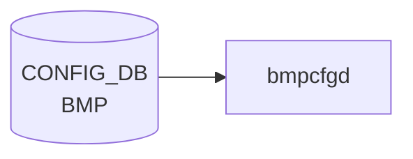

# BMP テーブル

## 概要

BGP Monitoring Protocol (BMP, RFC 7854) の **テーブルダンプ機能のオンオフ**を設定するテーブル[^1]。
BMP collector への接続自体は `BGP_MONITORS` で定義し、`BMP` テーブルは「どのテーブルダンプ (BGP neighbor / Adj-RIB-In / Adj-RIB-Out) を送るか」のフラグだけを持つ。

`openbmpd`（BMP collector 側）ではなく、SONiC スイッチ側の BMP exporter を制御する想定。

<!-- cdb-mermaid -->
### データフロー (自動生成)



!!! note "凡例"
    CONFIG_DB から SAI までの典型経路を `docs/reference/config-db-orch-map.md` から機械生成したミニ図。詳細・例外は本ページ本文と対応表を参照。
<!-- /cdb-mermaid -->

## key 構造

```
BMP|table
```

`table` シングルトン。

## フィールド

| フィールド | 型 | 既定 | 説明 |
|-----------|----|------|------|
| `bgp_neighbor_table` | boolean | `true`  | BGP neighbor テーブルダンプを送る |
| `bgp_rib_in_table`   | boolean | `false` | Adj-RIB-In テーブルダンプを送る |
| `bgp_rib_out_table`  | boolean | `false` | Adj-RIB-Out テーブルダンプを送る |

## 購読者

- BMP exporter（`bmpcfgd` 系。BGP container 内のサイドカー）が CONFIG_DB を購読し、FRR の BMP プラグインに反映

## 関連 CONFIG_DB / YANG / CLI

- 関連 CONFIG_DB: `BGP_MONITORS`（BMP collector 接続定義）
- 関連 YANG: `sonic-bmp`

<!-- ref-triangle:start -->

## 関連リファレンス

- YANG: [`sonic-bmp`](../yang/sonic-bmp.md)

<!-- ref-triangle:end -->

## 引用元

[^1]: YANG 定義: `sonic-bmp.yang`. <https://github.com/sonic-net/sonic-buildimage/blob/9ea932ec2e18f35e58268ec2e4456b1d4afd65cd/src/sonic-yang-models/yang-models/sonic-bmp.yang>

## 関連ページ
- [CONFIG_DB: BGP_MONITORS](bgp-monitors.md)

<!-- ops-hint -->
## 運用ヒント

### 典型値

- key 形式: `BMP|table`。
- `bgp_neighbor_table`: `true`、`bgp_rib_in_table`: `true`、`bgp_rib_out_table`: `false`（負荷軽減）。

### よくある誤設定

- rib_out まで `true` にすると BMP collector への帯域が想定以上に膨らむ。

### 確認コマンド

```bash
sonic-db-cli CONFIG_DB hgetall 'BMP|table'
show bmp
```
<!-- /ops-hint -->
