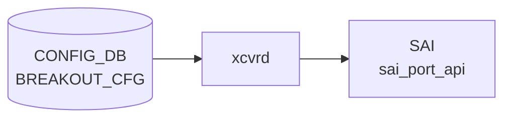

# BREAKOUT_CFG テーブル

## 概要

`BREAKOUT_CFG` テーブルは Dynamic Port Breakout ([DPB](../../reference/glossary.md#term-dpb)) における親ポートと現在の breakout モードを保持する[^1]。子ポートは breakout モードに応じて `PORT` テーブルに自動展開される。`config-engine` / [DPB](../../reference/glossary.md#term-dpb) ロジックが書き込み、`PORT` テーブルや [SAI](../../reference/glossary.md#term-sai) 側で port splitting が反映される。

`port` leaf は `PORT` への leafref ではなく **plain string**。[DPB](../../reference/glossary.md#term-dpb) 中は親ポートが `PORT` から消えるタイミングがあり、leafref で参照すると不整合になるため意図的に外してある（[YANG](../../reference/glossary.md#term-yang) 内コメントに明記）。

<!-- cdb-mermaid -->
### データフロー (自動生成)



!!! note "凡例"
    CONFIG_DB から SAI までの典型経路を `docs/reference/config-db-orch-map.md` から機械生成したミニ図。詳細・例外は本ページ本文と対応表を参照。
<!-- /cdb-mermaid -->

## key 構造

```text
BREAKOUT_CFG|<port>
```

| キー | 型 | 説明 |
|------|----|------|
| `port` | string (1..255) | 親ポート名（`Ethernet0` 等） |

## フィールド

| フィールド | 型 | 説明 |
|-----------|----|------|
| `brkout_mode` | string (1..64) | breakout モード文字列。`platform.json` で妥当性検証される |

## 制約

- `port` は leafref ではない（DPB 過渡状態を許容するため）
- `brkout_mode` の妥当値は `platform.json` の `interfaces.<port>.breakout_modes` で定義される（プラットフォーム依存）

## 購読者

- DPB 処理（`config-engine` / `swssconfig` 系）
- `PORT` テーブルの増減を介して `portsyncd` / `orchagent`

## 関連 CONFIG_DB / YANG / CLI

- 関連 [CONFIG_DB](../../reference/glossary.md#term-config_db): `PORT`、`platform.json`
- 関連 [YANG](../../reference/glossary.md#term-yang): `sonic-breakout_cfg`、`sonic-port`
- 関連 CLI: `config interface breakout`

<!-- ref-triangle:start -->

## 関連リファレンス

- [YANG](../../reference/glossary.md#term-yang): [`sonic-breakout_cfg`](../yang/sonic-breakout_cfg.md)
- CLI: [`config interface breakout`](../cli/config-interface.md)

<!-- ref-triangle:end -->

## 引用元

[^1]: YANG 定義: `sonic-breakout_cfg.yang`. <https://github.com/sonic-net/sonic-buildimage/blob/9ea932ec2e18f35e58268ec2e4456b1d4afd65cd/src/sonic-yang-models/yang-models/sonic-breakout_cfg.yang>

## 関連ページ
- [CONFIG_DB: PORT](port.md)

<!-- ops-hint -->
## 運用ヒント

### 典型値

- key 形式: `BREAKOUT_CFG|<Ethernet>`。
- `brkout_mode`: `4x25G[10G]` 等。プラットフォーム platform.json と整合させる。

### よくある誤設定

- breakout 変更後に `config reload` を忘れて Port table と [SAI](../../reference/glossary.md#term-sai) 状態が乖離する。

### 確認コマンド

```bash
sonic-db-cli CONFIG_DB keys 'BREAKOUT_CFG|*'
show interfaces breakout
```
<!-- /ops-hint -->

<!-- value-behavior -->
## 値依存挙動マトリクス

このテーブルには YANG で定義された enum フィールドはない。

### `brkout_mode` (string、platform.json 依存)

`brkout_mode` の有効値はプラットフォームごとに `platform.json` で定義される。代表的なパターンと挙動:

| 値の例 | 子ポート数 | PORT テーブル生成例 |
|--------|-----------|-------------------|
| `1x100G[40G]` | 1 | 親ポートのまま (分割なし) |
| `2x50G` | 2 | `Ethernet0`, `Ethernet2` |
| `4x25G` | 4 | `Ethernet0`, `Ethernet1`, `Ethernet2`, `Ethernet3` |
| `1x400G` | 1 | 親ポートのまま |
| `2x200G` | 2 | 速度変更 + 2 分割 |
| `4x100G` | 4 | 4 分割 |

> `brkout_mode` の妥当性は `platform.json` の `interfaces.<port>.breakout_modes` で検証される。プラットフォーム依存のため全値を網羅的に示すことはできない。

<!-- /value-behavior -->

<!-- cdb-exceptions -->
## 例外条件・特殊挙動

| 条件 | 挙動 | ソース |
|------|------|--------|
| `platform.json` が存在しない / `.json` 拡張子でない | `Breakout feature is not available without platform.json file` → Abort | `config/main.py` L5469 |
| BREAKOUT_CFG テーブル自体が CONFIG_DB に存在しない | `BREAKOUT_CFG table is NOT present in CONFIG DB` → Abort | `config/main.py` L5481 |
| 対象 interface が BREAKOUT_CFG に未登録 | `{} interface is NOT present in BREAKOUT_CFG table of CONFIG DB` → Abort | `config/main.py` L5485 |
| target mode が `platform.json` の interfaces に未定義 | `_validate_interface_mode()` 失敗 → Abort | `config/main.py` L5491 |
| `del_intf_dict` が空 (削除対象ポートなし) | `del_intf_dict is None! No interfaces are there to be deleted` → Abort | `config/main.py` L5504 |
| Yang モデルなしテーブルに削除対象ポートの依存がある | `breakout_warnUser_extraTables()` がユーザーへの警告・確認を要求 | `config/main.py` L239 |
| BREAKOUT_CFG への `set_entry` で `ValueError` | `Invalid ConfigDB. Error: {}` → `ctx.fail()` | `config/main.py` L5553 |
| `show interfaces breakout` で対象ポートが未登録 | 対象ポートを skip (エラーなし) | `show/interfaces/__init__.py` L228 |
<!-- /cdb-exceptions -->


<!-- runtime-trace -->
## 実コンテナ動作トレース

### 段階 1 — Consumer 登録

`xcvrd` / `portsyncd` (port breakout 処理) が CONFIG_DB の `BREAKOUT_CFG` テーブルを購読する。

`BREAKOUT_CFG` は `platform.json` の breakout モード候補と照合される。

### 段階 2 — CFG→APPL 翻訳

なし (breakout は `config reload` / `sonic-cfggen` 経由で PORT テーブル再生成)

### 段階 3 — APPL→SAI

`sai_port_api` (port breakout — `SAI_PORT_ATTR_SPEED` / lane 再割り当て)

### 段階 4 — タイミングと副作用

**適用タイミング**: BREAKOUT_CFG は `config interface breakout` コマンド実行時に CONFIG_DB に書き込まれる。実際の breakout は `config reload` または専用フローで PORT テーブルを再生成して適用。ダウンタイムが発生する。

**副作用**: 対象ポートの traffic が一時中断。breakout/un-breakout でポート名が変わる。関連する interface 設定も再設定が必要。
<!-- /runtime-trace -->

<!-- entry-points -->
## 書き込み入り口 (Direction A)

対象テーブル: `BREAKOUT_CFG`

### CLI
- `config interface breakout <port> <mode>`
  - ソース: `sonic-utilities/config/main.py (interface グループ)`

### minigraph / sonic-cfggen
- なし

### REST / gNMI (sonic-mgmt-common)
- なし (対応 OpenConfig/SONiC YANG transformer なし)

### db_migrator
- なし

### ビルド時デフォルト (init_cfg / j2 テンプレート)
- プラットフォーム提供の `platform.json` / `port_config.ini` から `sonic-cfggen` が初期値を注入

### ハードコードデフォルト
- なし

### ランタイム注入 (デーモン自動書き込み)
- なし
<!-- /entry-points -->


<!-- derivation -->
## 派生・条件付き登録 (Phase 6/7)

### Phase 6: 値による他フィールド自動派生

| 条件 | 派生先 | evidence |
|---|---|---|
| CLI `config interface breakout <port> <mode>` 実行時 | `BREAKOUT_CFG` の `brkout_mode` を更新、`PORT` テーブルの子ポートエントリを生成・削除 | `sonic-utilities/config/main.py:5554` |
| `cur_brkout_mode != target_brkout_mode` | `PORT` テーブルの子ポートを `del_ports` + `add_ports` で再構成 | `sonic-utilities/config/main.py:5496-5507` |

### Phase 7: 条件付き module/manager 登録

| 条件 | 登録 module | evidence |
|---|---|---|
| BREAKOUT_CFG を直接消費するデーモンはない（設定操作は CLI 経由のみ） | — | — |

### grep カバレッジ

- config/main.py L5479-5554: BREAKOUT_CFG 読み取り・更新のみ（条件付き登録なし）
<!-- /derivation -->
<!-- handler-branching -->
### Phase 8: Handler メソッド内分岐

| Manager / Handler | メソッド | 分岐条件 | 効果 | evidence |
|---|---|---|---|---|
| `config interface breakout` (CLI) | `interface_breakout()` | `BREAKOUT_CFG NOT IN CONFIG_DB` | エラー終了（テーブル存在確認） | `sonic-utilities/config/main.py:5481` |
| `config interface breakout` (CLI) | `interface_breakout()` | `interface_name NOT IN BREAKOUT_CFG` | エラー終了（ポート存在確認） | `sonic-utilities/config/main.py:5485` |
| `config interface breakout` (CLI) | `_validate_interface_mode()` | `target_brkout_mode NOT IN breakout_cfg_file` | バリデーション失敗 → エラー終了 | `sonic-utilities/config/main.py:5491` |
| `config interface breakout` (CLI) | `interface_breakout()` | `cur_brkout_mode != target_brkout_mode` | PORT テーブルを `del_ports` + `add_ports` で再構成。同一モードの場合はスキップ | `sonic-utilities/config/main.py:5496-5507` |

> **スキャン証跡**: config/main.py L5467-5554 全行読了。ランタイムデーモンによる直接消費なし。分岐はすべて CLI コマンドパス内。4 件抽出。
<!-- /handler-branching -->

<!-- pubsub -->
## 通信メカニズム (Phase G)

### Producer/Consumer ペア

`BREAKOUT_CFG` テーブルを直接 Subscribe するランタイムデーモンは存在しない。CLI が CONFIG_DB[PORT] を変更することで、portsyncd → PortsOrch → BufferOrch → SAI の間接連鎖が起動する。

| 区間 | 方式 | チャンネル/パターン |
|------|------|-------------------|
| CLI → CONFIG_DB[BREAKOUT_CFG] | Redis `HSET` 直接書き込み | — |
| CLI → CONFIG_DB[PORT] | `writeConfigDB()` → Redis `HSET` | — |
| CONFIG_DB[PORT] → portsyncd | 起動時一括読み取り (`getKeys`) | — |
| portsyncd → APPL_DB[PORT_TABLE] | `ProducerStateTable::set()` | APPL_DB channel |
| APPL_DB[PORT_TABLE] → PortsOrch | `ConsumerStateTable` (keyspace 通知) | `__keyspace@appl_db__:PORT_TABLE\|*` |
| PortsOrch → BufferOrch | 関数呼び出し `gBufferOrch->isPortReady()` | — |
| PortsOrch → SAI | SAI API 直接呼び出し | `sai_port_api->create_port_bulk()` |

### CLI 起動経路（Producer ロール）

`config interface breakout <port> <mode>` (`sonic-utilities/config/main.py` L5465) が以下を順に実行する:

1. CONFIG_DB[BREAKOUT_CFG] 読み取り → `platform.json` 照合（L5479-5491）
2. `ConfigMgmt.breakOutPort()` を呼び出し (`config_mgmt.py` L451):
   - `_shutdownIntf(delPorts)` — 削除対象ポートを `admin_status: down`
   - `writeConfigDB(delConfigToLoad)` — PORT エントリ削除 → CONFIG_DB
   - `_verifyAsicDB(timeout=60s)` — ASIC_DB ポーリング確認
   - `writeConfigDB(addConfigToLoad)` — PORT エントリ追加 → CONFIG_DB
3. PORT 再構成成功後のみ `CONFIG_DB.set_entry("BREAKOUT_CFG", port, {'brkout_mode': mode})` (L5554)

### PORT 変更を契機とした orchagent 連鎖

`portsyncd` は CONFIG_DB[PORT] のエントリを `ProducerStateTable` 経由で APPL_DB[PORT_TABLE] へ転送する (`portsyncd.cpp` L71,179-214)。`PortsOrch` は `Orch(db, tableNames)` 基底クラスの `addConsumer()` が生成する `ConsumerStateTable(APPL_DB, APP_PORT_TABLE_NAME)` でこれを受信し (`orchdaemon.cpp` L217-232)、`doPortTask()` を呼び出す (`portsorch.cpp` L4555)。

`doPortTask()` 内では `gBufferOrch->isPortReady(port_name)` が `true` になるまで新ポートを `m_pendingPortSet` に保留する (L4779-4784)。DPB 後に BUFFER_PG / BUFFER_QUEUE が書き込まれ BufferOrch が処理完了してから、PortsOrch が `sai_port_api->create_port_bulk()` でポートを SAI に登録する。

### データフロー図

```
operator: config interface breakout Ethernet0 4x25G
  ↓ sonic-utilities/config/main.py L5465 (interface_breakout)
  ↓   CONFIG_DB[PORT|Ethernet*] 削除 & 追加 (writeConfigDB)
  ↓   CONFIG_DB[BREAKOUT_CFG|Ethernet0] 更新 (L5554) ← 成功後のみ
        ↓
portsyncd (portsyncd.cpp L91, L179-214)
  handlePortConfigFromConfigDB()
    ProducerStateTable → APPL_DB[PORT_TABLE|Ethernet*]
    ProducerStateTable → APPL_DB[PORT_TABLE|PortConfigDone]
        ↓ ConsumerStateTable keyspace 通知
orchdaemon select() loop (SELECT_TIMEOUT=1000ms)
  Consumer::drain() → PortsOrch::doPortTask() (portsorch.cpp L4555)
    key == "PortConfigDone" → setPortConfigState(PORT_CONFIG_RECEIVED) (L4598)
    通常 PORT エントリ:
      gBufferOrch->isPortReady(port_name)?  (L4779)
        No  → m_pendingPortSet に保留
        Yes → addPortBulk() → sai_port_api->create_port_bulk()
                             → STATE_DB[PORT_TABLE|Ethernet*] 更新
ASIC (sairedis → ASIC_DB 経由)

BREAKOUT_CFG 直接 Subscribe: なし
APPL_DB[BREAKOUT_CFG]: なし（BREAKOUT_CFG は CONFIG_DB 専用）
```

### retry メカニズム

新ポートが `m_pendingPortSet` に保留される条件: `gBufferOrch->isPortReady()` が `false`（BUFFER_PG / BUFFER_QUEUE 未登録）。BufferOrch のエントリが揃い次第、次回 `doPortTask()` 呼び出し時に再試行される。

> **Evidence**: `sonic-utilities/config/main.py:5465-5554` (CLI 起動経路全体)、`sonic-swss/portsyncd/portsyncd.cpp:71,179-214` (ProducerStateTable → APPL_DB)、`sonic-swss/orchagent/orchdaemon.cpp:217-232` (PortsOrch 生成・ConsumerStateTable wiring)、`sonic-swss/orchagent/portsorch.cpp:4555-4604,4779-4788` (doPortTask / isPortReady 保留)、`sonic-swss/orchagent/bufferorch.cpp:254-273` (isPortReady 実装); 詳細分析 `meta/_intermediate/cdb-flow/breakout-cfg-pubsub.md`
<!-- /pubsub -->
<!-- glossary-links-injected: 17ab2ab6ed91 -->
