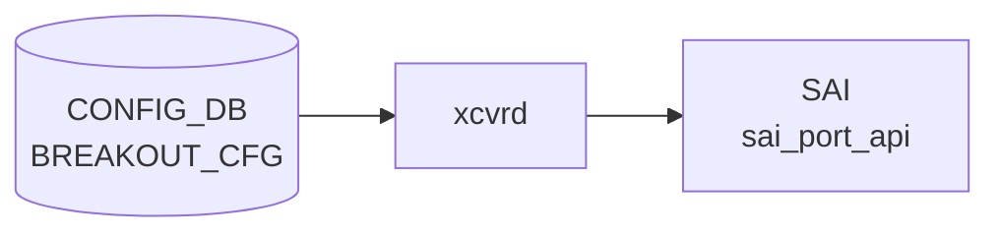

# BREAKOUT_CFG テーブル

## 概要

`BREAKOUT_CFG` テーブルは Dynamic Port Breakout ([DPB](../../reference/glossary.md#term-dpb)) における親ポートと現在の breakout モードを保持する[^1]。子ポートは breakout モードに応じて `PORT` テーブルに自動展開される。`config-engine` / [DPB](../../reference/glossary.md#term-dpb) ロジックが書き込み、`PORT` テーブルや [SAI](../../reference/glossary.md#term-sai) 側で port splitting が反映される。

`port` leaf は `PORT` への leafref ではなく **plain string**。[DPB](../../reference/glossary.md#term-dpb) 中は親ポートが `PORT` から消えるタイミングがあり、leafref で参照すると不整合になるため意図的に外してある（[YANG](../../reference/glossary.md#term-yang) 内コメントに明記）。

<!-- cdb-mermaid -->
### データフロー (自動生成)



!!! note "凡例"
    CONFIG_DB から SAI までの典型経路を `docs/reference/config-db-orch-map.md` から機械生成したミニ図。詳細・例外は本ページ本文と対応表を参照。
<!-- /cdb-mermaid -->

## key 構造

```text
BREAKOUT_CFG|<port>
```

| キー | 型 | 説明 |
|------|----|------|
| `port` | string (1..255) | 親ポート名（`Ethernet0` 等） |

## フィールド

| フィールド | 型 | 説明 |
|-----------|----|------|
| `brkout_mode` | string (1..64) | breakout モード文字列。`platform.json` で妥当性検証される |

## 制約

- `port` は leafref ではない（DPB 過渡状態を許容するため）
- `brkout_mode` の妥当値は `platform.json` の `interfaces.<port>.breakout_modes` で定義される（プラットフォーム依存）

## 購読者

- DPB 処理（`config-engine` / `swssconfig` 系）
- `PORT` テーブルの増減を介して `portsyncd` / `orchagent`

## 関連 CONFIG_DB / YANG / CLI

- 関連 [CONFIG_DB](../../reference/glossary.md#term-config_db): `PORT`、`platform.json`
- 関連 [YANG](../../reference/glossary.md#term-yang): `sonic-breakout_cfg`、`sonic-port`
- 関連 CLI: `config interface breakout`

<!-- ref-triangle:start -->

## 関連リファレンス

- [YANG](../../reference/glossary.md#term-yang): [`sonic-breakout_cfg`](../yang/sonic-breakout_cfg.md)
- CLI: [`config interface breakout`](../cli/config-interface.md)

<!-- ref-triangle:end -->

## 引用元

[^1]: YANG 定義: `sonic-breakout_cfg.yang`. <https://github.com/sonic-net/sonic-buildimage/blob/9ea932ec2e18f35e58268ec2e4456b1d4afd65cd/src/sonic-yang-models/yang-models/sonic-breakout_cfg.yang>

## 関連ページ
- [CONFIG_DB: PORT](port.md)

<!-- ops-hint -->
## 運用ヒント

### 典型値

- key 形式: `BREAKOUT_CFG|<Ethernet>`。
- `brkout_mode`: `4x25G[10G]` 等。プラットフォーム platform.json と整合させる。

### よくある誤設定

- breakout 変更後に `config reload` を忘れて Port table と [SAI](../../reference/glossary.md#term-sai) 状態が乖離する。

### 確認コマンド

```bash
sonic-db-cli CONFIG_DB keys 'BREAKOUT_CFG|*'
show interfaces breakout
```
<!-- /ops-hint -->

<!-- value-behavior -->
## 値依存挙動マトリクス

このテーブルには YANG で定義された enum フィールドはない。

### `brkout_mode` (string、platform.json 依存)

`brkout_mode` の有効値はプラットフォームごとに `platform.json` で定義される。代表的なパターンと挙動:

| 値の例 | 子ポート数 | PORT テーブル生成例 |
|--------|-----------|-------------------|
| `1x100G[40G]` | 1 | 親ポートのまま (分割なし) |
| `2x50G` | 2 | `Ethernet0`, `Ethernet2` |
| `4x25G` | 4 | `Ethernet0`, `Ethernet1`, `Ethernet2`, `Ethernet3` |
| `1x400G` | 1 | 親ポートのまま |
| `2x200G` | 2 | 速度変更 + 2 分割 |
| `4x100G` | 4 | 4 分割 |

> `brkout_mode` の妥当性は `platform.json` の `interfaces.<port>.breakout_modes` で検証される。プラットフォーム依存のため全値を網羅的に示すことはできない。

<!-- /value-behavior -->

<!-- cdb-exceptions -->
## 例外条件・特殊挙動

| 条件 | 挙動 | ソース |
|------|------|--------|
| `platform.json` が存在しない / `.json` 拡張子でない | `Breakout feature is not available without platform.json file` → Abort | `config/main.py` L5469 |
| BREAKOUT_CFG テーブル自体が CONFIG_DB に存在しない | `BREAKOUT_CFG table is NOT present in CONFIG DB` → Abort | `config/main.py` L5481 |
| 対象 interface が BREAKOUT_CFG に未登録 | `{} interface is NOT present in BREAKOUT_CFG table of CONFIG DB` → Abort | `config/main.py` L5485 |
| target mode が `platform.json` の interfaces に未定義 | `_validate_interface_mode()` 失敗 → Abort | `config/main.py` L5491 |
| `del_intf_dict` が空 (削除対象ポートなし) | `del_intf_dict is None! No interfaces are there to be deleted` → Abort | `config/main.py` L5504 |
| Yang モデルなしテーブルに削除対象ポートの依存がある | `breakout_warnUser_extraTables()` がユーザーへの警告・確認を要求 | `config/main.py` L239 |
| BREAKOUT_CFG への `set_entry` で `ValueError` | `Invalid ConfigDB. Error: {}` → `ctx.fail()` | `config/main.py` L5553 |
| `show interfaces breakout` で対象ポートが未登録 | 対象ポートを skip (エラーなし) | `show/interfaces/__init__.py` L228 |
<!-- /cdb-exceptions -->

<!-- glossary-links-injected: 17ab2ab6ed91 -->
