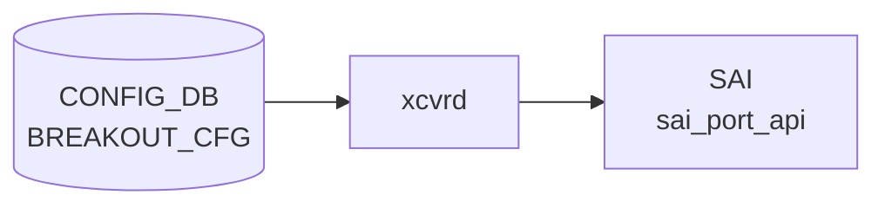

# BREAKOUT_CFG テーブル

## 概要

`BREAKOUT_CFG` テーブルは Dynamic Port Breakout ([DPB](../../reference/glossary.md#term-dpb)) における親ポートと現在の breakout モードを保持する[^1]。子ポートは breakout モードに応じて `PORT` テーブルに自動展開される。`config-engine` / [DPB](../../reference/glossary.md#term-dpb) ロジックが書き込み、`PORT` テーブルや [SAI](../../reference/glossary.md#term-sai) 側で port splitting が反映される。

`port` leaf は `PORT` への leafref ではなく **plain string**。[DPB](../../reference/glossary.md#term-dpb) 中は親ポートが `PORT` から消えるタイミングがあり、leafref で参照すると不整合になるため意図的に外してある（[YANG](../../reference/glossary.md#term-yang) 内コメントに明記）。

<!-- cdb-mermaid -->
### データフロー (自動生成)



!!! note "凡例"
    CONFIG_DB から SAI までの典型経路を `docs/reference/config-db-orch-map.md` から機械生成したミニ図。詳細・例外は本ページ本文と対応表を参照。
<!-- /cdb-mermaid -->

## key 構造

```text
BREAKOUT_CFG|<port>
```

| キー | 型 | 説明 |
|------|----|------|
| `port` | string (1..255) | 親ポート名（`Ethernet0` 等） |

## フィールド

| フィールド | 型 | 説明 |
|-----------|----|------|
| `brkout_mode` | string (1..64) | breakout モード文字列。`platform.json` で妥当性検証される |

## 制約

- `port` は leafref ではない（DPB 過渡状態を許容するため）
- `brkout_mode` の妥当値は `platform.json` の `interfaces.<port>.breakout_modes` で定義される（プラットフォーム依存）

## 購読者

- DPB 処理（`config-engine` / `swssconfig` 系）
- `PORT` テーブルの増減を介して `portsyncd` / `orchagent`

## 関連 CONFIG_DB / YANG / CLI

- 関連 [CONFIG_DB](../../reference/glossary.md#term-config_db): `PORT`、`platform.json`
- 関連 [YANG](../../reference/glossary.md#term-yang): `sonic-breakout_cfg`、`sonic-port`
- 関連 CLI: `config interface breakout`

<!-- ref-triangle:start -->

## 関連リファレンス

- [YANG](../../reference/glossary.md#term-yang): [`sonic-breakout_cfg`](../yang/sonic-breakout_cfg.md)
- CLI: [`config interface breakout`](../cli/config-interface.md)

<!-- ref-triangle:end -->

## 引用元

[^1]: YANG 定義: `sonic-breakout_cfg.yang`. <https://github.com/sonic-net/sonic-buildimage/blob/9ea932ec2e18f35e58268ec2e4456b1d4afd65cd/src/sonic-yang-models/yang-models/sonic-breakout_cfg.yang>

## 関連ページ
- [CONFIG_DB: PORT](port.md)

<!-- ops-hint -->
## 運用ヒント

### 典型値

- key 形式: `BREAKOUT_CFG|<Ethernet>`。
- `brkout_mode`: `4x25G[10G]` 等。プラットフォーム platform.json と整合させる。

### よくある誤設定

- breakout 変更後に `config reload` を忘れて Port table と [SAI](../../reference/glossary.md#term-sai) 状態が乖離する。

### 確認コマンド

```bash
sonic-db-cli CONFIG_DB keys 'BREAKOUT_CFG|*'
show interfaces breakout
```
<!-- /ops-hint -->

<!-- value-behavior -->
## 値依存挙動マトリクス

このテーブルには YANG で定義された enum フィールドはない。

### `brkout_mode` (string、platform.json 依存)

`brkout_mode` の有効値はプラットフォームごとに `platform.json` で定義される。代表的なパターンと挙動:

| 値の例 | 子ポート数 | PORT テーブル生成例 |
|--------|-----------|-------------------|
| `1x100G[40G]` | 1 | 親ポートのまま (分割なし) |
| `2x50G` | 2 | `Ethernet0`, `Ethernet2` |
| `4x25G` | 4 | `Ethernet0`, `Ethernet1`, `Ethernet2`, `Ethernet3` |
| `1x400G` | 1 | 親ポートのまま |
| `2x200G` | 2 | 速度変更 + 2 分割 |
| `4x100G` | 4 | 4 分割 |

> `brkout_mode` の妥当性は `platform.json` の `interfaces.<port>.breakout_modes` で検証される。プラットフォーム依存のため全値を網羅的に示すことはできない。

<!-- /value-behavior -->

<!-- cdb-exceptions -->
## 例外条件・特殊挙動

| 条件 | 挙動 | ソース |
|------|------|--------|
| `platform.json` が存在しない / `.json` 拡張子でない | `Breakout feature is not available without platform.json file` → Abort | `config/main.py` L5469 |
| BREAKOUT_CFG テーブル自体が [CONFIG_DB](../../reference/glossary.md#term-config_db) に存在しない | `BREAKOUT_CFG table is NOT present in CONFIG DB` → Abort | `config/main.py` L5481 |
| 対象 interface が BREAKOUT_CFG に未登録 | `{} interface is NOT present in BREAKOUT_CFG table of CONFIG DB` → Abort | `config/main.py` L5485 |
| target mode が `platform.json` の interfaces に未定義 | `_validate_interface_mode()` 失敗 → Abort | `config/main.py` L5491 |
| `del_intf_dict` が空 (削除対象ポートなし) | `del_intf_dict is None! No interfaces are there to be deleted` → Abort | `config/main.py` L5504 |
| Yang モデルなしテーブルに削除対象ポートの依存がある | `breakout_warnUser_extraTables()` がユーザへの警告・確認を要求 | `config/main.py` L239 |
| BREAKOUT_CFG への `set_entry` で `ValueError` | `Invalid ConfigDB. Error: {}` → `ctx.fail()` | `config/main.py` L5553 |
| `show interfaces breakout` で対象ポートが未登録 | 対象ポートを skip (エラーなし) | `show/interfaces/__init__.py` L228 |
<!-- /cdb-exceptions -->

<!-- failure -->
## 失敗挙動マトリクス

ソース: `sonic-utilities/config/main.py`, `sonic-utilities/config/config_mgmt.py`

### CLI 前処理フェーズの失敗経路

| 失敗条件 | 結果 | evidence |
|---|---|---|
| `platform.json` 不在 / 拡張子が `.json` でない | `[ERROR] Breakout feature is not available without platform.json file` → `Abort` | `config/main.py:5469-5471` |
| `BREAKOUT_CFG` テーブルが [CONFIG_DB](../../reference/glossary.md#term-config_db) に存在しない | `[ERROR] BREAKOUT_CFG table is NOT present in CONFIG DB` → `Abort` | `config/main.py:5481-5483` |
| 対象ポートが `BREAKOUT_CFG` に未登録 | `[ERROR] {interface_name} interface is NOT present in BREAKOUT_CFG table of CONFIG DB` → `Abort` | `config/main.py:5485-5487` |
| `target_brkout_mode` が `platform.json` の `breakout_modes` に未定義 | `_validate_interface_mode()` 失敗 → `Abort` | `config/main.py:5491` |
| `del_intf_dict` が空（削除対象子ポートなし） | `[ERROR] del_intf_dict is None!` → `Abort` | `config/main.py:5504-5506` |
| 削除予定ポート名が CONFIG_DB に未登録 | `[ERROR] Interface name {intf} is invalid` → `Abort` | `config/main.py:5519-5521` |

### DPB 実行フェーズ: port 削除失敗

| 失敗条件 | 結果 | evidence |
|---|---|---|
| 依存テーブル (VLAN_MEMBER 等) が存在し `force=False` | `"Dependencies Exist. No further action will be taken"` → `sys.exit(1)` | `config_mgmt.py:501-503; config/main.py:267-270` |
| YANG バリデーション (`validateConfigData()`) 失敗 (削除後) | `ret=False` → `"[ERROR] Port breakout Failed!!! Opting Out"` → `Abort` | `config_mgmt.py:516` |
| ノード削除中に予期しない例外 | `LOG_ERR "Port Deletion Failed"` → `ret=False` → `Abort` | `config_mgmt.py:525-528` |

### DPB 実行フェーズ: ASIC DB ポーリングタイムアウト

| 失敗条件 | 結果 | evidence |
|---|---|---|
| `MAX_WAIT=60` 秒以内に削除ポートが [ASIC](../../reference/glossary.md#term-asic) DB から消えない | `LOG_CRIT "!!! Critical Failure, Ports are not Deleted from ASIC DB, Bail Out !!!"` → `Exception` 伝播 → `breakOutPort()` が `None, False` を返す | `config_mgmt.py:403-406` |
| [ASIC](../../reference/glossary.md#term-asic) DB ポーリング例外 | CONFIG_DB は PORT 削除済みで新ポート未追加のまま停止。`BREAKOUT_CFG` は**旧値のまま**残る | `config_mgmt.py:462-464` |

### DPB 実行フェーズ: port 再作成失敗

| 失敗条件 | 結果 | evidence |
|---|---|---|
| `/etc/sonic/port_breakout_config_db.json` が欠落 (`loadDefConfig=True` 時) | `LOG_ERR "getDefaultConfig Failed, Error: {}"` → 例外伝播 → `ret=False` → `Abort` | `config_mgmt.py:748-751` |
| YANG バリデーション失敗 (追加後) | `ret=False` → `"[ERROR] Port breakout Failed!!! Opting Out"` → `Abort` | `config_mgmt.py:572` |
| ポート追加中に予期しない例外 | `LOG_ERR "Port Addition Failed"` → `ret=False` | `config_mgmt.py:583-586` |

### retry・ロールバック挙動

- **retry なし**: DPB はいずれの失敗ステップでも自動 retry を行わない。全フェーズ単発実行。
- **部分適用リスク**: `writeConfigDB(delConfigToLoad)` 後に `_verifyAsicDB()` タイムアウトが発生した場合、PORT テーブルは削除済みだが新ポートは未追加の状態となり `BREAKOUT_CFG` は旧値のまま残る。手動 `config reload` が必要。
- **BREAKOUT_CFG 保護**: `breakOutPort()` 失敗時は `BREAKOUT_CFG.brkout_mode` を書き込まない設計（`config/main.py:5548` 以降）。[ASIC](../../reference/glossary.md#term-asic) 状態との乖離を防ぐ意図的なガード。
- **Yang モデルなしテーブル**: `breakout_warnUser_extraTables()` が失敗すると `raise Exception("Failed in breakout_warnUser_extraTables. Error: {}")` を送出し `sys.exit(1)` で終了。

<!-- /failure -->

<!-- runtime-trace -->
## 実コンテナ動作トレース

### 段階 1 — Consumer 登録

`xcvrd` / `portsyncd` (port breakout 処理) が CONFIG_DB の `BREAKOUT_CFG` テーブルを購読する。

`BREAKOUT_CFG` は `platform.json` の breakout モード候補と照合される。

### 段階 2 — CFG→APPL 翻訳

なし (breakout は `config reload` / `sonic-cfggen` 経由で PORT テーブル再生成)

### 段階 3 — APPL→SAI

`sai_port_api` (port breakout — `SAI_PORT_ATTR_SPEED` / lane 再割り当て)

### 段階 4 — タイミングと副作用

**適用タイミング**: BREAKOUT_CFG は `config interface breakout` コマンド実行時に CONFIG_DB に書き込まれる。実際の breakout は `config reload` または専用フローで PORT テーブルを再生成して適用。ダウンタイムが発生する。

**副作用**: 対象ポートの traffic が一時中断。breakout/un-breakout でポート名が変わる。関連する interface 設定も再設定が必要。
<!-- /runtime-trace -->

<!-- entry-points -->
## 書き込み入り口

対象テーブル: `BREAKOUT_CFG`

### CLI
- `config interface breakout <port> <mode>`
  - ソース: `sonic-utilities/config/main.py (interface グループ)`

### minigraph / sonic-cfggen
- なし

### REST / gNMI (sonic-mgmt-common)
- なし (対応 OpenConfig/[SONiC](../../reference/glossary.md#term-sonic) YANG transformer なし)

### db_migrator
- なし

### ビルド時デフォルト (init_cfg / j2 テンプレート)
- プラットフォーム提供の `platform.json` / `port_config.ini` から `sonic-cfggen` が初期値を注入

### ハードコードデフォルト
- なし

### ランタイム注入 (デーモン自動書き込み)
- なし
<!-- /entry-points -->


<!-- derivation -->
## 派生・条件付き登録

### 値による他フィールド自動派生

| 条件 | 派生先 | evidence |
|---|---|---|
| CLI `config interface breakout <port> <mode>` 実行時 | `BREAKOUT_CFG` の `brkout_mode` を更新、`PORT` テーブルの子ポートエントリを生成・削除 | `sonic-utilities/config/main.py:5554` |
| `cur_brkout_mode != target_brkout_mode` | `PORT` テーブルの子ポートを `del_ports` + `add_ports` で再構成 | `sonic-utilities/config/main.py:5496-5507` |

### 条件付き module/manager 登録

| 条件 | 登録 module | evidence |
|---|---|---|
| BREAKOUT_CFG を直接消費するデーモンはない（設定操作は CLI 経由のみ） | — | — |

### grep カバレッジ

- config/main.py L5479-5554: BREAKOUT_CFG 読み取り・更新のみ（条件付き登録なし）
<!-- /derivation -->
<!-- handler-branching -->
### Handler メソッド内分岐

| Manager / Handler | メソッド | 分岐条件 | 効果 | evidence |
|---|---|---|---|---|
| `config interface breakout` (CLI) | `interface_breakout()` | `BREAKOUT_CFG NOT IN CONFIG_DB` | エラー終了（テーブル存在確認） | `sonic-utilities/config/main.py:5481` |
| `config interface breakout` (CLI) | `interface_breakout()` | `interface_name NOT IN BREAKOUT_CFG` | エラー終了（ポート存在確認） | `sonic-utilities/config/main.py:5485` |
| `config interface breakout` (CLI) | `_validate_interface_mode()` | `target_brkout_mode NOT IN breakout_cfg_file` | バリデーション失敗 → エラー終了 | `sonic-utilities/config/main.py:5491` |
| `config interface breakout` (CLI) | `interface_breakout()` | `cur_brkout_mode != target_brkout_mode` | PORT テーブルを `del_ports` + `add_ports` で再構成。同一モードの場合はスキップ | `sonic-utilities/config/main.py:5496-5507` |

> **裏取り**: config/main.py L5467-5554。ランタイムデーモンによる直接消費なし。分岐はすべて CLI コマンドパス内。4 件抽出。
<!-- /handler-branching -->

<!-- pubsub -->
## 通信メカニズム

### Producer/Consumer ペア

`BREAKOUT_CFG` テーブルを直接 Subscribe するランタイムデーモンは存在しない。CLI が CONFIG_DB[PORT] を変更することで、[portsyncd](../../reference/glossary.md#term-portsyncd) → PortsOrch → BufferOrch → [SAI](../../reference/glossary.md#term-sai) の間接連鎖が起動する。

| 区間 | 方式 | チャンネル/パターン |
|------|------|-------------------|
| CLI → CONFIG_DB[BREAKOUT_CFG] | [Redis](../../reference/glossary.md#term-redis) `HSET` 直接書き込み | — |
| CLI → CONFIG_DB[PORT] | `writeConfigDB()` → [Redis](../../reference/glossary.md#term-redis) `HSET` | — |
| CONFIG_DB[PORT] → [portsyncd](../../reference/glossary.md#term-portsyncd) | 起動時一括読み取り (`getKeys`) | — |
| [portsyncd](../../reference/glossary.md#term-portsyncd) → [APPL_DB](../../reference/glossary.md#term-appl_db)[PORT_TABLE] | `ProducerStateTable::set()` | [APPL_DB](../../reference/glossary.md#term-appl_db) channel |
| [APPL_DB](../../reference/glossary.md#term-appl_db)[PORT_TABLE] → PortsOrch | `ConsumerStateTable` (keyspace 通知) | `__keyspace@appl_db__:PORT_TABLE\|*` |
| PortsOrch → BufferOrch | 関数呼び出し `gBufferOrch->isPortReady()` | — |
| PortsOrch → SAI | SAI API 直接呼び出し | `sai_port_api->create_port_bulk()` |

### CLI 起動経路（Producer ロール）

`config interface breakout <port> <mode>` (`sonic-utilities/config/main.py` L5465) が以下を順に実行する:

1. CONFIG_DB[BREAKOUT_CFG] 読み取り → `platform.json` 照合（L5479-5491）
2. `ConfigMgmt.breakOutPort()` を呼び出し (`config_mgmt.py` L451):
   - `_shutdownIntf(delPorts)` — 削除対象ポートを `admin_status: down`
   - `writeConfigDB(delConfigToLoad)` — PORT エントリ削除 → CONFIG_DB
   - `_verifyAsicDB(timeout=60s)` — [ASIC_DB](../../reference/glossary.md#term-asic_db) ポーリング確認
   - `writeConfigDB(addConfigToLoad)` — PORT エントリ追加 → CONFIG_DB
3. PORT 再構成成功後のみ `CONFIG_DB.set_entry("BREAKOUT_CFG", port, {'brkout_mode': mode})` (L5554)

### PORT 変更を契機とした orchagent 連鎖

`portsyncd` は CONFIG_DB[PORT] のエントリを `ProducerStateTable` 経由で APPL_DB[PORT_TABLE] へ転送する (`portsyncd.cpp` L71,179-214)。`PortsOrch` は `Orch(db, tableNames)` 基底クラスの `addConsumer()` が生成する `ConsumerStateTable(APPL_DB, APP_PORT_TABLE_NAME)` でこれを受信し (`orchdaemon.cpp` L217-232)、`doPortTask()` を呼び出す (`portsorch.cpp` L4555)。

`doPortTask()` 内では `gBufferOrch->isPortReady(port_name)` が `true` になるまで新ポートを `m_pendingPortSet` に保留する (L4779-4784)。DPB 後に [BUFFER_PG](../../reference/glossary.md#term-buffer-pg) / BUFFER_QUEUE が書き込まれ BufferOrch が処理完了してから、PortsOrch が `sai_port_api->create_port_bulk()` でポートを SAI に登録する。

### データフロー図

```
operator: config interface breakout Ethernet0 4x25G
  ↓ sonic-utilities/config/main.py L5465 (interface_breakout)
  ↓   CONFIG_DB[PORT|Ethernet*] 削除 & 追加 (writeConfigDB)
  ↓   CONFIG_DB[BREAKOUT_CFG|Ethernet0] 更新 (L5554) ← 成功後のみ
        ↓
portsyncd (portsyncd.cpp L91, L179-214)
  handlePortConfigFromConfigDB()
    ProducerStateTable → APPL_DB[PORT_TABLE|Ethernet*]
    ProducerStateTable → APPL_DB[PORT_TABLE|PortConfigDone]
        ↓ ConsumerStateTable keyspace 通知
orchdaemon select() loop (SELECT_TIMEOUT=1000ms)
  Consumer::drain() → PortsOrch::doPortTask() (portsorch.cpp L4555)
    key == "PortConfigDone" → setPortConfigState(PORT_CONFIG_RECEIVED) (L4598)
    通常 PORT エントリ:
      gBufferOrch->isPortReady(port_name)?  (L4779)
        No  → m_pendingPortSet に保留
        Yes → addPortBulk() → sai_port_api->create_port_bulk()
                             → STATE_DB[PORT_TABLE|Ethernet*] 更新
ASIC (sairedis → ASIC_DB 経由)

BREAKOUT_CFG 直接 Subscribe: なし
APPL_DB[BREAKOUT_CFG]: なし（BREAKOUT_CFG は CONFIG_DB 専用）
```

### retry メカニズム

新ポートが `m_pendingPortSet` に保留される条件: `gBufferOrch->isPortReady()` が `false`（[BUFFER_PG](../../reference/glossary.md#term-buffer-pg) / BUFFER_QUEUE 未登録）。BufferOrch のエントリが揃い次第、次回 `doPortTask()` 呼び出し時に再試行される。

> **Evidence**: `sonic-utilities/config/main.py:5465-5554` (CLI 起動経路全体)、`sonic-swss/portsyncd/portsyncd.cpp:71,179-214` ([ProducerStateTable](../../reference/glossary.md#term-producerstatetable) → APPL_DB)、`sonic-swss/orchagent/orchdaemon.cpp:217-232` (PortsOrch 生成・[ConsumerStateTable](../../reference/glossary.md#term-consumerstatetable) wiring)、`sonic-swss/orchagent/portsorch.cpp:4555-4604,4779-4788` (doPortTask / isPortReady 保留)、`sonic-swss/orchagent/bufferorch.cpp:254-273` (isPortReady 実装)
<!-- /pubsub -->
<!-- ordering -->
## 書込み順依存

Dynamic Port Breakout (DPB) は **多段フェーズ**で構成され、各ステップの順序が厳守されなければ ASIC エラーや設定乖離が生じる。

### ステップ順序（`ConfigMgmt.breakOutPort()` 内、config_mgmt.py L451-460）

| ステップ | 操作 | 理由 |
|---------|------|------|
| 1 | `_shutdownIntf(delPorts)` — 削除対象ポートを `admin_status: down` | トラフィック転送中の SAI 削除を防ぐ |
| 2 | `writeConfigDB(delConfigToLoad)` — PORT エントリを CONFIG_DB から削除 | [orchagent](../../reference/glossary.md#term-orchagent) に削除シグナルを送る |
| 3 | `_verifyAsicDB(timeout=60s)` — ASIC DB からポート消滅を最大 60 秒ポーリング確認 | レーン競合を防ぐため追加前に削除完了を保証 |
| 4 | `writeConfigDB(addConfigtoLoad)` — 新ポートを CONFIG_DB に追加 | ASIC DB 確認後にのみ新ポート生成 |
| 5 | `BREAKOUT_CFG.brkout_mode` を更新（CLI main.py L5553） | PORT 再構成成功後に限り BREAKOUT_CFG を更新 |

### VLAN_MEMBER / ACL / BUFFER 再注入の順序

- `_deletePorts()` は YANG データツリー上の依存ノード（VLAN_MEMBER、ACL_TABLE ポートリスト等）を**ポート削除より先に**削除する (`force=True` 時)。`force=False` かつ依存あり → 処理中断。(`config_mgmt.py L480-520`)
- 新ポート追加後、`_addPorts(loadDefConfig=True)` が `/etc/sonic/port_breakout_config_db.json` から ACL_TABLE / VLAN_MEMBER のデフォルト設定を自動再注入する (`config_mgmt.py L553-572`)。
- **順序依存**: [portsorch](../../reference/glossary.md#term-portsorch) は `gBufferOrch->isPortReady(port)` が `true` になるまでポートを pending 保留する (`portsorch.cpp L4779-4788`)。[BUFFER_PG](../../reference/glossary.md#term-buffer-pg) / BUFFER_QUEUE を PORT 追加と同時か直後に書き込まないと新ポートが準備完了にならない。

### warm reboot との関係

- warm reboot 中 (`m_isWarmRestoreStage=true`) は `postPortInit()` がスキップされる (`portsorch.cpp L4076-4078`)。
- `onWarmBootEnd()` 完了後 (`portsorch.cpp L6424`) に初めて新ポートの SAI カウンタ登録・FEC 設定等が実行される。
- **推奨**: warm reboot と breakout 変更は同一リロードサイクルで同時実施しない。`onWarmBootEnd()` 完了後に breakout を行うことで中途 init 状態を回避できる。

### BREAKOUT_CFG が最後に更新される意味

- CLI handler は `breakout_Ports()` 成功後にのみ `BREAKOUT_CFG` を更新する（`config/main.py L5553`）。PORT 再構成失敗時は `BREAKOUT_CFG` は旧モードのまま残り、実 ASIC 状態との乖離を防ぐ設計になっている。
- ただし `breakout_Ports()` が Exception で終了した場合は PORT が中途半端に再構成されても `BREAKOUT_CFG` は旧値のままとなるため、`show interfaces breakout` と `sonic-db-cli CONFIG_DB hgetall 'BREAKOUT_CFG|<port>'` を照合して整合を確認する。

<!-- /ordering -->
<!-- defaults -->
## 暗黙デフォルト・コード由来挙動

### `brkout_mode`

| 観点 | 値 / 挙動 | ソース |
|------|----------|--------|
| YANG default 宣言 | **なし** | `sonic-breakout_cfg.yang` |
| YANG mandatory 宣言 | **なし**（ただし実装上は事実上必須） | `sonic-breakout_cfg.yang` |
| 初期化デフォルト | `hwsku.json` の `default_brkout_mode` フィールド値（プラットフォーム依存） | `portconfig.py` L477 |
| `port_config.ini` 環境 | BREAKOUT_CFG テーブル自体が生成されない（`get_breakout_mode` が `None` を返す） | `portconfig.py` L464-465 |
| `config reload` 再初期化 | `sonic-cfggen` が `hwsku.json` の `default_brkout_mode` で上書き（CLI 設定が失われる） | `sonic-cfggen` L402-404 |
| 欠落時の実行時挙動 | `config interface breakout` が `KeyError` で crash（YANG は optional だが実装は必須） | `config/main.py` L5488 |
| `show interfaces breakout` 欠落時 | 対象ポートを silent skip（エラーなし） | `show/interfaces/__init__.py` L228-235 |

### YANG vs 実装の discrepancy

- **`brkout_mode` が optional (YANG) vs 事実上 mandatory (実装)**: `cur_brkout_dict[interface_name]["brkout_mode"]` への直接アクセスにより、フィールド欠落で `KeyError` が発生する。YANG に `mandatory true` が宣言されていないが実装上は必須。

### `brkout_mode` 値による PORT テーブルへの暗黙派生

`config interface breakout` 実行時に `BreakoutCfg.get_config()` がチャイルドポートの PORT エントリを自動生成する際の暗黙ルール:

| 条件 | PORT エントリへの暗黙付与 | ソース |
|------|------------------------|--------|
| `default_speed / lanes_per_port >= 50000` (50G/lane 以上) | `fec: rs` が PORT テーブルに自動設定 | `portconfig.py` L387-388 |
| `total_num_ports == 1`（単一ポート構成） | `subport: "0"` | `portconfig.py` L383 |
| `total_num_ports > 1`（複数分割） | `subport: "1"` 〜 `"N"`（連番） | `portconfig.py` L383 |

> これらは BREAKOUT_CFG 自身のフィールドではなく、`brkout_mode` 値に依存した **PORT テーブルへの暗黙派生**。YANG に記述なし。
<!-- /defaults -->
<!-- constants -->
## ハードコード定数

breakout 処理コアに埋め込まれた定数。CONFIG_DB フィールドには現れないが、ポート名生成・FEC 付与・モード検証に直接影響する。

### portconfig.py モジュール定数

ソース: `sonic-buildimage/src/sonic-config-engine/portconfig.py` L36-43

| 定数 | 値 | 説明 |
|------|----|------|
| `PORT_STR` | `"Ethernet"` | 子ポート名プレフィックス。`"Ethernet" + str(base_id + lane_id)` でポート名を構築。変更不可 |
| `BRKOUT_MODE` | `"default_brkout_mode"` | `hwsku.json` 内のデフォルト breakout モードキー名 |
| `CUR_BRKOUT_MODE` | `"brkout_mode"` | BREAKOUT_CFG テーブルに書き込まれるフィールド名（CONFIG_DB キー） |
| `INTF_KEY` | `"interfaces"` | `platform.json` / `hwsku.json` のインターフェース定義セクションキー |
| `BRKOUT_PATTERN` | `r'(\d{1,6})x(\d{1,6}G?)(\[(\d{1,6}G?,?)*\])?(\((\d{1,6})\))?'` | breakout モード文字列パース用正規表現。`+` 区切りで複合モードにも対応 |
| `BRKOUT_PATTERN_GROUPS` | `6` | `BRKOUT_PATTERN` の期待キャプチャグループ数 |

### FEC 自動付与しきい値

ソース: `sonic-buildimage/src/sonic-config-engine/portconfig.py` L387

| 定数 | 値 | 説明 |
|------|----|------|
| FEC 自動付与しきい値 | `50000` Mbps | `default_speed // lanes_per_port >= 50000` のとき `fec: rs` を PORT エントリに自動付与。50 G/lane 以上で FEC 強制 |

### subport 割り当て規則

ソース: `sonic-buildimage/src/sonic-config-engine/portconfig.py` L383

| 条件 | `subport` 値 | 説明 |
|------|-------------|------|
| `total_num_ports == 1`（非分割） | `"0"` | 単一ポート（breakout なし）は `subport = "0"` |
| `total_num_ports > 1`（分割） | `"1"` 〜 `"N"`（連番） | 分割後の子ポートは 1 始まり連番 |

### breakout モード文字列フォーマット（`BRKOUT_PATTERN` 許容形式）

| フォーマット例 | 意味 |
|--------------|------|
| `1x100G` | 1 ポート × 100 G（全レーン非分割） |
| `2x50G` | 2 ポート × 50 G（2 分割） |
| `4x25G` | 4 ポート × 25 G（4 分割） |
| `1x400G` | 1 ポート × 400 G（超高速単一ポート） |
| `1x100G[40G]` | デフォルト 100 G・代替速度 40 G サポート付き |
| `2x25G(2)+1x50G(2)` | ハイブリッド分割（2x25 G に 2 レーン + 1x50 G に 2 レーン） |

> **設計上の注意**: `PORT_STR = "Ethernet"` および FEC しきい値 `50000` Mbps はコードにハードコードされており、変更する場合は `portconfig.py` の修正が必要。FEC しきい値は 50 G/lane 以上のすべての速度（100 G/2lane、400 G/4lane 等）に適用される。
<!-- /constants -->
<!-- side-effects -->
## 副次 DB 書込

`BREAKOUT_CFG` への書込（`config interface breakout`）は CONFIG_DB 内の主テーブル更新にとどまらず、PORT テーブル再構成・[STATE_DB](../../reference/glossary.md#term-state_db) ポート状態初期化・[COUNTERS_DB](../../reference/glossary.md#term-counters_db) キューマップ更新という 3 系統の副次書込を引き起こす。

### CONFIG_DB|PORT テーブル — ポート再構成（直接・同期）

`breakout_Ports()` が `ConfigMgmt.breakOutPort()` を呼び、旧子ポート（現行モード由来）を `PORT` から削除し、新子ポート（目標モード由来）を `PORT` に生成する。これは `BREAKOUT_CFG` への `set_entry` より **前**に実行される。

| トリガ | 操作 | キー | フィールド | evidence |
|--------|------|------|-----------|----------|
| `config interface breakout <port> <mode>` 実行 | del（旧子ポート）+ set（新子ポート） | `PORT\|Ethernet*`（子ポート） | `speed`, `lanes`, `alias`, `subport`, `fec` 等 | `sonic-utilities/config/main.py:5496-5545` |

### STATE_DB|PORT_TABLE — ポート状態エントリの再初期化

DPB 後に [orchagent](../../reference/glossary.md#term-orchagent) が SAI レイヤでポートを再生成すると `initPort()` が [STATE_DB](../../reference/glossary.md#term-state_db) にポートエントリを書き込み、`deInitPort()` が旧ポートのバッファ最大値エントリを削除する。

| トリガ | 操作 | DB / テーブル | フィールド | evidence |
|--------|------|--------------|-----------|----------|
| SAI ポート再生成 → `initPort()` | `set` | `STATE_DB\|PORT_TABLE\|<alias>` | `supported_speeds`, `supported_fecs` 等 | `sonic-swss/orchagent/portsorch.cpp:L3172, L3320` |
| SAI ポート削除 → `deInitPort()` | `del` | `STATE_DB\|BUFFER_MAX_PARAM_TABLE\|<alias>` | （エントリ全体）| `sonic-swss/orchagent/portsorch.cpp:L4331` |

### COUNTERS_DB — キューマップ・ポート名マップ更新

flex counter が有効な環境では、新子ポートのキュー OID マッピング（`COUNTERS_QUEUE_PORT_MAP` / `COUNTERS_QUEUE_INDEX_MAP` / `COUNTERS_QUEUE_TYPE_MAP`）が生成される。旧子ポートのマッピングは削除される。ポート名マップ（`COUNTERS_PORT_NAME_MAP`）も同様に旧エントリ削除・新エントリ追加が行われる。

| トリガ | 操作 | DB / テーブル | evidence |
|--------|------|--------------|----------|
| `initPort()` → `generateQueueMapPerPort()`（queue flex counter 有効時） | `set` | `COUNTERS_DB\|COUNTERS_QUEUE_PORT_MAP`, `COUNTERS_QUEUE_INDEX_MAP`, `COUNTERS_QUEUE_TYPE_MAP` | `sonic-swss/orchagent/portsorch.cpp:L8527-8529` |
| `deInitPort()` → `removePortBufferQueueCounters()` | `hdel` | 上記 3 テーブル（旧子ポートの OID エントリ） | `sonic-swss/orchagent/portsorch.cpp:L8790-8797` |
| `deInitPort()` → `delCounterNameMap()` | `del` | `COUNTERS_DB\|COUNTERS_PORT_NAME_MAP` | `sonic-swss/orchagent/portsorch.cpp:L4316` |

!!! note "flex counter 条件付き"
    COUNTERS_DB へのキューマップ書込は queue flex counter（`FLEX_COUNTER_DB|QUEUE_STAT_COUNTER`）が有効な場合のみ発生する。無効環境では `generateQueueMapPerPort()` は呼ばれない。

<!-- /side-effects -->
<!-- cross-refs -->
## 暗黙参照 — DPB が読み出す関連 CONFIG_DB テーブル

Dynamic Port Breakout (DPB) は `BREAKOUT_CFG` 単体ではなく、`CONFIG_DB` 内の関連テーブルを YANG leafref 解析で検出し、削除対象ポートに依存するエントリを **cascade 削除**（`--force-remove-dependencies` 時）またはユーザ警告対象として扱う。依存解決は `ConfigMgmtDPB._deletePorts()` 内の `SonicYang.find_data_dependencies()` が担う (`config_mgmt.py` L488-495)。

### cascade 削除対象テーブル (YANG モデルあり、leafref 由来)

`force=False` 時は依存一覧を表示して中断。`force=True` (`--force-remove-dependencies`) 時に cascade 削除される。

| テーブル | YANG ファイル | 参照フィールド | 削除契機 |
|---|---|---|---|
| `BUFFER_PG` | `sonic-buffer-pg.yang` L43 | `port` leafref → `PORT.name` | 対象ポートの BUFFER_PG エントリが削除 |
| `BUFFER_QUEUE` | `sonic-buffer-queue.yang` L51 | `port` leafref → `PORT.name` | 対象ポートの BUFFER_QUEUE エントリが削除 |
| `INTERFACE` | `sonic-interface.yang` L58, L128 | `name` leafref → `PORT.name` | INTERFACE / INTERFACE_IPPREFIX エントリが削除 |
| `VLAN_MEMBER` | `sonic-vlan.yang` L292 | `port` leafref → `PORT.name` | VLAN_MEMBER_LIST エントリが削除 |
| `PORT_QOS_MAP` | `sonic-port-qos-map.yang` L78 | `name` leafref → `PORT.name` | [QoS](../../reference/glossary.md#term-qos) マッピングエントリが削除 |
| `BUFFER_PORT_INGRESS_PROFILE_LIST` | `sonic-buffer-port-ingress-profile-list.yang` L41 | `port` leafref → `PORT.name` | バッファイングレスプロファイルが削除 |
| `BUFFER_PORT_EGRESS_PROFILE_LIST` | `sonic-buffer-port-egress-profile-list.yang` L41 | `port` leafref → `PORT.name` | バッファイグレスプロファイルが削除 |
| `PFC_WD` | `sonic-pfcwd.yang` L38 | `ifname` leafref → `PORT.name` | [PFC Watchdog](../../reference/glossary.md#term-pfc-watchdog) エントリが削除 |
| `QUEUE` | `sonic-queue.yang` L67 | `port` leafref → `PORT.name` | QUEUE エントリが削除 |
| `CABLE_LENGTH` | `sonic-cable-length.yang` L47 | `port` leafref → `PORT.name` | ケーブル長エントリが削除 |
| `STORM_CONTROL` | `sonic-storm-control.yang` L41 | `ifname` leafref → `PORT.name` | ストームコントロールエントリが削除 |
| `LLDP_PORT_TABLE` | `sonic-lldp.yang` L109 | `name` leafref → `PORT.name` | [LLDP](../../reference/glossary.md#term-lldp) ポート設定が削除 |
| `DEVICE_NEIGHBOR` | `sonic-device_neighbor.yang` L55 | `name` leafref → `PORT.name` | 隣接デバイス情報が削除 |
| `SFLOW` (port sampler) | `sonic-sflow.yang` L110 | `port` leafref → `PORT.name` | sFlow ポートサンプラーが削除 |
| `BGP_NEIGHBOR` | `sonic-bgp-neighbor.yang` L85 | `local_addr` leafref → `PORT.name` | [BGP](../../reference/glossary.md#term-bgp) neighbor (port 指定) が削除 |
| `MIRROR_SESSION` | `sonic-mirror-session.yang` L149 | `dst_port` leafref → `PORT.name` | ミラーセッションの宛先が対象ポートの場合に削除 |

> 依存の検出は `SonicYang.find_data_dependencies(xPathPort)` が YANG データツリーを走査して行う。leafref でない参照（`ACL_TABLE.ports` 等）はここでは検出されない。

### ユーザ警告対象テーブル (YANG モデルなし — 自動削除不可)

YANG モデルが存在しないテーブルは `tablesWithOutYang` に収集され、該当ポートのエントリを持つ場合に `breakout_warnUser_extraTables()` がユーザへの確認プロンプトを表示する (`config/main.py` L239, L5539)。**自動削除はされない**ため、手動での事前整理が必要。

| テーブル | DPB での挙動 | 手動対応例 |
|---|---|---|
| `ACL_TABLE` (`.ports` フィールドに対象ポートあり) | 警告表示 + 確認要求。削除はユーザ任せ | `config acl remove table <table>` |
| `ACL_RULE` | `ACL_TABLE` 依存エントリが警告対象に含まれることがある | `config acl remove rule` |
| `MUX_CABLE` | 対象ポートにエントリがある場合に警告 | 手動削除 |

> `tablesWithOutYang` の実際のリストはランタイムの CONFIG_DB 内容に依存する。ACL_TABLE が最も頻出する。

### PORT 再作成フェーズ (breakout 後)

削除フェーズ完了後、新子ポートが `PORT` テーブルに追加される。`loadDefConfig=True` の場合は以下がデフォルト設定で暗黙的に再作成される:

| テーブル | 再作成契機 | evidence |
|---|---|---|
| `PORT` | 新子ポートエントリを `platform.json` + `portconfig.py` から生成 | `config_mgmt.py` L439, `portconfig.py` L350-390 |
| `BUFFER_PG` / `BUFFER_QUEUE` | `loadDefConfig=True` 時にデフォルトバッファ設定を注入 | `portconfig.py` (デフォルト設定 JSON) |
<!-- /cross-refs -->
<!-- platform -->
## プラットフォーム差異

### 概要

DPB (Dynamic Port Breakout) は `platform.json` の有無と内容に強く依存し、プラットフォームごとに動作が大きく異なる。

### platform.json 有無によるプラットフォーム分岐

| プラットフォーム種別 | 設定ファイル | DPB 可否 | BREAKOUT_CFG 有無 |
|---|---|---|---|
| `platform.json` + `hwsku.json` 搭載 | `platform.json` (`.json` 判定) | **可** | CONFIG_DB に存在 |
| `port_config.ini` のみ | `port_config.ini` (`.ini` 判定) | **不可** | テーブル非生成 |

`config interface breakout` 実行時に `platform.json` 拡張子チェックが通らない場合は即 Abort する (`config/main.py` L5469–5471)。`port_config.ini` 環境では `get_breakout_mode()` が `None` を返し BREAKOUT_CFG テーブル自体が初期化されない (`portconfig.py` L464–465)。

### ASIC/プラットフォームごとの breakout モード差異

利用可能な `brkout_mode` 値は `platform.json` の `interfaces.<port>.breakout_modes` で定義され、ASIC の物理 lane 構成に依存する:

| ベンダー / プラットフォーム例 | lane 構成 | 代表的な breakout モード |
|---|---|---|
| Arista 7050CX3-32S | 4-lane / 100G | `1x100G[50G,40G,25G,10G]`, `2x50G[40G,25G,10G]`, `4x25G[10G]` |
| Arista 7060DX5-32 | 8-lane / 400G | `1x400G[200G,100G,50G,40G,25G,10G]`, `2x200G[100G]`, `4x100G[50G,40G,25G,10G]` |
| Celestica Silverstone | 8-lane / 400G | `1x400G`, `2x200G`, `2x100G`, `4x100G`, `4x25G(4)`, `4x10G(4)` |
| Mellanox/Nvidia SN2700 | 4-lane / 100G | `1x100G[50G,40G,25G,10G,1G]`, `2x50G[40G,25G,10G]`, `4x25G[10G]` |
| Accton/Edge-core AS9516 | 4-lane / 100G | `1x100G[40G]`, `2x50G`, `4x25G[10G]` |

Arista は `[fallback_speed_list]` 構文、Celestica/Accton は `(num_lanes)` 構文と、ベンダーごとにモード文字列の書式が異なる。いずれも `BRKOUT_PATTERN` 正規表現でパース可能 (`portconfig.py`)。

### PORT テーブルへの FEC 自動付与のプラットフォーム依存

`BreakoutCfg.get_config()` が PORT エントリを生成する際、`50G/lane` 以上で `fec: rs` を自動付与する (`portconfig.py` L387–388)。同じ分割数でも lane 数とポート速度の組み合わせによって結果が変わる:

| breakout モード | lanes_per_port | default_speed | FEC 自動付与 |
|---|---|---|---|
| `4x25G[10G]` (4-lane) | 1 | 25000 | なし (25G/lane < 50G) |
| `2x50G[40G]` (4-lane) | 2 | 50000 | なし (25G/lane < 50G) |
| `4x100G` (8-lane, 2-lane/port) | 2 | 100000 | **あり** (50G/lane ≥ 50G) |
| `2x200G` (8-lane, 4-lane/port) | 4 | 200000 | **あり** (50G/lane ≥ 50G) |

### multi-ASIC 構成

`portconfig.py` の `get_port_config()` は `asic_id` 引数を受け取り `hwsku/<asic_id>/port_config.ini` を参照するが、`config/main.py` の `breakout()` 関数は `get_path_to_port_config_file()` を引数なしで呼び出すため、**CLI での multi-ASIC 個別 DPB は現状未対応**。

### portsorch での ASIC バリデーション

`portsorch.cpp` は DPB で追加されたチャイルドポートの `lanes` が `m_portListLaneMap`（SAI 初期化時に ASIC から取得した lane マップ）に存在するかをバリデーションする (L4026–4032)。`platform.json` の lane 定義が ASIC 物理 lane と不一致な場合ここで失敗する。`isMlnxPlatform()` による breakout 経路固有の分岐はなく、Mellanox 固有処理は Flex Counter / Trim Stat 計算のみ (L858–863)。

### ソース

- `sonic-utilities/config/main.py` L5467–5471: `platform.json` チェック
- `sonic-buildimage/src/sonic-py-common/sonic_py_common/device_info.py` L445–509: ファイルパス解決
- `sonic-buildimage/src/sonic-config-engine/portconfig.py` L186–208, L387–388, L461–465: 分岐・FEC 付与
- `sonic-swss/orchagent/portsorch.cpp` L4026–4032, L858–863: ASIC バリデーション・Mellanox 分岐
<!-- /platform -->

<!-- glossary-links-injected: f9445b5b4106 -->
