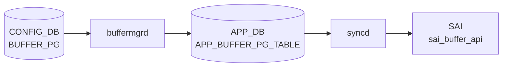

# BUFFER_PG テーブル

## 概要

ポートの ingress バッファ Priority Group (PG) ごとにどの BUFFER_PROFILE を割り当てるかを保持する[^1]。lossless トラフィックの xon/xoff 閾値、[PFC](../../reference/glossary.md#term-pfc) 動作の根本となる設定。`buffermgrd` が [APPL_DB](../../reference/glossary.md#term-appl_db) に転送、`orchagent` `BufferOrch` が [SAI](../../reference/glossary.md#term-sai) ingress PG buffer profile を設定する。

<!-- cdb-mermaid -->
### データフロー (自動生成)



!!! note "凡例"
    CONFIG_DB から SAI までの典型経路を `docs/reference/config-db-orch-map.md` から機械生成したミニ図。詳細・例外は本ページ本文と対応表を参照。
<!-- /cdb-mermaid -->

## key 構造

```text
BUFFER_PG|<port>|<pg_num>
```

`<pg_num>` は `0..7` または `0-3` のような範囲表現を許す。

## フィールド一覧

| フィールド | 型 | 必須 | デフォルト | 説明 |
|-----------|----|------|-----------|------|
| `port` (key) | leafref `PORT.name` | ✅ | - | 対象ポート |
| `pg_num` (key) | string `[0-7]((-)[0-7])?` | ✅ | - | PG 番号または範囲 |
| `profile` | leafref `BUFFER_PROFILE.name` または `NULL` | - | `0` (numeric `0`) | 関連付ける buffer profile。`NULL` で削除扱い |

## 購読者

- `buffermgrd`: [APPL_DB](../../reference/glossary.md#term-appl_db) へ転送
- `orchagent` `BufferOrch`: [SAI](../../reference/glossary.md#term-sai) に PG buffer profile を反映

## 関連 CONFIG_DB / YANG / CLI

- 関連 [CONFIG_DB](../../reference/glossary.md#term-config_db): `BUFFER_PROFILE`、`BUFFER_POOL`、`PORT`、`PFC_WD`
- 関連 CLI: なし（`config_db.json` でロード）
- 関連 [YANG](../../reference/glossary.md#term-yang): `sonic-buffer-pg`

<!-- ref-triangle:start -->

## 関連リファレンス

- [YANG](../../reference/glossary.md#term-yang): [`sonic-buffer-pg`](../yang/sonic-buffer-pg.md)

<!-- ref-triangle:end -->

## 引用元

[^1]: [YANG](../../reference/glossary.md#term-yang) 定義: `sonic-buffer-pg.yang`. <https://github.com/sonic-net/sonic-buildimage/blob/9ea932ec2e18f35e58268ec2e4456b1d4afd65cd/src/sonic-yang-models/yang-models/sonic-buffer-pg.yang>

<!-- topics-back-ref -->
## 関連 Topics

- [Topics: QoS / Buffer / PFC / Watermark](../../topics/08-qos-buffer/index.md)

<!-- /topics-back-ref -->

<!-- ops-hint -->
## 運用ヒント

### 典型値

- key 形式: `BUFFER_PG|<port>|<pg-range>` (例 `BUFFER_PG|Ethernet0|3-4`)。
- `profile`: `pg_lossless_100000_5m_profile` 等。

### よくある誤設定

- [PFC](../../reference/glossary.md#term-pfc) 対象 PG (`3-4`) に `lossy` profile を当てると [PFC](../../reference/glossary.md#term-pfc) が機能しない。

### 確認コマンド

```bash
sonic-db-cli CONFIG_DB keys 'BUFFER_PG|Ethernet0|*'
show buffer pg
```
<!-- /ops-hint -->

<!-- value-behavior -->
## 値依存挙動マトリクス

このテーブルには enum フィールドはない。

### `profile` (leafref または `NULL`)

| 値 | 挙動 |
|----|------|
| `[BUFFER_PROFILE\|<name>]` | `buffermgrd` が対応プロファイルの xon/xoff/dynamic_th で PG を設定し APPL_DB に書く |
| `NULL` | PG の削除扱い。APPL_DB から該当エントリを削除し SAI が PG バッファを解放 |

### `pg_num` (key、範囲対応)

| 形式 | 挙動 |
|------|------|
| `0`〜`7` (単一値) | その PG 番号のみに適用 |
| `0-3` (範囲) | `buffermgrd` が範囲をパースして各 PG (0, 1, 2, 3) に個別に適用 |

<!-- /value-behavior -->

<!-- cdb-exceptions -->
## 例外条件・特殊挙動

| 条件 | 挙動 | ソース |
|------|------|--------|
| `profile` フィールドの参照形式が `[BUFFER_PROFILE\|name]` でない | `BUFFER_PG: Invalid format of reference to profile` → `task_invalid_entry` (drop) | `buffermgrdyn.cpp` L3133 |
| 参照プロファイルが未設定 | `Profile %s hasn't been configured yet, skip` → `task_need_retry` (再試行) | `buffermgrdyn.cpp` L3150 |
| `profile` 以外の不正フィールドが SET で到達 | `BUFFER_PG: Invalid field %s` → `task_invalid_entry` (drop) | `buffermgrdyn.cpp` L3180 |
| PG ID が `uint8_t` に変換不可 (std::invalid_argument) | その PG ID を silently skip | `buffermgr.cpp` L197 |
| speed / cable_length 組み合わせが lookup table に未定義 | `Unable to create/update PG profile` → `task_invalid_entry` | `buffermgr.cpp` L238 |
| admin down ポートでデフォルト以外のプロファイル設定時 | BUFFER_PG エントリを削除しない (`won't reclaim buffer`) | `buffermgr.cpp` L228 |
| ポートの `admin_status` が取得不可 | `assuming default down` として扱う | `buffermgr.cpp` L565 |
| zero buffer profile が pool に未設定でバッファ回収不可 | `Zero profile is not provided for pool %s` を LOG_ERROR | `buffermgrdyn.cpp` L381 |
| admin down ポートへの SET | APPL_DB 書き込みをスキップし内部状態のみ保持。ポート up 時に APPL_DB に反映 | `buffermgrdyn.cpp` L3202 |
<!-- /cdb-exceptions -->

<!-- entry-points -->
## 書き込み入り口 (Direction A)

対象テーブル: `BUFFER_PG`

### CLI
- `config interface buffer priority-group set <port> <pg-range> <profile>`
- `config interface buffer priority-group remove <port> <pg-range>`
  - ソース: `sonic-utilities/config/main.py (buffer グループ)`

### minigraph / sonic-cfggen
- あり: `sonic-cfggen -m <minigraph.xml>` 実行時に本テーブルが生成・上書きされる

### REST / gNMI (sonic-mgmt-common)
- なし (対応 OpenConfig/SONiC YANG transformer なし)

### db_migrator
- なし

### ビルド時デフォルト (init_cfg / j2 テンプレート)
- `sonic-cfggen` が `buffers_config.j2` テンプレートから初期バッファ PG マッピングを生成

### ハードコードデフォルト
- なし

### ランタイム注入 (デーモン自動書き込み)
- Dynamic buffer model: `buffermgrd` が LOSSLESS_TRAFFIC_PATTERN を参照してポートごとに自動再計算・書き込み
<!-- /entry-points -->

<!-- glossary-links-injected: 566f959873ea -->
