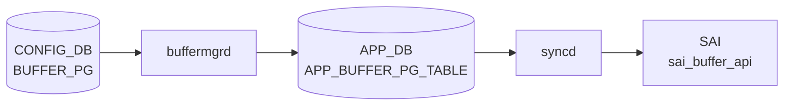

# BUFFER_PG テーブル

## 概要

ポートの ingress バッファ Priority Group (PG) ごとにどの BUFFER_PROFILE を割り当てるかを保持する[^1]。lossless トラフィックの xon/xoff 閾値、PFC 動作の根本となる設定。`buffermgrd` が APPL_DB に転送、`orchagent` `BufferOrch` が SAI ingress PG buffer profile を設定する。

<!-- cdb-mermaid -->
### データフロー (自動生成)



!!! note "凡例"
    CONFIG_DB から SAI までの典型経路を `docs/reference/config-db-orch-map.md` から機械生成したミニ図。詳細・例外は本ページ本文と対応表を参照。
<!-- /cdb-mermaid -->

## key 構造

```
BUFFER_PG|<port>|<pg_num>
```

`<pg_num>` は `0..7` または `0-3` のような範囲表現を許す。

## フィールド一覧

| フィールド | 型 | 必須 | デフォルト | 説明 |
|-----------|----|------|-----------|------|
| `port` (key) | leafref `PORT.name` | ✅ | - | 対象ポート |
| `pg_num` (key) | string `[0-7]((-)[0-7])?` | ✅ | - | PG 番号または範囲 |
| `profile` | leafref `BUFFER_PROFILE.name` または `NULL` | - | `0` (numeric `0`) | 関連付ける buffer profile。`NULL` で削除扱い |

## 購読者

- `buffermgrd`: APPL_DB へ転送
- `orchagent` `BufferOrch`: SAI に PG buffer profile を反映

## 関連 CONFIG_DB / YANG / CLI

- 関連 CONFIG_DB: `BUFFER_PROFILE`、`BUFFER_POOL`、`PORT`、`PFC_WD`
- 関連 CLI: なし（`config_db.json` でロード）
- 関連 YANG: `sonic-buffer-pg`

<!-- ref-triangle:start -->

## 関連リファレンス

- YANG: [`sonic-buffer-pg`](../yang/sonic-buffer-pg.md)

<!-- ref-triangle:end -->

## 引用元

[^1]: YANG 定義: `sonic-buffer-pg.yang`. <https://github.com/sonic-net/sonic-buildimage/blob/9ea932ec2e18f35e58268ec2e4456b1d4afd65cd/src/sonic-yang-models/yang-models/sonic-buffer-pg.yang>

<!-- topics-back-ref -->
## 関連 Topics

- [Topics: QoS / Buffer / PFC / Watermark](../../topics/08-qos-buffer/index.md)

<!-- /topics-back-ref -->
