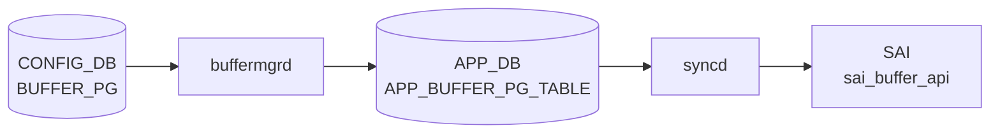

# BUFFER_PG テーブル

## 概要

ポートの ingress バッファ Priority Group (PG) ごとにどの BUFFER_PROFILE を割り当てるかを保持する[^1]。lossless トラフィックの xon/xoff 閾値、[PFC](../../reference/glossary.md#term-pfc) 動作の根本となる設定。`buffermgrd` が [APPL_DB](../../reference/glossary.md#term-appl_db) に転送、`orchagent` `BufferOrch` が [SAI](../../reference/glossary.md#term-sai) ingress PG buffer profile を設定する。

<!-- cdb-mermaid -->
### データフロー (自動生成)



!!! note "凡例"
    CONFIG_DB から SAI までの典型経路を `docs/reference/config-db-orch-map.md` から機械生成したミニ図。詳細・例外は本ページ本文と対応表を参照。
<!-- /cdb-mermaid -->

## key 構造

```text
BUFFER_PG|<port>|<pg_num>
```

`<pg_num>` は `0..7` または `0-3` のような範囲表現を許す。

## フィールド一覧

| フィールド | 型 | 必須 | デフォルト | 説明 |
|-----------|----|------|-----------|------|
| `port` (key) | leafref `PORT.name` | ✅ | - | 対象ポート |
| `pg_num` (key) | string `[0-7]((-)[0-7])?` | ✅ | - | PG 番号または範囲 |
| `profile` | leafref `BUFFER_PROFILE.name` または `NULL` | - | `0` (YANG 定義値、**実装上は dead field**。実効デフォルトは経路依存: Jinja2 静的=`ingress_lossy_profile`、Jinja2 動的=`NULL`、buffermgr=`pg_lossless_*_profile`) | 関連付ける buffer profile。`NULL` で削除扱い |

## 購読者

- `buffermgrd`: [APPL_DB](../../reference/glossary.md#term-appl_db) へ転送
- `orchagent` `BufferOrch`: [SAI](../../reference/glossary.md#term-sai) に PG buffer profile を反映

## 関連 CONFIG_DB / YANG / CLI

- 関連 [CONFIG_DB](../../reference/glossary.md#term-config_db): `BUFFER_PROFILE`、`BUFFER_POOL`、`PORT`、`PFC_WD`
- 関連 CLI: なし（`config_db.json` でロード）
- 関連 [YANG](../../reference/glossary.md#term-yang): `sonic-buffer-pg`

<!-- defaults -->
## コード由来の暗黙デフォルト (Phase A)

### フィールド別デフォルト・fallback 一覧

| フィールド | YANG default | 実装上の実効デフォルト | 経路 | evidence |
|-----------|-------------|----------------------|------|---------|
| `profile` | `0` (numeric) | **dead field** — 実装上一切使われない | — | `sonic-buffer-pg.yang:59` |
| `profile` (Jinja2 静的モード, PG 0) | — | `"ingress_lossy_profile"` | `buffers_config.j2` フォールバック分岐 | `buffers_config.j2:271-272` |
| `profile` (Jinja2 動的モード, PG 3-4) | — | `"NULL"` → pureDynamic fallback | `buffers_config.j2` + `buffermgrdyn.cpp` | `buffers_config.j2:266-268` |
| `profile` (buffermgr 静的モード, PG 3-4) | — | `"pg_lossless_<speed>_<cable>_profile"` (速度・ケーブル長から自動生成) | `buffermgr.cpp doSpeedUpdateTask()` | `buffermgr.cpp:183-184` |
| `dynamic_calculated` (pureDynamic) | — | `true` (profile 未指定時に暗黙設定) | `buffermgrdyn.cpp handleSingleBufferPgEntry()` | `buffermgrdyn.cpp:3194` |
| `lossless` (pureDynamic) | — | `true` (固定値) | 同上 | `buffermgrdyn.cpp:3195` |
| threshold (動的計算) | — | `m_defaultThreshold` = `DEFAULT_LOSSLESS_BUFFER_PARAMETER.default_dynamic_th` (Jinja2 デフォルト `"0"`) | `buffermgrdyn.cpp refreshPgsForPort()` | `buffermgrdyn.cpp:1521` |
| `admin_status` (暗黙) | — | `"down"` (PORT テーブルに無ければ `down` 扱い → PG 書き込み抑制) | `buffermgr.cpp doTask()` | `buffermgr.cpp:565` |

### 主要乖離・silent パターン

| パターン | 内容 | evidence |
|---------|------|---------|
| **dead field** | YANG `profile default 0` は実装で一切参照されない | `sonic-buffer-pg.yang:59` |
| **書き込み経路依存乖離** | Jinja2 静的: PG 0 → `ingress_lossy_profile`; Jinja2 動的: PG 3-4 → `NULL`; buffermgr 静的: `pg_lossless_*_profile` | 各経路 |
| **silent fallback** (動的 threshold) | profile 未指定の lossless PG は `default_dynamic_th` を threshold に使用 | `buffermgrdyn.cpp:1521` |
| **silent drop** (cable=0m) | ケーブル長 `0m` の lossless PG は APPL_DB から削除。WARN なし | `buffermgrdyn.cpp:1492-1509` |
| **silent skip** (PFC 未設定) | `PORT_QOS_MAP.pfc_enable` が未設定のポートは BUFFER_PG を書かずに `task_success` 返却 | `buffermgr.cpp:173-179` |
| **consumer 乖離** (egress reject) | egress profile を PG に設定すると `task_failed` drop — YANG 無制約、実装のみで enforcement | `buffermgrdyn.cpp:3156-3163` |
| **db_migrator silent overwrite** | 動的モード移行時に `profile` を `NULL` に強制書き換え | `db_migrator.py:398` |
| **admin down 書き込み抑制** | PORT admin down 時は APPL_DB 書き込みをスキップし内部状態のみ保持 | `buffermgrdyn.cpp:3198-3202` |

> 中間調査ファイル: `meta/_intermediate/cdb-flow/buffer-pg-defaults.md`

<!-- /defaults -->

<!-- ref-triangle:start -->

## 関連リファレンス

- [YANG](../../reference/glossary.md#term-yang): [`sonic-buffer-pg`](../yang/sonic-buffer-pg.md)

<!-- ref-triangle:end -->

## 引用元

[^1]: [YANG](../../reference/glossary.md#term-yang) 定義: `sonic-buffer-pg.yang`. <https://github.com/sonic-net/sonic-buildimage/blob/9ea932ec2e18f35e58268ec2e4456b1d4afd65cd/src/sonic-yang-models/yang-models/sonic-buffer-pg.yang>

<!-- topics-back-ref -->
## 関連 Topics

- [Topics: QoS / Buffer / PFC / Watermark](../../topics/08-qos-buffer/index.md)

<!-- /topics-back-ref -->

<!-- ops-hint -->
## 運用ヒント

### 典型値

- key 形式: `BUFFER_PG|<port>|<pg-range>` (例 `BUFFER_PG|Ethernet0|3-4`)。
- `profile`: `pg_lossless_100000_5m_profile` 等。

### よくある誤設定

- [PFC](../../reference/glossary.md#term-pfc) 対象 PG (`3-4`) に `lossy` profile を当てると [PFC](../../reference/glossary.md#term-pfc) が機能しない。

### 確認コマンド

```bash
sonic-db-cli CONFIG_DB keys 'BUFFER_PG|Ethernet0|*'
show buffer pg
```
<!-- /ops-hint -->

<!-- value-behavior -->
## 値依存挙動マトリクス

このテーブルには enum フィールドはない。

### `profile` (leafref または `NULL`)

| 値 | 挙動 |
|----|------|
| `[BUFFER_PROFILE\|<name>]` | `buffermgrd` が対応プロファイルの xon/xoff/dynamic_th で PG を設定し APPL_DB に書く |
| `NULL` | PG の削除扱い。APPL_DB から該当エントリを削除し SAI が PG バッファを解放 |

### `pg_num` (key、範囲対応)

| 形式 | 挙動 |
|------|------|
| `0`〜`7` (単一値) | その PG 番号のみに適用 |
| `0-3` (範囲) | `buffermgrd` が範囲をパースして各 PG (0, 1, 2, 3) に個別に適用 |

<!-- /value-behavior -->

<!-- cdb-exceptions -->
## 例外条件・特殊挙動

| 条件 | 挙動 | ソース |
|------|------|--------|
| `profile` フィールドの参照形式が `[BUFFER_PROFILE\|name]` でない | `BUFFER_PG: Invalid format of reference to profile` → `task_invalid_entry` (drop) | `buffermgrdyn.cpp` L3133 |
| 参照プロファイルが未設定 | `Profile %s hasn't been configured yet, skip` → `task_need_retry` (再試行) | `buffermgrdyn.cpp` L3150 |
| `profile` 以外の不正フィールドが SET で到達 | `BUFFER_PG: Invalid field %s` → `task_invalid_entry` (drop) | `buffermgrdyn.cpp` L3180 |
| PG ID が `uint8_t` に変換不可 (std::invalid_argument) | その PG ID を silently skip | `buffermgr.cpp` L197 |
| speed / cable_length 組み合わせが lookup table に未定義 | `Unable to create/update PG profile` → `task_invalid_entry` | `buffermgr.cpp` L238 |
| admin down ポートでデフォルト以外のプロファイル設定時 | BUFFER_PG エントリを削除しない (`won't reclaim buffer`) | `buffermgr.cpp` L228 |
| ポートの `admin_status` が取得不可 | `assuming default down` として扱う | `buffermgr.cpp` L565 |
| zero buffer profile が pool に未設定でバッファ回収不可 | `Zero profile is not provided for pool %s` を LOG_ERROR | `buffermgrdyn.cpp` L381 |
| admin down ポートへの SET | APPL_DB 書き込みをスキップし内部状態のみ保持。ポート up 時に APPL_DB に反映 | `buffermgrdyn.cpp` L3202 |
<!-- /cdb-exceptions -->


<!-- runtime-trace -->
## 実コンテナ動作トレース

### 段階 1 — Consumer 登録

`buffermgrd` / `buffermgrdyn` → `BufferOrch` (APPL_DB 経由) が CONFIG_DB の `BUFFER_PG` テーブルを購読する。

`BUFFER_PG` の key は `<port>|<pg_range>` (例: `Ethernet0|3-4`)。

### 段階 2 — CFG→APPL 翻訳

`APP_BUFFER_PG_TABLE` (`BUFFER_PG_TABLE`) に書き込み

### 段階 3 — APPL→SAI

`sai_buffer_api` — `sai_create_ingress_priority_group_attr` でポート毎の PG (Priority Group) バッファプロファイルを設定

### 段階 4 — タイミングと副作用

**適用タイミング**: CONFIG_DB 変化を `buffermgrd(yn)` が検知後 APPL_DB に書き込み。`BufferOrch` が APPL_DB を購読して SAI call を発行。動的モードでは cable length / speed から自動計算。

**副作用**: PG バッファ変更は ingress traffic の一時的な pause/drop に影響する可能性がある。warm-reboot では既存バッファ設定が保持される。
<!-- /runtime-trace -->

<!-- entry-points -->
## 書き込み入り口 (Direction A)

対象テーブル: `BUFFER_PG`

### CLI
- `config interface buffer priority-group set <port> <pg-range> <profile>`
- `config interface buffer priority-group remove <port> <pg-range>`
  - ソース: `sonic-utilities/config/main.py (buffer グループ)`

### minigraph / sonic-cfggen
- あり: `sonic-cfggen -m <minigraph.xml>` 実行時に本テーブルが生成・上書きされる

### REST / gNMI (sonic-mgmt-common)
- なし (対応 OpenConfig/SONiC YANG transformer なし)

### db_migrator
- なし

### ビルド時デフォルト (init_cfg / j2 テンプレート)
- `sonic-cfggen` が `buffers_config.j2` テンプレートから初期バッファ PG マッピングを生成

### ハードコードデフォルト
- なし

### ランタイム注入 (デーモン自動書き込み)
- Dynamic buffer model: `buffermgrd` が LOSSLESS_TRAFFIC_PATTERN を参照してポートごとに自動再計算・書き込み
<!-- /entry-points -->


<!-- derivation -->
## 派生・条件付き登録 (Phase 6/7)

### Phase 6: 値による他フィールド自動派生

| 条件 | 派生先 | evidence |
|---|---|---|
| DB 移行: 旧 DB で `profile` が `pg_lossless_<speed>_<cable>_profile` 形式 | `profile = 'NULL'` に変換（Dynamic buffer model 移行） | `sonic-utilities/scripts/db_migrator.py:347-398` |
| Dynamic buffer model: `buffermgrd` が速度・ケーブル長から headroom を計算 | `BUFFER_PG.profile` を自動生成プロファイル名で書き込む | `sonic-swss/cfgmgr/buffermgrdyn.cpp:1483-1528` |

### Phase 7: 条件付き module/manager 登録

| 条件 | 登録 module | evidence |
|---|---|---|
| 常時（条件なし） | `BufferMgrDynamic` が `BUFFER_PG` を `handleBufferPgTable` に登録 | `sonic-swss/cfgmgr/buffermgrdyn.cpp:446` |

### grep カバレッジ

- buffermgrdyn.cpp L446: BUFFER_PG ハンドラ登録（条件なし）
- db_migrator.py L364-398: BUFFER_PG profile='NULL' 移行
<!-- /derivation -->
<!-- handler-branching -->
### Phase 8: Handler メソッド内分岐

| Manager / Handler | メソッド | 分岐条件 | 効果 | evidence |
|---|---|---|---|---|
| `BufferMgrDynamic` | `handleBufferObjectTables()` | キー形式 `port:ids` が不正 | `task_invalid_entry` 返却（早期リジェクト） | `sonic-swss/cfgmgr/buffermgrdyn.cpp:3514` |
| `BufferMgrDynamic` | `handleBufferObjectTables()` | カンマ区切りポートリスト（複数ポート） | ポートごとにシングルポートハンドラを繰り返し呼び出し | `sonic-swss/cfgmgr/buffermgrdyn.cpp:3536-3547` |
| `BufferMgrDynamic` | BUFFER_PG シングルポートハンドラ | `portPg.dynamic_calculated == true` | headroom を自動計算してプロファイル名を決定 | `sonic-swss/cfgmgr/buffermgrdyn.cpp:1483` |
| `BufferMgrDynamic` | BUFFER_PG シングルポートハンドラ | `portPg.dynamic_calculated == false` | 静的プロファイル参照として APPL_DB に直接書き込む | `sonic-swss/cfgmgr/buffermgrdyn.cpp:1515` |

> **スキャン証跡**: `handleBufferObjectTables` L3502-3553 全行読了。`handleBufferPgTable` は共通ルーターを経由。4 件分岐抽出。
<!-- /handler-branching -->

<!-- ordering -->
## 書込順依存 (Phase B)

BUFFER_PG エントリが正常に SAI まで到達するには、以下の順序制約を満たす必要がある。

| # | 先行必須リソース | 依存先処理 | 違反時の挙動 | evidence |
|---|----------------|-----------|-------------|---------|
| 1 | **BUFFER_POOL** が APPL_DB に存在すること | `buffermgrdyn` が PG を APPL_DB に書き込む | `m_bufferObjectsPending = true` に設定、書き込みデファー | `buffermgrdyn.cpp:935` |
| 2 | **BUFFER_PROFILE** が APPL_DB に存在すること | `BufferOrch::processPriorityGroup()` がプロファイル参照を解決する | `task_need_retry`（orchagent が再試行） | `bufferorch.cpp:1345-1348` |
| 3 | **PORT** speed + cable_length が設定済みであること（動的モード） | `buffermgrdyn` が headroom を計算して PG を書き込む | `"Nothing to be done for %s since port is not ready"` → スキップ | `buffermgrdyn.cpp:1485-1487` |
| 4 | **PORT** admin_status + PORT_QOS_MAP.pfc_enable が設定済みであること（静的モード） | `buffermgr.doSpeedUpdateTask()` が PG を作成する | `task_need_retry` または silent skip | `buffermgr.cpp:155,167,175-179` |
| 5 | **BUFFER_PG** は PORT admin up **前**に設定すること | `BufferOrch` が SAI に PG プロファイルを適用する | PORT up 後の設定は `SWSS_LOG_WARN` を発行（SAI 適用自体は行われるが運用上 unsafe） | `bufferorch.cpp:1576-1589` |

### 確定 SAI call 順序

```
1. sai_create_buffer_pool()              ← BUFFER_POOL
2. sai_create_buffer_profile()           ← BUFFER_PROFILE (pool 依存)
3. sai_set_port_attribute(PORT_UP=false) ← PORT admin down のまま保持
4. set_ingress_priority_groups_attribute(SAI_INGRESS_PRIORITY_GROUP_ATTR_BUFFER_PROFILE)
                                         ← BUFFER_PG (pool + profile + port 依存)
5. sai_set_port_attribute(PORT_UP=true)  ← PORT を up にする (BUFFER_PG 設定後)
```

> 中間調査ファイル: `meta/_intermediate/cdb-flow/buffer-pg-ordering.md`

<!-- /ordering -->

<!-- failure -->
## 失敗挙動マトリクス (Phase D)

### buffermgrdyn.cpp — handleSingleBufferPgEntry / refreshPgsForPort

| 失敗条件 | 結果 | ログ | evidence |
|---|---|---|---|
| `profile` 参照が空文字（`profileName.empty()`） | `task_invalid_entry`（エントリ drop、ルックアップもクリア） | `SWSS_LOG_ERROR("BUFFER_PG: Invalid format of reference to profile: %s")` | `buffermgrdyn.cpp:3133` |
| 参照 BUFFER_PROFILE が未登録（`m_bufferProfileLookup` に存在しない） | `task_need_retry`（次イベントで再試行） | `SWSS_LOG_INFO("Profile %s hasn't been configured yet, skip")` | `buffermgrdyn.cpp:3144-3151` |
| 参照 BUFFER_PROFILE の direction が egress | `task_failed`（永続 drop） | `SWSS_LOG_ERROR("Egress buffer profile configured on PG %s")` | `buffermgrdyn.cpp:3156-3163` |
| lossy PG の累積 headroom がリソース上限超過 | `task_failed` | `SWSS_LOG_ERROR("Unable to configure lossy PG %s, accumulative headroom size exceeds the limit")` | `buffermgrdyn.cpp:3170-3171` |
| `profile` 以外の不明フィールドが SET で到達 | `task_invalid_entry` | `SWSS_LOG_ERROR("BUFFER_PG: Invalid field %s")` | `buffermgrdyn.cpp:3180` |
| PORT が `PORT_READY` でない（speed/cable_length 未設定）— 動的計算時 | 対象 PG をスキップ（silent skip、retry なし） | `SWSS_LOG_INFO("Nothing to be done for %s since port is not ready")` | `buffermgrdyn.cpp:1485-1487` |
| cable_length = `"0m"` かつ lossless PG | APPL_DB から lossless PG を削除（バッファ回収） | `SWSS_LOG_INFO("No lossless profile found for port %s when cable length is set to '0m'.")` | `buffermgrdyn.cpp:1492-1509` |
| 動的 headroom 計算（`allocateProfile()`）失敗 | `task_failed` | `allocateProfile()` 内部で `SWSS_LOG_ERROR` | `buffermgrdyn.cpp:1530-1534` |
| 動的計算後の累積 headroom がリソース上限超過 | `task_failed`（profile を release） | `SWSS_LOG_ERROR("Update speed (%s) and cable length (%s) for port %s failed, accumulative headroom size exceeds the limit")` | `buffermgrdyn.cpp:1541-1546` |
| PORT admin down 時の SET | APPL_DB 書き込みをスキップし内部状態のみ保持。PORT up 時に再適用（silent defer） | なし | `buffermgrdyn.cpp:3198-3202` |
| zero profile が pool に未設定 | LOG_ERROR のみ・処理継続（SAI call なし） | `SWSS_LOG_ERROR("Zero profile is not provided for pool %s ...")` | `buffermgrdyn.cpp:384` |

### buffermgr.cpp — doSpeedUpdateTask

| 失敗条件 | 結果 | ログ | evidence |
|---|---|---|---|
| cable_length 未設定 | `task_need_retry` | `SWSS_LOG_INFO("...Cable length is not set")` | `buffermgr.cpp:155` |
| `admin_status` 未取得 | `task_need_retry` | `SWSS_LOG_INFO("pfc_enable status is not available for port %s")` | `buffermgr.cpp:170` |
| `PORT_QOS_MAP.pfc_enable` 未設定 | `task_success`（silent skip、pfc_enable 設定時に再ハンドル） | `SWSS_LOG_INFO("pfc_enable status is not available for port %s")` | `buffermgr.cpp:175-179` |
| speed + cable_length が lookup table に未定義 | `task_invalid_entry`（永続 drop） | `SWSS_LOG_ERROR("No PG profile configured for speed %s and cable length %s")` | `buffermgr.cpp:240` |
| lossless pool が未作成 | `task_need_retry` | `SWSS_LOG_INFO("PG lossless pool is not yet created")` | `buffermgr.cpp:258` |
| PORT admin down（mellanox/barefoot）かつデフォルトプロファイル | CONFIG_DB の BUFFER_PG を削除（バッファ回収） | `SWSS_LOG_NOTICE("Removing PG %s from port %s which is administrative down")` | `buffermgr.cpp:228` |
| PORT admin down かつ非デフォルトプロファイル | 削除せず silent skip | `SWSS_LOG_NOTICE("won't reclaim buffer")` | `buffermgr.cpp:231` |
| PG ID が `uint8_t` に変換不可 | 該当 PG ID を silent skip・ループ継続 | なし | `buffermgr.cpp:197` |

### bufferorch.cpp — processPriorityGroup / processPriorityGroupPost

| 失敗条件 | 結果 | ログ | evidence |
|---|---|---|---|
| key が 2 トークンでない | `task_invalid_entry` | `SWSS_LOG_ERROR("malformed key:%s. Must contain 2 tokens")` | `bufferorch.cpp:1324` |
| pg_range パース失敗 | `task_invalid_entry` | `SWSS_LOG_ERROR("Failed to obtain pg range values")` | `bufferorch.cpp:1330` |
| BUFFER_PROFILE 参照が未解決 | `task_need_retry` | `SWSS_LOG_INFO("Missing or invalid pg profile reference specified")` | `bufferorch.cpp:1347` |
| BUFFER_PROFILE 参照がその他エラーで解決失敗 | `task_failed` | `SWSS_LOG_ERROR("Resolving pg profile reference failed")` | `bufferorch.cpp:1350-1351` |
| BUFFER_PROFILE が trimming eligible | `task_failed` | `SWSS_LOG_ERROR("...buffer profile(%s) is trimming eligible")` | `bufferorch.cpp:759-763` |
| ポート名が PortsOrch に未登録 | `task_invalid_entry` | `SWSS_LOG_ERROR("Port with alias:%s not found")` | `bufferorch.cpp:1035` |
| PG インデックスがポートの PG 数超過 | `task_invalid_entry` | `SWSS_LOG_ERROR("Invalid pg index specified:%zd")` | `bufferorch.cpp:1063` |
| SAI `set_attribute` が非 SUCCESS を返却 | `handleSaiSetStatus()` に委譲（retry 可能か判定） | `SWSS_LOG_ERROR("Failed to set port:%s pg:%zd buffer profile attribute, status:%d")` | `bufferorch.cpp:1507-1512` |
| DEL 対象が APPL_DB に存在しない | SAI call をスキップして `task_success` | `SWSS_LOG_INFO("...doesn't not exist, don't need to notfiy SAI")` | `bufferorch.cpp:1409-1413` |

> 中間調査ファイル: `meta/_intermediate/cdb-flow/buffer-pg-failure.md`

<!-- /failure -->
<!-- glossary-links-injected: 566f959873ea -->
