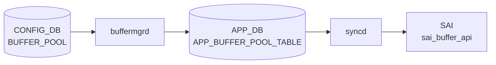

# BUFFER_POOL テーブル

## 概要

ASIC 上の共有 / 専用バッファプールを [CONFIG_DB](../../reference/glossary.md#term-config_db) で定義するテーブル。`BUFFER_PROFILE.pool` から leafref で参照される。`bufferorch` ([orchagent](../../reference/glossary.md#term-orchagent)) または `buffermgrd` (dynamic buffer model) が [CONFIG_DB](../../reference/glossary.md#term-config_db) を購読し、[SAI](../../reference/glossary.md#term-sai) BUFFER_POOL に変換する[^1]。

<!-- cdb-mermaid -->
### データフロー (自動生成)



!!! note "凡例"
    CONFIG_DB から SAI までの典型経路を `docs/reference/config-db-orch-map.md` から機械生成したミニ図。詳細・例外は本ページ本文と対応表を参照。
<!-- /cdb-mermaid -->

## key 構造

```text
BUFFER_POOL|<name>
```

慣用名: `ingress_lossless_pool`、`ingress_lossy_pool`、`egress_lossless_pool`、`egress_lossy_pool`。

## 主要フィールド

| フィールド | 型 | 必須 | 説明 |
|-----------|----|------|------|
| `type` | enum `ingress`/`egress`/`both` | yes | プールの方向 |
| `mode` | enum `static`/`dynamic` | yes | 閾値モード |
| `size` | uint64 (bytes) | no | プールサイズ。`percentage` と排他 |
| `xoff` | uint64 (bytes) | no (default 0) | xoff 閾値 (lossless ingress 用) |
| `percentage` | uint8 | no | 利用可能バッファに対する割合 (dynamic buffer model 限定) |

## 制約

- `percentage` は `size` と同時設定できない (`must` 制約)
- `percentage` は `DEVICE_METADATA.localhost.buffer_model = 'dynamic'` のときのみ有効

## 購読者

- **traditional buffer model**: `orchagent` の `BufferOrch`
- **dynamic buffer model**: `buffermgrd` (`docker-swss`) が [CONFIG_DB](../../reference/glossary.md#term-config_db) → [APPL_DB](../../reference/glossary.md#term-appl_db) に展開し、`bufferorch` が [SAI](../../reference/glossary.md#term-sai) 反映
- ベンダ固有のテンプレ (`buffers_*.json.j2`) でハードウェア依存初期値が生成される

## 関連 CONFIG_DB / YANG / CLI

- 関連 CONFIG_DB: `BUFFER_PROFILE`、`BUFFER_PG`、`BUFFER_QUEUE`、`DEVICE_METADATA`
- 関連 CLI: `config buffer`、`mmuconfig`
- 関連 [YANG](../../reference/glossary.md#term-yang): `sonic-buffer-pool`、`sonic-buffer-profile`

<!-- ref-triangle:start -->

## 関連リファレンス

- [YANG](../../reference/glossary.md#term-yang): [`sonic-buffer-pool`](../yang/sonic-buffer-pool.md)
- CLI: [`config buffer`](../cli/config-buffer.md)

<!-- ref-triangle:end -->

## 引用元

[^1]: [YANG](../../reference/glossary.md#term-yang) 定義: `sonic-buffer-pool.yang`. <https://github.com/sonic-net/sonic-buildimage/blob/9ea932ec2e18f35e58268ec2e4456b1d4afd65cd/src/sonic-yang-models/yang-models/sonic-buffer-pool.yang>

<!-- topics-back-ref -->
## 関連 Topics

- [Topics: QoS / Buffer / PFC / Watermark](../../topics/08-qos-buffer/index.md)

<!-- /topics-back-ref -->

<!-- ops-hint -->
## 運用ヒント

### 典型値

- key 形式: `BUFFER_POOL|<pool-name>` (`ingress_lossless_pool` / `egress_lossless_pool` / `egress_lossy_pool` 等)。
- `size`: ASIC 別の SDK 値（例 100G TOR で `12766208`）。
- `type`: `ingress` / `egress`。
- `mode`: `dynamic` / `static`。

### よくある誤設定

- `size` を ASIC 上限超過で入れると bufferorch が `SAI_STATUS_NO_MEMORY` を返し、すべての buffer 設定が止まる。
- `mode: dynamic` を ASIC 未対応のまま使うと [PFC](../../reference/glossary.md#term-pfc) で head-of-line を起こす。`traditional` プラットフォームでは `static`。

### 確認コマンド

```bash
sonic-db-cli CONFIG_DB hgetall 'BUFFER_POOL|ingress_lossless_pool'
show buffer pool
```
<!-- /ops-hint -->

<!-- value-behavior -->
## 値依存挙動マトリクス

### `type` (enum: `ingress`/`egress`/`both`)

| 値 | SAI 属性 | 備考 |
|----|---------|------|
| `ingress` | `SAI_BUFFER_POOL_TYPE_INGRESS` | ingress 方向のみ。`xoff` 設定は ingress pool でのみ有効 |
| `egress` | `SAI_BUFFER_POOL_TYPE_EGRESS` | egress 方向のみ |
| `both` | `SAI_BUFFER_POOL_TYPE_BOTH` | 双方向プール (一部 ASIC のみ) |

`bufferorch.cpp:443-453` で SAI API に渡される。

### `mode` (enum: `static`/`dynamic`)

| 値 | SAI 属性 | 動作モード | `percentage` フィールド |
|----|---------|-----------|----------------------|
| `static` | `SAI_BUFFER_POOL_THRESHOLD_MODE_STATIC` | `size` (bytes) で固定閾値 | 無効 |
| `dynamic` | `SAI_BUFFER_POOL_THRESHOLD_MODE_DYNAMIC` | Alpha 値で動的閾値 | 有効 (`DEVICE_METADATA.buffer_model=dynamic` のとき) |

`bufferorch.cpp:474-480` で SAI API に渡される。

### `type` × `mode` の組み合わせと `xoff`

| type | mode | `xoff` | 典型 pool 名 |
|------|------|--------|-------------|
| `ingress` | `static` | 有効 (lossless 用) | `ingress_lossless_pool` |
| `ingress` | `dynamic` | 無効 | `ingress_lossy_pool` |
| `egress` | `static` | 無効 | `egress_lossless_pool` |
| `egress` | `dynamic` | 無効 | `egress_lossy_pool` |

<!-- /value-behavior -->

<!-- cdb-exceptions -->
## 例外条件・特殊挙動

| 条件 | 挙動 | ソース |
|------|------|--------|
| `xoff` フィールドが `ingress_lossless_pool` 以外のプールに設定 | `Field xoff is supported for %s only` を LOG_ERROR → xoff は ignored、他フィールドは処理 | `buffermgrdyn.cpp` L2625 |
| `xoff` 値が MMU サイズを超過 | `Invalid xoff %s, exceeding the mmu size` を LOG_ERROR → xoff 無視、pool size は更新 | `buffermgrdyn.cpp` L757 |
| SHP 設定が変化なし | `updated without change, skipped` → APPL_DB への書き込みをスキップ | `buffermgrdyn.cpp` L2614 |
| 同一 pool に複数の zero profile 登録 | `Multiple zero profiles detected for pool %s, takes the former and ignores the latter` を LOG_ERROR | `buffermgrdyn.cpp` L338 |
| Buffer pools が未準備の状態でプロファイル設定 | `pending` → プロファイル適用を遅延 | `buffermgrdyn.cpp` L894 |
| 共有バッファプールが未設定 | headroom 計算をスキップ (`No shared buffer pool configured`) | `buffermgrdyn.cpp` L684 |
| `task_invalid_entry` (static モード main loop) | `Failed to process invalid entry, drop it` → エントリを破棄 | `buffermgr.cpp` L585 |
| 既存プロファイルが存在する場合の pool 作成 | `// check if profile already exists - if yes - skip creation` | `buffermgr.cpp` L246 |
<!-- /cdb-exceptions -->


<!-- runtime-trace -->
## 実コンテナ動作トレース

### 段階 1 — Consumer 登録

`buffermgrd` / `buffermgrdyn` → `BufferOrch` (APPL_DB 経由) が CONFIG_DB の `BUFFER_POOL` テーブルを購読する。

`BUFFER_POOL` は `ingress_lossless_pool` / `egress_lossy_pool` 等の名前付きプール。

### 段階 2 — CFG→APPL 翻訳

`APP_BUFFER_POOL_TABLE` に書き込み

### 段階 3 — APPL→SAI

`sai_buffer_api` — `sai_create_buffer_pool` でバッファプール (ingress/egress, static/dynamic) を作成/更新

### 段階 4 — タイミングと副作用

**適用タイミング**: CONFIG_DB 変化を `buffermgrd(yn)` が検知後 APPL_DB に書き込み。`BufferOrch` が SAI pool オブジェクトを作成/更新。既存プールの size 変更は即時反映。

**副作用**: プールサイズ変更はそのプールを参照するすべてのプロファイルの実効バッファ量に影響。`xoff` 変更は PFC threshold に影響する。
<!-- /runtime-trace -->

<!-- entry-points -->
## 書き込み入り口 (Direction A)

対象テーブル: `BUFFER_POOL`

### CLI
- `config buffer pool add/del <name> ...`
  - ソース: `sonic-utilities/config/main.py (buffer グループ)`

### minigraph / sonic-cfggen
- あり: `sonic-cfggen -m <minigraph.xml>` 実行時に本テーブルが生成・上書きされる

### REST / gNMI (sonic-mgmt-common)
- なし (対応 OpenConfig/SONiC YANG transformer なし)

### db_migrator
- なし

### ビルド時デフォルト (init_cfg / j2 テンプレート)
- `buffers_config.j2` テンプレートからプラットフォーム別プールが生成

### ハードコードデフォルト
- なし

### ランタイム注入 (デーモン自動書き込み)
- Dynamic buffer model では `buffermgrd` がプールサイズを自動調整
<!-- /entry-points -->


<!-- derivation -->
## 派生・条件付き登録 (Phase 6/7)

### Phase 6: 値による他フィールド自動派生

| 条件 | 派生先 | evidence |
|---|---|---|
| DB 移行: 旧 DB の BUFFER_POOL エントリのフィールド区切り文字を更新 | `BUFFER_POOL` のフィールド値を新形式に変換 | `sonic-utilities/scripts/db_migrator.py:447` |
| Dynamic buffer model: `size` フィールドが未指定 | `bufferPool.dynamic_size = true` → buffermgrd がプールサイズを動的計算して APPL_DB へ書き込む | `sonic-swss/cfgmgr/buffermgrdyn.cpp:2525,2534` |

### Phase 7: 条件付き module/manager 登録

| 条件 | 登録 module | evidence |
|---|---|---|
| 常時（条件なし） | `BufferMgrDynamic` が `BUFFER_POOL` を `handleBufferPoolTable` に登録 | `sonic-swss/cfgmgr/buffermgrdyn.cpp:443` |

### grep カバレッジ

- buffermgrdyn.cpp L443: BUFFER_POOL ハンドラ登録（条件なし）
- buffermgrdyn.cpp L2525/2534: dynamic_size フラグ分岐
<!-- /derivation -->
<!-- handler-branching -->
### Phase 8: Handler メソッド内分岐

| Manager / Handler | メソッド | 分岐条件 | 効果 | evidence |
|---|---|---|---|---|
| `BufferMgrDynamic` | `handleBufferPoolTable()` | `op == SET_COMMAND` かつ `size` フィールドなし | `dynamic_size = true` → プールサイズを動的計算モードで APPL_DB へ書き込む | `sonic-swss/cfgmgr/buffermgrdyn.cpp:2525` |
| `BufferMgrDynamic` | `handleBufferPoolTable()` | `size` フィールドあり | `dynamic_size = false` → 指定サイズをそのまま APPL_DB へ書き込む | `sonic-swss/cfgmgr/buffermgrdyn.cpp:2534` |
| `BufferMgrDynamic` | `handleBufferPoolTable()` | `xoff` フィールドあり（SHP 設定） | Shared Headroom Pool サイズを計算・更新 | `sonic-swss/cfgmgr/buffermgrdyn.cpp:2539` |
| `BufferMgrDynamic` | `handleBufferPoolTable()` | `op == DEL_COMMAND` | プールを APPL_DB から削除し内部キャッシュを更新 | `sonic-swss/cfgmgr/buffermgrdyn.cpp:2634` |

> **スキャン証跡**: `handleBufferPoolTable` L2509-2669 全行読了。dynamic_size フラグと SHP xoff フィールド有無が核心分岐。4 件抽出。
<!-- /handler-branching -->
<!-- failure -->
## 失敗挙動マトリクス (Phase D)

ソース: `sonic-swss/cfgmgr/buffermgrdyn.cpp`, `cfgmgr/buffermgr.cpp`, `orchagent/bufferorch.cpp`

### buffermgrdyn — handleBufferPoolTable() 失敗経路

| 失敗条件 | 検出箇所 | 結果 | ログ出力 | evidence |
|---|---|---|---|---|
| `xoff` フィールドが `ingress_lossless_pool` 以外に設定 | `handleBufferPoolTable()` L2623 | `xoff` を無視し他フィールドは正常処理 | `LOG_ERROR("Field xoff is supported for %s only...")` | `buffermgrdyn.cpp:2625` |
| SHP 有効化時に SAI 未準備 (`isSharedHeadroomPoolEnabledInSai()` が false) | `handleBufferPoolTable()` L2573 | `task_need_retry` → Consumer が backoff 後に再試行 | なし | `buffermgrdyn.cpp:2575` |
| SHP 変更後にプロファイルの SAI 同期が未完 | `handleBufferPoolTable()` L2603 | `task_need_retry` → `m_configuredSharedHeadroomPoolSize` をロールバックして再試行 | `SWSS_LOG_NOTICE("Retry mode: checking pending profiles")` | `buffermgrdyn.cpp:2585-2607` |
| `op` が `SET`/`DEL` 以外 | `handleBufferPoolTable()` L2665 | `task_invalid_entry` → エントリ廃棄 | `LOG_ERROR("Unknown operation type %s")` | `buffermgrdyn.cpp:2665` |

### buffermgrdyn — Lua plugin ロード失敗

| 失敗条件 | 検出箇所 | 結果 | ログ出力 | evidence |
|---|---|---|---|---|
| `loadLuaScript()` / `loadRedisScript()` が例外 (dynamic model 初期化時) | コンストラクタ L106-123 | `buffermgrd` が起動を中断 → buffer 管理デーモンが機能しない | `LOG_ERROR("Lua scripts for buffer calculation were not loaded successfully, buffermgrd won't start")` | `buffermgrdyn.cpp:121` |

### buffermgrdyn — updateBufferPoolFromLuaPlugin() 失敗経路

| 失敗条件 | 検出箇所 | 結果 | ログ出力 | evidence |
|---|---|---|---|---|
| Lua plugin が返した `xoff` 値が MMU サイズ超過 | `updateBufferPoolFromLuaPlugin()` L755 | xoff 更新をスキップ・pool size は更新継続 | `LOG_ERROR("Buffer pool %s: Invalid xoff %s, exceeding the mmu size %s, ignored xoff but the pool size will be updated")` | `buffermgrdyn.cpp:757` |
| Lua plugin が返した pool `size` 値が MMU サイズ超過 | `updateBufferPoolFromLuaPlugin()` L786 | pool サイズ更新をスキップ → APPL_DB は前値のまま | `LOG_ERROR("Buffer pool %s: Invalid size %s, exceeding the mmu size %s")` | `buffermgrdyn.cpp:788` |
| 共有バッファプール未設定で headroom 計算を要求 | `updateBufferPoolFromLuaPlugin()` L684 | headroom 計算をスキップ (silent) | `SWSS_LOG_NOTICE("No shared buffer pool configured")` | `buffermgrdyn.cpp:684` |

### bufferorch — processBufferPool() 失敗経路

| 失敗条件 | 検出箇所 | 結果 | ログ出力 | evidence |
|---|---|---|---|---|
| `m_pendingRemove` フラグ立ちの pool に SET | `processBufferPool()` L407 | `task_need_retry` | `SWSS_LOG_NOTICE("Entry %s %s is pending remove, need retry")` | `bufferorch.cpp:409-410` |
| pool `type` が `ingress`/`egress`/`both` 以外 | `processBufferPool()` L457 | `task_invalid_entry` → エントリ廃棄 | `LOG_ERROR("Unknown pool type specified:%s")` | `bufferorch.cpp:457-458` |
| pool `mode` が `static`/`dynamic` 以外 | `processBufferPool()` L484 | `task_invalid_entry` → エントリ廃棄 | `LOG_ERROR("Unknown pool mode specified:%s")` | `bufferorch.cpp:484-485` |
| 不明フィールド (`percentage` 等) が pool エントリに含まれる | `processBufferPool()` L499 | フィールドをスキップ・SAI 非反映 | `LOG_ERROR("Unknown pool field specified:%s, ignoring")` | `bufferorch.cpp:499` |
| SAI `set_buffer_pool_attribute` が `SAI_STATUS_ATTR_NOT_IMPLEMENTED_0` | `processBufferPool()` L508 | `task_ignore` → ハードウェア非反映のまま成功扱い | `SWSS_LOG_NOTICE("...not implemented. Ignoring it")` | `bufferorch.cpp:508-511` |
| SAI `set_buffer_pool_attribute` がその他エラー | `processBufferPool()` L513 | `handleSaiSetStatus()` に委譲 → 通常 `task_need_retry` or `task_failed` | `LOG_ERROR("Failed to modify buffer pool...")` | `bufferorch.cpp:515-519` |
| SAI `create_buffer_pool` 失敗 | `processBufferPool()` L528 | `handleSaiCreateStatus()` に委譲 → 通常 `task_need_retry` | `LOG_ERROR("Failed to create buffer pool %s...")` | `bufferorch.cpp:530-534` |
| DEL 時に pool がまだ参照されている | `processBufferPool()` L560 | `m_pendingRemove = true` → `task_need_retry` | `SWSS_LOG_NOTICE("Can't remove object %s due to being referenced (%s)")` | `bufferorch.cpp:563-566` |
| SAI `remove_buffer_pool` 失敗 | `processBufferPool()` L573 | `handleSaiRemoveStatus()` に委譲 | `LOG_ERROR("Failed to remove buffer pool %s...")` | `bufferorch.cpp:575-578` |
| `op` が `SET`/`DEL` 以外 | `processBufferPool()` L593 | `task_invalid_entry` → エントリ廃棄 | `LOG_ERROR("Unknown operation type %s")` | `bufferorch.cpp:593` |

### bufferorch — watermark capability 検出失敗

| 失敗条件 | 検出箇所 | 結果 | ログ出力 | evidence |
|---|---|---|---|---|
| `clear_buffer_pool_stats` が `SAI_STATUS_NOT_SUPPORTED` / `SAI_STATUS_NOT_IMPLEMENTED` | `generateBufferPoolWatermarkCounterIdList()` L322 | `noWmClrCapability` ビットセット → 該当 pool の watermark clear を永続スキップ | `SWSS_LOG_NOTICE("Clear watermark failed on %s, rv: %s")` | `bufferorch.cpp:322-325` |
| `loadLuaScript("watermark_bufferpool.lua")` が `runtime_error` | `initFlexCounterGroupTable()` L239 | watermark Lua plugin 未ロード → watermark 統計が収集されない | `LOG_ERROR("Buffer pool watermark lua script...not set successfully. Runtime error: %s")` | `bufferorch.cpp:244` |

### リトライ・廃棄の判断フロー

```
processBufferPool() / handleBufferPoolTable()
  ↓
  task_need_retry    → Consumer が backoff 後に再試行 (例: SAI pending remove, SHP SAI sync 待ち)
  task_invalid_entry → Consumer が当該エントリを廃棄 (例: 不明な op / type / mode)
  task_ignore        → bufferorch が当該 SET を成功扱いで無視 (例: SAI_STATUS_ATTR_NOT_IMPLEMENTED_0)
  task_success       → 正常完了
```

> **スキャン証跡**: `buffermgrdyn.cpp` L100-123, L684-795, L2509-2669 全行読了、`bufferorch.cpp` L232-244, L286-335, L395-597 全行読了、`buffermgr.cpp` L575-590 読了。`task_need_retry` 6件、`task_invalid_entry` 4件、`task_ignore` 1件、`LOG_ERROR` 11件を抽出。
<!-- /failure -->

<!-- defaults -->
## コード由来の暗黙デフォルト / 実装乖離 (Phase A)

### `xoff` — YANG default と実装 fallback が一致

YANG: `default 0`。`buffermgrdyn.cpp` も `newSHPSize = "0"` で初期化 (L2523)。乖離なし。

### `size` — 不在時は Lua plugin へサイレント委譲

`size` フィールドが CONFIG_DB に存在しない場合、`buffermgrdyn.cpp` は `bufferPool.dynamic_size = true` を立て、**APPL_DB への書き込みを遅延**する。実効サイズは Mellanox/Barefoot の Lua plugin (`buffer_pool_mellanox.lua`) が MMU 使用量から逆算して APPL_DB へ書き込む。`buffermgrdyn.cpp` 自身は APPL_DB を更新しない (silent defer)。

さらに `ingress_lossless_pool` は `dynamic_size=true` かつ `overSubscribeRatio` 非ゼロかつ SHP が size で有効でない場合、`dontUpdatePoolToDb=true` となり APPL_DB への直接書き込みが完全にスキップされる (`buffermgrdyn.cpp` L2555-2628)。

### `type` — `both` は内部キャッシュで `EGRESS` 扱い (乖離)

`buffermgrdyn.cpp` L2544-2549 の分岐:

```cpp
if (value == buffer_value_ingress)
    bufferPool.direction = BUFFER_INGRESS;
else
    bufferPool.direction = BUFFER_EGRESS;  // "both" はここに落ちる
```

`type=both` を設定すると内部キャッシュの `direction` は `BUFFER_EGRESS` になる。raw 文字列はそのまま APPL_DB に転送されるため SAI 側では `SAI_BUFFER_POOL_TYPE_BOTH` を受け取るが、buffermgrdyn の headroom 計算では ingress 側プールとして参照されなくなる可能性がある。

### `type` / `mode` — SAI では create-only 属性 (YANG に記述なし)

`bufferorch.cpp` L437-441 / L467-471: 既存 SAI オブジェクトに対する更新操作では `type` と `mode` フィールドが**サイレントスキップ**される (LOG_INFO 出力のみ)。YANG にはこの制約が記述されていない。**プール作成後に `type` や `mode` を変更しても SAI には反映されない。**

### `percentage` — bufferorch では dead field (LOG_ERROR + skip)

`bufferorch.cpp` L497-501: `percentage` は不明フィールドとして `LOG_ERROR("Unknown pool field specified")` を出力し SAI に渡さない。`percentage` は Lua plugin (`buffer_pool_mellanox.lua`) のみが APPL_DB から読み取り実効サイズ計算に使用する。Lua plugin を持たないプラットフォームでは完全に無視される。

### 書き込み経路別 field 扱い早見表

| フィールド | buffermgr (static 専用) | buffermgrdyn (dynamic 専用) | bufferorch (SAI) |
|-----------|------------------------|---------------------------|-----------------|
| `type` | pass-through | cache (`both`→`EGRESS`) + forward | SAI (create-only、更新時スキップ) |
| `mode` | pass-through | cache + forward | SAI (create-only、更新時スキップ) |
| `size` | pass-through | `dynamic_size` フラグ制御 | `SAI_BUFFER_POOL_ATTR_SIZE` |
| `xoff` | pass-through | SHP 計算トリガ | `SAI_BUFFER_POOL_ATTR_XOFF_SIZE` |
| `percentage` | pass-through (無意味) | forward のみ (未読取) | LOG_ERROR + skip (SAI 非反映) |

> **証跡**: `buffermgrdyn.cpp` L2509-2669 全行読了、`bufferorch.cpp` L391-596 全行読了、`buffermgr.cpp` L337-410 全行読了、`buffer_pool_mellanox.lua` L440-476 全行読了。
<!-- /defaults -->

<!-- platform -->
## プラットフォーム・ASIC 差 (Phase H)

### 1. dynamic vs static buffer model

`buffermgrdyn.cpp` L68-80 で `ASIC_VENDOR` 環境変数を読み込みプラットフォームを決定する。  
**Mellanox / Barefoot**: `buffermgrdyn` (dynamic buffer model) が起動し、`buffer_pool_<vendor>.lua` を SAI で実行してプールサイズを逆算する。  
**Broadcom 等**: `buffermgr` (static buffer model) が起動し、ビルド時に事前計算済みの JSON 固定値を APPL_DB に pass-through する。

| 差分点 | dynamic model (Mellanox/Barefoot) | static model (Broadcom 等) |
|---|---|---|
| `size` 省略時 | `dynamic_size = true` → Lua plugin が後書き (`buffermgrdyn.cpp` L2525) | `buffermgr` が pass-through (空のまま APPL_DB も空) |
| `percentage` フィールド | Lua plugin が APPL_DB から読み実効サイズ計算に使用 | bufferorch が `LOG_ERROR("Unknown pool field specified")` → SAI 非反映 (`bufferorch.cpp` L497-501) |
| `ingress_lossless_pool` xoff | Lua plugin が SHP サイズを返し動的更新 | 固定値をそのまま SAI へ |
| `dontUpdatePoolToDb` | `dynamic_size=true` かつ `overSubscribeRatio` 非ゼロかつ SHP size 未設定で APPL_DB 書込みを完全スキップ (`buffermgrdyn.cpp` L2555-2628) | 該当なし |

### 2. Mellanox SN4k/SN5k — 8 lane ポートの xon 値差

`buffermgrdyn.cpp` L504-511: `m_platform == "mellanox"` かつ `lane_count == 8` かつ SN4000 系で非 400G / SN5000 系で非 800G の場合、headroom プロファイルの xon 値を通常の **2 倍**に設定する。これは `ingress_lossless_pool` の SHP (xoff) サイズ計算に間接影響する。Mellanox 以外のプラットフォームにはこの分岐なし。

### 3. ASIC vendor の SAI capability (実行時判定)

bufferorch は静的なベンダ名判定を行わず SAI 戻り値で capability を検出する。

| 判定条件 | 挙動 | ソース |
|---|---|---|
| `SAI_STATUS_NOT_SUPPORTED` / `NOT_IMPLEMENTED` on `clear_buffer_pool_stats` | `noWmClrCapability` ビット記録 → 以降 watermark clear をスキップ (Broadcom DNX / Cisco-8000 系など) | `bufferorch.cpp` L310-322 |
| `SAI_STATUS_ATTR_NOT_IMPLEMENTED_0` on pool 属性 SET | `task_ignore` → ハードウェア非反映のまま APPL_DB 成功扱い | `bufferorch.cpp` L506-512 |
| `type` / `mode` への更新 SET | サイレントスキップ (LOG_INFO のみ、SAI create-only 属性制約) | `bufferorch.cpp` L437-471 |

### 4. VOQ chassis と BUFFER_POOL の関係

`gMySwitchType == "voq"` による分岐は `BUFFER_QUEUE` に集中する。**BUFFER_POOL テーブルの処理経路 (`handleBufferPoolTable` / `processBufferPool`) には VOQ 固有分岐がない**。VOQ chassis でも BUFFER_POOL の key 形式・field 処理・SAI 反映手順は non-VOQ と同一。

`buffers_config.j2` の VOQ 分岐 (L36-38, L278-296) は `BUFFER_QUEUE` の system port 向けエントリ生成のみで、`BUFFER_POOL` 定義ブロック自体は変わらない。

### 5. テンプレートによる初期値差

| ベンダ/HWSKU | dynamic_mode | ingress_lossless_pool.size | xoff 設定 |
|---|---|---|---|
| Mellanox SN2700 (`buffers_dynamic.json.j2`) | あり | 省略 (Lua plugin 計算) | Lua plugin 計算 |
| Mellanox SN2700 (`buffers.json.j2`) | なし | 明示 (`4580864`) | 固定値 |
| Arista 7260CX3 (Broadcom) | なし | 動的計算 (`buffers_pool_sizes_t0.j2` 参照) | `7827456` |
| Celestica Seastone / Delta | なし | プラットフォーム別固定値 | 固定値 |

### まとめ

| 差分軸 | BUFFER_POOL への影響 |
|---|---|
| dynamic model | `size` 省略・`percentage` 有効・Lua 計算 |
| static model | `percentage` は bufferorch で LOG_ERROR+skip |
| Mellanox SN4k/5k 8-lane | xon 2 倍 → SHP xoff 間接影響 |
| watermark clear 非対応 ASIC | SAI status で実行時検出 |
| pool SET 属性未実装 | `task_ignore` → ハードウェア非反映 |
| VOQ chassis | BUFFER_POOL の処理は変化なし |

> **証跡**: `buffermgrdyn.cpp` L68-88, L504-511, L2525, L2555-2628 / `bufferorch.cpp` L310-322, L437-471, L497-501, L506-512, L916, L1049, L1134, L1168 / `buffers_config.j2` L36-38, L265-327, L331-348 / `buffers_defaults_objects.j2` (Mellanox SN2700) / `buffers_defaults_t0.j2` (Arista 7260CX3) 全行読了。
<!-- /platform -->

<!-- side-effects -->
## 副次 DB 書込 (Phase F)

`BufferOrch` は `BUFFER_POOL` の SET/DEL 処理後に APPL_STATE_DB・COUNTERS_DB・FLEX_COUNTER_DB へ副次書き込みを行う。`buffermgrdyn` は STATE_DB を読み取るのみで書き込みは発生しない。

### APPL_STATE_DB / `APP_BUFFER_POOL_TABLE`

SAI buffer pool 操作完了後、`m_publisher.publish()` が APPL_STATE_DB へ書き込む。
書き込みは **xoff (Shared Headroom Pool) フィールドが空でない場合のみ**発生する。

| トリガ | フィールド | 値 | evidence |
|--------|------------|-----|----------|
| SHP (xoff) 有効プールの SAI 適用成功 (SET) | `xoff` | 計算済み SHP サイズ (bytes 文字列) | `bufferorch.cpp:555` |
| DEL 操作完了後 | — (エントリ削除) | — | `bufferorch.cpp:589` |

実装: `orch.h:382` — `ResponsePublisher m_publisher{"APPL_STATE_DB"}`。
`response_publisher.cpp:141-143` — SAI 成功時は intent_attrs を state_attrs として APPL_STATE_DB に書き込む。

!!! note "通常プール（xoff なし）は書込なし"
    `ingress_lossy_pool` / `egress_lossless_pool` 等 xoff フィールドを持たないプールでは `m_publisher.publish()` は呼ばれない (`bufferorch.cpp:549-556`)。

### COUNTERS_DB / `COUNTERS_BUFFER_POOL_NAME_MAP`

新規プール作成時に pool 名 → SAI OID マッピングを `COUNTERS_DB` の hash に登録する。

| トリガ | 操作 | フィールド | 値 | evidence |
|--------|------|-----------|-----|----------|
| SAI pool 新規作成成功 (SET) | `hset` | `<pool_name>` | SAI OID 文字列 | `bufferorch.cpp:546` |
| SAI pool 削除成功 (DEL) | `hdel` | `<pool_name>` | — | `bufferorch.cpp:586` |

実装: `bufferorch.cpp:55` — `CounterNameMapUpdater("COUNTERS_DB", COUNTERS_BUFFER_POOL_NAME_MAP)`。

!!! note "既存プール更新時は登録スキップ"
    SET 操作が既存プールへの更新の場合は `setCounterNameMap` が呼ばれず COUNTERS_DB への書き込みは発生しない (`bufferorch.cpp:540-547`)。

### FLEX_COUNTER_DB / `BUFFER_POOL_WATERMARK`

バッファプール watermark のポーリング設定を FLEX_COUNTER_DB に書き込む。
FlexCounterOrch から `FLEX_COUNTER_STATUS=enable` を受信した際に全プール分を一括登録する。

| トリガ | 操作 | キー | フィールド | evidence |
|--------|------|------|-----------|----------|
| `FLEX_COUNTER_STATUS=enable` 受信時 | `set` | `BUFFER_POOL_WATERMARK:<sai_oid>` | `BUFFER_POOL_COUNTER_ID_LIST=<stat_list>` | `bufferorch.cpp:358` |
| プール削除時 (DEL) | `del` | `BUFFER_POOL_WATERMARK:<sai_oid>` | — | `bufferorch.cpp:281-282` |
| 起動時 (group 初期化) | `set` | `FLEX_COUNTER_GROUP_TABLE:BUFFER_POOL_WATERMARK` | plugin SHA + poll interval | `bufferorch.cpp:247-252` |

実装: `bufferorch.cpp:62` — コンストラクタで `initFlexCounterGroupTable()` を呼び出し。
`saihelper.cpp:323` — `gFlexCounterDb = make_unique<DBConnector>("FLEX_COUNTER_DB", 0)` (DB 番号 5)。

!!! note "watermark clear 非対応 ASIC"
    SAI `clear_buffer_pool_stats` が `NOT_SUPPORTED` / `NOT_IMPLEMENTED` を返す ASIC では `stats_mode=READ` で登録し watermark clear を抑制する (`bufferorch.cpp:310-322`)。

### STATE_DB / `BUFFER_MAX_PARAM_TABLE`（読み取りのみ）

`buffermgrdyn.cpp` は STATE_DB の `BUFFER_MAX_PARAM_TABLE` から MMU サイズ・最大 PG 数・最大キュー数を **読み取る**のみ (`buffermgrdyn.cpp:133-137, 1873-1966`)。書き込みは `portsorch` が行う。

### 副次書込なし

- **ASIC_DB**: SAI 経由で syncd が書き込む（orchagent の直接書込なし）。
- **STATE_DB** (書き込み側): `bufferorch`/`buffermgrdyn` は `BUFFER_MAX_PARAM_TABLE` を読むのみ。

<!-- /side-effects -->
<!-- glossary-links-injected: 44ea702536a5 -->
