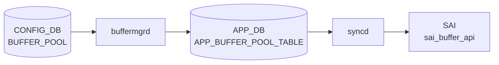

# BUFFER_POOL テーブル

## 概要

ASIC 上の共有 / 専用バッファプールを [CONFIG_DB](../../reference/glossary.md#term-config_db) で定義するテーブル。`BUFFER_PROFILE.pool` から leafref で参照される。`bufferorch` ([orchagent](../../reference/glossary.md#term-orchagent)) または `buffermgrd` (dynamic buffer model) が [CONFIG_DB](../../reference/glossary.md#term-config_db) を購読し、[SAI](../../reference/glossary.md#term-sai) BUFFER_POOL に変換する[^1]。

<!-- cdb-mermaid -->
### データフロー (自動生成)



!!! note "凡例"
    CONFIG_DB から SAI までの典型経路を `docs/reference/config-db-orch-map.md` から機械生成したミニ図。詳細・例外は本ページ本文と対応表を参照。
<!-- /cdb-mermaid -->

## key 構造

```
BUFFER_POOL|<name>
```

慣用名: `ingress_lossless_pool`、`ingress_lossy_pool`、`egress_lossless_pool`、`egress_lossy_pool`。

## 主要フィールド

| フィールド | 型 | 必須 | 説明 |
|-----------|----|------|------|
| `type` | enum `ingress`/`egress`/`both` | yes | プールの方向 |
| `mode` | enum `static`/`dynamic` | yes | 閾値モード |
| `size` | uint64 (bytes) | no | プールサイズ。`percentage` と排他 |
| `xoff` | uint64 (bytes) | no (default 0) | xoff 閾値 (lossless ingress 用) |
| `percentage` | uint8 | no | 利用可能バッファに対する割合 (dynamic buffer model 限定) |

## 制約

- `percentage` は `size` と同時設定できない (`must` 制約)
- `percentage` は `DEVICE_METADATA.localhost.buffer_model = 'dynamic'` のときのみ有効

## 購読者

- **traditional buffer model**: `orchagent` の `BufferOrch`
- **dynamic buffer model**: `buffermgrd` (`docker-swss`) が [CONFIG_DB](../../reference/glossary.md#term-config_db) → [APPL_DB](../../reference/glossary.md#term-appl_db) に展開し、`bufferorch` が [SAI](../../reference/glossary.md#term-sai) 反映
- ベンダ固有のテンプレ (`buffers_*.json.j2`) でハードウェア依存初期値が生成される

## 関連 CONFIG_DB / YANG / CLI

- 関連 CONFIG_DB: `BUFFER_PROFILE`、`BUFFER_PG`、`BUFFER_QUEUE`、`DEVICE_METADATA`
- 関連 CLI: `config buffer`、`mmuconfig`
- 関連 [YANG](../../reference/glossary.md#term-yang): `sonic-buffer-pool`、`sonic-buffer-profile`

<!-- ref-triangle:start -->

## 関連リファレンス

- [YANG](../../reference/glossary.md#term-yang): [`sonic-buffer-pool`](../yang/sonic-buffer-pool.md)
- CLI: [`config buffer`](../cli/config-buffer.md)

<!-- ref-triangle:end -->

## 引用元

[^1]: [YANG](../../reference/glossary.md#term-yang) 定義: `sonic-buffer-pool.yang`. <https://github.com/sonic-net/sonic-buildimage/blob/9ea932ec2e18f35e58268ec2e4456b1d4afd65cd/src/sonic-yang-models/yang-models/sonic-buffer-pool.yang>

<!-- topics-back-ref -->
## 関連 Topics

- [Topics: QoS / Buffer / PFC / Watermark](../../topics/08-qos-buffer/index.md)

<!-- /topics-back-ref -->

<!-- ops-hint -->
## 運用ヒント

### 典型値

- key 形式: `BUFFER_POOL|<pool-name>` (`ingress_lossless_pool` / `egress_lossless_pool` / `egress_lossy_pool` 等)。
- `size`: ASIC 別の SDK 値（例 100G TOR で `12766208`）。
- `type`: `ingress` / `egress`。
- `mode`: `dynamic` / `static`。

### よくある誤設定

- `size` を ASIC 上限超過で入れると bufferorch が `SAI_STATUS_NO_MEMORY` を返し、すべての buffer 設定が止まる。
- `mode: dynamic` を ASIC 未対応のまま使うと [PFC](../../reference/glossary.md#term-pfc) で head-of-line を起こす。`traditional` プラットフォームでは `static`。

### 確認コマンド

```bash
sonic-db-cli CONFIG_DB hgetall 'BUFFER_POOL|ingress_lossless_pool'
show buffer pool
```
<!-- /ops-hint -->

<!-- glossary-links-injected: 44ea702536a5 -->
