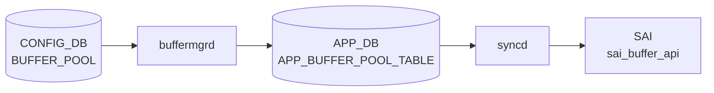

# BUFFER_POOL テーブル

## 概要

ASIC 上の共有 / 専用バッファプールを [CONFIG_DB](../../reference/glossary.md#term-config_db) で定義するテーブル。`BUFFER_PROFILE.pool` から leafref で参照される。`bufferorch` ([orchagent](../../reference/glossary.md#term-orchagent)) または `buffermgrd` (dynamic buffer model) が [CONFIG_DB](../../reference/glossary.md#term-config_db) を購読し、[SAI](../../reference/glossary.md#term-sai) BUFFER_POOL に変換する[^1]。

<!-- cdb-mermaid -->
### データフロー (自動生成)



!!! note "凡例"
    CONFIG_DB から SAI までの典型経路を `docs/reference/config-db-orch-map.md` から機械生成したミニ図。詳細・例外は本ページ本文と対応表を参照。
<!-- /cdb-mermaid -->

## key 構造

```text
BUFFER_POOL|<name>
```

慣用名: `ingress_lossless_pool`、`ingress_lossy_pool`、`egress_lossless_pool`、`egress_lossy_pool`。

## 主要フィールド

| フィールド | 型 | 必須 | 説明 |
|-----------|----|------|------|
| `type` | enum `ingress`/`egress`/`both` | yes | プールの方向 |
| `mode` | enum `static`/`dynamic` | yes | 閾値モード |
| `size` | uint64 (bytes) | no | プールサイズ。`percentage` と排他 |
| `xoff` | uint64 (bytes) | no (default 0) | xoff 閾値 (lossless ingress 用) |
| `percentage` | uint8 | no | 利用可能バッファに対する割合 (dynamic buffer model 限定) |

## 制約

- `percentage` は `size` と同時設定できない (`must` 制約)
- `percentage` は `DEVICE_METADATA.localhost.buffer_model = 'dynamic'` のときのみ有効

## 購読者

- **traditional buffer model**: `orchagent` の `BufferOrch`
- **dynamic buffer model**: `buffermgrd` (`docker-swss`) が [CONFIG_DB](../../reference/glossary.md#term-config_db) → [APPL_DB](../../reference/glossary.md#term-appl_db) に展開し、`bufferorch` が [SAI](../../reference/glossary.md#term-sai) 反映
- ベンダ固有のテンプレ (`buffers_*.json.j2`) でハードウェア依存初期値が生成される

## 関連 CONFIG_DB / YANG / CLI

- 関連 CONFIG_DB: `BUFFER_PROFILE`、`BUFFER_PG`、`BUFFER_QUEUE`、`DEVICE_METADATA`
- 関連 CLI: `config buffer`、`mmuconfig`
- 関連 [YANG](../../reference/glossary.md#term-yang): `sonic-buffer-pool`、`sonic-buffer-profile`

<!-- ref-triangle:start -->

## 関連リファレンス

- [YANG](../../reference/glossary.md#term-yang): [`sonic-buffer-pool`](../yang/sonic-buffer-pool.md)
- CLI: [`config buffer`](../cli/config-buffer.md)

<!-- ref-triangle:end -->

## 引用元

[^1]: [YANG](../../reference/glossary.md#term-yang) 定義: `sonic-buffer-pool.yang`. <https://github.com/sonic-net/sonic-buildimage/blob/9ea932ec2e18f35e58268ec2e4456b1d4afd65cd/src/sonic-yang-models/yang-models/sonic-buffer-pool.yang>

<!-- topics-back-ref -->
## 関連 Topics

- [Topics: QoS / Buffer / PFC / Watermark](../../topics/08-qos-buffer/index.md)

<!-- /topics-back-ref -->

<!-- ops-hint -->
## 運用ヒント

### 典型値

- key 形式: `BUFFER_POOL|<pool-name>` (`ingress_lossless_pool` / `egress_lossless_pool` / `egress_lossy_pool` 等)。
- `size`: ASIC 別の SDK 値（例 100G TOR で `12766208`）。
- `type`: `ingress` / `egress`。
- `mode`: `dynamic` / `static`。

### よくある誤設定

- `size` を ASIC 上限超過で入れると bufferorch が `SAI_STATUS_NO_MEMORY` を返し、すべての buffer 設定が止まる。
- `mode: dynamic` を ASIC 未対応のまま使うと [PFC](../../reference/glossary.md#term-pfc) で head-of-line を起こす。`traditional` プラットフォームでは `static`。

### 確認コマンド

```bash
sonic-db-cli CONFIG_DB hgetall 'BUFFER_POOL|ingress_lossless_pool'
show buffer pool
```
<!-- /ops-hint -->

<!-- value-behavior -->
## 値依存挙動マトリクス

### `type` (enum: `ingress`/`egress`/`both`)

| 値 | SAI 属性 | 備考 |
|----|---------|------|
| `ingress` | `SAI_BUFFER_POOL_TYPE_INGRESS` | ingress 方向のみ。`xoff` 設定は ingress pool でのみ有効 |
| `egress` | `SAI_BUFFER_POOL_TYPE_EGRESS` | egress 方向のみ |
| `both` | `SAI_BUFFER_POOL_TYPE_BOTH` | 双方向プール (一部 ASIC のみ) |

`bufferorch.cpp:443-453` で SAI API に渡される。

### `mode` (enum: `static`/`dynamic`)

| 値 | SAI 属性 | 動作モード | `percentage` フィールド |
|----|---------|-----------|----------------------|
| `static` | `SAI_BUFFER_POOL_THRESHOLD_MODE_STATIC` | `size` (bytes) で固定閾値 | 無効 |
| `dynamic` | `SAI_BUFFER_POOL_THRESHOLD_MODE_DYNAMIC` | Alpha 値で動的閾値 | 有効 (`DEVICE_METADATA.buffer_model=dynamic` のとき) |

`bufferorch.cpp:474-480` で SAI API に渡される。

### `type` × `mode` の組み合わせと `xoff`

| type | mode | `xoff` | 典型 pool 名 |
|------|------|--------|-------------|
| `ingress` | `static` | 有効 (lossless 用) | `ingress_lossless_pool` |
| `ingress` | `dynamic` | 無効 | `ingress_lossy_pool` |
| `egress` | `static` | 無効 | `egress_lossless_pool` |
| `egress` | `dynamic` | 無効 | `egress_lossy_pool` |

<!-- /value-behavior -->

<!-- cdb-exceptions -->
## 例外条件・特殊挙動

| 条件 | 挙動 | ソース |
|------|------|--------|
| `xoff` フィールドが `ingress_lossless_pool` 以外のプールに設定 | `Field xoff is supported for %s only` を LOG_ERROR → xoff は ignored、他フィールドは処理 | `buffermgrdyn.cpp` L2625 |
| `xoff` 値が MMU サイズを超過 | `Invalid xoff %s, exceeding the mmu size` を LOG_ERROR → xoff 無視、pool size は更新 | `buffermgrdyn.cpp` L757 |
| SHP 設定が変化なし | `updated without change, skipped` → APPL_DB への書き込みをスキップ | `buffermgrdyn.cpp` L2614 |
| 同一 pool に複数の zero profile 登録 | `Multiple zero profiles detected for pool %s, takes the former and ignores the latter` を LOG_ERROR | `buffermgrdyn.cpp` L338 |
| Buffer pools が未準備の状態でプロファイル設定 | `pending` → プロファイル適用を遅延 | `buffermgrdyn.cpp` L894 |
| 共有バッファプールが未設定 | headroom 計算をスキップ (`No shared buffer pool configured`) | `buffermgrdyn.cpp` L684 |
| `task_invalid_entry` (static モード main loop) | `Failed to process invalid entry, drop it` → エントリを破棄 | `buffermgr.cpp` L585 |
| 既存プロファイルが存在する場合の pool 作成 | `// check if profile already exists - if yes - skip creation` | `buffermgr.cpp` L246 |
<!-- /cdb-exceptions -->


<!-- runtime-trace -->
## 実コンテナ動作トレース

### 段階 1 — Consumer 登録

`buffermgrd` / `buffermgrdyn` → `BufferOrch` (APPL_DB 経由) が CONFIG_DB の `BUFFER_POOL` テーブルを購読する。

`BUFFER_POOL` は `ingress_lossless_pool` / `egress_lossy_pool` 等の名前付きプール。

### 段階 2 — CFG→APPL 翻訳

`APP_BUFFER_POOL_TABLE` に書き込み

### 段階 3 — APPL→SAI

`sai_buffer_api` — `sai_create_buffer_pool` でバッファプール (ingress/egress, static/dynamic) を作成/更新

### 段階 4 — タイミングと副作用

**適用タイミング**: CONFIG_DB 変化を `buffermgrd(yn)` が検知後 APPL_DB に書き込み。`BufferOrch` が SAI pool オブジェクトを作成/更新。既存プールの size 変更は即時反映。

**副作用**: プールサイズ変更はそのプールを参照するすべてのプロファイルの実効バッファ量に影響。`xoff` 変更は PFC threshold に影響する。
<!-- /runtime-trace -->

<!-- entry-points -->
## 書き込み入り口 (Direction A)

対象テーブル: `BUFFER_POOL`

### CLI
- `config buffer pool add/del <name> ...`
  - ソース: `sonic-utilities/config/main.py (buffer グループ)`

### minigraph / sonic-cfggen
- あり: `sonic-cfggen -m <minigraph.xml>` 実行時に本テーブルが生成・上書きされる

### REST / gNMI (sonic-mgmt-common)
- なし (対応 OpenConfig/SONiC YANG transformer なし)

### db_migrator
- なし

### ビルド時デフォルト (init_cfg / j2 テンプレート)
- `buffers_config.j2` テンプレートからプラットフォーム別プールが生成

### ハードコードデフォルト
- なし

### ランタイム注入 (デーモン自動書き込み)
- Dynamic buffer model では `buffermgrd` がプールサイズを自動調整
<!-- /entry-points -->


<!-- derivation -->
## 派生・条件付き登録 (Phase 6/7)

### Phase 6: 値による他フィールド自動派生

| 条件 | 派生先 | evidence |
|---|---|---|
| DB 移行: 旧 DB の BUFFER_POOL エントリのフィールド区切り文字を更新 | `BUFFER_POOL` のフィールド値を新形式に変換 | `sonic-utilities/scripts/db_migrator.py:447` |
| Dynamic buffer model: `size` フィールドが未指定 | `bufferPool.dynamic_size = true` → buffermgrd がプールサイズを動的計算して APPL_DB へ書き込む | `sonic-swss/cfgmgr/buffermgrdyn.cpp:2525,2534` |

### Phase 7: 条件付き module/manager 登録

| 条件 | 登録 module | evidence |
|---|---|---|
| 常時（条件なし） | `BufferMgrDynamic` が `BUFFER_POOL` を `handleBufferPoolTable` に登録 | `sonic-swss/cfgmgr/buffermgrdyn.cpp:443` |

### grep カバレッジ

- buffermgrdyn.cpp L443: BUFFER_POOL ハンドラ登録（条件なし）
- buffermgrdyn.cpp L2525/2534: dynamic_size フラグ分岐
<!-- /derivation -->
<!-- handler-branching -->
### Phase 8: Handler メソッド内分岐

| Manager / Handler | メソッド | 分岐条件 | 効果 | evidence |
|---|---|---|---|---|
| `BufferMgrDynamic` | `handleBufferPoolTable()` | `op == SET_COMMAND` かつ `size` フィールドなし | `dynamic_size = true` → プールサイズを動的計算モードで APPL_DB へ書き込む | `sonic-swss/cfgmgr/buffermgrdyn.cpp:2525` |
| `BufferMgrDynamic` | `handleBufferPoolTable()` | `size` フィールドあり | `dynamic_size = false` → 指定サイズをそのまま APPL_DB へ書き込む | `sonic-swss/cfgmgr/buffermgrdyn.cpp:2534` |
| `BufferMgrDynamic` | `handleBufferPoolTable()` | `xoff` フィールドあり（SHP 設定） | Shared Headroom Pool サイズを計算・更新 | `sonic-swss/cfgmgr/buffermgrdyn.cpp:2539` |
| `BufferMgrDynamic` | `handleBufferPoolTable()` | `op == DEL_COMMAND` | プールを APPL_DB から削除し内部キャッシュを更新 | `sonic-swss/cfgmgr/buffermgrdyn.cpp:2634` |

> **スキャン証跡**: `handleBufferPoolTable` L2509-2669 全行読了。dynamic_size フラグと SHP xoff フィールド有無が核心分岐。4 件抽出。
<!-- /handler-branching -->
<!-- ordering -->
## 書込み順依存・タイミング依存 (Phase B)

### 必須書込み順序

BUFFER_POOL → BUFFER_PROFILE → BUFFER_PG / BUFFER_QUEUE の順で CONFIG_DB に書くことが必須。逆順でも最終的には retry で収束するが、dynamic buffer model の warm reboot では失敗の原因になる。

| # | 依存関係 | 種別 | 根拠 |
|---|----------|------|------|
| 1 | **BUFFER_POOL → BUFFER_PROFILE** | 強制先行必須 | `m_bufferPoolReady == false` のとき `updateBufferProfileToDb()` は即 return し pending。`bufferorch` は pool 参照未解決で `task_need_retry` | `buffermgrdyn.cpp` L840-898, `bufferorch.cpp` L638-655 |
| 2 | **BUFFER_PROFILE → BUFFER_PG / BUFFER_QUEUE** | 強制先行必須 | profile 参照未解決で `task_need_retry`。profile 未作成では PG / QUEUE も作れない | `bufferorch.cpp` L964-972, L1340-1348 |
| 3 | **PORT オブジェクト存在 → BUFFER_PG / BUFFER_QUEUE** | 強制先行必須 | ポート不在なら `task_invalid_entry` で破棄。admin up **前**に PG/QUEUE を書くことが推奨 | `bufferorch.cpp` L1033-1036, L1577-1585 |
| 4 | **SAI create-only 制約**: pool 作成前に `type`/`mode` 確定 | 作成後変更不可 | 作成後の `type`/`mode` 変更はサイレントスキップ。YANG 非記載 | `bufferorch.cpp` L437-471 |
| 5 | **zero pool → zero profile**（投入）/ **zero profile → zero pool**（削除） | vendor 構成限定 | `"The zero profiles are removed first and then the zero pools"` | `buffermgrdyn.cpp` L236-239 |
| 6 | **dynamic model**: `m_bufferPoolReady` ゲート | dynamic 専用 | Lua plugin によるプールサイズ計算完了まで全上位オブジェクトの SAI 反映をブロック | `buffermgrdyn.cpp` L686-695, L840-857 |

### PORT 先行の詳細

`bufferorch` は BUFFER_PG / BUFFER_QUEUE を処理する際、ポートオブジェクトが存在しなければ `task_invalid_entry` を返してエントリを破棄する（`bufferorch.cpp` L1033-1036, L1113-1114）。また、初期設定以外で admin up 済みポートに PG プロファイルを適用すると `SWSS_LOG_WARN("PG profile '%s' applied after port %s is up")` が出力される。PG / QUEUE はポートの admin up **前**に設定するのが正しい順序。

### SAI create-only 属性（変更不可フィールド）

以下のフィールドは SAI オブジェクト**作成時のみ**有効。既存オブジェクトへの変更は SAI に反映されず LOG_INFO のみ出力される。変更するには SAI オブジェクト削除→再作成が必要。

| テーブル | フィールド | SAI 属性 | evidence |
|---------|-----------|----------|---------|
| `BUFFER_POOL` | `type` | `SAI_BUFFER_POOL_ATTR_TYPE` | `bufferorch.cpp` L437-441 |
| `BUFFER_POOL` | `mode` | `SAI_BUFFER_POOL_ATTR_THRESHOLD_MODE` | `bufferorch.cpp` L469-471 |
| `BUFFER_PROFILE` | `pool` | `SAI_BUFFER_PROFILE_ATTR_POOL_ID` | `bufferorch.cpp` L656-658 |
| `BUFFER_PROFILE` | `dynamic_th` / `static_th` 型変更 | `SAI_BUFFER_PROFILE_ATTR_THRESHOLD_MODE` | `bufferorch.cpp` L694-698 |

> **スキャン証跡**: `buffermgr.cpp` L1-600 全行読了、`buffermgrdyn.cpp` L230-970 / L2509-2669 全行読了、`bufferorch.cpp` L89-700 / L960-1590 全行読了。順序依存 6 件検出。
<!-- /ordering -->

<!-- defaults -->
## コード由来の暗黙デフォルト / 実装乖離 (Phase A)

### `xoff` — YANG default と実装 fallback が一致

YANG: `default 0`。`buffermgrdyn.cpp` も `newSHPSize = "0"` で初期化 (L2523)。乖離なし。

### `size` — 不在時は Lua plugin へサイレント委譲

`size` フィールドが CONFIG_DB に存在しない場合、`buffermgrdyn.cpp` は `bufferPool.dynamic_size = true` を立て、**APPL_DB への書き込みを遅延**する。実効サイズは Mellanox/Barefoot の Lua plugin (`buffer_pool_mellanox.lua`) が MMU 使用量から逆算して APPL_DB へ書き込む。`buffermgrdyn.cpp` 自身は APPL_DB を更新しない (silent defer)。

さらに `ingress_lossless_pool` は `dynamic_size=true` かつ `overSubscribeRatio` 非ゼロかつ SHP が size で有効でない場合、`dontUpdatePoolToDb=true` となり APPL_DB への直接書き込みが完全にスキップされる (`buffermgrdyn.cpp` L2555-2628)。

### `type` — `both` は内部キャッシュで `EGRESS` 扱い (乖離)

`buffermgrdyn.cpp` L2544-2549 の分岐:

```cpp
if (value == buffer_value_ingress)
    bufferPool.direction = BUFFER_INGRESS;
else
    bufferPool.direction = BUFFER_EGRESS;  // "both" はここに落ちる
```

`type=both` を設定すると内部キャッシュの `direction` は `BUFFER_EGRESS` になる。raw 文字列はそのまま APPL_DB に転送されるため SAI 側では `SAI_BUFFER_POOL_TYPE_BOTH` を受け取るが、buffermgrdyn の headroom 計算では ingress 側プールとして参照されなくなる可能性がある。

### `type` / `mode` — SAI では create-only 属性 (YANG に記述なし)

`bufferorch.cpp` L437-441 / L467-471: 既存 SAI オブジェクトに対する更新操作では `type` と `mode` フィールドが**サイレントスキップ**される (LOG_INFO 出力のみ)。YANG にはこの制約が記述されていない。**プール作成後に `type` や `mode` を変更しても SAI には反映されない。**

### `percentage` — bufferorch では dead field (LOG_ERROR + skip)

`bufferorch.cpp` L497-501: `percentage` は不明フィールドとして `LOG_ERROR("Unknown pool field specified")` を出力し SAI に渡さない。`percentage` は Lua plugin (`buffer_pool_mellanox.lua`) のみが APPL_DB から読み取り実効サイズ計算に使用する。Lua plugin を持たないプラットフォームでは完全に無視される。

### 書き込み経路別 field 扱い早見表

| フィールド | buffermgr (static 専用) | buffermgrdyn (dynamic 専用) | bufferorch (SAI) |
|-----------|------------------------|---------------------------|-----------------|
| `type` | pass-through | cache (`both`→`EGRESS`) + forward | SAI (create-only、更新時スキップ) |
| `mode` | pass-through | cache + forward | SAI (create-only、更新時スキップ) |
| `size` | pass-through | `dynamic_size` フラグ制御 | `SAI_BUFFER_POOL_ATTR_SIZE` |
| `xoff` | pass-through | SHP 計算トリガ | `SAI_BUFFER_POOL_ATTR_XOFF_SIZE` |
| `percentage` | pass-through (無意味) | forward のみ (未読取) | LOG_ERROR + skip (SAI 非反映) |

> **証跡**: `buffermgrdyn.cpp` L2509-2669 全行読了、`bufferorch.cpp` L391-596 全行読了、`buffermgr.cpp` L337-410 全行読了、`buffer_pool_mellanox.lua` L440-476 全行読了。
<!-- /defaults -->
<!-- glossary-links-injected: 44ea702536a5 -->
