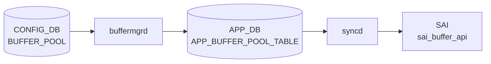

# BUFFER_POOL テーブル

## 概要

[ASIC](../../reference/glossary.md#term-asic) 上の共有 / 専用バッファプールを [CONFIG_DB](../../reference/glossary.md#term-config_db) で定義するテーブル。`BUFFER_PROFILE.pool` から leafref で参照される。`bufferorch` ([orchagent](../../reference/glossary.md#term-orchagent)) または `buffermgrd` (dynamic buffer model) が [CONFIG_DB](../../reference/glossary.md#term-config_db) を購読し、[SAI](../../reference/glossary.md#term-sai) BUFFER_POOL に変換する[^1]。

<!-- cdb-mermaid -->
### データフロー (自動生成)



!!! note "凡例"
    CONFIG_DB から SAI までの典型経路を `docs/reference/config-db-orch-map.md` から機械生成したミニ図。詳細・例外は本ページ本文と対応表を参照。
<!-- /cdb-mermaid -->

## key 構造

```text
BUFFER_POOL|<name>
```

慣用名: `ingress_lossless_pool`、`ingress_lossy_pool`、`egress_lossless_pool`、`egress_lossy_pool`。

## 主要フィールド

| フィールド | 型 | 必須 | 説明 |
|-----------|----|------|------|
| `type` | enum `ingress`/`egress`/`both` | yes | プールの方向 |
| `mode` | enum `static`/`dynamic` | yes | 閾値モード |
| `size` | uint64 (bytes) | no | プールサイズ。`percentage` と排他 |
| `xoff` | uint64 (bytes) | no (default 0) | xoff 閾値 (lossless ingress 用) |
| `percentage` | uint8 | no | 利用可能バッファに対する割合 (dynamic buffer model 限定) |

## 制約

- `percentage` は `size` と同時設定できない (`must` 制約)
- `percentage` は `DEVICE_METADATA.localhost.buffer_model = 'dynamic'` のときのみ有効

## 購読者

- **traditional buffer model**: `orchagent` の `BufferOrch`
- **dynamic buffer model**: `buffermgrd` (`docker-swss`) が [CONFIG_DB](../../reference/glossary.md#term-config_db) → [APPL_DB](../../reference/glossary.md#term-appl_db) に展開し、`bufferorch` が [SAI](../../reference/glossary.md#term-sai) 反映
- ベンダ固有のテンプレ (`buffers_*.json.j2`) でハードウェア依存初期値が生成される

## 関連 CONFIG_DB / YANG / CLI

- 関連 CONFIG_DB: `BUFFER_PROFILE`、`BUFFER_PG`、`BUFFER_QUEUE`、`DEVICE_METADATA`
- 関連 CLI: `config buffer`、`mmuconfig`
- 関連 [YANG](../../reference/glossary.md#term-yang): `sonic-buffer-pool`、`sonic-buffer-profile`

<!-- ref-triangle:start -->

## 関連リファレンス

- [YANG](../../reference/glossary.md#term-yang): [`sonic-buffer-pool`](../yang/sonic-buffer-pool.md)
- CLI: [`config buffer`](../cli/config-buffer.md)

<!-- ref-triangle:end -->

## 引用元

[^1]: [YANG](../../reference/glossary.md#term-yang) 定義: `sonic-buffer-pool.yang`. <https://github.com/sonic-net/sonic-buildimage/blob/9ea932ec2e18f35e58268ec2e4456b1d4afd65cd/src/sonic-yang-models/yang-models/sonic-buffer-pool.yang>

<!-- topics-back-ref -->
## 関連 Topics

- [Topics: QoS / Buffer / PFC / Watermark](../../topics/08-qos-buffer/index.md)

<!-- /topics-back-ref -->

<!-- ops-hint -->
## 運用ヒント

### 典型値

- key 形式: `BUFFER_POOL|<pool-name>` (`ingress_lossless_pool` / `egress_lossless_pool` / `egress_lossy_pool` 等)。
- `size`: [ASIC](../../reference/glossary.md#term-asic) 別の SDK 値（例 100G TOR で `12766208`）。
- `type`: `ingress` / `egress`。
- `mode`: `dynamic` / `static`。

### よくある誤設定

- `size` を [ASIC](../../reference/glossary.md#term-asic) 上限超過で入れると bufferorch が `SAI_STATUS_NO_MEMORY` を返し、すべての buffer 設定が止まる。
- `mode: dynamic` を ASIC 未対応のまま使うと [PFC](../../reference/glossary.md#term-pfc) で head-of-line を起こす。`traditional` プラットフォームでは `static`。

### 確認コマンド

```bash
sonic-db-cli CONFIG_DB hgetall 'BUFFER_POOL|ingress_lossless_pool'
show buffer pool
```
<!-- /ops-hint -->

<!-- value-behavior -->
## 値依存挙動マトリクス

### `type` (enum: `ingress`/`egress`/`both`)

| 値 | [SAI](../../reference/glossary.md#term-sai) 属性 | 備考 |
|----|---------|------|
| `ingress` | `SAI_BUFFER_POOL_TYPE_INGRESS` | ingress 方向のみ。`xoff` 設定は ingress pool でのみ有効 |
| `egress` | `SAI_BUFFER_POOL_TYPE_EGRESS` | egress 方向のみ |
| `both` | `SAI_BUFFER_POOL_TYPE_BOTH` | 双方向プール (一部 ASIC のみ) |

`bufferorch.cpp:443-453` で SAI API に渡される。

### `mode` (enum: `static`/`dynamic`)

| 値 | SAI 属性 | 動作モード | `percentage` フィールド |
|----|---------|-----------|----------------------|
| `static` | `SAI_BUFFER_POOL_THRESHOLD_MODE_STATIC` | `size` (bytes) で固定閾値 | 無効 |
| `dynamic` | `SAI_BUFFER_POOL_THRESHOLD_MODE_DYNAMIC` | Alpha 値で動的閾値 | 有効 (`DEVICE_METADATA.buffer_model=dynamic` のとき) |

`bufferorch.cpp:474-480` で SAI API に渡される。

### `type` × `mode` の組み合わせと `xoff`

| type | mode | `xoff` | 典型 pool 名 |
|------|------|--------|-------------|
| `ingress` | `static` | 有効 (lossless 用) | `ingress_lossless_pool` |
| `ingress` | `dynamic` | 無効 | `ingress_lossy_pool` |
| `egress` | `static` | 無効 | `egress_lossless_pool` |
| `egress` | `dynamic` | 無効 | `egress_lossy_pool` |

<!-- /value-behavior -->

<!-- cdb-exceptions -->
## 例外条件・特殊挙動

| 条件 | 挙動 | ソース |
|------|------|--------|
| `xoff` フィールドが `ingress_lossless_pool` 以外のプールに設定 | `Field xoff is supported for %s only` を LOG_ERROR → xoff は ignored、他フィールドは処理 | `buffermgrdyn.cpp` L2625 |
| `xoff` 値が [MMU](../../reference/glossary.md#term-mmu) サイズを超過 | `Invalid xoff %s, exceeding the mmu size` を LOG_ERROR → xoff 無視、pool size は更新 | `buffermgrdyn.cpp` L757 |
| SHP 設定が変化なし | `updated without change, skipped` → [APPL_DB](../../reference/glossary.md#term-appl_db) への書き込みをスキップ | `buffermgrdyn.cpp` L2614 |
| 同一 pool に複数の zero profile 登録 | `Multiple zero profiles detected for pool %s, takes the former and ignores the latter` を LOG_ERROR | `buffermgrdyn.cpp` L338 |
| Buffer pools が未準備の状態でプロファイル設定 | `pending` → プロファイル適用を遅延 | `buffermgrdyn.cpp` L894 |
| 共有バッファプールが未設定 | headroom 計算をスキップ (`No shared buffer pool configured`) | `buffermgrdyn.cpp` L684 |
| `task_invalid_entry` (static モード main loop) | `Failed to process invalid entry, drop it` → エントリを破棄 | `buffermgr.cpp` L585 |
| 既存プロファイルが存在する場合の pool 作成 | `// check if profile already exists - if yes - skip creation` | `buffermgr.cpp` L246 |
<!-- /cdb-exceptions -->


<!-- runtime-trace -->
## 実コンテナ動作トレース

### 段階 1 — Consumer 登録

`buffermgrd` / `buffermgrdyn` → `BufferOrch` ([APPL_DB](../../reference/glossary.md#term-appl_db) 経由) が CONFIG_DB の `BUFFER_POOL` テーブルを購読する。

`BUFFER_POOL` は `ingress_lossless_pool` / `egress_lossy_pool` 等の名前付きプール。

### 段階 2 — CFG→APPL 翻訳

`APP_BUFFER_POOL_TABLE` に書き込み

### 段階 3 — APPL→SAI

`sai_buffer_api` — `sai_create_buffer_pool` でバッファプール (ingress/egress, static/dynamic) を作成/更新

### 段階 4 — タイミングと副作用

**適用タイミング**: CONFIG_DB 変化を `buffermgrd(yn)` が検知後 APPL_DB に書き込み。`BufferOrch` が SAI pool オブジェクトを作成/更新。既存プールの size 変更は即時反映。

**副作用**: プールサイズ変更はそのプールを参照するすべてのプロファイルの実効バッファ量に影響。`xoff` 変更は [PFC](../../reference/glossary.md#term-pfc) threshold に影響する。
<!-- /runtime-trace -->

<!-- entry-points -->
## 書き込み入り口 (Direction A)

対象テーブル: `BUFFER_POOL`

### CLI
- `config buffer pool add/del <name> ...`
  - ソース: `sonic-utilities/config/main.py (buffer グループ)`

### minigraph / sonic-cfggen
- あり: `sonic-cfggen -m <minigraph.xml>` 実行時に本テーブルが生成・上書きされる

### REST / gNMI (sonic-mgmt-common)
- なし (対応 OpenConfig/[SONiC](../../reference/glossary.md#term-sonic) YANG transformer なし)

### db_migrator
- なし

### ビルド時デフォルト (init_cfg / j2 テンプレート)
- `buffers_config.j2` テンプレートからプラットフォーム別プールが生成

### ハードコードデフォルト
- なし

### ランタイム注入 (デーモン自動書き込み)
- Dynamic buffer model では `buffermgrd` がプールサイズを自動調整
<!-- /entry-points -->


<!-- derivation -->
## 派生・条件付き登録 (Phase 6/7)

### Phase 6: 値による他フィールド自動派生

| 条件 | 派生先 | evidence |
|---|---|---|
| DB 移行: 旧 DB の BUFFER_POOL エントリのフィールド区切り文字を更新 | `BUFFER_POOL` のフィールド値を新形式に変換 | `sonic-utilities/scripts/db_migrator.py:447` |
| Dynamic buffer model: `size` フィールドが未指定 | `bufferPool.dynamic_size = true` → buffermgrd がプールサイズを動的計算して APPL_DB へ書き込む | `sonic-swss/cfgmgr/buffermgrdyn.cpp:2525,2534` |

### Phase 7: 条件付き module/manager 登録

| 条件 | 登録 module | evidence |
|---|---|---|
| 常時（条件なし） | `BufferMgrDynamic` が `BUFFER_POOL` を `handleBufferPoolTable` に登録 | `sonic-swss/cfgmgr/buffermgrdyn.cpp:443` |

### grep カバレッジ

- buffermgrdyn.cpp L443: BUFFER_POOL ハンドラ登録（条件なし）
- buffermgrdyn.cpp L2525/2534: dynamic_size フラグ分岐
<!-- /derivation -->
<!-- handler-branching -->
### Phase 8: Handler メソッド内分岐

| Manager / Handler | メソッド | 分岐条件 | 効果 | evidence |
|---|---|---|---|---|
| `BufferMgrDynamic` | `handleBufferPoolTable()` | `op == SET_COMMAND` かつ `size` フィールドなし | `dynamic_size = true` → プールサイズを動的計算モードで APPL_DB へ書き込む | `sonic-swss/cfgmgr/buffermgrdyn.cpp:2525` |
| `BufferMgrDynamic` | `handleBufferPoolTable()` | `size` フィールドあり | `dynamic_size = false` → 指定サイズをそのまま APPL_DB へ書き込む | `sonic-swss/cfgmgr/buffermgrdyn.cpp:2534` |
| `BufferMgrDynamic` | `handleBufferPoolTable()` | `xoff` フィールドあり（SHP 設定） | Shared [Headroom](../../reference/glossary.md#term-headroom) Pool サイズを計算・更新 | `sonic-swss/cfgmgr/buffermgrdyn.cpp:2539` |
| `BufferMgrDynamic` | `handleBufferPoolTable()` | `op == DEL_COMMAND` | プールを APPL_DB から削除し内部キャッシュを更新 | `sonic-swss/cfgmgr/buffermgrdyn.cpp:2634` |

> **スキャン証跡**: `handleBufferPoolTable` L2509-2669 全行読了。dynamic_size フラグと SHP xoff フィールド有無が核心分岐。4 件抽出。
<!-- /handler-branching -->
<!-- pubsub -->
## 通信メカニズム (Phase G)

### CONFIG_DB → buffermgr/buffermgrdyn: SubscriberStateTable

`buffermgrd` は `CFG_BUFFER_POOL_TABLE_NAME` を `vector<TableConnector>` に含め `BufferMgrDynamic` へ渡す（`buffermgrd.cpp:177`）。`Orch::addConsumer()` は CONFIG_DB（DB ID = 4）を検出し **`SubscriberStateTable`** を選択する（`orch.cpp:1188-1190`）。

```cpp
// orch.cpp:1186-1196
void Orch::addConsumer(DBConnector *db, string tableName, int pri)
{
    if (db->getDbId() == CONFIG_DB || db->getDbId() == STATE_DB || ...)
        addExecutor(new Consumer(new SubscriberStateTable(db, tableName,
                                 DEFAULT_POP_BATCH_SIZE, pri), this, tableName));
    else
        addExecutor(new Consumer(new ConsumerStateTable(db, tableName, gBatchSize, pri), this, tableName));
}
```

`SubscriberStateTable` は [Redis](../../reference/glossary.md#term-redis) keyspace 通知（`__keyspace@4__:BUFFER_POOL|*` の `PSUBSCRIBE`）を購読し、変更検知後に `HGETALL` で値を再取得して `(key, op, fvs)` タプルを返す。バッチサイズは `DEFAULT_POP_BATCH_SIZE = 128`（`table.h:164`）。static buffer model の `BufferMgr` も同じ `addConsumer()` 経由で `SubscriberStateTable` を使用する。

### buffermgr/buffermgrdyn → APPL_DB: ProducerStateTable

`BufferMgrDynamic` は `handleBufferPoolTable()` 内で `m_applBufferPoolTable.set(pool, fvVector)` / `del(pool)` で APPL_DB に書き込む。`ProducerStateTable` は `LPUSH <TABLE>_KEY_SET` + `HSET` によるチャネルベース通知を実行する（`buffermgrdyn.cpp:2630,2637,885`）。

### APPL_DB BUFFER_POOL_TABLE → bufferorch: ConsumerStateTable

`orchdaemon.cpp:387-394` が `APP_BUFFER_POOL_TABLE_NAME` を `applDb`（APPL_DB）で `BufferOrch` に渡す。APPL_DB は DB ID チェックの else 節にマッチするため **`ConsumerStateTable`**（チャネルベース）が選択される。ディスパッチ先: `BufferOrch::doTask()` → `processBufferPool()`。

### bufferorch → APPL_STATE_DB: ResponsePublisher

SAI 処理後、`bufferorch.cpp` は `m_publisher.publish(APP_BUFFER_POOL_TABLE_NAME, ...)` で結果を APPL_STATE_DB に書き戻す。`m_publisher` は `Orch` 基底の `ResponsePublisher m_publisher{"APPL_STATE_DB"}`（`orch.h:382`）。

- **SET + xoff 非空（SHP 有効）**: xoff フィールドのみ publish（`bufferorch.cpp:554-555`）
- **DEL 完了**: 空 fvs で publish（`bufferorch.cpp:588-589`）
- **SET + xoff 空（SHP 無効）**: `publish()` は呼ばれない

### データフロー

```
CONFIG_DB:BUFFER_POOL
  │  SubscriberStateTable (keyspace通知 → HGETALL)
  ↓  buffermgrdyn: handleBufferPoolTable()
APPL_DB:BUFFER_POOL_TABLE
  │  ConsumerStateTable (チャネル通知)
  ↓  bufferorch: processBufferPool() → SAI
APPL_STATE_DB:BUFFER_POOL_TABLE   ← ResponsePublisher (xoff/DEL 時のみ)
```

| 区間 | 方式 | ソース |
|------|------|--------|
| CONFIG_DB → buffermgrd(yn) | `SubscriberStateTable` (keyspace通知) | `orch.cpp:1188-1190` |
| buffermgrd(yn) → APPL_DB | `ProducerStateTable.set/del` | `buffermgrdyn.cpp:2630,2637` |
| APPL_DB → bufferorch | `ConsumerStateTable` (チャネル) | `orch.cpp:1193-1194` |
| bufferorch → APPL_STATE_DB | `ResponsePublisher.publish` | `bufferorch.cpp:555,589` |
<!-- /pubsub -->
<!-- failure -->
## 失敗挙動マトリクス (Phase D)

ソース: `sonic-swss/cfgmgr/buffermgrdyn.cpp`, `cfgmgr/buffermgr.cpp`, `orchagent/bufferorch.cpp`

### buffermgrdyn — handleBufferPoolTable() 失敗経路

| 失敗条件 | 検出箇所 | 結果 | ログ出力 | evidence |
|---|---|---|---|---|
| `xoff` フィールドが `ingress_lossless_pool` 以外に設定 | `handleBufferPoolTable()` L2623 | `xoff` を無視し他フィールドは正常処理 | `LOG_ERROR("Field xoff is supported for %s only...")` | `buffermgrdyn.cpp:2625` |
| SHP 有効化時に SAI 未準備 (`isSharedHeadroomPoolEnabledInSai()` が false) | `handleBufferPoolTable()` L2573 | `task_need_retry` → Consumer が backoff 後に再試行 | なし | `buffermgrdyn.cpp:2575` |
| SHP 変更後にプロファイルの SAI 同期が未完 | `handleBufferPoolTable()` L2603 | `task_need_retry` → `m_configuredSharedHeadroomPoolSize` をロールバックして再試行 | `SWSS_LOG_NOTICE("Retry mode: checking pending profiles")` | `buffermgrdyn.cpp:2585-2607` |
| `op` が `SET`/`DEL` 以外 | `handleBufferPoolTable()` L2665 | `task_invalid_entry` → エントリ廃棄 | `LOG_ERROR("Unknown operation type %s")` | `buffermgrdyn.cpp:2665` |

### buffermgrdyn — Lua plugin ロード失敗

| 失敗条件 | 検出箇所 | 結果 | ログ出力 | evidence |
|---|---|---|---|---|
| `loadLuaScript()` / `loadRedisScript()` が例外 (dynamic model 初期化時) | コンストラクタ L106-123 | `buffermgrd` が起動を中断 → buffer 管理デーモンが機能しない | `LOG_ERROR("Lua scripts for buffer calculation were not loaded successfully, buffermgrd won't start")` | `buffermgrdyn.cpp:121` |

### buffermgrdyn — updateBufferPoolFromLuaPlugin() 失敗経路

| 失敗条件 | 検出箇所 | 結果 | ログ出力 | evidence |
|---|---|---|---|---|
| Lua plugin が返した `xoff` 値が [MMU](../../reference/glossary.md#term-mmu) サイズ超過 | `updateBufferPoolFromLuaPlugin()` L755 | xoff 更新をスキップ・pool size は更新継続 | `LOG_ERROR("Buffer pool %s: Invalid xoff %s, exceeding the mmu size %s, ignored xoff but the pool size will be updated")` | `buffermgrdyn.cpp:757` |
| Lua plugin が返した pool `size` 値が [MMU](../../reference/glossary.md#term-mmu) サイズ超過 | `updateBufferPoolFromLuaPlugin()` L786 | pool サイズ更新をスキップ → APPL_DB は前値のまま | `LOG_ERROR("Buffer pool %s: Invalid size %s, exceeding the mmu size %s")` | `buffermgrdyn.cpp:788` |
| 共有バッファプール未設定で headroom 計算を要求 | `updateBufferPoolFromLuaPlugin()` L684 | headroom 計算をスキップ (silent) | `SWSS_LOG_NOTICE("No shared buffer pool configured")` | `buffermgrdyn.cpp:684` |

### bufferorch — processBufferPool() 失敗経路

| 失敗条件 | 検出箇所 | 結果 | ログ出力 | evidence |
|---|---|---|---|---|
| `m_pendingRemove` フラグ立ちの pool に SET | `processBufferPool()` L407 | `task_need_retry` | `SWSS_LOG_NOTICE("Entry %s %s is pending remove, need retry")` | `bufferorch.cpp:409-410` |
| pool `type` が `ingress`/`egress`/`both` 以外 | `processBufferPool()` L457 | `task_invalid_entry` → エントリ廃棄 | `LOG_ERROR("Unknown pool type specified:%s")` | `bufferorch.cpp:457-458` |
| pool `mode` が `static`/`dynamic` 以外 | `processBufferPool()` L484 | `task_invalid_entry` → エントリ廃棄 | `LOG_ERROR("Unknown pool mode specified:%s")` | `bufferorch.cpp:484-485` |
| 不明フィールド (`percentage` 等) が pool エントリに含まれる | `processBufferPool()` L499 | フィールドをスキップ・SAI 非反映 | `LOG_ERROR("Unknown pool field specified:%s, ignoring")` | `bufferorch.cpp:499` |
| SAI `set_buffer_pool_attribute` が `SAI_STATUS_ATTR_NOT_IMPLEMENTED_0` | `processBufferPool()` L508 | `task_ignore` → ハードウェア非反映のまま成功扱い | `SWSS_LOG_NOTICE("...not implemented. Ignoring it")` | `bufferorch.cpp:508-511` |
| SAI `set_buffer_pool_attribute` がその他エラー | `processBufferPool()` L513 | `handleSaiSetStatus()` に委譲 → 通常 `task_need_retry` or `task_failed` | `LOG_ERROR("Failed to modify buffer pool...")` | `bufferorch.cpp:515-519` |
| SAI `create_buffer_pool` 失敗 | `processBufferPool()` L528 | `handleSaiCreateStatus()` に委譲 → 通常 `task_need_retry` | `LOG_ERROR("Failed to create buffer pool %s...")` | `bufferorch.cpp:530-534` |
| DEL 時に pool がまだ参照されている | `processBufferPool()` L560 | `m_pendingRemove = true` → `task_need_retry` | `SWSS_LOG_NOTICE("Can't remove object %s due to being referenced (%s)")` | `bufferorch.cpp:563-566` |
| SAI `remove_buffer_pool` 失敗 | `processBufferPool()` L573 | `handleSaiRemoveStatus()` に委譲 | `LOG_ERROR("Failed to remove buffer pool %s...")` | `bufferorch.cpp:575-578` |
| `op` が `SET`/`DEL` 以外 | `processBufferPool()` L593 | `task_invalid_entry` → エントリ廃棄 | `LOG_ERROR("Unknown operation type %s")` | `bufferorch.cpp:593` |

### bufferorch — watermark capability 検出失敗

| 失敗条件 | 検出箇所 | 結果 | ログ出力 | evidence |
|---|---|---|---|---|
| `clear_buffer_pool_stats` が `SAI_STATUS_NOT_SUPPORTED` / `SAI_STATUS_NOT_IMPLEMENTED` | `generateBufferPoolWatermarkCounterIdList()` L322 | `noWmClrCapability` ビットセット → 該当 pool の watermark clear を永続スキップ | `SWSS_LOG_NOTICE("Clear watermark failed on %s, rv: %s")` | `bufferorch.cpp:322-325` |
| `loadLuaScript("watermark_bufferpool.lua")` が `runtime_error` | `initFlexCounterGroupTable()` L239 | watermark Lua plugin 未ロード → watermark 統計が収集されない | `LOG_ERROR("Buffer pool watermark lua script...not set successfully. Runtime error: %s")` | `bufferorch.cpp:244` |

### リトライ・廃棄の判断フロー

```
processBufferPool() / handleBufferPoolTable()
  ↓
  task_need_retry    → Consumer が backoff 後に再試行 (例: SAI pending remove, SHP SAI sync 待ち)
  task_invalid_entry → Consumer が当該エントリを廃棄 (例: 不明な op / type / mode)
  task_ignore        → bufferorch が当該 SET を成功扱いで無視 (例: SAI_STATUS_ATTR_NOT_IMPLEMENTED_0)
  task_success       → 正常完了
```

> **スキャン証跡**: `buffermgrdyn.cpp` L100-123, L684-795, L2509-2669 全行読了、`bufferorch.cpp` L232-244, L286-335, L395-597 全行読了、`buffermgr.cpp` L575-590 読了。`task_need_retry` 6件、`task_invalid_entry` 4件、`task_ignore` 1件、`LOG_ERROR` 11件を抽出。
<!-- /failure -->
<!-- defaults -->
## コード由来の暗黙デフォルト / 実装乖離 (Phase A)

### `xoff` — YANG default と実装 fallback が一致

YANG: `default 0`。`buffermgrdyn.cpp` も `newSHPSize = "0"` で初期化 (L2523)。乖離なし。

### `size` — 不在時は Lua plugin へサイレント委譲

`size` フィールドが CONFIG_DB に存在しない場合、`buffermgrdyn.cpp` は `bufferPool.dynamic_size = true` を立て、**APPL_DB への書き込みを遅延**する。実効サイズは Mellanox/Barefoot の Lua plugin (`buffer_pool_mellanox.lua`) が MMU 使用量から逆算して APPL_DB へ書き込む。`buffermgrdyn.cpp` 自身は APPL_DB を更新しない (silent defer)。

さらに `ingress_lossless_pool` は `dynamic_size=true` かつ `overSubscribeRatio` 非ゼロかつ SHP が size で有効でない場合、`dontUpdatePoolToDb=true` となり APPL_DB への直接書き込みが完全にスキップされる (`buffermgrdyn.cpp` L2555-2628)。

### `type` — `both` は内部キャッシュで `EGRESS` 扱い (乖離)

`buffermgrdyn.cpp` L2544-2549 の分岐:

```cpp
if (value == buffer_value_ingress)
    bufferPool.direction = BUFFER_INGRESS;
else
    bufferPool.direction = BUFFER_EGRESS;  // "both" はここに落ちる
```

`type=both` を設定すると内部キャッシュの `direction` は `BUFFER_EGRESS` になる。raw 文字列はそのまま APPL_DB に転送されるため SAI 側では `SAI_BUFFER_POOL_TYPE_BOTH` を受け取るが、buffermgrdyn の headroom 計算では ingress 側プールとして参照されなくなる可能性がある。

### `type` / `mode` — SAI では create-only 属性 (YANG に記述なし)

`bufferorch.cpp` L437-441 / L467-471: 既存 SAI オブジェクトに対する更新操作では `type` と `mode` フィールドが**サイレントスキップ**される (LOG_INFO 出力のみ)。YANG にはこの制約が記述されていない。**プール作成後に `type` や `mode` を変更しても SAI には反映されない。**

### `percentage` — bufferorch では dead field (LOG_ERROR + skip)

`bufferorch.cpp` L497-501: `percentage` は不明フィールドとして `LOG_ERROR("Unknown pool field specified")` を出力し SAI に渡さない。`percentage` は Lua plugin (`buffer_pool_mellanox.lua`) のみが APPL_DB から読み取り実効サイズ計算に使用する。Lua plugin を持たないプラットフォームでは完全に無視される。

### 書き込み経路別 field 扱い早見表

| フィールド | buffermgr (static 専用) | buffermgrdyn (dynamic 専用) | bufferorch (SAI) |
|-----------|------------------------|---------------------------|-----------------|
| `type` | pass-through | cache (`both`→`EGRESS`) + forward | SAI (create-only、更新時スキップ) |
| `mode` | pass-through | cache + forward | SAI (create-only、更新時スキップ) |
| `size` | pass-through | `dynamic_size` フラグ制御 | `SAI_BUFFER_POOL_ATTR_SIZE` |
| `xoff` | pass-through | SHP 計算トリガ | `SAI_BUFFER_POOL_ATTR_XOFF_SIZE` |
| `percentage` | pass-through (無意味) | forward のみ (未読取) | LOG_ERROR + skip (SAI 非反映) |

> **証跡**: `buffermgrdyn.cpp` L2509-2669 全行読了、`bufferorch.cpp` L391-596 全行読了、`buffermgr.cpp` L337-410 全行読了、`buffer_pool_mellanox.lua` L440-476 全行読了。
<!-- /defaults -->

<!-- platform -->
## プラットフォーム・ASIC 差 (Phase H)

### 1. dynamic vs static buffer model

`buffermgrdyn.cpp` L68-80 で `ASIC_VENDOR` 環境変数を読み込みプラットフォームを決定する。  
**Mellanox / Barefoot**: `buffermgrdyn` (dynamic buffer model) が起動し、`buffer_pool_<vendor>.lua` を SAI で実行してプールサイズを逆算する。  
**Broadcom 等**: `buffermgr` (static buffer model) が起動し、ビルド時に事前計算済みの JSON 固定値を APPL_DB に pass-through する。

| 差分点 | dynamic model (Mellanox/Barefoot) | static model (Broadcom 等) |
|---|---|---|
| `size` 省略時 | `dynamic_size = true` → Lua plugin が後書き (`buffermgrdyn.cpp` L2525) | `buffermgr` が pass-through (空のまま APPL_DB も空) |
| `percentage` フィールド | Lua plugin が APPL_DB から読み実効サイズ計算に使用 | bufferorch が `LOG_ERROR("Unknown pool field specified")` → SAI 非反映 (`bufferorch.cpp` L497-501) |
| `ingress_lossless_pool` xoff | Lua plugin が SHP サイズを返し動的更新 | 固定値をそのまま SAI へ |
| `dontUpdatePoolToDb` | `dynamic_size=true` かつ `overSubscribeRatio` 非ゼロかつ SHP size 未設定で APPL_DB 書込みを完全スキップ (`buffermgrdyn.cpp` L2555-2628) | 該当なし |

### 2. Mellanox SN4k/SN5k — 8 lane ポートの xon 値差

`buffermgrdyn.cpp` L504-511: `m_platform == "mellanox"` かつ `lane_count == 8` かつ SN4000 系で非 400G / SN5000 系で非 800G の場合、headroom プロファイルの xon 値を通常の **2 倍**に設定する。これは `ingress_lossless_pool` の SHP (xoff) サイズ計算に間接影響する。Mellanox 以外のプラットフォームにはこの分岐なし。

### 3. ASIC vendor の SAI capability (実行時判定)

bufferorch は静的なベンダ名判定を行わず SAI 戻り値で capability を検出する。

| 判定条件 | 挙動 | ソース |
|---|---|---|
| `SAI_STATUS_NOT_SUPPORTED` / `NOT_IMPLEMENTED` on `clear_buffer_pool_stats` | `noWmClrCapability` ビット記録 → 以降 watermark clear をスキップ (Broadcom DNX / Cisco-8000 系など) | `bufferorch.cpp` L310-322 |
| `SAI_STATUS_ATTR_NOT_IMPLEMENTED_0` on pool 属性 SET | `task_ignore` → ハードウェア非反映のまま APPL_DB 成功扱い | `bufferorch.cpp` L506-512 |
| `type` / `mode` への更新 SET | サイレントスキップ (LOG_INFO のみ、SAI create-only 属性制約) | `bufferorch.cpp` L437-471 |

### 4. VOQ chassis と BUFFER_POOL の関係

`gMySwitchType == "voq"` による分岐は `BUFFER_QUEUE` に集中する。**BUFFER_POOL テーブルの処理経路 (`handleBufferPoolTable` / `processBufferPool`) には [VOQ](../../reference/glossary.md#term-voq) 固有分岐がない**。[VOQ](../../reference/glossary.md#term-voq) chassis でも BUFFER_POOL の key 形式・field 処理・SAI 反映手順は non-[VOQ](../../reference/glossary.md#term-voq) と同一。

`buffers_config.j2` の VOQ 分岐 (L36-38, L278-296) は `BUFFER_QUEUE` の system port 向けエントリ生成のみで、`BUFFER_POOL` 定義ブロック自体は変わらない。

### 5. テンプレートによる初期値差

| ベンダ/HWSKU | dynamic_mode | ingress_lossless_pool.size | xoff 設定 |
|---|---|---|---|
| Mellanox SN2700 (`buffers_dynamic.json.j2`) | あり | 省略 (Lua plugin 計算) | Lua plugin 計算 |
| Mellanox SN2700 (`buffers.json.j2`) | なし | 明示 (`4580864`) | 固定値 |
| Arista 7260CX3 (Broadcom) | なし | 動的計算 (`buffers_pool_sizes_t0.j2` 参照) | `7827456` |
| Celestica Seastone / Delta | なし | プラットフォーム別固定値 | 固定値 |

### まとめ

| 差分軸 | BUFFER_POOL への影響 |
|---|---|
| dynamic model | `size` 省略・`percentage` 有効・Lua 計算 |
| static model | `percentage` は bufferorch で LOG_ERROR+skip |
| Mellanox SN4k/5k 8-lane | xon 2 倍 → SHP xoff 間接影響 |
| watermark clear 非対応 ASIC | SAI status で実行時検出 |
| pool SET 属性未実装 | `task_ignore` → ハードウェア非反映 |
| VOQ chassis | BUFFER_POOL の処理は変化なし |

> **証跡**: `buffermgrdyn.cpp` L68-88, L504-511, L2525, L2555-2628 / `bufferorch.cpp` L310-322, L437-471, L497-501, L506-512, L916, L1049, L1134, L1168 / `buffers_config.j2` L36-38, L265-327, L331-348 / `buffers_defaults_objects.j2` (Mellanox SN2700) / `buffers_defaults_t0.j2` (Arista 7260CX3) 全行読了。
<!-- /platform -->

<!-- cross-refs -->
## 暗黙参照テーブル (Phase C)

`BUFFER_POOL` 自身の YANG leafref 定義は `BUFFER_PROFILE.pool` からの被参照のみだが、実装上の処理経路では以下の 4 テーブルを暗黙参照している。

### 1. DEFAULT_LOSSLESS_BUFFER_PARAMETER (CONFIG_DB)

- **参照先テーブル**: `DEFAULT_LOSSLESS_BUFFER_PARAMETER`
- **参照方向**: 購読 + 読み取り（`over_subscribe_ratio`、`default_dynamic_th`）
- **条件**: dynamic buffer model (`buffermgrdyn`) 起動時のみ
- **参照元**: `buffermgrdyn.cpp:40` (`m_cfgDefaultLosslessBufferParam` メンバ初期化)、`buffermgrdyn.cpp:442` (`handleDefaultLossLessBufferParam` ハンドラ登録)、`buffermgrdyn.cpp:1978-2040` (`handleDefaultLossLessBufferParam()` 実装)、Lua plugin `buffer_headroom_mellanox.lua:105-109` / `buffer_pool_mellanox.lua:261-268`
- **意味**:
  - `over_subscribe_ratio` の変化が Shared [Headroom](../../reference/glossary.md#term-headroom) Pool (SHP) の有効/無効を切り替える。非ゼロ→ゼロへの変化は SHP 無効化・全プロファイルの headroom 再計算をトリガする。
  - `default_dynamic_th` は `m_defaultThreshold` に保持され、`BUFFER_PROFILE` に `dynamic_th` が未指定の場合のフォールバック値として headroom 計算 Lua plugin に渡される。
  - `ingress_lossless_pool` が未設定の状態で SET コマンドを受信すると `task_need_retry` を返し、プール設定完了まで処理を遅延する (`buffermgrdyn.cpp:1987-1992`)。

### 2. ASIC_TABLE (STATE_DB)

- **参照先テーブル**: `ASIC_TABLE` ([STATE_DB](../../reference/glossary.md#term-state_db))
- **参照方向**: 読み取り（Lua plugin 経由）
- **条件**: dynamic buffer model の headroom / pool size 計算時（Mellanox・Barefoot プラットフォームのみ）
- **参照元**: `buffer_headroom_mellanox.lua:62-88`、`buffer_pool_mellanox.lua:289-310`、`buffer_headroom_barefoot.lua:57-75`、`buffer_pool_barefoot.lua:9-20`
- **意味**:
  - Lua plugin が `KEYS('ASIC_TABLE*')` でエントリを取得し、`cell_size`（セル単位変換）、`pipeline_latency`、`mac_phy_delay`、`peer_response_time` を読み取る。
  - これらのパラメータは headroom サイズ式の定数として使用され、最終的に `ingress_lossless_pool` の `xoff` (SHP サイズ) や各プロファイルの headroom に影響する。
  - `ASIC_TABLE` が未設定の場合 Lua plugin は算術エラーを起こし headroom 計算が失敗する（`buffermgrdyn.cpp:648` で WARNING ログ）。
  - `bufferorch.cpp` 経由では `ASIC_TABLE` は参照されない（Lua plugin 専用の読み取り）。

### 3. LOSSLESS_TRAFFIC_PATTERN (CONFIG_DB)

- **参照先テーブル**: `LOSSLESS_TRAFFIC_PATTERN`
- **参照方向**: 読み取り（Lua plugin 経由）
- **条件**: dynamic buffer model の headroom 計算時（Mellanox・Barefoot プラットフォームのみ）
- **参照元**: `buffer_headroom_mellanox.lua:91-103`、`buffer_headroom_barefoot.lua:80-93`
- **意味**:
  - `mtu`（ロスレストラフィックの MTU）と `small_packet_percentage`（セル利用率ワーストケース補正係数）を読み取り、headroom 計算式に組み込む。
  - `small_packet_percentage` が高いほど headroom が大きく算出され、`ingress_lossless_pool` の xoff (SHP サイズ) が増加する方向に働く。
  - `LOSSLESS_TRAFFIC_PATTERN` が未設定の場合、Lua plugin の `lossless_mtu` / `small_packet_percentage` が nil となり headroom 計算が失敗する。

### 4. PORT_QOS_MAP (CONFIG_DB)

- **参照先テーブル**: `PORT_QOS_MAP`
- **参照方向**: 購読 + 読み取り（`pfc_enable` フィールド）
- **条件**: static buffer model (`buffermgr`) 起動時のみ
- **参照元**: `buffermgrd.cpp:201` (`CFG_PORT_QOS_MAP_TABLE_NAME` を購読リストに追加)、`buffermgr.cpp:517-519` (`doPortQosTableTask()` ルーティング)、`buffermgr.cpp:416-462` (`doPortQosTableTask()` 実装)
- **意味**:
  - `pfc_enable` フィールドの変化（[PFC](../../reference/glossary.md#term-pfc) が有効なキューの変更）を検知すると `doSpeedUpdateTask()` を呼び出し、該当ポートの headroom プロファイルを再計算して APPL_DB へ書き込む。
  - PFC 有効キューが変わると `ingress_lossless_pool` の実効使用量（PG headroom 合計）が変化するため BUFFER_POOL の間接的な影響を受ける。
  - `PORT_QOS_MAP` エントリが未設定の場合、`buffermgr.cpp:175` のコメントにあるとおり `BUFFER_PG` 通知をクリアして `pfc_enable` が届いてから再処理する遅延ロジックが働く。

### 参照関係サマリ

```
BUFFER_POOL
  ├─ [暗黙/dynamic-only] DEFAULT_LOSSLESS_BUFFER_PARAMETER  (over_subscribe_ratio → SHP on/off、default_dynamic_th → フォールバック閾値)
  ├─ [暗黙/lua-only]     STATE_DB.ASIC_TABLE                (cell_size / pipeline_latency / mac_phy_delay / peer_response_time → headroom 計算定数)
  ├─ [暗黙/lua-only]     LOSSLESS_TRAFFIC_PATTERN           (mtu / small_packet_percentage → headroom 計算パラメータ)
  └─ [暗黙/static-only]  PORT_QOS_MAP                       (pfc_enable → headroom 再計算トリガ)
```

> **スキャン証跡**: `buffermgrdyn.cpp` L40, L150-153, L442, L605-815, L1978-2040 読了 / `buffermgr.cpp` L167-176, L413-462, L517-519 読了 / `buffermgrd.cpp` L183-201 読了 / `buffer_headroom_mellanox.lua` L9-115 読了 / `buffer_pool_mellanox.lua` L261-310 読了 / `buffer_headroom_barefoot.lua` L8-93 読了 / `buffer_pool_barefoot.lua` L9-20 読了。
<!-- /cross-refs -->
<!-- ordering -->
## 登録順序依存 (Phase B)

BUFFER_POOL → BUFFER_PROFILE → [BUFFER_PG](../../reference/glossary.md#term-buffer-pg) / BUFFER_QUEUE の 3 段が依存関係を形成する。
誤順序で登録すると `task_need_retry` や SAI create-only 属性の乖離が生じる。

### 1. Pool → Profile → PG/Queue の必須順

| 順序 | テーブル | 根拠 |
|------|---------|------|
| 1 | `BUFFER_POOL` | `BUFFER_PROFILE.pool` leafref の参照先が未存在だと `ref_resolve_status::not_resolved` → `task_need_retry` | 
| 2 | `BUFFER_PROFILE` | PG/Queue がプロファイルを参照。Pool が SAI 登録済みでないと `resolveFieldRefValue` が pool OID を解決できない |
| 3 | `BUFFER_PG` / `BUFFER_QUEUE` | ポートが admin up になる前にプロファイルを適用しないと WARN ログが出力される |

ソース: `bufferorch.cpp:640-662` — `BUFFER_PROFILE` の pool 解決で `ref_resolve_status::not_resolved` を検出すると `task_need_retry` を返す。  
ソース: `bufferorch.cpp:1206-1210` (BUFFER_QUEUE) / `bufferorch.cpp:1576-1580` ([BUFFER_PG](../../reference/glossary.md#term-buffer-pg)) — ポートが up 後にプロファイルを適用すると `SWSS_LOG_WARN` を出力。

### 2. SAI create-only 制約（Pool）

`BUFFER_POOL` の `type` (`SAI_BUFFER_POOL_ATTR_TYPE`) と `mode` (`SAI_BUFFER_POOL_ATTR_THRESHOLD_MODE`) は **SAI create-only 属性**。
既存 SAI オブジェクトへの更新 SET では LOG_INFO のみでスキップされ、**SAI には非反映**となる。

```text
既存 pool に SET → bufferorch が type / mode フィールドを検出
  → "Skip setting buffer pool type/mode ... for pool ..." (LOG_INFO のみ)
  → SAI set_buffer_pool_attribute は呼ばれない
```

ソース: `bufferorch.cpp:437-441` (type)、`bufferorch.cpp:467-471` (mode)

同様に `BUFFER_PROFILE.pool` (`SAI_BUFFER_PROFILE_ATTR_POOL_ID`) と threshold mode も create-only。
プロファイル作成後に pool を変更しても SAI には反映されない (`bufferorch.cpp:656-658`、`bufferorch.cpp:694-712`)。

### 3. Lua plugin の起動順（dynamic buffer model）

`BufferMgrDynamic` コンストラクタは以下の順序で 3 本の Lua plugin を [Redis](../../reference/glossary.md#term-redis) に登録する。
いずれか 1 本でもロードに失敗すると例外をキャッチして `buffermgrd` が起動中断する。

| 順序 | plugin ファイル名 | 役割 |
|------|-----------------|------|
| 1 | `buffer_headroom_<platform>.lua` | headroom サイズ計算 (ASIC_TABLE + LOSSLESS_TRAFFIC_PATTERN 参照) |
| 2 | `buffer_pool_<platform>.lua` | プールサイズ・xoff (SHP) 計算 |
| 3 | `buffer_check_headroom_<platform>.lua` | headroom 超過チェック |

ソース: `buffermgrdyn.cpp:76-78` (plugin 名生成)、`buffermgrdyn.cpp:108-114` (ロード順序)、`buffermgrdyn.cpp:121` (起動中断ログ)

Lua plugin がロード完了する前に `handleBufferPoolTable()` で pool サイズ計算が要求されると、
Lua script SHA が空のまま `evalsha` が呼ばれてエラーになる。
このため **plugin ロードは pool エントリ処理よりも必ず先行する**。

### 4. zero profile の登録順

zero buffer pool を zero buffer profile より先に CONFIG_DB に登録しなければならない。
`buffermgrdyn.cpp:236-237` のコメント通り、`buffers_*.json` テンプレート内のエントリ順序が依存関係を決定する。

```
// They are loaded into APPL_DB in an order in which they occur in the json file,
// which means it's vendor's responsibility to guarantee the order reflects
// the dependency among zero pools and profiles.
```

zero profile の削除は zero pool よりも先に行う（依存関係の逆順）。  
ソース: `buffermgrdyn.cpp:239` — `The zero profiles are removed first and then the zero pools.`

### まとめ

```
[起動時]
  1. Lua plugin ロード (headroom → pool → check_headroom)
  2. BUFFER_POOL SAI 作成  ← type / mode は create-only
  3. BUFFER_PROFILE SAI 作成 (pool OID 解決後)
  4. BUFFER_PG / BUFFER_QUEUE 適用 (ポート admin-up 前に完了)

[削除時]
  BUFFER_PG/QUEUE → BUFFER_PROFILE → BUFFER_POOL (zero: profile 先削除 → pool 削除)
```

> **スキャン証跡**: `bufferorch.cpp` L437-471, L640-662, L694-712, L1206-1210, L1576-1580 / `buffermgrdyn.cpp` L76-78, L108-114, L121, L232-239 読了。
<!-- /ordering -->
<!-- side-effects -->
## 副次 DB 書込 (Phase F)

`BufferOrch` は `BUFFER_POOL` の SET/DEL 処理後に APPL_STATE_DB・[COUNTERS_DB](../../reference/glossary.md#term-counters_db)・[FLEX_COUNTER_DB](../../reference/glossary.md#term-flex_counter_db) へ副次書き込みを行う。`buffermgrdyn` は [STATE_DB](../../reference/glossary.md#term-state_db) を読み取るのみで書き込みは発生しない。

### APPL_STATE_DB / `APP_BUFFER_POOL_TABLE`

SAI buffer pool 操作完了後、`m_publisher.publish()` が APPL_STATE_DB へ書き込む。
書き込みは **xoff (Shared [Headroom](../../reference/glossary.md#term-headroom) Pool) フィールドが空でない場合のみ**発生する。

| トリガ | フィールド | 値 | evidence |
|--------|------------|-----|----------|
| SHP (xoff) 有効プールの SAI 適用成功 (SET) | `xoff` | 計算済み SHP サイズ (bytes 文字列) | `bufferorch.cpp:555` |
| DEL 操作完了後 | — (エントリ削除) | — | `bufferorch.cpp:589` |

実装: `orch.h:382` — `ResponsePublisher m_publisher{"APPL_STATE_DB"}`。
`response_publisher.cpp:141-143` — SAI 成功時は intent_attrs を state_attrs として APPL_STATE_DB に書き込む。

!!! note "通常プール（xoff なし）は書込なし"
    `ingress_lossy_pool` / `egress_lossless_pool` 等 xoff フィールドを持たないプールでは `m_publisher.publish()` は呼ばれない (`bufferorch.cpp:549-556`)。

### COUNTERS_DB / `COUNTERS_BUFFER_POOL_NAME_MAP`

新規プール作成時に pool 名 → SAI OID マッピングを `COUNTERS_DB` の hash に登録する。

| トリガ | 操作 | フィールド | 値 | evidence |
|--------|------|-----------|-----|----------|
| SAI pool 新規作成成功 (SET) | `hset` | `<pool_name>` | SAI OID 文字列 | `bufferorch.cpp:546` |
| SAI pool 削除成功 (DEL) | `hdel` | `<pool_name>` | — | `bufferorch.cpp:586` |

実装: `bufferorch.cpp:55` — `CounterNameMapUpdater("COUNTERS_DB", COUNTERS_BUFFER_POOL_NAME_MAP)`。

!!! note "既存プール更新時は登録スキップ"
    SET 操作が既存プールへの更新の場合は `setCounterNameMap` が呼ばれず COUNTERS_DB への書き込みは発生しない (`bufferorch.cpp:540-547`)。

### FLEX_COUNTER_DB / `BUFFER_POOL_WATERMARK`

バッファプール watermark のポーリング設定を [FLEX_COUNTER_DB](../../reference/glossary.md#term-flex_counter_db) に書き込む。
FlexCounterOrch から `FLEX_COUNTER_STATUS=enable` を受信した際に全プール分を一括登録する。

| トリガ | 操作 | キー | フィールド | evidence |
|--------|------|------|-----------|----------|
| `FLEX_COUNTER_STATUS=enable` 受信時 | `set` | `BUFFER_POOL_WATERMARK:<sai_oid>` | `BUFFER_POOL_COUNTER_ID_LIST=<stat_list>` | `bufferorch.cpp:358` |
| プール削除時 (DEL) | `del` | `BUFFER_POOL_WATERMARK:<sai_oid>` | — | `bufferorch.cpp:281-282` |
| 起動時 (group 初期化) | `set` | `FLEX_COUNTER_GROUP_TABLE:BUFFER_POOL_WATERMARK` | plugin SHA + poll interval | `bufferorch.cpp:247-252` |

実装: `bufferorch.cpp:62` — コンストラクタで `initFlexCounterGroupTable()` を呼び出し。
`saihelper.cpp:323` — `gFlexCounterDb = make_unique<DBConnector>("FLEX_COUNTER_DB", 0)` (DB 番号 5)。

!!! note "watermark clear 非対応 ASIC"
    SAI `clear_buffer_pool_stats` が `NOT_SUPPORTED` / `NOT_IMPLEMENTED` を返す ASIC では `stats_mode=READ` で登録し watermark clear を抑制する (`bufferorch.cpp:310-322`)。

### STATE_DB / `BUFFER_MAX_PARAM_TABLE`（読み取りのみ）

`buffermgrdyn.cpp` は [STATE_DB](../../reference/glossary.md#term-state_db) の `BUFFER_MAX_PARAM_TABLE` から MMU サイズ・最大 PG 数・最大キュー数を **読み取る**のみ (`buffermgrdyn.cpp:133-137, 1873-1966`)。書き込みは `portsorch` が行う。

### 副次書込なし

- **[ASIC_DB](../../reference/glossary.md#term-asic_db)**: SAI 経由で [syncd](../../reference/glossary.md#term-syncd) が書き込む（[orchagent](../../reference/glossary.md#term-orchagent) の直接書込なし）。
- **STATE_DB** (書き込み側): `bufferorch`/`buffermgrdyn` は `BUFFER_MAX_PARAM_TABLE` を読むのみ。

<!-- /side-effects -->

<!-- constants -->
## ハードコード定数 (Phase E)

ソース: `sonic-swss/cfgmgr/buffermgrdyn.cpp`, `cfgmgr/buffermgr.cpp`, `orchagent/bufferorch.cpp`, `orchagent/bufferorch.h`

### pool 名マクロ

| 定数名 | 値 | 用途 | ソース |
|---|---|---|---|
| `INGRESS_LOSSLESS_PG_POOL_NAME` | `"ingress_lossless_pool"` | xoff 書き込みチェック・SHP 計算・mode 取得の基準プール名としてコードにハードコード | `buffermgrdyn.h:14`, `buffermgr.h:13` |

> `egress_lossless_pool` / `egress_lossy_pool` / `ingress_lossy_pool` はコード内でハードコードされていない。これらは CONFIG_DB の key から動的に取得される。`ingress_lossless_pool` のみ SHP / xoff 処理で特別扱いされる。

### `type` フィールド値定数 (bufferorch.h)

| 定数名 | 値 | SAI 対応 | ソース |
|---|---|---|---|
| `buffer_value_ingress` | `"ingress"` | `SAI_BUFFER_POOL_TYPE_INGRESS` | `bufferorch.h:31`, `bufferorch.cpp:443` |
| `buffer_value_egress` | `"egress"` | `SAI_BUFFER_POOL_TYPE_EGRESS` | `bufferorch.h:32`, `bufferorch.cpp:447` |
| `buffer_value_both` | `"both"` | `SAI_BUFFER_POOL_TYPE_BOTH` | `bufferorch.cpp:451` |

### `mode` フィールド値定数 (bufferorch.h)

| 定数名 | 値 | SAI 対応 | ソース |
|---|---|---|---|
| `buffer_pool_mode_dynamic_value` | `"dynamic"` | `SAI_BUFFER_POOL_THRESHOLD_MODE_DYNAMIC` | `bufferorch.h:21`, `bufferorch.cpp:476` |
| `buffer_pool_mode_static_value` | `"static"` | `SAI_BUFFER_POOL_THRESHOLD_MODE_STATIC` | `bufferorch.h:22`, `bufferorch.cpp:480` |

### SAI 識別子

| SAI 識別子 | 用途 | ソース |
|---|---|---|
| `SAI_BUFFER_POOL_ATTR_SIZE` | `size` フィールドの SAI 属性 ID | `bufferorch.cpp:427` |
| `SAI_BUFFER_POOL_ATTR_TYPE` | `type` フィールドの SAI 属性 ID (create-only) | `bufferorch.cpp:460` |
| `SAI_BUFFER_POOL_ATTR_THRESHOLD_MODE` | `mode` フィールドの SAI 属性 ID (create-only) | `bufferorch.cpp:487` |
| `SAI_BUFFER_POOL_ATTR_XOFF_SIZE` | `xoff` フィールドの SAI 属性 ID | `bufferorch.cpp:493` |
| `SAI_BUFFER_POOL_STAT_WATERMARK_BYTES` | pool 使用量 watermark 統計 ID | `bufferorch.cpp:31` |
| `SAI_BUFFER_POOL_STAT_XOFF_ROOM_WATERMARK_BYTES` | SHP (xoff room) watermark 統計 ID | `bufferorch.cpp:32` |

### Flex Counter / Counter DB 定数

| 定数名 | 値 | 用途 | ソース |
|---|---|---|---|
| `BUFFER_POOL_WATERMARK_STAT_COUNTER_FLEX_COUNTER_GROUP` | `"BUFFER_POOL_WATERMARK_STAT_COUNTER"` | [FLEX_COUNTER_DB](../../reference/glossary.md#term-flex_counter_db) の group name (= `FLEX_COUNTER_GROUP_TABLE` キー) | `bufferorch.h:15` |
| `BUFFER_POOL_WATERMARK_FLEX_STAT_COUNTER_POLL_MSECS` | `"60000"` (= 60 秒) | watermark ポーリング間隔 (ms)。CONFIG_DB から変更不可 | `bufferorch.h:16` |
| `COUNTERS_BUFFER_POOL_NAME_MAP` | `"COUNTERS_BUFFER_POOL_NAME_MAP"` | [COUNTERS_DB](../../reference/glossary.md#term-counters_db) の pool 名→SAI OID マッピング hash 名 | `schema.h:238`, `bufferorch.cpp:55` |

### 特記事項

- **`type` / `mode` は SAI create-only 属性**: 既存プールへの更新 SET 時にこれらのフィールドが含まれても LOG_INFO のみでスキップされ SAI に非反映 (`bufferorch.cpp:437-471`)。YANG にはこの制約の記述なし。
- **`buffer_value_both` の乖離**: `buffermgrdyn.cpp:2544-2549` で `"ingress"` 以外はすべて `BUFFER_EGRESS` に分類するため、`type=both` を指定すると内部キャッシュの `direction` は `BUFFER_EGRESS` になる (SAI には `SAI_BUFFER_POOL_TYPE_BOTH` が渡るが headroom 計算が ingress 側を参照しなくなる)。
- **ポーリング間隔非設定**: `BUFFER_POOL_WATERMARK_FLEX_STAT_COUNTER_POLL_MSECS = "60000"` はコードハードコード。CONFIG_DB からの変更手段なし。
<!-- /constants -->

<!-- glossary-links-injected: 6df020b9096a -->
