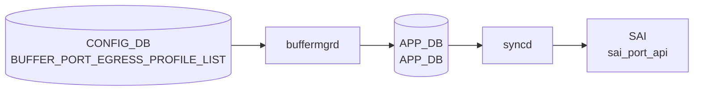

# BUFFER_PORT_EGRESS_PROFILE_LIST テーブル

## 概要

**ポートに紐づけるエグレスバッファプロファイル群** を定義する CONFIG_DB テーブル[^1]。SAI における `SAI_PORT_ATTR_QOS_EGRESS_BUFFER_PROFILE_LIST` 相当。`BUFFER_PROFILE` で定義した複数プロファイルをポート単位で順序付きリストにまとめる。

`BUFFER_QUEUE` テーブル (queue 単位の buffer profile) と並ぶ別レベルで、こちらはポート全体としての egress プロファイル群の集約。`BUFFER_PORT_INGRESS_PROFILE_LIST` と対になる構造。

<!-- cdb-mermaid -->
### データフロー (自動生成)



!!! note "凡例"
    CONFIG_DB から SAI までの典型経路を `docs/reference/config-db-orch-map.md` から機械生成したミニ図。詳細・例外は本ページ本文と対応表を参照。
<!-- /cdb-mermaid -->

## key 構造

```
BUFFER_PORT_EGRESS_PROFILE_LIST|<port>
```

- `<port>`: `PORT.name` への leafref

## フィールド

| フィールド | 型 | 説明 |
|-----------|----|------|
| `port` (key) | leafref → `PORT.name` | 対象ポート |
| `profile_list` | leaf-list of leafref → `BUFFER_PROFILE.name` (ordered-by user) | ポートにバインドする egress バッファプロファイル名の順序付きリスト |

`ordered-by user` のため、設定順がそのまま SAI への bind 順となる。

## 制約

- `port` / `profile_list` 要素は leafref。実体が無いと validation で拒否される。

## 購読者

- `buffermgrd`: CONFIG_DB → APPL_DB `BUFFER_PORT_EGRESS_PROFILE_LIST_TABLE`
- `orchagent` (BufferOrch): SAI 側 port egress profile list 設定

## 関連 CONFIG_DB / YANG / CLI

- 関連 CONFIG_DB: `BUFFER_PROFILE`, `BUFFER_POOL`, `BUFFER_QUEUE`, `PORT`, `BUFFER_PORT_INGRESS_PROFILE_LIST`
- 関連 CLI: `config buffer profile` 系
- 関連 YANG: `sonic-buffer-port-egress-profile-list`, `sonic-buffer-profile`

<!-- ref-triangle:start -->

## 関連リファレンス

- YANG: `sonic-buffer-port-egress-profile-list`
- CLI: [`config buffer`](../cli/config-buffer.md)

<!-- ref-triangle:end -->

## 引用元

[^1]: YANG 定義: `sonic-buffer-port-egress-profile-list.yang`. <https://github.com/sonic-net/sonic-buildimage/blob/9ea932ec2e18f35e58268ec2e4456b1d4afd65cd/src/sonic-yang-models/yang-models/sonic-buffer-port-egress-profile-list.yang>

## 関連ページ
- [CONFIG_DB: BUFFER_PROFILE](buffer-profile.md)
- [CONFIG_DB: BUFFER_POOL](buffer-pool.md)
- [CONFIG_DB: BUFFER_QUEUE](buffer-queue.md)
- [CONFIG_DB: BUFFER_PORT_INGRESS_PROFILE_LIST](buffer-port-ingress-profile-list.md)

<!-- ops-hint -->
## 運用ヒント

### 典型値

- key 形式: `BUFFER_PORT_EGRESS_PROFILE_LIST|<port>` (例 `BUFFER_PORT_EGRESS_PROFILE_LIST|Ethernet0`)。
- `profile_list`: `","` 区切り (例 `"egress_lossless_profile,egress_lossy_profile"`)。

### よくある誤設定

- `BUFFER_PROFILE` 未登録のプロファイル名を入れて leafref エラー。
- `BUFFER_QUEUE` の queue 単位 profile とポート単位 profile_list の役割を混同する。

### 確認コマンド

```bash
sonic-db-cli CONFIG_DB hgetall 'BUFFER_PORT_EGRESS_PROFILE_LIST|Ethernet0'
sonic-db-cli APPL_DB hgetall 'BUFFER_PORT_EGRESS_PROFILE_LIST_TABLE:Ethernet0'
show buffer pool
```
<!-- /ops-hint -->
