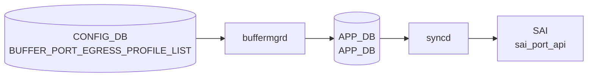

# BUFFER_PORT_EGRESS_PROFILE_LIST テーブル

## 概要

**ポートに紐づけるエグレスバッファプロファイル群** を定義する [CONFIG_DB](../../reference/glossary.md#term-config_db) テーブル[^1]。[SAI](../../reference/glossary.md#term-sai) における `SAI_PORT_ATTR_QOS_EGRESS_BUFFER_PROFILE_LIST` 相当。`BUFFER_PROFILE` で定義した複数プロファイルをポート単位で順序付きリストにまとめる。

`BUFFER_QUEUE` テーブル (queue 単位の buffer profile) と並ぶ別レベルで、こちらはポート全体としての egress プロファイル群の集約。`BUFFER_PORT_INGRESS_PROFILE_LIST` と対になる構造。

<!-- cdb-mermaid -->
### データフロー (自動生成)



!!! note "凡例"
    CONFIG_DB から SAI までの典型経路を `docs/reference/config-db-orch-map.md` から機械生成したミニ図。詳細・例外は本ページ本文と対応表を参照。
<!-- /cdb-mermaid -->

## key 構造

```text
BUFFER_PORT_EGRESS_PROFILE_LIST|<port>
```

- `<port>`: `PORT.name` への leafref

## フィールド

| フィールド | 型 | 説明 |
|-----------|----|------|
| `port` (key) | leafref → `PORT.name` | 対象ポート |
| `profile_list` | leaf-list of leafref → `BUFFER_PROFILE.name` (ordered-by user) | ポートにバインドする egress バッファプロファイル名の順序付きリスト |

`ordered-by user` のため、設定順がそのまま [SAI](../../reference/glossary.md#term-sai) への bind 順となる。

## 制約

- `port` / `profile_list` 要素は leafref。実体が無いと validation で拒否される。

<!-- cdb-exceptions -->
## 例外条件・特殊挙動

- **プロファイル参照未解決 → retry**: `profile_list` に参照する `BUFFER_PROFILE` が未存在の場合、`orchagent` は `task_need_retry` を返しエントリを保留する。プロファイル到着後に再処理される。<!-- evidence: bufferorch.cpp L1869-1876 processEgressBufferProfileList -->
- **リスト変更なし → SAI 呼び出しスキップ**: プロファイルリストが既存キャッシュと同一の場合は SAI を呼ばずにスキップする。<!-- evidence: bufferorch.cpp L1882-1886 -->
- **trimming-eligible プロファイル禁止 → task_failed**: `packet_discard_action = trim` のプロファイルは egress profile list に設定不可。`SWSS_LOG_ERROR("Failed to configure egress buffer profile list(%s): buffer profile(%s) is trimming eligible")` が出力され処理失敗となる。<!-- evidence: bufferorch.cpp L1907-1921 -->
- **ポート未存在 → task_invalid_entry**: 指定ポート名が PortsOrch のポートマップに存在しない場合 `task_invalid_entry` を返す。<!-- evidence: bufferorch.cpp L1950-1954 -->

<!-- value-behavior -->
## 値依存挙動マトリクス

このテーブルに enum フィールドはない。ただし参照する `BUFFER_PROFILE.packet_discard_action` の値によって挙動が変わる。

| 参照プロファイルの `packet_discard_action` | 挙動 |
|------------------------------------------|------|
| `drop`（既定） | `profile_list` に含めて egress profile list として設定可能。`BufferOrch` が SAI `SAI_PORT_ATTR_QOS_EGRESS_BUFFER_PROFILE_LIST` を更新する。 |
| `trim` | `BufferOrch` が `isTrimmingEligible=true` を検出し `task_failed` を返す（`bufferorch.cpp:1915-1921`）。egress profile list への trim プロファイルの適用は **禁止**。 |

`profile_list` の設定順（`ordered-by user`）は SAI へのバインド順と対応する。
<!-- /value-behavior -->

## 購読者

- `buffermgrd`: [CONFIG_DB](../../reference/glossary.md#term-config_db) → [APPL_DB](../../reference/glossary.md#term-appl_db) `BUFFER_PORT_EGRESS_PROFILE_LIST_TABLE`
- `orchagent` (BufferOrch): [SAI](../../reference/glossary.md#term-sai) 側 port egress profile list 設定

## 関連 CONFIG_DB / YANG / CLI

- 関連 [CONFIG_DB](../../reference/glossary.md#term-config_db): `BUFFER_PROFILE`, `BUFFER_POOL`, `BUFFER_QUEUE`, `PORT`, `BUFFER_PORT_INGRESS_PROFILE_LIST`
- 関連 CLI: `config buffer profile` 系
- 関連 [YANG](../../reference/glossary.md#term-yang): `sonic-buffer-port-egress-profile-list`, `sonic-buffer-profile`

<!-- ref-triangle:start -->

## 関連リファレンス

- [YANG](../../reference/glossary.md#term-yang): `sonic-buffer-port-egress-profile-list`
- CLI: [`config buffer`](../cli/config-buffer.md)

<!-- ref-triangle:end -->

## 引用元

[^1]: [YANG](../../reference/glossary.md#term-yang) 定義: `sonic-buffer-port-egress-profile-list.yang`. <https://github.com/sonic-net/sonic-buildimage/blob/9ea932ec2e18f35e58268ec2e4456b1d4afd65cd/src/sonic-yang-models/yang-models/sonic-buffer-port-egress-profile-list.yang>

## 関連ページ
- [CONFIG_DB: BUFFER_PROFILE](buffer-profile.md)
- [CONFIG_DB: BUFFER_POOL](buffer-pool.md)
- [CONFIG_DB: BUFFER_QUEUE](buffer-queue.md)
- [CONFIG_DB: BUFFER_PORT_INGRESS_PROFILE_LIST](buffer-port-ingress-profile-list.md)

<!-- ops-hint -->
## 運用ヒント

### 典型値

- key 形式: `BUFFER_PORT_EGRESS_PROFILE_LIST|<port>` (例 `BUFFER_PORT_EGRESS_PROFILE_LIST|Ethernet0`)。
- `profile_list`: `","` 区切り (例 `"egress_lossless_profile,egress_lossy_profile"`)。

### よくある誤設定

- `BUFFER_PROFILE` 未登録のプロファイル名を入れて leafref エラー。
- `BUFFER_QUEUE` の queue 単位 profile とポート単位 profile_list の役割を混同する。

### 確認コマンド

```bash
sonic-db-cli CONFIG_DB hgetall 'BUFFER_PORT_EGRESS_PROFILE_LIST|Ethernet0'
sonic-db-cli APPL_DB hgetall 'BUFFER_PORT_EGRESS_PROFILE_LIST_TABLE:Ethernet0'
show buffer pool
```
<!-- /ops-hint -->

<!-- runtime-trace -->
## 実コンテナ動作トレース

### 段階 1 — Consumer 登録

`buffermgrd` → `BufferOrch` ([APPL_DB](../../reference/glossary.md#term-appl_db) 経由) が CONFIG_DB の `BUFFER_PORT_EGRESS_PROFILE_LIST` テーブルを購読する。

`BUFFER_PORT_EGRESS_PROFILE_LIST` の key は `<port>` (例: `Ethernet0`)。

### 段階 2 — CFG→APPL 翻訳

`APP_BUFFER_PORT_EGRESS_PROFILE_LIST_TABLE` に書き込み

### 段階 3 — APPL→SAI

`sai_port_api` — ポートの egress バッファプロファイルリストをバインド

### 段階 4 — タイミングと副作用

**適用タイミング**: CONFIG_DB 変化を `buffermgrd` が検知後 [APPL_DB](../../reference/glossary.md#term-appl_db) に書き込み。`BufferOrch` が SAI port attribute を更新。

**副作用**: 対象ポートの egress バッファ割り当てが変更される。traffic に影響する可能性がある。
<!-- /runtime-trace -->

<!-- entry-points -->
## 書き込み入り口 (Direction A)

対象テーブル: `BUFFER_PORT_EGRESS_PROFILE_LIST`

### CLI
- `config interface buffer egress-profile-list set <port> <profile>`
  - ソース: `sonic-utilities/config/main.py (buffer グループ)`

### minigraph / sonic-cfggen
- あり: `sonic-cfggen -m <minigraph.xml>` 実行時に本テーブルが生成・上書きされる

### REST / gNMI (sonic-mgmt-common)
- なし (対応 OpenConfig/SONiC YANG transformer なし)

### db_migrator
- なし

### ビルド時デフォルト (init_cfg / j2 テンプレート)
- `buffers_config.j2` から生成

### ハードコードデフォルト
- なし

### ランタイム注入 (デーモン自動書き込み)
- Dynamic buffer model: `buffermgrd` がポートごとに書き込み
<!-- /entry-points -->

<!-- derivation -->
## 派生・条件付き登録 (Phase 6/7)

### Phase 6: 値による他フィールド自動派生

| 条件 | 派生先 | evidence |
|---|---|---|
| Dynamic buffer model: `buffermgrd` がポートの egress プロファイルリストを自動生成 | `BUFFER_PORT_EGRESS_PROFILE_LIST` にエントリを書き込む | `sonic-swss/cfgmgr/buffermgrdyn.cpp:447,3571` |

### Phase 7: 条件付き module/manager 登録

| 条件 | 登録 module | evidence |
|---|---|---|
| 常時（条件なし） | `BufferMgrDynamic` が `BUFFER_PORT_EGRESS_PROFILE_LIST` を `handleBufferPortEgressProfileListTable` に登録 | `sonic-swss/cfgmgr/buffermgrdyn.cpp:448` |

### grep カバレッジ

- buffermgrdyn.cpp L448: BUFFER_PORT_EGRESS_PROFILE_LIST ハンドラ登録（条件なし）
<!-- /derivation -->
<!-- handler-branching -->
### Phase 8: Handler メソッド内分岐

| Manager / Handler | メソッド | 分岐条件 | 効果 | evidence |
|---|---|---|---|---|
| `BufferMgrDynamic` | `handleBufferObjectTables()` | キー形式が不正（ポート名空） | `task_invalid_entry` 返却（`keyWithIds=false` のため ids 不要） | `sonic-swss/cfgmgr/buffermgrdyn.cpp:3514` |
| `BufferMgrDynamic` | `handleBufferObjectTables()` | カンマ区切りポートリスト（複数ポート） | ポートごとにシングルポートハンドラを繰り返し呼び出し | `sonic-swss/cfgmgr/buffermgrdyn.cpp:3536-3547` |

> **スキャン証跡**: `handleBufferPortEgressProfileListTable` は `handleBufferObjectTables(tuple, CFG_BUFFER_PORT_EGRESS_PROFILE_LIST_NAME, false)` に委譲。`keyWithIds=false`（PG/Queue と異なりインデックスなし）。2 件分岐抽出。
<!-- /handler-branching -->
<!-- defaults -->
## 暗黙デフォルト・コード由来挙動 (Phase A)

このテーブルには YANG `default` を持つフィールドがない。以下はコードトレースで判明した暗黙挙動。

### `profile_list` フィールドの挙動

| 条件 | 実際の挙動 | evidence |
|------|-----------|---------|
| YANG `default` | なし (leaf-list に default 文なし) | `sonic-buffer-port-egress-profile-list.yang` |
| SET 時・ポートが admin-down (dynamic model) | CONFIG_DB 値でなくゼロプロファイルリストを APPL_DB に書き込む (silent substitution) | `buffermgrdyn.cpp:3418-3438` |
| SET 時・buffer pool 未準備 (dynamic model) | APPL_DB に書かず `m_bufferObjectsPending=true` を立てて `task_success` 返却 (silent pending) | `buffermgrdyn.cpp:3408-3415` |
| `profile_list` 以外のフィールドが来た場合 | `SWSS_LOG_ERROR("Unknown field %s")` + `continue` で silent drop | `buffermgrdyn.cpp:3401-3405` |
| DEL 操作 | count=0 の空リストを SAI に送る (`attr.value.objlist.count = 0`) | `bufferorch.cpp:1939-1940` |

### 書き込み経路依存の乖離 (static vs dynamic model)

| 項目 | Static model (`buffermgr.cpp`) | Dynamic model (`buffermgrdyn.cpp`) |
|------|-------------------------------|-------------------------------------|
| direction 検証 | なし (CONFIG_DB 値をそのまま APPL_DB にコピー) | あり: ingress profile を egress list に指定 → `task_failed` (`checkBufferProfileDirection`) |
| profile 存在検証 | なし ([orchagent](../../reference/glossary.md#term-orchagent) 段で retry) | あり: `m_bufferProfileLookup` 未登録 → `task_need_retry` |
| admin-down 置換 | なし | あり: ゼロプロファイルリストに差し替え |
| buffer pool guard | なし | あり: pool 未準備時 pending |

Static model は `DEVICE_METADATA.buffer_model == "dynamic"` の環境では一切動作しない (`buffermgr.cpp:476-480`: `SWSS_LOG_DEBUG("Dynamic buffer model enabled. Skipping further processing")`)。

### orchagent 段の追加制約

| 条件 | 挙動 | evidence |
|------|------|---------|
| `BUFFER_PROFILE.packet_discard_action == "trim"` のプロファイルを指定 | `task_failed` (`isTrimmingEligible=true` 検出) | `bufferorch.cpp:1907-1921` |
| profile_list が既存キャッシュと同一 | SAI 呼び出しスキップ (`task_success` 即返却) | `bufferorch.cpp:1885-1890` |
| Bulk SAI 呼び出し | `SAI_BULK_OP_ERROR_MODE_IGNORE_ERROR` で一部ポート失敗が他ポートをブロックしない | `bufferorch.cpp:2009-2014` |

### 複数ポートキー時の partial failure

カンマ区切りポートリスト (`Ethernet0,Ethernet4`) のキーが来た場合、ポートごとに分解して処理する。途中でいずれかが `task_need_retry` を返すと即時 return し、後続ポートは未処理のまま残る (`buffermgrdyn.cpp:3546-3547`)。

### Mellanox プラットフォーム注記

`buffermgrdyn.cpp:handleSingleBufferPortProfileListEntry` の DEL パスには `// Not supported on Mellanox platform for now.` のコメントが存在する (L3443)。削除処理は動作するが、Mellanox での正式サポート状態について留意が必要。

### YANG vs 実装 discrepancy

| 項目 | YANG | 実装 |
|------|------|------|
| direction 制約 | 記述なし | dynamic model: ingress profile → egress list は `task_failed` |
| trimming 制約 | 記述なし | [orchagent](../../reference/glossary.md#term-orchagent): trimming-eligible profile は `task_failed` |
| 複数ポートキー | 記述なし | カンマ区切りポートリストをキーとして設定可能 (内部で展開) |
<!-- /defaults -->

<!-- constants -->
## ハードコード定数 (Phase E)

### テーブル名・フィールド名定数

| 定数名 | 値 | ソース |
|---|---|---|
| `CFG_BUFFER_PORT_EGRESS_PROFILE_LIST_NAME` | `"BUFFER_PORT_EGRESS_PROFILE_LIST"` | `sonic-swss-common/common/schema.h:366` |
| `APP_BUFFER_PORT_EGRESS_PROFILE_LIST_NAME` | `"BUFFER_PORT_EGRESS_PROFILE_LIST_TABLE"` | `sonic-swss-common/common/schema.h:164` |
| `buffer_profile_list_field_name` | `"profile_list"` | `sonic-swss/orchagent/bufferorch.cpp:34` |

### SAI 識別子

| 定数名 | 用途 | ソース |
|---|---|---|
| `SAI_PORT_ATTR_QOS_EGRESS_BUFFER_PROFILE_LIST` | egress バッファプロファイルリストをポートに bind する SAI 属性 ID | `bufferorch.cpp:1865` |
| `SAI_BULK_OP_ERROR_MODE_IGNORE_ERROR` | Bulk SAI 呼び出し時エラーモード（一部ポート失敗が他ポートをブロックしない） | `bufferorch.cpp:2014` |
| `SAI_OBJECT_TYPE_PORT` | `SaiAttrWrapper` 生成時に指定するオブジェクト型 | `bufferorch.cpp:1958` |

### direction 値（egress 固定）

`handleSingleBufferPortEgressProfileListEntry` は常に `BUFFER_EGRESS`（文字列 `"egress"`）を `handleSingleBufferPortProfileListEntry` に渡す。ingress profile（`BUFFER_INGRESS` 方向）を egress profile list に指定した場合は `checkBufferProfileDirection` が `task_failed` を返す。

| 内部列挙値 | 文字列表現 | ソース |
|---|---|---|
| `BUFFER_EGRESS` | `"egress"` | `buffermgrdyn.cpp:36,3459` |
| `BUFFER_INGRESS` | `"ingress"` | `buffermgrdyn.cpp:36`（参照用） |

### 区切り文字

| 定数名 | 値 | 用途 |
|---|---|---|
| `list_item_delimiter` | `','`（カンマ） | `tokenize(key, list_item_delimiter)` — キー内のポート名分割 |
| （無名） | `','`（カンマ） | `checkBufferProfileDirection` 内の profile 名リスト分割 |

evidence: `sonic-swss/orchagent/orch.h:32`, `bufferorch.cpp:1862`, `buffermgrdyn.cpp:3278`

### 空リスト（DEL 操作時のハードコード）

DEL 操作時、SAI に count=0 のオブジェクトリストを渡すことで「egress バッファプロファイルなし」を表現する。YANG には記述なし。

| 属性 | ハードコード値 | ソース |
|---|---|---|
| `attr.value.objlist.count` | `0` | `bufferorch.cpp:1939` |
| `attr.value.objlist.list` | 空ベクタの `.data()` ポインタ | `bufferorch.cpp:1940` |

### Bulk SAI 処理順（DEL 優先）

`processEgressBufferProfileListBulk` 内で `{DEL_COMMAND, SET_COMMAND}` の順にループするため、DEL が SET より先に SAI へ送られる。

evidence: `bufferorch.cpp:1990`
<!-- /constants -->

<!-- failure -->
## 失敗挙動・retry 分岐 (Phase D)

### buffermgrd (Dynamic model) 段の失敗分岐

| 条件 | 結果 | ログ / evidence |
|------|------|----------------|
| `profile_list` に指定した `BUFFER_PROFILE` が `m_bufferProfileLookup` に未登録 | `task_need_retry`（プロファイル登録後に再処理） | `SWSS_LOG_INFO("Profile %s doesn't exist, need retry")` / `buffermgrdyn.cpp:3284-3285` |
| ingress 方向のプロファイルを egress profile list に指定（direction mismatch） | `task_failed`（エントリ破棄、再試行なし） | `SWSS_LOG_ERROR("Profile %s's direction is %s but %s is expected")` / `buffermgrdyn.cpp:3291-3295` |
| buffer pool が未準備（`!m_bufferPoolReady`） | `m_bufferObjectsPending=true` を立てて `task_success` 返却、APPL_DB 書き込みを保留 | `SWSS_LOG_NOTICE("Buffer pools are not ready … pending")` / `buffermgrdyn.cpp:3408-3414` |
| ポートが admin-down 状態 | CONFIG_DB 値ではなくゼロプロファイルリストを APPL_DB に書き込む（silent substitution） | `buffermgrdyn.cpp:3418-3438`、ゼロプロファイル未ロード時は `loadZeroPoolAndProfiles()` 呼び出し |
| キー形式不正（`parseObjectNameFromKey()` が空を返す） | `task_invalid_entry`（エントリ破棄） | `SWSS_LOG_ERROR("Invalid key format %s for %s table")` / `buffermgrdyn.cpp:3512-3513` |
| 複数ポートキー処理中にいずれかのポートが `task_need_retry` | 即 return、後続ポートは未処理のまま残る（partial failure） | `buffermgrdyn.cpp:3546-3547` |

### orchagent (BufferOrch) 段の失敗分岐

| 条件 | 結果 | ログ / evidence |
|------|------|----------------|
| `resolveFieldRefArray()` が `not_resolved`（BUFFER_PROFILE が APPL_DB 未到着） | `task_need_retry` | `SWSS_LOG_INFO("Missing or invalid egress buffer profile reference specified for:%s")` / `bufferorch.cpp:1875-1878` |
| `resolveFieldRefArray()` がその他エラー | `task_failed` | `SWSS_LOG_ERROR("Failed resolving egress buffer profile reference specified for:%s")` / `bufferorch.cpp:1880-1881` |
| `packet_discard_action = trim` のプロファイル（trimming-eligible）を指定 | `task_failed` | `SWSS_LOG_ERROR("Failed to configure egress buffer profile list(%s): buffer profile(%s) is trimming eligible")` / `bufferorch.cpp:1917-1921` |
| ポート名が PortsOrch マップに未登録 | `task_invalid_entry` | `SWSS_LOG_ERROR("Port with alias:%s not found")` / `bufferorch.cpp:1954-1955` |
| SAI `set_ports_attribute` 失敗（Bulk SAI） | `handleSaiSetStatus()` 経由で retry 判定、retry 時は consumer に再登録 | `SWSS_LOG_ERROR("Failed to set egress buffer profile list on port, status:%d, key:%s")` / `bufferorch.cpp:1974`、Bulk は `SAI_BULK_OP_ERROR_MODE_IGNORE_ERROR` で他ポートをブロックしない（L2013-2014） |

### retry 解消トリガ

| 保留原因 | 解消トリガ |
|---------|-----------|
| BUFFER_PROFILE 未登録（`task_need_retry`） | 当該 BUFFER_PROFILE の SET イベント到着後、次の doTask サイクルで再処理 |
| buffer pool 未準備（pending） | `m_bufferPoolReady` が true になった時点で `handlePendingBufferObjects()` が再適用 |
| [orchagent](../../reference/glossary.md#term-orchagent) での profile 参照未解決 | APPL_DB に profile が書き込まれた後の次サイクルで `resolveFieldRefArray()` 成功 |
| SAI 失敗（retry） | Bulk flush の次サイクルで `consumer.m_toSync` から再処理 |

<!-- /failure -->
<!-- side-effects -->
## 副次 DB 書込 (Phase F)

`sonic-swss/cfgmgr/buffermgrdyn.cpp` および `sonic-swss/orchagent/bufferorch.cpp` の egress profile list 処理経路（`handleSingleBufferPortProfileListEntry` / `processEgressBufferProfileList` / `processEgressBufferProfileListBulk`）を調査した結果、以下の副次 DB 書込は**存在しない**。

| DB | 書込 | 根拠 |
|----|------|------|
| [STATE_DB](../../reference/glossary.md#term-state_db) | **なし** | egress handler 経路に書込コードなし。[STATE_DB](../../reference/glossary.md#term-state_db) は MMU サイズ・最大 PG/Queue 数の **読み取り** にのみ使用（`buffermgrdyn.cpp:133,261,1277`） |
| [COUNTERS_DB](../../reference/glossary.md#term-counters_db) | **なし** | `bufferorch.cpp:56` で接続を保持するが、egress profile list handler では未使用。buffer pool watermark 用 Lua スクリプト（`bufferorch.cpp:240`）専用 |
| APPL_STATE_DB | **なし** | 両ファイルの egress profile list 処理経路に該当コードなし |
| [FLEX_COUNTER_DB](../../reference/glossary.md#term-flex_counter_db) | **なし** | `bufferorch.cpp:1135` は [VOQ](../../reference/glossary.md#term-voq) スイッチの Port Queue counter 更新用であり、本テーブルの処理とは無関係 |

このテーブルの書込先は **APPL_DB の `BUFFER_PORT_EGRESS_PROFILE_LIST_TABLE`** のみ（`buffermgrdyn.cpp:3383`）であり、SAI への最終適用は `sai_port_api->set_ports_attribute`（`bufferorch.cpp:2009`）を通じて行われる。

<!-- /side-effects -->

<!-- ordering -->
## 書込順依存 (Phase B)

このテーブルを有効に設定するには、以下の順序で CONFIG_DB / APPL_DB への書き込みが完了している必要がある。

```
1. BUFFER_POOL
2. BUFFER_PROFILE  （egress 方向）
3. PORT
4. BUFFER_PORT_EGRESS_PROFILE_LIST  ← 本テーブル
```

### 依存 1: BUFFER_PROFILE 先行 (dynamic model — buffermgrd 段)

`buffermgrdyn.cpp:checkBufferProfileDirection` は SET 時に `profile_list` の各プロファイルを `m_bufferProfileLookup` で検索する。プロファイルが未登録の場合は `task_need_retry` を返してエントリを保留し、BUFFER_PROFILE 到着後に自動再処理される。<!-- evidence: buffermgrdyn.cpp:3282-3287 -->

### 依存 2: BUFFER_PROFILE 先行 (orchagent 段)

`bufferorch.cpp:processEgressBufferProfileList` は `resolveFieldRefArray` でプロファイル SAI OID を解決する。参照先 BUFFER_PROFILE が APPL_DB に未登録の場合 `task_need_retry` を返す（自動リトライ）。<!-- evidence: bufferorch.cpp:1869-1877 -->

### 依存 3: PORT 先行 (orchagent 段)

同関数末尾で `gPortsOrch->getPort(port_name, port)` を実行する。指定ポートが PortsOrch のマップに存在しない場合は `task_invalid_entry` を返す。**retry なし**のためエントリが破棄される点に注意。<!-- evidence: bufferorch.cpp:1950-1957 -->

| 未先行リソース | 返却ステータス | 自動リトライ |
|--------------|--------------|-------------|
| BUFFER_PROFILE 未登録 (buffermgrd) | `task_need_retry` | あり（到着後に再処理） |
| BUFFER_PROFILE 未登録 (orchagent) | `task_need_retry` | あり |
| PORT 未登録 (orchagent) | `task_invalid_entry` | **なし**（エントリ破棄） |
<!-- /ordering -->
<!-- platform -->
## プラットフォーム差分 (Phase H)

### Dynamic vs Static バッファモデル

`DEVICE_METADATA.buffer_model` の値によって動作するマネージャが切り替わり、このテーブルの検証レベルが大きく変わる。

| 観点 | Static model (`buffermgr.cpp`) | Dynamic model (`buffermgrdyn.cpp`) |
|------|-------------------------------|-------------------------------------|
| 有効条件 | `buffer_model` が `"dynamic"` でない場合 | `buffer_model == "dynamic"` |
| direction 検証 | なし（orchagent 段のみ） | あり: ingress profile を egress list に指定 → `task_failed` |
| profile 存在検証 | なし（orchagent 段で retry） | あり: `m_bufferProfileLookup` 未登録 → `task_need_retry` |
| admin-down port 置換 | なし（CONFIG_DB 値をそのまま APPL_DB へ） | あり: ゼロプロファイルリストへ自動差し替え |
| buffer pool guard | なし | あり: pool 未準備時は pending |
| DEL 操作 | APPL_DB から削除 | 削除処理は動作するが `// Not supported on Mellanox platform for now.` 注記付き |

Static model は `dynamic_buffer_model == true` 時に即 `return` する（`buffermgr.cpp:476-480`）。

### ASIC Vendor 差分（Mellanox 固有）

`buffermgrdyn.cpp` は `ASIC_VENDOR` 環境変数でプラットフォームを判別する（`buffermgrdyn.cpp:68-80`）。

| 挙動 | 適用範囲 | evidence |
|------|---------|---------|
| Mellanox SN シリーズモデル番号を取得して処理を分岐 | Mellanox のみ | `buffermgrdyn.cpp:84-102` |
| 8 レーンポートで xon 値を倍増（profile 名に `_8lane` を付与） | Mellanox 4xxx (400G 以外) / 5xxx (800G 以外) | `buffermgrdyn.cpp:504-522` |
| DEL パスに `// Not supported on Mellanox platform for now.` 注記 | Mellanox での留意事項 | `buffermgrdyn.cpp:3443` |

`_8lane` ロジックは PG バッファプロファイル名の生成に関するものであり、BUFFER_PORT_EGRESS_PROFILE_LIST のキー・フィールド処理そのものには直接影響しない。ただし、このテーブルが参照する `BUFFER_PROFILE` の名前がプラットフォームによって異なる場合がある。

Broadcom・その他ベンダーでは vendor 固有の条件分岐なし。テーブル処理コードは同一パスを通る（Lua ヘッドルームプラグイン名のみ異なる）。

### VOQ Chassis

`bufferorch.cpp` の `processEgressBufferProfileList` / `processEgressBufferProfileListBulk` 内に `gMySwitchType == "voq"` 分岐は **存在しない**。[VOQ](../../reference/glossary.md#term-voq) 固有のキー拡張（4 トークン形式）は BUFFER_QUEUE ハンドラにのみ適用される。

| 項目 | 標準スイッチ | [VOQ](../../reference/glossary.md#term-voq) Chassis |
|------|------------|------------|
| `processEgressBufferProfileList` 実行 | 通常通り | 同一コードパス（分岐なし） |
| 処理開始条件 | `isConfigDone()` | `isInitDone()`（より早い段階） |
| SAI 属性 | `SAI_PORT_ATTR_QOS_EGRESS_BUFFER_PROFILE_LIST` | 同じ属性 |
| `buffermgrdyn.cpp` での処理 | voq 分岐なし | voq 分岐なし |

**結論**: VOQ Chassis において BUFFER_PORT_EGRESS_PROFILE_LIST の挙動は標準スイッチと同一。`doTask(Consumer &)` 内の `isInitDone()` 使用による処理開始タイミングの早期化のみが間接的に関係する（`bufferorch.cpp:2079-2094`）。
<!-- /platform -->

<!-- cross-refs -->
## 暗黙参照テーブル (Phase C)

`BUFFER_PORT_EGRESS_PROFILE_LIST` のキーおよびフィールドは YANG 上では leafref として宣言されているが、
`buffermgrdyn.cpp` と `bufferorch.cpp` のランタイム処理においてもコードレベルの暗黙参照が存在する。
YANG leafref が静的 validation を提供するのに対し、以下の参照はランタイムに動的解決される。

| 参照元フィールド | 参照先テーブル | 参照先キー形式 | 参照タイミング | 未解決時の挙動 | evidence |
|---|---|---|---|---|---|
| `profile_list` (各プロファイル名) | `BUFFER_PROFILE` | `BUFFER_PROFILE\|<name>` | `buffermgrdyn.cpp:checkBufferProfileDirection` — SET 時に `m_bufferProfileLookup` で検索 | `task_need_retry`（到着後に自動再処理） | `buffermgrdyn.cpp:3281-3286` |
| `profile_list` (各プロファイル名) | `BUFFER_PROFILE` | `APPL_DB: BUFFER_PROFILE_TABLE:<name>` | `bufferorch.cpp:processEgressBufferProfileList` — `resolveFieldRefArray` で SAI OID 解決 | `task_need_retry`（自動リトライ） | `bufferorch.cpp:1870-1879` |
| キー `<port>` | `PORT` | `PORT\|<port_name>` | `bufferorch.cpp:processEgressBufferProfileList` — `gPortsOrch->getPort(port_name, port)` | `task_invalid_entry`（**リトライなし**、エントリ破棄） | `bufferorch.cpp:1952-1956` |
| `profile_list` → `BUFFER_PROFILE.pool_name` | `BUFFER_POOL` | `BUFFER_POOL\|<pool_name>` | `buffermgrdyn.cpp:handleSingleBufferPortProfileListEntry` — `m_bufferPoolReady` フラグで pool 準備状態を確認 | `m_bufferObjectsPending=true` を立てて `task_success` 返却（APPL_DB への書き込みを保留） | `buffermgrdyn.cpp:3408-3415` |

### 参照の詳細

#### BUFFER_PROFILE への暗黙参照（2 段階）

1. **buffermgrd 段（dynamic model）**: `checkBufferProfileDirection` が `profile_list` の各プロファイル名を `m_bufferProfileLookup` で検索する。存在しない場合は `task_need_retry` を返して保留する。存在する場合は方向（`BUFFER_EGRESS`）を検証し、ingress 方向プロファイルが egress list に指定された場合は `task_failed` を返す (`buffermgrdyn.cpp:3289-3296`)。

2. **orchagent 段**: `resolveFieldRefArray` が `buffer_profile_list_field_name` をキーに `m_buffer_type_maps[APP_BUFFER_PROFILE_TABLE_NAME]` を検索し、各プロファイルの SAI OID を解決する。未登録の場合 `ref_resolve_status::not_resolved` となり `task_need_retry` を返す (`bufferorch.cpp:1873-1879`)。

#### PORT への暗黙参照

`bufferorch.cpp:processEgressBufferProfileList` はキーのポート名を `gPortsOrch->getPort(port_name, port)` で解決する。PortsOrch のポートマップに存在しない場合は `task_invalid_entry` を返し、エントリが**永続的に破棄**される（retry なし）。PORT テーブルが先に存在している必要がある (`bufferorch.cpp:1952-1956`)。

#### BUFFER_POOL への間接参照

`buffermgrdyn.cpp:handleSingleBufferPortProfileListEntry` は `m_bufferPoolReady` フラグを確認する。`BUFFER_POOL` が未準備（buffer pool が APPL_DB に反映されていない）の場合、エントリを APPL_DB に書き込まず `m_bufferObjectsPending=true` を立てて `task_success` を返す。pool 準備完了後にペンディングオブジェクトが一括再処理される (`buffermgrdyn.cpp:3408-3415`)。

### YANG leafref との対比

| 参照 | YANG leafref | コードレベル参照 | 差異 |
|---|---|---|---|
| `BUFFER_PROFILE` | あり (`sonic-buffer-port-egress-profile-list.yang`) | あり（2 段階: buffermgrd + orchagent） | YANG は静的 validation、コードは方向・trim 制約を追加検証 |
| `PORT` | あり（key の leafref） | あり（`gPortsOrch->getPort()`） | YANG: validate 時点、コード: ランタイム解決（未解決でエントリ破棄） |
| `BUFFER_POOL` | 直接なし（BUFFER_PROFILE 経由） | あり（`m_bufferPoolReady` フラグ） | コードのみで存在する間接依存 |
<!-- /cross-refs -->
<!-- pubsub -->
## 通信メカニズム (Phase G)

### Producer/Consumer ペア

`BUFFER_PORT_EGRESS_PROFILE_LIST` は **2 段階中継** で CONFIG_DB から SAI に到達する。

| 区間 | 方式 | チャンネル/パターン |
|------|------|---------------------|
| CONFIG_DB → buffermgrd | `SubscriberStateTable` | `PSUBSCRIBE __keyspace@{cfg_db_id}__:BUFFER_PORT_EGRESS_PROFILE_LIST\|*` |
| buffermgrd → APPL_DB | `ProducerStateTable` | `BUFFER_PORT_EGRESS_PROFILE_LIST_TABLE_CHANNEL@0` に PUBLISH |
| APPL_DB → BufferOrch | `ConsumerStateTable` | `SUBSCRIBE BUFFER_PORT_EGRESS_PROFILE_LIST_TABLE_CHANNEL@0` |
| BufferOrch → APPL_STATE_DB | `ResponsePublisher` | **なし**（BUFFER_POOL / BUFFER_PROFILE のみ ack あり） |

### SubscriberStateTable (CONFIG_DB 側)

`buffermgrdyn` は `Orch::addConsumer()` (`orch.cpp:1188-1190`) を通じて CONFIG_DB に `SubscriberStateTable` を生成する。[Redis](../../reference/glossary.md#term-redis) keyspace notification:

```
PSUBSCRIBE __keyspace@{config_db_id}__:BUFFER_PORT_EGRESS_PROFILE_LIST|*
```

で変化を検出し、`handleBufferPortEgressProfileListTable` → `handleBufferObjectTables(tuple, CFG_BUFFER_PORT_EGRESS_PROFILE_LIST_NAME, false)` (`buffermgrdyn.cpp:3571`) に委譲。コンマ区切りポートキーを分解して各ポートに `handleSingleBufferPortEgressProfileListEntry` を呼ぶ (`L3536-3547`)。<!-- evidence: buffermgrdyn.cpp:448,456 -->

### ProducerStateTable → ConsumerStateTable (APPL_DB)

`buffermgrdyn` は `m_applBufferProfileListTables[BUFFER_EGRESS]` (`ProducerStateTable(applDb, APP_BUFFER_PORT_EGRESS_PROFILE_LIST_NAME)`) で APPL_DB に書き込む (`buffermgrdyn.cpp:47`)。

`BufferOrch` は `Orch(applDb, tableNames)` を通じて APPL_DB を `ConsumerStateTable` で購読する。`addConsumer()` の DB id 分岐（APPL_DB = 0 は `else` 側）で `ConsumerStateTable` が生成される (`orch.cpp:1191-1195`)。<!-- evidence: bufferorch.cpp:53, orchdaemon.cpp:386-394 -->

### doTask と drain 順序

`BufferOrch::doTask()` (`bufferorch.cpp:2040-2073`) は BUFFER_POOL → BUFFER_PROFILE の順に先 drain し、その後 `m_consumerMap` 残りを drain する。`BUFFER_PORT_EGRESS_PROFILE_LIST` は最後のループで処理され、参照先 pool / profile が先に適用された状態で実行される。

### ResponsePublisher — このテーブルに上り ack なし

`processEgressBufferProfileList` および `processEgressBufferProfileListBulk` は `m_publisher.publish()` を呼ばない。SAI 書き込み成功/失敗は `task_success` / `task_failed` / `task_need_retry` のリターンコードのみで管理される。<!-- evidence: bufferorch.cpp:1869-1944 -->

### データフロー

```
CONFIG_DB[BUFFER_PORT_EGRESS_PROFILE_LIST|<port>]
  ↓ SubscriberStateTable (keyspace notification)
  ↓ PSUBSCRIBE __keyspace@cfg_db_id__:BUFFER_PORT_EGRESS_PROFILE_LIST|*
buffermgrd (buffermgrdyn)
  ↓ handleSingleBufferPortEgressProfileListEntry()
  ↓ [admin-down → zero profile list 置換]
  ↓ [pool 未準備 → pending, task_success]
  ↓ ProducerStateTable::set()
  ↓ PUBLISH BUFFER_PORT_EGRESS_PROFILE_LIST_TABLE_CHANNEL@0
APPL_DB[BUFFER_PORT_EGRESS_PROFILE_LIST_TABLE:<port>]
  ↓ ConsumerStateTable (orchagent select loop, 1000ms timeout)
  ↓ BufferOrch::doTask() → processEgressBufferProfileList()
  ↓ [trimming-eligible profile → task_failed]
  ↓ [profile_list 変化なし → skip]
  ↓ sai_port_api SAI_PORT_ATTR_QOS_EGRESS_BUFFER_PROFILE_LIST
ASIC (sairedis → ASIC_DB)
```
<!-- /pubsub -->

<!-- glossary-links-injected: e9832f5ecb12 -->
