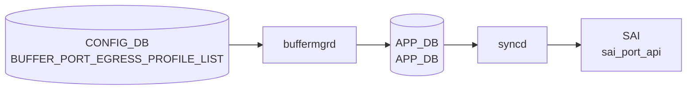

# BUFFER_PORT_EGRESS_PROFILE_LIST テーブル

## 概要

**ポートに紐づけるエグレスバッファプロファイル群** を定義する [CONFIG_DB](../../reference/glossary.md#term-config_db) テーブル[^1]。[SAI](../../reference/glossary.md#term-sai) における `SAI_PORT_ATTR_QOS_EGRESS_BUFFER_PROFILE_LIST` 相当。`BUFFER_PROFILE` で定義した複数プロファイルをポート単位で順序付きリストにまとめる。

`BUFFER_QUEUE` テーブル (queue 単位の buffer profile) と並ぶ別レベルで、こちらはポート全体としての egress プロファイル群の集約。`BUFFER_PORT_INGRESS_PROFILE_LIST` と対になる構造。

<!-- cdb-mermaid -->
### データフロー (自動生成)



!!! note "凡例"
    CONFIG_DB から SAI までの典型経路を `docs/reference/config-db-orch-map.md` から機械生成したミニ図。詳細・例外は本ページ本文と対応表を参照。
<!-- /cdb-mermaid -->

## key 構造

```text
BUFFER_PORT_EGRESS_PROFILE_LIST|<port>
```

- `<port>`: `PORT.name` への leafref

## フィールド

| フィールド | 型 | 説明 |
|-----------|----|------|
| `port` (key) | leafref → `PORT.name` | 対象ポート |
| `profile_list` | leaf-list of leafref → `BUFFER_PROFILE.name` (ordered-by user) | ポートにバインドする egress バッファプロファイル名の順序付きリスト |

`ordered-by user` のため、設定順がそのまま [SAI](../../reference/glossary.md#term-sai) への bind 順となる。

## 制約

- `port` / `profile_list` 要素は leafref。実体が無いと validation で拒否される。

<!-- cdb-exceptions -->
## 例外条件・特殊挙動

- **プロファイル参照未解決 → retry**: `profile_list` に参照する `BUFFER_PROFILE` が未存在の場合、`orchagent` は `task_need_retry` を返しエントリを保留する。プロファイル到着後に再処理される。<!-- evidence: bufferorch.cpp L1869-1876 processEgressBufferProfileList -->
- **リスト変更なし → SAI 呼び出しスキップ**: プロファイルリストが既存キャッシュと同一の場合は SAI を呼ばずにスキップする。<!-- evidence: bufferorch.cpp L1882-1886 -->
- **trimming-eligible プロファイル禁止 → task_failed**: `packet_discard_action = trim` のプロファイルは egress profile list に設定不可。`SWSS_LOG_ERROR("Failed to configure egress buffer profile list(%s): buffer profile(%s) is trimming eligible")` が出力され処理失敗となる。<!-- evidence: bufferorch.cpp L1907-1921 -->
- **ポート未存在 → task_invalid_entry**: 指定ポート名が PortsOrch のポートマップに存在しない場合 `task_invalid_entry` を返す。<!-- evidence: bufferorch.cpp L1950-1954 -->

<!-- value-behavior -->
## 値依存挙動マトリクス

このテーブルに enum フィールドはない。ただし参照する `BUFFER_PROFILE.packet_discard_action` の値によって挙動が変わる。

| 参照プロファイルの `packet_discard_action` | 挙動 |
|------------------------------------------|------|
| `drop`（既定） | `profile_list` に含めて egress profile list として設定可能。`BufferOrch` が SAI `SAI_PORT_ATTR_QOS_EGRESS_BUFFER_PROFILE_LIST` を更新する。 |
| `trim` | `BufferOrch` が `isTrimmingEligible=true` を検出し `task_failed` を返す（`bufferorch.cpp:1915-1921`）。egress profile list への trim プロファイルの適用は **禁止**。 |

`profile_list` の設定順（`ordered-by user`）は SAI へのバインド順と対応する。
<!-- /value-behavior -->

## 購読者

- `buffermgrd`: [CONFIG_DB](../../reference/glossary.md#term-config_db) → [APPL_DB](../../reference/glossary.md#term-appl_db) `BUFFER_PORT_EGRESS_PROFILE_LIST_TABLE`
- `orchagent` (BufferOrch): [SAI](../../reference/glossary.md#term-sai) 側 port egress profile list 設定

## 関連 CONFIG_DB / YANG / CLI

- 関連 [CONFIG_DB](../../reference/glossary.md#term-config_db): `BUFFER_PROFILE`, `BUFFER_POOL`, `BUFFER_QUEUE`, `PORT`, `BUFFER_PORT_INGRESS_PROFILE_LIST`
- 関連 CLI: `config buffer profile` 系
- 関連 [YANG](../../reference/glossary.md#term-yang): `sonic-buffer-port-egress-profile-list`, `sonic-buffer-profile`

<!-- ref-triangle:start -->

## 関連リファレンス

- [YANG](../../reference/glossary.md#term-yang): `sonic-buffer-port-egress-profile-list`
- CLI: [`config buffer`](../cli/config-buffer.md)

<!-- ref-triangle:end -->

## 引用元

[^1]: [YANG](../../reference/glossary.md#term-yang) 定義: `sonic-buffer-port-egress-profile-list.yang`. <https://github.com/sonic-net/sonic-buildimage/blob/9ea932ec2e18f35e58268ec2e4456b1d4afd65cd/src/sonic-yang-models/yang-models/sonic-buffer-port-egress-profile-list.yang>

## 関連ページ
- [CONFIG_DB: BUFFER_PROFILE](buffer-profile.md)
- [CONFIG_DB: BUFFER_POOL](buffer-pool.md)
- [CONFIG_DB: BUFFER_QUEUE](buffer-queue.md)
- [CONFIG_DB: BUFFER_PORT_INGRESS_PROFILE_LIST](buffer-port-ingress-profile-list.md)

<!-- ops-hint -->
## 運用ヒント

### 典型値

- key 形式: `BUFFER_PORT_EGRESS_PROFILE_LIST|<port>` (例 `BUFFER_PORT_EGRESS_PROFILE_LIST|Ethernet0`)。
- `profile_list`: `","` 区切り (例 `"egress_lossless_profile,egress_lossy_profile"`)。

### よくある誤設定

- `BUFFER_PROFILE` 未登録のプロファイル名を入れて leafref エラー。
- `BUFFER_QUEUE` の queue 単位 profile とポート単位 profile_list の役割を混同する。

### 確認コマンド

```bash
sonic-db-cli CONFIG_DB hgetall 'BUFFER_PORT_EGRESS_PROFILE_LIST|Ethernet0'
sonic-db-cli APPL_DB hgetall 'BUFFER_PORT_EGRESS_PROFILE_LIST_TABLE:Ethernet0'
show buffer pool
```
<!-- /ops-hint -->


<!-- runtime-trace -->
## 実コンテナ動作トレース

### 段階 1 — Consumer 登録

`buffermgrd` → `BufferOrch` (APPL_DB 経由) が CONFIG_DB の `BUFFER_PORT_EGRESS_PROFILE_LIST` テーブルを購読する。

`BUFFER_PORT_EGRESS_PROFILE_LIST` の key は `<port>` (例: `Ethernet0`)。

### 段階 2 — CFG→APPL 翻訳

`APP_BUFFER_PORT_EGRESS_PROFILE_LIST_TABLE` に書き込み

### 段階 3 — APPL→SAI

`sai_port_api` — ポートの egress バッファプロファイルリストをバインド

### 段階 4 — タイミングと副作用

**適用タイミング**: CONFIG_DB 変化を `buffermgrd` が検知後 APPL_DB に書き込み。`BufferOrch` が SAI port attribute を更新。

**副作用**: 対象ポートの egress バッファ割り当てが変更される。traffic に影響する可能性がある。
<!-- /runtime-trace -->

<!-- entry-points -->
## 書き込み入り口 (Direction A)

対象テーブル: `BUFFER_PORT_EGRESS_PROFILE_LIST`

### CLI
- `config interface buffer egress-profile-list set <port> <profile>`
  - ソース: `sonic-utilities/config/main.py (buffer グループ)`

### minigraph / sonic-cfggen
- あり: `sonic-cfggen -m <minigraph.xml>` 実行時に本テーブルが生成・上書きされる

### REST / gNMI (sonic-mgmt-common)
- なし (対応 OpenConfig/SONiC YANG transformer なし)

### db_migrator
- なし

### ビルド時デフォルト (init_cfg / j2 テンプレート)
- `buffers_config.j2` から生成

### ハードコードデフォルト
- なし

### ランタイム注入 (デーモン自動書き込み)
- Dynamic buffer model: `buffermgrd` がポートごとに書き込み
<!-- /entry-points -->


<!-- derivation -->
## 派生・条件付き登録 (Phase 6/7)

### Phase 6: 値による他フィールド自動派生

| 条件 | 派生先 | evidence |
|---|---|---|
| Dynamic buffer model: `buffermgrd` がポートの egress プロファイルリストを自動生成 | `BUFFER_PORT_EGRESS_PROFILE_LIST` にエントリを書き込む | `sonic-swss/cfgmgr/buffermgrdyn.cpp:447,3571` |

### Phase 7: 条件付き module/manager 登録

| 条件 | 登録 module | evidence |
|---|---|---|
| 常時（条件なし） | `BufferMgrDynamic` が `BUFFER_PORT_EGRESS_PROFILE_LIST` を `handleBufferPortEgressProfileListTable` に登録 | `sonic-swss/cfgmgr/buffermgrdyn.cpp:448` |

### grep カバレッジ

- buffermgrdyn.cpp L448: BUFFER_PORT_EGRESS_PROFILE_LIST ハンドラ登録（条件なし）
<!-- /derivation -->
<!-- handler-branching -->
### Phase 8: Handler メソッド内分岐

| Manager / Handler | メソッド | 分岐条件 | 効果 | evidence |
|---|---|---|---|---|
| `BufferMgrDynamic` | `handleBufferObjectTables()` | キー形式が不正（ポート名空） | `task_invalid_entry` 返却（`keyWithIds=false` のため ids 不要） | `sonic-swss/cfgmgr/buffermgrdyn.cpp:3514` |
| `BufferMgrDynamic` | `handleBufferObjectTables()` | カンマ区切りポートリスト（複数ポート） | ポートごとにシングルポートハンドラを繰り返し呼び出し | `sonic-swss/cfgmgr/buffermgrdyn.cpp:3536-3547` |

> **スキャン証跡**: `handleBufferPortEgressProfileListTable` は `handleBufferObjectTables(tuple, CFG_BUFFER_PORT_EGRESS_PROFILE_LIST_NAME, false)` に委譲。`keyWithIds=false`（PG/Queue と異なりインデックスなし）。2 件分岐抽出。
<!-- /handler-branching -->
<!-- defaults -->
## 暗黙デフォルト・コード由来挙動 (Phase A)

このテーブルには YANG `default` を持つフィールドがない。以下はコードトレースで判明した暗黙挙動。

### `profile_list` フィールドの挙動

| 条件 | 実際の挙動 | evidence |
|------|-----------|---------|
| YANG `default` | なし (leaf-list に default 文なし) | `sonic-buffer-port-egress-profile-list.yang` |
| SET 時・ポートが admin-down (dynamic model) | CONFIG_DB 値でなくゼロプロファイルリストを APPL_DB に書き込む (silent substitution) | `buffermgrdyn.cpp:3418-3438` |
| SET 時・buffer pool 未準備 (dynamic model) | APPL_DB に書かず `m_bufferObjectsPending=true` を立てて `task_success` 返却 (silent pending) | `buffermgrdyn.cpp:3408-3415` |
| `profile_list` 以外のフィールドが来た場合 | `SWSS_LOG_ERROR("Unknown field %s")` + `continue` で silent drop | `buffermgrdyn.cpp:3401-3405` |
| DEL 操作 | count=0 の空リストを SAI に送る (`attr.value.objlist.count = 0`) | `bufferorch.cpp:1939-1940` |

### 書き込み経路依存の乖離 (static vs dynamic model)

| 項目 | Static model (`buffermgr.cpp`) | Dynamic model (`buffermgrdyn.cpp`) |
|------|-------------------------------|-------------------------------------|
| direction 検証 | なし (CONFIG_DB 値をそのまま APPL_DB にコピー) | あり: ingress profile を egress list に指定 → `task_failed` (`checkBufferProfileDirection`) |
| profile 存在検証 | なし (orchagent 段で retry) | あり: `m_bufferProfileLookup` 未登録 → `task_need_retry` |
| admin-down 置換 | なし | あり: ゼロプロファイルリストに差し替え |
| buffer pool guard | なし | あり: pool 未準備時 pending |

Static model は `DEVICE_METADATA.buffer_model == "dynamic"` の環境では一切動作しない (`buffermgr.cpp:476-480`: `SWSS_LOG_DEBUG("Dynamic buffer model enabled. Skipping further processing")`)。

### orchagent 段の追加制約

| 条件 | 挙動 | evidence |
|------|------|---------|
| `BUFFER_PROFILE.packet_discard_action == "trim"` のプロファイルを指定 | `task_failed` (`isTrimmingEligible=true` 検出) | `bufferorch.cpp:1907-1921` |
| profile_list が既存キャッシュと同一 | SAI 呼び出しスキップ (`task_success` 即返却) | `bufferorch.cpp:1885-1890` |
| Bulk SAI 呼び出し | `SAI_BULK_OP_ERROR_MODE_IGNORE_ERROR` で一部ポート失敗が他ポートをブロックしない | `bufferorch.cpp:2009-2014` |

### 複数ポートキー時の partial failure

カンマ区切りポートリスト (`Ethernet0,Ethernet4`) のキーが来た場合、ポートごとに分解して処理する。途中でいずれかが `task_need_retry` を返すと即時 return し、後続ポートは未処理のまま残る (`buffermgrdyn.cpp:3546-3547`)。

### Mellanox プラットフォーム注記

`buffermgrdyn.cpp:handleSingleBufferPortProfileListEntry` の DEL パスには `// Not supported on Mellanox platform for now.` のコメントが存在する (L3443)。削除処理は動作するが、Mellanox での正式サポート状態について留意が必要。

### YANG vs 実装 discrepancy

| 項目 | YANG | 実装 |
|------|------|------|
| direction 制約 | 記述なし | dynamic model: ingress profile → egress list は `task_failed` |
| trimming 制約 | 記述なし | orchagent: trimming-eligible profile は `task_failed` |
| 複数ポートキー | 記述なし | カンマ区切りポートリストをキーとして設定可能 (内部で展開) |
<!-- /defaults -->
<!-- glossary-links-injected: 5ad0ecc20ddb -->
