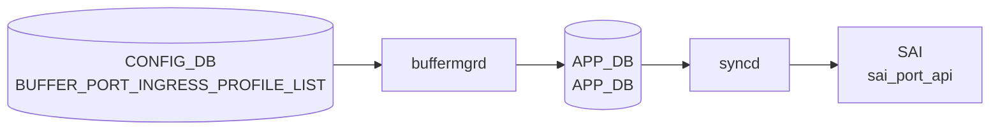

# BUFFER_PORT_INGRESS_PROFILE_LIST テーブル

## 概要

**ポートに紐づけるイングレスバッファプロファイル群** を定義する CONFIG_DB テーブル[^1]。SAI における `SAI_PORT_ATTR_QOS_INGRESS_BUFFER_PROFILE_LIST` 相当で、`BUFFER_PROFILE` テーブルで定義した複数プロファイルを、ポート単位で **順序を保ったリスト** として束ねる。

ingress 方向の `BUFFER_PG` (priority-group ごとのバッファ) と並ぶ別系統で、こちらはポート全体としての ingress プロファイル群の集約。動的バッファモデル (`buffer_model = dynamic`) ではあまり使われず、静的バッファ設定で利用されることが多い。

<!-- cdb-mermaid -->
### データフロー (自動生成)



!!! note "凡例"
    CONFIG_DB から SAI までの典型経路を `docs/reference/config-db-orch-map.md` から機械生成したミニ図。詳細・例外は本ページ本文と対応表を参照。
<!-- /cdb-mermaid -->

## key 構造

```
BUFFER_PORT_INGRESS_PROFILE_LIST|<port>
```

- `<port>`: `PORT.name` への leafref (例: `Ethernet0`)

## フィールド

| フィールド | 型 | 説明 |
|-----------|----|------|
| `port` (key) | leafref → `PORT.name` | 対象ポート |
| `profile_list` | leaf-list of leafref → `BUFFER_PROFILE.name` (ordered-by user) | ポートにバインドする ingress バッファプロファイル名の順序付きリスト |

`profile_list` は **`ordered-by user`** で設定順を保持する。CONFIG_DB では `","` 区切りの文字列として保存される慣習。

## 制約

- `port` は `PORT_LIST.name` への leafref で、対象ポートが存在しないと validation エラー。
- 各 `profile_list` 要素も `BUFFER_PROFILE_LIST.name` への leafref。

## 購読者

- `buffermgrd` (`docker-swss`): CONFIG_DB → APPL_DB の `BUFFER_PORT_INGRESS_PROFILE_LIST_TABLE`
- `orchagent` (BufferOrch): APPL_DB → SAI の port ingress buffer profile list 設定

## 関連 CONFIG_DB / YANG / CLI

- 関連 CONFIG_DB: `BUFFER_PROFILE`, `BUFFER_POOL`, `BUFFER_PG`, `PORT`, `BUFFER_PORT_EGRESS_PROFILE_LIST`
- 関連 CLI: `config buffer profile` (sonic-utilities)
- 関連 YANG: `sonic-buffer-port-ingress-profile-list`, `sonic-buffer-profile`

<!-- ref-triangle:start -->

## 関連リファレンス

- YANG: `sonic-buffer-port-ingress-profile-list`
- CLI: [`config buffer`](../cli/config-buffer.md)

<!-- ref-triangle:end -->

## 引用元

[^1]: YANG 定義: `sonic-buffer-port-ingress-profile-list.yang`. <https://github.com/sonic-net/sonic-buildimage/blob/9ea932ec2e18f35e58268ec2e4456b1d4afd65cd/src/sonic-yang-models/yang-models/sonic-buffer-port-ingress-profile-list.yang>

## 関連ページ
- [CONFIG_DB: BUFFER_PROFILE](buffer-profile.md)
- [CONFIG_DB: BUFFER_POOL](buffer-pool.md)
- [CONFIG_DB: BUFFER_PG](buffer-pg.md)
