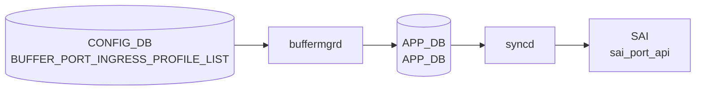

# BUFFER_PORT_INGRESS_PROFILE_LIST テーブル

## 概要

**ポートに紐づけるイングレスバッファプロファイル群** を定義する [CONFIG_DB](../../reference/glossary.md#term-config_db) テーブル[^1]。[SAI](../../reference/glossary.md#term-sai) における `SAI_PORT_ATTR_QOS_INGRESS_BUFFER_PROFILE_LIST` 相当で、`BUFFER_PROFILE` テーブルで定義した複数プロファイルを、ポート単位で **順序を保ったリスト** として束ねる。

ingress 方向の `BUFFER_PG` (priority-group ごとのバッファ) と並ぶ別系統で、こちらはポート全体としての ingress プロファイル群の集約。動的バッファモデル (`buffer_model = dynamic`) ではあまり使われず、静的バッファ設定で利用されることが多い。

<!-- cdb-mermaid -->
### データフロー (自動生成)



!!! note "凡例"
    CONFIG_DB から SAI までの典型経路を `docs/reference/config-db-orch-map.md` から機械生成したミニ図。詳細・例外は本ページ本文と対応表を参照。
<!-- /cdb-mermaid -->

## key 構造

```text
BUFFER_PORT_INGRESS_PROFILE_LIST|<port>
```

- `<port>`: `PORT.name` への leafref (例: `Ethernet0`)

## フィールド

| フィールド | 型 | 説明 |
|-----------|----|------|
| `port` (key) | leafref → `PORT.name` | 対象ポート |
| `profile_list` | leaf-list of leafref → `BUFFER_PROFILE.name` (ordered-by user) | ポートにバインドする ingress バッファプロファイル名の順序付きリスト |

`profile_list` は **`ordered-by user`** で設定順を保持する。[CONFIG_DB](../../reference/glossary.md#term-config_db) では `","` 区切りの文字列として保存される慣習。

## 制約

- `port` は `PORT_LIST.name` への leafref で、対象ポートが存在しないと validation エラー。
- 各 `profile_list` 要素も `BUFFER_PROFILE_LIST.name` への leafref。

<!-- defaults -->
## 暗黙デフォルト・コード由来の挙動

YANG に `default` 節は存在しない。以下はすべてコード実装から検出した暗黙挙動。

| フィールド / 条件 | 暗黙挙動 | 種別 | evidence |
|-----------------|---------|------|---------|
| `profile_list` 不在 | [APPL_DB](../../reference/glossary.md#term-appl_db) に書かない（エントリなし） | dead field なし | `buffermgr.cpp:doBufferTableTask` |
| 参照 `BUFFER_PROFILE` が未ロード | `task_need_retry` でキューに残す（silent retry） | silent fallback | `buffermgrdyn.cpp:3282-3285` |
| `m_bufferPoolReady == false` | APPL_DB 書き込みを保留 (`m_bufferObjectsPending=true`) | 暗黙 pending | `buffermgrdyn.cpp:3408-3414` |
| admin-down ポート | ユーザー設定 `profile_list` を **zero profile list に silent 置換** して APPL_DB へ書き込む | silent substitution | `buffermgrdyn.cpp:3418-3438` |
| zero profile が存在しないプール | WARN ログのみ、当該プールをスキップ（部分置換） | partial silent drop | `buffermgrdyn.cpp:1185-1188` |
| egress 方向プロファイルを `profile_list` に設定 (dynamic) | `task_failed`、エントリ消去 | 方向不一致エラー | `buffermgrdyn.cpp:3289-3296` |
| `packet_discard_action=trim` プロファイルを `profile_list` に設定 | [orchagent](../../reference/glossary.md#term-orchagent) が `task_failed` を返す（ingress trim 禁止） | ハードコード禁止 | `bufferorch.cpp:1725-1731` |
| bulk [SAI](../../reference/glossary.md#term-sai) 部分失敗 | `SAI_BULK_OP_ERROR_MODE_IGNORE_ERROR` で続行、失敗ポートは `task_need_retry` 再投入 | partial failure | `bufferorch.cpp:1823-1844` |
| プロファイルリスト変更なし | SAI 呼び出しをスキップ（idempotent） | silent skip | `bufferorch.cpp:1695-1699` |
| キー内ポート名空文字 | `task_invalid_entry`、エントリ消去 | silent drop | `buffermgrdyn.cpp:3509-3513` |
| カンマ区切りポートリスト | 各ポートに展開して順次処理。途中 retry で残りをスキップ | 暗黙展開 + partial retry | `buffermgrdyn.cpp:3527-3548` |
| `buffer_profile_list` 以外のフィールド (dynamic) | SWSS_LOG_ERROR + `continue`（フィールド無視） | silent field drop | `buffermgrdyn.cpp:3402-3405` |
| static buffer model (`buffermgr.cpp`) | 方向チェック・trim チェックなし、そのまま APPL_DB へ転送 | static/dynamic 乖離 | `buffermgr.cpp:doBufferTableTask` |
| DEL 操作 (dynamic) | コード実行はされる（erase + del）が「Mellanox では非サポート」コメントあり | コメントと実装の乖離 | `buffermgrdyn.cpp:3441-3446` |

> **YANG vs 実装 discrepancy**: YANG の `leaf-list profile_list` に `default`・方向制約・trim 禁止の記述はない。これらは純粋に実装（buffermgrdyn.cpp / bufferorch.cpp）による制約。
<!-- /defaults -->

<!-- ordering -->
## 書込み順序依存 (Phase B)

このテーブルにエントリを書き込む前に以下の前提条件を満たす必要がある。

| # | 先行必須テーブル / 条件 | 違反時の挙動 | evidence |
|---|----------------------|------------|---------|
| 1 | `BUFFER_PROFILE` エントリが先行（参照プロファイルが `m_bufferProfileLookup` / [orchagent](../../reference/glossary.md#term-orchagent) に認識済み） | `task_need_retry`（silent retry、ログに残る） | `buffermgrdyn.cpp:3282-3285`, `bufferorch.cpp:1683-1688` |
| 2 | `BUFFER_POOL` エントリが先行（`m_bufferPoolReady == true`） | APPL_DB 書き込み pending（`m_bufferObjectsPending=true`）、BUFFER_POOL 完了後自動再処理 | `buffermgrdyn.cpp:3408-3414` |
| 3 | `PORT` エントリが先行（PortsOrch にポート認識済み） | `task_invalid_entry`（エントリ消去、永続エラー） | `bufferorch.cpp:1762-1765` |

### ハードコード禁止事項

| 禁止条件 | 違反時の挙動 | evidence |
|---------|------------|---------|
| `packet_discard_action=trim` のプロファイルを `profile_list` に指定 | `task_failed`（エントリ消去）― ingress 側 trim は SAI 仕様禁止 | `bufferorch.cpp:1725-1731` |
| `direction=egress` のプロファイルを `profile_list` に指定（dynamic モード） | `task_failed`（エントリ消去）― SAI 方向制約違反 | `buffermgrdyn.cpp:3289-3296` |

> **推奨書込み順**: `BUFFER_POOL` → `BUFFER_PROFILE` → `PORT` → `BUFFER_PORT_INGRESS_PROFILE_LIST`
<!-- /ordering -->

<!-- cdb-exceptions -->
## 例外条件・特殊挙動

- **プロファイル参照未解決 → retry**: `profile_list` に参照する `BUFFER_PROFILE` が未存在の場合、`orchagent` は `task_need_retry` を返しエントリを保留する。<!-- evidence: bufferorch.cpp L1679-1686 processIngressBufferProfileList -->
- **リスト変更なし → SAI 呼び出しスキップ**: プロファイルリストが既存キャッシュと同一の場合は SAI を呼ばずにスキップする。<!-- evidence: bufferorch.cpp L1692-1696 -->
- **trimming-eligible プロファイル禁止 → task_failed**: `packet_discard_action = trim` のプロファイルは ingress profile list に設定不可。SAI 仕様上 ingress 側でのパケットトリミングは禁止されており `task_failed` となる。<!-- evidence: bufferorch.cpp L1717-1731 -->
- **ポート未存在 → task_invalid_entry**: 指定ポート名が PortsOrch のポートマップに存在しない場合 `task_invalid_entry` を返す。<!-- evidence: bufferorch.cpp L1760-1764 -->

<!-- value-behavior -->
## 値依存挙動マトリクス

このテーブルに enum フィールドはない。ただし参照する `BUFFER_PROFILE.packet_discard_action` の値によって挙動が変わる。

| 参照プロファイルの `packet_discard_action` | 挙動 |
|------------------------------------------|------|
| `drop`（既定） | `profile_list` に含めて ingress profile list として設定可能。`BufferOrch` が SAI `SAI_PORT_ATTR_QOS_INGRESS_BUFFER_PROFILE_LIST` を更新する。 |
| `trim` | `BufferOrch` が `isTrimmingEligible=true` を検出し `task_failed` を返す（`bufferorch.cpp:1725-1731`）。ingress profile list への trim プロファイルの適用は SAI 仕様上 **禁止**。 |

また、`buffer_model=dynamic` では `buffermgrd` が profile list を自動生成するため、ユーザによる手動設定は通常不要。
<!-- /value-behavior -->

## 購読者

- `buffermgrd` (`docker-swss`): [CONFIG_DB](../../reference/glossary.md#term-config_db) → [APPL_DB](../../reference/glossary.md#term-appl_db) の `BUFFER_PORT_INGRESS_PROFILE_LIST_TABLE`
- `orchagent` (BufferOrch): [APPL_DB](../../reference/glossary.md#term-appl_db) → [SAI](../../reference/glossary.md#term-sai) の port ingress buffer profile list 設定

## 関連 CONFIG_DB / YANG / CLI

- 関連 CONFIG_DB: `BUFFER_PROFILE`, `BUFFER_POOL`, `BUFFER_PG`, `PORT`, `BUFFER_PORT_EGRESS_PROFILE_LIST`
- 関連 CLI: `config buffer profile` ([sonic-utilities](../../reference/glossary.md#term-sonic-utilities))
- 関連 [YANG](../../reference/glossary.md#term-yang): `sonic-buffer-port-ingress-profile-list`, `sonic-buffer-profile`

<!-- ref-triangle:start -->

## 関連リファレンス

- [YANG](../../reference/glossary.md#term-yang): `sonic-buffer-port-ingress-profile-list`
- CLI: [`config buffer`](../cli/config-buffer.md)

<!-- ref-triangle:end -->

## 引用元

[^1]: [YANG](../../reference/glossary.md#term-yang) 定義: `sonic-buffer-port-ingress-profile-list.yang`. <https://github.com/sonic-net/sonic-buildimage/blob/9ea932ec2e18f35e58268ec2e4456b1d4afd65cd/src/sonic-yang-models/yang-models/sonic-buffer-port-ingress-profile-list.yang>

## 関連ページ
- [CONFIG_DB: BUFFER_PROFILE](buffer-profile.md)
- [CONFIG_DB: BUFFER_POOL](buffer-pool.md)
- [CONFIG_DB: BUFFER_PG](buffer-pg.md)

<!-- ops-hint -->
## 運用ヒント

### 典型値

- key 形式: `BUFFER_PORT_INGRESS_PROFILE_LIST|<port>` (例 `BUFFER_PORT_INGRESS_PROFILE_LIST|Ethernet0`)。
- `profile_list`: `","` 区切り (例 `"ingress_lossless_profile,ingress_lossy_profile"`)。
- static-buffer モードでの利用が中心。dynamic-buffer モードでは通常不要。

### よくある誤設定

- `BUFFER_PROFILE` に存在しないプロファイル名を入れて leafref 検証エラー。
- dynamic-buffer モードで設定したが反映されず混乱する (dynamic では buffermgrd が自動生成)。

### 確認コマンド

```bash
sonic-db-cli CONFIG_DB hgetall 'BUFFER_PORT_INGRESS_PROFILE_LIST|Ethernet0'
sonic-db-cli APPL_DB hgetall 'BUFFER_PORT_INGRESS_PROFILE_LIST_TABLE:Ethernet0'
show buffer pool
```
<!-- /ops-hint -->

<!-- runtime-trace -->
## 実コンテナ動作トレース

### 段階 1 — Consumer 登録

`buffermgrd` → `BufferOrch` (APPL_DB 経由) が CONFIG_DB の `BUFFER_PORT_INGRESS_PROFILE_LIST` テーブルを購読する。

`BUFFER_PORT_INGRESS_PROFILE_LIST` の key は `<port>` (例: `Ethernet0`)。

### 段階 2 — CFG→APPL 翻訳

`APP_BUFFER_PORT_INGRESS_PROFILE_LIST_TABLE` に書き込み

### 段階 3 — APPL→SAI

`sai_buffer_api` / `sai_port_api` — ポートの ingress バッファプロファイルリストをバインド

### 段階 4 — タイミングと副作用

**適用タイミング**: CONFIG_DB 変化を `buffermgrd` が検知後 APPL_DB に書き込み。`BufferOrch` が SAI port attribute を更新。

**副作用**: 対象ポートの ingress バッファ割り当てが変更される。[PFC](../../reference/glossary.md#term-pfc) や lossless traffic に影響する可能性がある。
<!-- /runtime-trace -->

<!-- entry-points -->
## 書き込み入り口 (Direction A)

対象テーブル: `BUFFER_PORT_INGRESS_PROFILE_LIST`

### CLI
- `config interface buffer ingress-profile-list set <port> <profile>`
  - ソース: `sonic-utilities/config/main.py (buffer グループ)`

### minigraph / sonic-cfggen
- あり: `sonic-cfggen -m <minigraph.xml>` 実行時に本テーブルが生成・上書きされる

### REST / gNMI (sonic-mgmt-common)
- なし (対応 OpenConfig/[SONiC](../../reference/glossary.md#term-sonic) YANG transformer なし)

### db_migrator
- なし

### ビルド時デフォルト (init_cfg / j2 テンプレート)
- `buffers_config.j2` から生成

### ハードコードデフォルト
- なし

### ランタイム注入 (デーモン自動書き込み)
- Dynamic buffer model: `buffermgrd` がポートごとに書き込み
<!-- /entry-points -->

<!-- derivation -->
## 派生・条件付き登録 (Phase 6/7)

### Phase 6: 値による他フィールド自動派生

| 条件 | 派生先 | evidence |
|---|---|---|
| Dynamic buffer model: `buffermgrd` がポートの ingress プロファイルリストを自動生成 | `BUFFER_PORT_INGRESS_PROFILE_LIST` にエントリを書き込む | `sonic-swss/cfgmgr/buffermgrdyn.cpp:447,3567` |

### Phase 7: 条件付き module/manager 登録

| 条件 | 登録 module | evidence |
|---|---|---|
| 常時（条件なし） | `BufferMgrDynamic` が `BUFFER_PORT_INGRESS_PROFILE_LIST` を `handleBufferPortIngressProfileListTable` に登録 | `sonic-swss/cfgmgr/buffermgrdyn.cpp:447` |

### grep カバレッジ

- buffermgrdyn.cpp L447: BUFFER_PORT_INGRESS_PROFILE_LIST ハンドラ登録（条件なし）
<!-- /derivation -->
<!-- handler-branching -->
### Phase 8: Handler メソッド内分岐

| Manager / Handler | メソッド | 分岐条件 | 効果 | evidence |
|---|---|---|---|---|
| `BufferMgrDynamic` | `handleBufferObjectTables()` | キー形式が不正（ポート名空） | `task_invalid_entry` 返却 | `sonic-swss/cfgmgr/buffermgrdyn.cpp:3514` |
| `BufferMgrDynamic` | `handleBufferObjectTables()` | カンマ区切りポートリスト | ポートごとにシングルポートハンドラを繰り返し呼び出し | `sonic-swss/cfgmgr/buffermgrdyn.cpp:3536-3547` |

> **スキャン証跡**: `handleBufferPortIngressProfileListTable` は `handleBufferObjectTables(tuple, CFG_BUFFER_PORT_INGRESS_PROFILE_LIST_NAME, false)` に委譲。egress 版と同一パス。2 件分岐抽出。
<!-- /handler-branching -->

<!-- pubsub -->
## 通信メカニズム (Phase G)

### CONFIG_DB 購読 — `SubscriberStateTable`

`buffermgrd`（dynamic モード）は `swsscommon` の `Orch` 基底クラスを通じて、
`TableConnector(&cfgDb, CFG_BUFFER_PORT_INGRESS_PROFILE_LIST_NAME)` で登録された
`SubscriberStateTable` により CONFIG_DB を購読する。内部では [Redis](../../reference/glossary.md#term-redis) **keyspace 通知**
（`__keyspace@<dbId>__:BUFFER_PORT_INGRESS_PROFILE_LIST|*` への PSUBSCRIBE）を使い、
`HSET` / `DEL` による変更を `KeyOpFieldsValuesTuple` として受信する。

```cpp
// buffermgrd.cpp:181
TableConnector(&cfgDb, CFG_BUFFER_PORT_INGRESS_PROFILE_LIST_NAME),
// buffermgrdyn.cpp:32
BufferMgrDynamic::BufferMgrDynamic(..., const vector<TableConnector> &tables, ...)
    : Orch(tables), ...   // Orch が SubscriberStateTable として登録
```

### CONFIG_DB → APPL_DB 転送 — `ProducerStateTable`

APPL_DB への書き込みは `ProducerStateTable` を使用する。
`ProducerStateTable.set()` は **HSET + PUBLISH を原子的に実行**（[Redis](../../reference/glossary.md#term-redis) MULTI/EXEC）し、
[orchagent](../../reference/glossary.md#term-orchagent) の `ConsumerStateTable` にリアルタイム通知を届ける。

```cpp
// buffermgrdyn.cpp:47
m_applBufferProfileListTables{
    ProducerStateTable(applDb, APP_BUFFER_PORT_INGRESS_PROFILE_LIST_NAME), ...};
// buffermgrdyn.cpp:3384,3437
ProducerStateTable &appTable = m_applBufferProfileListTables[BUFFER_INGRESS];
appTable.set(port, fvVector);  // SET: profile_list をポートに書き込み
```

### APPL_DB 購読 — `ConsumerStateTable` (orchagent)

`BufferOrch` は `Orch(applDb, tableNames)` で `APP_BUFFER_PORT_INGRESS_PROFILE_LIST_NAME`
を `ConsumerStateTable` として購読する。`PUBLISH` 通知を受信すると `HGETALL` でフィールドを
取得し、`processIngressBufferProfileList()` / `processIngressBufferProfileListBulk()` に渡す。

```cpp
// bufferorch.cpp:53-54,77,80
BufferOrch::BufferOrch(...) : Orch(applDb, tableNames), ...
m_bufferHandlerMap[APP_BUFFER_PORT_INGRESS_PROFILE_LIST_NAME]
    = &BufferOrch::processIngressBufferProfileList;
m_bufferFlushHandlerMap[APP_BUFFER_PORT_INGRESS_PROFILE_LIST_NAME]
    = &BufferOrch::processIngressBufferProfileListBulk;
```

### Bulk Set 経路 — `sai_port_api->set_ports_attribute`

orchagent は複数ポートを **SAI Bulk API** でまとめて処理する。

```cpp
// bufferorch.cpp:1823-1824
sai_port_api->set_ports_attribute(
    objectCount, oids.data(), attrs.data(),
    SAI_BULK_OP_ERROR_MODE_IGNORE_ERROR, statuses.data());
// SAI 属性 ID: SAI_PORT_ATTR_QOS_INGRESS_BUFFER_PROFILE_LIST (bufferorch.cpp:1675)
```

`SAI_BULK_OP_ERROR_MODE_IGNORE_ERROR` により部分失敗を許容し、失敗ポートは
`task_need_retry` で再投入される（`bufferorch.cpp:1840-1843`）。

### メッセージフロー

| ステップ | コンポーネント | API / 手段 |
|---------|--------------|-----------|
| CONFIG_DB 変化検知 | `buffermgrd` (BufferMgrDynamic) | `SubscriberStateTable` (keyspace 通知) |
| バリデーション・変換 | `handleBufferPortIngressProfileListTable()` | `buffermgrdyn.cpp:3566` |
| APPL_DB 書き込み | `ProducerStateTable.set()` | HSET + PUBLISH (channel ベース) |
| APPL_DB 受信 | `BufferOrch` | `ConsumerStateTable` (channel SUBSCRIBE) |
| SAI 適用 | `processIngressBufferProfileListBulk()` | `sai_port_api->set_ports_attribute()` (Bulk) |

> **static vs dynamic**: static バッファモデル (`buffermgr.cpp`) では `ConsumerStateTable`
> (cfgDb) で CONFIG_DB を直接購読し、バリデーションなしに APPL_DB へ転送する。
<!-- /pubsub -->

<!-- constants -->
## ハードコード定数 (Phase E)

### テーブル名・フィールド名定数

| 定数名 | 値 | ソース |
|---|---|---|
| `CFG_BUFFER_PORT_INGRESS_PROFILE_LIST_NAME` | `"BUFFER_PORT_INGRESS_PROFILE_LIST"` | `sonic-swss-common/common/schema.h:365` |
| `APP_BUFFER_PORT_INGRESS_PROFILE_LIST_NAME` | `"BUFFER_PORT_INGRESS_PROFILE_LIST_TABLE"` | `sonic-swss-common/common/schema.h:163` |
| `buffer_profile_list_field_name` | `"profile_list"` | `sonic-swss/orchagent/bufferorch.h:34` |

### SAI 識別子

| 定数名 | 用途 | ソース |
|---|---|---|
| `SAI_PORT_ATTR_QOS_INGRESS_BUFFER_PROFILE_LIST` | ingress バッファプロファイルリストをポートに bind する SAI 属性 ID | `bufferorch.cpp:1675` |
| `SAI_BULK_OP_ERROR_MODE_IGNORE_ERROR` | Bulk SAI 呼び出し時エラーモード（一部ポート失敗が他ポートをブロックしない） | `bufferorch.cpp:1824` |
| `SAI_OBJECT_TYPE_PORT` | `SaiAttrWrapper` 生成時に指定するオブジェクト型 | `bufferorch.cpp:1768` |
| `SAI_API_PORT` | `handleSaiSetStatus` でエラー処理時に渡す SAI API 種別 | `bufferorch.cpp:1785` |
| `SAI_STATUS_NOT_EXECUTED` | bulk 配列初期値（未実行状態マーカー） | `bufferorch.cpp:1768,1813` |
| `SAI_STATUS_SUCCESS` | post 処理で成功判定に使う SAI ステータス値 | `bufferorch.cpp:1783` |

### direction 値（ingress 固定）

`handleSingleBufferPortIngressProfileListEntry` は常に `BUFFER_INGRESS`（文字列 `"ingress"`）を `handleSingleBufferPortProfileListEntry` に渡す。egress profile（`BUFFER_EGRESS` 方向）を ingress profile list に指定した場合は `checkBufferProfileDirection` が `task_failed` を返す。

| 内部列挙値 | 整数値 | 文字列表現 | ソース |
|---|---|---|---|
| `BUFFER_INGRESS` | `0` | `"ingress"` | `buffermgrdyn.h:20`, `buffermgrdyn.cpp:36,3454` |
| `BUFFER_EGRESS` | `1` | `"egress"` | `buffermgrdyn.h:22`（参照用） |

### 区切り文字

| 定数名 | 値 | 用途 |
|---|---|---|
| `list_item_delimiter` | `','`（カンマ） | `tokenize(key, list_item_delimiter)` — キー内のポート名分割 |
| （無名） | `','`（カンマ） | `checkBufferProfileDirection` 内の profile 名リスト分割 |

evidence: `sonic-swss/orchagent/orch.h:32`, `bufferorch.cpp:1672`, `buffermgrdyn.cpp:3278`

### 空リスト（DEL 操作時のハードコード）

DEL 操作時、SAI に count=0 のオブジェクトリストを渡すことで「ingress バッファプロファイルなし」を表現する。YANG には記述なし。

| 属性 | ハードコード値 | ソース |
|---|---|---|
| `attr.value.objlist.count` | `0` | `bufferorch.cpp:1749` |
| `attr.value.objlist.list` | 空ベクタの `.data()` ポインタ | `bufferorch.cpp:1750` |

### trim 禁止判定（ingress 専用ハードコード）

`processIngressBufferProfileList` 内で profile ごとに `profCfg.isTrimmingEligible` を確認し、`true` の場合は `task_failed` を即時返却する。egress profile list には同等チェックがない（SAI 仕様上 ingress 側トリミングは禁止）。

| チェック対象フラグ | 値（禁止条件） | 効果 | ソース |
|---|---|---|---|
| `profCfg.isTrimmingEligible` | `true` | `task_failed` 返却、profile list 適用拒否 | `bufferorch.cpp:1725-1731` |

### Bulk SAI 処理順（DEL 優先）

`processIngressBufferProfileListBulk` 内で `{DEL_COMMAND, SET_COMMAND}` の順にループするため、DEL が SET より先に SAI へ送られる。

evidence: `bufferorch.cpp:1800`
<!-- /constants -->
<!-- platform -->
## プラットフォーム差分

### Dynamic vs Static バッファモデル

| 観点 | Static model (`buffermgr.cpp`) | Dynamic model (`buffermgrdyn.cpp`) |
|------|-------------------------------|-------------------------------------|
| 有効条件 | `DEVICE_METADATA.buffer_model != "dynamic"` | `DEVICE_METADATA.buffer_model == "dynamic"` |
| direction 検証 | なし（orchagent 段で初めて制約が現れる） | あり: egress profile を ingress list に設定 → `task_failed` |
| profile 存在検証 | なし（orchagent 段で `task_need_retry`） | あり: `m_bufferProfileLookup` に未登録 → `task_need_retry` |
| admin-down port 置換 | なし（CONFIG_DB 値をそのまま APPL_DB へ） | あり: ゼロプロファイルリストへ差し替え |
| buffer pool guard | なし | あり: `m_bufferPoolReady == false` → pending |
| DEL 操作 | APPL_DB から削除 | `// Not supported on Mellanox platform for now.` 注記付きで削除処理 |

evidence: `buffermgrdyn.cpp:3387-3450`, `buffermgr.cpp:476-480`

### ASIC vendor 差分

**Mellanox 固有**:
- `ASIC_VENDOR` 環境変数でプラットフォームを判別し、Lua ヘッドルームプラグイン (`buffer_headroom_<vendor>.lua`) をロード。
- Mellanox SN シリーズのモデル番号を取得し、4xxx / 5xxx の特定モデルでは 8 レーンポートの profile 名に `_8lane` を付与。これは参照する `BUFFER_PROFILE` 名に影響するが、本テーブルのキー・フィールド処理コード自体には分岐なし。
- DEL パスに `// Not supported on Mellanox platform for now.` コメントあり。ingress / egress 両 profile list 共通の関数 `handleSingleBufferPortProfileListEntry` 内に存在（`buffermgrdyn.cpp:3443`）。削除処理は実行されるが正式サポート外。

**trim 禁止制約（ベンダー共通）**:
- `bufferorch.cpp:1725-1731` の `isTrimmingEligible` チェックにより、`packet_discard_action=trim` のプロファイルを ingress profile list に設定すると `task_failed`。SAI 仕様上の制限でベンダー問わず適用。egress 側には同等制約なし。

**Broadcom / その他**:
- モデル番号取得や 8 レーン倍増なし。Lua プラグイン名のみ異なる（`buffer_headroom_broadcom.lua` 等）。テーブル処理コードに vendor 条件分岐なし。

### VOQ Chassis

`processIngressBufferProfileList()` / `processIngressBufferProfileListBulk()` 内に `gMySwitchType == "voq"` 分岐は存在しない。[VOQ](../../reference/glossary.md#term-voq) chassis でも同一コードパスが実行される。

[VOQ](../../reference/glossary.md#term-voq) 固有のキー拡張（`tokens.size() == 4` 形式のシステムポートキー）は BUFFER_QUEUE ハンドラにのみ適用され、BUFFER_PORT_INGRESS_PROFILE_LIST には影響しない。

唯一の間接的影響: `bufferorch.cpp:2079-2094` の `doTask()` で、[VOQ](../../reference/glossary.md#term-voq) chassis は `isInitDone()`（非 VOQ は `isConfigDone()`）を使うため処理開始タイミングがやや早くなる。

evidence: `bufferorch.cpp:1660-1774`（`processIngressBufferProfileList`: voq 分岐なし）、`bufferorch.cpp:116-140`（`initVoqBufferReadyList`: BUFFER_QUEUE のみ対象）

### まとめ

| 差分カテゴリ | 差分有無 | 備考 |
|------------|---------|------|
| dynamic vs static model | **あり** | direction 検証・admin-down 置換・pool guard は dynamic のみ |
| trim プロファイル禁止 | **あり（ingress 専用）** | egress には同等制約なし |
| Mellanox DEL 未サポートコメント | **あり** | 処理は動作するが正式未サポート注記 |
| Mellanox 8 レーン xon 倍増 | 間接的 | 参照 BUFFER_PROFILE 名に影響、テーブル処理コードに分岐なし |
| VOQ Chassis | **差分なし** | 処理開始タイミング以外は同一コードパス |
| その他 [ASIC](../../reference/glossary.md#term-asic) vendor | **差分なし** | Lua プラグイン名のみ異なる |
<!-- /platform -->

<!-- failure -->
## 失敗挙動・エラー分岐

### buffermgrdyn.cpp (dynamic buffer model)

| 失敗条件 | 返却値 | ログレベル | evidence |
|--------|-------|----------|---------|
| `profile_list` 内のプロファイルが `m_bufferProfileLookup` に未登録 | `task_need_retry` | INFO | `buffermgrdyn.cpp:3281-3285` (`checkBufferProfileDirection`) |
| egress 方向プロファイルを ingress profile_list に指定（direction mismatch） | `task_failed` | ERROR | `buffermgrdyn.cpp:3289-3295` (`checkBufferProfileDirection`) |
| キー内ポート名が空（無効キー形式） | `task_invalid_entry` | ERROR | `buffermgrdyn.cpp:3509-3513` (`handleBufferObjectTables`) |
| `m_bufferPoolReady == false`（buffer pool 未準備） | pending（`task_success` 返却・APPL_DB 書き込み保留） | NOTICE | `buffermgrdyn.cpp:3408-3414` |
| `portInfo.state == PORT_ADMIN_DOWN`（admin-down 期間） | silent 置換（zero profile list を APPL_DB へ書き込み） | なし | `buffermgrdyn.cpp:3418-3438` |

> **direction mismatch** は dynamic model のみに適用される。`buffermgr.cpp`（static model）は方向チェックを行わず APPL_DB にそのまま転送する。

### bufferorch.cpp (orchagent)

| 失敗条件 | 返却値 | ログレベル | evidence |
|--------|-------|----------|---------|
| `resolveFieldRefArray()` → `not_resolved`（プロファイル参照未解決） | `task_need_retry` | INFO | `bufferorch.cpp:1685-1688` |
| `resolveFieldRefArray()` その他失敗 | `task_failed` | ERROR | `bufferorch.cpp:1690-1691` |
| `profCfg.isTrimmingEligible == true`（`packet_discard_action=trim` プロファイル） | `task_failed` | ERROR | `bufferorch.cpp:1725-1731` |
| `gPortsOrch->getPort()` 失敗（ポート未登録） | `task_invalid_entry` | ERROR | `bufferorch.cpp:1762-1765` |
| SAI Bulk SET 部分失敗（`SAI_BULK_OP_ERROR_MODE_IGNORE_ERROR`） | 失敗ポートのみ `task_need_retry` で再投入（成功ポートは確定） | ERROR | `bufferorch.cpp:1823-1843` |

> **trim 禁止**は ingress 専用制約。egress profile list (`processEgressBufferProfileList`) には同等チェックが存在しない（SAI 仕様上 egress 側のトリミングは許容される）。

> **SAI Bulk 部分失敗**は `processIngressBufferProfileListBulk()` 内で処理される。`SAI_BULK_OP_ERROR_MODE_IGNORE_ERROR` を使用するため、複数ポートの一括 SET において一部ポートが失敗しても処理は継続する。失敗したポートのエントリは `consumer.m_toSync` に再投入され次回リトライされる。

<!-- /failure -->

<!-- side-effects -->
## 副次 DB 書込（STATE_DB / COUNTERS_DB / APPL_STATE_DB / FLEX_COUNTER_DB）

`buffermgrdyn.cpp` および `bufferorch.cpp` を精査した結果、**BUFFER_PORT_INGRESS_PROFILE_LIST の処理経路に副次 DB 書込は存在しない**。

| 対象 DB | 書込有無 | 根拠 |
|--------|---------|------|
| [STATE_DB](../../reference/glossary.md#term-state_db) | **なし** | `buffermgrdyn.cpp` は `m_stateBufferPoolTable` / `m_stateBufferProfileTable` に書くが、これらは BUFFER_POOL / BUFFER_PROFILE ハンドラ内のみ。ingress profile list 処理パス (`handleBufferObjectTables` → `handleSingleBufferPortProfileListEntry`) に [STATE_DB](../../reference/glossary.md#term-state_db) 書込なし。 |
| APPL_STATE_DB | **なし** | `m_applStateBufferPoolTable` / `m_applStateBufferProfileTable` の接続はあるが、ingress profile list ハンドラから書込コードは呼ばれない。(`buffermgrdyn.cpp:43-51`) |
| [COUNTERS_DB](../../reference/glossary.md#term-counters_db) | **なし** | `bufferorch.cpp:55-56,546` の `m_counterNameMapUpdater` は BUFFER_POOL の set/del 時にのみ呼ばれる。`processIngressBufferProfileList` / `processIngressBufferProfileListBulk` からは呼ばれない。 |
| [FLEX_COUNTER_DB](../../reference/glossary.md#term-flex_counter_db) | **なし** | `bufferorch.cpp:247,337,344` の FLEX_COUNTER 操作は buffer pool watermark カウンタ専用。ingress profile list ハンドラは `sai_port_api->set_ports_attribute` (bulk SAI) を呼ぶのみで [FLEX_COUNTER_DB](../../reference/glossary.md#term-flex_counter_db) には触れない。 |

> **evidence**: `buffermgrdyn.cpp:313,361,887,920`（[STATE_DB](../../reference/glossary.md#term-state_db) 書込は BUFFER_POOL/PROFILE ハンドラ内）、`bufferorch.cpp:1663-1848`（`processIngressBufferProfileList` / `processIngressBufferProfileListBulk` — DB 書込なし、SAI のみ）
<!-- /side-effects -->

<!-- cross-refs -->
## 暗黙参照テーブル (Phase C)

`BUFFER_PORT_INGRESS_PROFILE_LIST` エントリが CONFIG_DB に書かれたとき、`buffermgrd` および `BufferOrch` が以下のテーブルを**暗黙的に leafref 参照**する。YANG スキーマ上は leafref として定義されているが、実装上はコード内 lookup / resolve で処理される。

| 参照元フィールド / 状態 | 参照先テーブル | 参照先キー形式 | 解決主体 | 未解決時の挙動 |
|---|---|---|---|---|
| `profile_list` 各要素 | `BUFFER_PROFILE` | `BUFFER_PROFILE\|<name>` | `buffermgrd` の `m_bufferProfileLookup` | `task_need_retry`（silent retry）— `buffermgrdyn.cpp:3280-3285` |
| `profile_list` 各要素 | APPL_DB `BUFFER_PROFILE_TABLE` | `BUFFER_PROFILE_TABLE:<name>` | `BufferOrch` の `resolveFieldRefArray` | `task_need_retry` — `bufferorch.cpp:1683-1688` |
| SET 処理時の pool 準備チェック | `BUFFER_POOL` (ingress 系全プール) | `BUFFER_POOL\|<pool>` | `buffermgrd` の `m_bufferPoolReady` フラグ | APPL_DB 書き込みを pending（`m_bufferObjectsPending=true`）、BUFFER_POOL 完了後自動再処理 — `buffermgrdyn.cpp:3408-3414` |
| キー `<port>` (ポート名) | `PORT` | `PORT\|<port>` | `BufferOrch` の PortsOrch ポートマップ | `task_invalid_entry`（エントリ消去）— `bufferorch.cpp:1762-1765` |
| キー `<port>` (ポート名) | `PORT` | `PORT\|<port>` | `buffermgrd` の `m_portInfoLookup` | admin-down 判定に使用。空文字なら `task_invalid_entry` — `buffermgrdyn.cpp:3509-3513` |

### 特記事項

- `profile_list` の各プロファイルは `direction=ingress` でなければならない。egress プロファイルを混入すると `task_failed`（`buffermgrdyn.cpp:3289-3296`）。
- `packet_discard_action=trim` のプロファイルは `BufferOrch` が ingress profile list への適用を拒否（`bufferorch.cpp:1725-1731`）。
- admin-down ポートでは `m_portInfoLookup[port].state == PORT_ADMIN_DOWN` を検出し、通常 profile_list の代わりに zero profile list を APPL_DB に書き込む（`buffermgrdyn.cpp:3418-3438`）。
- 詳細スキャン記録: `meta/_intermediate/cdb-flow/buffer-port-ingress-profile-list-cross-refs.md`
<!-- /cross-refs -->

<!-- glossary-links-injected: 8982a00c0143 -->
