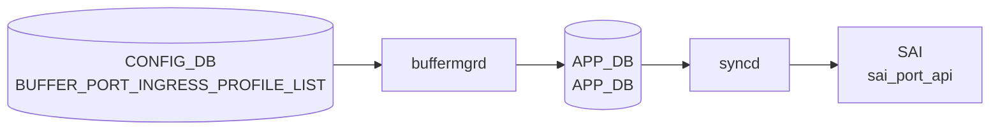

# BUFFER_PORT_INGRESS_PROFILE_LIST テーブル

## 概要

**ポートに紐づけるイングレスバッファプロファイル群** を定義する [CONFIG_DB](../../reference/glossary.md#term-config_db) テーブル[^1]。[SAI](../../reference/glossary.md#term-sai) における `SAI_PORT_ATTR_QOS_INGRESS_BUFFER_PROFILE_LIST` 相当で、`BUFFER_PROFILE` テーブルで定義した複数プロファイルを、ポート単位で **順序を保ったリスト** として束ねる。

ingress 方向の `BUFFER_PG` (priority-group ごとのバッファ) と並ぶ別系統で、こちらはポート全体としての ingress プロファイル群の集約。動的バッファモデル (`buffer_model = dynamic`) ではあまり使われず、静的バッファ設定で利用されることが多い。

<!-- cdb-mermaid -->
### データフロー (自動生成)



!!! note "凡例"
    CONFIG_DB から SAI までの典型経路を `docs/reference/config-db-orch-map.md` から機械生成したミニ図。詳細・例外は本ページ本文と対応表を参照。
<!-- /cdb-mermaid -->

## key 構造

```text
BUFFER_PORT_INGRESS_PROFILE_LIST|<port>
```

- `<port>`: `PORT.name` への leafref (例: `Ethernet0`)

## フィールド

| フィールド | 型 | 説明 |
|-----------|----|------|
| `port` (key) | leafref → `PORT.name` | 対象ポート |
| `profile_list` | leaf-list of leafref → `BUFFER_PROFILE.name` (ordered-by user) | ポートにバインドする ingress バッファプロファイル名の順序付きリスト |

`profile_list` は **`ordered-by user`** で設定順を保持する。[CONFIG_DB](../../reference/glossary.md#term-config_db) では `","` 区切りの文字列として保存される慣習。

## 制約

- `port` は `PORT_LIST.name` への leafref で、対象ポートが存在しないと validation エラー。
- 各 `profile_list` 要素も `BUFFER_PROFILE_LIST.name` への leafref。

<!-- cdb-exceptions -->
## 例外条件・特殊挙動

- **プロファイル参照未解決 → retry**: `profile_list` に参照する `BUFFER_PROFILE` が未存在の場合、`orchagent` は `task_need_retry` を返しエントリを保留する。<!-- evidence: bufferorch.cpp L1679-1686 processIngressBufferProfileList -->
- **リスト変更なし → SAI 呼び出しスキップ**: プロファイルリストが既存キャッシュと同一の場合は SAI を呼ばずにスキップする。<!-- evidence: bufferorch.cpp L1692-1696 -->
- **trimming-eligible プロファイル禁止 → task_failed**: `packet_discard_action = trim` のプロファイルは ingress profile list に設定不可。SAI 仕様上 ingress 側でのパケットトリミングは禁止されており `task_failed` となる。<!-- evidence: bufferorch.cpp L1717-1731 -->
- **ポート未存在 → task_invalid_entry**: 指定ポート名が PortsOrch のポートマップに存在しない場合 `task_invalid_entry` を返す。<!-- evidence: bufferorch.cpp L1760-1764 -->

<!-- value-behavior -->
## 値依存挙動マトリクス

このテーブルに enum フィールドはない。ただし参照する `BUFFER_PROFILE.packet_discard_action` の値によって挙動が変わる。

| 参照プロファイルの `packet_discard_action` | 挙動 |
|------------------------------------------|------|
| `drop`（既定） | `profile_list` に含めて ingress profile list として設定可能。`BufferOrch` が SAI `SAI_PORT_ATTR_QOS_INGRESS_BUFFER_PROFILE_LIST` を更新する。 |
| `trim` | `BufferOrch` が `isTrimmingEligible=true` を検出し `task_failed` を返す（`bufferorch.cpp:1725-1731`）。ingress profile list への trim プロファイルの適用は SAI 仕様上 **禁止**。 |

また、`buffer_model=dynamic` では `buffermgrd` が profile list を自動生成するため、ユーザによる手動設定は通常不要。
<!-- /value-behavior -->

## 購読者

- `buffermgrd` (`docker-swss`): [CONFIG_DB](../../reference/glossary.md#term-config_db) → [APPL_DB](../../reference/glossary.md#term-appl_db) の `BUFFER_PORT_INGRESS_PROFILE_LIST_TABLE`
- `orchagent` (BufferOrch): [APPL_DB](../../reference/glossary.md#term-appl_db) → [SAI](../../reference/glossary.md#term-sai) の port ingress buffer profile list 設定

## 関連 CONFIG_DB / YANG / CLI

- 関連 CONFIG_DB: `BUFFER_PROFILE`, `BUFFER_POOL`, `BUFFER_PG`, `PORT`, `BUFFER_PORT_EGRESS_PROFILE_LIST`
- 関連 CLI: `config buffer profile` ([sonic-utilities](../../reference/glossary.md#term-sonic-utilities))
- 関連 [YANG](../../reference/glossary.md#term-yang): `sonic-buffer-port-ingress-profile-list`, `sonic-buffer-profile`

<!-- ref-triangle:start -->

## 関連リファレンス

- [YANG](../../reference/glossary.md#term-yang): `sonic-buffer-port-ingress-profile-list`
- CLI: [`config buffer`](../cli/config-buffer.md)

<!-- ref-triangle:end -->

## 引用元

[^1]: [YANG](../../reference/glossary.md#term-yang) 定義: `sonic-buffer-port-ingress-profile-list.yang`. <https://github.com/sonic-net/sonic-buildimage/blob/9ea932ec2e18f35e58268ec2e4456b1d4afd65cd/src/sonic-yang-models/yang-models/sonic-buffer-port-ingress-profile-list.yang>

## 関連ページ
- [CONFIG_DB: BUFFER_PROFILE](buffer-profile.md)
- [CONFIG_DB: BUFFER_POOL](buffer-pool.md)
- [CONFIG_DB: BUFFER_PG](buffer-pg.md)

<!-- ops-hint -->
## 運用ヒント

### 典型値

- key 形式: `BUFFER_PORT_INGRESS_PROFILE_LIST|<port>` (例 `BUFFER_PORT_INGRESS_PROFILE_LIST|Ethernet0`)。
- `profile_list`: `","` 区切り (例 `"ingress_lossless_profile,ingress_lossy_profile"`)。
- static-buffer モードでの利用が中心。dynamic-buffer モードでは通常不要。

### よくある誤設定

- `BUFFER_PROFILE` に存在しないプロファイル名を入れて leafref 検証エラー。
- dynamic-buffer モードで設定したが反映されず混乱する (dynamic では buffermgrd が自動生成)。

### 確認コマンド

```bash
sonic-db-cli CONFIG_DB hgetall 'BUFFER_PORT_INGRESS_PROFILE_LIST|Ethernet0'
sonic-db-cli APPL_DB hgetall 'BUFFER_PORT_INGRESS_PROFILE_LIST_TABLE:Ethernet0'
show buffer pool
```
<!-- /ops-hint -->


<!-- runtime-trace -->
## 実コンテナ動作トレース

### 段階 1 — Consumer 登録

`buffermgrd` → `BufferOrch` (APPL_DB 経由) が CONFIG_DB の `BUFFER_PORT_INGRESS_PROFILE_LIST` テーブルを購読する。

`BUFFER_PORT_INGRESS_PROFILE_LIST` の key は `<port>` (例: `Ethernet0`)。

### 段階 2 — CFG→APPL 翻訳

`APP_BUFFER_PORT_INGRESS_PROFILE_LIST_TABLE` に書き込み

### 段階 3 — APPL→SAI

`sai_buffer_api` / `sai_port_api` — ポートの ingress バッファプロファイルリストをバインド

### 段階 4 — タイミングと副作用

**適用タイミング**: CONFIG_DB 変化を `buffermgrd` が検知後 APPL_DB に書き込み。`BufferOrch` が SAI port attribute を更新。

**副作用**: 対象ポートの ingress バッファ割り当てが変更される。PFC や lossless traffic に影響する可能性がある。
<!-- /runtime-trace -->

<!-- entry-points -->
## 書き込み入り口 (Direction A)

対象テーブル: `BUFFER_PORT_INGRESS_PROFILE_LIST`

### CLI
- `config interface buffer ingress-profile-list set <port> <profile>`
  - ソース: `sonic-utilities/config/main.py (buffer グループ)`

### minigraph / sonic-cfggen
- あり: `sonic-cfggen -m <minigraph.xml>` 実行時に本テーブルが生成・上書きされる

### REST / gNMI (sonic-mgmt-common)
- なし (対応 OpenConfig/SONiC YANG transformer なし)

### db_migrator
- なし

### ビルド時デフォルト (init_cfg / j2 テンプレート)
- `buffers_config.j2` から生成

### ハードコードデフォルト
- なし

### ランタイム注入 (デーモン自動書き込み)
- Dynamic buffer model: `buffermgrd` がポートごとに書き込み
<!-- /entry-points -->


<!-- derivation -->
## 派生・条件付き登録 (Phase 6/7)

### Phase 6: 値による他フィールド自動派生

| 条件 | 派生先 | evidence |
|---|---|---|
| Dynamic buffer model: `buffermgrd` がポートの ingress プロファイルリストを自動生成 | `BUFFER_PORT_INGRESS_PROFILE_LIST` にエントリを書き込む | `sonic-swss/cfgmgr/buffermgrdyn.cpp:447,3567` |

### Phase 7: 条件付き module/manager 登録

| 条件 | 登録 module | evidence |
|---|---|---|
| 常時（条件なし） | `BufferMgrDynamic` が `BUFFER_PORT_INGRESS_PROFILE_LIST` を `handleBufferPortIngressProfileListTable` に登録 | `sonic-swss/cfgmgr/buffermgrdyn.cpp:447` |

### grep カバレッジ

- buffermgrdyn.cpp L447: BUFFER_PORT_INGRESS_PROFILE_LIST ハンドラ登録（条件なし）
<!-- /derivation -->
<!-- handler-branching -->
### Phase 8: Handler メソッド内分岐

| Manager / Handler | メソッド | 分岐条件 | 効果 | evidence |
|---|---|---|---|---|
| `BufferMgrDynamic` | `handleBufferObjectTables()` | キー形式が不正（ポート名空） | `task_invalid_entry` 返却 | `sonic-swss/cfgmgr/buffermgrdyn.cpp:3514` |
| `BufferMgrDynamic` | `handleBufferObjectTables()` | カンマ区切りポートリスト | ポートごとにシングルポートハンドラを繰り返し呼び出し | `sonic-swss/cfgmgr/buffermgrdyn.cpp:3536-3547` |

> **スキャン証跡**: `handleBufferPortIngressProfileListTable` は `handleBufferObjectTables(tuple, CFG_BUFFER_PORT_INGRESS_PROFILE_LIST_NAME, false)` に委譲。egress 版と同一パス。2 件分岐抽出。
<!-- /handler-branching -->
<!-- glossary-links-injected: 021ae16e7b9c -->
