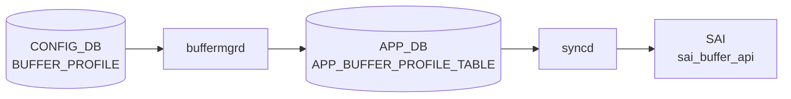

# BUFFER_PROFILE テーブル

## 概要

バッファプロファイル（プール参照、reserved size、admission threshold、[PFC](../../reference/glossary.md#term-pfc) xon/xoff など）を名前付きで定義する[^1]。`buffermgrd` がこのテーブルを [APPL_DB](../../reference/glossary.md#term-appl_db) の `BUFFER_PROFILE_TABLE` に転送し、`orchagent` `BufferOrch` が [SAI](../../reference/glossary.md#term-sai) buffer profile を生成する。`BUFFER_PG` / `BUFFER_QUEUE` から leafref で参照される。

<!-- cdb-mermaid -->
### データフロー (自動生成)



!!! note "凡例"
    CONFIG_DB から SAI までの典型経路を `docs/reference/config-db-orch-map.md` から機械生成したミニ図。詳細・例外は本ページ本文と対応表を参照。
<!-- /cdb-mermaid -->

## key 構造

```text
BUFFER_PROFILE|<name>
```

## フィールド一覧

| フィールド | 型 | 必須 | デフォルト | 説明 |
|-----------|----|------|-----------|------|
| `name` (key) | string | ✅ | - | プロファイル名 |
| `pool` | leafref `BUFFER_POOL.name` | ✅ | - | バインドする buffer pool |
| `size` | uint64 | ✅ | - | 予約バッファサイズ [byte] |
| `static_th` | uint64 | - | - | static threshold [byte]（最大占有量） |
| `dynamic_th` | int32 (-8..7) | - | - | dynamic threshold alpha 値 |
| `xon` | uint64 | - | `0` | [PFC](../../reference/glossary.md#term-pfc) xon 閾値 [byte] |
| `xon_offset` | uint64 | - | `0` | xon offset [byte]（resume を `max(xon, limit-offset)` で発火） |
| `xoff` | uint64 | - | `0` | [PFC](../../reference/glossary.md#term-pfc) xoff 閾値 [byte]（pause 生成） |
| `headroom_type` | enum `static`/`dynamic` | - | `static` | headroom 動的計算かどうか |
| `packet_discard_action` | enum `drop`/`trim` | - | - | shared buffer に admit できないときの動作 |

<!-- defaults -->
## フィールド暗黙デフォルト・コード由来の挙動

### 検出種類と調査根拠

全フィールドを `handleBufferProfileTable()` (buffermgrdyn.cpp L2671-2886)、`updateBufferProfileToDb()` (L890-922)、`processBufferProfile()` (bufferorch.cpp L600-880)、CLI `update_profile()` ([sonic-utilities](../../reference/glossary.md#term-sonic-utilities)/config/main.py L8556-8632) の全行精読により調査した。

### フィールド別暗黙デフォルト

| フィールド | YANG default | 実装上の実効デフォルト | 種別 |
|-----------|-------------|----------------------|------|
| `pool` | なし (mandatory) | CLI 経由のみ: 未指定時 `ingress_lossless_pool` を使用 | 書き込み経路依存乖離・ハードコード |
| `size` | なし (mandatory) | CLI 経由: `xon+xoff` (SHP 無効) or `xon` (SHP 有効) で自動計算。dynamic model: 速度・ケーブル長から自動計算 | 書き込み経路依存乖離 |
| `dynamic_th` | なし | CLI 経由のみ: 未指定時 `DEFAULT_LOSSLESS_BUFFER_PARAMETER.default_dynamic_th` から自動補完 | 書き込み経路依存乖離・silent fallback |
| `xon` | `0` | lossless=false プロファイルでは [APPL_DB](../../reference/glossary.md#term-appl_db)/[SAI](../../reference/glossary.md#term-sai) に出力されない (silent drop) | YANG vs 実装 discrepancy |
| `xon_offset` | `0` | 空文字列の場合は [APPL_DB](../../reference/glossary.md#term-appl_db) 出力スキップ (lossless=true でも) | YANG vs 実装 discrepancy |
| `xoff` | `0` | lossless=false では APPL_DB/SAI に出力されない。`xoff` フィールドの存在が `lossless=true` のトリガー | dead field (lossless=false 時) |
| `headroom_type` | `static` | YANG と一致。`dynamic` 指定時は `lossless=true` + `direction=BUFFER_INGRESS` を強制セット | 副作用あり |
| `packet_discard_action` | なし | 省略時 APPL_DB/SAI に出力されない。SAI 実装依存の DROP が適用 ([ASIC](../../reference/glossary.md#term-asic) vendor 固有) | ハードコード固定値 (SAI 側) |
| `static_th` / `dynamic_th` | なし | 相互排他。pool の mode と不一致時 `task_failed` | 複合必須制約 |

### 書き込み経路別の差異

- **CLI** (`config buffer profile add`): `pool` 未指定 → `ingress_lossless_pool`。`dynamic_th` 未指定 → `DEFAULT_LOSSLESS_BUFFER_PARAMETER` から補完。`size` 未指定 → `xon+xoff` or `xon` で計算。
- **minigraph / buffers_config.j2**: platform/SKU/topology 別テンプレートで全フィールドを明示指定。補完ロジックなし。
- **buffermgrd (dynamic model)**: `pg_lossless_<speed>_<cable>_profile` を自動生成・書き込み。`headroom_type=dynamic` 強制。
- **REST / [gNMI](../../reference/glossary.md#term-gnmi)**: 対応なし (`sonic-mgmt-common` に BUFFER_PROFILE transformer 未実装)。

### create-only フィールド (更新不可)

`pool` および閾値モード (`static_th`/`dynamic_th`) は SAI の create-only 属性のため、既存 SAI オブジェクトへの変更は **silently スキップ**される。(`bufferorch.cpp L656-659, L692-714`)

### trim 制約 (packet_discard_action=trim)

`trim` 設定プロファイルの適用先制限:
- ingress PG への適用: `task_failed` (bufferorch.cpp L1382)
- ingress port profile list への適用: `task_failed` (bufferorch.cpp L1725)
- egress port profile list への適用: `task_failed` (bufferorch.cpp L1915)
- egress shared buffer のみ有効。`SAI_STATUS_ATTR_NOT_IMPLEMENTED_0` 返却時は `task_ignore` ([ASIC](../../reference/glossary.md#term-asic) 非対応)。

<!-- /defaults -->

<!-- cdb-exceptions -->
## 例外条件・特殊挙動

- **pool 参照未解決 → retry**: `pool` フィールドに参照する `BUFFER_POOL` が未存在の場合、`orchagent` は `task_need_retry` を返しプール到着後に再処理する。<!-- evidence: bufferorch.cpp L645-651 -->
- **pending remove エントリへの SET → retry**: 削除待ち状態のエントリに SET が来ると `task_need_retry` を返す。<!-- evidence: bufferorch.cpp L618-620 -->
- **pool / threshold_type は create-only → 更新スキップ**: 既存 SAI オブジェクトに対して `pool` フィールドや `dynamic_th` / `static_th` の閾値モード変更は **スキップ** される。SAI の create-only 属性であるため変更不可。<!-- evidence: bufferorch.cpp L655-659, L694-714 -->
- **packet_discard_action の不正値 → task_failed**: `drop` / `trim` 以外の値は `task_failed` となる。<!-- evidence: bufferorch.cpp L733-745 -->
- **trimming 禁止制約違反 → task_failed**: `packet_discard_action=trim` のプロファイルが ingress profile list や PG に既に関連付けられている場合、`isTrimmingProhibited()` が true → `task_failed`。<!-- evidence: bufferorch.cpp L757-762 -->
- **SAI が ATTR_NOT_IMPLEMENTED を返した場合 → task_ignore**: 属性が未実装の場合、警告ログを出力して処理を継続 (ignore)。<!-- evidence: bufferorch.cpp L776 -->

<!-- value-behavior -->
## 値依存挙動マトリクス

| フィールド | 値 | 挙動 |
|-----------|-----|------|
| `headroom_type` | `static`（既定） | ユーザが `size`/`xon`/`xoff` を明示指定。`buffermgrd` がそのまま APPL_DB へ転送。 |
| `headroom_type` | `dynamic` | `buffermgrdyn` が `dynamic_calculated=true` をセットし、ポート速度・ケーブル長・MTU から headroom を自動計算（`buffermgrdyn.cpp:2788`）。static-buffer モード（`DEVICE_METADATA.buffer_model=static`）では無効。 |
| `packet_discard_action` | `drop`（既定） | `isTrimmingEligible=false`。ingress/egress いずれの profile list・PG にも制限なく適用可能（`bufferhelper.cpp:23`）。 |
| `packet_discard_action` | `trim` | `isTrimmingEligible=true`（`bufferhelper.cpp:23`）。ingress PG（`bufferorch.cpp:1382`）・ingress profile list（`bufferorch.cpp:1725`）・egress profile list（`bufferorch.cpp:1915`）への適用が **禁止**（task_failed）。egress shared buffer への適用のみ有効。 |
<!-- /value-behavior -->

## 購読者

- `buffermgrd`: dynamic buffer model のとき、ポート速度・ケーブル長・MTU から `headroom_type=dynamic` のサイズを計算
- `orchagent` `BufferOrch`: [SAI](../../reference/glossary.md#term-sai) buffer profile を生成
- `pfcwd`: profile の xon/xoff を参照

## 関連 CONFIG_DB / YANG / CLI

- 関連 [CONFIG_DB](../../reference/glossary.md#term-config_db): `BUFFER_POOL`、`BUFFER_PG`、`BUFFER_QUEUE`、`DEVICE_METADATA` (`buffer_model`)
- 関連 CLI: 通常は `config_db.json` からロード。CLI 直接編集は限定的
- 関連 [YANG](../../reference/glossary.md#term-yang): `sonic-buffer-profile`

<!-- ref-triangle:start -->

## 関連リファレンス

- [YANG](../../reference/glossary.md#term-yang): [`sonic-buffer-profile`](../yang/sonic-buffer-profile.md)

<!-- ref-triangle:end -->

## 引用元

[^1]: [YANG](../../reference/glossary.md#term-yang) 定義: `sonic-buffer-profile.yang`. <https://github.com/sonic-net/sonic-buildimage/blob/9ea932ec2e18f35e58268ec2e4456b1d4afd65cd/src/sonic-yang-models/yang-models/sonic-buffer-profile.yang>

<!-- topics-back-ref -->
## 関連 Topics

- [Topics: QoS / Buffer / PFC / Watermark](../../topics/08-qos-buffer/index.md)

<!-- /topics-back-ref -->

<!-- ops-hint -->
## 運用ヒント

### 典型値

- key 形式: `BUFFER_PROFILE|<profile-name>` (例 `pg_lossless_100000_5m_profile`)。
- `pool`: `ingress_lossless_pool` 等。
- `xon` / `xoff` / `size`: PFC 閾値（バイト）。
- `dynamic_th`: `-3` 〜 `3` (α 値)。

### よくある誤設定

- `xoff` を `size` より大きく設定すると PFC が常時 ON。
- `pool` のサイズを超える profile を多数バインドすると `bufferorch` がエラーログを吐き続ける。

### 確認コマンド

```bash
sonic-db-cli CONFIG_DB hgetall 'BUFFER_PROFILE|pg_lossless_100000_5m_profile'
show buffer profile
```
<!-- /ops-hint -->

<!-- runtime-trace -->
## 実コンテナ動作トレース

### 段階 1 — Consumer 登録

`buffermgrd` / `buffermgrdyn` → `BufferOrch` (APPL_DB 経由) が [CONFIG_DB](../../reference/glossary.md#term-config_db) の `BUFFER_PROFILE` テーブルを購読する。

動的バッファ管理 (`buffermgrdyn`) では cable length や speed から自動計算して上書きする。

### 段階 2 — CFG→APPL 翻訳

`APP_BUFFER_PROFILE_TABLE` に書き込み

### 段階 3 — APPL→SAI

`sai_buffer_api` — `sai_create_buffer_profile` でバッファプロファイル (xon/xoff/size/dynamic_th) を作成

### 段階 4 — タイミングと副作用

**適用タイミング**: [CONFIG_DB](../../reference/glossary.md#term-config_db) 変化を `buffermgrd(yn)` が検知後 APPL_DB に書き込み。`BufferOrch` が SAI buffer profile オブジェクトを作成/更新。既存参照 (PG/Queue) は再バインドされる。

**副作用**: プロファイル変更はそれを参照するすべての PG/Queue に即座に影響。`xoff` 変更は PFC pause frame 送信タイミングに影響。
<!-- /runtime-trace -->

<!-- side-effects -->
## 副次 DB 書込 (Phase F)

ソース: `sonic-swss/cfgmgr/buffermgrdyn.cpp`, `cfgmgr/buffermgr.cpp`, `orchagent/bufferorch.cpp`

### STATE_DB `BUFFER_PROFILE_TABLE` (副次書込 A)

`buffermgrdyn` の `updateBufferProfileToDb()` は APPL_DB への書込と **同時に** [STATE_DB](../../reference/glossary.md#term-state_db) の `BUFFER_PROFILE_TABLE` にも同一 fvVector を書込む。

| 操作 | 対象 DB / テーブル | 条件 | evidence |
|------|------------------|------|----------|
| `m_stateBufferProfileTable.set(name, fvVector)` | [STATE_DB](../../reference/glossary.md#term-state_db) / `BUFFER_PROFILE_TABLE` | `updateBufferProfileToDb()` 内 — `m_bufferPoolReady==true` のとき即時書込 | `buffermgrdyn.cpp:920` |
| `m_stateBufferProfileTable.set(key, fvs)` | [STATE_DB](../../reference/glossary.md#term-state_db) / `BUFFER_PROFILE_TABLE` | warm reboot 時のゼロプロファイル初期化ロード | `buffermgrdyn.cpp:361` |
| `m_stateBufferProfileTable.del(name)` | STATE_DB / `BUFFER_PROFILE_TABLE` | `releaseProfile()` — APPL_DB 削除と同時 | `buffermgrdyn.cpp:1049` |
| `m_stateBufferProfileTable.del(zeroProfileName)` | STATE_DB / `BUFFER_PROFILE_TABLE` | ゼロプロファイルアンロード（全ポート admin-up 後） | `buffermgrdyn.cpp:421` |

lossless プロファイルのみ `xon` / `xoff` / `xon_offset` フィールドを含む（lossy では omit）。

### APPL_STATE_DB `BUFFER_PROFILE_TABLE` (副次書込 B — ResponsePublisher)

`BufferOrch` は `Orch::m_publisher` (`ResponsePublisher{"APPL_STATE_DB"}`) 経由で **lossless プロファイルのみ** SAI 反映完了を APPL_STATE_DB に publish する。lossy プロファイル（`xoff` フィールドなし）は publish されない。

| 操作 | 対象 DB / テーブル | 条件 | evidence |
|------|------------------|------|----------|
| `m_publisher.publish(APP_BUFFER_PROFILE_TABLE_NAME, name, fvs, SAI_STATUS_SUCCESS, force=true)` | APPL_STATE_DB / `BUFFER_PROFILE_TABLE` | `processBufferProfile()` SET 成功 かつ `is_lossless==true`（`xoff` フィールド存在時） | `bufferorch.cpp:824-833` |
| `m_publisher.publish(APP_BUFFER_PROFILE_TABLE_NAME, name, [], SAI_STATUS_SUCCESS, force=true)` | APPL_STATE_DB / `BUFFER_PROFILE_TABLE` | `processBufferProfile()` DEL 成功 かつ `is_lossless==true` | `bufferorch.cpp:875-880` |

### COUNTERS_DB / FLEX_COUNTER_DB — BUFFER_PROFILE は対象外

COUNTERS_DB `COUNTERS_BUFFER_POOL_NAME_MAP` および FLEX_COUNTER_DB への書込は **BUFFER_POOL** 操作に紐づく。BUFFER_PROFILE 単体の SET/DEL では COUNTERS_DB / FLEX_COUNTER_DB への書込は発生しない。<!-- evidence: bufferorch.cpp L55-56, L546, L586 — counterNameMapUpdater は processBufferPool() 内のみ呼出 -->

### 副次書込の発火順序

```
1. buffermgrd(yn): CONFIG_DB BUFFER_PROFILE|<name> SET 受信
2. updateBufferProfileToDb():
   2a. APPL_DB  BUFFER_PROFILE_TABLE|<name> SET  ← 主書込
   2b. STATE_DB BUFFER_PROFILE_TABLE|<name> SET  ← 副次書込 A (同時)
3. bufferorch: APPL_DB イベント受信 → SAI create_buffer_profile() → ASIC_DB
4. (is_lossless==true のとき)
   APPL_STATE_DB BUFFER_PROFILE_TABLE|<name> publish ← 副次書込 B
```
<!-- /side-effects -->

<!-- entry-points -->
## 書き込み入り口 (Direction A)

対象テーブル: `BUFFER_PROFILE`

### CLI
- `config buffer profile add/del <name> --xon <bytes> --xoff <bytes> --size <bytes> --dynamic_th <n> --pool <pool>`
  - ソース: `sonic-utilities/config/main.py (buffer グループ)`

### minigraph / sonic-cfggen
- あり: `sonic-cfggen -m <minigraph.xml>` 実行時に本テーブルが生成・上書きされる

### REST / gNMI (sonic-mgmt-common)
- なし (対応 OpenConfig/[SONiC](../../reference/glossary.md#term-sonic) YANG transformer なし)

### db_migrator
- なし

### ビルド時デフォルト (init_cfg / j2 テンプレート)
- `buffers_config.j2` から platform 別プロファイルが生成

### ハードコードデフォルト
- なし

### ランタイム注入 (デーモン自動書き込み)
- Dynamic buffer model: `buffermgrd` が速度・ケーブル長に基づいて Lossless プロファイルを自動計算・書き込み
<!-- /entry-points -->

<!-- derivation -->
## 派生・条件付き登録 (Phase 6/7)

### Phase 6: 値による他フィールド自動派生

| 条件 | 派生先 | evidence |
|---|---|---|
| DB 移行: `pool` フィールドの区切り文字を新形式に更新 | `BUFFER_PROFILE.pool` を変換 | `sonic-utilities/scripts/db_migrator.py:448` |
| DB 移行: 動的計算プロファイル（`pg_lossless_*_profile` 形式）を削除 | `BUFFER_PROFILE` から動的エントリを除去 | `sonic-utilities/scripts/db_migrator.py:351-362` |
| Dynamic buffer model: `buffermgrd` が速度・ケーブル長から Lossless プロファイルを自動生成 | `BUFFER_PROFILE` に `pg_lossless_<speed>_<cable>_profile` を書き込む | `sonic-swss/cfgmgr/buffermgrdyn.cpp:2692` |

### Phase 7: 条件付き module/manager 登録

| 条件 | 登録 module | evidence |
|---|---|---|
| 常時（条件なし） | `BufferMgrDynamic` が `BUFFER_PROFILE` を `handleBufferProfileTable` に登録 | `sonic-swss/cfgmgr/buffermgrdyn.cpp:444` |

### grep カバレッジ

- buffermgrdyn.cpp L444: BUFFER_PROFILE ハンドラ登録（条件なし）
- db_migrator.py L351-362: 動的プロファイル削除
<!-- /derivation -->
<!-- handler-branching -->
### Phase 8: Handler メソッド内分岐

| Manager / Handler | メソッド | 分岐条件 | 効果 | evidence |
|---|---|---|---|---|
| `BufferMgrDynamic` | `handleBufferProfileTable()` | `pool` フィールドが空 | `task_failed` 返却（pool 未指定エラー） | `sonic-swss/cfgmgr/buffermgrdyn.cpp:2748` |
| `BufferMgrDynamic` | `handleBufferProfileTable()` | `pool` が `m_bufferPoolLookup` に未存在 | `task_need_retry`（pool 未準備ガード） | `sonic-swss/cfgmgr/buffermgrdyn.cpp:2712` |
| `BufferMgrDynamic` | `handleBufferProfileTable()` | `threshold_mode` が pool の mode と不一致 | `task_failed` 返却（threshold mode 整合チェック） | `sonic-swss/cfgmgr/buffermgrdyn.cpp:2730` |
| `BufferMgrDynamic` | `handleBufferProfileTable()` | `PROFILE_INITIALIZING == profileApp.state`（新規） | `dynamic_calculated = false`、`lossless = false` で初期化 | `sonic-swss/cfgmgr/buffermgrdyn.cpp:2690-2693` |
| `BufferMgrDynamic` | `handleBufferProfileTable()` | `op == DEL_COMMAND` かつプロファイルが動的計算中 | 動的計算プロファイルは削除せず内部状態をリセット | `sonic-swss/cfgmgr/buffermgrdyn.cpp:2934` |

> **スキャン証跡**: `handleBufferProfileTable` L2671-2935 全行読了。5 件分岐抽出。
<!-- /handler-branching -->

<!-- pubsub -->
## 通信メカニズム (Phase G)

### 1. CONFIG_DB → buffermgr/buffermgrdyn: SubscriberStateTable

`buffermgrd.cpp` の dynamic buffer model パスでは `CFG_BUFFER_PROFILE_TABLE_NAME` を含む `vector<TableConnector>` を構築し `BufferMgrDynamic` コンストラクタに渡す（`buffermgrd.cpp:174-187`）。`BufferMgrDynamic` は `Orch(tables)` を継承し、`Orch::addConsumer()` が DB ID を判定する。

```cpp
// sonic-swss/orchagent/orch.cpp:1186-1196
void Orch::addConsumer(DBConnector *db, string tableName, int pri)
{
    if (db->getDbId() == CONFIG_DB || db->getDbId() == STATE_DB || ...)
        addExecutor(new Consumer(new SubscriberStateTable(db, tableName, ...), this, tableName));
    else
        addExecutor(new Consumer(new ConsumerStateTable(db, tableName, gBatchSize, pri), this, tableName));
}
```

CONFIG_DB は DB ID チェックにマッチするため **`SubscriberStateTable`** が選択される。[Redis](../../reference/glossary.md#term-redis) の **keyspace 通知**（`__keyspace@4__:BUFFER_PROFILE|*` の `PSUBSCRIBE`）を購読し、変更検知後に `HGETALL` で値を再取得する。static buffer model（`BufferMgr`）も同様に `SubscriberStateTable` で購読される（`buffermgr.cpp:21-22`）。

### 2. buffermgrdyn → APPL_DB: ProducerStateTable

`handleBufferProfileTable()` の処理結果は `updateBufferProfileToDb()` 経由で APPL_DB に書き込まれる。

```cpp
// sonic-swss/cfgmgr/buffermgrdyn.cpp:44
m_applBufferProfileTable(applDb, APP_BUFFER_PROFILE_TABLE_NAME),  // ProducerStateTable
```

`ProducerStateTable.set()` は [Redis](../../reference/glossary.md#term-redis) の `LPUSH <TABLE>_KEY_SET` + `HSET` によるチャネルベース通知を行う（`buffermgrdyn.cpp:890-922`）。**例外**: `headroom_type=dynamic` かつポート未参照のプロファイルは APPL_DB への書き込みが保留される（`buffermgrdyn.cpp:2820`）。

### 3. APPL_DB → bufferorch: ConsumerStateTable

`orchdaemon.cpp` は `APP_BUFFER_PROFILE_TABLE_NAME` を含む `buffer_tables` ベクタで `BufferOrch` を構築する（`orchdaemon.cpp:386-394`）。`Orch(applDb, tableNames)` コンストラクタが APPL_DB（DB ID ≠ CONFIG_DB）として `addConsumer()` に渡すため **`ConsumerStateTable`** が選択される。`BUFFER_PROFILE_TABLE_CHANNEL` を `SUBSCRIBE` し `ProducerStateTable` の `LPUSH` 通知をリアルタイムで受信する。ディスパッチは `doTask()` → `processBufferProfile()`（`bufferorch.cpp:74`）。

### 4. bufferorch → APPL_STATE_DB: ResponsePublisher

SAI 処理成功後、`m_publisher.publish()` で APPL_STATE_DB の `BUFFER_PROFILE_TABLE` に結果を書き戻す。

```cpp
// sonic-swss/orchagent/bufferorch.cpp:831-832 (SET 完了後)
m_publisher.publish(APP_BUFFER_PROFILE_TABLE_NAME, object_name, fvs, ReturnCode(SAI_STATUS_SUCCESS), true);

// bufferorch.cpp:879-880 (DEL 完了後)
m_publisher.publish(APP_BUFFER_PROFILE_TABLE_NAME, object_name, fvs, ReturnCode(SAI_STATUS_SUCCESS), true);
```

`m_publisher` は `Orch` 基底クラスの `ResponsePublisher{"APPL_STATE_DB"}`（`orch.h:382`）。`publish()` は [Redis](../../reference/glossary.md#term-redis) channel への PUBLISH と APPL_STATE_DB への `HSET`/`DEL` の両方を実行する（`response_publisher.h:44-50`）。

### 5. データフロー全体

```
CONFIG_DB:BUFFER_PROFILE
  │  SubscriberStateTable (keyspace __keyspace@4__:BUFFER_PROFILE|*)
  ↓  buffermgrd/buffermgrdyn
buffermgrdyn: handleBufferProfileTable()
  │  updateBufferProfileToDb(): ProducerStateTable.set()
  │  ※ headroom_type=dynamic + ポート未参照時は APPL_DB 書き込み保留
  ↓  BUFFER_PROFILE_TABLE_CHANNEL 通知 (APPL_DB)
APPL_DB:BUFFER_PROFILE_TABLE
  │  ConsumerStateTable (bufferorch)
  ↓  doTask() → processBufferProfile()
SAI: sai_create_buffer_profile()
  │  SET/DEL 完了後
  ↓  ResponsePublisher.publish()
APPL_STATE_DB:BUFFER_PROFILE_TABLE
```
<!-- /pubsub -->

<!-- failure -->
## 失敗挙動・retry 分岐 (Phase D)

ソース: `sonic-swss/cfgmgr/buffermgrdyn.cpp`, `cfgmgr/buffermgr.cpp`, `orchagent/bufferorch.cpp`

### buffermgrdyn — handleBufferProfileTable() 失敗経路

| 失敗条件 | 結果 | evidence |
|---|---|---|
| `pool` フィールドが空文字列 | `task_failed` → エントリ廃棄 | `buffermgrdyn.cpp:2740-2745` |
| `pool` が `m_bufferPoolLookup` に未登録（プール未準備） | `task_need_retry` → pool 到着後に再試行 | `buffermgrdyn.cpp:2710-2715` |
| `threshold_mode` がプールの `mode` と不一致（例: `dynamic_th` vs `static` pool） | `task_failed` → エントリ廃棄 | `buffermgrdyn.cpp:2726-2735` |
| `dynamic_th`/`static_th` の閾値モードが既存プロファイル設定と不整合 | `task_failed` → エントリ廃棄 | `buffermgrdyn.cpp:2773-2782` |
| `lossless=true` かつ egress pool を参照（方向不一致） | `task_failed` → エントリ廃棄 | `buffermgrdyn.cpp:2809` |
| DEL 時に `port_pgs` が参照中（headroom override 解除前） | `task_need_retry` → 参照解除まで削除保留 | `buffermgrdyn.cpp:2857-2858` |
| DEL 対象が `static_configured=false`（自動生成プロファイルの手動 DEL） | `task_invalid_entry` → エントリ廃棄 | `buffermgrdyn.cpp:2862-2863` |

### buffermgrdyn — headroom 超過

| 失敗条件 | 結果 | evidence |
|---|---|---|
| 速度/ケーブル長更新時に per-port 累積 headroom 上限超過 | `task_failed` + `releaseProfile()` でロールバック | `buffermgrdyn.cpp:1541-1546` |
| プロファイル更新時に参照中 PG でリソース制限違反 | `task_failed` → APPL_DB 反映なし | `buffermgrdyn.cpp:1855-1857` |

### bufferorch — processBufferProfile() 失敗経路

| 失敗条件 | 結果 | evidence |
|---|---|---|
| プロファイルが `m_pendingRemove` 状態で SET 到着 | `task_need_retry` → 削除完了後に再処理 | `bufferorch.cpp:616-619` |
| `pool` 参照が未解決（`ref_resolve_status::not_resolved`） | `task_need_retry` → プール到着後に再試行 | `bufferorch.cpp:646-649` |
| `pool` 参照解決でその他エラー | `task_failed` → エントリ廃棄 | `bufferorch.cpp:651-652` |
| `packet_discard_action` に `drop`/`trim` 以外の値 | `task_failed` → エントリ廃棄 | `bufferorch.cpp:740-743` |
| `packet_discard_action=trim` かつ `isTrimmingProhibited()` が true（ingress PG/profile list への適用） | `task_failed` → エントリ廃棄 | `bufferorch.cpp:757-763` |
| SAI `set_buffer_profile_attribute` が `SAI_STATUS_ATTR_NOT_IMPLEMENTED_0`（trim 未サポート [ASIC](../../reference/glossary.md#term-asic) 等） | `task_ignore` → ハードウェア非反映のまま成功扱い | `bufferorch.cpp:773-776` |
| SAI `set_buffer_profile_attribute` がその他エラー（1回リトライ後も失敗） | `handleSaiSetStatus()` に委譲 → 通常 `task_need_retry` または `task_failed` | `bufferorch.cpp:791` |
| SAI `create_buffer_profile` 失敗 | `handleSaiCreateStatus()` に委譲 → 通常 `task_need_retry` | `bufferorch.cpp:805` |
| DEL 時にプロファイルが PG/Queue から参照中 | `m_pendingRemove=true` → `task_need_retry` → 参照解除まで削除保留 | `bufferorch.cpp:839-843` |
| SAI `remove_buffer_profile` 失敗 | `handleSaiRemoveStatus()` に委譲 | `bufferorch.cpp:862` |

### SAI create-only 属性への SET — サイレントスキップ

既存 SAI オブジェクトへの以下属性変更は**エラーなしでスキップ**（SAI の create-only 制約）。

| 属性 | スキップ対象 | evidence |
|---|---|---|
| `pool` | `POOL_ID` SAI 属性の SET をスキップ | `bufferorch.cpp:654-659` |
| `dynamic_th` | `THRESHOLD_MODE` の SET をスキップ（`SHARED_DYNAMIC_TH` 値は SET を試行） | `bufferorch.cpp:692-706` |
| `static_th` | `THRESHOLD_MODE` の SET をスキップ（`SHARED_STATIC_TH` 値は SET を試行） | `bufferorch.cpp:710-724` |

### buffermgr (static model) — BUFFER_PROFILE 生成失敗

| 失敗条件 | 結果 | evidence |
|---|---|---|
| 速度/ケーブル長の組み合わせに対応するプロファイルがテンプレートに未定義 | `task_invalid_entry` → BUFFER_PROFILE 未作成 | `buffermgr.cpp:240-242` |
| PG lossless pool が未作成（初期化中に speed 通知が来た場合） | `task_need_retry` → pool 作成後に再試行 | `buffermgr.cpp:257-258` |
| ケーブル長が未設定のままポート速度通知が来た | `task_need_retry` → ケーブル長設定後に再試行 | `buffermgr.cpp:154-155` |

### リトライ・廃棄の判断フロー

```
task_need_retry   → Consumer が backoff 後に再試行
                    (pool 未準備 / pendingRemove / pool 参照未解決 / DEL 参照中)
task_failed       → Consumer が当該エントリを廃棄
                    (pool 空 / threshold_mode 不一致 / lossless+egress / trim 禁止 / headroom 超過)
task_invalid_entry → Consumer が当該エントリを廃棄
                    (不明な op / 非 static_configured プロファイルの DEL)
task_ignore       → bufferorch が当該 SET を成功扱いで無視
                    (SAI_STATUS_ATTR_NOT_IMPLEMENTED_0)
task_success      → 正常完了
```

<!-- /failure -->

<!-- defaults -->
## コード由来の暗黙デフォルト (Phase A)

YANG 定義のデフォルト値と `buffermgrdyn.cpp` / `bufferorch.cpp` 実装の実際の挙動を突き合わせた結果。

| フィールド | YANG default | 実装の実際の挙動 | 種別 | evidence |
|-----------|-------------|----------------|------|----------|
| `xon` | `0` | lossy プロファイル (`lossless==false`) では APPL_DB/SAI に **書かれない** (silent omit) | YANG-impl 乖離 / silent omit | `buffermgrdyn.cpp:903-905` |
| `xon_offset` | `0` | 未設定時 APPL_DB/SAI に **含まれない** (silent omit)。SAI platform default が適用される | silent omit | `buffermgrdyn.cpp:906-908` |
| `xoff` | `0` | lossy プロファイルでは APPL_DB/SAI に書かれない。**`xoff` フィールドの存在** が `lossless=true` フラグのトリガー | YANG-impl 乖離 / flag derivation | `buffermgrdyn.cpp:2755,909` |
| `headroom_type` | `static` | フィールド不在 → `dynamic_calculated=false` (static 扱い)。`dynamic` 指定時は `lossless=true` + `direction=INGRESS` が自動セットされ、ポート参照まで APPL_DB に書かれない | flag derivation / APPL_DB defer | `buffermgrdyn.cpp:2692,2788-2795,2820` |
| `packet_discard_action` | (none) | 未設定時 APPL_DB/SAI に送らない。SAI platform default (通常 `drop`) が適用される | silent omit / platform dependency | `buffermgrdyn.cpp:911-913` |
| `dynamic_th` / `static_th` | (none) | どちらも未設定時: pool の `mode` を `threshold_mode` に採用。`threshold` が空文字のまま APPL_DB に書かれるリスクあり | fallback / empty-string write | `buffermgrdyn.cpp:901,917` |
| `lossless` (内部フラグ) | `false` | `xoff` 設定 または `headroom_type=dynamic` で自動 `true`。pool 方向チェック (ingress 必須) が有効になる | flag derivation | `buffermgrdyn.cpp:2755,2793,2807` |
| `size` (dynamic mode) | mandatory | dynamic headroom model ではポート速度・ケーブル長から lua plugin が計算して上書き | ランタイム上書き | `buffermgrdyn.cpp:989-1001` |
| `xon` (Mellanox 8-lane) | YANG 0 / lua 計算値 | Mellanox モデル番号 4xxx/5xxx の 8 レーンポートは xon が **2 倍** の値で計算される | platform dependency | `buffermgrdyn.cpp:504-517` |

### 注意事項

- **static buffer model** (`buffermgr.cpp`): BUFFER_PROFILE を CONFIG_DB から APPL_DB へ **passthrough** する。`headroom_type` フィールドは解釈されず dead field となる。
- **pool 未準備時の APPL_DB 書き込み skip**: `m_bufferPoolReady == false` のとき `updateBufferProfileToDb()` が pending フラグを立てて即座にリターンする (`buffermgrdyn.cpp:892-896`)。
- **pool 削除待ち状態 (pendingRemove) への SET**: `task_need_retry` を返す。プロファイルを参照中の PG/Queue が存在する限り削除もできない (`buffermgrdyn.cpp:2858`)。
- **threshold_mode と pool mode の不一致**: `dynamic_th` を指定したが pool が `static` mode の場合 (またはその逆)、`task_failed` でリジェクトされる (`buffermgrdyn.cpp:2726-2735`)。

<!-- /defaults -->

<!-- platform -->
## プラットフォーム差 (Task F Phase H)

### 1. dynamic vs static buffer model

| 差分点 | dynamic model (Mellanox/Barefoot) | static model (Broadcom 等) |
|---|---|---|
| `size` 省略時 | Lua plugin `buffer_headroom_<vendor>.lua` がポート速度・ケーブル長・MTU から自動計算 | CONFIG_DB 値を APPL_DB へ passthrough。空なら APPL_DB も空 |
| `headroom_type=dynamic` | 有効。`dynamic_calculated=true` + APPL_DB defer (ポート参照まで待機) | dead field。`buffermgr` はそのまま転送 |
| `xon`/`xoff`/`xon_offset` | Lua plugin 計算値で上書き (`buffermgrdyn.cpp` L989-1001) | CONFIG_DB の明示値をそのまま使用 |
| 自動生成プロファイル | `pg_lossless_<speed>_<cable>_profile` を `handleBufferProfileTable()` で自動書込み | ビルド時テンプレートの固定値のみ |
| port down 時の lossless PG | Mellanox/Barefoot のみ lossless PG エントリを削除 (`buffermgr.cpp` L206) | 他ベンダは削除処理なし |

プラットフォームは `ASIC_VENDOR` 環境変数で識別。`buffermgrdyn.cpp` L68-80。

### 2. Mellanox 8-lane ポート — xon 値 2 倍問題

SN4xxx / SN5xxx 系の Mellanox スイッチで、8 レーンポートかつ非最大速度の場合、xon 値が通常の **2 倍** に設定される。

```
SN4xxx: 8-lane かつ speed != "400000" → xon 2倍 → profile 名に "_8lane" を付加
SN5xxx: 8-lane かつ speed != "800000" → xon 2倍 → profile 名に "_8lane" を付加
```

例: 100G 8-lane ポートは `pg_profile_100000_5m_8lane_profile` を使用し、4-lane の `pg_profile_100000_5m_profile` とは別プロファイルになる。

`buffermgrdyn.cpp` L504-523。Broadcom / Marvell / その他には この分岐なし。

### 3. Broadcom trim (packet_discard_action=trim) の ASIC 対応差

`packet_discard_action=trim` の SAI 適用で `SAI_STATUS_ATTR_NOT_IMPLEMENTED_0` が返った場合、`task_ignore` として処理継続する（ハードウェア非反映）。

- Broadcom TH4/TH5 系: trim 対応あり
- Mellanox / Marvell 等: `SAI_STATUS_ATTR_NOT_IMPLEMENTED_0` → `task_ignore`
- trim 禁止制約（ingress PG / ingress profile list / egress profile list への適用禁止）はベンダー問わず共通

`bufferorch.cpp` L760-776。

### 4. VOQ chassis と BUFFER_PROFILE の関係

`gMySwitchType == "voq"` 時:

- `doTask()` 入口のポート初期化チェックが `isInitDone()` に変わる (`bufferorch.cpp` L2079-2086)
- `BUFFER_PROFILE` テーブルの `processBufferProfile()` には [VOQ](../../reference/glossary.md#term-voq) 固有分岐なし
- キー形式・フィールド処理・SAI buffer profile 生成経路は non-[VOQ](../../reference/glossary.md#term-voq) と同一

[VOQ](../../reference/glossary.md#term-voq) chassis での主な差分は `BUFFER_QUEUE` 処理（system port ベースの queue id 解決、flex counter 登録）に集中する。

### まとめ

| 差分軸 | 影響するフィールド | ソース |
|---|---|---|
| dynamic model (Mellanox/Barefoot) | `size`, `xon`, `xoff`, `xon_offset`, `headroom_type` | `buffermgrdyn.cpp` L68-80, L989 |
| static model (Broadcom 等) | 全フィールド passthrough | `buffermgr.cpp` L37-44 |
| Mellanox SN4k/SN5k 8-lane | `xon` 2倍、プロファイル名に `_8lane` | `buffermgrdyn.cpp` L504-523 |
| trim ASIC 非対応 | `packet_discard_action=trim` → `task_ignore` | `bufferorch.cpp` L760-776 |
| VOQ chassis | BUFFER_PROFILE 処理変化なし | `bufferorch.cpp` L2079 |
<!-- /platform -->

<!-- ordering -->
## 書込順依存 (Task F Phase B)

BUFFER_PROFILE エントリを正しく APPL_DB へ転送し SAI buffer profile を生成するには、以下のテーブルが先に登録されている必要がある。

### BUFFER_POOL 先行必須（buffermgrdyn — 動的バッファモデル）

`updateBufferProfileToDb()` の冒頭で `m_bufferPoolReady` フラグを確認する。
`m_bufferPoolReady == false` の場合、APPL_DB への書き込みを行わず `m_bufferObjectsPending = true` をセットして即座にリターンする。
BUFFER_POOL が APPL_DB に書き込まれ `m_bufferPoolReady = true` がセットされるまで、BUFFER_PROFILE も APPL_DB に転送されない。

| 依存テーブル | 理由 | 違反時の挙動 | evidence |
|---|---|---|---|
| `BUFFER_POOL` | `updateBufferProfileToDb()` 冒頭の `m_bufferPoolReady` フラグチェック | APPL_DB 書き込みをデファー（サイレント保留）。pool 登録後に `handlePendingBufferObjects()` が一括適用 | `buffermgrdyn.cpp:892-896` |
| `BUFFER_POOL`（内部 lookup） | `handleBufferProfileTable()` が `m_bufferPoolLookup` でプール名を解決。未登録なら `task_need_retry` | `task_need_retry` → Consumer が再試行 | `buffermgrdyn.cpp:2705-2715` |

### SAI create-only 制約（orchagent — processBufferProfile）

`BUFFER_POOL` が先に APPL_DB に存在しない場合、`processBufferProfile()` は `resolveFieldRefValue()` でプール参照を解決できず `task_need_retry` を返す。
さらに、**一度 SAI buffer profile を作成した後は `pool` および `threshold_mode`（`SAI_BUFFER_POOL_THRESHOLD_MODE_DYNAMIC` / `_STATIC`）は create-only 属性のため変更不可**。既存オブジェクトへの `pool` SET はサイレントにスキップされる。

| 制約 | 詳細 | evidence |
|---|---|---|
| `pool` は create-only | 既存 SAI buffer profile の `pool` フィールド変更は**スキップ**（エラーなし） | `bufferorch.cpp:654-659` |
| `threshold_mode` は create-only | `THRESHOLD_MODE` の SAI SET をスキップ（`SHARED_DYNAMIC_TH` / `SHARED_STATIC_TH` 値のみ試行） | `bufferorch.cpp:692-706, 710-724` |
| `pool` 未到着 → `task_need_retry` | `ref_resolve_status::not_resolved` → `task_need_retry` | `bufferorch.cpp:641-651` |

### Lua plugin 実行順序（動的バッファモデルのみ）

`buffer_pool_<vendor>.lua` が `BUFFER_POOL` のサイズを計算して APPL_DB に書き込むのが先。
その後 `buffer_headroom_<vendor>.lua` が `BUFFER_PROFILE` のポート速度・ケーブル長から headroom を計算する。
どちらも `m_bufferPoolReady == true` となってから実行される。
MMU サイズ（`STATE_DB.BUFFER_MAX_PARAM_TABLE.global.mmu_size`）が未到着の場合、pool lua plugin は暫定値 0 を返し、到着後に再計算する。

| 順序 | 処理 | evidence |
|---|---|---|
| 1 | `buffer_pool_<vendor>.lua` 実行 → BUFFER_POOL サイズ確定 → `m_bufferPoolReady = true` | `buffermgrdyn.cpp:667-819` |
| 2 | `buffer_headroom_<vendor>.lua` 実行 → BUFFER_PROFILE の `size`/`xon`/`xoff` 確定 | `buffermgrdyn.cpp:605-625, 989-1001` |
| 3 | `handlePendingBufferObjects()` が pending 状態のすべての BUFFER_PROFILE / PG / Queue を APPL_DB に一括適用 | `buffermgrdyn.cpp:3644-3690` |

### zero profile 適用順序

zero buffer pool / zero buffer profile はポートの reserved buffer 解放（admin-down ポートの未使用バッファ回収）に使用される。
JSON ファイル内の順序通りに APPL_DB へ書き込まれ、**zero pool より zero profile が先に APPL_DB へ書き込まれる**。
削除時は逆順（**zero profile を先に削除し、次に zero pool を削除**）でこの依存関係を尊重する。

| フェーズ | 処理 | evidence |
|---|---|---|
| 起動時 | JSON 内の順序で zero pool → zero profile を APPL_DB に適用（ベンダー責任で依存順を保証） | `buffermgrdyn.cpp:236-237` |
| 削除時 | zero profile を先に DEL → その後 zero pool を DEL | `buffermgrdyn.cpp:239, 408-431` |
| 適用タイミング | cold/fast reboot: `m_bufferPoolReady` 後に 30 秒デファー（fast reboot 高速化）。warm reboot: 即時適用 | `buffermgrdyn.cpp:156-169` |

詳細スキャンノートは `meta/_intermediate/cdb-flow/buffer-profile-ordering.md` を参照。
<!-- /ordering -->
<!-- constants -->
## ハードコード定数 (Task F Phase E)

### threshold_mode フィールド名定数

| 定数名 | ハードコード値 | 定義箇所 |
|--------|--------------|---------|
| `buffer_dynamic_th_field_name` | `"dynamic_th"` | `orchagent/bufferorch.h:28` |
| `buffer_static_th_field_name` | `"static_th"` | `orchagent/bufferorch.h:29` |

`dynamic_th` フィールド存在 → `threshold_mode="dynamic_th"`、SAI 側で `SAI_BUFFER_PROFILE_THRESHOLD_MODE_DYNAMIC` にマップ。  
`static_th` フィールド存在 → `threshold_mode="static_th"`、SAI 側で `SAI_BUFFER_PROFILE_THRESHOLD_MODE_STATIC` にマップ。  
どちらも未指定の場合: pool の `mode` 値に `"_th"` を付加した文字列が `threshold_mode` として採用される (`buffermgrdyn.cpp:901`, `bufferorch.cpp` L699/L717)。

### packet_discard_action 値定数

| 定数名 | ハードコード値 | 定義箇所 |
|--------|--------------|---------|
| `BUFFER_PROFILE_PACKET_DISCARD_ACTION` | `"packet_discard_action"` | `orchagent/buffer/bufferschema.h:8` |
| `BUFFER_PROFILE_PACKET_DISCARD_ACTION_DROP` | `"drop"` | `orchagent/buffer/bufferschema.h:5` |
| `BUFFER_PROFILE_PACKET_DISCARD_ACTION_TRIM` | `"trim"` | `orchagent/buffer/bufferschema.h:6` |

`"drop"` → `SAI_BUFFER_PROFILE_PACKET_ADMISSION_FAIL_ACTION_DROP`。  
`"trim"` → `SAI_BUFFER_PROFILE_PACKET_ADMISSION_FAIL_ACTION_DROP_AND_TRIM`。  
それ以外の値は `task_failed` (`bufferorch.cpp:738-744`)。未設定時は SAI に送出されず、ASIC vendor の platform default が適用される。

### SAI 識別子マッピング

| CONFIG_DB フィールド | SAI 属性 ID | evidence |
|---------------------|------------|---------|
| `pool` | `SAI_BUFFER_PROFILE_ATTR_POOL_ID` | `bufferorch.cpp:661` |
| `xon` | `SAI_BUFFER_PROFILE_ATTR_XON_TH` | `bufferorch.cpp:668` |
| `xon_offset` | `SAI_BUFFER_PROFILE_ATTR_XON_OFFSET_TH` | `bufferorch.cpp:674` |
| `xoff` | `SAI_BUFFER_PROFILE_ATTR_XOFF_TH` | `bufferorch.cpp:680` |
| `size` | `SAI_BUFFER_PROFILE_ATTR_BUFFER_SIZE` | `bufferorch.cpp:686` |
| `dynamic_th` | `SAI_BUFFER_PROFILE_ATTR_SHARED_DYNAMIC_TH` (sai_int8_t) | `bufferorch.cpp:704` |
| `static_th` | `SAI_BUFFER_PROFILE_ATTR_SHARED_STATIC_TH` (uint64) | `bufferorch.cpp:722` |
| `packet_discard_action` | `SAI_BUFFER_PROFILE_ATTR_PACKET_ADMISSION_FAIL_ACTION` | `bufferorch.cpp:728` |

### headroom override 関連定数

| 定数名 | ハードコード値 | 定義箇所 | 用途 |
|--------|--------------|---------|------|
| `INGRESS_LOSSLESS_PG_POOL_NAME` | `"ingress_lossless_pool"` | `cfgmgr/buffermgrdyn.h:14` | `headroom_type=dynamic` 時にデフォルト pool として自動補完 |
| `DEFAULT_MTU_STR` | `"9100"` | `cfgmgr/buffermgrdyn.h:15` | port MTU 未設定時のデフォルト MTU（bytes） |
| `BUFFERMGR_TIMER_PERIOD` | `10` (秒) | `cfgmgr/buffermgrdyn.h:17` | `buffermgrd` ポーリング周期 |

`headroom_type=dynamic` かつ `pool` 未設定時: `INGRESS_LOSSLESS_PG_POOL_NAME` が強制補完され、`lossless=true` + `direction=BUFFER_INGRESS` が自動セットされる (`buffermgrdyn.cpp:987,2788-2795`)。  
port MTU 取得失敗時は `DEFAULT_MTU_STR="9100"` を使用して headroom を計算 (`buffermgrdyn.cpp:2174,2378`)。

### pool mode 文字列定数（pool との整合性チェックで使用）

| 定数名 | 値 | 定義箇所 |
|--------|-----|---------|
| `buffer_pool_mode_dynamic_value` | `"dynamic"` | `orchagent/bufferorch.h:22` |
| `buffer_pool_mode_static_value` | `"static"` | `orchagent/bufferorch.h:23` |

pool mode と profile の `threshold_mode` の不一致（例: dynamic pool に `static_th` を指定）は `task_failed` でリジェクト (`buffermgrdyn.cpp:2726-2735`)。

<!-- /constants -->

<!-- cross-refs -->
## 暗黙テーブル参照 (Task F Phase C)

ソース: `sonic-swss/cfgmgr/buffermgrdyn.cpp`, `sonic-swss/orchagent/bufferorch.cpp`, `sonic-swss/cfgmgr/buffermgr.cpp`

### 1. BUFFER_POOL (YANG leafref + 実装暗黙依存)

| 参照種別 | 方向 | 条件 | 読み取りフィールド | 効果 | evidence |
|---------|------|------|-----------------|------|----------|
| YANG leafref | `pool` → `BUFFER_POOL.name` | 常時 | — | YANG バリデーション。`pool` 指定が BUFFER_POOL に存在しない場合はスキーマエラー | YANG 定義 |
| 内部 lookup (`m_bufferPoolLookup`) | 読み取り | dynamic model 常時 | `mode`（dynamic/static）、`direction`（ingress/egress） | pool 未登録 → `task_need_retry`。pool の `mode` と profile の threshold_mode 不一致 → `task_failed` | `buffermgrdyn.cpp:2707-2736` |
| `m_bufferPoolReady` フラグ | 読み取り | dynamic model 常時 | — | `false` のとき APPL_DB への書き込みをサイレントデファー。pool 到着後 `handlePendingBufferObjects()` が一括適用 | `buffermgrdyn.cpp:892-896` |
| APPL_DB 参照解決 (`resolveFieldRefValue`) | 読み取り | [orchagent](../../reference/glossary.md#term-orchagent) 常時 | `pool` → SAI pool OID | not_resolved → `task_need_retry`（プール到着待ち） | `bufferorch.cpp:641-652` |
| lossless + direction チェック | 読み取り | `lossless=true` 時 | `direction` | pool の direction が ingress でない → `task_failed` | `buffermgrdyn.cpp:2807-2814` |

### 2. PORT (CONFIG_DB — dynamic headroom 計算)

| 参照種別 | 方向 | 条件 | 読み取りフィールド | 効果 | evidence |
|---------|------|------|-----------------|------|----------|
| 購読 (`CFG_PORT_TABLE_NAME`) | 読み取り | dynamic model、`headroom_type=dynamic` プロファイルが存在 | `speed`、`mtu`、`admin_status`、`adv_speeds`、`autoneg`、`lanes` | 内部 `m_portInfoLookup` に保持。speed/mtu 変化 → headroom 再計算トリガ | `buffermgrdyn.cpp:449, 2266-2344` |
| headroom 再計算 (`doUpdateBufferProfileForDynamicTh`) | 読み取り | `headroom_type=dynamic` プロファイル変更時 | `effective_speed`、`cable_length`、`mtu` | 参照中の全ポートで `refreshPgsForPort()` を呼び出し、Lua plugin が headroom を再計算 | `buffermgrdyn.cpp:1799-1833` |
| 8-lane 判定 | 読み取り | Mellanox SN4k/SN5k のみ | `lanes`（→ lane_count） | 8-lane かつ非最大速度 → xon 2 倍・プロファイル名に `_8lane` 付加 | `buffermgrdyn.cpp:504-523` |
| PORT_READY 待機 | 読み取り | dynamic model | `state` | PORT_READY でないポートはヘッドルーム計算をスキップし、到着後に再計算 | `buffermgrdyn.cpp:1819-1820` |

### 3. DEVICE_METADATA (CONFIG_DB — Mellanox 起動時)

| 参照種別 | 方向 | 条件 | 読み取りフィールド | 効果 | evidence |
|---------|------|------|-----------------|------|----------|
| 起動時 1 回読み取り | 読み取り | dynamic model かつ `platform == "mellanox"` | `platform`（`localhost` キー） | モデル番号（SN4xxx/SN5xxx）を抽出 → 8-lane xon 2 倍ロジックの有効/無効判定 | `buffermgrdyn.cpp:87` |
| `buffer_model` フィールド読み取り | 購読 | static model (`buffermgr`) | `buffer_model` | `"dynamic"` → `dynamic_buffer_model=true` に切り替え（buffermgrd が実行するモデルを決定） | `buffermgr.cpp:390-407` |

### 参照関係サマリ

```
BUFFER_PROFILE
  ├─ [YANG leafref / 常時]         CONFIG_DB.BUFFER_POOL
  │     pool.mode     → threshold_mode 照合（不一致で task_failed）
  │     pool.direction → lossless は ingress 必須（egress で task_failed）
  │     m_bufferPoolReady → false 時は APPL_DB 書き込みをサイレントデファー
  │     APPL_DB 参照解決 → not_resolved で task_need_retry (bufferorch)
  ├─ [暗黙/dynamic-only]           CONFIG_DB.PORT
  │     speed / adv_speeds → effective_speed → Lua headroom 計算
  │     mtu → headroom 計算パラメータ
  │     lanes → lane_count → Mellanox 8-lane xon 2 倍判定
  │     admin_status → down 時 lossless PG 削除トリガ
  └─ [暗黙/Mellanox-startup-only]  CONFIG_DB.DEVICE_METADATA
        platform → m_model_number → SN4k/SN5k 8-lane 判定
        buffer_model → dynamic/static モデル選択 (static model)
```

詳細スキャンノートは `meta/_intermediate/cdb-flow/buffer-profile-cross-refs.md` を参照。
<!-- /cross-refs -->

<!-- glossary-links-injected: 29292302b31d -->
