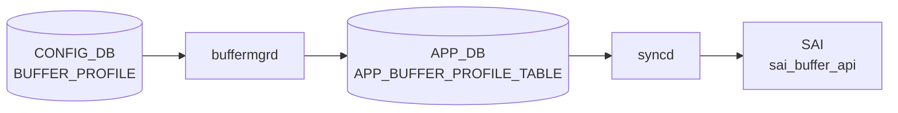

# BUFFER_PROFILE テーブル

## 概要

バッファプロファイル（プール参照、reserved size、admission threshold、[PFC](../../reference/glossary.md#term-pfc) xon/xoff など）を名前付きで定義する[^1]。`buffermgrd` がこのテーブルを [APPL_DB](../../reference/glossary.md#term-appl_db) の `BUFFER_PROFILE_TABLE` に転送し、`orchagent` `BufferOrch` が [SAI](../../reference/glossary.md#term-sai) buffer profile を生成する。`BUFFER_PG` / `BUFFER_QUEUE` から leafref で参照される。

<!-- cdb-mermaid -->
### データフロー (自動生成)



!!! note "凡例"
    CONFIG_DB から SAI までの典型経路を `docs/reference/config-db-orch-map.md` から機械生成したミニ図。詳細・例外は本ページ本文と対応表を参照。
<!-- /cdb-mermaid -->

## key 構造

```text
BUFFER_PROFILE|<name>
```

## フィールド一覧

| フィールド | 型 | 必須 | デフォルト | 説明 |
|-----------|----|------|-----------|------|
| `name` (key) | string | ✅ | - | プロファイル名 |
| `pool` | leafref `BUFFER_POOL.name` | ✅ | - | バインドする buffer pool |
| `size` | uint64 | ✅ | - | 予約バッファサイズ [byte] |
| `static_th` | uint64 | - | - | static threshold [byte]（最大占有量） |
| `dynamic_th` | int32 (-8..7) | - | - | dynamic threshold alpha 値 |
| `xon` | uint64 | - | `0` | [PFC](../../reference/glossary.md#term-pfc) xon 閾値 [byte] |
| `xon_offset` | uint64 | - | `0` | xon offset [byte]（resume を `max(xon, limit-offset)` で発火） |
| `xoff` | uint64 | - | `0` | [PFC](../../reference/glossary.md#term-pfc) xoff 閾値 [byte]（pause 生成） |
| `headroom_type` | enum `static`/`dynamic` | - | `static` | headroom 動的計算かどうか |
| `packet_discard_action` | enum `drop`/`trim` | - | - | shared buffer に admit できないときの動作 |

<!-- cdb-exceptions -->
## 例外条件・特殊挙動

- **pool 参照未解決 → retry**: `pool` フィールドに参照する `BUFFER_POOL` が未存在の場合、`orchagent` は `task_need_retry` を返しプール到着後に再処理する。<!-- evidence: bufferorch.cpp L645-651 -->
- **pending remove エントリへの SET → retry**: 削除待ち状態のエントリに SET が来ると `task_need_retry` を返す。<!-- evidence: bufferorch.cpp L618-620 -->
- **pool / threshold_type は create-only → 更新スキップ**: 既存 SAI オブジェクトに対して `pool` フィールドや `dynamic_th` / `static_th` の閾値モード変更は **スキップ** される。SAI の create-only 属性であるため変更不可。<!-- evidence: bufferorch.cpp L655-659, L694-714 -->
- **packet_discard_action の不正値 → task_failed**: `drop` / `trim` 以外の値は `task_failed` となる。<!-- evidence: bufferorch.cpp L733-745 -->
- **trimming 禁止制約違反 → task_failed**: `packet_discard_action=trim` のプロファイルが ingress profile list や PG に既に関連付けられている場合、`isTrimmingProhibited()` が true → `task_failed`。<!-- evidence: bufferorch.cpp L757-762 -->
- **SAI が ATTR_NOT_IMPLEMENTED を返した場合 → task_ignore**: 属性が未実装の場合、警告ログを出力して処理を継続 (ignore)。<!-- evidence: bufferorch.cpp L776 -->

<!-- value-behavior -->
## 値依存挙動マトリクス

| フィールド | 値 | 挙動 |
|-----------|-----|------|
| `headroom_type` | `static`（既定） | ユーザが `size`/`xon`/`xoff` を明示指定。`buffermgrd` がそのまま APPL_DB へ転送。 |
| `headroom_type` | `dynamic` | `buffermgrdyn` が `dynamic_calculated=true` をセットし、ポート速度・ケーブル長・MTU から headroom を自動計算（`buffermgrdyn.cpp:2788`）。static-buffer モード（`DEVICE_METADATA.buffer_model=static`）では無効。 |
| `packet_discard_action` | `drop`（既定） | `isTrimmingEligible=false`。ingress/egress いずれの profile list・PG にも制限なく適用可能（`bufferhelper.cpp:23`）。 |
| `packet_discard_action` | `trim` | `isTrimmingEligible=true`（`bufferhelper.cpp:23`）。ingress PG（`bufferorch.cpp:1382`）・ingress profile list（`bufferorch.cpp:1725`）・egress profile list（`bufferorch.cpp:1915`）への適用が **禁止**（task_failed）。egress shared buffer への適用のみ有効。 |
<!-- /value-behavior -->

## 購読者

- `buffermgrd`: dynamic buffer model のとき、ポート速度・ケーブル長・MTU から `headroom_type=dynamic` のサイズを計算
- `orchagent` `BufferOrch`: [SAI](../../reference/glossary.md#term-sai) buffer profile を生成
- `pfcwd`: profile の xon/xoff を参照

## 関連 CONFIG_DB / YANG / CLI

- 関連 [CONFIG_DB](../../reference/glossary.md#term-config_db): `BUFFER_POOL`、`BUFFER_PG`、`BUFFER_QUEUE`、`DEVICE_METADATA` (`buffer_model`)
- 関連 CLI: 通常は `config_db.json` からロード。CLI 直接編集は限定的
- 関連 [YANG](../../reference/glossary.md#term-yang): `sonic-buffer-profile`

<!-- ref-triangle:start -->

## 関連リファレンス

- [YANG](../../reference/glossary.md#term-yang): [`sonic-buffer-profile`](../yang/sonic-buffer-profile.md)

<!-- ref-triangle:end -->

## 引用元

[^1]: [YANG](../../reference/glossary.md#term-yang) 定義: `sonic-buffer-profile.yang`. <https://github.com/sonic-net/sonic-buildimage/blob/9ea932ec2e18f35e58268ec2e4456b1d4afd65cd/src/sonic-yang-models/yang-models/sonic-buffer-profile.yang>

<!-- topics-back-ref -->
## 関連 Topics

- [Topics: QoS / Buffer / PFC / Watermark](../../topics/08-qos-buffer/index.md)

<!-- /topics-back-ref -->

<!-- ops-hint -->
## 運用ヒント

### 典型値

- key 形式: `BUFFER_PROFILE|<profile-name>` (例 `pg_lossless_100000_5m_profile`)。
- `pool`: `ingress_lossless_pool` 等。
- `xon` / `xoff` / `size`: PFC 閾値（バイト）。
- `dynamic_th`: `-3` 〜 `3` (α 値)。

### よくある誤設定

- `xoff` を `size` より大きく設定すると PFC が常時 ON。
- `pool` のサイズを超える profile を多数バインドすると `bufferorch` がエラーログを吐き続ける。

### 確認コマンド

```bash
sonic-db-cli CONFIG_DB hgetall 'BUFFER_PROFILE|pg_lossless_100000_5m_profile'
show buffer profile
```
<!-- /ops-hint -->


<!-- runtime-trace -->
## 実コンテナ動作トレース

### 段階 1 — Consumer 登録

`buffermgrd` / `buffermgrdyn` → `BufferOrch` (APPL_DB 経由) が CONFIG_DB の `BUFFER_PROFILE` テーブルを購読する。

動的バッファ管理 (`buffermgrdyn`) では cable length や speed から自動計算して上書きする。

### 段階 2 — CFG→APPL 翻訳

`APP_BUFFER_PROFILE_TABLE` に書き込み

### 段階 3 — APPL→SAI

`sai_buffer_api` — `sai_create_buffer_profile` でバッファプロファイル (xon/xoff/size/dynamic_th) を作成

### 段階 4 — タイミングと副作用

**適用タイミング**: CONFIG_DB 変化を `buffermgrd(yn)` が検知後 APPL_DB に書き込み。`BufferOrch` が SAI buffer profile オブジェクトを作成/更新。既存参照 (PG/Queue) は再バインドされる。

**副作用**: プロファイル変更はそれを参照するすべての PG/Queue に即座に影響。`xoff` 変更は PFC pause frame 送信タイミングに影響。
<!-- /runtime-trace -->

<!-- glossary-links-injected: 22dbf67b9d97 -->
