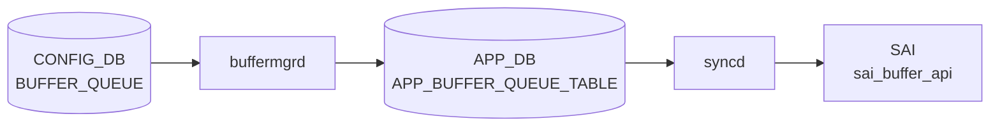

# BUFFER_QUEUE テーブル

## 概要

ポートの egress queue ごとにバッファプロファイルを割り当てる[^1]。non-[VOQ](../../reference/glossary.md#term-voq) 用と [VOQ](../../reference/glossary.md#term-voq) シャーシ用で list が分かれる。`buffermgrd` が [APPL_DB](../../reference/glossary.md#term-appl_db) に転送、`orchagent` `BufferOrch` が [SAI](../../reference/glossary.md#term-sai) egress queue buffer profile を反映する。

<!-- cdb-mermaid -->
### データフロー (自動生成)



!!! note "凡例"
    CONFIG_DB から SAI までの典型経路を `docs/reference/config-db-orch-map.md` から機械生成したミニ図。詳細・例外は本ページ本文と対応表を参照。
<!-- /cdb-mermaid -->

## key 構造

非 [VOQ](../../reference/glossary.md#term-voq):
```text
BUFFER_QUEUE|<port>|<qindex>
```

VOQ chassis:
```text
BUFFER_QUEUE|<hostname>|<asic_name>|<port>|<qindex>
```

`<qindex>` は `0..15` または範囲表現 (`0-3` 等)。

## フィールド一覧 (非 VOQ: `BUFFER_QUEUE_LIST`)

| フィールド | 型 | 必須 | デフォルト | 説明 |
|-----------|----|------|-----------|------|
| `port` (key) | leafref `PORT.name` | ✅ | - | 対象ポート |
| `qindex` (key) | string `(1[0-5]|[0-9])((-)(1[0-5]|[0-9]))?` | ✅ | - | Q-index または範囲 |
| `profile` | leafref `BUFFER_PROFILE.name` | - | `0` | 関連付ける buffer profile |

`when` 条件: `DEVICE_METADATA.localhost.switch_type` が `voq` 以外、または未指定。

## フィールド一覧 (VOQ: `VOQ_BUFFER_QUEUE_LIST`)

| フィールド | 型 | 必須 | 説明 |
|-----------|----|------|------|
| `hostname` (key) | `hostname` | ✅ | VOQ シャーシのホスト名 |
| `asic_name` (key) | `asic_name` | ✅ | ASIC インスタンス名 |
| `port` (key) | string (1..128) | ✅ | リニアカード上のポート名 |
| `qindex` (key) | string | ✅ | Q-index |
| `profile` | leafref `BUFFER_PROFILE.name` | - | buffer profile |

`when` 条件: `switch_type = voq`。

<!-- cdb-exceptions -->
## 例外条件・特殊挙動

- **key フォーマット不正 → スキップ**: key が `<port>|<queue_range>` の 2 トークンでない場合、初期化時にエラーログを出力しそのエントリをスキップする。<!-- evidence: bufferorch.cpp L158-162 initBufferReadyList -->
- **プロファイル参照未解決 → retry**: `profile` フィールドに参照する `BUFFER_PROFILE` が未存在の場合、`orchagent` は `task_need_retry` を返す。<!-- evidence: bufferorch.cpp L966-970 -->
- **プロファイル変更なし → SAI 呼び出しスキップ**: プロファイルが変更なく `m_partiallyAppliedQueues` にもキーがない場合はスキップ (冪等)。<!-- evidence: bufferorch.cpp L975-985 -->
- **queue インデックス範囲外 → task_invalid_entry**: 指定インデックスがポートのキュー数を超える場合 `task_invalid_entry` を返す。VoQ も同様。<!-- evidence: bufferorch.cpp L1060-1065 -->
- **queue ロック中 → retry + partiallyApplied**: `port.m_queue_lock[ind] == true` の場合 `task_need_retry` を返し `m_partiallyAppliedQueues` に登録。ロック解除後に再適用される。<!-- evidence: bufferorch.cpp L1066-1070 -->
- **zero profile (`_zero_` 含む名前) → flexcounter 登録スキップ**: プロファイル名に `_zero_` が含まれる場合、カウンタの追加・削除は行わない。zero profile はトラフィックなしを意味する。<!-- evidence: bufferorch.cpp L1017, L1020 -->

<!-- value-behavior -->
## 値依存挙動マトリクス

このテーブルに enum フィールドはない。ただし `DEVICE_METADATA.switch_type` および参照プロファイルの値によって挙動が変わる。

| 条件 | 挙動 |
|------|------|
| `switch_type` が `voq` 以外（未設定含む） | `BUFFER_QUEUE_LIST` が有効。key は `<port>\|<qindex>` の 2 トークン形式。 |
| `switch_type = voq` | `VOQ_BUFFER_QUEUE_LIST` が有効。key に `<hostname>\|<asic_name>` が付加される。 |
| 参照プロファイルの `packet_discard_action = drop` | egress queue buffer profile として制限なく適用可能。 |
| プロファイル名に `_zero_` を含む | flex counter の追加・削除をスキップ（traffic なしを意味する zero profile 扱い）（`bufferorch.cpp:1017, 1020`）。 |
<!-- /value-behavior -->

<!-- defaults -->
## フィールド暗黙デフォルト (Phase A — コード由来)

YANG (`sonic-buffer-queue.yang`) の `profile` leafref には明示的な default がない。実体の「未指定時挙動」はビルド時テンプレート (`buffers_config.j2`) と orchagent ランタイムロジック (`bufferorch.cpp`) に分散している。

### ビルド時テンプレート由来 (非 VOQ — `PORT_ACTIVE` 各ポート)

`buffers_config.j2:307–324` の fallback ブロック (プラットフォームが `defs.generate_queue_buffers` 等を定義していない場合に使用):

| queue range | 既定 profile | 源 |
|---|---|---|
| `<port>\|3-4` | `egress_lossless_profile` | `buffers_config.j2:309-311` |
| `<port>\|0-2` | `egress_lossy_profile` | `buffers_config.j2:314-316` |
| `<port>\|5-6` | `egress_lossy_profile` | `buffers_config.j2:319-321` |

### ビルド時テンプレート由来 ([VOQ](../../reference/glossary.md#term-voq) シャーシ — `SYSTEM_PORT_ALL` 各 system_port)

`buffers_config.j2:279–295`:

| queue range | 既定 profile | 源 |
|---|---|---|
| `<system_port>\|3-4` | `egress_lossless_profile` | `buffers_config.j2:281-283` |
| `<system_port>\|0-2` | `egress_lossy_profile` | `buffers_config.j2:286-288` |
| `<system_port>\|5-6` | `egress_lossy_profile` | `buffers_config.j2:291-293` |

### orchagent ランタイム fallback

| 条件 | 挙動 | evidence |
|---|---|---|
| `profile` フィールド参照が解決不能 (`ref_resolve_status::not_resolved`) | `task_need_retry` を返し SAI 未書き込み（既存値維持） | `bufferorch.cpp:966-970` |
| `BUFFER_QUEUE` エントリ削除時 / `profile` 取得不能時 | SAI に `SAI_NULL_OBJECT_ID` をセット（queue buffer profile を解放） | `bufferorch.cpp:1005` |
| profile 名に `_zero_` を含む | flex counter 追加・削除をスキップ（traffic なし扱い、デフォルト適用自体は通常通り） | `bufferorch.cpp:995, 1017` |

### 補足

- 上記テンプレート fallback は、プラットフォーム側 `buffers_defaults_*.j2` で `defs.generate_queue_buffers` / `defs.generate_queue_buffers_with_extra_lossless_queues` 等のマクロが定義されていない場合にのみ適用される (`buffers_config.j2:298-306` の `` チェーン)。Mellanox dynamic buffer SKU や t1-lag 等の主要プラットフォームは独自マクロを持つため、上記 3 レンジ固定 mapping は使用されない。
- orchagent には「`profile` が未指定なら自動で `egress_lossy_profile` を当てる」といったランタイムフォールバックは**存在しない**。ビルド時テンプレートで埋まらなかった queue は SAI 側で NULL profile (= 動的バッファ割当なし) となる。
- scheduler 既定 (`QUEUE.scheduler`) は `BUFFER_QUEUE` テーブルのフィールドではなく `QUEUE` テーブル側で割当される。BUFFER_QUEUE スコープ外のため本ページでは扱わない。

詳細な調査メモは `meta/_intermediate/cdb-flow/buffer-queue-defaults.md` を参照。

<!-- /defaults -->

<!-- ordering -->
## 書込順依存 (Phase B)

BUFFER_QUEUE エントリを正しく適用するには、以下の依存テーブルが先に登録されている必要がある。

| 依存テーブル | 理由 | 違反時の挙動 | evidence |
|---|---|---|---|
| `BUFFER_POOL` | `buffermgrd`（動的）が `updateBufferObjectToDb()` 冒頭で `m_bufferPoolReady` フラグを確認。プール未登録なら APPL_DB 書き込みを保留し `m_bufferObjectsPending = true` をセット。 | APPL_DB への転送がデファーされる（サイレント保留） | `buffermgrdyn.cpp:933-936` |
| `BUFFER_PROFILE` | `buffermgrd`（動的）が `checkBufferProfileDirection()` で `m_bufferProfileLookup` を検索。未登録なら `task_need_retry` を返し処理を延期。 | `task_need_retry` → Consumer が再試行 | `buffermgrdyn.cpp:3282-3286` |
| `BUFFER_PROFILE` | `orchagent` `BufferOrch` が `resolveFieldRefValue()` で APPL_DB 上のプロファイル参照を解決。未登録なら `task_need_retry`。 | `task_need_retry` → orchagent が再試行 | `bufferorch.cpp:961-970` |
| `PORT` | `buffermgrd`（動的）が `m_portInfoLookup[port]` を参照。`PORT_ADMIN_DOWN` 時は admin-up 後に APPL_DB 書き込み。`max_queues` 未通知ポートは reserved buffer 処理が保留。 | admin-up 待ちまたは保留 | `buffermgrdyn.cpp:3344-3350` |
| `PORT` | `orchagent` が `gPortsOrch->getPort()` でポートを取得。未登録なら `task_invalid_entry` を返す。 | `task_invalid_entry` → エントリ破棄 | `bufferorch.cpp:1033-1038` |

### VOQ シャーシ特別扱い

VOQ モード（`gMySwitchType == "voq"`）の場合、key は 4 トークン形式
`<hostname>|<asic_name>|<port>|<qindex>` を要求する。
`hostname` と `asic_name` が自ノードと一致する場合のみ local port として SAI に適用し、
一致しない場合は SAI 書き込みをスキップする（他ノード向けエントリのため）。
key が 4 トークンでない場合は即 `task_invalid_entry`。

- evidence: `sonic-swss/orchagent/bufferorch.cpp:918-940`

詳細スキャンノートは `meta/_intermediate/cdb-flow/buffer-queue-ordering.md` を参照。
<!-- /ordering -->

## 購読者

- `buffermgrd`: [APPL_DB](../../reference/glossary.md#term-appl_db) へ転送
- `orchagent` `BufferOrch`: [SAI](../../reference/glossary.md#term-sai) egress queue buffer profile を反映

## 関連 CONFIG_DB / YANG / CLI

- 関連 [CONFIG_DB](../../reference/glossary.md#term-config_db): `BUFFER_PROFILE`、`BUFFER_POOL`、`PORT`、`DEVICE_METADATA`、`QUEUE`、`SCHEDULER`
- 関連 CLI: なし
- 関連 [YANG](../../reference/glossary.md#term-yang): `sonic-buffer-queue`

<!-- ref-triangle:start -->

## 関連リファレンス

- [YANG](../../reference/glossary.md#term-yang): [`sonic-buffer-queue`](../yang/sonic-buffer-queue.md)

<!-- ref-triangle:end -->

## 引用元

[^1]: [YANG](../../reference/glossary.md#term-yang) 定義: `sonic-buffer-queue.yang`. <https://github.com/sonic-net/sonic-buildimage/blob/9ea932ec2e18f35e58268ec2e4456b1d4afd65cd/src/sonic-yang-models/yang-models/sonic-buffer-queue.yang>

<!-- topics-back-ref -->
## 関連 Topics

- [Topics: QoS / Buffer / PFC / Watermark](../../topics/08-qos-buffer/index.md)

<!-- /topics-back-ref -->

<!-- ops-hint -->
## 運用ヒント

### 典型値

- key 形式: `BUFFER_QUEUE|<port>|<queue-range>` (例 `0-2`, `3-4`, `5-6`)。
- `profile`: `q_lossy_profile` 等。

### よくある誤設定

- queue 範囲が抜けると当該 queue が default profile になり、計画値と乖離。

### 確認コマンド

```bash
sonic-db-cli CONFIG_DB keys 'BUFFER_QUEUE|Ethernet0|*'
show buffer queue
```
<!-- /ops-hint -->


<!-- runtime-trace -->
## 実コンテナ動作トレース

### 段階 1 — Consumer 登録

`buffermgrd` → `BufferOrch` (APPL_DB 経由) が CONFIG_DB の `BUFFER_QUEUE` テーブルを購読する。

`BUFFER_QUEUE` の key は `<port>|<queue_range>` (例: `Ethernet0|0-2`)。

### 段階 2 — CFG→APPL 翻訳

`APP_BUFFER_QUEUE_TABLE` に書き込み

### 段階 3 — APPL→SAI

`sai_buffer_api` — キューのバッファプロファイルをバインド

### 段階 4 — タイミングと副作用

**適用タイミング**: CONFIG_DB 変化を `buffermgrd` が検知後 APPL_DB に書き込み。`BufferOrch` が SAI queue buffer attribute を更新。

**副作用**: 対象キューの egress バッファ割り当てが変更される。キューの動作中変更は一時的な traffic 影響を伴う可能性がある。
<!-- /runtime-trace -->

<!-- entry-points -->
## 書き込み入り口 (Direction A)

対象テーブル: `BUFFER_QUEUE`

### CLI
- `config interface buffer queue set <port> <q-range> <profile>`
- `config interface buffer queue remove <port> <q-range>`
  - ソース: `sonic-utilities/config/main.py (buffer グループ)`

### minigraph / sonic-cfggen
- あり: `sonic-cfggen -m <minigraph.xml>` 実行時に本テーブルが生成・上書きされる

### REST / gNMI (sonic-mgmt-common)
- なし (対応 OpenConfig/SONiC YANG transformer なし)

### db_migrator
- なし

### ビルド時デフォルト (init_cfg / j2 テンプレート)
- `buffers_config.j2` からバッファ設定と共に生成（デフォルトキュープロファイル割り当て）

### ハードコードデフォルト
- なし

### ランタイム注入 (デーモン自動書き込み)
- なし
<!-- /entry-points -->


<!-- cross-refs -->
## 暗黙参照テーブル (Phase C)

YANG leafref（`profile → BUFFER_PROFILE.name`、`port → PORT.name`）以外に、実装レベルで以下のテーブルを暗黙参照する。

| 参照先テーブル | YANG leafref | 参照種別 | 非充足時の挙動 |
|---------------|:------------:|---------|--------------|
| `BUFFER_PROFILE` | ✅ | 必須: egress direction チェック + SAI profile OID 解決 | `task_need_retry`（未存在）/ `task_failed`（ingress profile 指定時）|
| `BUFFER_POOL`（egress） | ✗ | 間接ブロッキング: egress pool 未確立で profile もデファー | BUFFER_QUEUE 書き込み全体がデファー |
| `PORT` | ✅ | 必須: OID 取得 + admin_status 分岐 | `task_invalid_entry`（未登録）/ admin-down 時は APPL_DB 書き込み保留 |
| `SYSTEM_PORT` / VOQ | ✗ | VOQ モード専用: key 形式切替と VOQ OID 取得 | token 数不正 → `task_invalid_entry`; VOQ OID 範囲外 → `task_invalid_entry` |

### 詳細

- **BUFFER_PROFILE（direction 制約）**: `buffermgrdyn.cpp` L3320 にて `checkBufferProfileDirection(profileName, BUFFER_EGRESS)` を呼び出し、profile の `direction` 属性を確認する。ingress profile を BUFFER_QUEUE に設定すると即 `task_failed`（`buffermgrdyn.cpp:3290`）。profile が `m_bufferProfileLookup` に未存在なら `task_need_retry`（`buffermgrdyn.cpp:3283`）。
- **BUFFER_POOL egress（間接ゲート）**: `m_bufferPoolReady` が `false` の間は BUFFER_PROFILE（egress）の書き込み自体がデファーされ（`buffermgrdyn.cpp:892`）、BUFFER_QUEUE の profile 参照解決も連鎖でブロックされる。egress pool 欠如は QUEUE 初期化全体のブロッカーとなる。
- **PORT（OID + admin_status）**: `orchagent` は `gPortsOrch->getPort(port_name, port)` で PORT OID を取得し（`bufferorch.cpp:1033`）、失敗時は `task_invalid_entry`。`buffermgrd` は PORT が admin-down のとき SAI 適用を保留し（`buffermgrdyn.cpp:3346`）、admin-up 遷移後に再適用する。
- **SYSTEM_PORT / VOQ**: `gMySwitchType == "voq"` の場合、`processQueue()` は key を `hostname|asic_name|port|qindex` の 4 トークンとして解析し（`bufferorch.cpp:916`）、`gPortsOrch->getPortVoQIds(port)` で VOQ OID を取得してバッファプロファイルを適用する（`bufferorch.cpp:1051`）。flex counter 管理および PORT ref count 管理は VOQ では実施しない（`bufferorch.cpp:1135–1168`）。

詳細な調査メモは `meta/_intermediate/cdb-flow/buffer-queue-cross-refs.md` を参照。
<!-- /cross-refs -->

<!-- derivation -->
## 派生・条件付き登録 (Phase 6/7)

### Phase 6: 値による他フィールド自動派生

| 条件 | 派生先 | evidence |
|---|---|---|
| DB 移行: `profile` フィールドの区切り文字を新形式に更新 | `BUFFER_QUEUE.profile` を変換 | `sonic-utilities/scripts/db_migrator.py:450` |

### Phase 7: 条件付き module/manager 登録

| 条件 | 登録 module | evidence |
|---|---|---|
| 常時（条件なし） | `BufferMgrDynamic` が `BUFFER_QUEUE` を `handleBufferQueueTable` に登録 | `sonic-swss/cfgmgr/buffermgrdyn.cpp:445` |

### grep カバレッジ

- buffermgrdyn.cpp L445: BUFFER_QUEUE ハンドラ登録（条件なし）
- db_migrator.py L450: profile フィールド区切り文字変換
<!-- /derivation -->
<!-- handler-branching -->
### Phase 8: Handler メソッド内分岐

| Manager / Handler | メソッド | 分岐条件 | 効果 | evidence |
|---|---|---|---|---|
| `BufferMgrDynamic` | `handleBufferObjectTables()` | キー形式 `port:ids` が不正 | `task_invalid_entry` 返却（`keyWithIds=true` のためキュー番号必須） | `sonic-swss/cfgmgr/buffermgrdyn.cpp:3521` |
| `BufferMgrDynamic` | `handleBufferObjectTables()` | カンマ区切りポートリスト（複数ポート） | ポートごとにシングルポートハンドラを繰り返し呼び出し | `sonic-swss/cfgmgr/buffermgrdyn.cpp:3536-3547` |

> **スキャン証跡**: `handleBufferQueueTable` は `handleBufferObjectTables(tuple, CFG_BUFFER_QUEUE_TABLE_NAME, true)` に委譲（`keyWithIds=true`）。BUFFER_PG と同一パスを共有。2 件分岐抽出。
<!-- /handler-branching -->

<!-- pubsub -->
## 通信メカニズム (Phase G)

BUFFER_QUEUE テーブルの変更は以下のチェーンで伝搬する。

### 購読チェーン

```
CONFIG_DB (BUFFER_QUEUE)
  └─ SubscriberStateTable ← buffermgrd (dynamic / static)
       └─ ProducerStateTable → APPL_DB (APP_BUFFER_QUEUE_TABLE)
            └─ ConsumerStateTable ← orchagent BufferOrch
                 └─ sai_queue_api (bulk SET) → ASIC_DB / SAI
```

### CONFIG_DB 購読 (buffermgrd)

`BufferMgrDynamic` は `Orch(tables)` 基底クラス経由で CONFIG_DB の `BUFFER_QUEUE` テーブルを **SubscriberStateTable** として購読する。
`buffermgrd.cpp:174-186` にて `vector<TableConnector>` に `TableConnector(&cfgDb, CFG_BUFFER_QUEUE_TABLE_NAME)` を含めて登録。
イベント受信後 `doTask(Consumer&)` → `handleBufferQueueTable` → `handleBufferObjectTables(tuple, CFG_BUFFER_QUEUE_TABLE_NAME, true)` の順にディスパッチされる。

最終的に `updateBufferObjectToDb(key, profile, add, BUFFER_QUEUE)` が
`m_applBufferObjectTables[BUFFER_QUEUE]` (= `ProducerStateTable(applDb, APP_BUFFER_QUEUE_TABLE_NAME)`) を介して APPL_DB へ書き込む。

| デーモン | DB | テーブル | 方式 | evidence |
|---|---|---|---|---|
| `buffermgrd` (dynamic) | CONFIG_DB | `BUFFER_QUEUE` | SubscriberStateTable | `buffermgrd.cpp:180` |
| `buffermgrd` (static) | CONFIG_DB | `BUFFER_QUEUE` | SubscriberStateTable | `buffermgr.cpp:499` |

### APPL_DB 購読 (orchagent BufferOrch)

`BufferOrch` は `Orch(applDb, tableNames)` 基底クラス経由で APPL_DB の `APP_BUFFER_QUEUE_TABLE` を **ConsumerStateTable** として購読する。
`orchdaemon.cpp:386-394` にて `vector<string> buffer_tables` に `APP_BUFFER_QUEUE_TABLE_NAME` を含めて `BufferOrch` コンストラクタへ渡す。

`doTask(Consumer&)` (`bufferorch.cpp:2075`) が `processQueue` / `processQueueBulk` をディスパッチし、
`sai_queue_api->set_queues_attribute()` bulk API で SAI queue buffer attribute を書き込む。

| デーモン | DB | テーブル | 方式 | evidence |
|---|---|---|---|---|
| `orchagent` (BufferOrch) | APPL_DB | `APP_BUFFER_QUEUE_TABLE` | ConsumerStateTable | `orchdaemon.cpp:389` |

### ASIC_DB notification

BUFFER_QUEUE フローで bufferorch が ASIC_DB 通知を直接購読する仕組みは存在しない。
SAI への書き込みは syncd が ASIC_DB に転送し、結果は SAI return code で受け取る通常フロー。
（BUFFER_POOL_WATERMARK に対する `SubscriberStateTable` は存在するが BUFFER_QUEUE とは無関係: `bufferorch.cpp:290`）

詳細スキャンノートは `meta/_intermediate/cdb-flow/buffer-queue-pubsub.md` を参照。
<!-- /pubsub -->

<!-- constants -->
## ハードコード定数 (Phase E)

ソース: `sonic-swss/cfgmgr/buffermgrdyn.cpp`, `sonic-swss/orchagent/bufferorch.cpp`, `sonic-swss/cfgmgr/buffermgrdyn.h`, `sonic-swss/orchagent/bufferorch.h`, `sonic-swss/cfgmgr/buffer_headroom_mellanox.lua`

### queue index 範囲

| モード | key 形式 | トークン数 | 範囲上限チェック | evidence |
|---|---|---|---|---|
| 非 VOQ | `<port>\|<qindex>` | **2** | `port.m_queue_ids.size() <= ind` → `task_invalid_entry` | `bufferorch.cpp:943, 1061-1064` |
| VOQ シャーシ | `<hostname>\|<asic_name>\|<port>\|<qindex>` | **4** | `getPortVoQIds(port).size() <= ind` → `task_invalid_entry` | `bufferorch.cpp:918, 1052-1055` |

YANG regex が許容する qindex 範囲は **0〜15**（`(1[0-5]|[0-9])((-)(1[0-5]|[0-9]))?`）。実際の上限は SAI / プラットフォームが提供する queue 数次第（典型的に 8 queue）。デフォルト j2 テンプレートでは `0-2`・`3-4`・`5-6` の 3 レンジのみ設定する（`buffers_config.j2:307-324`）。

### SAI 識別子

| 定数 | 用途 | evidence |
|---|---|---|
| `SAI_QUEUE_ATTR_BUFFER_PROFILE_ID` | queue に buffer profile を SET する属性 ID | `bufferorch.cpp:1021` |
| `SAI_NULL_OBJECT_ID` | DEL 時または解決失敗時にセットするヌル OID | `bufferorch.cpp:1005` |
| `SAI_OBJECT_TYPE_QUEUE` | `SaiAttrWrapper` への object_type 指定 | `bufferorch.cpp:1082` |

queue buffer profile は `sai_queue_api->set_queues_attribute()` bulk API で反映される (`bufferorch.cpp:1269`)。

### フィールド名文字列定数 (`bufferorch.h`)

| 定数変数 | ハードコード値 | evidence |
|---|---|---|
| `buffer_profile_field_name` | `"profile"` | `bufferorch.h:30` |
| `buffer_pool_field_name` | `"pool"` | `bufferorch.h:21` |
| `buffer_pool_mode_dynamic_value` | `"dynamic"` | `bufferorch.h:22` |
| `buffer_pool_mode_static_value` | `"static"` | `bufferorch.h:23` |
| `buffer_value_ingress` | `"ingress"` | `bufferorch.h:31` |
| `buffer_value_egress` | `"egress"` | `bufferorch.h:32` |
| `buffer_value_both` | `"both"` | `bufferorch.h:33` |
| `buffer_pool_xoff_field_name` | `"xoff"` | `bufferorch.h:24` |
| `buffer_xon_field_name` | `"xon"` | `bufferorch.h:25` |
| `buffer_xon_offset_field_name` | `"xon_offset"` | `bufferorch.h:26` |
| `buffer_xoff_field_name` | `"xoff"` | `bufferorch.h:27` |
| `buffer_dynamic_th_field_name` | `"dynamic_th"` | `bufferorch.h:28` |
| `buffer_static_th_field_name` | `"static_th"` | `bufferorch.h:29` |

### デーモン設定定数 (`buffermgrdyn.h`)

| 定数 | 値 | 意味 |
|---|---|---|
| `DEFAULT_MTU_STR` | `"9100"` | profile 名生成時に MTU が未指定の場合に使用するデフォルト MTU (バイト) (`buffermgrdyn.h:15`) |
| `INGRESS_LOSSLESS_PG_POOL_NAME` | `"ingress_lossless_pool"` | ingress lossless pool 名 (`buffermgrdyn.h:14`) |
| `BUFFERMGR_TIMER_PERIOD` | `10` | buffermgrd 内部タイマーの周期（秒）。headroom 再計算・retry に使用 (`buffermgrdyn.h:17`) |

### FlexCounter 統計 polling 定数 (`bufferorch.h`)

| 定数 | 値 | 意味 |
|---|---|---|
| `BUFFER_POOL_WATERMARK_FLEX_STAT_COUNTER_POLL_MSECS` | `"60000"` | buffer pool watermark の FlexCounter polling 間隔（ms = 60 秒）(`bufferorch.h:16`) |
| `BUFFER_POOL_WATERMARK_STAT_COUNTER_FLEX_COUNTER_GROUP` | `"BUFFER_POOL_WATERMARK_STAT_COUNTER"` | FlexCounter グループ名 (`bufferorch.h:15`) |

### `_zero_` profile 判定文字列

- 文字列リテラル: `"_zero_"` (ハードコード)
- `buffer_profile_name.find("_zero_") == std::string::npos` で zero profile 判定 (`bufferorch.cpp:995, 1017, 1400, 1421`)
- zero profile 時は FlexCounter の queue counter 追加・削除をスキップ
- zero profile 情報の JSON フィールド名 (buffermgrdyn.cpp):

| JSON フィールド | 用途 | evidence |
|---|---|---|
| `"queues_to_apply_zero_profile"` | zero profile を適用する queue インデックスリスト | `buffermgrdyn.cpp:283` |
| `"egress_zero_profile"` | queue 向け zero profile 名（未指定時は pool の `zero_profile_name` を自動採用） | `buffermgrdyn.cpp:287, 333-334` |

### `m_partiallyAppliedQueues` セット

- 型: `std::set<std::string>`（key 文字列のセット）
- queue lock 中 (`port.m_queue_lock[ind] == true`) に `task_need_retry` した key を保持
- ロック解除後: profile 未変更でも登録 key が存在すれば SAI 更新を強制、その後 `erase` (`bufferorch.cpp:979-986`)
- VOQ モードでは lock チェック自体が存在しないため当セットへの登録は発生しない

### gMySwitchType 比較文字列

- `"voq"` (ハードコード): `bufferorch.cpp:116, 916, 1049` で VOQ モード判定に使用

### headroom 計算 Lua スクリプト内の定数 (`buffer_headroom_mellanox.lua`)

cell_size・pipeline_latency (IPL)・mac_phy_delay はハードコードされず、`STATE_DB.ASIC_TABLE` から取得する。ただし以下の定数はスクリプト内にハードコードされる:

| 定数 | 値 | 意味 | evidence |
|---|---|---|---|
| `speed_of_light` | `198000000` m/s (光速の約 2/3) | ケーブル伝播遅延計算用 | `buffer_headroom_mellanox.lua:118` |
| `minimal_packet_size` | `64` バイト | worst-case cell 占有率算出に使用 | `buffer_headroom_mellanox.lua:120` |
| IPG (`peer_response_time`) | `pause_quanta * 512 / 8` バイト | IEEE 802.3 の pause quanta を IPG (bytes) に変換 | `buffer_headroom_mellanox.lua:157` |

pause quanta テーブル (IEEE 802.3 31B.3.7 準拠、ハードコード):

| 速度 (Mb/s) | pause_quanta | peer_response_time (バイト) |
|---|---|---|
| 800000 (800G) | 905 | 57,920 |
| 400000 (400G) | 905 | 57,920 |
| 200000 (200G) | 453 | 28,992 |
| 100000 (100G) | 394 | 25,216 |
| 50000 (50G) | 147 | 9,408 |
| 40000 (40G) | 118 | 7,552 |
| 25000 (25G) | 80 | 5,120 |
| 10000 (10G) | 67 | 4,288 |
| 1000 (1G) | 2 | 128 |
| 100 (100M) | 1 | 64 |

xoff（PFC pause 起動閾値）の繰り上げ粒度: **1024 バイト** (`math.ceil(xoff_value / 1024) * 1024`)。

詳細な調査メモは `meta/_intermediate/cdb-flow/buffer-queue-constants.md` を参照。
<!-- /constants -->

<!-- failure -->
## 失敗挙動マトリクス (Phase D)

ソース: `sonic-swss/cfgmgr/buffermgrdyn.cpp`, `orchagent/bufferorch.cpp`

### SET 処理における失敗経路

| 失敗条件 | 結果 | ログ出力 | evidence |
|---|---|---|---|
| key トークン数不正（非 VOQ: 2 個以外） | `task_invalid_entry`・SAI 未呼び出し | LOG_ERROR "malformed key: Must contain 2 tokens" | `bufferorch.cpp:943-946` |
| key トークン数不正（VOQ: 4 個以外） | `task_invalid_entry`・SAI 未呼び出し | LOG_ERROR "malformed key: Must contain 4 tokens" | `bufferorch.cpp:918-921` |
| queue index 範囲パース失敗（`parseIndexRange` 失敗） | `task_invalid_entry`（VOQ / 非 VOQ 共通） | なし | `bufferorch.cpp:925-927, 950-952` |
| `BUFFER_PROFILE` 参照が未解決 (`not_resolved`) | `task_need_retry`・orchagent が再試行キューに投入 | LOG_INFO "Missing or invalid queue buffer profile reference specified" | `bufferorch.cpp:966-969` |
| `BUFFER_PROFILE` 参照解決が上記以外のエラー | `task_failed`（致命的失敗・再試行なし） | LOG_ERROR "Resolving queue profile reference failed" | `bufferorch.cpp:972-973` |
| PORT が `gPortsOrch` に未登録（ポート未初期化） | `task_invalid_entry` | LOG_ERROR "Port with alias:xxx not found" | `bufferorch.cpp:1033-1036` |
| queue index がポートの queue 数を超過（非 VOQ） | `task_invalid_entry` | LOG_ERROR "Invalid queue index specified" | `bufferorch.cpp:1061-1064` |
| queue index が VoQ 数を超過（VOQ シャーシ） | `task_invalid_entry` | LOG_ERROR "Invalid voq index specified" | `bufferorch.cpp:1052-1055` |
| queue ロック中 (`port.m_queue_lock[ind] == true`) | `task_need_retry`・`m_partiallyAppliedQueues` に登録、ロック解除後に再適用 | LOG_WARN "Queue X on port Y is locked, will retry" | `bufferorch.cpp:1066-1070` |
| SAI set 失敗 (`sai_queue_api` != SUCCESS) | `handleSaiSetStatus` 委譲（`task_success` / `task_need_retry` / `task_failed`） | LOG_ERROR "Failed to set queue's buffer profile attribute" | `bufferorch.cpp:1124-1130` |
| `buffermgrdyn`: key に port パートが空 | `task_invalid_entry` | LOG_ERROR "Invalid key format X for BUFFER_QUEUE table" | `buffermgrdyn.cpp:3510-3513` |
| `buffermgrdyn`: key に ids パート（queue range）が空 | `task_invalid_entry` | LOG_ERROR "Invalid key format X for BUFFER_QUEUE table" | `buffermgrdyn.cpp:3517-3523` |
| `buffermgrdyn`: 複数ポートリスト展開時に単一ポートハンドラが `task_need_retry` | 即座に `task_need_retry`・残ポートの処理打ち切り | なし（個別ハンドラのログに依存） | `buffermgrdyn.cpp:3546-3547` |
| `buffermgrdyn`: 動的バッファ計算中にポートが未準備 (`PORT_READY` 以外) | 当該エントリをスキップ（continue）・ポート準備後に再処理 | LOG_INFO "Nothing to be done for X since port is not ready" | `buffermgrdyn.cpp:1485-1488` |

### DEL 処理における失敗経路

| 失敗条件 | 結果 | ログ出力 | evidence |
|---|---|---|---|
| DEL 時に key が `APP_BUFFER_QUEUE_TABLE` に存在しない | SAI 呼び出しをスキップ・`task_success` 返却 | LOG_INFO "X doesn't not exist, don't need to notify SAI" | `bufferorch.cpp:1000-1003` |
| DEL 時の SAI set 失敗（`SAI_NULL_OBJECT_ID` セット失敗） | `handleSaiSetStatus` 委譲 | LOG_ERROR "Failed to set queue's buffer profile attribute" | `bufferorch.cpp:1124-1130` |
| 不明 op コマンド (SET / DEL 以外) | `task_invalid_entry` | LOG_ERROR "Unknown operation type X" | `bufferorch.cpp:1012-1014` |

### VOQ 固有制約

- VOQ モード時: FlexCounter の queue buffer counter 追加・削除をスキップ（`flexcounterorch` が system port 全体を管理するため）。<!-- evidence: bufferorch.cpp:1134-1136 -->
- VOQ モード時: `m_port_ready_list_ref` の初期化ソースが CONFIG_DB（非 VOQ は APPL_DB）。admin-down ポートを ready-list から除外し初期化待ちポートを正確に追跡する。<!-- evidence: bufferorch.cpp:132-140 -->

### 補足

- **`m_partiallyAppliedQueues`**: queue ロック中に `task_need_retry` を返した key を保持する集合。同一 key で profile 変更がなくても登録があれば SAI 更新を強制する（`bufferorch.cpp:979-986`）。
- **SAI 呼び出しの 2 段構成**: `processBufferQueue` がキューへバッファし `processQueuePost` で実際の SAI 結果を評価する。SAI 失敗は `processQueuePost` 側で検出される（`bufferorch.cpp:1099-1131`）。

詳細は `meta/_intermediate/cdb-flow/buffer-queue-failure.md` を参照。
<!-- /failure -->

<!-- side-effects -->
## 副次 DB 書込 (Phase F)

`BUFFER_QUEUE` エントリの SET / DEL 処理は CONFIG_DB および APPL_DB への書き込み以外に、以下の副次的な DB 書き込みを発生させる。

### COUNTERS_DB — キューカウンタマップ

`BufferOrch::processQueuePost()` が SAI 呼び出し成功後に `gPortsOrch->createPortBufferQueueCounters()` / `removePortBufferQueueCounters()` を呼び出し、COUNTERS_DB 内の以下のマップを更新する（非 VOQ スイッチかつ `isCreateOnlyConfigDbBuffers()` が true の場合のみ）。

| COUNTERS_DB テーブル | 操作 | 内容 | evidence |
|---|---|---|---|
| `COUNTERS_QUEUE_NAME_MAP` | SET / DEL | `"<port>:<queueIndex>"` → SAI queue OID のマッピング追加・削除 | `portsorch.cpp:8749, 8789` |
| `COUNTERS_QUEUE_PORT_MAP` | SET / DEL | SAI queue OID → SAI port OID のマッピング追加・削除 | `portsorch.cpp:8750, 8790` |
| `COUNTERS_QUEUE_INDEX_MAP` | SET / DEL | SAI queue OID → 実 queue インデックス のマッピング追加・削除 | `portsorch.cpp:8751, 8796` |
| `COUNTERS_QUEUE_TYPE_MAP` | SET / DEL | SAI queue OID → queue type 文字列 のマッピング追加・削除 | `portsorch.cpp:8752, 8797` |

**トリガー条件**: profile 変化あり（zero profile への変更・からの変更）かつ `getQueueCountersState()` または `getQueueWatermarkCountersState()` が true。

### FLEX_COUNTER_DB — queue stat / watermark / WRED カウンタ登録

同 `createPortBufferQueueCounters()` が FlexCounterOrch 状態に応じて以下のエントリを FLEX_COUNTER_DB に追加・削除する。

| FLEX_COUNTER_DB グループ | 操作 | トリガー条件 | evidence |
|---|---|---|---|
| `QUEUE_STAT_COUNTER` | SET (add) / DEL | `getQueueCountersState() == true` かつ SET 操作でカウンタ未存在 | `portsorch.cpp:8730-8732` |
| `QUEUE_WATERMARK_STAT_COUNTER` | SET (add) / DEL | `getQueueWatermarkCountersState() == true` | `portsorch.cpp:8734-8736` |
| `WRED_ECN_QUEUE_STAT_COUNTER` | SET (add) / DEL | `getWredQueueCountersState() == true` | `portsorch.cpp:8738-8740` |

### VOQ 例外

`gMySwitchType == "voq"` の場合、`flexcounterorch` が全 VOQ の queue カウンタを一括登録するため、上記 COUNTERS_DB / FLEX_COUNTER_DB 書き込みは **スキップ** される。

> `bufferorch.cpp:1134-1136`: *"For VOQ chassis, flexcounterorch adds the Queue Counters for all egress and VOQ queues ... irrespective of BUFFER_QUEUE configuration."*

### zero profile 例外

profile 名に `_zero_` を含む場合 (`counter_needs_to_add = false`)、カウンタ追加は行わない。既存カウンタがあれば削除する。`bufferorch.cpp:1017, 1020`

詳細な調査メモは `meta/_intermediate/cdb-flow/buffer-queue-side-effects.md` を参照。
<!-- /side-effects -->

<!-- platform -->
## プラットフォーム差異 (Phase H)

### Dynamic / Static バッファモデル

`buffermgrdyn`（Dynamic モード専用）は `BUFFER_QUEUE` の `profile` フィールドをそのまま APPL_DB に転送する。
BUFFER_PG と異なり egress キューのヘッドルーム自動計算は行わない。キューのプロファイル割り当てはビルド時テンプレートで決定済みのため、Dynamic/Static どちらのモードも実運用上の queue buffer 割り当て内容は同等となる。

#### Dynamic モード固有 — admin-down 時の zero profile 回収 (`buffermgrdyn.cpp:285-289, 1286-1381`)

ベンダー提供の per-platform zero profiles info JSON に `queues_to_apply_zero_profile` / `egress_zero_profile` が定義されている場合、admin-down ポートのバッファ回収時に `reclaimReservedBufferForPort()` が 2 モードで動作する。

| モード | 条件 | 動作 |
|--------|------|------|
| **ベンダー指定対象に zero profile 適用** | `queues_to_apply_zero_profile` が定義済み | 指定 queue index にのみ zero profile を適用し、残りは APPL_DB から削除 |
| **全設定 queue に zero profile 適用** | `queues_to_apply_zero_profile` が未定義 | 設定済み全 queue + ASIC がサポートする未設定 queue にも zero profile を適用 (`buffers_config.j2` コメント例: 16 queue の場合 0-2, 5-6, 7-15 → lossy zero, 3-4 → lossless zero) |

Static モードデーモン (`buffermgr`) はこの `reclaimReservedBufferForPort` 処理を持たない。

### ASIC ベンダー差異

`buffermgrdyn` 起動時に `ASIC_VENDOR` 環境変数でベンダーを検出する (`buffermgrdyn.cpp:68`)。

| ベンダー値 | 追加取得情報 | BUFFER_QUEUE への影響 |
|-----------|------------|----------------------|
| `"mellanox"` | `DEVICE_METADATA.localhost.platform` からモデル番号 4 桁 (`sn****`) を抽出し `m_model_number` に保存 | なし（BUFFER_PG headroom 計算専用）|
| その他 (`"broadcom"` 等) | なし | なし |
| 未設定 (`""`) | なし | なし |

ベンダー別 Lua プラグイン (`buffer_headroom_<vendor>.lua`, `buffer_pool_<vendor>.lua`) は BUFFER_PG / BUFFER_POOL の計算専用であり BUFFER_QUEUE の profile 値には影響しない。Mellanox 8-lane サフィックス等のランタイム ASIC 依存処理は BUFFER_QUEUE に適用されない。

### ASIC queue 数差異

YANG の qindex 正規表現は `(1[0-5]|[0-9])((-)(1[0-5]|[0-9]))?` で **0〜15** を許容するが、実際の上限は ASIC が SAI 初期化時に通知する queue 数次第。非 VOQ では `port.m_queue_ids.size()`、VOQ では `getPortVoQIds(port).size()` を実行時に参照し、超過インデックスを `task_invalid_entry` で拒否する (`bufferorch.cpp:1052-1064`)。プラットフォームごとに queue 数が 8 / 16 / それ以外に異なる点に注意。

### Flex counter 条件 (非 VOQ のみ)

非 VOQ の queue buffer counter は `flexcounterorch->isCreateOnlyConfigDbBuffers()` が `true` のときのみ `BufferOrch` が per-queue に追加・削除を行う (`bufferorch.cpp:1139-1152`)。`false` のとき（従来モード）は `FlexCounterOrch` が一括管理するため `BufferOrch` からは操作しない。

### VOQ Chassis 専用処理

| 処理 | 非 VOQ | VOQ (`switch_type = voq`) | evidence |
|------|--------|--------------------------|----------|
| `doTask` 起動ゲート | `isConfigDone()` 待機 | `isInitDone()` 待機 | `bufferorch.cpp:2079-2090` |
| Warm reboot ready list | `initBufferReadyList()` (APPL_DB ソース) | `initVoqBufferReadyList()` (CONFIG_DB ソース、admin-down 除外) | `bufferorch.cpp:116-136` |
| Key トークン数 | 2 (`<port>\|<qindex>`) | 4 (`<hostname>\|<asic_name>\|<port>\|<qindex>`) | `bufferorch.cpp:916-956` |
| ローカルポート判定 | 常に local | `gMyHostName` / `gMyAsicName` と照合、不一致なら SAI 書き込みをスキップ | `bufferorch.cpp:916-940` |
| Queue ID 取得 | `port.m_queue_ids[ind]`、lock チェックあり | `getPortVoQIds(port)[ind]`、lock チェックなし | `bufferorch.cpp:1049-1075` |
| Flex counter 管理 | `BufferOrch` が per-queue 追加・削除 | `flexcounterorch` が全 VOQ を一括登録するためスキップ | `bufferorch.cpp:1134-1136` |
| ポート参照カウント | SET/DEL 時に increase/decrease | システムポートは動的生成なしのためスキップ | `bufferorch.cpp:1166-1168` |

詳細な調査メモは `meta/_intermediate/cdb-flow/buffer-queue-platform.md` を参照。
<!-- /platform -->
<!-- glossary-links-injected: efbc9015e957 -->
