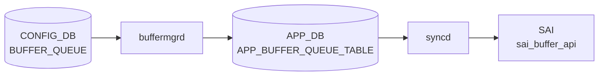

# BUFFER_QUEUE テーブル

## 概要

ポートの egress queue ごとにバッファプロファイルを割り当てる[^1]。non-[VOQ](../../reference/glossary.md#term-voq) 用と [VOQ](../../reference/glossary.md#term-voq) シャーシ用で list が分かれる。`buffermgrd` が [APPL_DB](../../reference/glossary.md#term-appl_db) に転送、`orchagent` `BufferOrch` が [SAI](../../reference/glossary.md#term-sai) egress queue buffer profile を反映する。

<!-- cdb-mermaid -->
### データフロー (自動生成)



!!! note "凡例"
    CONFIG_DB から SAI までの典型経路を `docs/reference/config-db-orch-map.md` から機械生成したミニ図。詳細・例外は本ページ本文と対応表を参照。
<!-- /cdb-mermaid -->

## key 構造

非 [VOQ](../../reference/glossary.md#term-voq):
```text
BUFFER_QUEUE|<port>|<qindex>
```

VOQ chassis:
```text
BUFFER_QUEUE|<hostname>|<asic_name>|<port>|<qindex>
```

`<qindex>` は `0..15` または範囲表現 (`0-3` 等)。

## フィールド一覧 (非 VOQ: `BUFFER_QUEUE_LIST`)

| フィールド | 型 | 必須 | デフォルト | 説明 |
|-----------|----|------|-----------|------|
| `port` (key) | leafref `PORT.name` | ✅ | - | 対象ポート |
| `qindex` (key) | string `(1[0-5]|[0-9])((-)(1[0-5]|[0-9]))?` | ✅ | - | Q-index または範囲 |
| `profile` | leafref `BUFFER_PROFILE.name` | - | `0` | 関連付ける buffer profile |

`when` 条件: `DEVICE_METADATA.localhost.switch_type` が `voq` 以外、または未指定。

## フィールド一覧 (VOQ: `VOQ_BUFFER_QUEUE_LIST`)

| フィールド | 型 | 必須 | 説明 |
|-----------|----|------|------|
| `hostname` (key) | `hostname` | ✅ | VOQ シャーシのホスト名 |
| `asic_name` (key) | `asic_name` | ✅ | ASIC インスタンス名 |
| `port` (key) | string (1..128) | ✅ | リニアカード上のポート名 |
| `qindex` (key) | string | ✅ | Q-index |
| `profile` | leafref `BUFFER_PROFILE.name` | - | buffer profile |

`when` 条件: `switch_type = voq`。

<!-- cdb-exceptions -->
## 例外条件・特殊挙動

- **key フォーマット不正 → スキップ**: key が `<port>|<queue_range>` の 2 トークンでない場合、初期化時にエラーログを出力しそのエントリをスキップする。<!-- evidence: bufferorch.cpp L158-162 initBufferReadyList -->
- **プロファイル参照未解決 → retry**: `profile` フィールドに参照する `BUFFER_PROFILE` が未存在の場合、`orchagent` は `task_need_retry` を返す。<!-- evidence: bufferorch.cpp L966-970 -->
- **プロファイル変更なし → SAI 呼び出しスキップ**: プロファイルが変更なく `m_partiallyAppliedQueues` にもキーがない場合はスキップ (冪等)。<!-- evidence: bufferorch.cpp L975-985 -->
- **queue インデックス範囲外 → task_invalid_entry**: 指定インデックスがポートのキュー数を超える場合 `task_invalid_entry` を返す。VoQ も同様。<!-- evidence: bufferorch.cpp L1060-1065 -->
- **queue ロック中 → retry + partiallyApplied**: `port.m_queue_lock[ind] == true` の場合 `task_need_retry` を返し `m_partiallyAppliedQueues` に登録。ロック解除後に再適用される。<!-- evidence: bufferorch.cpp L1066-1070 -->
- **zero profile (`_zero_` 含む名前) → flexcounter 登録スキップ**: プロファイル名に `_zero_` が含まれる場合、カウンタの追加・削除は行わない。zero profile はトラフィックなしを意味する。<!-- evidence: bufferorch.cpp L1017, L1020 -->

<!-- value-behavior -->
## 値依存挙動マトリクス

このテーブルに enum フィールドはない。ただし `DEVICE_METADATA.switch_type` および参照プロファイルの値によって挙動が変わる。

| 条件 | 挙動 |
|------|------|
| `switch_type` が `voq` 以外（未設定含む） | `BUFFER_QUEUE_LIST` が有効。key は `<port>\|<qindex>` の 2 トークン形式。 |
| `switch_type = voq` | `VOQ_BUFFER_QUEUE_LIST` が有効。key に `<hostname>\|<asic_name>` が付加される。 |
| 参照プロファイルの `packet_discard_action = drop` | egress queue buffer profile として制限なく適用可能。 |
| プロファイル名に `_zero_` を含む | flex counter の追加・削除をスキップ（traffic なしを意味する zero profile 扱い）（`bufferorch.cpp:1017, 1020`）。 |
<!-- /value-behavior -->

## 購読者

- `buffermgrd`: [APPL_DB](../../reference/glossary.md#term-appl_db) へ転送
- `orchagent` `BufferOrch`: [SAI](../../reference/glossary.md#term-sai) egress queue buffer profile を反映

## 関連 CONFIG_DB / YANG / CLI

- 関連 [CONFIG_DB](../../reference/glossary.md#term-config_db): `BUFFER_PROFILE`、`BUFFER_POOL`、`PORT`、`DEVICE_METADATA`、`QUEUE`、`SCHEDULER`
- 関連 CLI: なし
- 関連 [YANG](../../reference/glossary.md#term-yang): `sonic-buffer-queue`

<!-- ref-triangle:start -->

## 関連リファレンス

- [YANG](../../reference/glossary.md#term-yang): [`sonic-buffer-queue`](../yang/sonic-buffer-queue.md)

<!-- ref-triangle:end -->

## 引用元

[^1]: [YANG](../../reference/glossary.md#term-yang) 定義: `sonic-buffer-queue.yang`. <https://github.com/sonic-net/sonic-buildimage/blob/9ea932ec2e18f35e58268ec2e4456b1d4afd65cd/src/sonic-yang-models/yang-models/sonic-buffer-queue.yang>

<!-- topics-back-ref -->
## 関連 Topics

- [Topics: QoS / Buffer / PFC / Watermark](../../topics/08-qos-buffer/index.md)

<!-- /topics-back-ref -->

<!-- ops-hint -->
## 運用ヒント

### 典型値

- key 形式: `BUFFER_QUEUE|<port>|<queue-range>` (例 `0-2`, `3-4`, `5-6`)。
- `profile`: `q_lossy_profile` 等。

### よくある誤設定

- queue 範囲が抜けると当該 queue が default profile になり、計画値と乖離。

### 確認コマンド

```bash
sonic-db-cli CONFIG_DB keys 'BUFFER_QUEUE|Ethernet0|*'
show buffer queue
```
<!-- /ops-hint -->


<!-- runtime-trace -->
## 実コンテナ動作トレース

### 段階 1 — Consumer 登録

`buffermgrd` → `BufferOrch` (APPL_DB 経由) が CONFIG_DB の `BUFFER_QUEUE` テーブルを購読する。

`BUFFER_QUEUE` の key は `<port>|<queue_range>` (例: `Ethernet0|0-2`)。

### 段階 2 — CFG→APPL 翻訳

`APP_BUFFER_QUEUE_TABLE` に書き込み

### 段階 3 — APPL→SAI

`sai_buffer_api` — キューのバッファプロファイルをバインド

### 段階 4 — タイミングと副作用

**適用タイミング**: CONFIG_DB 変化を `buffermgrd` が検知後 APPL_DB に書き込み。`BufferOrch` が SAI queue buffer attribute を更新。

**副作用**: 対象キューの egress バッファ割り当てが変更される。キューの動作中変更は一時的な traffic 影響を伴う可能性がある。
<!-- /runtime-trace -->

<!-- entry-points -->
## 書き込み入り口 (Direction A)

対象テーブル: `BUFFER_QUEUE`

### CLI
- `config interface buffer queue set <port> <q-range> <profile>`
- `config interface buffer queue remove <port> <q-range>`
  - ソース: `sonic-utilities/config/main.py (buffer グループ)`

### minigraph / sonic-cfggen
- あり: `sonic-cfggen -m <minigraph.xml>` 実行時に本テーブルが生成・上書きされる

### REST / gNMI (sonic-mgmt-common)
- なし (対応 OpenConfig/SONiC YANG transformer なし)

### db_migrator
- なし

### ビルド時デフォルト (init_cfg / j2 テンプレート)
- `qos_config.j2` から QoS マッピングと共に生成

### ハードコードデフォルト
- なし

### ランタイム注入 (デーモン自動書き込み)
- なし
<!-- /entry-points -->


<!-- derivation -->
## 派生・条件付き登録 (Phase 6/7)

### Phase 6: 値による他フィールド自動派生

| 条件 | 派生先 | evidence |
|---|---|---|
| DB 移行: `profile` フィールドの区切り文字を新形式に更新 | `BUFFER_QUEUE.profile` を変換 | `sonic-utilities/scripts/db_migrator.py:450` |

### Phase 7: 条件付き module/manager 登録

| 条件 | 登録 module | evidence |
|---|---|---|
| 常時（条件なし） | `BufferMgrDynamic` が `BUFFER_QUEUE` を `handleBufferQueueTable` に登録 | `sonic-swss/cfgmgr/buffermgrdyn.cpp:445` |

### grep カバレッジ

- buffermgrdyn.cpp L445: BUFFER_QUEUE ハンドラ登録（条件なし）
- db_migrator.py L450: profile フィールド区切り文字変換
<!-- /derivation -->
<!-- handler-branching -->
### Phase 8: Handler メソッド内分岐

| Manager / Handler | メソッド | 分岐条件 | 効果 | evidence |
|---|---|---|---|---|
| `BufferMgrDynamic` | `handleBufferObjectTables()` | キー形式 `port:ids` が不正 | `task_invalid_entry` 返却（`keyWithIds=true` のためキュー番号必須） | `sonic-swss/cfgmgr/buffermgrdyn.cpp:3521` |
| `BufferMgrDynamic` | `handleBufferObjectTables()` | カンマ区切りポートリスト（複数ポート） | ポートごとにシングルポートハンドラを繰り返し呼び出し | `sonic-swss/cfgmgr/buffermgrdyn.cpp:3536-3547` |

> **スキャン証跡**: `handleBufferQueueTable` は `handleBufferObjectTables(tuple, CFG_BUFFER_QUEUE_TABLE_NAME, true)` に委譲（`keyWithIds=true`）。BUFFER_PG と同一パスを共有。2 件分岐抽出。
<!-- /handler-branching -->

<!-- side-effects -->
## 副次 DB 書込 (Phase F)

`BUFFER_QUEUE` エントリの SET / DEL 処理は CONFIG_DB および APPL_DB への書き込み以外に、以下の副次的な DB 書き込みを発生させる。

### COUNTERS_DB — キューカウンタマップ

`BufferOrch::processQueuePost()` が SAI 呼び出し成功後に `gPortsOrch->createPortBufferQueueCounters()` / `removePortBufferQueueCounters()` を呼び出し、COUNTERS_DB 内の以下のマップを更新する（非 VOQ スイッチかつ `isCreateOnlyConfigDbBuffers()` が true の場合のみ）。

| COUNTERS_DB テーブル | 操作 | 内容 | evidence |
|---|---|---|---|
| `COUNTERS_QUEUE_NAME_MAP` | SET / DEL | `"<port>:<queueIndex>"` → SAI queue OID のマッピング追加・削除 | `portsorch.cpp:8749, 8789` |
| `COUNTERS_QUEUE_PORT_MAP` | SET / DEL | SAI queue OID → SAI port OID のマッピング追加・削除 | `portsorch.cpp:8750, 8790` |
| `COUNTERS_QUEUE_INDEX_MAP` | SET / DEL | SAI queue OID → 実 queue インデックス のマッピング追加・削除 | `portsorch.cpp:8751, 8796` |
| `COUNTERS_QUEUE_TYPE_MAP` | SET / DEL | SAI queue OID → queue type 文字列 のマッピング追加・削除 | `portsorch.cpp:8752, 8797` |

**トリガー条件**: profile 変化あり（zero profile への変更・からの変更）かつ `getQueueCountersState()` または `getQueueWatermarkCountersState()` が true。

### FLEX_COUNTER_DB — queue stat / watermark / WRED カウンタ登録

同 `createPortBufferQueueCounters()` が FlexCounterOrch 状態に応じて以下のエントリを FLEX_COUNTER_DB に追加・削除する。

| FLEX_COUNTER_DB グループ | 操作 | トリガー条件 | evidence |
|---|---|---|---|
| `QUEUE_STAT_COUNTER` | SET (add) / DEL | `getQueueCountersState() == true` かつ SET 操作でカウンタ未存在 | `portsorch.cpp:8730-8732` |
| `QUEUE_WATERMARK_STAT_COUNTER` | SET (add) / DEL | `getQueueWatermarkCountersState() == true` | `portsorch.cpp:8734-8736` |
| `WRED_ECN_QUEUE_STAT_COUNTER` | SET (add) / DEL | `getWredQueueCountersState() == true` | `portsorch.cpp:8738-8740` |

### VOQ 例外

`gMySwitchType == "voq"` の場合、`flexcounterorch` が全 VOQ の queue カウンタを一括登録するため、上記 COUNTERS_DB / FLEX_COUNTER_DB 書き込みは **スキップ** される。

> `bufferorch.cpp:1134-1136`: *"For VOQ chassis, flexcounterorch adds the Queue Counters for all egress and VOQ queues ... irrespective of BUFFER_QUEUE configuration."*

### zero profile 例外

profile 名に `_zero_` を含む場合 (`counter_needs_to_add = false`)、カウンタ追加は行わない。既存カウンタがあれば削除する。`bufferorch.cpp:1017, 1020`

詳細な調査メモは `meta/_intermediate/cdb-flow/buffer-queue-side-effects.md` を参照。
<!-- /side-effects -->
<!-- glossary-links-injected: efbc9015e957 -->
