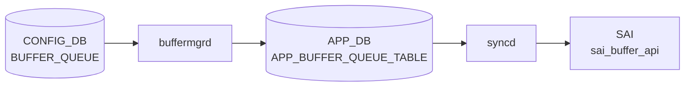

# BUFFER_QUEUE テーブル

## 概要

ポートの egress queue ごとにバッファプロファイルを割り当てる[^1]。non-[VOQ](../../reference/glossary.md#term-voq) 用と [VOQ](../../reference/glossary.md#term-voq) シャーシ用で list が分かれる。`buffermgrd` が [APPL_DB](../../reference/glossary.md#term-appl_db) に転送、`orchagent` `BufferOrch` が [SAI](../../reference/glossary.md#term-sai) egress queue buffer profile を反映する。

<!-- cdb-mermaid -->
### データフロー (自動生成)



!!! note "凡例"
    CONFIG_DB から SAI までの典型経路を `docs/reference/config-db-orch-map.md` から機械生成したミニ図。詳細・例外は本ページ本文と対応表を参照。
<!-- /cdb-mermaid -->

## key 構造

非 [VOQ](../../reference/glossary.md#term-voq):
```text
BUFFER_QUEUE|<port>|<qindex>
```

VOQ chassis:
```text
BUFFER_QUEUE|<hostname>|<asic_name>|<port>|<qindex>
```

`<qindex>` は `0..15` または範囲表現 (`0-3` 等)。

## フィールド一覧 (非 VOQ: `BUFFER_QUEUE_LIST`)

| フィールド | 型 | 必須 | デフォルト | 説明 |
|-----------|----|------|-----------|------|
| `port` (key) | leafref `PORT.name` | ✅ | - | 対象ポート |
| `qindex` (key) | string `(1[0-5]|[0-9])((-)(1[0-5]|[0-9]))?` | ✅ | - | Q-index または範囲 |
| `profile` | leafref `BUFFER_PROFILE.name` | - | `0` | 関連付ける buffer profile |

`when` 条件: `DEVICE_METADATA.localhost.switch_type` が `voq` 以外、または未指定。

## フィールド一覧 (VOQ: `VOQ_BUFFER_QUEUE_LIST`)

| フィールド | 型 | 必須 | 説明 |
|-----------|----|------|------|
| `hostname` (key) | `hostname` | ✅ | VOQ シャーシのホスト名 |
| `asic_name` (key) | `asic_name` | ✅ | ASIC インスタンス名 |
| `port` (key) | string (1..128) | ✅ | リニアカード上のポート名 |
| `qindex` (key) | string | ✅ | Q-index |
| `profile` | leafref `BUFFER_PROFILE.name` | - | buffer profile |

`when` 条件: `switch_type = voq`。

## 購読者

- `buffermgrd`: [APPL_DB](../../reference/glossary.md#term-appl_db) へ転送
- `orchagent` `BufferOrch`: [SAI](../../reference/glossary.md#term-sai) egress queue buffer profile を反映

## 関連 CONFIG_DB / YANG / CLI

- 関連 [CONFIG_DB](../../reference/glossary.md#term-config_db): `BUFFER_PROFILE`、`BUFFER_POOL`、`PORT`、`DEVICE_METADATA`、`QUEUE`、`SCHEDULER`
- 関連 CLI: なし
- 関連 [YANG](../../reference/glossary.md#term-yang): `sonic-buffer-queue`

<!-- ref-triangle:start -->

## 関連リファレンス

- [YANG](../../reference/glossary.md#term-yang): [`sonic-buffer-queue`](../yang/sonic-buffer-queue.md)

<!-- ref-triangle:end -->

## 引用元

[^1]: [YANG](../../reference/glossary.md#term-yang) 定義: `sonic-buffer-queue.yang`. <https://github.com/sonic-net/sonic-buildimage/blob/9ea932ec2e18f35e58268ec2e4456b1d4afd65cd/src/sonic-yang-models/yang-models/sonic-buffer-queue.yang>

<!-- topics-back-ref -->
## 関連 Topics

- [Topics: QoS / Buffer / PFC / Watermark](../../topics/08-qos-buffer/index.md)

<!-- /topics-back-ref -->

<!-- ops-hint -->
## 運用ヒント

### 典型値

- key 形式: `BUFFER_QUEUE|<port>|<queue-range>` (例 `0-2`, `3-4`, `5-6`)。
- `profile`: `q_lossy_profile` 等。

### よくある誤設定

- queue 範囲が抜けると当該 queue が default profile になり、計画値と乖離。

### 確認コマンド

```bash
sonic-db-cli CONFIG_DB keys 'BUFFER_QUEUE|Ethernet0|*'
show buffer queue
```
<!-- /ops-hint -->

<!-- glossary-links-injected: efbc9015e957 -->
