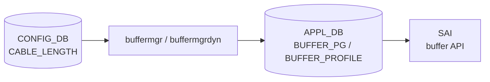

# CABLE_LENGTH テーブル

## 概要

ポートごとのケーブル長を保持し、バッファマネージャ (`buffermgr` / `buffermgrdyn`) が lossless Priority Group (PG) の headroom サイズを計算するために参照する[^1]。dynamic buffer モードでは `buffermgrdyn` が speed・mtu と組み合わせてリアルタイムに `BUFFER_PG` プロファイルを生成する。

<!-- cdb-mermaid -->
### データフロー (自動生成)



!!! note "凡例"
    CONFIG_DB から SAI までの典型経路を示すミニ図。詳細・例外は本ページ本文を参照。
<!-- /cdb-mermaid -->

## key 構造

```text
CABLE_LENGTH|<name>
```

`<name>` はケーブル長設定グループ名。デフォルトでは `AZURE` が使われる（後述）。

## 主要フィールド

| フィールド | 型 | YANG default | 説明 |
|-----------|----|--------------|------|
| `<ifname>` (フィールド名) | `string` (`[0-9]+m`) | — | ポート名をキーとし、ケーブル長 (`40m` 等) を値とする。`PORT_LIST.name` への leafref |

!!! note "テーブル構造の特殊性"
    このテーブルは「フィールド名 = ポート名、値 = ケーブル長」という構造。  
    例: `CABLE_LENGTH|AZURE` → `{"Ethernet0": "40m", "Ethernet4": "5m"}`

## 購読者

- **`buffermgr`** (`sonic-swss/cfgmgr/buffermgr.cpp`): static buffer モード。`pg_profile_lookup.ini` を参照して PG プロファイルを設定。
- **`buffermgrdyn`** (`sonic-swss/cfgmgr/buffermgrdyn.cpp`): dynamic buffer モード (`buffer_model=dynamic`)。speed・mtu と組み合わせてリアルタイムに headroom 計算し `BUFFER_PG`/`BUFFER_PROFILE` を生成。

## 関連 CONFIG_DB / YANG / CLI

- 関連 CONFIG_DB: `BUFFER_PG`、`BUFFER_PROFILE`、`BUFFER_POOL`、`DEVICE_METADATA` (buffer_model)
- 関連 CLI: `config interface cable-length <ifname> <length>` (dynamic buffer モードのみ)
- 関連 YANG: `sonic-cable-length`

<!-- ref-triangle:start -->

## 関連リファレンス

- [YANG](../../reference/glossary.md#term-yang): `sonic-cable-length`
- [CONFIG_DB](../../reference/glossary.md#term-config_db): [`BUFFER_PG`](buffer-pg.md)、[`BUFFER_PROFILE`](buffer-profile.md)

<!-- ref-triangle:end -->

## 引用元

[^1]: YANG 定義: `sonic-cable-length.yang`. <https://github.com/sonic-net/sonic-buildimage/blob/9ea932ec2e18f35e58268ec2e4456b1d4afd65cd/src/sonic-yang-models/yang-models/sonic-cable-length.yang>

<!-- ops-hint -->
## 運用ヒント

### 典型値

- key 形式: `CABLE_LENGTH|AZURE`
- フィールド: `{"Ethernet0": "40m", "Ethernet4": "5m", "Ethernet8": "300m"}`
- dynamic buffer モードのみ CLI で変更可能: `config interface cable-length Ethernet0 40m`

### よくある誤設定

- `"0m"` を設定すると lossless PG が削除される（DPC ポート向け特殊値）。誤って通常ポートに設定しないこと。
- static buffer モードで CLI を使うと「dynamic buffer が必要」エラーになる。

### 確認コマンド

```bash
sonic-db-cli CONFIG_DB hgetall 'CABLE_LENGTH|AZURE'
show buffer configuration
show buffer information
```
<!-- /ops-hint -->

<!-- cdb-exceptions -->
## 例外条件・特殊挙動

<!-- evidence: sonic-swss/cfgmgr/buffermgr.cpp, buffermgrdyn.cpp, buffers_config.j2 -->

- **`length = "0m"` → lossless PG 削除**: `buffermgr.cpp:159` および `buffermgrdyn.cpp:1492` で `"0m"` は「lossless PG を削除する」特殊値として扱われる。DPC ポート向け意図的設定。
- **`length = "None"` → silent skip**: `buffermgr.cpp:104` で `"None"` は更新をスキップ。エラーなし。
- **エントリが存在しない場合**: `buffermgrdyn` は speed や admin_up が来ても cable_length が空なら headroom 計算を延期する (`buffermgrdyn.cpp:2157-2159`)。WARN ログが出るが retry はしない。
- **admin down ポート**: cable_length が更新されても `PORT_ADMIN_DOWN` 状態のポートは `refreshPgsForPort` をスキップ (`buffermgrdyn.cpp:2191-2194`)。
- **mtu 未設定時の仮計算**: cable_length と speed が揃っているが mtu がない場合、`DEFAULT_MTU_STR = "9100"` で headroom を仮計算する (`buffermgrdyn.cpp:2174`)。mtu が後で設定されると再計算。

<!-- /cdb-exceptions -->

<!-- value-behavior -->
## 値依存挙動マトリクス

<!-- evidence: sonic-swss/cfgmgr/buffermgr.cpp:159, buffermgrdyn.cpp:1492, buffermgrdyn.cpp:1782 -->

| `length` 値 | 挙動 |
|------------|------|
| `"0m"` | lossless PG を削除。lossy PG は維持。DPC ポートや headroom 不要ポート向け |
| `"None"` | buffermgr が更新をスキップ (silent no-op) |
| `"5m"` 〜 `"500m"` | speed・mtu と組み合わせて headroom 計算。dynamic モードは `pg_lossless_<speed>_<length>_profile` を自動生成 |
| 未設定 (空) | headroom 計算を延期。speed・mtu が揃っても計算されない |

<!-- /value-behavior -->

<!-- runtime-trace -->
## CDB → 実コンテナ動作トレース

### 段階 1: Consumer 登録

- **buffermgr** / **buffermgrdyn** が `CABLE_LENGTH` テーブルを購読 (`CFG_PORT_CABLE_LEN_TABLE_NAME`)。

### 段階 2: CFG → キャッシュ

- `buffermgr`: `doCableTask()` でポート→ケーブル長の `m_cableLenLookup` マップを更新。その後 `doSpeedUpdateTask()` を呼び PG プロファイルを選択。
- `buffermgrdyn`: `handleCableLenTable()` で `portInfo.cable_length` を更新。speed・mtu が揃っていれば `refreshPgsForPort()` を即時呼び出す。

### 段階 3: headroom 計算 → APPL_DB

- **static モード** (`buffermgr`): `pg_profile_lookup.ini` から speed + cable_length に対応するエントリを引いて `BUFFER_PROFILE` を設定。
- **dynamic モード** (`buffermgrdyn`): `allocateProfile()` が speed/cable/mtu/threshold を引数に headroom ツール (`generate_headroom_info.py` or 内部計算) を呼び出し、`BUFFER_PROFILE` と `BUFFER_PG` を APPL_DB に書き込む。

### 段階 4: APPL → SAI

- `bufferorch` が APPL_DB の `BUFFER_PG`・`BUFFER_PROFILE` を購読し、SAI buffer API (`sai_buffer_api`) を通じてチップの PG headroom を設定。

<!-- /runtime-trace -->

<!-- entry-points -->
## 書き込み入り口 (Direction A)

CABLE_LENGTH テーブルへの書き込みが発生するコード経路。

### sonic-cfggen / Jinja テンプレート (初期化)

- `buffers_config.j2:231-239` が `CABLE_LENGTH|AZURE` エントリを生成。ポートの neighbor role と `ports2cable` テーブルでケーブル長を決定。
- ロールが不明な場合は HWSKU の `buffers_defaults_*.j2` で定義された `default_cable` を使用。

### CLI (dynamic buffer モードのみ)

- `config interface cable-length <ifname> <length>` → `config/main.py:6326` → `config_db.mod_entry("CABLE_LENGTH", keys[0], ...)` でポート単位に上書き。

### config load_minigraph (マージ)

- `config/main.py:3886-3915` でテンプレート値と DB 既存値をポート単位にマージ。DB 側の既存ポートは保持され、テンプレート側のポートが追加/上書き。

<!-- /entry-points -->

<!-- pubsub -->
## 通信メカニズム (Phase G)

<!-- evidence: sonic-swss/cfgmgr/buffermgrd.cpp:174-203, buffermgrdyn.cpp:450/603-648/2124-2200/3574-3610, buffermgr.h:48-51 -->

### CONFIG_DB 購読 — SubscriberStateTable

`buffermgrd` は起動時に buffer モードに応じて `CABLE_LENGTH` テーブルを `SubscriberStateTable` 経由で購読登録する。

**dynamic buffer モード** (`buffermgrdyn`): `buffermgrd.cpp:174-186`

```cpp
TableConnector(&cfgDb, CFG_PORT_CABLE_LEN_TABLE_NAME)  // CABLE_LENGTH
```

`Orch` フレームワークの `Select` ループが `SubscriberStateTable::pops()` でイベントを取り出し、`Consumer::m_toSync` キューへ積む。`doTask(Consumer &)` がディスパッチマップ (`m_bufferTableHandlerMap`) を参照して `handleCableLenTable()` を呼び出す (`buffermgrdyn.cpp:450, 3574-3610`)。

**static buffer モード** (`buffermgr`): `buffermgrd.cpp:191-203`

```cpp
CFG_PORT_CABLE_LEN_TABLE_NAME  // Orch(cfgDb, tableNames) コンストラクタで購読
```

### ハンドラ処理フロー (`handleCableLenTable`)

`buffermgrdyn.cpp:2124-2200` で CABLE_LENGTH の SET イベントを処理する:

1. フィールド全体をイテレートしポート→ケーブル長マップ (`m_cableLengths`) を更新
2. `portInfo.cable_length` が変化していなければスキップ
3. `effective_speed` 未設定なら WARN ログのみで skip (retry しない)
4. `mtu` 未設定なら `DEFAULT_MTU_STR = "9100"` で仮設定
5. `portInfo.state` に応じて分岐:
   - `PORT_INITIALIZING` → `PORT_READY` に遷移して `refreshPgsForPort()` 呼び出し
   - `PORT_READY` → 即時 `refreshPgsForPort()` 呼び出し
   - `PORT_ADMIN_DOWN` → スキップ (ログのみ)

### Lua plugin 経路 — headroom 計算

`refreshPgsForPort()` → `calculateHeadroomSize()` がベンダー固有 Lua スクリプトを Redis EVALSHA 経由で実行する (`buffermgrdyn.cpp:603-648`)。

```
EVALSHA buffer_headroom_<platform>.lua 1 <profile_name>
        <speed> <cable_length> <mtu> <gearbox_delay> <lane_count>
→ ["xon:18432", "xoff:18432", "size:36864", "xon_offset:2048"]
```

スクリプトは起動時に **APPL_DB** の Redis インスタンスへロードされる (`loadRedisScript(applDb, ...)`)。ロード失敗時は `buffermgrd` が起動を中断する (`buffermgrdyn.cpp:121`)。対象スクリプト: `buffer_headroom_<platform>.lua`, `buffer_pool_<platform>.lua`, `buffer_check_headroom_<platform>.lua`。

### APPL_DB ProducerStateTable 書き込み

headroom 計算後、`allocateProfile()` が APPL_DB へ書き込む:

| APPL_DB テーブル | ProducerStateTable メンバ | 後続コンシューマ |
|----------------|------------------------|----------------|
| `BUFFER_PROFILE_TABLE` | `m_applBufferProfileTable` (static) / dynamic は内部 | `bufferorch` ConsumerStateTable |
| `BUFFER_PG_TABLE` | `m_applBufferPgTable` / `m_applBufferObjectTables[0]` | `bufferorch` → SAI PG headroom |
| `BUFFER_POOL_TABLE` | `m_applBufferPoolTable` | `bufferorch` → SAI buffer pool |

### 全体フロー

```
CONFIG_DB:CABLE_LENGTH|AZURE
  │ SubscriberStateTable (Orch フレームワーク)
  ▼
buffermgrd (BufferMgrDynamic::handleCableLenTable)
  │ portInfo.cable_length 更新 → refreshPgsForPort()
  │   └─ calculateHeadroomSize()
  │         └─ EVALSHA buffer_headroom_<platform>.lua (APPL_DB Redis)
  │               → xon / xoff / size / xon_offset
  ▼
APPL_DB:BUFFER_PROFILE_TABLE / BUFFER_PG_TABLE  [ProducerStateTable]
  │ ConsumerStateTable (bufferorch / orchagent)
  ▼
SAI buffer API → チップ PG headroom 設定
```

<!-- /pubsub -->

<!-- defaults -->
## コード由来の暗黙デフォルト (Phase A)

YANG default と別に、コード側で「フィールド不在時の fallback」が実装されている field を全列挙する。

| field | YANG default | コード default | 適用箇所 | 種別 | evidence |
|---|---|---|---|---|---|
| `name` (エントリキー) | — | `"AZURE"` ハードコード | `buffers_config.j2:232` | ハードコード固定値 | buffers_config.j2:232 |
| `name` (複数エントリ) | — | CLI は `keys[0]` のみ更新 (2番目以降 silent drop) | `config/main.py:6349` | silent drop | config/main.py:6344 |
| `length` | — | `"None"` → buffermgr が更新スキップ (silent no-op) | `buffermgr.cpp:104` | silent drop | buffermgr.cpp:104 |
| `length` | — | `"0m"` → lossless PG 削除 (特殊値) | `buffermgr.cpp:159`, `buffermgrdyn.cpp:1492` | 値依存挙動乖離 | buffermgr.cpp:159 |
| `length` | — | DPC ポート → 強制 `"0m"` (neighbor role 無視) | `buffers_config.j2:109` | ハードコード固定値 | buffers_config.j2:109 |
| `length` | — | `Ethernet-BP` (VoQ backplane) → `"5m"` | `buffers_config.j2:115` | ハードコード固定値 | buffers_config.j2:115 |
| `length` | — | ロール別デフォルト: `torrouter_server`=`5m`, `leafrouter_torrouter`=`40m`, `spinerouter_leafrouter`=`300m`, `lowerspinerouter_leafrouter`=`500m` 等 | `buffers_config.j2:54-72` | ハードコード固定値 | buffers_config.j2:54 |
| `length` | — | HWSKU `default_cable`: `td2`→`0m`, `th(t0)`→`5m`, `th(t1)`→`40m`, `th5`→`5m`, `th2/7260(t1)`→`300m` 等 (プラットフォーム依存) | `buffers_defaults_*.j2` | プラットフォーム依存 | device/common/profiles/ |
| `length` (間接) | — | mtu 未設定時に `DEFAULT_MTU_STR="9100"` で仮 headroom 計算 (後で mtu 設定時に再計算) | `buffermgrdyn.cpp:2174` | fallback / 経路依存乖離 | buffermgrdyn.h:15 |
| (エントリ全体) | — | `config load_minigraph`: DB + template をポート単位 partial merge (DB 側の既存ポートは維持) | `config/main.py:3911-3915` | 書き込み時 vs 実行時乖離 | config/main.py:3911 |

### 該当なし field (探したが fallback 無し)

- `length` の YANG パターン (`[0-9]+m`) 違反値 → YANG バリデーションで拒否される (コード側 fallback なし)

<!-- /defaults -->
