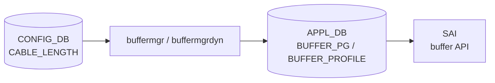

# CABLE_LENGTH テーブル

## 概要

ポートごとのケーブル長を保持し、バッファマネージャ (`buffermgr` / `buffermgrdyn`) が lossless Priority Group (PG) の headroom サイズを計算するために参照する[^1]。dynamic buffer モードでは `buffermgrdyn` が speed・mtu と組み合わせてリアルタイムに `BUFFER_PG` プロファイルを生成する。

<!-- cdb-mermaid -->
### データフロー (自動生成)



!!! note "凡例"
    CONFIG_DB から SAI までの典型経路を示すミニ図。詳細・例外は本ページ本文を参照。
<!-- /cdb-mermaid -->

## key 構造

```text
CABLE_LENGTH|<name>
```

`<name>` はケーブル長設定グループ名。デフォルトでは `AZURE` が使われる（後述）。

## 主要フィールド

| フィールド | 型 | YANG default | 説明 |
|-----------|----|--------------|------|
| `<ifname>` (フィールド名) | `string` (`[0-9]+m`) | — | ポート名をキーとし、ケーブル長 (`40m` 等) を値とする。`PORT_LIST.name` への leafref |

!!! note "テーブル構造の特殊性"
    このテーブルは「フィールド名 = ポート名、値 = ケーブル長」という構造。  
    例: `CABLE_LENGTH|AZURE` → `{"Ethernet0": "40m", "Ethernet4": "5m"}`

## 購読者

- **`buffermgr`** (`sonic-swss/cfgmgr/buffermgr.cpp`): static buffer モード。`pg_profile_lookup.ini` を参照して PG プロファイルを設定。
- **`buffermgrdyn`** (`sonic-swss/cfgmgr/buffermgrdyn.cpp`): dynamic buffer モード (`buffer_model=dynamic`)。speed・mtu と組み合わせてリアルタイムに headroom 計算し `BUFFER_PG`/`BUFFER_PROFILE` を生成。

## 関連 CONFIG_DB / YANG / CLI

- 関連 CONFIG_DB: `BUFFER_PG`、`BUFFER_PROFILE`、`BUFFER_POOL`、`DEVICE_METADATA` (buffer_model)
- 関連 CLI: `config interface cable-length <ifname> <length>` (dynamic buffer モードのみ)
- 関連 YANG: `sonic-cable-length`

<!-- ref-triangle:start -->

## 関連リファレンス

- [YANG](../../reference/glossary.md#term-yang): `sonic-cable-length`
- [CONFIG_DB](../../reference/glossary.md#term-config_db): [`BUFFER_PG`](buffer-pg.md)、[`BUFFER_PROFILE`](buffer-profile.md)

<!-- ref-triangle:end -->

## 引用元

[^1]: YANG 定義: `sonic-cable-length.yang`. <https://github.com/sonic-net/sonic-buildimage/blob/9ea932ec2e18f35e58268ec2e4456b1d4afd65cd/src/sonic-yang-models/yang-models/sonic-cable-length.yang>

<!-- ops-hint -->
## 運用ヒント

### 典型値

- key 形式: `CABLE_LENGTH|AZURE`
- フィールド: `{"Ethernet0": "40m", "Ethernet4": "5m", "Ethernet8": "300m"}`
- dynamic buffer モードのみ CLI で変更可能: `config interface cable-length Ethernet0 40m`

### よくある誤設定

- `"0m"` を設定すると lossless PG が削除される（DPC ポート向け特殊値）。誤って通常ポートに設定しないこと。
- static buffer モードで CLI を使うと「dynamic buffer が必要」エラーになる。

### 確認コマンド

```bash
sonic-db-cli CONFIG_DB hgetall 'CABLE_LENGTH|AZURE'
show buffer configuration
show buffer information
```
<!-- /ops-hint -->

<!-- cdb-exceptions -->
## 例外条件・特殊挙動

<!-- evidence: sonic-swss/cfgmgr/buffermgr.cpp, buffermgrdyn.cpp, buffers_config.j2 -->

- **`length = "0m"` → lossless PG 削除**: `buffermgr.cpp:159` および `buffermgrdyn.cpp:1492` で `"0m"` は「lossless PG を削除する」特殊値として扱われる。DPC ポート向け意図的設定。
- **`length = "None"` → silent skip**: `buffermgr.cpp:104` で `"None"` は更新をスキップ。エラーなし。
- **エントリが存在しない場合**: `buffermgrdyn` は speed や admin_up が来ても cable_length が空なら headroom 計算を延期する (`buffermgrdyn.cpp:2157-2159`)。WARN ログが出るが retry はしない。
- **admin down ポート**: cable_length が更新されても `PORT_ADMIN_DOWN` 状態のポートは `refreshPgsForPort` をスキップ (`buffermgrdyn.cpp:2191-2194`)。
- **mtu 未設定時の仮計算**: cable_length と speed が揃っているが mtu がない場合、`DEFAULT_MTU_STR = "9100"` で headroom を仮計算する (`buffermgrdyn.cpp:2174`)。mtu が後で設定されると再計算。

<!-- /cdb-exceptions -->

<!-- value-behavior -->
## 値依存挙動マトリクス

<!-- evidence: sonic-swss/cfgmgr/buffermgr.cpp:159, buffermgrdyn.cpp:1492, buffermgrdyn.cpp:1782 -->

| `length` 値 | 挙動 |
|------------|------|
| `"0m"` | lossless PG を削除。lossy PG は維持。DPC ポートや headroom 不要ポート向け |
| `"None"` | buffermgr が更新をスキップ (silent no-op) |
| `"5m"` 〜 `"500m"` | speed・mtu と組み合わせて headroom 計算。dynamic モードは `pg_lossless_<speed>_<length>_profile` を自動生成 |
| 未設定 (空) | headroom 計算を延期。speed・mtu が揃っても計算されない |

<!-- /value-behavior -->

<!-- runtime-trace -->
## CDB → 実コンテナ動作トレース

### 段階 1: Consumer 登録

- **buffermgr** / **buffermgrdyn** が `CABLE_LENGTH` テーブルを購読 (`CFG_PORT_CABLE_LEN_TABLE_NAME`)。

### 段階 2: CFG → キャッシュ

- `buffermgr`: `doCableTask()` でポート→ケーブル長の `m_cableLenLookup` マップを更新。その後 `doSpeedUpdateTask()` を呼び PG プロファイルを選択。
- `buffermgrdyn`: `handleCableLenTable()` で `portInfo.cable_length` を更新。speed・mtu が揃っていれば `refreshPgsForPort()` を即時呼び出す。

### 段階 3: headroom 計算 → APPL_DB

- **static モード** (`buffermgr`): `pg_profile_lookup.ini` から speed + cable_length に対応するエントリを引いて `BUFFER_PROFILE` を設定。
- **dynamic モード** (`buffermgrdyn`): `allocateProfile()` が speed/cable/mtu/threshold を引数に headroom ツール (`generate_headroom_info.py` or 内部計算) を呼び出し、`BUFFER_PROFILE` と `BUFFER_PG` を APPL_DB に書き込む。

### 段階 4: APPL → SAI

- `bufferorch` が APPL_DB の `BUFFER_PG`・`BUFFER_PROFILE` を購読し、SAI buffer API (`sai_buffer_api`) を通じてチップの PG headroom を設定。

<!-- /runtime-trace -->

<!-- entry-points -->
## 書き込み入り口 (Direction A)

CABLE_LENGTH テーブルへの書き込みが発生するコード経路。

### sonic-cfggen / Jinja テンプレート (初期化)

- `buffers_config.j2:231-239` が `CABLE_LENGTH|AZURE` エントリを生成。ポートの neighbor role と `ports2cable` テーブルでケーブル長を決定。
- ロールが不明な場合は HWSKU の `buffers_defaults_*.j2` で定義された `default_cable` を使用。

### CLI (dynamic buffer モードのみ)

- `config interface cable-length <ifname> <length>` → `config/main.py:6326` → `config_db.mod_entry("CABLE_LENGTH", keys[0], ...)` でポート単位に上書き。

### config load_minigraph (マージ)

- `config/main.py:3886-3915` でテンプレート値と DB 既存値をポート単位にマージ。DB 側の既存ポートは保持され、テンプレート側のポートが追加/上書き。

<!-- /entry-points -->

<!-- derivation -->
## 派生・条件付き登録 (Phase 6/7)

> 調査証跡: `meta/_intermediate/cdb-flow/cable-length-derivation.md`

### Phase 6: 値による他フィールド自動派生

`length` 値の変化が引き金となり、`BUFFER_PROFILE` / `BUFFER_PG` が自動生成・更新・削除される。

**static モード (`buffermgr`)**

| 条件 | 派生先 | evidence |
|---|---|---|
| `length != "None"` かつ値が変化 | CONFIG_DB `BUFFER_PROFILE` に `pg_lossless_<speed>_<cable>_profile` を set | buffermgr.cpp:274 |
| lossless PG が未設定ポート | CONFIG_DB `BUFFER_PG.<port>\|<pg>.profile` をプロファイル名に set | buffermgr.cpp:305 |
| `length == "0m"` | `doSpeedUpdateTask` が early return → BUFFER_PROFILE / BUFFER_PG への書込みなし | buffermgr.cpp:159-163 |

**dynamic モード (`buffermgrdyn`)**

| 条件 | 派生先 | evidence |
|---|---|---|
| speed・mtu が揃い `PORT_READY` / `PORT_INITIALIZING` | APPL_DB `BUFFER_PROFILE_TABLE` に `pg_lossless_<speed>_<cable>_<mtu>_profile` を set | buffermgrdyn.cpp:919 |
| 上記と同条件 | STATE_DB `BUFFER_PROFILE_TABLE` に同名プロファイルを set (二重書込み) | buffermgrdyn.cpp:920 |
| 上記と同条件 | APPL_DB `BUFFER_PG_TABLE.<port>\|<pg>.profile` を新プロファイル名に set | buffermgrdyn.cpp:1568 |
| `length == "0m"` かつ lossless PG が存在 | APPL_DB `BUFFER_PG_TABLE.<port>\|<pg>` を del | buffermgrdyn.cpp:1505 |
| 旧プロファイルの参照ポートがゼロになった | APPL_DB / STATE_DB `BUFFER_PROFILE_TABLE` から旧プロファイルを del | buffermgrdyn.cpp:1047-1049 |
| `PORT_INITIALIZING` → 初回 cable_length 設定 | ポート状態を `PORT_READY` に遷移 | buffermgrdyn.cpp:2184 |

### Phase 7: 条件付き module/manager 登録

| 条件 | 登録 module | evidence |
|---|---|---|
| `DEVICE_METADATA.buffer_model == "dynamic"` | `BufferMgrDynamic` が CABLE_LENGTH を `m_bufferTableHandlerMap` に登録 | buffermgrdyn.cpp:450 |
| `buffer_model != "dynamic"` (static モード) | `BufferMgr` が CABLE_LENGTH を `m_cfgCableLenTable` で購読 | buffermgr.cpp:24 |

どちらか一方のみが起動し、両者が同時に CABLE_LENGTH を購読することはない。`buffer_model` の値は `DEVICE_METADATA|localhost` で決定される。

<!-- /derivation -->

<!-- pubsub -->
## 通信メカニズム (Phase G)

<!-- evidence: sonic-swss/cfgmgr/buffermgrd.cpp:174-203, buffermgrdyn.cpp:450/603-648/2124-2200/3574-3610, buffermgr.h:48-51 -->

### CONFIG_DB 購読 — SubscriberStateTable

`buffermgrd` は起動時に buffer モードに応じて `CABLE_LENGTH` テーブルを `SubscriberStateTable` 経由で購読登録する。

**dynamic buffer モード** (`buffermgrdyn`): `buffermgrd.cpp:174-186`

```cpp
TableConnector(&cfgDb, CFG_PORT_CABLE_LEN_TABLE_NAME)  // CABLE_LENGTH
```

`Orch` フレームワークの `Select` ループが `SubscriberStateTable::pops()` でイベントを取り出し、`Consumer::m_toSync` キューへ積む。`doTask(Consumer &)` がディスパッチマップ (`m_bufferTableHandlerMap`) を参照して `handleCableLenTable()` を呼び出す (`buffermgrdyn.cpp:450, 3574-3610`)。

**static buffer モード** (`buffermgr`): `buffermgrd.cpp:191-203`

```cpp
CFG_PORT_CABLE_LEN_TABLE_NAME  // Orch(cfgDb, tableNames) コンストラクタで購読
```

### ハンドラ処理フロー (`handleCableLenTable`)

`buffermgrdyn.cpp:2124-2200` で CABLE_LENGTH の SET イベントを処理する:

1. フィールド全体をイテレートしポート→ケーブル長マップ (`m_cableLengths`) を更新
2. `portInfo.cable_length` が変化していなければスキップ
3. `effective_speed` 未設定なら WARN ログのみで skip (retry しない)
4. `mtu` 未設定なら `DEFAULT_MTU_STR = "9100"` で仮設定
5. `portInfo.state` に応じて分岐:
   - `PORT_INITIALIZING` → `PORT_READY` に遷移して `refreshPgsForPort()` 呼び出し
   - `PORT_READY` → 即時 `refreshPgsForPort()` 呼び出し
   - `PORT_ADMIN_DOWN` → スキップ (ログのみ)

### Lua plugin 経路 — headroom 計算

`refreshPgsForPort()` → `calculateHeadroomSize()` がベンダー固有 Lua スクリプトを Redis EVALSHA 経由で実行する (`buffermgrdyn.cpp:603-648`)。

```
EVALSHA buffer_headroom_<platform>.lua 1 <profile_name>
        <speed> <cable_length> <mtu> <gearbox_delay> <lane_count>
→ ["xon:18432", "xoff:18432", "size:36864", "xon_offset:2048"]
```

スクリプトは起動時に **APPL_DB** の Redis インスタンスへロードされる (`loadRedisScript(applDb, ...)`)。ロード失敗時は `buffermgrd` が起動を中断する (`buffermgrdyn.cpp:121`)。対象スクリプト: `buffer_headroom_<platform>.lua`, `buffer_pool_<platform>.lua`, `buffer_check_headroom_<platform>.lua`。

### APPL_DB ProducerStateTable 書き込み

headroom 計算後、`allocateProfile()` が APPL_DB へ書き込む:

| APPL_DB テーブル | ProducerStateTable メンバ | 後続コンシューマ |
|----------------|------------------------|----------------|
| `BUFFER_PROFILE_TABLE` | `m_applBufferProfileTable` (static) / dynamic は内部 | `bufferorch` ConsumerStateTable |
| `BUFFER_PG_TABLE` | `m_applBufferPgTable` / `m_applBufferObjectTables[0]` | `bufferorch` → SAI PG headroom |
| `BUFFER_POOL_TABLE` | `m_applBufferPoolTable` | `bufferorch` → SAI buffer pool |

### 全体フロー

```
CONFIG_DB:CABLE_LENGTH|AZURE
  │ SubscriberStateTable (Orch フレームワーク)
  ▼
buffermgrd (BufferMgrDynamic::handleCableLenTable)
  │ portInfo.cable_length 更新 → refreshPgsForPort()
  │   └─ calculateHeadroomSize()
  │         └─ EVALSHA buffer_headroom_<platform>.lua (APPL_DB Redis)
  │               → xon / xoff / size / xon_offset
  ▼
APPL_DB:BUFFER_PROFILE_TABLE / BUFFER_PG_TABLE  [ProducerStateTable]
  │ ConsumerStateTable (bufferorch / orchagent)
  ▼
SAI buffer API → チップ PG headroom 設定
```

<!-- /pubsub -->

<!-- ordering -->
## 書込み順依存 (Phase B)

> 調査証跡: `meta/_intermediate/cdb-flow/cable-length-ordering.md`

### SET 時の先行必須テーブル

| 先行テーブル | 理由 | ソース |
|---|---|---|
| `PORT` (`speed` フィールド) | `buffermgrdyn.handleCableLenTable()` が `effectiveSpeed.empty()` を確認し、空の場合は WARN ログを出しリトライなしで中断する。`buffermgr.doCableTask()` も `doSpeedUpdateTask()` 内で `m_speedLookup[port]` を参照するため speed 未着では不正キーになる | `buffermgrdyn.cpp:2155-2159`, `buffermgr.cpp:101-109` |
| `PORT_QOS_MAP` (`pfc_enable`) | `buffermgr.doSpeedUpdateTask()` が `m_portStatusLookup.count(port) == 0` で `task_need_retry` を返す。PORT_QOS_MAP が未着だと CABLE_LENGTH 通知がクリアされ、PORT_QOS_MAP 着信時に自動再処理される（static モードのみ） | `buffermgr.cpp:165-178` |
| `BUFFER_POOL` (`ingress_lossless_pool`) | `buffermgrdyn.allocateProfile()` が `m_bufferPoolReady == false` の場合に `task_need_retry` を返す。BUFFER_POOL 確立後にリトライキューから自動再処理（dynamic モードのみ） | `buffermgrdyn.cpp:978` |
| `PortInitDone` (STATE_DB / APPL_DB) | `m_portInitDone = false` の間はポートが PORT_INITIALIZING 状態に留まり、`refreshPgsForPort()` で PORT_READY チェックが通らず headroom 計算がスキップされる（dynamic モードのみ） | `buffermgrdyn.cpp:826-856`, `buffermgrdyn.cpp:1485-1487` |

!!! warning "speed 未設定はリトライなし（dynamic モード）"
    `buffermgrdyn` では speed が未設定の状態で `CABLE_LENGTH` を書いても headroom 計算はスキップされ、
    **リトライキューに残らない**。speed が後着した際に `handlePortTable()` から再処理されるが、
    speed 未着のまま `CABLE_LENGTH` だけ先に書いても lossless PG は設定されない。

### テーブル出力方向

`CABLE_LENGTH` は **上流テーブル** であり、`BUFFER_PG` / `BUFFER_PROFILE` は下流（自動生成）テーブルである。
`buffermgrdyn` は speed・cable_length・mtu が揃った時点で `refreshPgsForPort()` → `allocateProfile()` を呼び、
`APPL_DB.BUFFER_PG` と `APPL_DB.BUFFER_PROFILE` を自動生成・上書きする。
dynamic モードでは `BUFFER_PG` を手動書き込みすることは非推奨。

### PORT admin down 時の挙動

PORT が admin down 状態では `refreshPgsForPort()` を呼ばない (`buffermgrdyn.cpp:1454-1456`)。
admin down ポートへの `CABLE_LENGTH` 更新は headroom に反映されない（admin up になった時点で再処理）。

### 起動時シーケンス (dynamic モード)

```
BUFFER_POOL (ingress_lossless_pool) 設定
  ↓
PORT テーブル (speed, mtu) 設定 → portsyncd が PortInitDone を APPL_DB に書き込む
  ↓
m_portInitDone = true → buffermgrdyn がバッファプールサイズ更新開始
  ↓
CABLE_LENGTH エントリを書き込む
  ↓
handleCableLenTable() → refreshPgsForPort() → allocateProfile()
  ↓
APPL_DB.BUFFER_PROFILE / BUFFER_PG 生成 → bufferorch → SAI buffer API
```

実運用では `config qos reload` と `config load_minigraph` が Jinja テンプレート
(`buffers_config.j2`) から PORT / CABLE_LENGTH / BUFFER_POOL を一括生成するため、
順序は sonic-cfggen が暗黙に担保する。

<!-- /ordering -->

<!-- failure -->
## 失敗挙動・エラー処理 (Phase D)

> 調査証跡: `meta/_intermediate/cdb-flow/cable-length-failure.md`

<!-- evidence: sonic-swss/cfgmgr/buffermgrdyn.cpp:978,1106,1117,1541-1548,2155-2159,2189-2219, cfgmgr/buffermgr.cpp:154-155,168-170,240-243,257-258 -->

### dynamic モード (buffermgrdyn) の失敗パターン

#### speed 未設定 → headroom 計算スキップ（no retry）

`handleCableLenTable()` 処理中に `effectiveSpeed.empty()` の場合、headroom 計算はスキップされる。

```
WARN: "Speed for %s hasn't been configured yet, unable to calculate headroom"
```

- リトライキューへは積まれず、`continue` で次ポートの処理へ移行する（`buffermgrdyn.cpp:2155-2159`）。
- speed が後から設定された時点で `handlePortTable()` が `refreshPgsForPort()` を呼び出す設計のため、明示的な retry は不要とされている。
- **注意**: speed が永久に設定されない場合、lossless PG は設定されないままになる。

#### accumulative headroom 超過 → task_failed

`refreshPgsForPort()` → `isHeadroomResourceValid()` でポートの累積 headroom がプラットフォーム上限を超えた場合:

```
ERROR: "Update speed (%s) and cable length (%s) for port %s failed,
        accumulative headroom size exceeds the limit"
```

- `releaseProfile(newProfile)` で新プロファイルを即時解放（`buffermgrdyn.cpp:1541-1548`）。
- `handleCableLenTable()` は当該ポートをエラーカウントに加算し、**全ポートの処理を完了してから** `task_failed` を返す（`buffermgrdyn.cpp:2200-2208`）。途中で中断しないため、後続ポートへの影響はない。
- Orch フレームワークは `task_failed` エントリを破棄する（再 retry なし）。

#### BUFFER_POOL 未準備 → task_need_retry

`allocateProfile()` で `ingress_lossless_pool` が未確立（`getPgPoolMode()` が空文字列を返す）の場合:

- `task_process_status::task_need_retry` を返却（`buffermgrdyn.cpp:978-979`）。
- Orch フレームワークが `BUFFERMGR_TIMER_PERIOD=10` 秒後に自動再試行。BUFFER_POOL 確立後に自動解消される。

#### Lua プラグイン実行失敗 → WARN のみ、プロファイル値は空

`calculateHeadroomSize()` 内の EVALSHA 呼び出しが失敗した場合、xon/xoff/size フィールドは空文字列のまま処理が続行される（`buffermgrdyn.cpp:621-648`）。

```
WARN: "Failed to calculate headroom for %s"          # ret.empty() の場合
WARN: "Lua scripts for headroom calculation were not executed successfully"  # 例外の場合
```

- 関数は `return` で抜けるだけで例外は伝播しない。
- 空フィールドで APPL_DB に書き込まれると `bufferorch` 側でエラーが発生する可能性がある。
- 根本原因: Lua スクリプトの Redis ロード失敗（通常は起動時に検出されるが、APPL_DB 再起動等で再発する場合あり）。

#### headroom チェック Lua 失敗 → WARN のみ、制約スキップ

`isHeadroomResourceValid()` でチェック用 Lua が失敗した場合は **true を返却**（`buffermgrdyn.cpp:1106`）。headroom 超過チェックが事実上スキップされ、プラットフォームのバッファ容量を超えた設定が通ってしまう可能性がある。

### static モード (buffermgr) の失敗パターン

#### pg_profile_lookup.ini に該当エントリなし → task_invalid_entry

`m_pgProfileLookup` に対象 speed/cable の組み合わせが存在しない場合（`buffermgr.cpp:240-243`）:

```
ERROR: "Unable to create/update PG profile for port %s.
        No PG profile configured for speed %s and cable length %s"
```

- `task_process_status::task_invalid_entry` を返却。エントリは**破棄**され retry されない。
- **static モード固有の罠**: INI ファイルに存在しない speed/cable の組み合わせを設定すると、恒久的に lossless PG が設定されない。CLI/config エラーにはならず、ログ監視が必要。

#### PORT_QOS_MAP 未着 → task_need_retry (static)

`pfc_enable` が未取得（`m_portStatusLookup.count(port) == 0`）の場合（`buffermgr.cpp:168-170`）:

- `task_process_status::task_need_retry` を返却。
- PORT_QOS_MAP が着信した時点で自動再処理される。

### 失敗挙動まとめ

| 条件 | モード | ステータス | retry | ログレベル |
|------|--------|-----------|-------|------------|
| speed 未設定 | dynamic | ポートスキップ | no（speed 設定時に再処理） | WARN |
| speed/cable 未設定 | static | task_need_retry | yes（10 秒周期） | INFO |
| accumulative headroom 超過 | dynamic | task_failed | no（エントリ破棄） | ERROR |
| BUFFER_POOL 未準備 | dynamic | task_need_retry | yes（10 秒周期） | INFO |
| BUFFER_POOL 未準備 | static | task_need_retry | yes | INFO |
| Lua 実行失敗 | dynamic | (関数継続、空値) | no | WARN |
| INI エントリなし | static | task_invalid_entry | no（エントリ破棄） | ERROR |
| PORT_QOS_MAP 未着 | static | task_need_retry | yes（PORT_QOS_MAP 着信時） | INFO |
| PORT_ADMIN_DOWN | dynamic | task_success | —（admin up 時に再処理） | INFO |

!!! warning "INI エントリなしは silent failure"
    static buffer モードでは `pg_profile_lookup.ini` に存在しない speed/cable の組み合わせを設定しても
    CLI はエラーを返さず、lossless PG が永続的に欠落する。`show buffer configuration` で意図したプロファイルが
    設定されているか確認すること。

!!! warning "accumulative headroom 超過は non-recoverable"
    `task_failed` として処理が破棄されるため、ケーブル長を元に戻す（または短くする）操作が必要。
    `show buffer information` で各ポートの headroom 使用量を確認してから変更すること。

<!-- /failure -->

<!-- defaults -->
## コード由来の暗黙デフォルト (Phase A)

YANG default と別に、コード側で「フィールド不在時の fallback」が実装されている field を全列挙する。

| field | YANG default | コード default | 適用箇所 | 種別 | evidence |
|---|---|---|---|---|---|
| `name` (エントリキー) | — | `"AZURE"` ハードコード | `buffers_config.j2:232` | ハードコード固定値 | buffers_config.j2:232 |
| `name` (複数エントリ) | — | CLI は `keys[0]` のみ更新 (2番目以降 silent drop) | `config/main.py:6349` | silent drop | config/main.py:6344 |
| `length` | — | `"None"` → buffermgr が更新スキップ (silent no-op) | `buffermgr.cpp:104` | silent drop | buffermgr.cpp:104 |
| `length` | — | `"0m"` → lossless PG 削除 (特殊値) | `buffermgr.cpp:159`, `buffermgrdyn.cpp:1492` | 値依存挙動乖離 | buffermgr.cpp:159 |
| `length` | — | DPC ポート → 強制 `"0m"` (neighbor role 無視) | `buffers_config.j2:109` | ハードコード固定値 | buffers_config.j2:109 |
| `length` | — | `Ethernet-BP` (VoQ backplane) → `"5m"` | `buffers_config.j2:115` | ハードコード固定値 | buffers_config.j2:115 |
| `length` | — | ロール別デフォルト: `torrouter_server`=`5m`, `leafrouter_torrouter`=`40m`, `spinerouter_leafrouter`=`300m`, `lowerspinerouter_leafrouter`=`500m` 等 | `buffers_config.j2:54-72` | ハードコード固定値 | buffers_config.j2:54 |
| `length` | — | HWSKU `default_cable`: `td2`→`0m`, `th(t0)`→`5m`, `th(t1)`→`40m`, `th5`→`5m`, `th2/7260(t1)`→`300m` 等 (プラットフォーム依存) | `buffers_defaults_*.j2` | プラットフォーム依存 | device/common/profiles/ |
| `length` (間接) | — | mtu 未設定時に `DEFAULT_MTU_STR="9100"` で仮 headroom 計算 (後で mtu 設定時に再計算) | `buffermgrdyn.cpp:2174` | fallback / 経路依存乖離 | buffermgrdyn.h:15 |
| (エントリ全体) | — | `config load_minigraph`: DB + template をポート単位 partial merge (DB 側の既存ポートは維持) | `config/main.py:3911-3915` | 書き込み時 vs 実行時乖離 | config/main.py:3911 |

### 該当なし field (探したが fallback 無し)

- `length` の YANG パターン (`[0-9]+m`) 違反値 → YANG バリデーションで拒否される (コード側 fallback なし)

<!-- /defaults -->

<!-- constants -->
## ハードコード定数一覧 (Phase E)

<!-- evidence: sonic-swss/cfgmgr/buffermgrdyn.h:15, buffermgrdyn.cpp:485,2174,2378, buffermgr.cpp:159,183-184, buffer_headroom_mellanox.lua:42-51,119-120,160, buffer_headroom_barefoot.lua:13, buffer_pool_barefoot.lua:13 -->

バッファ計算処理に埋め込まれたハードコード定数。設定変更の影響範囲を把握するために重要。

### 定数表

| 定数名 / 値 | 型 | 定義場所 | 用途 | 備考 |
|---|---|---|---|---|
| `DEFAULT_MTU_STR = "9100"` | `string` (bytes) | `buffermgrdyn.h:15` | MTU 未設定ポートの headroom 仮計算に使用 | mtu 設定後に再計算される |
| `INGRESS_LOSSLESS_PG_POOL_NAME = "ingress_lossless_pool"` | `string` | `buffermgrdyn.h:14` | lossless PG プロファイルが割り当てられるプール名 | ハードコード固定 |
| `BUFFERMGR_TIMER_PERIOD = 10` | `int` (秒) | `buffermgrdyn.h:17` | バッファマネージャのポーリング間隔 | 10 秒周期でリトライキュー処理 |
| `speed_of_light = 198000000` | `int` (m/s) | `buffer_headroom_mellanox.lua:119` | ケーブル内伝播遅延計算に使用 (光速の約 66%) | `bytes_on_cable = 2 * cable_length * port_speed * 1e9 / speed_of_light / 8000` |
| `minimal_packet_size = 64` | `int` (bytes) | `buffer_headroom_mellanox.lua:120` | worst-case cell 占有率計算の最小パケット長 | cell_size > 128 → `cell/64`, それ以外 → `2*cell/(1+cell)` |
| `pause_quanta_per_speed[1G] = 2` | `int` | `buffer_headroom_mellanox.lua:50` | 速度別 PFC pause quanta (1 Gbps) | 512-bit 単位 |
| `pause_quanta_per_speed[10G] = 67` | `int` | `buffer_headroom_mellanox.lua:49` | 速度別 PFC pause quanta (10 Gbps) | 同上 |
| `pause_quanta_per_speed[25G] = 80` | `int` | `buffer_headroom_mellanox.lua:48` | 速度別 PFC pause quanta (25 Gbps) | 同上 |
| `pause_quanta_per_speed[40G] = 118` | `int` | `buffer_headroom_mellanox.lua:47` | 速度別 PFC pause quanta (40 Gbps) | 同上 |
| `pause_quanta_per_speed[50G] = 147` | `int` | `buffer_headroom_mellanox.lua:46` | 速度別 PFC pause quanta (50 Gbps) | 同上 |
| `pause_quanta_per_speed[100G] = 394` | `int` | `buffer_headroom_mellanox.lua:45` | 速度別 PFC pause quanta (100 Gbps) | 同上 |
| `pause_quanta_per_speed[200G] = 453` | `int` | `buffer_headroom_mellanox.lua:44` | 速度別 PFC pause quanta (200 Gbps) | 同上 |
| `pause_quanta_per_speed[400G] = 905` | `int` | `buffer_headroom_mellanox.lua:43` | 速度別 PFC pause quanta (400 Gbps) | 同上 |
| `pause_quanta_per_speed[800G] = 905` | `int` | `buffer_headroom_mellanox.lua:42` | 速度別 PFC pause quanta (800 Gbps) | 400G と同値 |
| `ppg_headroom = 400 * cell_size` | `int` (bytes) | `buffer_pool_barefoot.lua:13` | Barefoot (Tofino) ASIC の per-PG headroom 固定計算式 | cell_size は ASIC テーブルから取得 |
| `gearbox_delay = 0` | `int` | `buffer_headroom_mellanox.lua:57` | gearbox 遅延未設定時のフォールバック値 | ARGV[4] が nil のとき 0 バイトと扱う |
| プロファイル名テンプレート `"pg_lossless_<speed>_<cable>_profile"` | `string` | `buffermgr.cpp:183-184`, `buffermgrdyn.cpp:487,491` | PG プロファイルのキー命名規則 | MTU = 9100 のとき mtu サフィックス省略; `pg_lossless_<speed>_<cable>_mtu<mtu>_profile` に変化 |

### 注記

- **`DEFAULT_MTU_STR`**: `buffermgrdyn.cpp:2174` および `2378` の 2 箇所で使用。cable_length が来た時点で mtu が空なら `"9100"` で仮計算し、後から mtu が設定されると `refreshPgsForPort` が再実行される。
- **`speed_of_light`**: 光ファイバー内の実効速度 (真空中の約 2/3)。銅線の伝播速度は若干異なるが、Mellanox headroom lua ではこの値で統一。
- **`minimal_packet_size`**: 64 bytes は Ethernet 最小フレーム長 (payload 46 bytes + ヘッダ 18 bytes)。cell_size との比較で worst-case factor を決定する分岐に使用。
- **`BUFFERMGR_TIMER_PERIOD`**: 設定変更が失敗した際の再試行は 10 秒ごと。cable_length 設定変更後に headroom 計算が即座に反映されない場合の待機目安。

<!-- /constants -->

<!-- side-effects -->
## 副次 DB 書込み (Phase F)

<!-- evidence: sonic-swss/cfgmgr/buffermgr.cpp, buffermgrdyn.cpp -->

CABLE_LENGTH 更新が引き起こす **他テーブルへの書込み**を示す。書込み先はモードによって異なる。

### static モード (buffermgr)

`doCableTask()` → `doSpeedUpdateTask()` の呼び出しチェーンで CONFIG_DB へ直接書き込む。

| 書込み先 DB | テーブル | 操作 | 条件 |
|-----------|---------|------|------|
| CONFIG_DB | `BUFFER_PROFILE` | `set(pg_lossless_<speed>_<cable>_profile)` | プロファイル未存在時のみ新規作成 (`buffermgr.cpp:274`) |
| CONFIG_DB | `BUFFER_PG` | `set(<port>\|<pg>, {profile: ...})` | lossless PG が未設定の場合 (`buffermgr.cpp:305`) |
| CONFIG_DB | `BUFFER_PG` | `del(<port>\|<pg>)` | admin-down (Mellanox/Barefoot) かつ default profile 一致時 (`buffermgr.cpp:224`) |

- `length = "0m"` → early return、書込みなし (`buffermgr.cpp:159`)。
- `length = "None"` → スキップ、書込みなし (`buffermgr.cpp:104`)。

### dynamic モード (buffermgrdyn)

`handleCableLenTable()` → `refreshPgsForPort()` → `allocateProfile()` の呼び出しチェーンで APPL_DB / STATE_DB へ書き込む。

| 書込み先 DB | テーブル | 操作 | 条件 |
|-----------|---------|------|------|
| APPL_DB | `BUFFER_PROFILE_TABLE` | `set(pg_lossless_<speed>_<cable>_<mtu>_profile, xon/xoff/size/pool/threshold)` | 新規プロファイル計算時 (`buffermgrdyn.cpp:919`) |
| STATE_DB | `BUFFER_PROFILE_TABLE` | `set(同名プロファイル, 同フィールド)` | APPL_DB 書込みと同時 (`buffermgrdyn.cpp:920`) |
| APPL_DB | `BUFFER_PG_TABLE` | `set(<port>\|<pg>, {profile: <name>})` | headroom 計算成功後 (`buffermgrdyn.cpp:1568`) |
| APPL_DB | `BUFFER_PG_TABLE` | `del(<port>\|<pg>)` | `cable_length == "0m"` かつ lossless PG 存在時 (`buffermgrdyn.cpp:1505`) |
| APPL_DB | `BUFFER_PROFILE_TABLE` | `del(old_profile)` | 旧プロファイルの参照ポート数がゼロになった時 (`buffermgrdyn.cpp:1047`) |
| STATE_DB | `BUFFER_PROFILE_TABLE` | `del(old_profile)` | 同上 (`buffermgrdyn.cpp:1049`) |
| STATE_DB | `BUFFER_POOL_TABLE` | `set(ingress_lossless_pool, size/xoff)` | headroom 更新後に SHP サイズ再計算が発生した場合 (`buffermgrdyn.cpp:887`) |

!!! note "二重書込み"
    `updateBufferProfileToDb()` は APPL_DB と STATE_DB の `BUFFER_PROFILE_TABLE` に同一内容を同時書込みする (`buffermgrdyn.cpp:919-920`)。`updateBufferPoolToDb()` も同様に `BUFFER_POOL_TABLE` を二重書込みする (`buffermgrdyn.cpp:885-887`)。

!!! note "admin-down / mtu 未設定の例外"
    - `PORT_ADMIN_DOWN` 状態では `refreshPgsForPort()` が early return → 書込みなし (`buffermgrdyn.cpp:1454-1458`)。
    - mtu 未設定時は `DEFAULT_MTU_STR="9100"` で仮計算して書き込み、mtu 設定後に再計算・上書き (`buffermgrdyn.cpp:2174`)。

<!-- /side-effects -->

<!-- cross-refs -->
## 暗黙参照テーブル (Phase C)

CABLE_LENGTH テーブルの処理中に `buffermgr` / `buffermgrdyn` が暗黙的に参照する CONFIG_DB テーブルを示す。これらは CABLE_LENGTH テーブルの直接フィールドには現れないが、headroom 計算・処理経路・プロファイル生成に必須の依存関係を持つ。

<!-- evidence: sonic-swss/cfgmgr/buffermgr.cpp, buffermgrdyn.cpp -->

### PORT テーブル (CONFIG_DB)

- **参照箇所**: `buffermgr.cpp:23,544` / `buffermgrdyn.cpp:449,2266-2359`
- **参照フィールド**: `speed`, `mtu`, `admin_status`, `lanes`, `autoneg`, `adv_speeds`
- **依存性質**: 必須前提条件。CABLE_LENGTH 単体では headroom 計算を開始できず、PORT テーブルの `speed` が揃って初めて `refreshPgsForPort()` / `doSpeedUpdateTask()` が実行される。`admin_status=down` のポートは CABLE_LENGTH 更新を受けても計算をスキップ (`buffermgrdyn.cpp:2191-2194`)。

### DEVICE_METADATA テーブル (CONFIG_DB)

- **参照箇所**: `buffermgr.cpp:470` / `buffermgrdyn.cpp:41,87`
- **参照フィールド**: `buffer_model`, `platform`
- **依存性質**: 処理経路分岐。`buffer_model=dynamic` の場合 `buffermgr` は CABLE_LENGTH イベントを全スキップし `buffermgrdyn` が担当する。Mellanox プラットフォームでは `platform` フィールドで headroom 計算 Lua スクリプトを選択する (`buffermgrdyn.cpp:87-94`)。

### BUFFER_POOL テーブル (CONFIG_DB)

- **参照箇所**: `buffermgr.cpp:27,115,481` / `buffermgrdyn.cpp:443,2509`
- **参照フィールド**: `mode`, `size`
- **依存性質**: 制約チェック。CABLE_LENGTH 由来の headroom 計算後、`ingress_lossless_pool` の `mode` を `getPgPoolMode()` で参照し `BUFFER_PROFILE` の `dynamic_th` を設定する。dynamic モードでは SHP (Shared Headroom Pool) サイズとの整合性チェックにも使用される。

### BUFFER_PROFILE テーブル (CONFIG_DB)

- **参照箇所**: `buffermgr.cpp:25,248,487` / `buffermgrdyn.cpp:444,964-1001,2671`
- **参照フィールド**: `pool`, `xon`, `xoff`, `size`, `dynamic_th`
- **依存性質**: 読み書き双方向。CABLE_LENGTH 更新のたびに `pg_lossless_<speed>_<cable>_profile` 形式の BUFFER_PROFILE を自動生成・更新・削除する。ユーザ定義の headroom override プロファイルが CONFIG_DB.BUFFER_PROFILE に存在する場合はそちらを優先し、dynamic 自動生成と区別して管理する (`buffermgrdyn.cpp:2671`)。

### 暗黙参照マトリクス

| テーブル | 参照ファイル | 参照フィールド | 種別 |
|---|---|---|---|
| `PORT` | buffermgr.cpp, buffermgrdyn.cpp | `speed`, `mtu`, `admin_status`, `lanes` | 必須前提条件 |
| `DEVICE_METADATA` | buffermgr.cpp, buffermgrdyn.cpp | `buffer_model`, `platform` | 処理経路分岐 |
| `BUFFER_POOL` | buffermgr.cpp, buffermgrdyn.cpp | `mode`, `size` | 制約チェック |
| `BUFFER_PROFILE` | buffermgr.cpp, buffermgrdyn.cpp | `pool`, `xon`, `xoff`, `size`, `dynamic_th` | 読み書き双方向 |

<!-- /cross-refs -->

<!-- platform -->
## プラットフォーム差分 (Phase H)

<!-- evidence: sonic-swss/cfgmgr/buffermgr.cpp:37,206, cfgmgr/buffermgrdyn.cpp:68-93,504-522 -->

### dynamic vs static での cable_length 使われ方の違い

| 観点 | static モード (`buffermgr`) | dynamic モード (`buffermgrdyn`) |
|------|----------------------------|---------------------------------|
| headroom 計算方法 | `pg_profile_lookup.ini` (INI ファイル) を `(speed, cable)` キーで引く | ベンダー固有 Lua プラグイン (`buffer_headroom_<vendor>.lua`) をリアルタイム呼び出し |
| プロファイル名 | `pg_lossless_<speed>_<cable>_profile` (固定) | `speed`・`cable`・`mtu`・`threshold`・`gearbox_model`・`lane_count` を組み合わせて動的生成 |
| admin down 時の PG 削除 | **Mellanox / Barefoot のみ** (`buffermgr.cpp:206`) | 全ベンダー共通で `refreshPgsForPort` スキップ (`buffermgrdyn.cpp:2191-2194`) |
| MTU 未設定 fallback | なし (INI はMTU非依存) | `DEFAULT_MTU_STR="9100"` で仮計算、MTU 設定時に再計算 (`buffermgrdyn.cpp:2174`) |

### ASIC ベンダー別 cable length lookup の実装差

**static モード — INI ファイル:**

- `buffermgr.cpp:21` — コンストラクタが `pg_lookup_file` パスを受け取り `readPgProfileLookupFile()` で読み込む
- `buffermgr.cpp:37` — `ASIC_VENDOR` 環境変数を `m_platform` にセット
- INI の数値内容はプラットフォームパッケージ (HWSKU) が提供。Broadcom / Mellanox / Marvel 各 ASIC で異なる
- admin down ポートの PG 削除は `m_platform == "mellanox" || m_platform == "barefoot"` の場合のみ (`buffermgr.cpp:206`)

**dynamic モード — Lua プラグイン:**

- `buffermgrdyn.cpp:68` — `ASIC_VENDOR` 環境変数からプラットフォームを取得
- `buffermgrdyn.cpp:76-78` — `buffer_headroom_<vendor>.lua` / `buffer_pool_<vendor>.lua` / `buffer_check_headroom_<vendor>.lua` の 3 本をベンダー固有で選択
- **Mellanox 固有の追加分岐**:
  - `buffermgrdyn.cpp:85-93` — Mellanox のみ `DEVICE_METADATA.platform` からモデル番号 (SN-XXXX) を抽出し `m_model_number` に保存
  - `buffermgrdyn.cpp:504-522` — `getDynamicProfileName()` 内で Mellanox かつ 8 レーンポートの場合、プロファイル名に `_8lane` サフィックスを付加
    - 条件: `lane_count == 8` かつ `(SN4xxx 系で speed != 400000) || (SN5xxx 系で speed != 800000)`
    - 例: 100G 8 レーン → `pg_lossless_100000_5m_8lane_profile`、4 レーン → `pg_lossless_100000_5m_profile`
    - 理由: 8 レーンポートは xon 値が他レーン数の 2 倍になるためプロファイルを分離する必要がある

### プロファイル名生成パターンまとめ

```
static:  pg_lossless_<speed>_<cable>_profile
         (INI テーブルから数値引き; ベンダー依存 INI ファイル)

dynamic: pg_lossless_<speed>_<cable>[_mtu<N>][_th<T>][_<gearbox>][_8lane]_profile
         (_8lane は Mellanox 8 レーンポートのみ付加)
```

<!-- /platform -->
