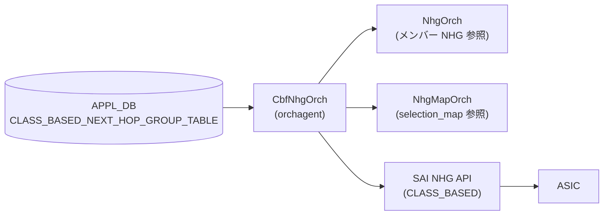

# CLASS_BASED_NEXT_HOP_GROUP テーブル

## 概要

Class Based Forwarding (CBF) 用のクラスベース次ホップグループを [APPL_DB](../../reference/glossary.md#term-appl_db) に保持するテーブル[^1]。`sonic-swss` の `CbfNhgOrch` が APPL_DB の `CLASS_BASED_NEXT_HOP_GROUP_TABLE` を購読し、SAI の `SAI_NEXT_HOP_GROUP_TYPE_CLASS_BASED` グループを作成・削除する。

CBF は DSCP/EXP 値から決定した Forwarding Class (FC) 値に基づいて、同じ宛先に対して複数の NHG のうちの 1 つへパケットをステアリングする機能[^2]。CBF NHG は通常 NHG (NEXT_HOP_GROUP) をメンバーとして持ち、`selection_map` によって FC 値と NHG メンバー (インデックス) の対応を定義する。

!!! note "fpmsyncd との関係"
    HLD Rev 0.2 の Restrictions 節に記載のとおり、標準の `fpmsyncd` はこのテーブルを書き込まない。本テーブルを利用するには修正版 fpmsyncd またはカスタムアプリケーションが APPL_DB に直接書き込む必要がある。

<!-- cdb-mermaid -->
### データフロー (自動生成)



!!! note "凡例"
    APPL_DB エントリを CbfNhgOrch が受信し、メンバー NHG および選択マップの存在を確認してから SAI へプログラムする。
<!-- /cdb-mermaid -->

## key 構造

```text
CLASS_BASED_NEXT_HOP_GROUP_TABLE|<name>
```

- `<name>`: CBF NHG を識別する任意の文字列 (プログラマが自由に決定)

## フィールド

| フィールド | 型 | デフォルト | 説明 |
|-----------|----|-----------|------|
| `members` | string (カンマ区切り) | **必須** | NEXT_HOP_GROUP_TABLE のエントリキーをカンマ区切りで列挙。宣言順に index 0 から割り当てられる |
| `selection_map` | string | **必須** | FC_TO_NHG_INDEX_MAP_TABLE のエントリキー。FC 値から members インデックスへのマッピングを指定 |

## 制約

- `members` は空にできない。空文字列を指定するとエラーログを出力してエントリを破棄する (`cbfnhgorch.cpp:223-227`)
- `members` 内のエントリは一意でなければならない。重複するとエラーログを出力してエントリを破棄する (`cbfnhgorch.cpp:231-235`)
- `selection_map` に指定した名前が `FC_TO_NHG_INDEX_MAP_TABLE` に存在しなければならない。存在しない場合は SAI 作成失敗 (`cbfnhgorch.cpp:321-325`)
- `selection_map` 内で参照される最大 NHG インデックス < `members` の数でなければならない (`cbfnhgorch.cpp:327-331`)
- 各メンバー NHG は `NEXT_HOP_GROUP_TABLE` に存在し、かつ sync 済みでなければならない。未 sync の場合は一時 NHG として扱い再試行される (`cbfnhgorch.cpp:644-660`)
- グループ総数は `gRouteOrch->getMaxNhgCount()` を超過できない (`cbfnhgorch.cpp:100`)

## SAI 属性マッピング

| フィールド / 属性 | SAI 属性 | ソース |
|---|---|---|
| グループ型 (固定値) | `SAI_NEXT_HOP_GROUP_TYPE_CLASS_BASED` | `cbfnhgorch.cpp:301-303` |
| `members` の数 | `SAI_NEXT_HOP_GROUP_ATTR_CONFIGURED_SIZE` | `cbfnhgorch.cpp:306-309` |
| `selection_map` → OID | `SAI_NEXT_HOP_GROUP_ATTR_SELECTION_MAP` | `cbfnhgorch.cpp:318-333` |
| 各 member の NHG OID | `SAI_NEXT_HOP_GROUP_MEMBER_ATTR_NEXT_HOP_ID` | `cbfnhgorch.cpp:733-735` |
| 各 member の 0-based index | `SAI_NEXT_HOP_GROUP_MEMBER_ATTR_INDEX` | `cbfnhgorch.cpp:738-739` |

## 購読者

- `CbfNhgOrch` (`sonic-swss/orchagent/cbf/cbfnhgorch.cpp`): APPL_DB `CLASS_BASED_NEXT_HOP_GROUP_TABLE` を購読して SAI CBF NHG を作成・更新・削除

## 関連 CONFIG_DB / CLI

- 関連 APPL_DB: `NEXT_HOP_GROUP_TABLE` (members として参照)、`FC_TO_NHG_INDEX_MAP_TABLE` (selection_map として参照)
- 関連 CONFIG_DB: `DSCP_TO_FC_MAP`、`EXP_TO_FC_MAP`
- CLI: なし (標準 CLI 未実装; カスタムアプリが APPL_DB に直接書き込む)

<!-- cdb-exceptions -->
## 例外条件・特殊挙動

| 条件 | 挙動 |
|------|------|
| `members` が空文字列 | `"CBF next hop group members list is empty"` を SWSS_LOG_ERROR 出力 + エントリ破棄 |
| `members` に重複エントリ | `"CBF next hop group members are not unique"` を SWSS_LOG_ERROR 出力 + エントリ破棄 |
| `selection_map` が存在しない | `"FC to NHG map index ... does not exist"` を SWSS_LOG_ERROR 出力 + sync 失敗 (タスクを保留) |
| selection_map の最大 NH index >= members.size() | `"FC to NHG map references more NHG members than exist"` を SWSS_LOG_ERROR 出力 + sync 失敗 |
| members の NHG 数 > 最大 FC 数 | `"More CBF NHG members configured than supported Forwarding Classes"` を SWSS_LOG_WARN 出力 (エラーではない、続行) |
| メンバー NHG が未 sync (一時 NHG) | sync を一時的に false 返却 → 次タスクループで再試行。一時 NHG が昇格するまで保留 |
| 参照 count > 0 の CBF NHG を削除しようとした | `"Skipping removal ... which is still referenced"` を SWSS_LOG_WARN 出力 + 削除スキップ |
| 存在しない CBF NHG を削除しようとした | `"Deleting inexistent CBF NHG"` を SWSS_LOG_WARN 出力 + 成功扱い (no-op) |
| DEL の後に SET が pending | DEL をスキップして SET を更新として処理 (`cbfnhgorch.cpp:152-155`) |
<!-- /cdb-exceptions -->

<!-- value-behavior -->
## 値依存挙動マトリクス

### `members` (string, カンマ区切り)

| 状態 | 挙動 | evidence |
|---|---|---|
| 空文字列 | エラーログ + エントリ破棄 | `cbfnhgorch.cpp:223-227` |
| 重複あり | エラーログ + エントリ破棄 | `cbfnhgorch.cpp:231-235` |
| メンバー NHG が一時 NHG | sync 保留 + 再試行 | `cbfnhgorch.cpp:116-119, 695-699` |
| 既存グループと同一順序 | NEXT_HOP 属性のみ更新 (member 再作成なし) | `cbfnhgorch.cpp:463-503` |
| 既存グループと異なる | 全 member を remove → 新メンバーで再 sync | `cbfnhgorch.cpp:516-553` |

### `selection_map` (string)

| 状態 | 挙動 | evidence |
|---|---|---|
| 存在しないマップ名 | `SAI_NULL_OBJECT_ID` → エラーログ + sync 失敗 | `cbfnhgorch.cpp:321-325` |
| 既存と同一 | SAI 更新なし | `cbfnhgorch.cpp:557` |
| 既存と異なる | `SAI_NEXT_HOP_GROUP_ATTR_SELECTION_MAP` を set_attribute で更新 + ref count 更新 | `cbfnhgorch.cpp:557-589` |
<!-- /value-behavior -->

<!-- ordering -->
## 順序依存関係 (Phase B)

APPL_DB の `CLASS_BASED_NEXT_HOP_GROUP_TABLE` エントリが SAI へプログラムされるまでの処理順序。

### ポートレディ前提

`CbfNhgOrch::doTask()` は冒頭で `gPortsOrch->allPortsReady()` を確認する。全ポートが ready になるまでタスクループ全体をスキップする (`cbfnhgorch.cpp:42-45`)。

### 想定セットアップ順序

CBF NHG を正常に sync するには次の順序で APPL_DB へ書き込む必要がある。

1. **`FC_TO_NHG_INDEX_MAP_TABLE` エントリ作成** — `NhgMapOrch` が先に selection_map を登録しておく必要がある。`gNhgMapOrch->getMapId()` が `SAI_NULL_OBJECT_ID` を返した場合、`CbfNhg::sync()` は即 `false` を返してタスクを保留する (`cbfnhgorch.cpp:321-325`)。
2. **`NEXT_HOP_GROUP_TABLE` エントリ作成** — 各メンバー NHG が `NhgOrch` 内で synced でなければならない。未 sync の場合、`syncMembers()` が `false` を返し次タスクループで再試行される (`cbfnhgorch.cpp:644-662`)。一時 NHG (temp NHG) はメンバーとして許容されるが、`hasTemps()` が true のまま保留状態が続く (`cbfnhgorch.cpp:116-119`)。
3. **`CLASS_BASED_NEXT_HOP_GROUP_TABLE` エントリ作成** — 上記 2 つが揃って初めて SAI プログラムが完了する。

```
FC_TO_NHG_INDEX_MAP_TABLE エントリ (NhgMapOrch)
  ↓
NEXT_HOP_GROUP_TABLE エントリ × N (NhgOrch) → sync 完了
  ↓
CLASS_BASED_NEXT_HOP_GROUP_TABLE エントリ (CbfNhgOrch)
  ↓
SAI create_next_hop_group (TYPE=CLASS_BASED, SIZE=N, SELECTION_MAP=OID)
  ↓
SAI create_next_hop_group_member × N (NHG_ID, NEXT_HOP_ID, INDEX=0..N-1)
  ↓
CRM カウンタ加算 (CRM_NEXTHOP_GROUP)
```

### member index は宣言順固定・変更時は全 remove → 再 sync

`CbfNhg::CbfNhg()` コンストラクタはメンバーを宣言順に `index=0` から割り当てる。`SAI_NEXT_HOP_GROUP_MEMBER_ATTR_INDEX` は `CREATE_ONLY` SAI 属性のため、メンバーの追加・削除・順序変更が発生した場合は既存メンバー全件を `removeMembers()` で削除してから新しい順序で `syncMembers()` を再実行する (`cbfnhgorch.cpp:508-553`)。

メンバーが同一で順序も変わらない場合のみ差分更新となり、NHG OID が変化したメンバーだけ `updateNhAttr()` で `SAI_NEXT_HOP_GROUP_MEMBER_ATTR_NEXT_HOP_ID` を更新する (`cbfnhgorch.cpp:463-503`)。

### DEL + SET の順序保護

同一 key に対して DEL の後に SET が pending にある場合、DEL をスキップして SET を更新扱いにする (`cbfnhgorch.cpp:152-155`)。これにより ref count でブロックされた DEL の完了後に SET が適用されて意図せずオブジェクトが削除されるシナリオを防ぐ。

### NHG 上限による作成保留

新規作成時に `gRouteOrch->getNhgCount() + NhgBase::getSyncedCount() >= gRouteOrch->getMaxNhgCount()` が真の場合、作成を保留して次タスクループへ回す (`cbfnhgorch.cpp:100-103`)。既存 NHG の削除によって上限が下がるまで再試行が続く。

### orchList 内での処理順序

`OrchDaemon` は `m_orchList` の順序どおりに各 Orch の `doTask()` を呼び出す。

```
m_orchList = { ..., gNhgMapOrch, gNhgOrch, gCbfNhgOrch, ... }
```
(`orchdaemon.cpp:500`) — `NhgMapOrch` → `NhgOrch` → `CbfNhgOrch` の順で実行されるため、1 回のタスクループ内で依存 Orch が先に処理を完了し、CBF NHG の sync 前提条件が満たされやすい設計になっている。

### warm-reboot 挙動

`OrchDaemon::warmRestoreAndSyncUp()` は全 Orch を 3 回ループして `doTask()` を呼び出す (`orchdaemon.cpp:1095-1170`)。`CbfNhgOrch` 固有の warm-reboot フック（`bake` / `onWarmBootEnd` のオーバーライド）は存在しない。依存 Orch (`NhgMapOrch`, `NhgOrch`) が orchList 上で先行するため、ループ 1 回目で selection_map とメンバー NHG が復元され、2 回目以降で CBF NHG が正常に sync される。pending タスクが残る場合、3 回目のループで解消される設計となっている。
<!-- /ordering -->

<!-- cross-refs -->
## 暗黙参照テーブル (Phase C)

`CLASS_BASED_NEXT_HOP_GROUP_TABLE` エントリが処理される際に `CbfNhgOrch` が暗黙的に参照・依存する他テーブル / グローバルリソースを示す。

| 参照先テーブル / リソース | 参照方向 | 条件 | 参照元 evidence |
|--------------------------|---------|------|----------------|
| `APPL_DB NEXT_HOP_GROUP_TABLE\|<name>` (members として参照) | 必須前提参照（読取り） | `members` に列挙した各 NHG キーが `NhgOrch` 内で synced であること。未 sync の場合 `syncMembers()` が `false` を返してタスクを保留する。メンバー変更時に `incNhgRefCount` / `decNhgRefCount` で参照カウントを管理する | `cbfnhgorch.cpp:644-662`, `cbfnhgorch.cpp:758`, `cbfnhgorch.cpp:808` |
| `APPL_DB FC_TO_NHG_INDEX_MAP_TABLE\|<name>` (selection_map として参照) | 必須前提参照（読取り） | `selection_map` フィールドで指定したキーが `NhgMapOrch` に登録済みであること。`getMapId()` が `SAI_NULL_OBJECT_ID` を返す場合、`CbfNhg::sync()` は即 `false` を返してタスクを保留する。sync 成功後に `incRefCount()` / `decRefCount()` で参照カウントを管理する | `cbfnhgorch.cpp:319-325`, `cbfnhgorch.cpp:354`, `cbfnhgorch.cpp:396` |
| `RouteOrch::getMaxNhgCount()` / `getNhgCount()` (NHG 上限管理) | グローバルカウンタ参照（読取り） | 新規作成時に `getNhgCount() + NhgBase::getSyncedCount() >= getMaxNhgCount()` が真の場合、作成を保留して次タスクループへ回す。CbfNhgOrch は RouteOrch のカウンタ値を参照するが RouteOrch エントリを直接書き換えない | `cbfnhgorch.cpp:100-103` |
| `CrmOrch` (`CRM_NEXTHOP_GROUP`) | CRM カウンタ更新（書込み） | SAI NHG 作成成功後に `gCrmOrch->incCrmResUsedCounter(CRM_NEXTHOP_GROUP)` を呼ぶ。DEL 時の `decCrmResUsedCounter` は `NhgBase` 基底クラスが担当する | `cbfnhgorch.cpp:358` |
| `CLASS_BASED_NEXT_HOP_GROUP_TABLE` ← 逆参照（被参照は現状なし） | 逆参照なし | 本テーブルのエントリを他 Orch が leafref / 参照カウント経由で依存するケースは現時点でコードに存在しない。削除時の参照ガードは `refCount` 管理を介して実装されているが、参照元は外部 Orch ではなく内部テーブル管理のみ | — |

### 解決タイミング

- **NEXT_HOP_GROUP_TABLE 依存**: `syncMembers()` が各メンバーの `NhgOrch::hasNhg()` および `NhgBase::isSynced()` を確認する。未解決のメンバーがある場合は `false` を返し、次の doTask 呼び出し時に再評価される（`cbfnhgorch.cpp:644-662`）。
- **FC_TO_NHG_INDEX_MAP_TABLE 依存**: `CbfNhg::sync()` が `gNhgMapOrch->getMapId()` を即時確認する。未解決の場合は `sync()` が `false` を返してタスクが `m_toSync` に残留し、NhgMapOrch が selection_map を登録した後の次ループで再評価される（`cbfnhgorch.cpp:319-325`）。
- **CRM カウンタ更新**: SAI `create_next_hop_group` 成功直後に同期更新される（`cbfnhgorch.cpp:358`）。

### orchList 上の依存 Orch との相対位置

`OrchDaemon` の `m_orchList` は `NhgMapOrch` → `NhgOrch` → `CbfNhgOrch` の順に配置されている。この順序により、同一タスクループ内で依存 Orch が先に処理を完了するため、CBF NHG の sync 前提条件が揃いやすい設計となっている（`orchdaemon.cpp:500` 付近）。
<!-- /cross-refs -->

<!-- failure -->
## 失敗挙動 (Phase D)

`CbfNhgOrch::doTask(Consumer&)` (`sonic-swss/orchagent/cbf/cbfnhgorch.cpp`) を全行精読した結果、以下の失敗分岐・retry 挙動を検出した。

### SET 操作の失敗パターン

| 失敗ケース | 発生箇所 | 挙動 | retry |
|---|---|---|---|
| `gPortsOrch->allPortsReady()` が false | `doTask()` L42-44 | 早期 return。全タスクが `m_toSync` に滞留 | Port 準備完了まで暗黙 retry（erase なし・ログなし） |
| `members` が空文字列 | `getMembers()` L223-227 | `SWSS_LOG_ERROR` 出力 + `m_toSync.erase` で**破棄** | なし（再投入が必要） |
| `members` に重複エントリ | `getMembers()` L231-235 | `SWSS_LOG_ERROR` 出力 + `m_toSync.erase` で**破棄** | なし（再投入が必要） |
| NHG 上限到達（新規作成時） | `doTask()` L100-103 | `SWSS_LOG_WARN` 出力 + `success=false` → `it++`（保留） | NHG 削除により上限が下がるまで無制限 retry |
| `selection_map` が `NhgMapOrch` に未登録 | `CbfNhg::sync()` L319-325 | `SWSS_LOG_ERROR` + `sync()` が `false` 返却 → `success=false` → `it++`（保留） | `FC_TO_NHG_INDEX_MAP_TABLE` 登録まで無制限 retry |
| `selection_map` の最大 NH index >= members 数 | `CbfNhg::sync()` L327-331 | `SWSS_LOG_ERROR` + `sync()` が `false` 返却 → `success=false` → `it++`（保留） | 再設定（members 追加 or selection_map 修正）まで無制限 retry |
| SAI `create_next_hop_group` 失敗 | `CbfNhg::sync()` L341-345 | `SWSS_LOG_ERROR` + `sync()` が `false` 返却 → `success=false` → `it++`（保留） | SAI エラー解消まで無制限 retry |
| メンバー NHG が未 sync（一時 NHG） | `CbfNhg::syncMembers()` L637-638 | `SWSS_LOG_WARN` + `syncMembers()` が `false` 返却 → `sync()` も `false` → NHG は `m_syncdNextHopGroups` に登録されるが `success=false` → `it++`（保留） | メンバー NHG が sync 完了するまで毎ループ再評価 |
| sync 成功後も一時 NHG が残る | `doTask()` L116-119 | NHG は登録済みだが `success=false` → `it++`（保留）— 次ループで `update()` 経路に切替わり一時 NHG 昇格を確認 | 一時 NHG の昇格まで無制限 retry |
| 更新時の `update()` 失敗（members / selection_map 変更） | `doTask()` L130 → `CbfNhg::update()` | `success=false` → `it++`（保留） | エラー原因解消まで無制限 retry |

### DEL 操作の失敗パターン

| 失敗ケース | 発生箇所 | 挙動 | retry |
|---|---|---|---|
| 同一 key に後続 SET がある（DEL + SET の連続投入） | `doTask()` L152-155 | DEL をスキップして `success=true` → erase。後続 SET が update として処理される | 不要（自動調停） |
| 存在しない CBF NHG を DEL | `doTask()` L157-163 | `SWSS_LOG_WARN` + `success=true` → erase（冪等成功） | なし |
| 参照カウント > 0 の CBF NHG を DEL | `doTask()` L165-170 | `SWSS_LOG_WARN("Skipping removal ... which is still referenced")` + `success=false` → `it++`（保留） | 参照解除（参照元 Orch のエントリ削除）まで無制限 retry |
| SAI `remove_next_hop_group` / メンバー削除失敗 | `CbfNhg::remove()` / `removeMembers()` | `success=false` → `it++`（保留） | SAI エラー解消まで無制限 retry |
| 不明 op type | `doTask()` L183-187 | `SWSS_LOG_WARN` + `success=true` → erase（消費） | なし |

### ログ・ERROR_TABLE

- すべてのエラーは `SWSS_LOG_ERROR` / `SWSS_LOG_WARN` で syslog (`/var/log/swss/swss.rec` または `orchagent.log`) に出力される。
- `ERROR_TABLE` (STATE_DB) への書き込みは **行われない**。CBF NHG は STATE_DB ステータスを持たないため、失敗の可視化は syslog のみで行う。
- `sonic-db-cli APPL_DB hgetall 'CLASS_BASED_NEXT_HOP_GROUP_TABLE:<name>'` でエントリの残存確認は可能だが、sync 状態の確認コマンドは標準では提供されていない。

### retry 停止・回復手順

- **`members` / `selection_map` 不正**で erase された場合は再 SET が必要（タスクは消滅している）。
- **保留（`it++`）系**は自動 retry のため、依存リソース（NHG / FC_TO_NHG_INDEX_MAP / SAI リソース）を解消すれば次ループで自然に回復する。
- **参照カウントガード**で DEL が詰まった場合は、参照元エントリ（例: RouteOrch が参照する CBF NHG）を先に削除してから再度 DEL を投入する。

> **証跡**: `CbfNhgOrch::doTask()` L38-200、`CbfNhgOrch::getMembers()` L212-237、`CbfNhg::sync()` L287-375、`CbfNhg::update()` L453-593、`CbfNhg::syncMembers()` L603-703、`CbfNhg::remove()` (`sonic-swss/orchagent/nhg.h` 基底クラス)。
<!-- /failure -->

<!-- constants -->
## ハードコード定数 (Phase E)

`CbfNhgOrch` / `CbfNhg` / `CbfNhgMember` に存在する、CONFIG_DB / YANG で管理されないハードコード定数の一覧。出典は `sonic-swss/orchagent/cbf/cbfnhgorch.cpp` および `sonic-swss/orchagent/cbf/cbfnhgorch.h`。

### SAI 属性固定値

| 定数 | 値 | 用途 | ソース |
|------|----|------|--------|
| `SAI_NEXT_HOP_GROUP_ATTR_TYPE` の設定値 | `SAI_NEXT_HOP_GROUP_TYPE_CLASS_BASED` | CBF NHG 作成時にグループ種別を固定で設定。他の NHG タイプ（ECMP等）との混在不可 | `cbfnhgorch.cpp:301-302` |
| メンバー index 型 | `uint8_t` (0〜255) | `CbfNhgMember::m_index` の型。メンバー数の実用上限は 255 | `cbfnhgorch.h:10`, `cbfnhgorch.cpp:257` |
| members の数の assert 上限 | `UINT32_MAX` | `SAI_NEXT_HOP_GROUP_ATTR_CONFIGURED_SIZE` に渡す前に `m_members.size() <= UINT32_MAX` をアサート | `cbfnhgorch.cpp:307` |

### FC 数上限チェック

| 定数 | 値 | 用途 | ソース |
|------|----|------|--------|
| `SAI_SWITCH_ATTR_MAX_NUMBER_OF_FORWARDING_CLASSES` | プラットフォーム依存 (SAI クエリ値) | `NhgMapOrch::getMaxNumFcs()` が SAI から取得する最大 FC 数。取得失敗時は `0` にフォールバック | `nhgmaporch.cpp:311-321` |
| FC 数取得失敗時フォールバック | `0` | `SAI_SWITCH_ATTR_MAX_NUMBER_OF_FORWARDING_CLASSES` の取得に失敗した場合の `max_num_fcs` 初期値 | `nhgmaporch.cpp:319-320` |

> **注意**: `CbfNhg::sync()` は `nhg_attr.value.u32 > gNhgMapOrch->getMaxNumFcs()` の場合に `SWSS_LOG_WARN` を出力するが、エラーとして中断しない（ `cbfnhgorch.cpp:311-314`）。メンバー数が FC 上限を超えても SAI へのプログラムは継続される。

### members 変更判定

| 定数 / ロジック | 値 | 用途 | ソース |
|----------------|----|------|--------|
| `SAI_NEXT_HOP_GROUP_MEMBER_ATTR_INDEX` の扱い | `CREATE_ONLY` (SAI 仕様) | index 属性は作成時のみ設定可能。members の順序が変わると全 member を remove → 再 sync することが必須 | `cbfnhgorch.cpp:509-516` |
| members 変更なし判定条件 | `!m_temp_nhgs.empty() && hasSameMembers(members)` が真 | メンバーリストが同一かつ順序も同じ場合のみ差分更新（NHG OID 変化分のみ `updateNhAttr()`）、それ以外は全 remove → 再 sync | `cbfnhgorch.cpp:463-504` |

### DEL 保留ガード

| 定数 / 条件 | 値 | 用途 | ソース |
|------------|----|------|--------|
| pending SET の検出条件 | `consumer.m_toSync.count(it->first) > 1` | 同一 key に複数エントリが pending の場合 DEL をスキップして SET を更新扱い | `cbfnhgorch.cpp:152-155` |
| ref_count DEL ブロック条件 | `cbf_nhg_it->second.ref_count > 0` | 参照カウントが 0 より大きい場合 DEL を保留して `it++` | `cbfnhgorch.cpp:165-171` |
<!-- /constants -->

<!-- side-effects -->
## 副次 DB 書込 (Phase F)

`CLASS_BASED_NEXT_HOP_GROUP_TABLE` エントリ処理に伴う直接 DB 副次書込は存在しない。副次効果はインメモリカウンタ更新と SAI 経由の間接書込に限られる。

| 副次 DB / リソース | 書込有無 | 根拠 |
|---|---|---|
| APPL_DB (他テーブル) | なし | `CbfNhgOrch` は `CLASS_BASED_NEXT_HOP_GROUP_TABLE` を読むのみ。他 APPL_DB テーブルへの直接書込なし |
| STATE_DB | なし | `cbfnhgorch.cpp` に `state_db` / `StateDBConnector` の参照なし。CBF NHG はステータスエントリを持たない |
| ASIC_DB | SAI 経由で間接書込 | `sai_next_hop_group_api->create_next_hop_group()` / `create_next_hop_group_member()` が SAI Redis 実装を通じて ASIC_DB を更新する |
| COUNTERS_DB | CRM 経由で間接反映 | `gCrmOrch->incCrmResUsedCounter(CRM_NEXTHOP_GROUP)` (`cbfnhgorch.cpp:358`) が `CRM_NEXTHOP_GROUP` インメモリカウンタを更新し、CrmOrch が定期的に `COUNTERS_DB COUNTERS:CRM_STATS` へ反映する |
| FLEX_COUNTER_DB | なし | CBF NHG に対する Flex カウンタ設定は存在しない |

### NhgMapOrch 参照カウント更新

`FC_TO_NHG_INDEX_MAP_TABLE` エントリの参照カウント (`NhgMapEntry::ref_count`) が副次的に変化する。

| 操作 | 発生箇所 | 効果 |
|------|---------|------|
| CBF NHG 作成成功 | `CbfNhg::sync()` L354 | `gNhgMapOrch->incRefCount(selection_map)` — `ref_count` を +1 |
| CBF NHG 削除成功 | `CbfNhg::remove()` L396 | `gNhgMapOrch->decRefCount(selection_map)` — `ref_count` を -1 |
| `selection_map` 変更 | `CbfNhg::update()` L587-589 | 旧マップ `decRefCount` → 新マップ `incRefCount` |

`NhgMapOrch` は `ref_count > 0` の場合 `FC_TO_NHG_INDEX_MAP_TABLE` エントリの DEL をブロックする (`nhgmaporch.cpp:199`)。CBF NHG が存在する間は参照先マップは削除できない。

### NhgOrch メンバー NHG 参照カウント更新

各メンバー NHG の参照カウントが副次的に変化する。

| 操作 | 発生箇所 | 効果 |
|------|---------|------|
| CBF NHG member 作成成功 | `CbfNhgMember::sync()` L758 | `gNhgOrch->incNhgRefCount(member_key)` — メンバー NHG の ref_count を +1 |
| CBF NHG member 削除 | `CbfNhgMember::remove()` L808 | `gNhgOrch->decNhgRefCount(member_key)` — メンバー NHG の ref_count を -1 |

`NhgOrch` は `ref_count > 0` の NHG の削除をブロックする。CBF NHG のメンバーに含まれる NHG は自動的に削除ガードされる。

### NhgBase 静的カウンタ更新

`NhgBase::m_syncdCount`（static メンバ）が副次的に変化する。CBF NHG sync 成功時に `incSyncedCount()` (`cbfnhgorch.cpp:359`)、削除時に `decSyncedCount()` (`nhgbase.h:278`) が呼ばれる。この値は新規 NHG 作成時の上限チェック `gRouteOrch->getNhgCount() + NhgBase::getSyncedCount() >= gRouteOrch->getMaxNhgCount()` で参照される (`cbfnhgorch.cpp:100`)。
<!-- /side-effects -->

<!-- pubsub -->
## PUBSUB / Keyspace 通知メカニズム (Phase G)

> 詳細証跡: `meta/_intermediate/cdb-flow/cbf-nhg-pubsub.md`

### 書き込みメカニズム: ProducerStateTable

`APPL_DB CLASS_BASED_NEXT_HOP_GROUP_TABLE` への書き込みは `swsscommon.ProducerStateTable` を使用する。テスト (`sonic-swss/tests/test_nhg.py:216`) で確認:

```python
self.cbf_nhg_ps = swsscommon.ProducerStateTable(
    self.app_db.db_connection, swsscommon.APP_CLASS_BASED_NEXT_HOP_GROUP_TABLE_NAME)
```

`ProducerStateTable` は内部で EVALSHA スクリプトを実行し、エントリを `_TEMP:CLASS_BASED_NEXT_HOP_GROUP_TABLE:*` に書いた後に `CLASS_BASED_NEXT_HOP_GROUP_TABLE_CHANNEL@0` チャンネルへ PUBLISH を発行する。

!!! note "標準 fpmsyncd は非対応"
    HLD Rev 0.2 の Restrictions 節に記載のとおり、標準の `fpmsyncd` は `CLASS_BASED_NEXT_HOP_GROUP_TABLE` を書き込まない。本テーブルへの書き込みには修正版 `fpmsyncd` またはカスタムアプリケーションが必要となる。

### 読み取りメカニズム: ConsumerStateTable (Orch フレームワーク)

`CbfNhgOrch` は `Orch` 基底クラスを継承する (`nhgbase.h:398-404`)。`Orch(db, tableName)` コンストラクタは `ConsumerStateTable` を自動生成する (`orch.cpp:1194`):

```cpp
// orch.cpp:1194
addExecutor(new Consumer(
    new ConsumerStateTable(db, tableName, gBatchSize, pri), this, tableName));
```

`ConsumerStateTable` は `CLASS_BASED_NEXT_HOP_GROUP_TABLE_CHANNEL@0` を SUBSCRIBE し、PUBLISH 受信時に `m_toSync` へ積んで `orchdaemon` の `select()` ループが `CbfNhgOrch::doTask(Consumer&)` を呼び出す。

### 通知フロー

```
ProducerStateTable::set() / del()
  ↓ EVALSHA → HSET APPL_DB + PUBLISH CLASS_BASED_NEXT_HOP_GROUP_TABLE_CHANNEL@0 <key>
Redis channel 通知
  ↓ ConsumerStateTable が受信 → m_toSync に追積
orchdaemon select() ループ
  ↓ CbfNhgOrch::doTask(Consumer&) 呼び出し
```

### 起動時スナップショット

`ConsumerStateTable` は起動時に APPL_DB に残存する `_TEMP:CLASS_BASED_NEXT_HOP_GROUP_TABLE:*` の pending エントリを `pops()` で一括取得して `m_toSync` に投入する。warm-reboot 時は `orchdaemon::warmRestoreAndSyncUp()` が 3 回ループして既存エントリを再処理する。

### 他プロセスの購読

`CLASS_BASED_NEXT_HOP_GROUP_TABLE` を購読するプロセスは `CbfNhgOrch` のみ。`show` コマンドや他ツールは APPL_DB を `sonic-db-cli APPL_DB hgetall` / `keys` で直接読み取る形式であり、channel 購読を行わない。

> **Evidence**: `sonic-swss/orchagent/cbf/cbfnhgorch.cpp` L21-24 (コンストラクタ)、`sonic-swss/orchagent/nhgbase.h` L398-404 (`NhgOrchCommon` クラス定義)、`sonic-swss/orchagent/orch.cpp` L1194 (`ConsumerStateTable` 生成)、`sonic-swss/tests/test_nhg.py` L216 (`ProducerStateTable` 使用例)、`sonic-swss-common/common/schema.h` L56 (`APP_CLASS_BASED_NEXT_HOP_GROUP_TABLE_NAME` 定義)
<!-- /pubsub -->

<!-- ref-triangle:start -->

## 関連リファレンス

- APPL_DB: `NEXT_HOP_GROUP_TABLE`
- APPL_DB: `FC_TO_NHG_INDEX_MAP_TABLE`

<!-- ref-triangle:end -->

## 引用元

[^1]: `sonic-swss/orchagent/cbf/cbfnhgorch.cpp` (L38-200 `doTask()`, L249-262 `CbfNhg::CbfNhg()`, L287-376 `CbfNhg::sync()`, L453-593 `CbfNhg::update()`, L603-703 `CbfNhg::syncMembers()`, L714-743 `CbfNhg::createNhgmAttrs()`). <https://github.com/sonic-net/sonic-swss/blob/master/orchagent/cbf/cbfnhgorch.cpp>

[^2]: `SONiC/doc/cbf/cbf_hld.md` (Rev 0.2, 2021-08-26, 著者 Alexandru Banu). <https://github.com/sonic-net/SONiC/blob/master/doc/cbf/cbf_hld.md>

<!-- ops-hint -->
## 運用ヒント

### 典型値

- key 形式: `CLASS_BASED_NEXT_HOP_GROUP_TABLE|CbfNhg1`
- 最小構成: `members=Nhg1,Nhg2` + `selection_map=NhgMap1`
- members の順序が SAI member の index (0-based) に直接対応する

### よくある誤設定

- `selection_map` を先に `FC_TO_NHG_INDEX_MAP_TABLE` に登録せず CBF NHG を作成 → sync 失敗 (タスク保留)
- `selection_map` 内の最大 NH index >= members 数 → エラーログ + sync 失敗
- メンバー NHG を先に `NEXT_HOP_GROUP_TABLE` に登録せず参照 → 一時 NHG として保留・再試行される

### 確認コマンド

```bash
sonic-db-cli APPL_DB keys 'CLASS_BASED_NEXT_HOP_GROUP_TABLE:*'
sonic-db-cli APPL_DB hgetall 'CLASS_BASED_NEXT_HOP_GROUP_TABLE:CbfNhg1'
```
<!-- /ops-hint -->

<!-- defaults -->
## フィールド暗黙デフォルト (Phase A — コード由来)

YANG schema が存在しないため、デフォルトはコード (`cbfnhgorch.cpp`) の初期化から派生する。

| フィールド | コード由来デフォルト | fallback 源 | 備考 |
|-----------|-------------------|------------|------|
| `members` | **必須 (省略不可)** | `string members;` → 空文字列 → `getMembers()` がエラー返却 — `cbfnhgorch.cpp:61,82-90` | 空文字列はエラー破棄、デフォルト値なし |
| `selection_map` | **必須 (省略不可)** | `string selection_map;` → 空文字列 → `getMapId("")` が `SAI_NULL_OBJECT_ID` → sync 失敗 — `cbfnhgorch.cpp:75,321-325` | 存在しないマップ名はエラー、デフォルト値なし |

### 補足

- 両フィールドともコードの初期値は空文字列だが、空文字列ではエラーパスに入るため実質必須。
- YANG schema (sonic-cbf-nhg.yang 等) は現時点 (2026-05) で sonic-buildimage の yang-models ディレクトリに存在しない。
- member の 0-based index は宣言順に自動付与 (`CbfNhg::CbfNhg()` コンストラクタ) され、外部から指定するフィールドではない。
- `SAI_NEXT_HOP_GROUP_MEMBER_ATTR_INDEX` は `CREATE_ONLY` 属性のため、member 順序変更時は全 member を remove → 再 sync する仕様 (`cbfnhgorch.cpp:509-516`)。
<!-- /defaults -->
