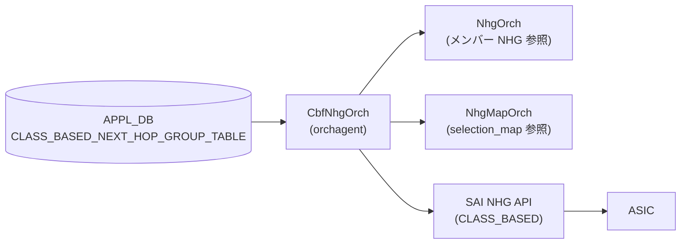

# CLASS_BASED_NEXT_HOP_GROUP テーブル

## 概要

Class Based Forwarding (CBF) 用のクラスベース次ホップグループを [APPL_DB](../../reference/glossary.md#term-appl_db) に保持するテーブル[^1]。`sonic-swss` の `CbfNhgOrch` が APPL_DB の `CLASS_BASED_NEXT_HOP_GROUP_TABLE` を購読し、SAI の `SAI_NEXT_HOP_GROUP_TYPE_CLASS_BASED` グループを作成・削除する。

CBF は DSCP/EXP 値から決定した Forwarding Class (FC) 値に基づいて、同じ宛先に対して複数の NHG のうちの 1 つへパケットをステアリングする機能[^2]。CBF NHG は通常 NHG (NEXT_HOP_GROUP) をメンバーとして持ち、`selection_map` によって FC 値と NHG メンバー (インデックス) の対応を定義する。

!!! note "fpmsyncd との関係"
    HLD Rev 0.2 の Restrictions 節に記載のとおり、標準の `fpmsyncd` はこのテーブルを書き込まない。本テーブルを利用するには修正版 fpmsyncd またはカスタムアプリケーションが APPL_DB に直接書き込む必要がある。

<!-- cdb-mermaid -->
### データフロー (自動生成)



!!! note "凡例"
    APPL_DB エントリを CbfNhgOrch が受信し、メンバー NHG および選択マップの存在を確認してから SAI へプログラムする。
<!-- /cdb-mermaid -->

## key 構造

```text
CLASS_BASED_NEXT_HOP_GROUP_TABLE|<name>
```

- `<name>`: CBF NHG を識別する任意の文字列 (プログラマが自由に決定)

## フィールド

| フィールド | 型 | デフォルト | 説明 |
|-----------|----|-----------|------|
| `members` | string (カンマ区切り) | **必須** | NEXT_HOP_GROUP_TABLE のエントリキーをカンマ区切りで列挙。宣言順に index 0 から割り当てられる |
| `selection_map` | string | **必須** | FC_TO_NHG_INDEX_MAP_TABLE のエントリキー。FC 値から members インデックスへのマッピングを指定 |

## 制約

- `members` は空にできない。空文字列を指定するとエラーログを出力してエントリを破棄する (`cbfnhgorch.cpp:223-227`)
- `members` 内のエントリは一意でなければならない。重複するとエラーログを出力してエントリを破棄する (`cbfnhgorch.cpp:231-235`)
- `selection_map` に指定した名前が `FC_TO_NHG_INDEX_MAP_TABLE` に存在しなければならない。存在しない場合は SAI 作成失敗 (`cbfnhgorch.cpp:321-325`)
- `selection_map` 内で参照される最大 NHG インデックス < `members` の数でなければならない (`cbfnhgorch.cpp:327-331`)
- 各メンバー NHG は `NEXT_HOP_GROUP_TABLE` に存在し、かつ sync 済みでなければならない。未 sync の場合は一時 NHG として扱い再試行される (`cbfnhgorch.cpp:644-660`)
- グループ総数は `gRouteOrch->getMaxNhgCount()` を超過できない (`cbfnhgorch.cpp:100`)

## SAI 属性マッピング

| フィールド / 属性 | SAI 属性 | ソース |
|---|---|---|
| グループ型 (固定値) | `SAI_NEXT_HOP_GROUP_TYPE_CLASS_BASED` | `cbfnhgorch.cpp:301-303` |
| `members` の数 | `SAI_NEXT_HOP_GROUP_ATTR_CONFIGURED_SIZE` | `cbfnhgorch.cpp:306-309` |
| `selection_map` → OID | `SAI_NEXT_HOP_GROUP_ATTR_SELECTION_MAP` | `cbfnhgorch.cpp:318-333` |
| 各 member の NHG OID | `SAI_NEXT_HOP_GROUP_MEMBER_ATTR_NEXT_HOP_ID` | `cbfnhgorch.cpp:733-735` |
| 各 member の 0-based index | `SAI_NEXT_HOP_GROUP_MEMBER_ATTR_INDEX` | `cbfnhgorch.cpp:738-739` |

## 購読者

- `CbfNhgOrch` (`sonic-swss/orchagent/cbf/cbfnhgorch.cpp`): APPL_DB `CLASS_BASED_NEXT_HOP_GROUP_TABLE` を購読して SAI CBF NHG を作成・更新・削除

## 関連 CONFIG_DB / CLI

- 関連 APPL_DB: `NEXT_HOP_GROUP_TABLE` (members として参照)、`FC_TO_NHG_INDEX_MAP_TABLE` (selection_map として参照)
- 関連 CONFIG_DB: `DSCP_TO_FC_MAP`、`EXP_TO_FC_MAP`
- CLI: なし (標準 CLI 未実装; カスタムアプリが APPL_DB に直接書き込む)

<!-- cdb-exceptions -->
## 例外条件・特殊挙動

| 条件 | 挙動 |
|------|------|
| `members` が空文字列 | `"CBF next hop group members list is empty"` を SWSS_LOG_ERROR 出力 + エントリ破棄 |
| `members` に重複エントリ | `"CBF next hop group members are not unique"` を SWSS_LOG_ERROR 出力 + エントリ破棄 |
| `selection_map` が存在しない | `"FC to NHG map index ... does not exist"` を SWSS_LOG_ERROR 出力 + sync 失敗 (タスクを保留) |
| selection_map の最大 NH index >= members.size() | `"FC to NHG map references more NHG members than exist"` を SWSS_LOG_ERROR 出力 + sync 失敗 |
| members の NHG 数 > 最大 FC 数 | `"More CBF NHG members configured than supported Forwarding Classes"` を SWSS_LOG_WARN 出力 (エラーではない、続行) |
| メンバー NHG が未 sync (一時 NHG) | sync を一時的に false 返却 → 次タスクループで再試行。一時 NHG が昇格するまで保留 |
| 参照 count > 0 の CBF NHG を削除しようとした | `"Skipping removal ... which is still referenced"` を SWSS_LOG_WARN 出力 + 削除スキップ |
| 存在しない CBF NHG を削除しようとした | `"Deleting inexistent CBF NHG"` を SWSS_LOG_WARN 出力 + 成功扱い (no-op) |
| DEL の後に SET が pending | DEL をスキップして SET を更新として処理 (`cbfnhgorch.cpp:152-155`) |
<!-- /cdb-exceptions -->

<!-- value-behavior -->
## 値依存挙動マトリクス

### `members` (string, カンマ区切り)

| 状態 | 挙動 | evidence |
|---|---|---|
| 空文字列 | エラーログ + エントリ破棄 | `cbfnhgorch.cpp:223-227` |
| 重複あり | エラーログ + エントリ破棄 | `cbfnhgorch.cpp:231-235` |
| メンバー NHG が一時 NHG | sync 保留 + 再試行 | `cbfnhgorch.cpp:116-119, 695-699` |
| 既存グループと同一順序 | NEXT_HOP 属性のみ更新 (member 再作成なし) | `cbfnhgorch.cpp:463-503` |
| 既存グループと異なる | 全 member を remove → 新メンバーで再 sync | `cbfnhgorch.cpp:516-553` |

### `selection_map` (string)

| 状態 | 挙動 | evidence |
|---|---|---|
| 存在しないマップ名 | `SAI_NULL_OBJECT_ID` → エラーログ + sync 失敗 | `cbfnhgorch.cpp:321-325` |
| 既存と同一 | SAI 更新なし | `cbfnhgorch.cpp:557` |
| 既存と異なる | `SAI_NEXT_HOP_GROUP_ATTR_SELECTION_MAP` を set_attribute で更新 + ref count 更新 | `cbfnhgorch.cpp:557-589` |
<!-- /value-behavior -->

<!-- ref-triangle:start -->

## 関連リファレンス

- APPL_DB: `NEXT_HOP_GROUP_TABLE`
- APPL_DB: `FC_TO_NHG_INDEX_MAP_TABLE`

<!-- ref-triangle:end -->

## 引用元

[^1]: `sonic-swss/orchagent/cbf/cbfnhgorch.cpp` (L38-200 `doTask()`, L249-262 `CbfNhg::CbfNhg()`, L287-376 `CbfNhg::sync()`, L453-593 `CbfNhg::update()`, L603-703 `CbfNhg::syncMembers()`, L714-743 `CbfNhg::createNhgmAttrs()`). <https://github.com/sonic-net/sonic-swss/blob/master/orchagent/cbf/cbfnhgorch.cpp>

[^2]: `SONiC/doc/cbf/cbf_hld.md` (Rev 0.2, 2021-08-26, 著者 Alexandru Banu). <https://github.com/sonic-net/SONiC/blob/master/doc/cbf/cbf_hld.md>

<!-- ops-hint -->
## 運用ヒント

### 典型値

- key 形式: `CLASS_BASED_NEXT_HOP_GROUP_TABLE|CbfNhg1`
- 最小構成: `members=Nhg1,Nhg2` + `selection_map=NhgMap1`
- members の順序が SAI member の index (0-based) に直接対応する

### よくある誤設定

- `selection_map` を先に `FC_TO_NHG_INDEX_MAP_TABLE` に登録せず CBF NHG を作成 → sync 失敗 (タスク保留)
- `selection_map` 内の最大 NH index >= members 数 → エラーログ + sync 失敗
- メンバー NHG を先に `NEXT_HOP_GROUP_TABLE` に登録せず参照 → 一時 NHG として保留・再試行される

### 確認コマンド

```bash
sonic-db-cli APPL_DB keys 'CLASS_BASED_NEXT_HOP_GROUP_TABLE:*'
sonic-db-cli APPL_DB hgetall 'CLASS_BASED_NEXT_HOP_GROUP_TABLE:CbfNhg1'
```
<!-- /ops-hint -->

<!-- defaults -->
## フィールド暗黙デフォルト (Phase A — コード由来)

YANG schema が存在しないため、デフォルトはコード (`cbfnhgorch.cpp`) の初期化から派生する。

| フィールド | コード由来デフォルト | fallback 源 | 備考 |
|-----------|-------------------|------------|------|
| `members` | **必須 (省略不可)** | `string members;` → 空文字列 → `getMembers()` がエラー返却 — `cbfnhgorch.cpp:61,82-90` | 空文字列はエラー破棄、デフォルト値なし |
| `selection_map` | **必須 (省略不可)** | `string selection_map;` → 空文字列 → `getMapId("")` が `SAI_NULL_OBJECT_ID` → sync 失敗 — `cbfnhgorch.cpp:75,321-325` | 存在しないマップ名はエラー、デフォルト値なし |

### 補足

- 両フィールドともコードの初期値は空文字列だが、空文字列ではエラーパスに入るため実質必須。
- YANG schema (sonic-cbf-nhg.yang 等) は現時点 (2026-05) で sonic-buildimage の yang-models ディレクトリに存在しない。
- member の 0-based index は宣言順に自動付与 (`CbfNhg::CbfNhg()` コンストラクタ) され、外部から指定するフィールドではない。
- `SAI_NEXT_HOP_GROUP_MEMBER_ATTR_INDEX` は `CREATE_ONLY` 属性のため、member 順序変更時は全 member を remove → 再 sync する仕様 (`cbfnhgorch.cpp:509-516`)。
<!-- /defaults -->
