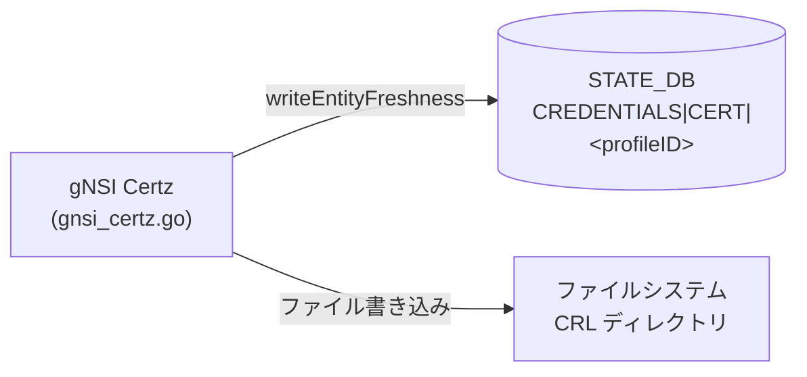

# CREDENTIALS|CERT テーブル (STATE_DB)

!!! note "STATE_DB テーブル"
    `CREDENTIALS|CERT` は **CONFIG_DB ではなく STATE_DB** に書き込まれる読み取り専用テーブルである。gNSI Certz サーバ (`gnsi_certz.go`) が証明書バンドルの更新時に自動書き込みする。オペレータは直接 CONFIG_DB を介して操作しない。

## 概要

`CREDENTIALS|CERT|<profileID>` は gNSI Certz (`sonic-gnmi/gnmi_server/gnsi_certz.go`) が各 SSL プロファイルの証明書バンドルフレッシュネス情報を [STATE_DB](../../reference/glossary.md#term-state_db) に記録するテーブルである[^1]。

gNSI Certz は gRPC 経由の `certz.Rotate` RPC で証明書を更新し、確定 (FinalizeRotation) 後に以下 4 種類のエンティティの `version` / `created_on` フィールドを書き込む:

| エンティティ | フィールド prefix |
|------------|----------------|
| サーバ証明書チェーン (X.509) | `certificate` |
| CA トラストバンドル | `ca_trust_bundle` |
| 証明書失効リストバンドル (CRL) | `certificate_revocation_list_bundle` |
| 認証ポリシー | `authentication_policy` |

デフォルトプロファイル名は `"gnxi"` で、起動時に `bootstrapDefaultProfile()` が自動生成する[^1]。

<!-- cdb-mermaid -->
### データフロー



!!! note "凡例"
    CONFIG_DB から SAI までの典型経路を `docs/reference/config-db-orch-map.md` から機械生成したミニ図。詳細・例外は本ページ本文と対応表を参照。
<!-- /cdb-mermaid -->

## key 構造

```text
CREDENTIALS|CERT|<profileID>
```

- `<profileID>` — SSL プロファイル識別子。デフォルトは `"gnxi"`

## フィールド

### `CREDENTIALS|CERT|<profileID>`

| フィールド | 型 | デフォルト | 説明 |
|-----------|----|-----------|------|
| `certificate_version` | string | `"V1"` (bootstrap) | サーバ証明書のバージョン文字列 |
| `certificate_created_on` | string (数値) | bootstrap 時の UnixNano 文字列 | サーバ証明書の作成タイムスタンプ (疑似ナノ秒) |
| `ca_trust_bundle_version` | string | `"V1"` (bootstrap) | CA トラストバンドルのバージョン |
| `ca_trust_bundle_created_on` | string (数値) | bootstrap 時の UnixNano 文字列 | CA トラストバンドルの作成タイムスタンプ |
| `certificate_revocation_list_bundle_version` | string | `"V1"` (bootstrap) | CRL バンドルのバージョン |
| `certificate_revocation_list_bundle_created_on` | string (数値) | bootstrap 時の UnixNano 文字列 | CRL バンドルの作成タイムスタンプ |
| `authentication_policy_version` | string | `"V1"` (bootstrap) | 認証ポリシーのバージョン |
| `authentication_policy_created_on` | string (数値) | bootstrap 時の UnixNano 文字列 | 認証ポリシーの作成タイムスタンプ |

## 制約

- `version` フィールドは Rotate RPC 時に空文字列不可 (`codes.InvalidArgument: "version cannot be empty"`)
- `created_on` フィールドは Rotate RPC 時に 0 不可 (`codes.InvalidArgument: "created_on cannot be empty"`)
- CA トラストバンドルの証明書は X.509 / PEM エンコードのみ受け付ける
- CRL バンドルは空不可

## 購読者

- `gnsi_certz.go` (`sonic-gnmi`): 証明書バンドル更新時に STATE_DB へ書き込む

## 関連 CONFIG_DB / YANG / CLI

- 関連 [CONFIG_DB](../../reference/glossary.md#term-config_db): [`GNMI`](gnmi.md) (`GNMI|certs` で証明書パスを設定), [`TELEMETRY`](telemetry.md)
- 関連 CLI: なし (gNSI Certz は gRPC `certz.Rotate` RPC 経由で設定)
- 関連 YANG: なし (community master には対応 YANG 未定義)

<!-- cdb-exceptions -->
## 例外条件・特殊挙動

- **STATE_DB 書き込みのみ**: 本テーブルは gNSI Certz が STATE_DB に書き込む。CONFIG_DB には書き込まない。`sonic-cfggen` / `config reload` の対象外
- **同時 Rotate 禁止**: `certzMu.TryLock()` による排他制御。並行 `certz.Rotate` RPC は `codes.Aborted: "concurrent certz.Rotate RPCs are not allowed"` で拒否される
- **`created_on` 疑似ナノ秒**: 格納値は `strconv.FormatUint(entity.CreatedOn, 10) + "000000000"` で生成される 19 桁以上の文字列。bootstrap では `time.Now().UnixNano()` (ナノ秒) をそのまま + `"000000000"` サフィックスを付加するため、実際の精度は秒未満まで記録される
- **CRL ディレクトリ管理**: `certificate_revocation_list_bundle` は DB フィールドのみでなく、`CertCRLConfig` ディレクトリ (デフォルト `/mtls/crl`) にもファイルとして保存される
- **bootstrap の `Final: true`**: `bootstrapDefaultProfile()` が生成する全エンティティは `Final: true` で初期化されるため、Rotate が失敗しても bootstrap 値へのロールバックは発生しない
<!-- /cdb-exceptions -->

<!-- ordering -->
## 書込み順依存 (Phase B)

`CREDENTIALS|CERT` は **STATE_DB** テーブルであり、`gnsi_certz.go` が gNSI Certz RPC の処理結果として書き込む。CONFIG_DB の書き込み順ではなく、**gRPC Rotate RPC の呼び出し順序・フラグ設定・systemd 起動順序**が STATE_DB の整合性に影響する。

### 検出された順序依存

| # | 依存関係 | 方向 | 緩和策 |
|---|----------|------|--------|
| 1 | `database.service` → `gnmi.service` 起動 | **強制先行**（systemd `After=database.service`） | STATE_DB 未起動時は書き込みエラー; 再起動で回復 |
| 2 | `entities[]` 配列先頭から順に STATE_DB 書き込み (cert → trust_bundle 等) | 配列順次 | 中間状態は短期; `revertProfile()` / `finalizeProfile()` で最終状態は一貫 |
| 3 | 配列後半エンティティのバリデーション失敗 → 前半は STATE_DB 書き込み済み | `revertProfile()` で回復 | `revertProfile()` が `writeEntityFreshness()` で STATE_DB を前回値に上書き |
| 4 | `finalizeProfile()` 内 Cert → TrustBundle → CrlBundle → AuthPolicy の固定順確定 | 固定順序 | `saveCertzMetadata()` 失敗時は再起動で旧 version が STATE_DB に反映 |
| 5 | `certzMu` により並行 Rotate は直列化 | 先着排他 | `TryLock` 失敗は即時 `codes.Aborted`; `defer Unlock` で必ず解放 |
| 6 | 物理ファイル更新 → STATE_DB 書き込み（`activateEntity()` 内の順序） | ファイル先・DB 後 | 再起動直後は `loadCertzMetadata` 由来の値が STATE_DB に反映 |
| 7 | `--cert_crl_dir` フラグ設定 → CRL Rotate 可能 | **起動時前提条件** | 未設定時は全 CRL Rotate が `codes.Aborted`; CONFIG_DB での動的変更不可 |

### 主要な制約詳細

**起動時 STATE_DB 書き込み (依存 #1)**: `NewGNSICertzServer()` (gnsi_certz.go:114) は起動直後に `loadCertzMetadata()` または `bootstrapDefaultProfile()` でプロファイルを初期化し、すべてのプロファイルの全 4 エンティティ (Cert / TrustBundle / CrlBundle / AuthPolicy) に対して `writeEntityFreshness()` を呼び出し STATE_DB へ書き込む (gnsi_certz.go:134-139)。`database.service` が先に起動していなければ書き込みは失敗する。systemd `gnmi.service` の `After=database.service` がこれを保証する (evidence: `gnsi_certz.go:114-159`, `files/build_templates/gnmi.service.j2:3-4`)。

**entities[] 配列順と中間状態 (依存 #2)**: `doUpload()` は `req.GetEntities()` を配列順にイテレートし、各エンティティに対して `saveEntities()` → `activateEntity()` → `writeEntityFreshness()` を順次実行する (gnsi_certz.go:388-428)。同一 Rotate ストリームで cert と trust_bundle を同時更新する場合、cert 更新済み・CA 未更新の期間が生じる。この期間中に gRPC クライアントが接続した場合は TLS ハンドシェイクが一時的に失敗する可能性がある (evidence: `gnsi_certz.go:381-429`)。

**revert による STATE_DB 復元 (依存 #3)**: 後半エンティティのバリデーション失敗や UploadRequest 処理エラー後、`Rotate()` は `revertProfile()` を実行する (gnsi_certz.go:274-276)。`revertProfile()` は `LastEntities` (Finalize 済みの前回値) を各エンティティの `writeEntityFreshness()` で STATE_DB に書き戻す (gnsi_certz.go:611, 620, 633, 641)。ただし revert 処理完了までの短期間は STATE_DB の値が中途半端な状態になる (evidence: `gnsi_certz.go:595-644`)。

**CRL の前提条件 (依存 #7)**: telemetry バイナリの起動引数 `--cert_crl_dir` が未設定 (`""`) の場合、CRL エンティティを含む Rotate RPC は `codes.Aborted: "CRL not configured"` で即時拒否される (gnsi_certz.go:405-407)。デフォルト値は `/mtls/crl` であり、ディレクトリが存在しない場合は起動時に `os.MkdirAll()` で自動作成される (gnsi_certz.go:143-149)。CONFIG_DB を介した動的変更はできず、再起動が必要 (evidence: `gnsi_certz.go:404-408`, `gnsi_certz.go:143-149`, `telemetry/telemetry.go:202`)。
<!-- /ordering -->

<!-- cross-refs -->
## 暗黙参照テーブル (Phase C)

`CREDENTIALS|CERT` は **STATE_DB への書き出し専用**テーブルであり、`gnsi_certz.go` が CONFIG_DB テーブルを直接読み込むことは **ゼロ**である。外部参照はすべてファイルシステムまたは systemd 起動順序依存となる。

| 参照先テーブル / リソース | 参照方向 | 条件 | evidence |
|--------------------------|---------|------|----------|
| `STATE_DB` (Redis インスタンス) | 書き出し専用 (`HSET`) | 常時 — `writeCredentialsMetadataToDB()` がすべての freshness フィールドを書き込む | `common_utils/notification_producer.go:16`; `gnsi_certz.go:1037-1058` |
| `database.service` (systemd) | 起動順序依存 (先行必須) | gnmi.service 起動前に STATE_DB (Redis) が必要。未起動なら `writeEntityFreshness()` でエラー | `gnmi.service.j2:3-4` (`After=database.service`) |
| ファイルシステム — `CertzMetaFile` (`/keys/grpc-version.json`) | 読み取り (JSON プロファイル永続化) | 起動時 `loadCertzMetadata()` でプロファイルを読み込む。ファイル不在時は `bootstrapDefaultProfile()` でゼロ初期化 | `gnsi_certz.go:126,727` |
| ファイルシステム — `CertCRLConfig` ディレクトリ (`/mtls/crl`) | 読み書き (CRL バンドルファイル) | CRL Rotate 時に `activateEntity()` がファイルを書き込む。未設定時は Rotate が `codes.Aborted` を返す | `gnsi_certz.go:144-151,204,405-407` |
| TLS シンボリックリンク (`SrvCertLnk` / `CaCertLnk` 等) | 書き出し (Rotate 確定時に更新) | `finalizeProfile()` が証明書シンボリックリンクを新パスへ切り替える。gnmi サーバの TLS 再ロードに影響 | `gnmi_server/server.go:429,452` |
| `GNMI` / `TELEMETRY` (CONFIG_DB) | 間接参照のみ (gnmi サーバ設定) | gnmi サーバ全体の設定を保持するが `gnsi_certz.go` は直接読まない。証明書パスは CLI フラグ経由 | `telemetry/telemetry.go:196-204` |

### 詳細

**CONFIG_DB 参照なし**: `writeCredentialsMetadataToDB()` は `common_utils.GetRedisDBClient()` (dbName=`"STATE_DB"`) で STATE_DB に直接接続し、`sc.HSet()` で書き込む (`notification_producer.go:16,95`)。CONFIG_DB への読み取りは一切発生しない。

**ファイルシステムが真の外部依存**: 証明書パス (`SrvCertLnk` / `CaCertLnk` / `SrvKeyLnk`) は telemetry バイナリの CLI フラグで指定され、gnmi コンテナ起動時に確定する。CONFIG_DB を介した動的変更は不可能であり、変更には再起動が必要。

**`GNMI|certs` 設定との分離**: `GNMI` テーブルは gnmi サーバのリスニングポート・VRF・証明書パス等を保持するが、`gnsi_certz.go` は `GNMI` テーブルを読まない。Certz Rotate で証明書ファイルを更新しても gnmi サーバが TLS 証明書を再ロードするタイミングは `server.go` の実装依存であり、`GNMI` テーブルへの書き戻しは発生しない。

詳細根拠は `meta/_intermediate/cdb-flow/certs-cross-refs.md` を参照。
<!-- /cross-refs -->

<!-- defaults -->
## コード由来の暗黙デフォルト (Phase A)

> gNSI Certz `gnsi_certz.go` および `telemetry/telemetry.go` のコードから導出した フィールドデフォルト値を整理する。

### `<profileID>` (CREDENTIALS|CERT key)

| 種別 | 値 | ソース |
|------|----|--------|
| コード由来デフォルト | `"gnxi"` | `gnsi_certz.go:30` — `defaultProfile` 定数 |

起動時に `bootstrapDefaultProfile()` が `profiles["gnxi"]` を生成する。プロファイルが既に JSON ファイル (`CertzMetaFile`) に存在する場合は上書きしない[^1]。

---

### `certificate_version`

| 種別 | 値 | ソース |
|------|----|--------|
| bootstrap 初期値 | `"V1"` | `gnsi_certz.go:188` — `bootstrapDefaultProfile()` |
| Rotate 後 | クライアント指定値 (必須、空文字不可) | `gnsi_certz.go:392-394` |

---

### `ca_trust_bundle_version`

| 種別 | 値 | ソース |
|------|----|--------|
| bootstrap 初期値 | `"V1"` | `gnsi_certz.go:195` — `bootstrapDefaultProfile()` |
| Rotate 後 | クライアント指定値 (必須、空文字不可) | `gnsi_certz.go:392-394` |

---

### `certificate_revocation_list_bundle_version`

| 種別 | 値 | ソース |
|------|----|--------|
| bootstrap 初期値 | `"V1"` | `gnsi_certz.go:202` — `bootstrapDefaultProfile()` |
| Rotate 後 | クライアント指定値 (必須、空文字不可) | `gnsi_certz.go:392-394` |

CRL バンドルが有効化されていない場合 (`CertCRLConfig == ""`): Rotate RPC は `codes.Aborted: "CRL not configured"` を返す[^1]。

---

### `authentication_policy_version`

| 種別 | 値 | ソース |
|------|----|--------|
| bootstrap 初期値 | `"V1"` | `gnsi_certz.go:209` — `bootstrapDefaultProfile()` |
| Rotate 後 | クライアント指定値 (必須、空文字不可) | `gnsi_certz.go:392-394` |

---

### `*_created_on` フィールド群

| 種別 | 値 | ソース |
|------|----|--------|
| bootstrap 初期値 | `time.Now().UnixNano()` の文字列 + `"000000000"` | `gnsi_certz.go:180,693-695` |
| Rotate 後 | `entityMsg.GetCreatedOn()` (秒) の文字列 + `"000000000"` | `gnsi_certz.go:693-695` |

格納形式: `strconv.FormatUint(entity.CreatedOn, 10) + "000000000"` (常に 19 桁以上の数値文字列)[^1]

---

### gNSI Certz 証明書ファイルパスデフォルト (CLI フラグ)

以下は `telemetry` バイナリのフラグデフォルト値であり、CONFIG_DB のフィールドではない。

| CLIフラグ | デフォルト値 | 対応フィールド |
|---------|-----------|--------------|
| `--ca_cert_lnk` | `/keys/ca_cert.lnk` | `Config.CaCertLnk` |
| `--server_cert_lnk` | `/keys/server_cert.lnk` | `Config.SrvCertLnk` |
| `--server_key_lnk` | `/keys/server_key.lnk` | `Config.SrvKeyLnk` |
| `--ca_crt` | `""` (省略可) | `Config.CaCertFile` |
| `--server_crt` | `""` (起動時に必須) | `Config.SrvCertFile` |
| `--server_key` | `""` (起動時に必須) | `Config.SrvKeyFile` |
| `--cert_crl_dir` | `/mtls/crl` | `Config.CertCRLConfig` |
| `--grpc_meta` | `/keys/grpc-version.json` | `Config.CertzMetaFile` |
| `--integrity_manifest_file` | `""` (省略可) | `Config.IntManFile` |

ソース: `telemetry/telemetry.go:196-204`[^2]

**パス自動調整**: `CaCertFile` が非空かつ `CaCertLnk` がデフォルト (`/keys/ca_cert.lnk`) の場合、`CaCertLnk` は `dir(CaCertFile)/ca_cert.lnk` に自動変更される。`SrvCertLnk` / `SrvKeyLnk` も同様[^2]。

<!-- evidence:
  sonic-gnmi/gnmi_server/gnsi_certz.go:29-49 — 定数 (certTbl="CERT", credentialsTbl="CREDENTIALS", フィールド名 prefix/suffix, defaultProfile="gnxi")
  sonic-gnmi/gnmi_server/gnsi_certz.go:178-222 — bootstrapDefaultProfile() (Version="V1", CreatedOn=time.Now().UnixNano())
  sonic-gnmi/gnmi_server/gnsi_certz.go:688-715 — writeEntityFreshness() (フィールド名生成, STATE_DB書き込み)
  sonic-gnmi/gnmi_server/gnsi_certz.go:1036-1058 — writeCredentialsMetadataToDB() (STATE_DB, path="CREDENTIALS|CERT|profileID")
  sonic-gnmi/common_utils/notification_producer.go:16 — dbName="STATE_DB"
  sonic-gnmi/common_utils/notification_producer.go:95-97 — GetKey() = strings.Join(k, "|")
  sonic-gnmi/telemetry/telemetry.go:196-204 — CLI フラグデフォルト値
  sonic-gnmi/telemetry/telemetry.go:303-313 — シンボリックリンクパス自動調整ロジック
  sonic-gnmi/gnmi_server/gnsi_certz.go:381-428 — doUpload() バリデーション
-->
<!-- /defaults -->

[^1]: `sonic-gnmi` `gnmi_server/gnsi_certz.go` — gNSI Certz 実装。defaultProfile, bootstrapDefaultProfile, writeEntityFreshness, writeCredentialsMetadataToDB
[^2]: `sonic-gnmi` `telemetry/telemetry.go` — CLI フラグデフォルトと CertzMetaFile パス設定ロジック
