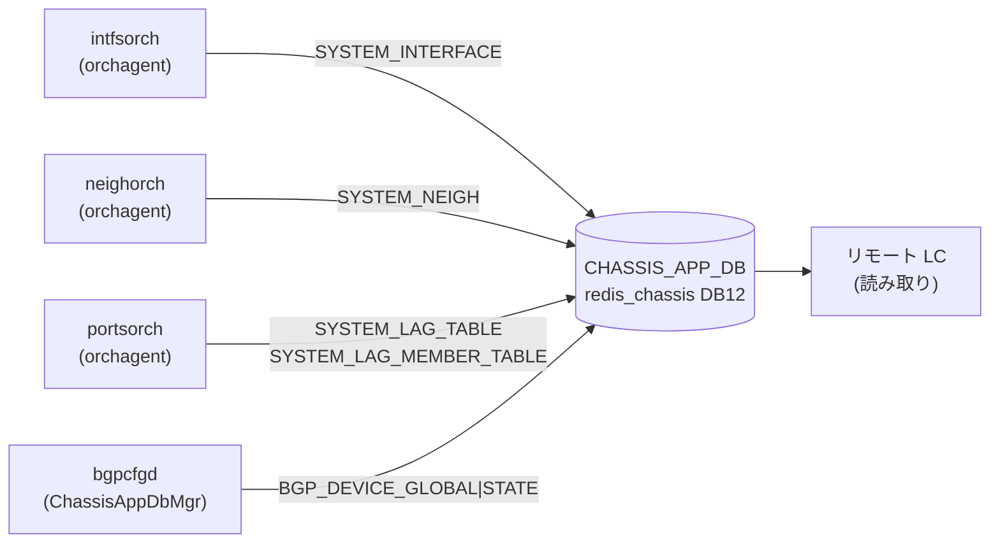

# CHASSIS_APP_DB テーブル群

## 概要

`CHASSIS_APP_DB` は VoQ (Virtual Output Queue) チャシスシステム専用の [Redis](../../reference/glossary.md#term-redis) DB（DB id=12、instance=`redis_chassis`）。チャシス内の全ラインカードが**中央スーパーバイザーの `redis_chassis`** を共有し、ラインカード間でシステムポート・インタフェース・ネイバー・LAG の情報を同期するために使用する[^1]。

非 VoQ 環境（`DEVICE_METADATA.localhost.switch_type != "voq"`）では `isChassisDbInUse()` が false を返し、これらのテーブルへの書き込みはすべてスキップされる。

<!-- cdb-mermaid -->
### データフロー (自動生成)



<!-- defaults -->
## 暗黙デフォルト・コード由来挙動 (Phase A)

> 調査対象: `sonic-swss/orchagent/intfsorch.cpp`, `neighorch.cpp`, `portsorch.cpp`, `lagids.lua`, `sonic-buildimage/src/sonic-bgpcfgd/bgpcfgd/managers_chassis_app_db.py`, `managers_device_global.py`
> 調査日: 2026-05-14

### SYSTEM_INTERFACE テーブル

| フィールド | YANG default | 実装上の暗黙デフォルト / fallback | 備考 |
|-----------|-------------|----------------------------------|------|
| `oper_status` | なし (YANG 定義外) | `port.m_oper_status == SAI_PORT_OPER_STATUS_UP ? "up" : "down"` で決定 | `intfsorch.cpp:1708`。SAI 初期化前またはリモートポートの場合は書き込み自体をスキップ |

**書き込み条件**:
- `isChassisDbInUse()` が true
- ローカルポートのインタフェース ADD 時 (`voqSyncAddIntf()`)
- 非ローカルポート（`SAI_SYSTEM_PORT_TYPE_REMOTE`）はスキップ (`intfsorch.cpp:1689`)
- LAG の場合は `m_system_lag_info.switch_id == gVoqMySwitchId` のみ書き込み

### SYSTEM_NEIGH テーブル

| フィールド | YANG default | 実装上の暗黙デフォルト / fallback | 備考 |
|-----------|-------------|----------------------------------|------|
| `encap_index` | なし | SAI `get_neighbor_entry_attribute(SAI_NEIGHBOR_ENTRY_ATTR_ENCAP_INDEX)` の返り値 | `neighorch.cpp:2595-2606`。`0` の場合は無効値としてエントリ全体の書き込みをスキップ (`neighorch.cpp:2608-2612`) |
| `neigh` | なし | ネイバーの MAC アドレス (`mac.to_string()`) | `neighorch.cpp:2650`。`encap_index == 0` の場合は書き込まれない |

### SYSTEM_LAG_TABLE テーブル

| フィールド | YANG default | 実装上の暗黙デフォルト / fallback | 備考 |
|-----------|-------------|----------------------------------|------|
| `lag_id` | なし | `LagIdAllocator::lagIdAdd()` が `SYSTEM_LAG_ID_TABLE` + `SYSTEM_LAG_IDS_FREE_LIST` Lua スクリプトで払い出す値 | `portsorch.cpp:11155`。フリーリストが空の場合 `LAG_ID_ALLOCATOR_ERROR_TABLE_FULL (-1)` を返しエラー |
| `switch_id` | なし | `gVoqMySwitchId` (ローカルスイッチの VoQ ID) | `portsorch.cpp:11158`。ローカル LAG のみ書き込み |

**書き込み条件**:
- `gMultiAsicVoq` が true かつ `switch_id == gVoqMySwitchId` のローカル LAG のみ (`portsorch.cpp:11145-11149`)

### SYSTEM_LAG_MEMBER_TABLE テーブル

| フィールド | YANG default | 実装上の暗黙デフォルト / fallback | 備考 |
|-----------|-------------|----------------------------------|------|
| `status` | なし | LAG メンバー追加時に caller が渡すステータス文字列 | `portsorch.cpp:11188`。値は LAG メンバーの oper 状態変化時に再書き込みで上書きされる |

### BGP_DEVICE_GLOBAL|STATE テーブル

| フィールド | YANG default | 実装上の暗黙デフォルト / fallback | 備考 |
|-----------|-------------|----------------------------------|------|
| `tsa_enabled` | なし | キー不在時または例外時は `"false"` | `managers_device_global.py:239`。`device_info.is_chassis()` が `False` の場合も即座に `"false"` を返す (`managers_device_global.py:241-242`) |

**ChassisAppDbMgr の動作**:
- `lc_tsa == "false"` のときのみ `isolate_unisolate_device(data["tsa_enabled"])` を呼び出す。LC 側の TSA 状態がスーパーバイザー TSA より優先される (`managers_chassis_app_db.py:41-44`)

### LAG ID 管理用 Redis 生 KEY

`CHASSIS_APP_DB` には標準テーブル形式でない Redis key が直接書き込まれる:

| Redis Key | 型 | 役割 | コード根拠 |
|-----------|-----|------|-----------|
| `SYSTEM_LAG_ID_START` | string | LAG ID 割り当て範囲下限（初期化スクリプトが書き込む） | `lagids.lua:15` |
| `SYSTEM_LAG_ID_END` | string | LAG ID 割り当て範囲上限（初期化スクリプトが書き込む） | `lagids.lua:16` |
| `SYSTEM_LAG_ID_TABLE` | hash | `pcname → lag_id` マッピング | `lagids.lua:22,45,78,90` |
| `SYSTEM_LAG_ID_SET` | set | 現在割り当て済み lag_id セット（重複防止） | `lagids.lua:43,46,68` |
| `SYSTEM_LAG_IDS_FREE_LIST` | list | 未割り当て lag_id フリーリスト | `lagids.lua:41,44,60,63` |

`SYSTEM_LAG_ID_START` / `SYSTEM_LAG_ID_END` の実際の値はプラットフォーム設定による（テスト環境では `1`/`2`）。

<!-- ordering -->
## 書込み順依存 (Phase B)

> 調査証跡: `meta/_intermediate/cdb-flow/chassis-app-ordering.md`

### 起動シーケンスと先行条件

CHASSIS_APP_DB への書き込みはすべて `gMultiAsicVoq == true`（＝`isChassisDbInUse()` が true）が前提。このフラグは orchagent 起動時に `DEVICE_METADATA.localhost.switch_type == "voq"` かつ `isChassisAppDbPresent()` の両方が成立した場合にのみ立つ (`main.cpp:727`)。接続失敗時は standalone VOQ モードとなり書き込みは行われない。

```
CONFIG_DB.DEVICE_METADATA (switch_type=voq)
  → isChassisAppDbPresent() == true
    → gMultiAsicVoq = true
    → chassis_app_db = DBConnector("CHASSIS_APP_DB", 0, true)  [main.cpp:730]
      ↓
OrchDaemon::init():
  PortsOrch(chassisAppDb)   # SYSTEM_LAG_TABLE / SYSTEM_LAG_MEMBER_TABLE テーブル登録 [orchdaemon.cpp:232]
  IntfsOrch(chassisAppDb)   # SYSTEM_INTERFACE テーブル登録 [orchdaemon.cpp:296]
  NeighOrch(chassisAppDb)   # SYSTEM_NEIGH テーブル登録    [orchdaemon.cpp:298]
```

### SET 時の先行必須条件

| テーブル | 先行必須条件 | ブロック時の挙動 | コード根拠 |
|---------|------------|----------------|-----------|
| `SYSTEM_INTERFACE` | `PortInitDone` 受信済み (`addSystemPorts()` 完了) かつ port が `m_portList` に登録済み | `gPortsOrch->getPort()` 失敗 → `SWSS_LOG_ERROR` のみでスキップ（リトライなし） | `intfsorch.cpp:1676-1681` |
| `SYSTEM_INTERFACE` | ポートがローカルシステムポート (`SAI_SYSTEM_PORT_TYPE_REMOTE` でない) | リモートポートはスキップ（無エラー）| `intfsorch.cpp:1689-1692` |
| `SYSTEM_LAG_TABLE` | `gMultiAsicVoq == true` かつ LAG の `switch_id == gVoqMySwitchId` | ローカル LAG でなければスキップ | `portsorch.cpp:11145-11148` |
| `SYSTEM_LAG_TABLE` | `SYSTEM_LAG_ID_START` / `SYSTEM_LAG_ID_END` が chassis_app_db に書き込み済み（初期化スクリプトが担保） | フリーリスト空 → `LAG_ID_ALLOCATOR_ERROR_TABLE_FULL (-1)` でエラー | `lagids.lua:15-16, portsorch.cpp:11155` |
| `SYSTEM_LAG_MEMBER_TABLE` | 対応する LAG が `SYSTEM_LAG_TABLE` に登録済み (`voqSyncAddLag` 完了後) | LAG の `switch_id` 不一致でスキップ | `portsorch.cpp:11183-11186` |
| `SYSTEM_NEIGH` | RIF が存在 (`IntfsOrch::addIntf()` 完了) かつ SAI `encap_index != 0` | `encap_index == 0` → エントリ書き込みをスキップ（無エラー） | `neighorch.cpp:2608-2612` |
| `BGP_DEVICE_GLOBAL\|STATE` | bgpcfgd が supervisor の CHASSIS_APP_DB を購読中 かつ LC 側 `tsa_enabled == "false"` | lc_tsa != "false" の場合は `isolate_unisolate_device()` を呼ばず上書きしない | `managers_chassis_app_db.py:40-44` |

### PortInitDone ゲートの詳細

PortsOrch は `PortInitDone` メッセージを受け取るまでポートリストを確定させない:

```
portsyncd → APP_DB:"PORT|PortConfigDone" (count=N)
  → APP_DB:"PORT|PortInitDone"
    → PortsOrch::doTask(): addSystemPorts()  # APPL_DB.APP_SYSTEM_PORT_TABLE から登録
    → m_initDone = true → allPortsReady() = true
      ↓
IntfsOrch::addIntf() → voqSyncAddIntf() で SYSTEM_INTERFACE を書き込み可能になる
```

`voqSyncAddIntf()` 内で `gPortsOrch->getPort()` が失敗した場合はログのみで書き込みをスキップする（`task_need_retry` ではなく静的スキップ）。`PortInitDone` 前にインタフェース追加イベントが到達しても SYSTEM_INTERFACE への書き込みは行われない点に注意。

### warm-reboot での挙動

CHASSIS_APP_DB (redis_chassis) は supervisor 側で保持されるため、**ラインカード orchagent の warm-reboot 中も既存エントリは残存する**。orchagent は `warmRestoreAndSyncUp()` 内で 3 回ループ `doTask()` を実行し、bake() で読み込んだ既存 APP_DB データを再処理して SET を冪等に上書きする (`orchdaemon.cpp:1099-1139`)。

```
WarmStart::isWarmStart() == true
  → PortsOrch::bake(): APP_DB "PORT|PortConfigDone" + "PORT|PortInitDone" の存在確認
    → 存在すれば warm-reboot モード (既存ポートを m_pendingPortSet に投入)
    → 存在しなければ コールドスタートに fallback (cleanPortTable)
  → 3回 doTask() ループ:
    - 1st: SwitchOrch / PortsOrch (port 初期化・hostif 作成)
    - 2nd: port 設定 (speed/mtu/fec) + IntfsOrch / NeighOrch
    - 3rd: 残余データドレイン
  → onWarmBootEnd():
    - m_isWarmRestoreStage = false
    - refreshPortStatus() → voqSyncIntfState() で SYSTEM_INTERFACE.oper_status を再書き込み
```

`m_isWarmRestoreStage == true` の期間は `postPortInit()` がスキップされる (`portsorch.cpp:4076`)。`onWarmBootEnd()` 後に oper_status が更新されるため、**warm-reboot 直後は SYSTEM_INTERFACE の oper_status が一時的に古い値を持つ可能性がある**。

### chassisd クリーンアップとの関係

ラインカードが down しても supervisor の `chassisd` は `CHASSIS_DB_CLEANUP_MODULE_DOWN_PERIOD = 30` 分待機してからエントリを削除する (`chassisd:90,676`)。warm-reboot は通常 30 分以内に完了するため、**warm-reboot の場合はクリーンアップが実行されず既存エントリが保護される**。

### DEL 時の順序制約

`voqSyncDelIntf()` / `voqSyncDelLag()` / `voqSyncDelLagMember()` はいずれも参照先の存在チェックなしに `del()` を実行する。CHASSIS_APP_DB への DEL は依存関係なしで任意のタイミングで発行可能。ただし `SYSTEM_LAG_TABLE` エントリを DEL すると対応する LAG ID が `SYSTEM_LAG_IDS_FREE_LIST` に戻り再利用される点に注意。

<!-- /ordering -->

<!-- cross-refs -->
## 暗黙参照テーブル (Phase C)

> 調査証跡: `meta/_intermediate/cdb-flow/chassis-app-cross-refs.md`

CHASSIS_APP_DB 各テーブルへの書き込みが依存する他テーブル・DB の参照関係を示す。

| # | 依存方向 | 参照元 | 参照先テーブル | 依存内容 | 証跡 |
|---|----------|--------|--------------|---------|------|
| 1 | CONFIG_DB → CHASSIS_APP_DB (全体ゲート) | `DEVICE_METADATA.localhost.switch_type` | CHASSIS_APP_DB 全テーブル | `switch_type != "voq"` または `/etc/sonic/database_config.json` に `CHASSIS_APP_DB` 不在時は書き込み一切なし | `main.cpp:694-730` |
| 2 | CONFIG_DB → SYSTEM_LAG_TABLE | `DEVICE_METADATA.localhost.switch_id` | `SYSTEM_LAG_TABLE.switch_id` 値 | ローカル LAG か否かの判定 (`gVoqMySwitchId`) に使用。起動時一度のみ読み取り | `main.cpp:305-313`, `portsorch.cpp:11141-11148` |
| 3 | APPL_DB → CHASSIS_APP_DB (書き込みトリガ) | `APP_SYSTEM_PORT_TABLE` (PortInitDone 後) | `SYSTEM_INTERFACE` | ポートリスト (`m_portList`) 未完成時は `gPortsOrch->getPort()` 失敗 → 書き込みスキップ | `portsorch.cpp:10864-10870`, `intfsorch.cpp:1676-1681` |
| 4 | CONFIG_DB → CHASSIS_APP_DB (初期化スクリプト経由) | `SYSTEM_PORT` (暗黙的) | `SYSTEM_LAG_ID_START` / `SYSTEM_LAG_ID_END` | LAG ID 割り当て範囲の初期化。未初期化時は `lagIdAdd()` が `LAG_ID_ALLOCATOR_ERROR_TABLE_FULL (-1)` を返し addLag 失敗 | `lagids.lua:15-16`, `portsorch.cpp:7974-7983` |
| 5 | CONFIG_DB → CHASSIS_APP_DB (適用ガード) | `BGP_DEVICE_GLOBAL.tsa_enabled` (LC 側) | `BGP_DEVICE_GLOBAL\|STATE` | LC 側 TSA が `"true"` の場合、supervisor からの `tsa_enabled` 変更を `isolate_unisolate_device()` に渡さずブロック | `managers_chassis_app_db.py:40-44` |
| 6 | CHASSIS_APP_DB 内 (LAG → LAG_MEMBER) | `SYSTEM_LAG_TABLE` | `SYSTEM_LAG_MEMBER_TABLE` | LAG が `voqSyncAddLag()` 完了前は `switch_id` 未設定 → `voqSyncAddLagMember()` がスキップ | `portsorch.cpp:11179-11193` |
| 7 | CHASSIS_STATE_DB → CHASSIS_APP_DB (DEL トリガ) | `CHASSIS_MODULE_TABLE` (oper_status 変化) | CHASSIS_APP_DB 全テーブル | モジュール down 検知から 30 分後に `_cleanup_chassis_app_db()` が Lua スクリプトでパターン削除 | `chassisd:593-658,89-90` |

### 依存 #1 の詳細 (switch_type ゲート)

起動時に `getCfgSwitchType()` が `DEVICE_METADATA.localhost.switch_type` を読み取り `gMySwitchType` を決定する。`gMySwitchType == "voq"` かつ `isChassisAppDbPresent()` (= `/etc/sonic/database_config.json` に `CHASSIS_APP_DB` キーが存在) の両方が成立した場合のみ `gMultiAsicVoq = true` となり CHASSIS_APP_DB への接続が確立される (`main.cpp:725-730`)。いずれかが欠如した場合、`gMultiAsicVoq` は false のままとなりすべての `voqSync*()` 関数は即時 return する（エラーログなし）。

### 依存 #5 の詳細 (LC TSA ガード)

`ChassisAppDbMgr` は初期化時に `CONFIG_DB.BGP_DEVICE_GLOBAL.tsa_enabled` を `subscribe()` で監視し `self.lc_tsa` を更新する (`managers_chassis_app_db.py:20`)。supervisor が `CHASSIS_APP_DB.BGP_DEVICE_GLOBAL|STATE` を SET すると `set_handler()` が呼ばれるが、`self.lc_tsa != "false"` の場合は `isolate_unisolate_device()` を呼び出さない。これにより **LC 側の TSA 状態が supervisor の TSA より優先** される。LC 側が TSA 中 (`tsa_enabled = "true"`) の間はスーパーバイザーからの unisolate 指示を無視する (`managers_chassis_app_db.py:41-44`)。

<!-- /cross-refs -->

## キー構造

| テーブル | Redis キー形式 | 例 |
|---------|--------------|-----|
| `SYSTEM_INTERFACE` | `SYSTEM_INTERFACE\|<system_port_alias>` | `SYSTEM_INTERFACE\|Linecard1\|Ethernet0` |
| `SYSTEM_NEIGH` | `SYSTEM_NEIGH\|<system_port_alias>\|<ip_address>` | `SYSTEM_NEIGH\|Linecard1\|Ethernet0\|192.0.2.1` |
| `SYSTEM_LAG_TABLE` | `SYSTEM_LAG_TABLE\|<system_lag_alias>` | `SYSTEM_LAG_TABLE\|Linecard1\|PortChannel1` |
| `SYSTEM_LAG_MEMBER_TABLE` | `SYSTEM_LAG_MEMBER_TABLE\|<lag_alias>:<port_alias>` | `SYSTEM_LAG_MEMBER_TABLE\|Linecard1\|PortChannel1:Linecard1\|Ethernet0` |
| `BGP_DEVICE_GLOBAL\|STATE` | `BGP_DEVICE_GLOBAL\|STATE` | — |

## 適用条件 (使用前提)

1. **VoQ チャシス専用** — `DEVICE_METADATA.localhost.switch_type = "voq"` および `isChassisDbInUse()` が `true` の環境のみ有効
2. **redis_chassis** — 通常の `redis` (DB4 の CONFIG_DB) とは異なる Redis instance (`redis_chassis.server:6380`) 上の DB12 を使用
3. **supervisor から読み取り** — スーパーバイザーが全ラインカードの情報を集約し、ラインカードはリモートポートの情報をこの DB から購読する

## モジュール down 時のクリーンアップ

モジュール（ラインカード）が down した場合、`chassisd` は **30 分待機後** に `_cleanup_chassis_app_db()` を実行し、該当ラインカードに関連する以下のエントリを Lua スクリプトで一括削除する[^2]:

- `SYSTEM_NEIGH*` (パターン一致)
- `SYSTEM_INTERFACE*` (パターン一致)
- `SYSTEM_LAG_MEMBER_TABLE*` (パターン一致)
- `SYSTEM_LAG_TABLE*` (host/asic パターン一致)
- `SYSTEM_LAG_ID_TABLE` の対応エントリ + `SYSTEM_LAG_ID_SET` / `SYSTEM_LAG_IDS_FREE_LIST` の再整理

## 引用元

[^1]: `sonic-swss-common/common/schema.h:411-414` @ 158de8d3463ff4b841653f6d57190bb142b80d9c — テーブル名定数 `CHASSIS_APP_SYSTEM_INTERFACE_TABLE_NAME`, `CHASSIS_APP_SYSTEM_NEIGH_TABLE_NAME`, `CHASSIS_APP_LAG_TABLE_NAME`, `CHASSIS_APP_LAG_MEMBER_TABLE_NAME`
[^2]: `sonic-platform-daemons/sonic-chassisd/scripts/chassisd:593-658` @ 4ba9612 — `_cleanup_chassis_app_db()` の実装
