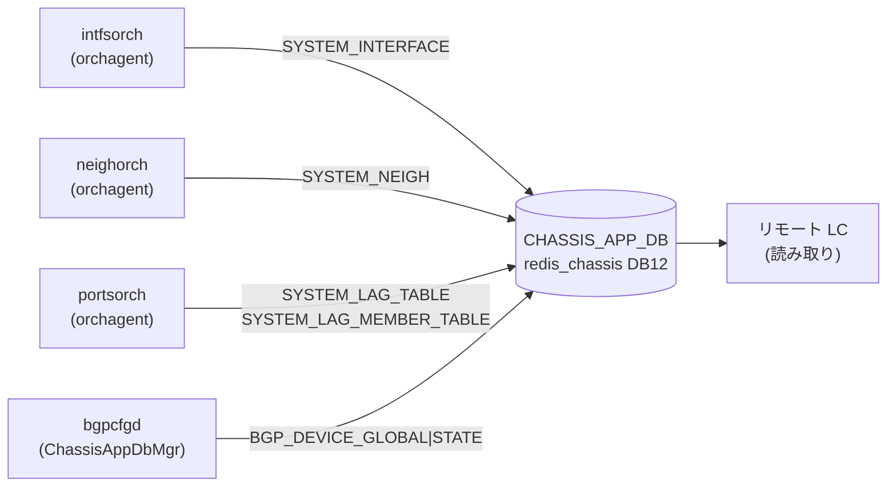

# CHASSIS_APP_DB テーブル群

## 概要

`CHASSIS_APP_DB` は VoQ (Virtual Output Queue) チャシスシステム専用の [Redis](../../reference/glossary.md#term-redis) DB（DB id=12、instance=`redis_chassis`）。チャシス内の全ラインカードが**中央スーパーバイザーの `redis_chassis`** を共有し、ラインカード間でシステムポート・インタフェース・ネイバー・LAG の情報を同期するために使用する[^1]。

非 VoQ 環境（`DEVICE_METADATA.localhost.switch_type != "voq"`）では `isChassisDbInUse()` が false を返し、これらのテーブルへの書き込みはすべてスキップされる。

<!-- cdb-mermaid -->
### データフロー (自動生成)

<!-- defaults -->
## 暗黙デフォルト・コード由来挙動 (Phase A)

> 調査対象: `sonic-swss/orchagent/intfsorch.cpp`, `neighorch.cpp`, `portsorch.cpp`, `lagids.lua`, `sonic-buildimage/src/sonic-bgpcfgd/bgpcfgd/managers_chassis_app_db.py`, `managers_device_global.py`
> 調査日: 2026-05-14

### SYSTEM_INTERFACE テーブル

| フィールド | YANG default | 実装上の暗黙デフォルト / fallback | 備考 |
|-----------|-------------|----------------------------------|------|
| `oper_status` | なし (YANG 定義外) | `port.m_oper_status == SAI_PORT_OPER_STATUS_UP ? "up" : "down"` で決定 | `intfsorch.cpp:1708`。SAI 初期化前またはリモートポートの場合は書き込み自体をスキップ |

**書き込み条件**:
- `isChassisDbInUse()` が true
- ローカルポートのインタフェース ADD 時 (`voqSyncAddIntf()`)
- 非ローカルポート（`SAI_SYSTEM_PORT_TYPE_REMOTE`）はスキップ (`intfsorch.cpp:1689`)
- LAG の場合は `m_system_lag_info.switch_id == gVoqMySwitchId` のみ書き込み

### SYSTEM_NEIGH テーブル

| フィールド | YANG default | 実装上の暗黙デフォルト / fallback | 備考 |
|-----------|-------------|----------------------------------|------|
| `encap_index` | なし | SAI `get_neighbor_entry_attribute(SAI_NEIGHBOR_ENTRY_ATTR_ENCAP_INDEX)` の返り値 | `neighorch.cpp:2595-2606`。`0` の場合は無効値としてエントリ全体の書き込みをスキップ (`neighorch.cpp:2608-2612`) |
| `neigh` | なし | ネイバーの MAC アドレス (`mac.to_string()`) | `neighorch.cpp:2650`。`encap_index == 0` の場合は書き込まれない |

### SYSTEM_LAG_TABLE テーブル

| フィールド | YANG default | 実装上の暗黙デフォルト / fallback | 備考 |
|-----------|-------------|----------------------------------|------|
| `lag_id` | なし | `LagIdAllocator::lagIdAdd()` が `SYSTEM_LAG_ID_TABLE` + `SYSTEM_LAG_IDS_FREE_LIST` Lua スクリプトで払い出す値 | `portsorch.cpp:11155`。フリーリストが空の場合 `LAG_ID_ALLOCATOR_ERROR_TABLE_FULL (-1)` を返しエラー |
| `switch_id` | なし | `gVoqMySwitchId` (ローカルスイッチの VoQ ID) | `portsorch.cpp:11158`。ローカル LAG のみ書き込み |

**書き込み条件**:
- `gMultiAsicVoq` が true かつ `switch_id == gVoqMySwitchId` のローカル LAG のみ (`portsorch.cpp:11145-11149`)

### SYSTEM_LAG_MEMBER_TABLE テーブル

| フィールド | YANG default | 実装上の暗黙デフォルト / fallback | 備考 |
|-----------|-------------|----------------------------------|------|
| `status` | なし | LAG メンバー追加時に caller が渡すステータス文字列 | `portsorch.cpp:11188`。値は LAG メンバーの oper 状態変化時に再書き込みで上書きされる |

### BGP_DEVICE_GLOBAL|STATE テーブル

| フィールド | YANG default | 実装上の暗黙デフォルト / fallback | 備考 |
|-----------|-------------|----------------------------------|------|
| `tsa_enabled` | なし | キー不在時または例外時は `"false"` | `managers_device_global.py:239`。`device_info.is_chassis()` が `False` の場合も即座に `"false"` を返す (`managers_device_global.py:241-242`) |

**ChassisAppDbMgr の動作**:
- `lc_tsa == "false"` のときのみ `isolate_unisolate_device(data["tsa_enabled"])` を呼び出す。LC 側の TSA 状態がスーパーバイザー TSA より優先される (`managers_chassis_app_db.py:41-44`)

### LAG ID 管理用 Redis 生 KEY

`CHASSIS_APP_DB` には標準テーブル形式でない Redis key が直接書き込まれる:

| Redis Key | 型 | 役割 | コード根拠 |
|-----------|-----|------|-----------|
| `SYSTEM_LAG_ID_START` | string | LAG ID 割り当て範囲下限（初期化スクリプトが書き込む） | `lagids.lua:15` |
| `SYSTEM_LAG_ID_END` | string | LAG ID 割り当て範囲上限（初期化スクリプトが書き込む） | `lagids.lua:16` |
| `SYSTEM_LAG_ID_TABLE` | hash | `pcname → lag_id` マッピング | `lagids.lua:22,45,78,90` |
| `SYSTEM_LAG_ID_SET` | set | 現在割り当て済み lag_id セット（重複防止） | `lagids.lua:43,46,68` |
| `SYSTEM_LAG_IDS_FREE_LIST` | list | 未割り当て lag_id フリーリスト | `lagids.lua:41,44,60,63` |

`SYSTEM_LAG_ID_START` / `SYSTEM_LAG_ID_END` の実際の値はプラットフォーム設定による（テスト環境では `1`/`2`）。

## キー構造

| テーブル | Redis キー形式 | 例 |
|---------|--------------|-----|
| `SYSTEM_INTERFACE` | `SYSTEM_INTERFACE\|<system_port_alias>` | `SYSTEM_INTERFACE\|Linecard1\|Ethernet0` |
| `SYSTEM_NEIGH` | `SYSTEM_NEIGH\|<system_port_alias>\|<ip_address>` | `SYSTEM_NEIGH\|Linecard1\|Ethernet0\|192.0.2.1` |
| `SYSTEM_LAG_TABLE` | `SYSTEM_LAG_TABLE\|<system_lag_alias>` | `SYSTEM_LAG_TABLE\|Linecard1\|PortChannel1` |
| `SYSTEM_LAG_MEMBER_TABLE` | `SYSTEM_LAG_MEMBER_TABLE\|<lag_alias>:<port_alias>` | `SYSTEM_LAG_MEMBER_TABLE\|Linecard1\|PortChannel1:Linecard1\|Ethernet0` |
| `BGP_DEVICE_GLOBAL\|STATE` | `BGP_DEVICE_GLOBAL\|STATE` | — |

## 適用条件 (使用前提)

1. **VoQ チャシス専用** — `DEVICE_METADATA.localhost.switch_type = "voq"` および `isChassisDbInUse()` が `true` の環境のみ有効
2. **redis_chassis** — 通常の `redis` (DB4 の CONFIG_DB) とは異なる Redis instance (`redis_chassis.server:6380`) 上の DB12 を使用
3. **supervisor から読み取り** — スーパーバイザーが全ラインカードの情報を集約し、ラインカードはリモートポートの情報をこの DB から購読する

## モジュール down 時のクリーンアップ

モジュール（ラインカード）が down した場合、`chassisd` は **30 分待機後** に `_cleanup_chassis_app_db()` を実行し、該当ラインカードに関連する以下のエントリを Lua スクリプトで一括削除する[^2]:

- `SYSTEM_NEIGH*` (パターン一致)
- `SYSTEM_INTERFACE*` (パターン一致)
- `SYSTEM_LAG_MEMBER_TABLE*` (パターン一致)
- `SYSTEM_LAG_TABLE*` (host/asic パターン一致)
- `SYSTEM_LAG_ID_TABLE` の対応エントリ + `SYSTEM_LAG_ID_SET` / `SYSTEM_LAG_IDS_FREE_LIST` の再整理

## 引用元

[^1]: `sonic-swss-common/common/schema.h:411-414` @ 158de8d3463ff4b841653f6d57190bb142b80d9c — テーブル名定数 `CHASSIS_APP_SYSTEM_INTERFACE_TABLE_NAME`, `CHASSIS_APP_SYSTEM_NEIGH_TABLE_NAME`, `CHASSIS_APP_LAG_TABLE_NAME`, `CHASSIS_APP_LAG_MEMBER_TABLE_NAME`
[^2]: `sonic-platform-daemons/sonic-chassisd/scripts/chassisd:593-658` @ 4ba9612 — `_cleanup_chassis_app_db()` の実装
